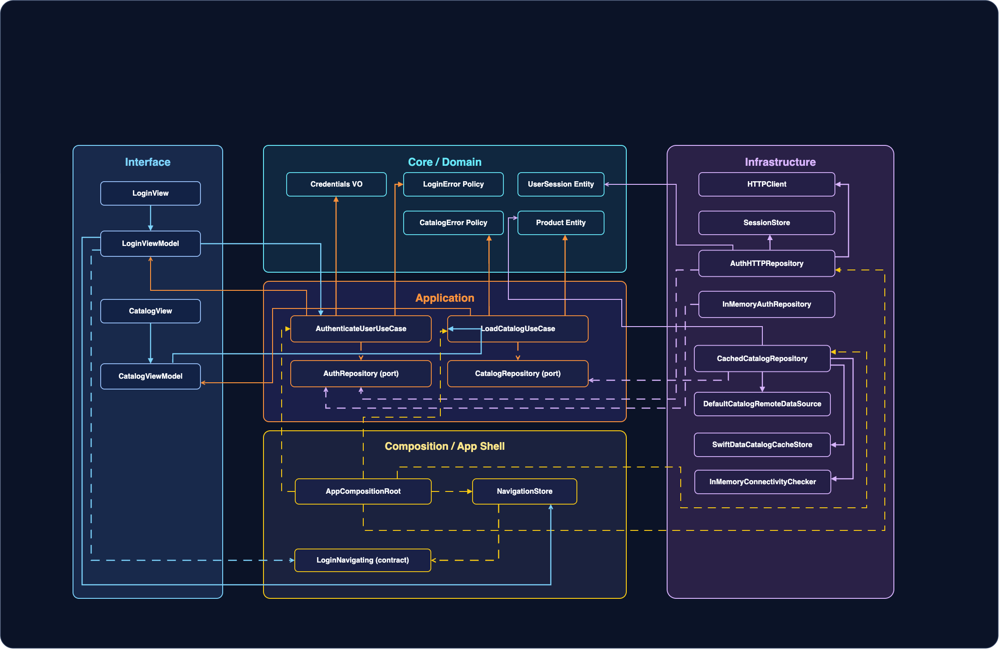
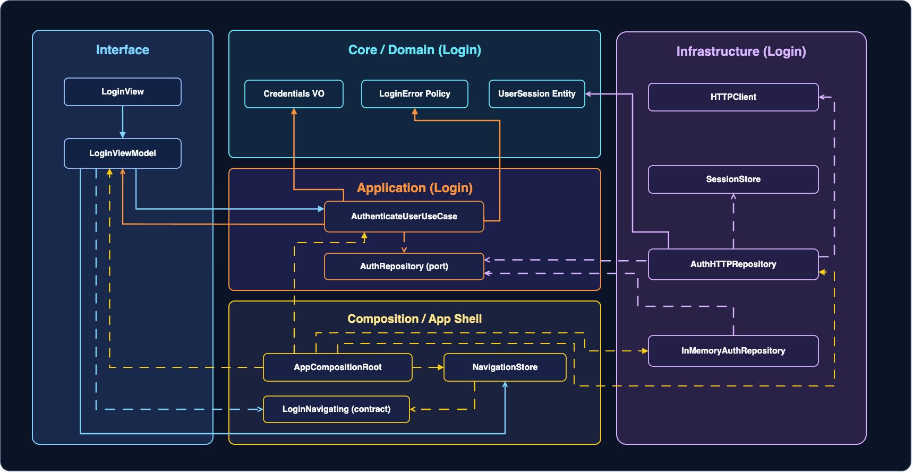
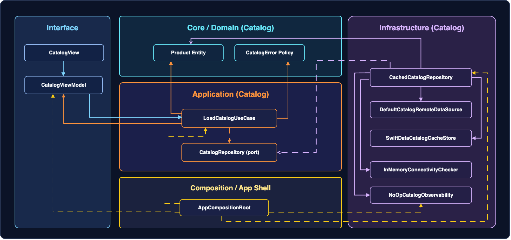

# Core Mobile Architecture

## Qué es este Core y por qué existe

Este Core es la base compartida entre las rutas de iOS y Android. No reemplaza ninguna lección de plataforma. Su función es dar un marco único para tomar decisiones de arquitectura móvil con criterio consistente en ambos ecosistemas.

Existe por una razón práctica: cuando iOS y Android evolucionan con marcos distintos, aparecen incoherencias en seguridad, contratos API, observabilidad, releases y gobernanza. Este Core reduce esa variabilidad y define una forma común de decidir, validar, operar y evolucionar.

## Cómo usar este Core junto a iOS/Android

Usa este bloque como capa de decisión transversal.

Si estás en el curso iOS, estúdialo en paralelo con cada una de sus etapas:
[Etapa 1 — Junior](../01-fundamentos/00-introduccion.md) · [Etapa 2 — Mid](../02-integracion/00-introduccion.md) · [Etapa 3 — Senior](../03-evolucion/00-introduccion.md) · [Etapa 4 — Arquitecto](../04-arquitecto/00-introduccion.md) · [Etapa 5 — Maestría](../05-maestria/00-introduccion.md)

Si estás en el curso Android, estúdialo en paralelo con cada uno de sus niveles: **Nivel Cero · Junior · Midlevel · Senior · Maestría** (carpetas `00-nivel-cero` → `04-maestria` del repo Android).

Regla operativa: cada vez que en tu track aparezca una decisión crítica (arquitectura, API, release, seguridad, operación), vuelve al Core y aplica las [checklists/templates](10-plantillas.md) antes de implementar.

## Principios del Core: decidir, validar, operar y evolucionar

### Decidir

No se decide por preferencia personal. Se decide por contexto, restricciones y trade-offs explícitos.

### Validar

No basta “suena bien”. Toda decisión debe tener evidencia verificable: tests, métricas, señales operativas.

### Operar

Lo que no se puede observar ni recuperar en incidente no está listo para producción.

### Evolucionar

La arquitectura no es foto estática. Debe soportar cambios incrementales sin caos ni reescrituras de alto riesgo.

---

Los cuatro principios anteriores no son abstractos: se materializan directamente en cómo está organizado el código. El diagrama siguiente muestra esa estructura visual.

## Diagrama de arquitectura por capas



La leyenda visual superior define la semántica por tipo de trazo y punta de flecha; el color de cada flecha indica el módulo de origen.

**Cómo leer este diagrama:** hay cuatro capas principales, de dentro hacia fuera:

- **Domain** (centro, verde): las reglas de negocio puras — Value Objects, errores de dominio y protocolos (contratos). No depende de nada externo.
- **Application** (azul): los casos de uso — orquestan el flujo llamando a los contratos del Domain. No saben nada de red ni de UI.
- **Infrastructure** (amarillo): implementaciones concretas de los contratos — adaptadores de red, stores locales. Depende de Domain (implementa sus protocolos), nunca al revés.
- **Interface** (naranja): vistas SwiftUI y ViewModels — presentan el estado y delegan al Application. No contienen lógica de negocio.

La regla de oro que verás en cada diagrama: **las flechas de dependencia siempre apuntan hacia Domain**. Infrastructure no llama a Interface. Application no importa URLSession. Si ves una flecha que viola esa dirección, hay un problema de diseño.

### Zoom de detalle por feature

Para evitar sobrecarga visual en el mapa global, aquí tienes dos vistas de detalle separadas:

#### Login (detalle)



#### Catalog (detalle)

> **Nota:** Catalog es la feature que construirás en Etapa 2. En este punto no necesitas entender cada bloque — observa que el patrón de capas (Domain → Application → Infrastructure → Interface) es idéntico al de Login.




## 🔭 Explora el scaffold — El árbol del repositorio

```bash
# Desde la raíz del repo iOS
ls -1

# Los dos artefactos principales de aprendizaje
ls apps/ios/ArchitectureKit/Sources/
ls 01-fundamentos/ | head -10
```

Este Core Mobile describe los principios que aplican a todo lo que construirás. El scaffold `apps/ios/ArchitectureKit/` es su implementación concreta: puedes usar estos comandos para orientarte antes de entrar en cada etapa.

---

## Qué sigue

Esta introducción te da el marco de referencia. Los principios de **Decidir, Validar, Operar y Evolucionar** son la brújula que usarás cada vez que tomes una decisión de arquitectura a lo largo del curso.

No hace falta memorizar los diagramas ahora. Cuando llegues a cada etapa y construyas cada feature, volverás aquí y los leerás con mucho más contexto.

Usa los botones de navegación del curso para continuar con las siguientes lecciones del Core, o salta directamente a [**Etapa 1 — Junior**](../01-fundamentos/00-introduccion.md) si ya estás listo para construir.
