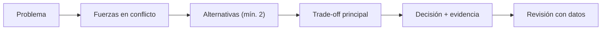

# Marco de decisiones arquitectónicas

## Modelo mental

Piensa en cada decisión arquitectónica como una bifurcación en un camino de montaña. No puedes ver el final desde la bifurcación, pero sí puedes evaluar el terreno visible: pendiente, ancho del sendero, señales de peligro. Las restricciones duras son los precipicios (no negociables). Las restricciones blandas son las preferencias de ruta (negociables si el terreno lo exige). El ADR es el mapa que dejas para quien venga detrás.



## Flujo de decisión

Una decisión técnica buena no empieza con una solución. Empieza con fuerzas en conflicto.

Primero define restricciones duras. Son las que no puedes negociar, por ejemplo cumplimiento legal, presupuesto de latencia, límites de plataforma o requisitos de seguridad. Luego define restricciones blandas, que sí se pueden negociar, como preferencia de librería, estilo de equipo o velocidad de adopción.

Con esas fuerzas claras, lista alternativas reales. Para cada alternativa, registra beneficios, coste de implementación, coste de operación, riesgo de reversión y coste de oportunidad. Después explicita el trade-off principal, toma decisión y define evidencia de validación.

## Cuándo sí / cuándo no

Usa este marco cuando la decisión afecta a más de un módulo, tiene coste de reversión alto o implica un trade-off que el equipo debe entender. No lo uses para decisiones locales reversibles en minutos (renombrar una variable, elegir un modifier de SwiftUI).

## Ejemplo en el scaffold

En `ArchitectureKit`, la decisión de usar navegación por eventos en lugar de `NavigationLink` directo se documentó en `ADR-001-login.md`. Las fuerzas eran: testabilidad del flujo de navegación (dura) vs simplicidad de `NavigationLink` (blanda). La alternativa descartada fue acoplar Login a Catalog vía import directo. La evidencia de validación fue que `LoginViewModelTests` verifica navegación sin instanciar SwiftUI. Consulta la Etapa 2 (`02-integracion/02-navegacion-eventos.md`) para ver la implementación completa.

## Checklist 1 página: Architecture Decision Loop

- [ ] Problema formulado en una frase verificable.
- [ ] Restricciones duras identificadas y validadas.
- [ ] Restricciones blandas registradas.
- [ ] Mínimo 2 alternativas viables comparadas.
- [ ] Trade-off principal explicado sin ambigüedad.
- [ ] Decisión tomada con alcance y fecha.
- [ ] Consecuencias esperadas (positivas y negativas).
- [ ] Plan de reversión definido.
- [ ] Evidencia de éxito/fallo definida antes de implementar.
- [ ] Fecha de revisión pactada.

## Mini ejemplo opcional (plataforma)

Plataforma iOS/Android: migrar navegación de acoplamiento directo a coordinador/eventos. Restricción dura: no romper deep links existentes. Evidencia: tasa de rutas fallidas, cobertura de navegación y tiempo de onboarding de nueva feature.

---

<!-- plantilla-pedagogica:auto -->

## Refuerzo pedagogico
Contexto: normalizacion automatica para `00-core-mobile/01-marco-de-decisiones.md`.

### Objetivo
- Define el resultado concreto esperado al finalizar esta leccion.

### Prerrequisitos
- Revisa la leccion anterior inmediata y confirma los conceptos base antes de continuar.

### Practica guiada
- Aplica un cambio pequeno y verificable en el scaffold relacionado con esta leccion.

<!-- semantica-flechas:auto -->
## Semantica de flechas aplicada a esta arquitectura

```mermaid
flowchart LR
    subgraph APP["App / Composition module"]
        CR["CompositionRoot"]
        COORD["AppCoordinator"]
    end

    subgraph FEATURE["Feature module"]
        VM["FeatureViewModel"]
        UC["UseCase"]
        PORT["Repository protocol"]
    end

    subgraph INFRA["Infrastructure module"]
        ADAPTER["RemoteRepository adapter"]
        STORE["LocalStore"]
    end

    CR -.-> COORD
    CR -.-> ADAPTER
    VM --> UC
    UC -.o PORT
    ADAPTER --o PORT
    ADAPTER --> STORE
```text

Lectura semantica minima de este diagrama:

1. `-->` dependencia directa en runtime.
2. `-.->` wiring y configuracion de ensamblado.
3. `-.o` dependencia contra contrato/abstraccion.
4. `--o` salida/propagacion desde implementacion concreta.

