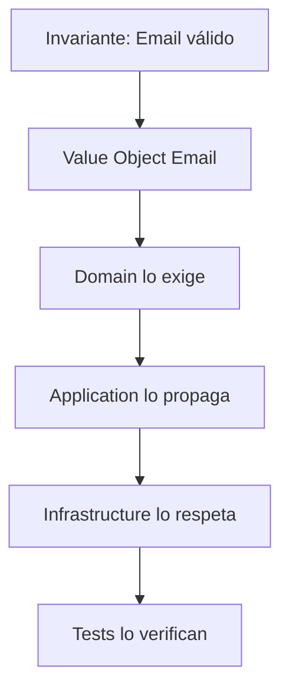

# Invariantes y contratos

## Modelo mental

Un invariante es un muro de carga en un edificio: si lo quitas, todo se derrumba. Un contrato es la puerta entre habitaciones: define qué puede pasar y qué no, sin que cada habitación necesite conocer el interior de la otra.

## Invariantes (must-never-happen)

Un invariante es una verdad del sistema que no debe romperse nunca. No es documentación bonita; es una condición de seguridad de negocio o de integridad técnica.

Ejemplos: un token expirado nunca se usa para llamar API, una orden pagada no vuelve a estado pendiente, un evento crítico no se pierde silenciosamente.

Codifica invariantes en tres capas: modelo de dominio, contratos de entrada/salida y pruebas. Si el invariante solo vive en una wiki, no existe.

## Ejemplo en el scaffold

En `ArchitectureKit`, el Value Object `Email` (en `FeatureLoginDomain`) es un invariante codificado: solo se puede construir si contiene `@`. Esto garantiza que ninguna capa posterior (Application, Infrastructure, UI) reciba un email malformado. El test `EmailTests.test_invalidEmail_throwsError` verifica esta invariante. Consulta la Etapa 1 (`01-fundamentos/05-feature-login/01-domain.md`) para ver la implementación TDD completa.

## Cuándo sí / cuándo no

Codifica como invariante todo lo que, si se viola, produce daño de negocio o corrupción de datos. No conviertas en invariante preferencias de estilo o reglas que cambian con frecuencia (esas son políticas configurables, no muros de carga).

## Contratos clave

Contrato de dominio define límites entre agregados y reglas de negocio.

Contrato de feature define qué expone cada módulo y qué no puede importar.

Contrato API define request/response, errores esperables, idempotencia y versionado.

Contrato de test define qué comportamiento es obligatorio proteger ante regresión.

## Contract tests vs integration tests vs E2E

Los contract tests validan que productor y consumidor cumplen un acuerdo explícito, con bajo coste y alta señal de ruptura de contrato.

Los integration tests verifican colaboración real entre componentes internos y detectan errores de wiring, mapping o persistencia.

Los E2E validan recorrido completo y experiencia de usuario; son más caros y deben reservarse para flujos críticos de negocio.

Guía pragmática: protege reglas con unit/contract, wiring con integration y valor de negocio crítico con E2E.

---

**Anterior:** [Marco de decisiones arquitectónicas ←](01-marco-de-decisiones.md) · **Siguiente:** [Variabilidad y evolución sin caos →](03-variabilidad-y-evolucion.md)
