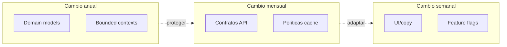

# Variabilidad y evolución sin caos

## Modelo mental

Piensa en tu codebase como una ciudad. Hay zonas residenciales que apenas cambian (Domain, modelos core) y zonas comerciales que se renuevan cada temporada (UI, feature flags, copy). Si construyes la zona comercial con los mismos cimientos que un monumento histórico, desperdicias recursos. Si construyes el monumento con materiales temporales, se derrumba.



## Ejemplo en el scaffold

En `ArchitectureKit`, el Domain (`FeatureLoginDomain`, `FeatureCatalogDomain`) es zona estable: los Value Objects `Email`, `Password`, `Product` no cambian con frecuencia. La Infrastructure (`FeatureCatalogData`) es zona media: la política de cache (TTL, network-first) puede ajustarse. La UI (`FeatureCatalogUI`) es zona volátil: el layout de la lista de productos puede cambiar sin tocar Domain. Esta separación se aplica en la Etapa 3 (`03-evolucion/01-caching-offline.md`) cuando se introduce cache sin contaminar el core.

## Cuándo sí / cuándo no

Aplica clasificación de variabilidad cuando el sistema tiene más de una feature o más de un equipo. No la apliques prematuramente en prototipos de una semana donde todo es volátil por definición.

## Diseñar para cambio

No todo cambia al mismo ritmo. Clasifica explícitamente:

Cambio semanal: copy, reglas UI, feature flags, thresholds de experimentación.

Cambio mensual: contratos de integración, políticas de cache, métricas de negocio.

Cambio anual: dominios, límites de módulo, estrategia de plataforma.

Separar ritmos evita sobre-ingeniería en zonas estables y deuda técnica en zonas volátiles.

## Estrategias de migración

Prefiere migraciones incrementales con dual-run, fallback y criterios de corte claros.

Usa refactors por slices: aislar frontera, mover comportamiento, mantener compatibilidad, eliminar legado cuando la evidencia confirme estabilidad.

Aplica Strangler Pattern cuando el bloque legado es grande y crítico: enruta gradualmente tráfico al nuevo componente, mide, y retira por etapas.

Evita reescrituras big-bang salvo sistemas pequeños con riesgo controlado y ventana de parada asumida.

## Checklist: evolve without chaos

- [ ] Mapa de zonas de alta variabilidad actualizado.
- [ ] Plan incremental con hitos reversibles.
- [ ] Compatibilidad temporal definida (old/new).
- [ ] Métricas de migración definidas antes de mover código.
- [ ] Fallback técnico probado.
- [ ] Fecha de retiro del legado acordada.
- [ ] Riesgos de operación revisados con equipo.

---

<!-- plantilla-pedagogica:auto -->

## Refuerzo pedagogico
Contexto: normalizacion automatica para `00-core-mobile/03-variabilidad-y-evolucion.md`.

### Objetivo
- Define el resultado concreto esperado al finalizar esta leccion.

### Prerrequisitos
- Revisa la leccion anterior inmediata y confirma los conceptos base antes de continuar.

### Practica guiada
- Aplica un cambio pequeno y verificable en el scaffold relacionado con esta leccion.

**Anterior:** [Invariantes y contratos ←](02-invariantes-y-contratos.md) · **Siguiente:** [Calidad PR-ready →](04-calidad-pr-ready.md)

<!-- semantica-flechas:auto -->
## Semantica de flechas aplicada a esta arquitectura

```mermaid
flowchart LR
    subgraph APP["App / Composition module"]
        CR["CompositionRoot"]
        COORD["AppCoordinator"]
    end

    subgraph FEATURE["Feature module"]
        VM["FeatureViewModel"]
        UC["UseCase"]
        PORT["Repository protocol"]
    end

    subgraph INFRA["Infrastructure module"]
        ADAPTER["RemoteRepository adapter"]
        STORE["LocalStore"]
    end

    CR -.-> COORD
    CR -.-> ADAPTER
    VM --> UC
    UC -.o PORT
    ADAPTER --o PORT
    ADAPTER --> STORE
```text

Lectura semantica minima de este diagrama:

1. `-->` dependencia directa en runtime.
2. `-.->` wiring y configuracion de ensamblado.
3. `-.o` dependencia contra contrato/abstraccion.
4. `--o` salida/propagacion desde implementacion concreta.

