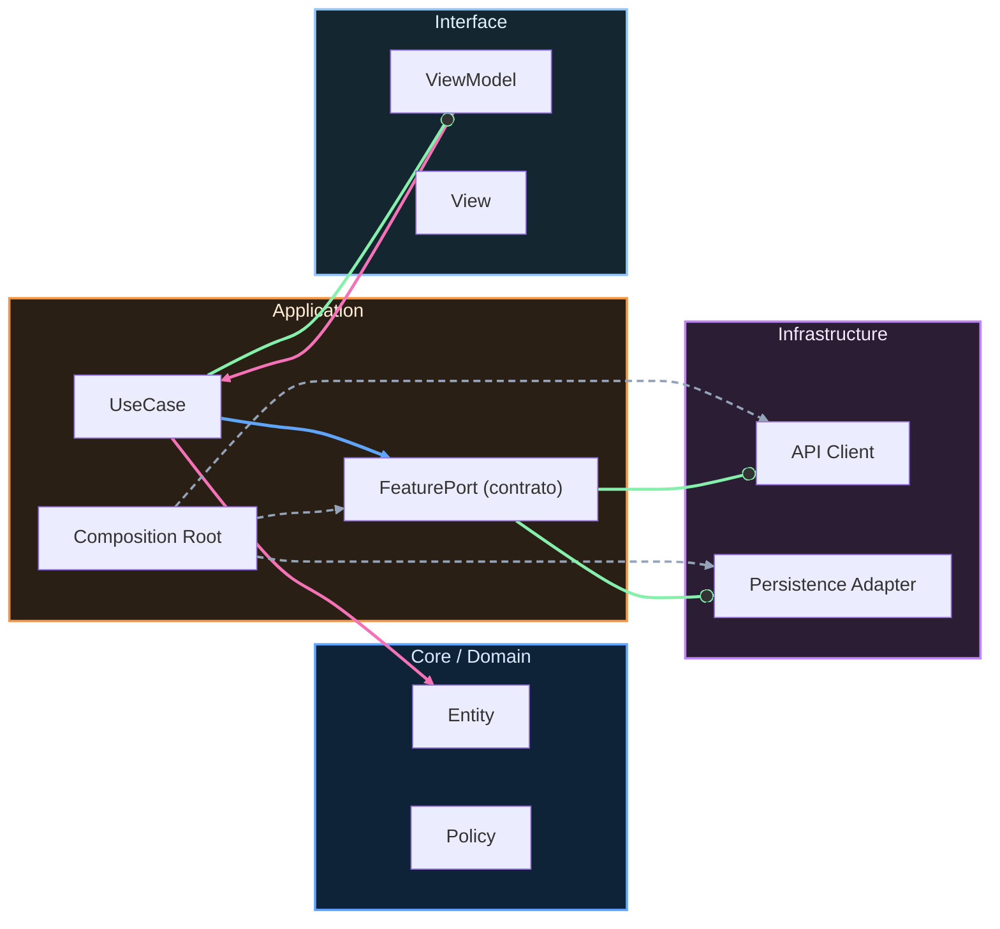

# Observabilidad y operación

## Modelo mental

Si tu app fuera un avión, la observabilidad sería la caja negra y los instrumentos del cockpit. Sin ellos, cuando algo falla solo puedes adivinar. Con ellos, puedes reconstruir exactamente qué pasó, cuándo y por qué. La observabilidad no es "añadir prints": es diseñar señales que activen decisiones.

## Ejemplo en el scaffold

En `ArchitectureKit`, la Etapa 3 introduce observabilidad mediante decoradores (`03-evolucion/03-observabilidad.md`). El patrón es envolver un `ProductRepository` real con un `LoggingProductRepository` que registra evento, resultado y duración sin contaminar el core. El `AppComposition` decide qué decoradores aplicar. Esto permite activar o desactivar logging sin tocar Domain ni Application.

## Cuándo sí / cuándo no

Añade observabilidad desde el momento en que tienes flujos críticos de usuario (login, carga de datos, sync). No instrumentes todo: instrumenta lo que activa decisión (errores, latencia, tasas de éxito). Evita logging de PII sin política de redacción.

## Logging

Usa logs estructurados con campos estables (evento, feature, resultado, error_code, correlation_id). Evita texto libre como única señal.

Nunca loguees PII sin política de redacción. Define redaction por defecto para email, teléfono, token, identificadores sensibles. Aplica sampling en eventos ruidosos para controlar coste.

## Metrics

Mide golden signals adaptadas a mobile: éxito/fracaso de flujos críticos, latencia percibida, crash-free sessions, ANR (Android), cold start, consumo de memoria y tasa de retry.

No midas todo. Mide lo que activa decisión.

## Tracing

En mobile el tracing extremo puede ser caro. Úsalo en caminos de alto valor (login, checkout, sync) y con correlación hacia backend mediante correlation IDs.

## SLO y error budget

Define SLO por capacidad de usuario, no por componente interno aislado. Ejemplo: sync exitosa de tareas > 99.0% en 28 días.

El error budget convierte fiabilidad en presupuesto gestionable. Si se consume rápido, prioriza estabilidad sobre nueva feature.

## Alert hygiene

Una alerta vale si dispara acción concreta. Elimina alertas sin playbook, con falsos positivos recurrentes o sin dueño.

## Template: Mínimal Observability Spec

Nombre del flujo:

Eventos obligatorios:

Métricas obligatorias:

Campos sensibles y redacción:

Umbrales de alerta:

Dashboard de referencia:

Owner operativo:

## Template: Incident Runbook Skeleton

Tipo de incidente:

Señal de detección:

Impacto esperado:

Primera mitigación:

Condición de rollback:

Validación post-mitigación:

Comunicación interna/externa:

Acciones preventivas posteriores:

---

<!-- auto-gapfix:layered-mermaid -->
## Diagrama de arquitectura por capas

La lectura del diagrama sigue esta semántica:
1. `-->` dependencia directa en runtime.
2. `-.->` wiring o configuración.
3. `==>` contrato o abstracción.
4. `--o` salida o propagación de resultado.
