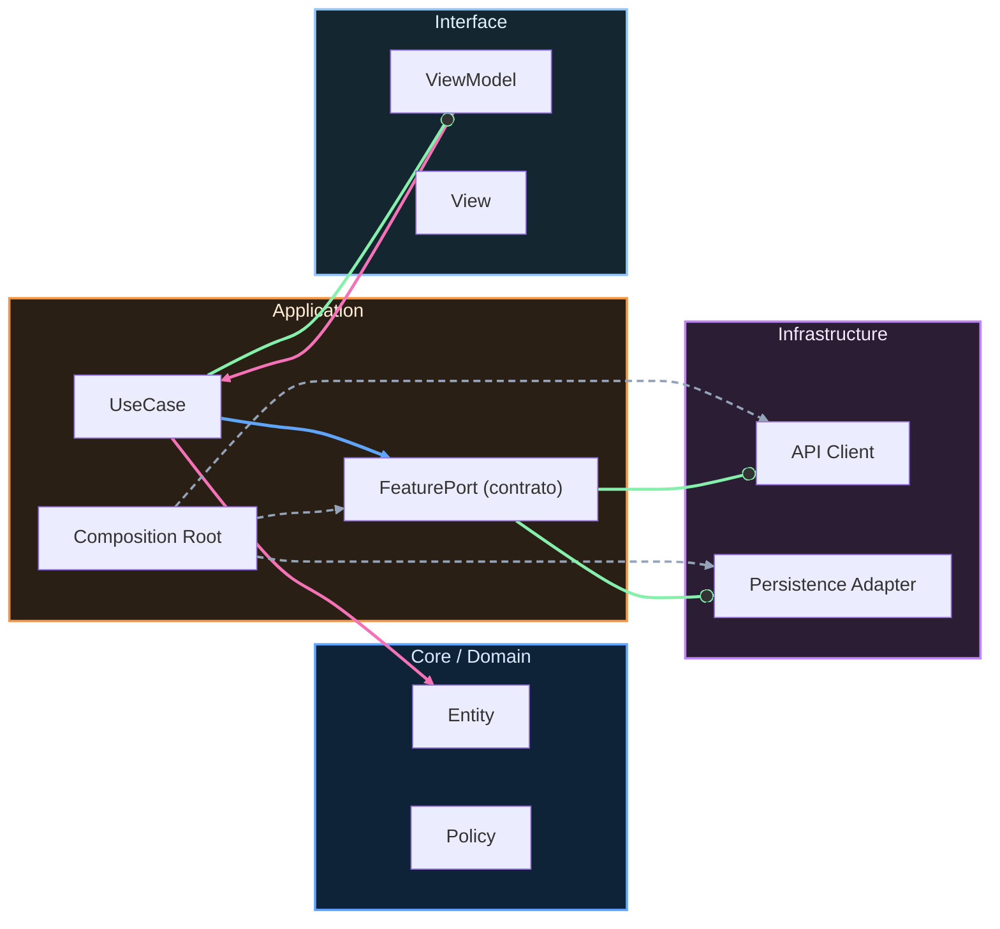

# Release, rollback y feature flags

## Modelo mental

Un release es como abrir una compuerta: una vez que el agua fluye, no puedes recogerla fácilmente. En mobile, el rollback es especialmente difícil porque dependes de que los usuarios actualicen. Por eso necesitas dos mecanismos: staged rollout (abrir la compuerta poco a poco) y feature flags (poder cerrar una tubería específica sin cerrar toda la compuerta).

## Ejemplo en el scaffold

En `ArchitectureKit`, la Etapa 4 (`04-arquitecto/06-quality-gates.md`) define gates que deben pasar antes de release: `swift test`, `check-dependencies.sh`, `check-performance-baseline.sh`. Si algún gate falla, el release se bloquea. Los feature flags no están implementados en el scaffold actual, pero la arquitectura los soporta: el `AppComposition` puede inyectar implementaciones distintas según configuración remota sin tocar Domain.

## Cuándo sí / cuándo no

Usa staged rollout siempre que el cambio afecte a flujos críticos de usuario. Usa feature flags cuando necesites activar/desactivar funcionalidad sin deploy. No uses flags para todo: cada flag es deuda temporal que necesita owner y fecha de retiro.

## Estrategias de release

Prioriza despliegues graduales: staged rollout, canary o phased rollout según plataforma/canal. El objetivo es reducir blast radius y aprender pronto.

## Rollback en mobile

El rollback de app tiene limitaciones por adopción de versiones y stores. Por eso debes diseñar mitigaciones server-side y flags para desactivar rutas de riesgo sin esperar a que toda la base actualice.

## Feature flags

Un flag es deuda temporal con fecha de caducidad. Cada flag debe tener owner, propósito, criterio de retiro y kill-switch asociado para incidentes graves.

Evita flags permanentes sin gobierno, porque añaden complejidad oculta.

## Kill-switch

Diseña kill-switch para desactivar funciones críticas con seguridad, auditabilidad y latencia de propagación conocida.

## Release readiness checklist

- [ ] Scope de release cerrado y trazable.
- [ ] Riesgos críticos identificados.
- [ ] Plan de rollback y mitigación server-side.
- [ ] Flags nuevas con owner y fecha de expiración.
- [ ] Kill-switch validado en entorno controlado.
- [ ] Monitoreo reforzado para ventana de lanzamiento.
- [ ] Comunicación de release preparada.

---

**Anterior:** [Observabilidad y operación ←](05-observabilidad-operacion.md) · **Siguiente:** [APIs, contratos y versionado →](07-apis-contratos-versionado.md)

<!-- auto-gapfix:layered-mermaid -->
## Diagrama de arquitectura por capas

La lectura del diagrama sigue esta semantica:
1. `-->` dependencia directa en runtime.
2. `-.->` wiring o configuracion.
3. `==>` contrato o abstraccion.
4. `--o` salida o propagacion de resultado.
