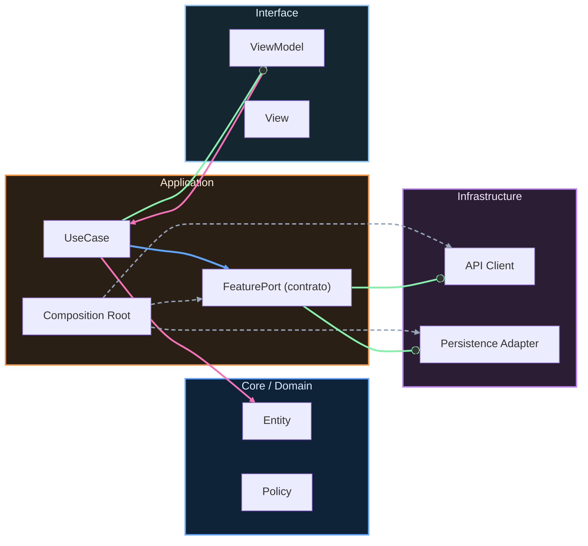

# Seguridad, privacidad y threat modeling

## Modelo mental

La seguridad en mobile no es un checklist que se aplica al final. Es una lente que se usa desde el diseño: cada flujo tiene activos que proteger, actores que podrían atacarlos y superficie por donde podrían entrar. El threat model es el mapa de esas tres dimensiones. Sin mapa, las defensas son aleatorias.

## Cuándo sí / cuándo no

Haz threat modeling explícito para todo flujo que maneje autenticación, datos de usuario o transacciones de negocio. No lo hagas para pantallas puramente informativas sin datos sensibles ni interacción con backend. El ejemplo completo de Login + Catálogo más abajo muestra el nivel de detalle esperado.

## Threat modeling móvil (alto nivel)

Modela amenazas desde activos, actores y superficie de ataque.

Activos: tokens, PII, datos de negocio, telemetría sensible.

Actores: usuario legítimo, atacante oportunista, atacante con dispositivo comprometido.

Superficie: almacenamiento local, red, APIs, logging, analítica, integraciones SDK.

## Clasificación de datos

Clasifica datos en PII, secretos, telemetría operacional y datos públicos. La clasificación define retención, cifrado, redacción y acceso.

## Secure storage principles

No hardcodear secretos. Proteger tokens en almacenamiento seguro de plataforma. Limitar exposición en memoria y logs. Rotar y revocar credenciales cuando aplique.

## Transport security

TLS obligatorio en tránsito. Pinning solo cuando hay capacidad real de operación, rotación de certificados y plan de recuperación; si no, puede introducir más riesgo operativo que beneficio.

## Privacidad

Diseña analítica con minimización de datos, consentimiento explícito cuando aplique y trazabilidad de propósito. Piensa con mentalidad GDPR: necesidad, proporcionalidad y control del usuario.

## Template: Mobile Threat Model Lite

Sistema/flujo evaluado:

Activos críticos:

Actores potenciales:

Superficie de ataque:

Amenazas priorizadas:

Controles existentes:

Controles faltantes:

Riesgo residual aceptado:

Fecha de revisión:

## Cómo rellenarlo sin ambigüedad (paso a paso)

No lo rellenes como formulario burocrático. Úsalo para tomar decisiones reales:

1. Escribe un flujo concreto, no “la app entera” (por ejemplo: login y gestión de sesión).
2. Enumera activos concretos que podrían filtrarse o manipularse.
3. Define actores con intención y capacidad (no solo “hacker”).
4. Prioriza 3 amenazas máximas con impacto y probabilidad.
5. Aterriza controles existentes y controles faltantes accionables.
6. Deja explícito qué riesgo residual aceptas y hasta cuándo.

## Ejemplo completo (Login + Catálogo)

Sistema/flujo evaluado:
Login por email/password, persistencia de sesión y carga de catálogo.

Activos críticos:
- Access token y refresh token.
- Datos de sesión (userId, expiración).
- PII mínima (email).
- Eventos de observabilidad (sin PII).

Actores potenciales:
- Usuario legítimo.
- Atacante oportunista con acceso temporal al dispositivo.
- Atacante con proxy MITM en red insegura.
- SDK de terceros mal configurado (riesgo accidental).

Superficie de ataque:
- Entrada de credenciales en UI.
- Tráfico HTTP hacia backend.
- Persistencia local de sesión.
- Logs locales/telemetría.
- Deep links de entrada al flujo autenticado.

Amenazas priorizadas:
- Exfiltración de token desde almacenamiento local no seguro.
- Filtrado de PII en logs o eventos analíticos.
- Reutilización de sesión expirada por validación incompleta en cliente.
- Navegación a rutas protegidas vía deep link sin policy de auth.

Controles existentes:
- Transporte TLS obligatorio.
- Contratos de errores semánticos (sin exponer detalles internos).
- Separación de capas que evita mezclar reglas de auth en UI.
- Política de navegación centralizada (coordinador + policy).

Controles faltantes:
- Cifrado y storage seguro de tokens (Keychain) con tests de recuperación.
- Redacción automática de PII en logger/analytics.
- Rotación y revocación explícita de sesión con estrategia de fallback offline.
- Test de integración para deep link protegido sin sesión válida.

Riesgo residual aceptado:
Se acepta riesgo temporal de no aplicar pinning de certificados mientras no haya operación madura de rotación/recuperación. Revisión obligatoria al primer incidente de red o cambio de backend.

Fecha de revisión:
2026-06-30.

---

**Anterior:** [APIs, contratos y versionado ←](07-apis-contratos-versionado.md) · **Siguiente:** [Dependency governance y supply chain →](09-dependency-governance-supply-chain.md)

<!-- auto-gapfix:layered-mermaid -->
## Diagrama de arquitectura por capas

La lectura del diagrama sigue esta semantica:
1. `-->` dependencia directa en runtime.
2. `-.->` wiring o configuracion.
3. `==>` contrato o abstraccion.
4. `--o` salida o propagacion de resultado.
