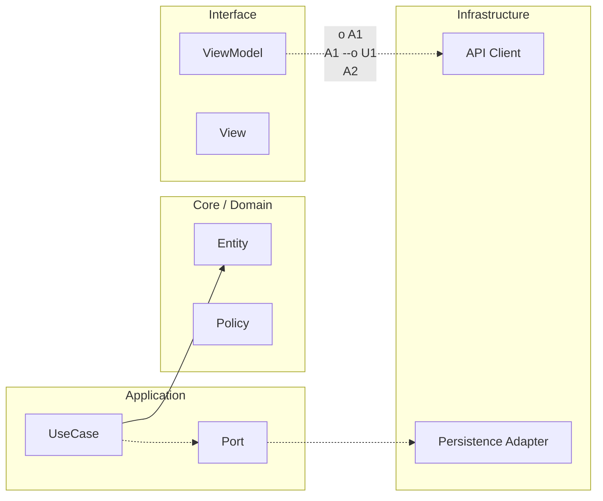

# Dependency governance y supply chain

## Modelo mental

Las dependencias son como proveedores externos de tu empresa: cada uno que añades te da capacidad, pero también te expone a su ritmo de cambio, sus bugs y su posible abandono. La gobernanza de dependencias es decidir conscientemente qué proveedores aceptas, bajo qué condiciones y con qué plan de salida.

## Ejemplo en el scaffold

En `ArchitectureKit`, el `Package.swift` define explícitamente qué targets pueden importar qué. `FeatureLoginDomain` solo depende de `CoreDomain`; nunca de `InfraHTTP` ni de `FeatureCatalogDomain`. El script `check-dependencies.sh` verifica estas reglas en cada build. Si alguien añade un `import InfraHTTP` dentro de `FeatureLoginDomain`, el gate falla. Consulta la Etapa 4 (`04-arquitecto/02-reglas-dependencia-ci.md`) para la estrategia completa.

## Cuándo sí / cuándo no

Aplica gobernanza de dependencias desde que tienes más de 3 módulos SPM o más de una dependencia externa. No la apliques a proyectos de un solo target donde el compilador ya controla todo.

## Reglas de dependencia modular

Define direcciones permitidas y prohibidas entre módulos. Las reglas deben ser ejecutables (lint/build checks) para evitar que la arquitectura dependa de disciplina manual.

## Política de upgrades

Establece cadencia de actualización (por ejemplo mensual/trimestral), criterios de priorización por riesgo y gates de validación (build, tests, perf, seguridad).

Cada upgrade relevante debe incluir plan de rollback.

## Supply chain basics

Usa lockfiles, verifica checksums cuando la herramienta lo permita y minimiza permisos/capacidades de dependencias.

Evita introducir SDKs sin justificar valor, riesgo y estrategia de salida.

## Dependency Governance Rules checklist

- [ ] Mapa de módulos y direcciones permitidas actualizado.
- [ ] Imports prohibidos definidos y chequeados.
- [ ] Política de versiones/upgrade publicada.
- [ ] Gates de upgrade definidos (test/perf/security).
- [ ] Plan de rollback por dependencia crítica.
- [ ] Inventario de dependencias con owner.
- [ ] Revisión periódica de dependencias huérfanas.

---

<!-- plantilla-pedagogica:auto -->

## Refuerzo pedagogico
Contexto: normalizacion automatica para `00-core-mobile/09-dependency-governance-supply-chain.md`.

### Objetivo
- Define el resultado concreto esperado al finalizar esta leccion.

### Prerrequisitos
- Revisa la leccion anterior inmediata y confirma los conceptos base antes de continuar.

### Practica guiada
- Aplica un cambio pequeno y verificable en el scaffold relacionado con esta leccion.

**Anterior:** [Seguridad, privacidad y threat modeling ←](08-seguridad-privacidad-threat-modeling.md) · **Siguiente:** [Plantillas operativas (con ejemplos reales) →](10-plantillas.md)

<!-- auto-gapfix:layered-mermaid -->
## Diagrama de arquitectura por capas



La lectura del diagrama sigue esta semantica:
1. `-->` dependencia directa en runtime.
2. `-.->` contrato o abstraccion.
3. `-.o` wiring o composicion.
4. `--o` salida o propagacion de resultado.

<!-- auto-gapfix:layered-snippet -->
## Snippet de referencia por capas

```swift
protocol FeaturePort {
    func fetch() async throws -> [String]
}

final class FeatureUseCase {
    private let port: FeaturePort

    init(port: FeaturePort) {
        self.port = port
    }

    func execute() async throws -> [String] {
        try await port.fetch()
    }
}

@MainActor
final class FeatureViewModel: ObservableObject {
    @Published private(set) var items: [String] = []

    private let useCase: FeatureUseCase

    init(useCase: FeatureUseCase) {
        self.useCase = useCase
    }

    func load() async {
        items = (try? await useCase.execute()) ?? []
    }
}
```
