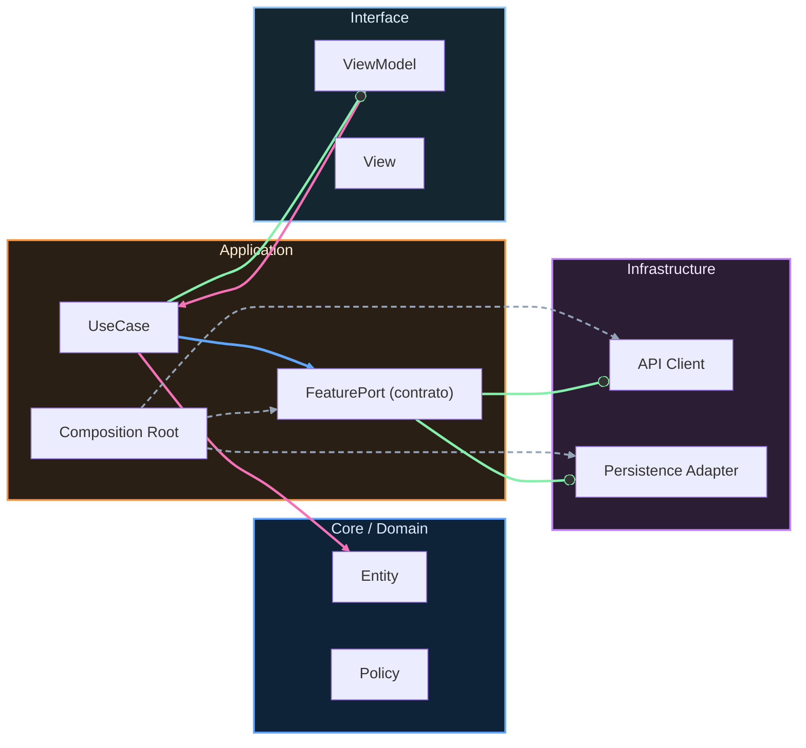

# Plantillas operativas (con ejemplos reales)

Este documento no está pensado para “copiar y pegar sin pensar”. Está pensado para ayudarte a pasar de una idea vaga a una decisión técnica clara, trazable y defendible.

La regla de uso es simple: cada plantilla debe producir un artefacto que otra persona pueda leer y responder con “entiendo el problema, la decisión y cómo validar si funcionó”.

---

## 1) ADR template (Architecture Decision Record)

### Plantilla

Contexto:

Decisión:

Alternativas consideradas:

Trade-offs:

Consecuencias:

Métricas/criterios de éxito:

Fecha de revisión:

### Ejemplo (navegación desacoplada)

Contexto:
Login y Catálogo necesitan coordinar navegación sin acoplar features entre sí.

Decisión:
Usar navegación por eventos (intenciones emitidas por feature) y coordinación central en Composition Root.

Alternativas consideradas:
- `NavigationLink` directo entre features.
- Router global con strings mágicos.

Trade-offs:
- A favor: mejor testabilidad y menor acoplamiento.
- En contra: requiere más wiring inicial.

Consecuencias:
- El wiring queda concentrado en Composition Root.
- Cada feature mantiene límites de dependencia.

Métricas/criterios de éxito:
- 0 imports directos entre `FeatureLogin` y `FeatureCatalog`.
- Tests de coordinación pasando para rutas críticas.

Fecha de revisión:
2026-07-01.

---

## 2) RFC template (cambio relevante)

### Plantilla

Problema:

Objetivo:

Opciones:

Recomendación:

Plan de rollout:

Plan de rollback:

Riesgos abiertos:

### Ejemplo (introducir caché en catálogo)

Problema:
El catálogo tarda demasiado en redes inestables y no ofrece experiencia offline mínima.

Objetivo:
Reducir tiempo de primera visualización y permitir lectura de último estado conocido.

Opciones:
- Solo remoto (sin caché).
- Caché en memoria.
- Caché persistente con TTL.

Recomendación:
Caché persistente con TTL y fallback a remoto cuando expire.

Plan de rollout:
1. Activar en porcentaje pequeño.
2. Monitorizar latencia y errores de stale data.
3. Expandir por cohortes.

Plan de rollback:
Feature flag para desactivar caché y volver a remoto puro.

Riesgos abiertos:
Riesgo de datos obsoletos si el TTL queda mal calibrado.

---

## 3) PR Review checklist

### Plantilla

- [ ] Arquitectura: límites y dependencias correctos.
- [ ] Tests: cobertura suficiente del impacto.
- [ ] Edge cases: fallos previsibles cubiertos.
- [ ] Observabilidad: logs/métricas para diagnóstico.
- [ ] Seguridad/privacidad: PII/secretos revisados.
- [ ] Plan de rollback documentado (si el cambio lo requiere).

### Ejemplo de uso (extracto)

- [x] Arquitectura: sin imports cruzados entre features.
- [x] Tests: unit + integration en verde para login y catálogo.
- [x] Edge cases: expiración de sesión y fallo de red cubiertos.
- [ ] Observabilidad: pendiente añadir evento estable para retry de catálogo.
- [x] Seguridad/privacidad: logger redacta email/token.
- [x] Plan de rollback: flag de caché documentado.

Comentario final de revisión:
“Aprobable tras añadir evento de observabilidad para retry; el resto de gates está correcto”.

---

## 4) DoD template (Definition of Done)

### Plantilla

Build:

Tests:

Quality gates:

Documentación:

Operación:

### Ejemplo (feature Login)

Build:
Compila en CI y local sin warnings críticos de concurrencia.

Tests:
Unit tests de `Email`, `Password` y `LoginUseCase` pasando.

Quality gates:
Dependencias correctas + strict concurrency + coverage crítica.

Documentación:
ADR-001 actualizado y escenario BDD trazable a tests.

Operación:
Evento de fallo de login instrumentado sin PII.

---

## 5) Tabla de métricas before/after

### Plantilla

| Métrica | Before | After | Delta | Evidencia |
|---|---:|---:|---:|---|
| | | | | |
| | | | | |

### Ejemplo (catálogo con caché)

| Métrica | Before | After | Delta | Evidencia |
|---|---:|---:|---:|---|
| Tiempo medio de carga catálogo (ms) | 1200 | 430 | -64% | perfilado local + logs agregados |
| Tasa de error en red inestable | 8.5% | 3.1% | -5.4 pp | monitorización de errores por endpoint |
| Reintentos manuales por sesión | 2.4 | 0.9 | -62% | eventos UX “retry_tapped” |

---

## 6) Mobile Threat Model Lite

Plantilla breve:

Sistema/flujo evaluado:

Activos críticos:

Actores potenciales:

Superficie de ataque:

Amenazas priorizadas:

Controles existentes:

Controles faltantes:

Riesgo residual aceptado:

Fecha de revisión:

Ejemplo completo (curso Login + Catálogo):

- Sistema/flujo evaluado: autenticación de usuario, persistencia de sesión y navegación a catálogo con deep links.
- Activos críticos: token de sesión, identificador de usuario, email (PII), trazas operativas.
- Actores potenciales: atacante con dispositivo comprometido, actor con acceso a logs, app maliciosa que intenta invocar deep links.
- Superficie de ataque:
  - almacenamiento local de sesión,
  - transporte de credenciales/token,
  - eventos/logs con contexto de usuario,
  - rutas de navegación/deep links.
- Amenazas priorizadas:
  - T1: exfiltración de token desde almacenamiento inseguro,
  - T2: fuga de PII en logging/analytics,
  - T3: acceso a pantallas protegidas vía deep link sin sesión válida.
- Controles existentes:
  - validación de credenciales y errores tipados en Domain/Application,
  - contratos de navegación desacoplada con chequeo de sesión en coordinador,
  - tests de integración en gateways/repositorios.
- Controles faltantes:
  - persistencia de sesión en Keychain (no UserDefaults),
  - redacción automática de PII en logger,
  - test automático de deep links protegidos en CI.
- Riesgo residual aceptado: medio-bajo durante etapa formativa; no aceptable para release público sin completar controles faltantes.
- Fecha de revisión: 2026-02-11.

Referencia con ejemplo completo:
[`00-core-mobile/08-seguridad-privacidad-threat-modeling.md`](08-seguridad-privacidad-threat-modeling.md)

---

<!-- auto-gapfix:layered-mermaid -->
## Diagrama de arquitectura por capas

La lectura del diagrama sigue esta semantica:
1. `-->` dependencia directa en runtime.
2. `-.->` wiring o configuracion.
3. `==>` contrato o abstraccion.
4. `--o` salida o propagacion de resultado.
