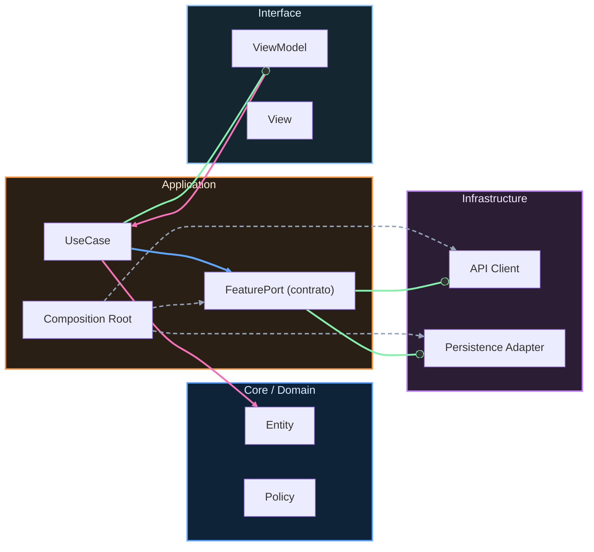

# Crosswalk iOS ↔ Android

## Modelo mental

Este crosswalk es un mapa de traducción entre los dos tracks del programa (iOS y Android). No compara frameworks ni lenguajes; compara responsabilidades profesionales. Un alumno que domina "integrate" en iOS puede dialogar con un compañero que domina "integrate" en Android porque ambos resuelven el mismo tipo de problema (conectar features sin acoplarlas), aunque las herramientas sean distintas.

## Equivalencia de tracks por responsabilidad

| Responsabilidad | iOS (este curso) | Android |
|---|---|---|
| **build** | Etapa 1: Fundamentos | Nivel 0 |
| **integrate** | Etapa 2: Integración | Junior |
| **operate** | Etapa 3: Evolución | Mid |
| **govern** | Etapa 4: Arquitecto | Senior |
| **optimize under constraints** | Etapa 5: Maestría | Maestría |

## Equivalencia funcional

La equivalencia no se mide por nombres de carpetas. Se mide por responsabilidad demostrable:

build → integrate → operate → govern → optimize under constraints

Cada nivel implica que el anterior está consolidado. No se puede "govern" sin saber "integrate".

---

<!-- plantilla-pedagógica:auto -->

## Refuerzo pedagógico
Contexto: normalización automática para `00-core-mobile/11-crosswalk-ios-android.md`.

### Objetivo
- Define el resultado concreto esperado al finalizar esta lección.

### Prerrequisitos
- Revisa la lección anterior inmediata y confirma los conceptos base antes de continuar.

### Práctica guiada
- Aplica un cambio pequeño y verificable en el scaffold relacionado con esta lección.

### Validación
- Checklist rápido:
  - [ ] Entiendo la decisión técnica principal de la lección.
  - [ ] He ejecutado una comprobación mínima (test/build/script) asociada.
  - [ ] Puedo explicar el trade-off clave con mis palabras.

<!-- auto-gapfix:layered-mermaid -->
## Diagrama de arquitectura por capas

La lectura del diagrama sigue esta semántica:
1. `-->` dependencia directa en runtime.
2. `-.->` wiring o configuración.
3. `==>` contrato o abstracción.
4. `--o` salida o propagación de resultado.
