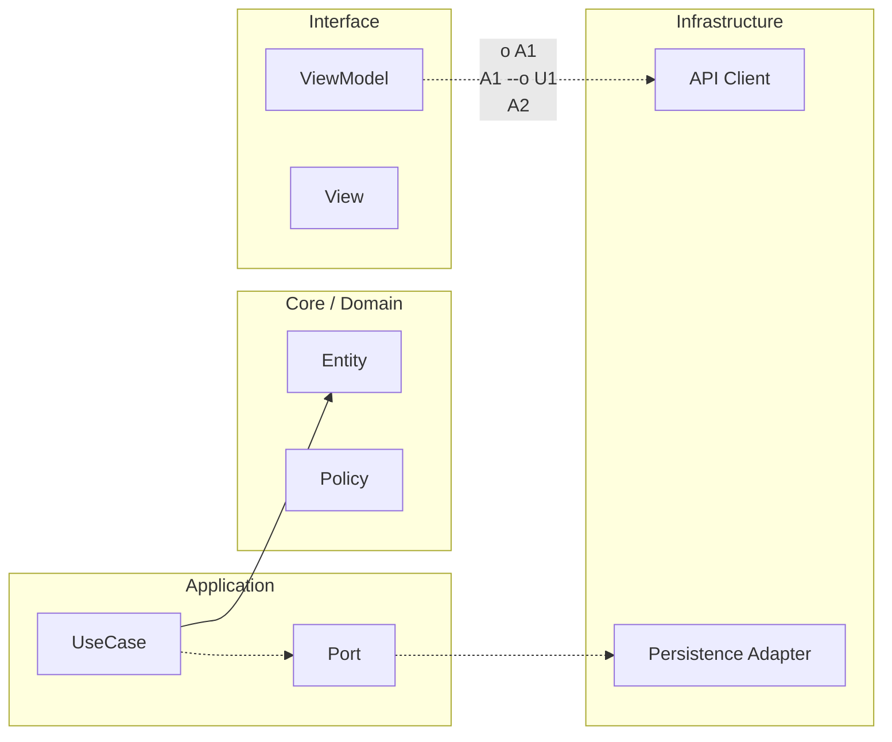

# Crosswalk iOS ↔ Android

## Modelo mental

Este crosswalk es un mapa de traducción entre los dos tracks del programa (iOS y Android). No compara frameworks ni lenguajes; compara responsabilidades profesionales. Un alumno que domina "integrate" en iOS puede dialogar con un compañero que domina "integrate" en Android porque ambos resuelven el mismo tipo de problema (conectar features sin acoplarlas), aunque las herramientas sean distintas.

## Equivalencia de tracks por responsabilidad

| Responsabilidad | iOS (este curso) | Android |
|---|---|---|
| **build** | Etapa 1: Fundamentos | Nivel 0 |
| **integrate** | Etapa 2: Integración | Junior |
| **operate** | Etapa 3: Evolución | Mid |
| **govern** | Etapa 4: Arquitecto | Senior |
| **optimize under constraints** | Etapa 5: Maestría | Maestría |

## Equivalencia funcional

La equivalencia no se mide por nombres de carpetas. Se mide por responsabilidad demostrable:

build → integrate → operate → govern → optimize under constraints

Cada nivel implica que el anterior está consolidado. No se puede "govern" sin saber "integrate".

---

<!-- plantilla-pedagogica:auto -->

## Refuerzo pedagogico
Contexto: normalizacion automatica para `00-core-mobile/11-crosswalk-ios-android.md`.

### Objetivo
- Define el resultado concreto esperado al finalizar esta leccion.

### Prerrequisitos
- Revisa la leccion anterior inmediata y confirma los conceptos base antes de continuar.

### Practica guiada
- Aplica un cambio pequeno y verificable en el scaffold relacionado con esta leccion.

### Validacion
- Checklist rapido:
  - [ ] Entiendo la decision tecnica principal de la leccion.
  - [ ] He ejecutado una comprobacion minima (test/build/script) asociada.
  - [ ] Puedo explicar el trade-off clave con mis palabras.

**Anterior:** [Plantillas operativas (con ejemplos reales) ←](10-plantillas.md) · **Siguiente:** [1) Purpose of This Document →](12-mobile-architect-parity-ios-android.md)

<!-- auto-gapfix:layered-mermaid -->
## Diagrama de arquitectura por capas



La lectura del diagrama sigue esta semantica:
1. `-->` dependencia directa en runtime.
2. `-.->` contrato o abstraccion.
3. `-.o` wiring o composicion.
4. `--o` salida o propagacion de resultado.

<!-- auto-gapfix:layered-snippet -->
## Snippet de referencia por capas

```swift
protocol FeaturePort {
    func fetch() async throws -> [String]
}

final class FeatureUseCase {
    private let port: FeaturePort

    init(port: FeaturePort) {
        self.port = port
    }

    func execute() async throws -> [String] {
        try await port.fetch()
    }
}

@MainActor
final class FeatureViewModel: ObservableObject {
    @Published private(set) var items: [String] = []

    private let useCase: FeatureUseCase

    init(useCase: FeatureUseCase) {
        self.useCase = useCase
    }

    func load() async {
        items = (try? await useCase.execute()) ?? []
    }
}
```
