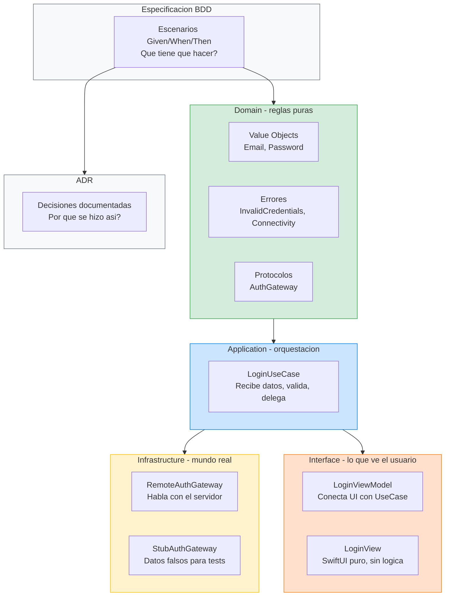
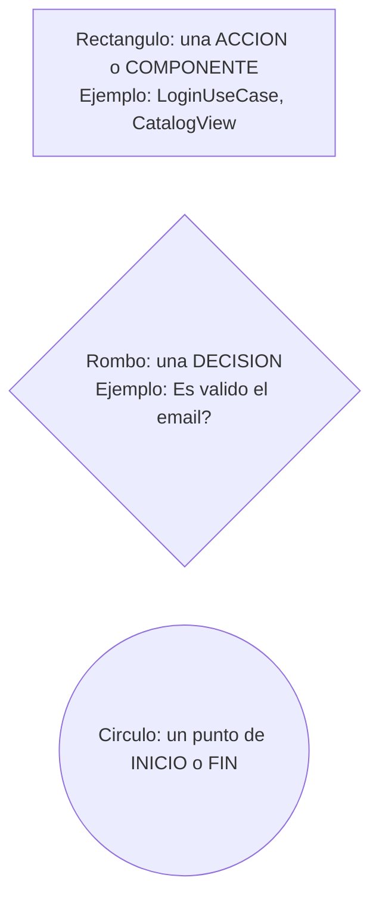
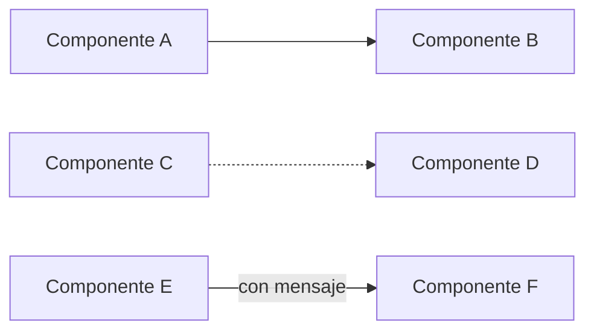
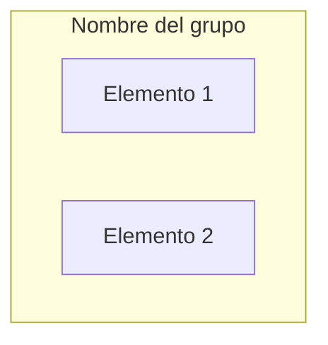
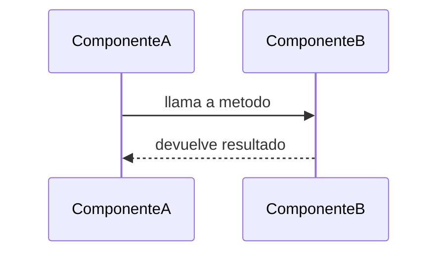
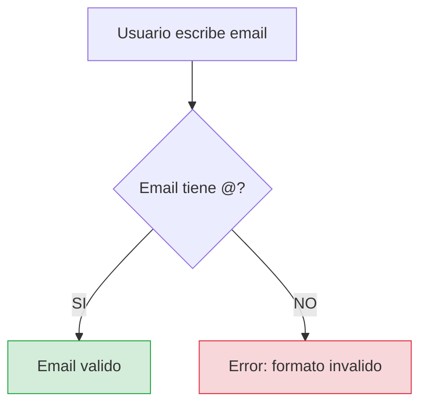

# Introducción al curso

## Etapa 1 — Junior: Fundamentos operables

Bienvenido a **Stack: My Architecture iOS**. Este no es un curso para leer por encima y olvidar. Es un curso para **construir**, paso a paso, una base de código iOS de producción real, con la misma disciplina que usaría un equipo profesional en una empresa de software seria.

Antes de empezar a escribir ni una sola línea de código, necesitas entender algo fundamental: la mayoría de los problemas que encontrarás como desarrollador iOS no son problemas de Swift, ni de SwiftUI, ni de frameworks. Son problemas de **diseño**. Son problemas de no saber dónde poner las cosas, de no saber cuándo separar y cuándo no, de no saber cómo proteger tu código para que un cambio en una parte no rompa otra parte que no tiene nada que ver.

Este curso existe para resolver exactamente eso.

---

## Por qué existe este curso

Imagina que trabajas en una aplicación iOS con 20 pantallas, 5 desarrolladores y un backend que cambia cada dos semanas. Un día te piden añadir una funcionalidad nueva: "que el usuario pueda hacer login con biometría además de con email y contraseña". Si tu código está bien diseñado, ese cambio debería afectar a un puñado de archivos dentro de la feature de Login, sin tocar absolutamente nada del catálogo de productos, del perfil de usuario ni de la navegación. Si tu código está mal diseñado, vas a tener que abrir 15 archivos repartidos por todo el proyecto, rezar para que no se rompa nada, y probablemente introducir un bug en una pantalla que ni siquiera tiene que ver con el login.

La diferencia entre esos dos escenarios no es talento ni años de experiencia. Es **disciplina de diseño**. Y esa disciplina es exactamente lo que vamos a aprender juntos.

---

## Tu mapa de progresión: de cero a arquitecto

Antes de empezar, mira dónde estás y a dónde vas. Este diagrama muestra el camino completo del curso. Cada etapa construye sobre la anterior, sin saltos:

```mermaid
graph LR
    subgraph E1["Etapa 1: Junior"]
        direction TB
        E1A["Principios de ingeniería"]
        E1B["BDD + TDD"]
        E1C["Clean Architecture"]
        E1D["Feature Login completa"]
    end

    subgraph E2["Etapa 2: Mid"]
        direction TB
        E2A["Segunda feature: Catálogo"]
        E2B["Integración entre features"]
        E2C["Navegación desacoplada"]
        E2D["Composition Root"]
    end

    subgraph E3["Etapa 3: Senior"]
        direction TB
        E3A["Cache y offline"]
        E3B["Decorator pattern"]
        E3C["Observabilidad"]
        E3D["Quality gates"]
    end

    subgraph E4["Etapa 4: Arquitecto"]
        direction TB
        E4A["Bounded contexts"]
        E4B["Gobernanza técnica"]
        E4C["ADRs de sistema"]
        E4D["Multi-módulo"]
    end

    subgraph E5["Etapa 5: Maestria"]
        direction TB
        E5A["Swift Concurrency"]
        E5B["SwiftUI performance"]
        E5C["Composición avanzada"]
        E5D["Migración Swift 6"]
    end

    E1 --> E2 --> E3 --> E4 --> E5

    style E1 fill:#d4edda,stroke:#28a745
    style E2 fill:#cce5ff,stroke:#007bff
    style E3 fill:#fff3cd,stroke:#ffc107
    style E4 fill:#ffe0cc,stroke:#fd7e14
    style E5 fill:#f8d7da,stroke:#dc3545
```

**Estás aquí: Etapa 1.** Todo lo que aprendas aquí es la base de todo lo demás. Si interiorizas bien los fundamentos, las etapas posteriores encajarán naturalmente. Si los saltas o los lees por encima, cada etapa siguiente será más confusa.

---

## Qué vas a ser capaz de hacer al terminar esta etapa

Al completar la Etapa 1, habrás construido tu primera feature completa (un Login) aplicando todas las prácticas profesionales que usarás durante el resto del curso. Pero más importante que la feature en sí, habrás interiorizado una forma de pensar que te acompañará el resto de tu carrera:

**Primero, entender el problema.** Antes de abrir Xcode, antes de crear un archivo, antes de escribir un `struct`, vas a sentarte a definir qué tiene que hacer tu código. Vas a escribir escenarios concretos: "cuando el usuario mete un email válido y un password correcto, el sistema le deja entrar". "Cuando el usuario mete un email que no tiene arroba, el sistema le dice que el formato es inválido". Esto se llama BDD (Behavior-Driven Development) y es lo primero que haremos con cada feature.

**Segundo, diseñar los contratos.** Una vez que sabes qué tiene que pasar, defines las piezas: qué tipos vas a necesitar (un `Email`, un `Password`, un `Session`), qué errores pueden ocurrir (`InvalidCredentials`, `Connectivity`), y qué protocolos (interfaces) van a conectar las piezas entre sí. Todavía no has escrito implementación. Solo has definido las fronteras.

**Tercero, escribir los tests antes del código.** Esto es TDD (Test-Driven Development). Escribes un test que dice "cuando le paso un email válido y un password correcto al caso de uso de login, debería devolverme una sesión". Ese test falla porque el caso de uso no existe todavía. Entonces escribes lo mínimo para que pase. Y luego limpias. Red, Green, Refactor. Así con cada comportamiento.

**Cuarto, implementar capa por capa.** Empiezas por el dominio (las reglas de negocio puras), luego la aplicación (los casos de uso), luego la infraestructura (la conexión con el servidor), y finalmente la interfaz (la vista SwiftUI). Cada capa tiene una responsabilidad clara y no se mezcla con las demás.

**Quinto, documentar las decisiones.** Cada vez que tomas una decisión de diseño ("¿por qué usé un struct en vez de una clase?", "¿por qué el ViewModel recibe un closure en vez de navegar directamente?"), la escribes en un ADR (Architecture Decision Record). No porque sea burocracia, sino porque dentro de tres meses, cuando vuelvas a ese código, vas a agradecer tener escrito el "por qué".

---

## A quién va dirigido

Este curso está pensado para desarrolladores iOS que ya saben programar en Swift y han trabajado con SwiftUI al menos a nivel básico. Sabes qué es un `struct`, qué es un protocolo, cómo funcionan los closures y los generics. Has creado vistas con `@State` y `@Binding`. Probablemente has construido alguna app pequeña o mediana.

Lo que probablemente **no** has hecho es trabajar con una arquitectura real que escale. Has oído hablar de MVVM, de Clean Architecture, quizá de VIPER, pero cuando intentas aplicarlo sientes que estás copiando carpetas sin entender realmente por qué están ahí. Has visto tutoriales de TDD pero nunca lo has aplicado de forma sistemática en un proyecto real. Has leído sobre DDD pero te parece algo de backend que no tiene que ver contigo.

Si te reconoces en algo de esto, este curso es para ti. No vamos a asumir que sabes nada de arquitectura, ni de DDD, ni de TDD. Vamos a explicar cada concepto desde cero, con ejemplos concretos, y lo vamos a aplicar inmediatamente en código real que puedes ejecutar en Xcode.

---

## Qué vas a construir en esta etapa

En la Etapa 1 vas a construir una **feature de Login** completa. "Completa" no significa "con animaciones bonitas y social login". Significa que va a tener todas las piezas que necesita una feature profesional.

### Diagrama: anatomía de tu primera feature

Cada caja del diagrama es algo que vas a construir con tus manos. Cuando termines, entenderás no solo qué hace cada pieza, sino **por qué existe** y **qué pasaría si no existiera**. Eso es lo que separa a alguien que copia un tutorial de alguien que entiende la arquitectura.

Una **especificación de comportamiento** escrita antes de tocar código, que describe exactamente qué debe pasar en cada escenario posible: qué pasa cuando el login es exitoso, qué pasa cuando las credenciales son incorrectas, qué pasa cuando no hay internet, qué pasa cuando el email no tiene formato válido, qué pasa cuando el password está vacío.

Un **dominio** con modelos que se protegen a sí mismos. Un `Email` que no puede existir si no tiene formato válido. Un `Password` que no puede existir si está vacío. Esto se llama "validez por construcción": si el objeto existe, es válido. No necesitas validar después.

Un **caso de uso** que orquesta el flujo: recibe los datos crudos del usuario (strings), intenta construir los Value Objects del dominio, y si son válidos, delega la autenticación a un servicio externo a través de un protocolo. El caso de uso no sabe ni le importa si la autenticación va por internet, por un fake, o por una paloma mensajera. Solo sabe que tiene un protocolo que puede llamar.

Una **infraestructura** con dos implementaciones del mismo protocolo: una real que habla con un servidor, y un stub que devuelve datos falsos para desarrollo y tests.

Una **interfaz SwiftUI** que recoge email y password, llama al caso de uso, y muestra el resultado. La vista no contiene lógica de negocio. No sabe qué es un email válido. No sabe cómo se autentica. Solo sabe que tiene un botón y que cuando lo pulsas, algo pasa.

Y un **ADR** donde documentas por qué tomaste cada decisión importante.

---

## Las reglas del juego

Hay cuatro reglas que vamos a seguir durante todo el curso sin excepción. No son sugerencias. No son "buenas prácticas que estaría bien seguir si te acuerdas". Son reglas. Si las rompes, el curso pierde su sentido.

**Regla 1: No se escribe código de producción sin un test que falle primero.** Esto es la base del TDD. Si quieres implementar que el login falle cuando el email es inválido, primero escribes un test que llama al caso de uso con un email inválido y verifica que devuelve el error correcto. Ese test falla porque el comportamiento no existe todavía. Entonces, y solo entonces, escribes el código que lo hace pasar. Si no hay un test rojo, no hay código nuevo.

**Regla 2: No se toca código sin haber escrito los escenarios BDD primero.** Antes de abrir Xcode, antes de crear un archivo `.swift`, los escenarios de la feature están escritos y revisados. Esto nos obliga a pensar en el problema antes de pensar en la solución. Es la práctica más barata y la que más retrabajo evita.

**Regla 3: Las capas no se mezclan.** El dominio no importa SwiftUI. La aplicación no importa URLSession. La interfaz no sabe cómo se valida un email. Cada capa tiene su responsabilidad y no invade la de las demás. Si te encuentras escribiendo `import SwiftUI` dentro de un archivo de dominio, algo está mal.

**Regla 4: Las decisiones se documentan.** Cuando tomas una decisión que no es obvia (y muchas no lo son), la escribes. "¿Por qué usé un `struct` y no un `class`?" "¿Por qué la navegación se hace por closure y no con `NavigationLink`?" Escribir el razonamiento te obliga a pensar bien la decisión, y le permite a tu yo del futuro (o a un compañero nuevo) entender el porqué sin tener que adivinarlo.

---

## Prerequisitos técnicos

Para seguir el curso necesitas tener instalado:

**Xcode 16 o superior** con **Swift 6.2**. El curso usa características de Swift moderno, incluyendo strict concurrency, que es una de las novedades más importantes del lenguaje y que vamos a trabajar en profundidad. Necesitas una versión de Xcode que soporte Swift 6.2 para que todo compile correctamente.

**macOS Sequoia o superior.** Xcode 16 requiere una versión reciente de macOS. Asegúrate de tener tu sistema actualizado.

En cuanto a conocimientos previos, necesitas saber lo siguiente de Swift: tipos (structs, classes, enums), protocolos, closures, generics y manejo básico de errores con `throws`. De SwiftUI necesitas saber crear vistas básicas, usar `@State` y `@Binding`, y entender que SwiftUI es declarativo (describes la UI, no la construyes paso a paso).

No necesitas saber nada de arquitectura de software, ni de Clean Architecture, ni de DDD, ni de TDD, ni de BDD. Todo eso lo vamos a aprender desde cero en este curso. Si ya sabes algo, mejor: podrás conectar lo que ya conoces con lo que vamos a construir. Pero no es requisito.

---

## Cómo está organizado el material

Cada lección de este curso sigue un formato pensado para que puedas estudiar de forma autónoma, sin depender de vídeos ni de un instructor en vivo. Cada lección contiene:

**Una explicación narrativa paso a paso.** No bullets sueltos ni frases telegráficas. Explicaciones completas que puedes leer como si fueran un libro. Cada concepto se introduce con contexto, se explica con detalle, y se conecta con lo que ya sabes.

**Código completo y ejecutable.** Tanto el código de producción como los tests. No "fragmentos" que tienes que adivinar cómo ensamblar. Código que puedes copiar en Xcode y ejecutar. Los tests usan **XCTest**, el framework de testing nativo de Apple.

**Diagramas en texto** (Mermaid) que visualizan las relaciones entre componentes, el flujo de datos, y las dependencias entre capas. Si nunca has leído un diagrama de flujo, no te preocupes: justo abajo te explicamos cómo leerlos.

**Decisiones documentadas** (ADRs) que explican el razonamiento detrás de cada decisión de diseño importante, incluyendo las alternativas que se descartaron y por qué.

---

## Cómo leer los diagramas de este curso (guía para principiantes)

En este curso usamos **diagramas de flujo** para que veas de un vistazo cómo se conectan las piezas. Si nunca has leído uno, esta sección te enseña todo lo que necesitas saber. Una vez que entiendas las reglas, podrás leer cualquier diagrama del curso sin dudar.

### Las formas: qué significa cada caja

Cada forma en un diagrama tiene un significado:

- **Rectangulo** (las cajas con esquinas rectas `["texto"]`): representan **componentes**, **acciones** o **datos**. Es lo mas comun. Cuando ves una caja rectangular que dice "LoginUseCase", significa que hay un componente llamado LoginUseCase que hace algo.
- **Rombo** (las cajas con forma de diamante `{"texto"}`): representan **decisiones** o **preguntas**. Siempre tienen dos o mas flechas saliendo de ellas, una por cada respuesta posible. Por ejemplo: "Usuario autenticado?" con flechas "SI" y "NO".
- **Circulo** (las formas redondas `(("texto"))` o `(( ))`): representan **puntos de inicio o fin** de un flujo. Es como decir "aqui empieza" o "aqui termina".

### Las flechas: qué significa cada conexión

- **Flecha solida** (`-->`): significa que A **depende de** B, o que A **llama a** B, o que A **se conecta con** B. Es una relacion directa y real que existe en el codigo.
- **Flecha punteada** (`-.->`): significa una relacion **indirecta**, **prohibida**, o **futura**. Cuando ves una flecha punteada que dice "PROHIBIDO", quiere decir que esa conexion NO debe existir en el codigo. Cuando dice "futuro", significa que todavia no existe pero existira mas adelante.
- **Flecha con texto** (`-->|"texto"|`): la etiqueta en la flecha te dice **que tipo de relacion** es. Por ejemplo, `-->|"protocolo"|` significa que la conexion es a traves de un protocolo. `-->|"SI"|` y `-->|"NO"|` te dicen que camino se sigue segun la respuesta a una decision.

### Las cajas grandes (subgraphs): agrupaciones

Los **subgraphs** (cajas grandes que contienen otras cajas) representan **agrupaciones logicas**. Todo lo que esta dentro de una caja grande pertenece al mismo concepto. Por ejemplo:

- Un subgraph llamado "Domain" contiene todos los componentes que pertenecen a la capa Domain.
- Un subgraph llamado "Test UNITARIO" agrupa los componentes que participan en un test unitario.
- Un subgraph llamado "Etapa 1: Junior" agrupa todo lo que aprendes en la primera etapa.

### Los colores: qué significan

En los diagramas de este curso usamos colores de forma consistente:

- **Verde** (`fill:#d4edda`): algo **positivo**, **correcto**, o la capa **Domain** (la mas interna y pura).
- **Azul** (`fill:#cce5ff`): la capa **Application**, o algo **intermedio/neutro**.
- **Amarillo** (`fill:#fff3cd`): la capa **Infrastructure**, o algo que requiere **atencion/precaucion**.
- **Naranja** (`fill:#ffe0cc`): la capa **Interface**, o algo que esta en la **periferia**.
- **Rojo** (`fill:#f8d7da`): algo **negativo**, **incorrecto**, o un **error**.
- **Gris** (`fill:#f8f9fa`): algo **neutro**, de **referencia**, o **documentacion**.

### Los diagramas de secuencia: quién habla con quién

Ademas de los diagramas de flujo, usamos **diagramas de secuencia** que muestran el orden en que los componentes se comunican:

Leelos de **arriba hacia abajo**: el tiempo avanza hacia abajo. Cada linea horizontal es un **mensaje** (una llamada a un metodo o una respuesta). Las flechas solidas (`->>`) son llamadas. Las flechas punteadas (`-->>`) son respuestas. Los recuadros grises (`Note over`) son comentarios que explican lo que esta pasando en ese momento.

### Ejemplo practico: cómo leer un diagrama completo

Vamos a leer este diagrama paso a paso:

**Paso 1:** Empieza por la caja de arriba: "Usuario escribe email". Eso es lo que pasa primero.

**Paso 2:** Sigue la flecha hacia abajo. Llegas a un rombo: "Email tiene @?". Es una pregunta/decision. Tiene dos flechas saliendo.

**Paso 3:** Si la respuesta es "SI" (flecha de la izquierda), llegas a una caja verde: "Email valido". Verde = positivo, correcto.

**Paso 4:** Si la respuesta es "NO" (flecha de la derecha), llegas a una caja roja: "Error: formato invalido". Rojo = error, algo salio mal.

**Eso es todo.** Asi se leen todos los diagramas del curso. Siempre de arriba a abajo (o de izquierda a derecha), siguiendo las flechas, tomando decisiones en los rombos, y leyendo los textos de las flechas para saber que pasa entre un paso y otro.

**Reflexiones de diseño** al final de cada lección que te ayudan a interiorizar cuándo aplicar lo que has aprendido y cuándo no. Porque tan importante como saber usar un patrón es saber cuándo **no** usarlo.

---

## Cómo avanzar por el curso

El curso está dividido en cuatro etapas que progresan en complejidad. La Etapa 1 (Junior) establece los fundamentos. La Etapa 2 (Mid) añade una segunda feature y la integración entre ambas. La Etapa 3 (Senior) introduce problemas reales de producción como caching, offline y observabilidad. La Etapa 4 (Arquitecto) escala el sistema a nivel de plataforma con gobernanza y quality gates.

**Sigue el orden.** Cada etapa construye sobre la anterior. Si saltas a la Etapa 3 sin haber interiorizado la 1 y la 2, vas a sentir que todo es abstracto y desconectado. Si sigues el orden, cada concepto nuevo encaja naturalmente con lo que ya sabes.

**No leas por encima.** Lee cada lección completa, escribe el código en Xcode (no solo lo leas), ejecuta los tests, y asegúrate de que entiendes por qué cada pieza está donde está. Si algo no te queda claro, vuelve a leerlo. El curso está escrito para que no necesites buscar en otro sitio.

**Siguiente lección:** [Principios de ingeniería →](01-principios-ingenieria.md)
