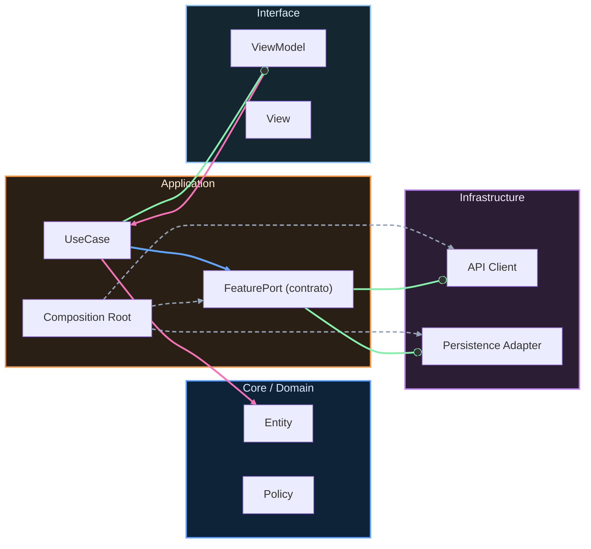

# Setup: Preparación del entorno

<!-- sma:meta:v1 -->
meta_leccion:
  tiempo_lectura: "25 min"
  tiempo_practica: "45 min"
  dificultad: 1
  prerequisitos: []
  si_te_atascas: "#troubleshooting-comun"
<!-- /sma:meta:v1 -->

## 1. Bienvenida y cómo estudiar este curso

Antes de escribir tu primera línea de código, necesitas un entorno de trabajo estable. Este curso está diseñado para que aprendas arquitectura iOS de forma práctica, construyendo una app real paso a paso.

**¿Por qué empezamos aquí?** Porque en el desarrollo profesional, el 80% de los problemas que frenan a un equipo no son de código: son de entorno, configuración o herramientas. Si dominas el setup, podrás enfocarte en lo que realmente importa: diseñar buena arquitectura.

### Ritmo de estudio recomendado

- **No copies y pegues código**. Escribirlo tú mismo activa la memoria muscular.
- **Si algo falla, no saltes**. El error es parte del aprendizaje; documenta qué pasó y cómo lo resolviste.
- **Haz los ejercicios propuestos**. No son opcionales; son donde realmente consolidas.

> **¿Usas el scaffold SPM incluido en el repositorio?** Si clonaste el repo del curso, tu punto de partida es `apps/ios/ArchitectureKit/`. Puedes saltar las secciones 5 y 6 (crear paquete SPM y proyecto Xcode desde cero) y usar directamente `swift build` y `swift test` dentro de esa carpeta. Las secciones 2–4 (Xcode, Terminal, Git) siguen siendo necesarias.

## 2. Instalar Xcode paso a paso

Xcode es el IDE oficial de Apple para desarrollar apps iOS. Es gratuito y se instala desde la Mac App Store.

### 2.1 Descarga e instalación

1. Abre **App Store** en tu Mac.
2. Busca "Xcode" (es una app grande, ~15 GB).
3. Haz clic en **Obtener** y luego **Instalar**.
4. Espera la descarga (puede tardar 30-60 minutos dependiendo de tu conexión).

### 2.2 Verificar la versión de Swift

Una vez instalado, abre **Terminal** (Aplicaciones > Utilidades > Terminal) y ejecuta:

```bash
swift --version
```text

Deberías ver algo como:

```text
swift-driver version: 1.115 Apple Swift version 6.0.2 (swiftlang-6.0.2.1.2)
```text

**Importante:** Este curso requiere Swift 6.0 o superior. Si ves una versión anterior, actualiza Xcode desde la App Store.

## Pausa y practica
<!-- sma:exercise:v1 -->

**Contexto:** Acabas de instalar Xcode y quieres confirmar que todo está listo.

**Tarea:** Abre Terminal y ejecuta `swift --version`. Toma una captura de pantalla o anota la versión que aparece.

<details>
<summary>💡 Pista 1: Dónde encontrar Terminal</summary>

Terminal está en Aplicaciones > Utilidades. También puedes buscarlo con Spotlight (Cmd + Espacio) y escribir "terminal".

</details>

<details>
<summary>💡 Pista 2: Qué debe aparecer</summary>

Debes ver "Apple Swift version 6.0" o superior. Si ves "command not found", Xcode no está instalado correctamente.

</details>

<details>
<summary>✅ Solución completa</summary>

1. Abre Terminal
2. Escribe: `swift --version`
3. Presiona Enter
4. Si ves "Apple Swift version 6.0.x", ¡listo! Si no, reinstala Xcode.

</details>
<!-- /sma:exercise:v1 -->

## 3. Terminal básica

La Terminal es tu puerta de entrada al sistema operativo. No te asusta: es como el Finder, pero con texto.

### 3.1 Comandos esenciales

| Comando | Qué hace | Ejemplo |
|---------|----------|---------|
| `pwd` | Muestra dónde estás | `pwd` → `/Users/tu-nombre` |
| `ls` | Lista archivos | `ls` → muestra carpetas y archivos |
| `cd` | Cambia de carpeta | `cd Documentos` |
| `mkdir` | Crea carpeta | `mkdir MiProyecto` |
| `cat` | Muestra contenido | `cat README.md` |

### 3.2 Tu primer ejercicio en Terminal

1. Abre Terminal
2. Escribe: `cd ~` (te lleva a tu carpeta de inicio)
3. Escribe: `mkdir Curso-iOS` (crea una carpeta)
4. Escribe: `cd Curso-iOS` (entra en la carpeta)
5. Escribe: `pwd` (verifica dónde estás)

Deberías ver algo como: `/Users/tu-nombre/Curso-iOS`

## Pausa y practica
<!-- sma:exercise:v1 -->

**Contexto:** Quieres organizar tus proyectos del curso en carpetas separadas por etapas.

**Tarea:** Crea la siguiente estructura de carpetas usando Terminal:
```text
Curso-iOS/
├── Etapa-1/
├── Etapa-2/
├── Etapa-3/
├── Etapa-4/
└── Etapa-5/
```xml

<details>
<summary>💡 Pista 1: Secuencia de comandos</summary>

Primero `cd ~`, luego `cd Curso-iOS`, luego varios `mkdir`.

</details>

<details>
<summary>💡 Pista 2: Comando para múltiples carpetas</summary>

Puedes crear todas de una vez: `mkdir Etapa-1 Etapa-2 Etapa-3 Etapa-4 Etapa-5`

</details>

<details>
<summary>✅ Solución completa</summary>

```bash
cd ~
cd Curso-iOS
mkdir Etapa-1 Etapa-2 Etapa-3 Etapa-4 Etapa-5
ls  # Verifica que se crearon
```xml

</details>
<!-- /sma:exercise:v1 -->

## 4. Git desde cero

Git es un sistema de control de versiones. Piensa en él como el "deshacer" ilimitado de tu proyecto, con historial completo de cambios.

### 4.1 Configuración inicial

```bash
git config --global user.name "Tu Nombre"
git config --global user.email "tu@email.com"
```text

### 4.2 Comandos básicos

| Comando | Qué hace |
|---------|----------|
| `git init` | Inicia un repositorio |
| `git add .` | Prepara todos los cambios |
| `git commit -m "mensaje"` | Guarda los cambios con descripción |
| `git status` | Muestra estado actual |
| `git log` | Muestra historial de cambios |

### 4.3 Tu primer repositorio

```bash
cd ~/Curso-iOS/Etapa-1
git init
echo "# Mi Proyecto iOS" > README.md
git add .
git commit -m "Primer commit: setup inicial"
git log
```text

## Pausa y practica
<!-- sma:exercise:v1 -->

**Contexto:** Quieres practicar el ciclo básico de Git con un archivo de prueba.

**Tarea:** Crea un archivo `practica.txt` con tu nombre, haz `git add`, `git commit`, y luego verifica con `git log` que aparece el commit.

<details>
<summary>💡 Pista 1: Crear archivo</summary>

En Terminal: `echo "Tu Nombre" > practica.txt`

</details>

<details>
<summary>💡 Pista 2: Secuencia Git</summary>

1. `git status` (verifica que hay cambios)
2. `git add practica.txt`
3. `git commit -m "Agrego archivo de practica"`
4. `git log` (verifica el historial)

</details>

<details>
<summary>✅ Solución completa</summary>

```bash
cd ~/Curso-iOS/Etapa-1
echo "Tu Nombre" > practica.txt
git status
git add practica.txt
git commit -m "Agrego archivo de practica"
git log --oneline
```text

Deberías ver tu commit en la lista.

</details>
<!-- /sma:exercise:v1 -->

## 5. Crear tu primer Package SPM

SPM (Swift Package Manager) es la forma moderna de organizar código Swift. Es como una caja de herramientas que puedes compartir y reutilizar.

### 5.1 Crear un paquete

```bash
cd ~/Curso-iOS/Etapa-1
swift package init --type library --name MiLibreria
```text

Esto crea:
```text
MiLibreria/
├── Package.swift          # Configuración del paquete
├── Sources/
│   └── MiLibreria/
│       └── MiLibreria.swift
└── Tests/
    └── MiLibreriaTests/
        └── MiLibreriaTests.swift
```text

### 5.2 Compilar y testear

```bash
cd MiLibreria
swift build        # Compila el código
swift test         # Ejecuta los tests
```text

Si todo va bien, verás:
```text
Building for debugging...
Build complete!
Test Suite 'MiLibreriaTests' started...
```text

## Pausa y practica
<!-- sma:exercise:v1 -->

**Contexto:** Quieres asegurarte de que tu entorno SPM funciona correctamente.

**Tarea:** Crea un paquete llamado `PruebaSetup`, compílalo con `swift build`, y ejecuta `swift test`. Documenta si ves algún error.

<details>
<summary>💡 Pista 1: Secuencia completa</summary>

```bash
cd ~/Curso-iOS/Etapa-1
swift package init --type library --name PruebaSetup
cd PruebaSetup
swift build
swift test
```xml

</details>

<details>
<summary>💡 Pista 2: Qué debe pasar</summary>

Debes ver "Build complete!" y luego los tests pasando (generalmente 1 test por defecto).

</details>

<details>
<summary>✅ Solución completa</summary>

```bash
cd ~/Curso-iOS/Etapa-1
swift package init --type library --name PruebaSetup
cd PruebaSetup
swift build
swift test
```text

Si ves errores, verifica que `swift --version` sea 6.0+.

</details>
<!-- /sma:exercise:v1 -->

## 6. Crear proyecto Xcode iOS

Ahora crearemos una app iOS real que se ejecute en el simulador.

### 6.1 Crear el proyecto

1. Abre **Xcode**.
2. Selecciona **Create New Project** (o File > New > Project).
3. Elige la plantilla **App** (bajo iOS).
4. Configura:
   - **Name**: `MiPrimeraApp`
   - **Team**: None (o tu cuenta personal)
   - **Organization Identifier**: `com.tunombre`
   - **Interface**: SwiftUI
   - **Language**: Swift
   - **Storage**: None
5. Guarda en `~/Curso-iOS/Etapa-1/`

### 6.2 Ejecutar en simulador

1. En Xcode, selecciona un simulador (ej: iPhone 16 Pro) en la barra superior.
2. Presiona **Cmd + R** (o el botón ▶️).
3. Espera a que compile y el simulador se abra.
4. Deberías ver "Hello, World!" en la pantalla del simulador.

### 6.3 Ejecutar tests

Presiona **Cmd + U** para ejecutar los tests. Deberían pasar todos (generalmente hay tests por defecto).

## Pausa y practica
<!-- sma:exercise:v1 -->

**Contexto:** Quieres verificar que tu setup de Xcode está completo.

**Tarea:** Crea un proyecto Xcode llamado `VerificacionSetup`, ejecútalo en el simulador, y corre los tests con Cmd + U. Anota si todo funciona o qué errores aparecen.

<details>
<summary>💡 Pista 1: Plantilla correcta</summary>

En Xcode, elige **App** bajo la pestaña iOS. No elijas otros tipos como Game o Document App.

</details>

<details>
<summary>💡 Pista 2: Si el simulador no aparece</summary>

Ve a Xcode > Settings > Platforms y asegúrate de que iOS esté instalado.

</details>

<details>
<summary>✅ Solución completa</summary>

1. Xcode > File > New > Project
2. Selecciona "App" bajo iOS
3. Name: `VerificacionSetup`
4. Guarda en `~/Curso-iOS/Etapa-1/`
5. Selecciona iPhone 16 Pro como destino
6. Cmd + R para ejecutar
7. Cmd + U para tests

Si todo funciona, verás la app en el simulador y los tests pasando.

</details>
<!-- /sma:exercise:v1 -->

## 7. Checkpoint: ¿Puedo empezar la Etapa 1?

Antes de continuar, verifica que tienes todo listo:

- [ ] Xcode instalado (Swift 6.0+)
- [ ] Terminal básica dominada (cd, ls, mkdir)
- [ ] Git configurado y funcionando
- [ ] SPM funciona (swift build, swift test)
- [ ] Puedo crear y ejecutar un proyecto Xcode
- [ ] Los tests pasan en Xcode

Si marcaste todas las casillas, **estás listo para la Etapa 1**. Si no, repasa la sección correspondiente antes de continuar.

## Troubleshooting común {#troubleshooting-comun}

### "swift: command not found"
**Causa:** Xcode no está instalado o no se configuró en el PATH.
**Solución:**
```bash
sudo xcode-select --install
sudo xcode-select --switch /Applications/Xcode.app/Contents/Developer
```

### "No such module" al compilar
**Causa:** El proyecto no encuentra dependencias.
**Solución:** File > Packages > Reset Package Caches en Xcode.

### El simulador no inicia
**Causa:** Puede ser falta de espacio o problema con el simulador.
**Solución:**
1. Xcode > Window > Devices and Simulators
2. Selecciona el simulador y dale "Erase All Content and Settings"
3. Intenta de nuevo

### "Signing for requires a development team"
**Causa:** Xcode necesita un equipo de desarrollo para firmar la app.
**Solución:**
1. Selecciona el proyecto en el navegador
2. Ve a la pestaña "Signing & Capabilities"
3. En "Team", selecciona "None" o tu cuenta personal

### Tests que fallan sin motivo aparente
**Causa:** A veces Xcode cachea estados inconsistentes.
**Solución:** Product > Clean Build Folder (Cmd + Shift + K), luego Cmd + U de nuevo.

## Verificación de comprensión

¿Por qué crees que es importante dominar el entorno (Terminal, Git, Xcode) antes de escribir código de arquitectura? Piensa en una situación donde no conocieras estas herramientas: ¿qué pasaría si te pidieran "haz commit de tus cambios" y no supieras qué significa?

## Continuación

- 
-

---

<!-- auto-gapfix:layered-mermaid -->
## Diagrama de arquitectura por capas



La lectura del diagrama sigue esta semantica:
1. `-->` dependencia directa en runtime.
2. `-.->` wiring o configuracion.
3. `==>` contrato o abstraccion.
4. `--o` salida o propagacion de resultado.
