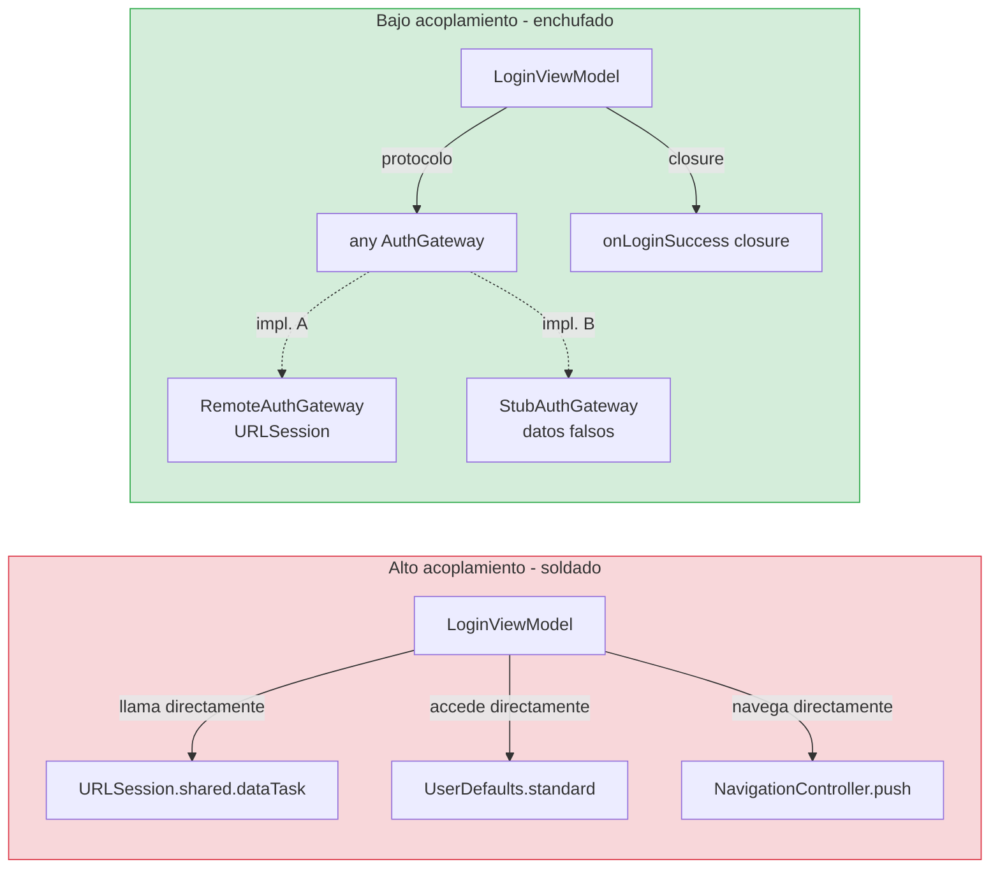
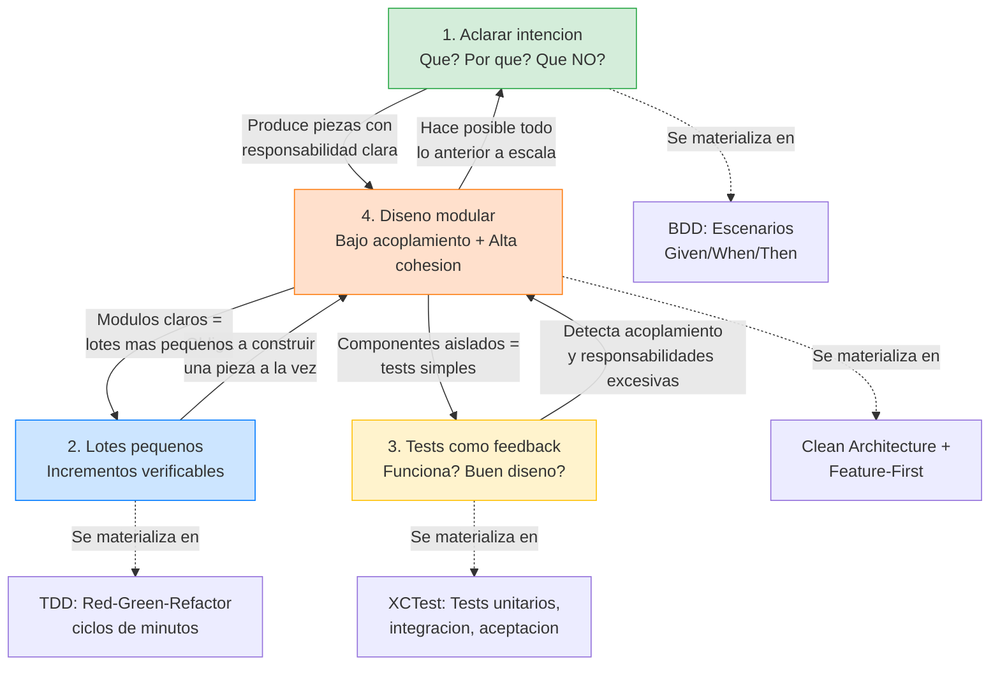

# Principios de ingeniería

## Los cimientos sobre los que se construye todo lo demás

Antes de hablar de capas, de patrones, de Swift o de SwiftUI, necesitamos establecer los principios de ingeniería que van a guiar **todas** las decisiones que tomemos en este curso. Estos principios no son específicos de iOS. No son específicos de Swift. Son principios universales del desarrollo de software profesional que aplican igual si estás construyendo una app móvil, un backend en Go, o un sistema embebido en C. Lo que cambia es cómo los aplicamos en nuestro contexto concreto (iOS con Swift), pero la base es la misma.

Si interiorizas estos cuatro principios, todo lo que viene después en el curso (Clean Architecture, DDD, TDD, Feature-First) tendrá sentido. Si no los interiorizas, todo lo demás parecerá burocracia sin propósito. Así que tómate esta lección en serio. Es la más importante del curso, aunque no tenga ni una línea de Swift.

---

## Principio 1: Aclarar la intención antes de codificar

Este es el principio más simple de todos, y paradójicamente el que más gente ignora. Consiste en algo tan básico como responder tres preguntas antes de escribir una sola línea de código:

**¿Qué tiene que hacer esto?** No "cómo lo voy a implementar", sino "qué comportamiento tiene que tener". Por ejemplo: "este componente tiene que recibir un email y un password, validar que tienen formato correcto, y si son correctos, autenticar al usuario contra un servidor". Eso es el "qué".

**¿Por qué existe?** ¿Qué necesidad de negocio resuelve? Si no puedes responder a esta pregunta, quizá ese componente no debería existir. "Existe porque el usuario necesita autenticarse para acceder a su cuenta". Eso es el "por qué".

**¿Qué NO debe hacer?** Esto es igual de importante que las dos anteriores. "Este componente NO sabe cómo se muestran los errores en la pantalla. NO sabe a qué pantalla se navega después del login. NO sabe si la autenticación va por internet o por Bluetooth". Definir los límites es lo que te protege de que el componente crezca sin control.

Probablemente estás pensando: "esto es obvio, yo ya lo hago mentalmente". Y es posible que sea verdad. Pero hay una diferencia enorme entre hacerlo mentalmente y hacerlo de forma explícita. Cuando lo haces mentalmente, es fácil que los límites se difuminen conforme avanzas. Empiezas implementando el caso de uso de login y, sin darte cuenta, acabas metiendo lógica de navegación dentro del caso de uso porque "es más fácil aquí". Cuando lo haces de forma explícita (escribiéndolo, aunque sea en un comentario o en un escenario BDD), los límites quedan claros y es mucho más difícil cruzarlos por accidente.

En este curso, esta práctica se materializa en dos cosas concretas. Primero, en los **escenarios BDD** que escribiremos antes de cada feature: son la respuesta explícita a "¿qué tiene que hacer esto?". Segundo, en los **ADRs** (Architecture Decision Records) que escribiremos para decisiones no obvias: son la respuesta explícita a "¿por qué se hizo así y no de otra forma?".

### Un ejemplo real para que quede claro

Imagina que te piden implementar la validación del email en el login. Sin aclarar intención, muchos desarrolladores abrirían Xcode, crearían una función `isValidEmail(_ email: String) -> Bool` en algún sitio, meterían una regex copiada de StackOverflow, y seguirían adelante.

Con el principio de aclarar intención, antes de tocar código te preguntas:

"¿Qué tiene que hacer esto?" → Validar que un string tiene formato de email. Si no lo tiene, rechazarlo con un error que diga claramente qué está mal.

"¿Por qué existe?" → Porque no queremos enviar peticiones al servidor con datos que sabemos que son basura. La validación local es instantánea y le ahorra al usuario esperar una respuesta del servidor para algo que podíamos detectar en el momento.

"¿Qué NO debe hacer?" → No debe guardar el email en ningún sitio. No debe llamar a ningún servicio. No debe saber nada de UI ni de red. Solo valida formato.

Con esas tres respuestas, las decisiones de diseño se toman solas: esto es un Value Object (un tipo que encapsula un valor con reglas de validación), vive en la capa Domain, y no tiene dependencias externas. Si no hubieras aclarado la intención, podrías haber acabado metiendo la validación dentro del ViewModel, mezclando la lógica de formato con la presentación de errores, y haciendo imposible reutilizar la validación sin arrastrar todo el ViewModel.

---

## Principio 2: Iteración y lotes pequeños

Este principio dice algo que parece obvio pero que en la práctica casi nadie aplica correctamente: **trabaja en incrementos pequeños y completos**. Cada incremento debería ser lo suficientemente pequeño como para poder terminarlo, testearlo y verificar que funciona en un período corto de tiempo (minutos u horas, no días).

Para entender por qué esto importa, piensa en lo contrario. Imagina que decides implementar toda la feature de Login de golpe: la validación del email, la validación del password, el caso de uso, la llamada al servidor, el manejo de errores, la vista de SwiftUI, la navegación al home, todo junto. Te pasas tres días escribiendo código. Cuando por fin ejecutas la app, algo no funciona. ¿Dónde está el error? Podría estar en cualquiera de las decenas de archivos que has tocado. Depurar va a ser una pesadilla. Y si resulta que el enfoque que tomaste en la validación del email no era el correcto, tienes que deshacer tres días de trabajo que se construyó sobre esa base.

Ahora imagina el enfoque de lotes pequeños. Primero implementas solo el Value Object `Email` con su validación. Escribes los tests, los ejecutas, verificas que funcionan. Tardas 15 minutos. Luego implementas el Value Object `Password`. Otros 10 minutos. Luego el caso de uso que usa ambos. Otros 20 minutos. En cada paso, tienes certeza de que lo anterior funciona. Si algo falla, sabes exactamente dónde buscar: en lo último que has cambiado. Y si descubres que tu enfoque de validación del email no era correcto, solo deshaces 15 minutos de trabajo, no tres días.

### Cómo saber si tu lote es demasiado grande

Hay una señal de alerta muy sencilla: si llevas más de una o dos horas sin ejecutar los tests (o sin compilar, como mínimo), tu lote es demasiado grande. En TDD, el ciclo Red-Green-Refactor dura entre 1 y 10 minutos por iteración. Eso significa que cada pocos minutos estás verificando que todo sigue funcionando. Si te alejas de esa cadencia, es momento de parar y preguntarte: "¿puedo partir esto en pasos más pequeños?".

En este curso, la disciplina de lotes pequeños se aplica a todo. Cuando construyamos la feature de Login, no la haremos de golpe. Primero los Value Objects. Luego los errores. Luego el caso de uso con el primer escenario (login exitoso). Luego el segundo escenario (credenciales inválidas). Luego el tercero (sin conectividad). Cada paso es un lote pequeño, verificable, y reversible si algo sale mal.

### La conexión con el feedback

La razón fundamental de trabajar en lotes pequeños es **acortar el ciclo de feedback**. En desarrollo de software, el feedback es la señal que te dice si vas por buen camino o no. Los tests son una forma de feedback. La compilación es otra. El review de un compañero es otra. Cuanto más rápido llega el feedback, antes detectas problemas y menos cuesta arreglarlos.

Un bug que detectas a los 5 minutos de escribirlo se arregla en 30 segundos. Un bug que detectas a los 3 días se arregla en horas (si tienes suerte) porque primero tienes que encontrarlo, luego entender cómo llegó ahí, y luego arreglar todo lo que se construyó encima.

---

## Principio 3: Los tests como mecanismo primario de feedback

Cuando hablamos de feedback en el principio anterior, mencionamos varias fuentes: compilación, tests, code review. De todas ellas, los tests automatizados son los más potentes porque son rápidos, repetibles, y objetivos. Un test no tiene opiniones ni se cansa. Ejecuta exactamente lo mismo cada vez y te dice sí o no.

Pero es importante entender que no todos los tests son iguales en coste y beneficio. En la industria se usa la metáfora de la **pirámide de pruebas** para explicar esto:

En la base de la pirámide están los **tests unitarios** (unit tests). Son los más baratos de escribir, los más rápidos de ejecutar (milisegundos), y los que te dan feedback más inmediato. Testean un componente aislado: un Value Object, un caso de uso, una función. No necesitan red, ni base de datos, ni UI. Son la base de tu estrategia de testing, y en este curso van a ser la gran mayoría de tus tests.

En el medio de la pirámide están los **tests de integración** (integration tests). Testean la colaboración entre dos o más componentes reales, sin mocks ni stubs. Por ejemplo: un test que verifica que el caso de uso y el gateway real trabajan juntos correctamente. Son más lentos que los unitarios porque implican más piezas, pero son necesarios para verificar que las piezas encajan. Tendremos menos tests de integración que unitarios, pero no cero.

En la cúspide de la pirámide están los **tests de UI/E2E** (end-to-end). Testean el sistema completo desde la perspectiva del usuario: pulsar un botón, ver un resultado en pantalla. Son los más lentos, los más frágiles (se rompen con cambios cosméticos), y los más caros de mantener. Tendremos muy pocos, solo para validar los criterios de aceptación más críticos.

### El matiz importante: los tests guían el diseño

Hay una idea que diferencia radicalmente a los equipos profesionales de los que no lo son. Los tests no son solo una red de seguridad para detectar bugs. **Los tests guían el diseño del código**. Esto suena abstracto, así que vamos con un ejemplo concreto.

Imagina que intentas escribir un test para un ViewModel que dentro tiene llamadas a URLSession, acceso a UserDefaults, lógica de validación, y manejo de navegación. Para testear ese ViewModel, necesitarías mockear URLSession (complicado), mockear UserDefaults (incómodo), y de alguna forma verificar la navegación (difícil sin UI). El test te está diciendo algo: "este componente tiene demasiadas responsabilidades". La dificultad para testearlo es una señal de diseño. Si el test es difícil de escribir, el componente está mal diseñado.

Ahora imagina que separas las responsabilidades: la validación va a Value Objects (testeables con tests triviales), la llamada al servidor va detrás de un protocolo (inyectable con un stub), y la navegación se maneja con un closure (verificable sin UI). De repente, cada pieza es fácil de testear. Y no es casualidad: es porque cada pieza tiene una sola responsabilidad.

En este curso, cada vez que un test sea difícil de escribir, vamos a parar y preguntarnos: "¿es el test el que está mal, o es el diseño el que está mal?". La mayoría de las veces, es el diseño. Y el test nos lo está diciendo.

### La disciplina test-first

En este curso escribimos el test **antes** del código de producción. Siempre. Esto se llama TDD (Test-Driven Development) y lo vamos a ver en profundidad en la siguiente lección. Por ahora, lo importante es entender el por qué: si escribes el test primero, estás obligado a pensar en el comportamiento que quieres antes de pensar en la implementación. Si escribes la implementación primero y luego le pones tests, estás testeando lo que ya existe (que puede o no ser lo correcto), no lo que debería existir.

Todos los tests del curso usan **XCTest**, el framework de testing nativo de Apple. No usamos frameworks de terceros para testing. XCTest viene con Xcode, es el estándar de la industria iOS, y es todo lo que necesitamos.

---

## Principio 4: Diseño modular — bajo acoplamiento y alta cohesión

Este es el principio de diseño más importante de todos, y el que más impacto tiene en la mantenibilidad de un proyecto a largo plazo. Consiste en dos ideas complementarias: que los módulos de tu sistema estén **poco acoplados** entre sí y que cada módulo sea **altamente cohesivo** por dentro.

### Qué es el acoplamiento y por qué importa

Dos componentes están **acoplados** cuando cambiar uno obliga a cambiar el otro. Cuanto más acoplados estén, más difícil es modificar el sistema sin romper cosas.

Piensa en un ejemplo cotidiano. Imagina que tienes una lámpara enchufada a la pared. Si quieres cambiar la bombilla, desatornillas la vieja y atornillas la nueva. No necesitas tocar el cable, ni la pared, ni el interruptor. Eso es bajo acoplamiento: la bombilla y el enchufe se conectan a través de una interfaz estándar (el casquillo), y puedes cambiar uno sin afectar al otro.

Ahora imagina que la bombilla está soldada directamente al cable eléctrico. Para cambiarla, necesitas cortar el cable, deshacer la soldadura, conectar la nueva bombilla, y volver a soldar. Eso es alto acoplamiento: las piezas están tan entrelazadas que no puedes tocar una sin afectar a la otra.

En software pasa exactamente lo mismo. Si tu ViewModel llama directamente a `URLSession.shared.dataTask(...)`, está "soldado" a URLSession. Si mañana necesitas cambiar de URLSession a una librería de networking, o simplemente necesitas testear el ViewModel sin hacer peticiones de red reales, tienes un problema. En cambio, si tu ViewModel recibe un protocolo `HTTPClient` que puede ser implementado por URLSession, por un fake, o por cualquier otra cosa, el ViewModel está "enchufado" a una interfaz estándar y puedes cambiar la implementación sin tocarlo.

### Diagrama: acoplamiento alto vs bajo en nuestro proyecto

En el primer caso, si quieres testear el ViewModel, necesitas un servidor HTTP real, acceso a UserDefaults, y una jerarquía de navegación. En el segundo, le pasas un `StubAuthGateway` que devuelve lo que tú quieras, y verificas el resultado. **La diferencia no es estilo: es la diferencia entre "puedo testear esto en 1 segundo" y "necesito 30 minutos montando infraestructura".**

### El test mental del acoplamiento

Hay una pregunta muy sencilla para detectar acoplamiento alto: "Si quiero cambiar el componente A por una razón que solo tiene que ver con A, ¿necesito abrir y modificar el componente B?" Si la respuesta es sí, A y B están acoplados. Y cuantos más componentes tengas que tocar por un cambio que solo debería afectar a uno, peor es el acoplamiento de tu sistema.

### Qué es la cohesión y por qué importa

La cohesión es la otra cara de la moneda. Un módulo es **cohesivo** cuando todo lo que contiene está relacionado con una misma responsabilidad, con un mismo motivo de cambio. Si abres un archivo y encuentras validación de emails, formateo de fechas, y lógica de navegación, ese archivo tiene baja cohesión: las cosas que contiene no tienen relación entre sí.

El test mental de la cohesión es intentar describir lo que hace un módulo en una sola frase, sin usar la palabra "y". Si puedes decir "este módulo valida direcciones de email", es cohesivo. Si tienes que decir "este módulo valida emails **y** formatea fechas **y** gestiona la navegación", la cohesión es baja.

### Cómo se aplica esto en el curso

En este curso, cada feature se organiza en cuatro capas (Domain, Application, Infrastructure, Interface), y cada capa tiene una responsabilidad clara y no invade las demás. Esto es bajo acoplamiento entre capas. Dentro de cada capa, los archivos están agrupados por función: los Value Objects van juntos, los casos de uso van juntos, los adaptadores de red van juntos. Esto es alta cohesión dentro de cada capa.

Pero además, y esto es crucial, hay un lugar específico donde todas las piezas se ensamblan: el **Composition Root**. Es el único lugar del sistema que sabe cómo se conectan las piezas entre sí. El dominio no sabe quién lo usa. El caso de uso no sabe quién implementa sus puertos. La vista no sabe cómo se creó su ViewModel. Solo el Composition Root (que vive en el punto de entrada de la app) conoce las implementaciones concretas y las conecta.

Esto es fundamental. Si dejas que los componentes se conozcan entre sí y se instancien mutuamente, el acoplamiento crece sin control. Si centralizas la composición en un único lugar, puedes cambiar cualquier implementación (un gateway real por un fake, un repositorio de red por uno de disco) cambiando una sola línea en el Composition Root, sin tocar ningún otro componente del sistema.

Piensa en ello como un director de orquesta. Los músicos (los componentes) no se coordinan entre sí directamente. Cada uno toca su instrumento. El director (el Composition Root) es el que sabe quién toca qué y cuándo, y los coordina a todos.

---

## Cómo se conectan los cuatro principios entre sí

Estos cuatro principios no son independientes. Se refuerzan mutuamente:

Aclarar la intención (Principio 1) te ayuda a definir **qué** tiene que hacer cada pieza antes de implementarla. Eso conduce naturalmente a piezas cohesivas (Principio 4) porque cada pieza nace con una responsabilidad clara.

Trabajar en lotes pequeños (Principio 2) te obliga a construir una pieza a la vez, lo que favorece el bajo acoplamiento (Principio 4) porque no puedes acoplar algo que todavía no has construido.

Los tests (Principio 3) te dan feedback inmediato sobre la calidad de tu diseño. Si un test es difícil de escribir, el diseño tiene demasiado acoplamiento o demasiada responsabilidad. Y como trabajas en lotes pequeños, detectas el problema pronto y lo arreglas barato.

Y el diseño modular (Principio 4) hace que todo lo anterior sea posible a escala. Sin módulos claros con fronteras definidas, aclarar intenciones se vuelve confuso, los lotes se hacen grandes porque todo depende de todo, y los tests se vuelven frágiles porque están acoplados a la implementación.

En las siguientes lecciones vamos a ver cómo estos principios se materializan en prácticas concretas: BDD para aclarar intenciones, TDD para feedback rápido por tests, Clean Architecture para diseño modular, y Feature-First para cohesión por funcionalidad.

---

**Anterior:** [Introducción ←](00-introduccion.md) · **Siguiente:** [Metodología BDD + TDD →](02-metodologia-bdd-tdd.md)
