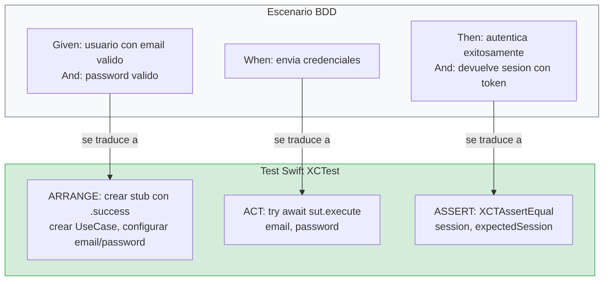

# Metodología BDD: especificación y descubrimiento

## Dos prácticas complementarias que se necesitan mutuamente

En la lección anterior hablamos de principios abstractos: aclarar intención, lotes pequeños, tests como feedback, diseño modular. En esta lección vamos a convertir esos principios en una **metodología concreta** que vas a aplicar cada vez que construyas una feature en este curso. Esa metodología se compone de dos prácticas que trabajan juntas: BDD (Behavior-Driven Development) y TDD (Test-Driven Development).

La relación entre ambas es muy sencilla de entender si piensas en las preguntas que responde cada una:

BDD responde a la pregunta: **"¿Qué tiene que hacer el sistema?"** Se ocupa de definir el comportamiento esperado en lenguaje que cualquiera pueda entender, incluido alguien que no sabe programar. Es la práctica de especificación. Ocurre antes de escribir código.

TDD responde a la pregunta: **"¿Cómo implemento eso con seguridad?"** Se ocupa de guiar la implementación paso a paso, escribiendo primero un test que describe un comportamiento concreto, luego el código mínimo que lo hace pasar, y luego limpiando el diseño. Es la práctica de implementación disciplinada.

Sin BDD, no sabes exactamente qué construir. Puedes hacer TDD perfecto y construir algo que no es lo que se necesitaba. Sin TDD, sabes qué construir pero no tienes la disciplina ni la red de seguridad para hacerlo de forma incremental y confiable. Las dos prácticas juntas forman un flujo completo: primero defines qué, luego implementas con seguridad.

Para que el estudio sea más ligero, esta metodología ahora está dividida en dos lecciones: aquí cubrimos la parte de **BDD** (especificación) y en la siguiente cubrimos la parte de **TDD** (implementación).

---

## BDD: Behavior-Driven Development

### Qué es y de dónde viene

BDD nació como una evolución de TDD. Dan North, su creador, se dio cuenta de que muchos equipos hacían TDD de forma mecánica (escribir tests, hacer que pasen) pero sin tener claro qué comportamiento estaban construyendo. El resultado era código con muchos tests pero que no necesariamente hacía lo que el negocio necesitaba.

La idea central de BDD es que antes de escribir un solo test, te sientes a definir **escenarios de comportamiento** del sistema. Estos escenarios se escriben en un lenguaje semi-estructurado que cualquier persona del equipo puede leer y validar: un product manager, un diseñador, un QA, un desarrollador. No son código. Son descripciones de lo que debería pasar cuando el usuario (o el sistema) hace algo.

### El formato Given/When/Then

Los escenarios BDD siguen un formato que probablemente ya has visto, aunque no supieras que era BDD:

```
Scenario: [Descripción breve de lo que se está probando]
  Given [un contexto inicial, un estado del sistema]
  When [ocurre una acción o un evento]
  Then [el resultado esperado, lo que debería pasar]
```

**Given** describe el estado inicial del mundo antes de que ocurra la acción. Es el contexto. "Dado que existe un usuario registrado con email user@example.com y un password válido". "Dado que el dispositivo no tiene conexión a internet".

**When** describe la acción que desencadena el comportamiento. Es lo que el usuario hace o lo que el sistema recibe. "Cuando el usuario envía sus credenciales". "Cuando el usuario pulsa el botón de login".

**Then** describe el resultado esperado. Es lo que debería ocurrir como consecuencia de la acción dado ese contexto. "Entonces el sistema autentica al usuario exitosamente". "Entonces el sistema muestra un mensaje de error de conectividad".

Vamos a ver esto aplicado al Login con varios escenarios reales, no solo el caso feliz:

```
Feature: Login de usuario

Scenario: Login exitoso con credenciales válidas
  Given un usuario registrado con email "user@example.com"
  And un password válido "Pass1234"
  When el usuario envía sus credenciales
  Then el sistema autentica al usuario exitosamente
  And el sistema devuelve una sesión con un token de acceso

Scenario: Login fallido por credenciales incorrectas
  Given un usuario registrado con email "user@example.com"
  When el usuario envía el password "incorrecto"
  Then el sistema rechaza la autenticación
  And el sistema devuelve un error de tipo credenciales inválidas
  And no se crea ninguna sesión

Scenario: Login fallido por falta de conectividad
  Given un usuario con credenciales válidas
  And el dispositivo no tiene conexión a internet
  When el usuario intenta hacer login
  Then el sistema devuelve un error de tipo conectividad
  And no se crea ninguna sesión

Scenario: Login rechazado por email con formato inválido
  Given un email sin formato válido como "esto-no-es-email"
  When el usuario intenta construir las credenciales
  Then el sistema rechaza el email antes de intentar la autenticación
  And devuelve un error de tipo email inválido

Scenario: Login rechazado por password vacío
  Given un email válido "user@example.com"
  And un password vacío ""
  When el usuario intenta construir las credenciales
  Then el sistema rechaza el password antes de intentar la autenticación
  And devuelve un error de tipo password vacío
```

### Cómo se lee un escenario BDD paso a paso

Si nunca has leído un escenario Given/When/Then, vamos a desglosar uno palabra por palabra para que no quede duda:

```
Scenario: Login exitoso con credenciales válidas
  Given un usuario registrado con email "user@example.com"
  And un password válido "Pass1234"
  When el usuario envía sus credenciales
  Then el sistema autentica al usuario exitosamente
  And el sistema devuelve una sesión con un token de acceso
```

**Línea 1 — `Scenario:`** — Es el título. Describe en una frase corta qué estamos probando. Siempre empieza con `Scenario:`. Es como el título de una película: te dice de qué va sin darte todos los detalles.

**Línea 2 — `Given`** — Describe el **estado inicial del mundo** antes de que pase nada. ¿Qué tiene que ser verdad para que este escenario tenga sentido? Aquí: que existe un usuario con el email "user@example.com". En el test, esto se traduce al **ARRANGE**: crear los datos y configurar el stub.

**Línea 3 — `And`** — Es una continuación del Given. Añade más contexto. Aquí: que el password es "Pass1234". Puedes tener varios `And` seguidos.

**Línea 4 — `When`** — Describe la **acción** que desencadena el comportamiento. ¿Qué hace el usuario o el sistema? Aquí: el usuario envía sus credenciales. En el test, esto se traduce al **ACT**: la llamada al método del SUT.

**Línea 5 — `Then`** — Describe el **resultado esperado**. ¿Qué debería pasar como consecuencia? Aquí: el sistema autentica al usuario. En el test, esto se traduce al **ASSERT**: la verificación con `XCTAssertEqual`.

**Línea 6 — `And`** — Continuación del Then. Más detalles del resultado. Aquí: además de autenticar, devuelve una sesión con un token.

### Cómo se traduce un escenario BDD a un test Swift

Cada escenario BDD se convierte en un test. La traducción es directa:



Veamos la traducción completa del escenario del happy path:

```
BDD:                                          TEST SWIFT:
─────────────────────────────────────────     ─────────────────────────────────────────
Given un usuario con email válido             let gateway = AuthGatewayStub(
  And un password válido                          result: .success(expectedSession))
                                              let sut = LoginUseCase(authGateway: gateway)

When el usuario envía credenciales            let session = try await sut.execute(
                                                  email: "user@example.com",
                                                  password: "Pass1234")

Then autentica exitosamente                   XCTAssertEqual(session, expectedSession)
  And devuelve sesión con token               XCTAssertEqual(session.token, "valid-token")
```

Y la traducción de un sad path:

```
BDD:                                          TEST SWIFT:
─────────────────────────────────────────     ─────────────────────────────────────────
Given un email sin formato válido             let sut = LoginUseCase(authGateway: gateway)
  "esto-no-es-email"

When intenta construir credenciales           do {
                                                  _ = try await sut.execute(
                                                      email: "esto-no-es-email",
                                                      password: "pass")
                                                  XCTFail("Expected error")

Then rechaza el email                         } catch {
  And devuelve error email inválido               XCTAssertEqual(error as? LoginUseCase.Error,
                                                      .invalidEmail)
                                              }
```

**Regla de oro:** cada `Scenario` BDD se convierte en exactamente un `func test_...()` en Swift. Si tienes 5 escenarios, tienes 5 tests. El nombre del test describe el escenario: `test_execute_with_invalid_email_throws_invalidEmail`.

### Por qué esto importa tanto

Mira lo que acabamos de conseguir sin escribir ni una línea de Swift. Tenemos una lista completa de **todos los comportamientos** que el Login debe soportar. Tenemos claro qué errores existen y cuándo ocurren. Sabemos que la validación del email y del password ocurre **antes** de intentar la autenticación remota (eso es una decisión de diseño que sale directamente de los escenarios). Sabemos que hay al menos cuatro tipos de error diferentes.

Si le enseñas estos escenarios a otro desarrollador, a tu jefe, o a un QA, pueden validar si es correcto o si falta algo. "Oye, ¿y qué pasa si el usuario cancela el login mientras está en progreso?" Buena pregunta. Añadimos un escenario:

```
Scenario: Login cancelado por el usuario
  Given un usuario con credenciales válidas
  And una autenticación en progreso
  When el usuario cancela la operación
  Then el sistema cancela la petición de red
  And no se emite ningún resultado de login
```

Ahora tenemos un escenario más que no habríamos pensado si hubiéramos ido directamente a escribir código. Este es el poder de BDD: te obliga a pensar en los casos antes de implementarlos, cuando el coste de añadir un caso nuevo es cero (solo texto), en lugar de descubrirlo después de haber implementado todo lo demás.

### BDD y el lenguaje ubicuo (DDD)

Hay un detalle muy importante en los escenarios que acabamos de escribir: los términos que usamos. Hablamos de "credenciales", de "sesión", de "autenticación", de "email", de "password". Estos no son términos técnicos arbitrarios. Son los términos del **dominio de negocio**. Son las palabras que usaría alguien de producto o de negocio para describir el login.

En DDD (Domain-Driven Design), a esto se le llama **lenguaje ubicuo** (ubiquitous language). La idea es que todos los miembros del equipo (negocio, diseño, desarrollo, QA) usen exactamente los mismos términos, y que esos mismos términos aparezcan en el código. No hablamos de "login data" en el código y de "credenciales" en las reuniones. Usamos "credenciales" en todas partes: en los escenarios, en los tipos Swift (`Credentials`), en los tests, y en las conversaciones.

Cuando escribes escenarios BDD con cuidado, el lenguaje ubicuo emerge de forma natural. Y cuando implementas el código siguiendo esos escenarios, los nombres de tus tipos y funciones reflejan el lenguaje del negocio, no jerga técnica inventada.

### Cuándo usar BDD y cuándo no

BDD se aplica siempre que vayas a construir un **comportamiento nuevo** que sea visible para el usuario o que represente una regla de negocio. Eso incluye cada feature nueva, cada caso de uso nuevo, y cada bug que necesites reproducir antes de arreglar (convertir el bug en un escenario es la mejor forma de asegurarte de que no vuelve a ocurrir).

BDD **no** se aplica cuando estás haciendo un refactor interno que no cambia ningún comportamiento visible. Si estás reorganizando código, extrayendo un protocolo, o renombrando variables, no necesitas nuevos escenarios BDD porque el comportamiento del sistema no cambia. Los tests existentes ya cubren eso.

---

## Puente hacia TDD (siguiente lección)

Hasta aquí hemos resuelto el **qué** y el **por qué** de la feature con escenarios de comportamiento. Ese trabajo conecta directamente con el **Principio 1** de la lección de principios: aclarar la intención antes de codificar.

En la siguiente lección pasamos al **cómo**: implementar cada comportamiento con TDD usando ciclos cortos Red-Green-Refactor.

---

**Anterior:** [Principios de ingeniería ←](01-principios-ingenieria.md) · **Siguiente:** [Metodología TDD: práctica Red-Green-Refactor →](02-metodologia-tdd-practica.md)
