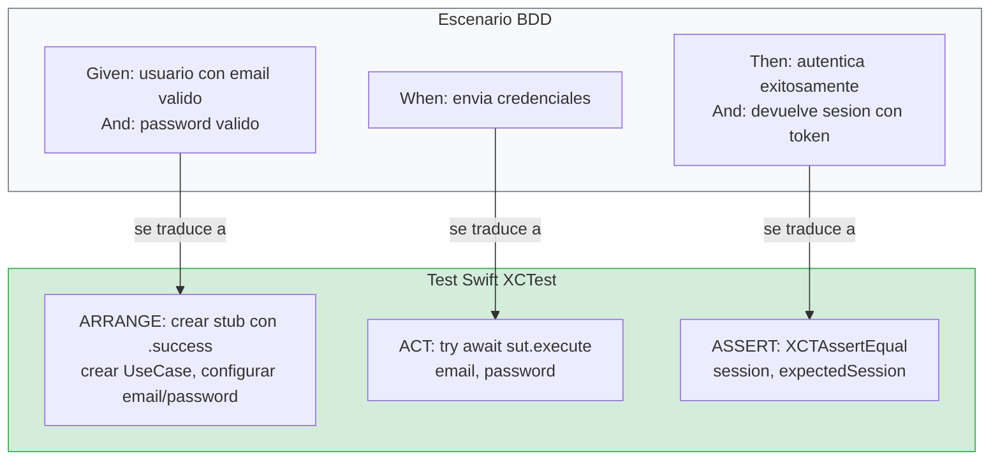
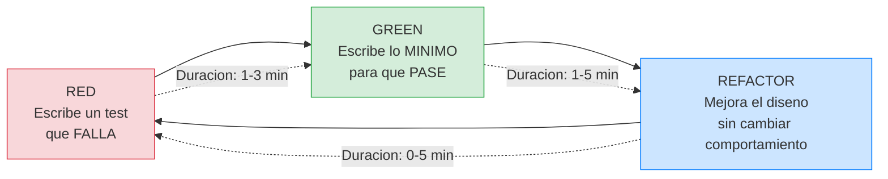
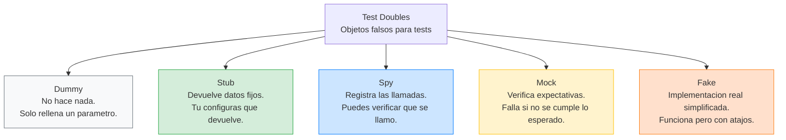
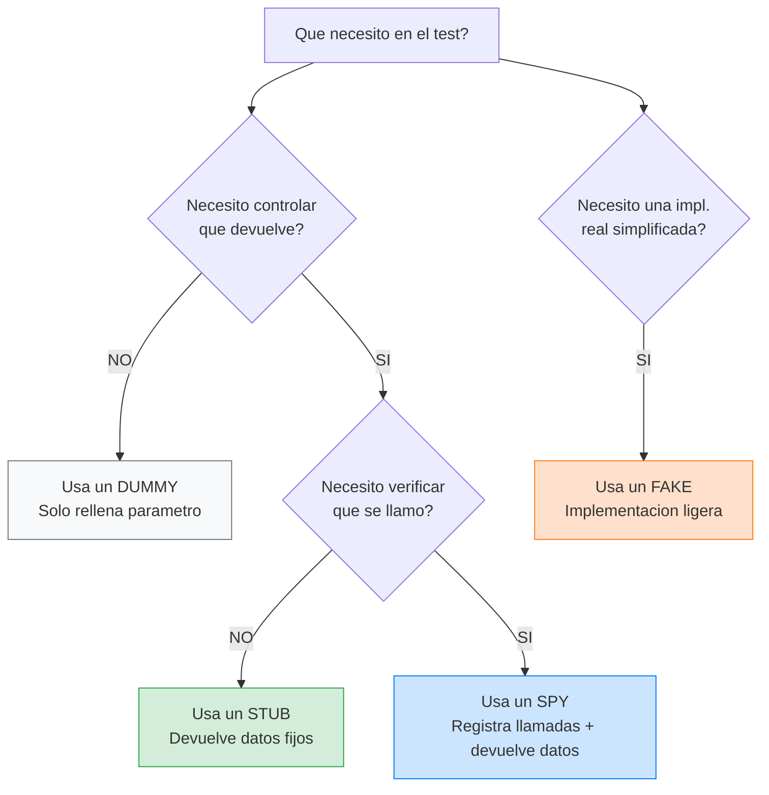
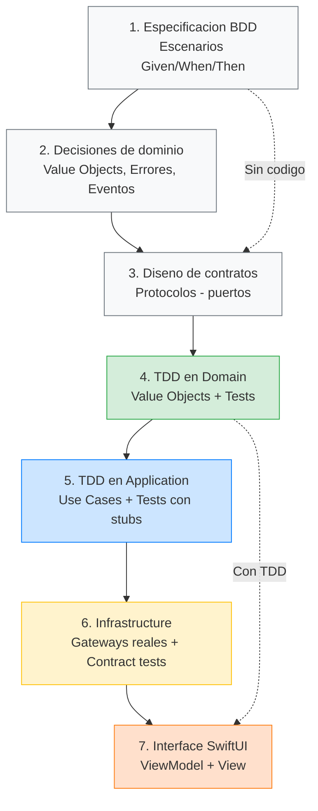
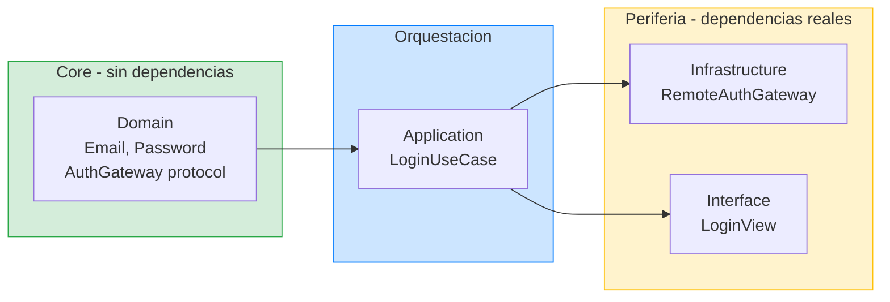

# Metodología: BDD + TDD

## Dos prácticas complementarias que se necesitan mutuamente

En la lección anterior hablamos de principios abstractos: aclarar intención, lotes pequeños, tests como feedback, diseño modular. En esta lección vamos a convertir esos principios en una **metodología concreta** que vas a aplicar cada vez que construyas una feature en este curso. Esa metodología se compone de dos prácticas que trabajan juntas: BDD (Behavior-Driven Development) y TDD (Test-Driven Development).

La relación entre ambas es muy sencilla de entender si piensas en las preguntas que responde cada una:

BDD responde a la pregunta: **"¿Qué tiene que hacer el sistema?"** Se ocupa de definir el comportamiento esperado en lenguaje que cualquiera pueda entender, incluido alguien que no sabe programar. Es la práctica de especificación. Ocurre antes de escribir código.

TDD responde a la pregunta: **"¿Cómo implemento eso con seguridad?"** Se ocupa de guiar la implementación paso a paso, escribiendo primero un test que describe un comportamiento concreto, luego el código mínimo que lo hace pasar, y luego limpiando el diseño. Es la práctica de implementación disciplinada.

Sin BDD, no sabes exactamente qué construir. Puedes hacer TDD perfecto y construir algo que no es lo que se necesitaba. Sin TDD, sabes qué construir pero no tienes la disciplina ni la red de seguridad para hacerlo de forma incremental y confiable. Las dos prácticas juntas forman un flujo completo: primero defines qué, luego implementas con seguridad.

---

## BDD: Behavior-Driven Development

### Qué es y de dónde viene

BDD nació como una evolución de TDD. Dan North, su creador, se dio cuenta de que muchos equipos hacían TDD de forma mecánica (escribir tests, hacer que pasen) pero sin tener claro qué comportamiento estaban construyendo. El resultado era código con muchos tests pero que no necesariamente hacía lo que el negocio necesitaba.

La idea central de BDD es que antes de escribir un solo test, te sientes a definir **escenarios de comportamiento** del sistema. Estos escenarios se escriben en un lenguaje semi-estructurado que cualquier persona del equipo puede leer y validar: un product manager, un diseñador, un QA, un desarrollador. No son código. Son descripciones de lo que debería pasar cuando el usuario (o el sistema) hace algo.

### El formato Given/When/Then

Los escenarios BDD siguen un formato que probablemente ya has visto, aunque no supieras que era BDD:

```
Scenario: [Descripción breve de lo que se está probando]
  Given [un contexto inicial, un estado del sistema]
  When [ocurre una acción o un evento]
  Then [el resultado esperado, lo que debería pasar]
```

**Given** describe el estado inicial del mundo antes de que ocurra la acción. Es el contexto. "Dado que existe un usuario registrado con email user@example.com y un password válido". "Dado que el dispositivo no tiene conexión a internet".

**When** describe la acción que desencadena el comportamiento. Es lo que el usuario hace o lo que el sistema recibe. "Cuando el usuario envía sus credenciales". "Cuando el usuario pulsa el botón de login".

**Then** describe el resultado esperado. Es lo que debería ocurrir como consecuencia de la acción dado ese contexto. "Entonces el sistema autentica al usuario exitosamente". "Entonces el sistema muestra un mensaje de error de conectividad".

Vamos a ver esto aplicado al Login con varios escenarios reales, no solo el caso feliz:

```
Feature: Login de usuario

Scenario: Login exitoso con credenciales válidas
  Given un usuario registrado con email "user@example.com"
  And un password válido "Pass1234"
  When el usuario envía sus credenciales
  Then el sistema autentica al usuario exitosamente
  And el sistema devuelve una sesión con un token de acceso

Scenario: Login fallido por credenciales incorrectas
  Given un usuario registrado con email "user@example.com"
  When el usuario envía el password "incorrecto"
  Then el sistema rechaza la autenticación
  And el sistema devuelve un error de tipo credenciales inválidas
  And no se crea ninguna sesión

Scenario: Login fallido por falta de conectividad
  Given un usuario con credenciales válidas
  And el dispositivo no tiene conexión a internet
  When el usuario intenta hacer login
  Then el sistema devuelve un error de tipo conectividad
  And no se crea ninguna sesión

Scenario: Login rechazado por email con formato inválido
  Given un email sin formato válido como "esto-no-es-email"
  When el usuario intenta construir las credenciales
  Then el sistema rechaza el email antes de intentar la autenticación
  And devuelve un error de tipo email inválido

Scenario: Login rechazado por password vacío
  Given un email válido "user@example.com"
  And un password vacío ""
  When el usuario intenta construir las credenciales
  Then el sistema rechaza el password antes de intentar la autenticación
  And devuelve un error de tipo password vacío
```

### Cómo se lee un escenario BDD paso a paso

Si nunca has leído un escenario Given/When/Then, vamos a desglosar uno palabra por palabra para que no quede duda:

```
Scenario: Login exitoso con credenciales válidas
  Given un usuario registrado con email "user@example.com"
  And un password válido "Pass1234"
  When el usuario envía sus credenciales
  Then el sistema autentica al usuario exitosamente
  And el sistema devuelve una sesión con un token de acceso
```

**Línea 1 — `Scenario:`** — Es el título. Describe en una frase corta qué estamos probando. Siempre empieza con `Scenario:`. Es como el título de una película: te dice de qué va sin darte todos los detalles.

**Línea 2 — `Given`** — Describe el **estado inicial del mundo** antes de que pase nada. ¿Qué tiene que ser verdad para que este escenario tenga sentido? Aquí: que existe un usuario con el email "user@example.com". En el test, esto se traduce al **ARRANGE**: crear los datos y configurar el stub.

**Línea 3 — `And`** — Es una continuación del Given. Añade más contexto. Aquí: que el password es "Pass1234". Puedes tener varios `And` seguidos.

**Línea 4 — `When`** — Describe la **acción** que desencadena el comportamiento. ¿Qué hace el usuario o el sistema? Aquí: el usuario envía sus credenciales. En el test, esto se traduce al **ACT**: la llamada al método del SUT.

**Línea 5 — `Then`** — Describe el **resultado esperado**. ¿Qué debería pasar como consecuencia? Aquí: el sistema autentica al usuario. En el test, esto se traduce al **ASSERT**: la verificación con `XCTAssertEqual`.

**Línea 6 — `And`** — Continuación del Then. Más detalles del resultado. Aquí: además de autenticar, devuelve una sesión con un token.

### Cómo se traduce un escenario BDD a un test Swift

Cada escenario BDD se convierte en un test. La traducción es directa:



Veamos la traducción completa del escenario del happy path:

```
BDD:                                          TEST SWIFT:
─────────────────────────────────────────     ─────────────────────────────────────────
Given un usuario con email válido             let gateway = AuthGatewayStub(
  And un password válido                          result: .success(expectedSession))
                                              let sut = LoginUseCase(authGateway: gateway)

When el usuario envía credenciales            let session = try await sut.execute(
                                                  email: "user@example.com",
                                                  password: "Pass1234")

Then autentica exitosamente                   XCTAssertEqual(session, expectedSession)
  And devuelve sesión con token               XCTAssertEqual(session.token, "valid-token")
```

Y la traducción de un sad path:

```
BDD:                                          TEST SWIFT:
─────────────────────────────────────────     ─────────────────────────────────────────
Given un email sin formato válido             let sut = LoginUseCase(authGateway: gateway)
  "esto-no-es-email"

When intenta construir credenciales           do {
                                                  _ = try await sut.execute(
                                                      email: "esto-no-es-email",
                                                      password: "pass")
                                                  XCTFail("Expected error")

Then rechaza el email                         } catch {
  And devuelve error email inválido               XCTAssertEqual(error as? LoginUseCase.Error,
                                                      .invalidEmail)
                                              }
```

**Regla de oro:** cada `Scenario` BDD se convierte en exactamente un `func test_...()` en Swift. Si tienes 5 escenarios, tienes 5 tests. El nombre del test describe el escenario: `test_execute_with_invalid_email_throws_invalidEmail`.

### Por qué esto importa tanto

Mira lo que acabamos de conseguir sin escribir ni una línea de Swift. Tenemos una lista completa de **todos los comportamientos** que el Login debe soportar. Tenemos claro qué errores existen y cuándo ocurren. Sabemos que la validación del email y del password ocurre **antes** de intentar la autenticación remota (eso es una decisión de diseño que sale directamente de los escenarios). Sabemos que hay al menos cuatro tipos de error diferentes.

Si le enseñas estos escenarios a otro desarrollador, a tu jefe, o a un QA, pueden validar si es correcto o si falta algo. "Oye, ¿y qué pasa si el usuario cancela el login mientras está en progreso?" Buena pregunta. Añadimos un escenario:

```
Scenario: Login cancelado por el usuario
  Given un usuario con credenciales válidas
  And una autenticación en progreso
  When el usuario cancela la operación
  Then el sistema cancela la petición de red
  And no se emite ningún resultado de login
```

Ahora tenemos un escenario más que no habríamos pensado si hubiéramos ido directamente a escribir código. Este es el poder de BDD: te obliga a pensar en los casos antes de implementarlos, cuando el coste de añadir un caso nuevo es cero (solo texto), en lugar de descubrirlo después de haber implementado todo lo demás.

### BDD y el lenguaje ubicuo (DDD)

Hay un detalle muy importante en los escenarios que acabamos de escribir: los términos que usamos. Hablamos de "credenciales", de "sesión", de "autenticación", de "email", de "password". Estos no son términos técnicos arbitrarios. Son los términos del **dominio de negocio**. Son las palabras que usaría alguien de producto o de negocio para describir el login.

En DDD (Domain-Driven Design), a esto se le llama **lenguaje ubicuo** (ubiquitous language). La idea es que todos los miembros del equipo (negocio, diseño, desarrollo, QA) usen exactamente los mismos términos, y que esos mismos términos aparezcan en el código. No hablamos de "login data" en el código y de "credenciales" en las reuniones. Usamos "credenciales" en todas partes: en los escenarios, en los tipos Swift (`Credentials`), en los tests, y en las conversaciones.

Cuando escribes escenarios BDD con cuidado, el lenguaje ubicuo emerge de forma natural. Y cuando implementas el código siguiendo esos escenarios, los nombres de tus tipos y funciones reflejan el lenguaje del negocio, no jerga técnica inventada.

### Cuándo usar BDD y cuándo no

BDD se aplica siempre que vayas a construir un **comportamiento nuevo** que sea visible para el usuario o que represente una regla de negocio. Eso incluye cada feature nueva, cada caso de uso nuevo, y cada bug que necesites reproducir antes de arreglar (convertir el bug en un escenario es la mejor forma de asegurarte de que no vuelve a ocurrir).

BDD **no** se aplica cuando estás haciendo un refactor interno que no cambia ningún comportamiento visible. Si estás reorganizando código, extrayendo un protocolo, o renombrando variables, no necesitas nuevos escenarios BDD porque el comportamiento del sistema no cambia. Los tests existentes ya cubren eso.

---

## TDD: Test-Driven Development

### Qué es realmente

TDD es una disciplina de desarrollo que consiste en un ciclo de tres pasos que se repite una y otra vez, cada pocos minutos:

### Diagrama: el ciclo Red-Green-Refactor



Cada vuelta al ciclo dura entre 2 y 10 minutos. Si llevas más de 10 minutos sin ejecutar tests, tu paso es demasiado grande. Pártelo.

**Paso 1 — Red.** Escribes un test que describe un comportamiento que tu código todavía no tiene. Ejecutas el test. El test falla (se muestra en rojo en Xcode). Esto es esperado y deseable. El test falla porque el comportamiento no existe todavía. Si el test pasa sin que hayas escrito nada nuevo, algo está mal: o el test es incorrecto, o el comportamiento ya existía y no lo sabías.

**Paso 2 — Green.** Ahora escribes el código de producción **mínimo** para hacer que el test pase. Mínimo significa mínimo. No escribes "un poco más por si acaso". No anticipas funcionalidad futura. Solo escribes lo estrictamente necesario para que ese test concreto pase. Si el test dice que cuando recibo un email inválido debo devolver un error, implemento exactamente eso y nada más. Ejecutas el test. Pasa (se muestra en verde).

**Paso 3 — Refactor.** Con el test en verde, miras el código (tanto el de producción como el del test) y te preguntas: "¿hay algo que pueda mejorar?" ¿Hay duplicación? ¿Hay nombres poco claros? ¿Hay código que se puede simplificar? Si es así, lo mejoras. Después de cada cambio, ejecutas los tests para verificar que siguen en verde. Si un test se pone rojo durante el refactor, deshaces el último cambio y lo intentas de otra forma.

Después del refactor, vuelves al Paso 1 con el siguiente comportamiento. Y así sucesivamente hasta que todos los escenarios BDD están implementados.

### Un ejemplo concreto con XCTest para que quede claro

Vamos a ver cómo funciona TDD en la práctica con un ejemplo muy sencillo: el Value Object `Email`. Queremos que `Email` solo pueda crearse si el string tiene formato válido. Si el formato es inválido, queremos que lance un error.

**Iteración 1 — Red:** escribimos el primer test.

```swift
import XCTest

final class EmailTests: XCTestCase {
    func test_init_with_valid_email_creates_email_successfully() {
        let email = try? Email("user@example.com")
        
        XCTAssertNotNil(email)
        XCTAssertEqual(email?.value, "user@example.com")
    }
}
```

Ejecutamos. El test no compila porque `Email` no existe. Eso es el "rojo" en TDD: puede ser un fallo de compilación o un `XCTAssertEqual` que no se cumple. Ambos cuentan como rojo.

**Iteración 1 — Green:** implementamos lo mínimo.

```swift
struct Email: Equatable {
    let value: String
    
    init(_ rawValue: String) throws {
        self.value = rawValue
    }
}
```

Ejecutamos. El test pasa. ¿Es la implementación completa? No, ni de lejos. No valida nada. Pero el test que tenemos solo pide que se pueda crear un `Email` con un string válido, y eso funciona. Lo mínimo para que pase.

**Iteración 1 — Refactor:** ¿hay algo que mejorar? Todavía no, son dos líneas.

**Iteración 2 — Red:** ahora añadimos el comportamiento de rechazo.

```swift
func test_init_with_string_without_at_sign_throws_error() {
    XCTAssertThrowsError(try Email("invalid-email")) { error in
        XCTAssertEqual(error as? Email.ValidationError, .invalidFormat)
    }
}
```

Ejecutamos. Falla porque `Email.ValidationError` no existe y porque el `init` actual acepta cualquier string.

**Iteración 2 — Green:** añadimos la validación.

```swift
struct Email: Equatable {
    let value: String
    
    enum ValidationError: Error, Equatable {
        case invalidFormat
    }
    
    init(_ rawValue: String) throws {
        guard rawValue.contains("@") else {
            throw ValidationError.invalidFormat
        }
        self.value = rawValue
    }
}
```

Ejecutamos. Ambos tests pasan.

**Iteración 2 — Refactor:** la validación es muy básica (solo mira si hay una arroba), pero para estos dos tests es suficiente. Lo dejaremos así de momento. Si un test futuro necesita una validación más completa, el test nos lo pedirá.

**Iteración 3 — Red:** ¿y si el email está vacío?

```swift
func test_init_with_empty_string_throws_error() {
    XCTAssertThrowsError(try Email("")) { error in
        XCTAssertEqual(error as? Email.ValidationError, .invalidFormat)
    }
}
```

Ejecutamos. Pasa sin cambiar nada, porque un string vacío no contiene "@" y nuestra validación ya lo cubre. ¿Eso es bueno o malo? Es bueno: significa que la implementación ya cubre este caso. Pero el test tiene valor documental: deja explícito que un email vacío es inválido. Lo dejamos.

¿Ves el ritmo? Test que falla, implementación mínima, limpieza. Test que falla, implementación mínima, limpieza. Cada iteración dura entre 2 y 10 minutos. El feedback es inmediato. En ningún momento pasas más de unos minutos sin saber si tu código funciona o no.

### Lo que TDD te regala además de tests

Los tests son el resultado más visible de TDD, pero no el más importante. Lo más importante es lo que TDD hace por tu **diseño**:

Cuando un test es difícil de escribir, es una señal de que el componente que estás testeando tiene demasiadas responsabilidades o demasiadas dependencias. Si para testear un caso de uso necesitas montar un servidor HTTP, crear una base de datos, y configurar un sistema de navegación, el test te está gritando: "este componente depende de demasiadas cosas, sepáralo". Esa señal es oro puro. Si la escuchas y separas las responsabilidades, tu diseño mejora. Si la ignoras y hackeas el test para que funcione, acumulas deuda técnica.

Cuando necesitas muchos mocks o stubs complicados, es otra señal. Significa que tus dependencias son demasiado concretas o demasiado amplias. La solución no es usar un framework de mocking más potente, sino rediseñar las dependencias para que sean más simples y abstractas (protocolos estrechos con pocos métodos).

Cuando un test se rompe por un cambio que no debería afectarle, estás testeando implementación en vez de comportamiento. Un test que verifica "llama a esta función exactamente 3 veces" se rompe si cambias la implementación aunque el comportamiento sea el mismo. Un test que verifica "dado estas entradas, produce estas salidas" solo se rompe si el comportamiento cambia. Siempre prefiere testear entradas y salidas.

### Guía completa de Test Doubles: stubs, spies, mocks, fakes y dummies

Antes de seguir, necesitas entender un concepto fundamental que vas a usar en **cada test** del curso: los **test doubles**. Un test double es un objeto falso que sustituye a una dependencia real durante un test. Es como un actor de reparto que hace el papel de otro personaje en una escena de ensayo.

¿Por qué necesitas objetos falsos? Imagina que quieres testear el `LoginUseCase`. El UseCase necesita un `AuthGateway` para autenticar al usuario. El `AuthGateway` real llama a un servidor por internet. Si usaras el real en tus tests:

- Los tests **tardarían segundos** en vez de milisegundos (hay que esperar a la red).
- Los tests **fallarían sin internet** (no puedes testear en un avión o en el metro).
- Los tests **no serían deterministas**: a veces el servidor responde, a veces no, a veces tarda mucho.
- **No podrías controlar** qué responde el servidor. ¿Cómo testeas el escenario de "credenciales incorrectas" si el servidor decide que son correctas?

La solución es crear un **objeto falso** que se comporta como el `AuthGateway` real pero que tú controlas completamente. Ese objeto falso es un **test double**.

Hay 5 tipos de test doubles. Cada uno tiene un propósito diferente:



#### 1. Dummy (el maniquí)

Un **dummy** es un objeto que se pasa como parámetro pero que **nunca se usa realmente**. Existe solo para que el código compile. Es como un maniquí en una tienda de ropa: ocupa el espacio pero no hace nada.

```swift
// Ejemplo: necesitas pasar un Logger pero en este test no te importa el logging
struct DummyLogger: Logger {
    func log(_ message: String, level: LogLevel) {
        // No hace nada. Es un dummy.
    }
}

// Lo usas así en el test:
let useCase = LoginUseCase(gateway: stubGateway, logger: DummyLogger())
// El DummyLogger solo está ahí para que compile. No verificas nada sobre él.
```

**Cuándo usarlo:** Cuando un componente pide una dependencia que no es relevante para lo que estás testeando. Si estás testeando la lógica de login, el logger no importa, así que pasas un dummy.

#### 2. Stub (el actor con guión fijo)

Un **stub** es un objeto que **devuelve datos predefinidos** que tú configuras. Es como un actor que siempre dice la misma frase, sin importar qué le preguntes. Tú le dices "cuando te pidan autenticar, devuelve esta sesión" o "cuando te pidan autenticar, lanza este error".

```swift
// Ejemplo: un stub del AuthGateway
struct AuthGatewayStub: AuthGateway {
    // Tú configuras qué resultado devuelve:
    let result: Result<Session, Error>
    
    func authenticate(credentials: Credentials) async throws -> Session {
        // Siempre devuelve lo que tú le configuraste.
        // No llama a ningún servidor. No hace nada más.
        return try result.get()
    }
}

// En el test, lo usas así:
func test_login_exitoso_devuelve_session() async throws {
    // ARRANGE: configuro el stub para que devuelva éxito
    let sessionEsperada = Session(token: "abc123", email: "user@test.com")
    let stub = AuthGatewayStub(result: .success(sessionEsperada))
    let useCase = LoginUseCase(gateway: stub)
    
    // ACT: ejecuto el caso de uso
    let resultado = try await useCase.execute(email: "user@test.com", password: "Pass1234")
    
    // ASSERT: verifico que me devolvió la sesión del stub
    XCTAssertEqual(resultado, sessionEsperada)
}
```

**Cuándo usarlo:** Cuando necesitas **controlar qué datos recibe** el componente que estás testeando. El stub es el test double más común. Lo usarás en casi todos los tests del curso.

**La clave del stub:** tú decides de antemano qué devuelve. No verifica si fue llamado o no. Solo devuelve lo que tú le dijiste.

#### 3. Spy (el espía que toma notas)

Un **spy** es un stub que además **registra las llamadas que recibe**. Es como un espía que devuelve la respuesta correcta pero también apunta en su libreta: "me llamaron con estos parámetros, a esta hora, tantas veces".

```swift
// Ejemplo: un spy del AuthGateway
final class AuthGatewaySpy: AuthGateway, @unchecked Sendable {
    let result: Result<Session, Error>
    
    // El spy registra las llamadas:
    private(set) var authenticateCallCount = 0
    private(set) var receivedCredentials: [Credentials] = []
    
    init(result: Result<Session, Error>) {
        self.result = result
    }
    
    func authenticate(credentials: Credentials) async throws -> Session {
        // Registra que fue llamado:
        authenticateCallCount += 1
        receivedCredentials.append(credentials)
        
        // Y devuelve lo configurado (como un stub):
        return try result.get()
    }
}

// En el test, verificas que se llamó correctamente:
func test_usecase_envia_credenciales_al_gateway() async throws {
    // ARRANGE
    let session = Session(token: "abc", email: "user@test.com")
    let spy = AuthGatewaySpy(result: .success(session))
    let useCase = LoginUseCase(gateway: spy)
    
    // ACT
    _ = try await useCase.execute(email: "user@test.com", password: "Pass1234")
    
    // ASSERT: verifico que el gateway fue llamado exactamente 1 vez
    XCTAssertEqual(spy.authenticateCallCount, 1)
    // Y que recibió las credenciales correctas
    XCTAssertEqual(spy.receivedCredentials.first?.email.value, "user@test.com")
}
```

**Cuándo usarlo:** Cuando además de controlar la respuesta, necesitas **verificar que la llamada se hizo correctamente**. Por ejemplo: verificar que el UseCase NO llama al gateway cuando el email es inválido.

**En este curso, la mayoría de nuestros "stubs" son en realidad spies**: devuelven datos configurados Y registran las llamadas. Usamos el nombre "stub" por simplicidad, pero técnicamente son spies.

#### 4. Mock (el verificador estricto)

Un **mock** es un spy que además **verifica automáticamente que se cumplieron sus expectativas**. Es como un juez que no solo observa sino que dicta sentencia: "esperaba que me llamaran exactamente 2 veces con estos parámetros, y no fue así, así que el test falla".

```swift
// Ejemplo conceptual de un mock (NO lo usamos en este curso):
let mock = MockAuthGateway()
mock.expect(.authenticate, calledTimes: 1, withArguments: credentials)

// Después de ejecutar el código...
mock.verify() // Si no se cumplieron las expectativas, el test falla automáticamente
```

**Cuándo usarlo:** En frameworks de mocking como OCMock o Mockito (en Android). En Swift puro con XCTest, **no usamos mocks en este sentido**. Usamos spies + asserts manuales, que es más claro y más fácil de depurar. Si un spy tiene un `assert` manual que verifica la llamada, logra lo mismo que un mock pero de forma más explícita.

**En resumen: en este curso NO usamos mocks.** Usamos stubs y spies con asserts manuales. Esto es una decisión deliberada: los mocks automáticos hacen que los tests sean más difíciles de leer y de depurar cuando fallan.

#### 5. Fake (la implementación simplificada)

Un **fake** es una implementación real pero simplificada. No es un objeto que "finge" como un stub. Es un objeto que realmente funciona, pero con atajos. Es como un restaurante de mentira que realmente cocina pero solo tiene 3 platos en el menú.

```swift
// Ejemplo: un fake de ProductStore que usa memoria en vez de disco
struct InMemoryProductStore: ProductStore {
    private var products: [Product] = []
    
    mutating func save(_ products: [Product]) {
        self.products = products // Guarda en memoria, no en disco
    }
    
    func loadAll() -> [Product] {
        return products // Lee de memoria, no de disco
    }
}
```

**Cuándo usarlo:** En **tests de integración** donde necesitas que la dependencia realmente funcione pero no quieres la complejidad de la implementación real. Un `InMemoryProductStore` funciona como el `FileProductStore` real pero sin tocar el disco, lo que hace los tests más rápidos y sin efectos secundarios.

#### Resumen visual: cuándo usar cada uno



**Regla práctica para este curso:** el 90% de las veces usarás un **spy** (que incluye la funcionalidad de stub). El 10% restante será un **fake** para tests de integración. Los dummies los usarás ocasionalmente. Los mocks automáticos, nunca.

### La regla de un test a la vez

Una tentación muy común, sobre todo al principio, es escribir todos los tests de golpe ("ya sé todos los escenarios, los escribo todos y luego implemento"). Esto rompe el ciclo TDD y tiene varias consecuencias negativas:

Pierdes el feedback incremental. Si tienes 7 tests rojos, no sabes cuál abordar primero ni cuánto te falta.

Tiendes a sobre-implementar. En lugar de lo mínimo para un test, implementas "lo mínimo para 7 tests", que es mucho más código de golpe y mucho más difícil de depurar si algo falla.

Pierdes la oportunidad de que cada test guíe el diseño. El test 3 podría revelar que necesitas cambiar el diseño que hiciste en el test 2. Si implementaste los 7 de golpe, el cambio es mucho más costoso.

La disciplina es: un test a la vez. Escríbelo, ponlo en rojo, implementa lo mínimo, ponlo en verde, refactoriza, y **solo entonces** pasa al siguiente test.

---

## Cómo conviven BDD y TDD en el flujo real del curso

Ahora que entiendes ambas prácticas por separado, vamos a ver cómo se combinan en el flujo que seguiremos cada vez que construyamos una feature. Este flujo tiene siete pasos, siempre en el mismo orden:

### Diagrama: el flujo completo BDD → TDD



Fíjate en la dirección: **del centro hacia fuera**. Domain primero (las reglas puras), luego Application (la orquestación), luego Infrastructure (la conexión con el mundo real), y finalmente Interface (lo que ve el usuario). Esta dirección no es arbitraria — es lo que garantiza que cada capa sea testeable de forma independiente.

### Diagrama: dirección de implementación (del core hacia fuera)



Las flechas apuntan hacia fuera: el Domain no sabe nada de Application. Application no sabe nada de Infrastructure ni de Interface. Solo el Composition Root (que veremos en la Etapa 2) conoce todas las piezas y las conecta. Esta es la **Dependency Rule** de Clean Architecture: las dependencias siempre apuntan hacia adentro, nunca hacia fuera.

**Paso 1: Especificación BDD.** Escribimos todos los escenarios de la feature (happy path, sad path, edge cases). Esto se hace en un documento Markdown, no en código. El resultado es la lista completa de comportamientos que el sistema debe soportar.

**Paso 2: Decisiones de dominio.** De los escenarios extraemos las decisiones de diseño: qué Value Objects necesitamos, qué errores existen, qué eventos se emiten, qué invariantes debe respetar el dominio. Todavía no escribimos código, pero ya sabemos qué piezas necesitamos.

**Paso 3: Diseño de contratos.** Definimos los protocolos (puertos) que el caso de uso necesita para comunicarse con el mundo exterior, y los modelos del dominio. Este paso es diseño sobre papel (o en nuestra cabeza), no implementación.

**Paso 4: TDD en Domain.** Empezamos a implementar con TDD, desde el core hacia fuera. Primero los Value Objects y los tipos de dominio. Tests unitarios puros con XCTest, sin dependencias externas. Cada test sigue el ciclo Red-Green-Refactor.

**Paso 5: TDD en Application.** Con el dominio listo, implementamos los casos de uso con TDD. Los tests unitarios usan dobles (stubs) de los puertos para aislar el caso de uso de la infraestructura. Verificamos que el caso de uso orquesta correctamente: valida, delega, traduce errores.

**Paso 6: Infrastructure.** Implementamos las versiones concretas de los puertos (gateway de red, repositorio de persistencia). Escribimos contract tests que verifican que la implementación cumple el contrato del protocolo: dado un input, produce el output esperado.

**Paso 7: Interface (SwiftUI).** Conectamos la UI con el caso de uso a través de un ViewModel. Tests mínimos de aceptación para los criterios más críticos. La vista no contiene lógica de negocio.

Cada uno de estos pasos se explica en profundidad en las lecciones de la Feature Login. Por ahora, lo importante es que entiendas el orden y la lógica: BDD primero para saber qué construir, luego TDD desde el core hacia fuera para construirlo con seguridad.

### La dirección importa: del core hacia fuera

Fíjate en que el orden de implementación va del centro hacia la periferia: Domain primero, luego Application, luego Infrastructure, luego Interface. Esto no es casualidad. Tiene una razón de diseño fundamental.

Si empiezas por la UI ("primero voy a montar la pantalla y luego ya veré cómo la conecto"), tiendes a diseñar todo desde la perspectiva de la vista. El ViewModel se convierte en un cajón de sastre que hace de todo, la lógica de negocio se dispersa, y cuando quieres testear algo, necesitas montar toda la UI.

Si empiezas por el dominio, diseñas las reglas de negocio de forma pura, sin ninguna dependencia de UI ni de red. Luego el caso de uso orquesta esas reglas sin saber nada de SwiftUI. Luego la infraestructura implementa los puertos sin saber nada de la vista. Y al final, la vista simplemente consume lo que ya existe. Cada capa se construye sobre la anterior, y cada capa es testeable de forma independiente.

---

## Lo que NO es BDD y lo que NO es TDD

Hay muchas confusiones comunes sobre ambas prácticas. Vamos a aclararlas para que no arrastres ideas incorrectas:

**BDD no es "escribir Gherkin".** Gherkin es un formato (Given/When/Then). BDD es una práctica de descubrimiento y especificación. Puedes hacer BDD perfectamente escribiendo los escenarios en un documento de texto sin ningún formato especial. Lo que importa es el proceso de pensar y capturar los comportamientos, no el formato en que los escribes. En este curso usaremos Given/When/Then porque es claro y universal, pero no usaremos herramientas como Cucumber ni automatizaremos los escenarios Gherkin. Los escenarios BDD nos sirven como especificación que luego traducimos manualmente a tests XCTest.

**TDD no es "tener tests".** Puedes tener un proyecto con 500 tests y no haber hecho TDD en ningún momento. TDD es un ciclo de desarrollo específico (Red-Green-Refactor) donde el test se escribe antes de la implementación. Si escribes la implementación primero y luego le añades tests, estás haciendo "test-after", que tiene valor (mejor que no tener tests), pero no guía el diseño de la misma forma.

**TDD no es "testear todo obsesivamente".** No todo necesita un test unitario. Los tests triviales (getters que devuelven una propiedad, por ejemplo) no aportan valor. TDD te lleva a testear **comportamientos**, no líneas de código. Si un comportamiento es tan simple que no puede fallar, no necesita test.

**BDD y TDD no son mutuamente excluyentes.** No es "o BDD o TDD". En este curso usamos ambos, en ese orden: BDD para especificar, TDD para implementar. Son complementarios, no competidores.

---

**Anterior:** [Principios de ingeniería ←](01-principios-ingenieria.md) · **Siguiente:** [Stack tecnológico →](03-stack-tecnologico.md)
