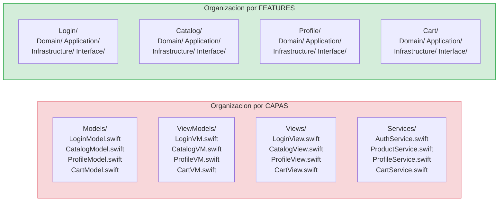

# Stack tecnológico

## Cada pieza del stack está aquí por una razón, no por moda

En esta lección vamos a repasar todas las tecnologías, herramientas y enfoques arquitectónicos que usaremos en el curso. Pero no va a ser una simple lista. Para cada elemento del stack, vamos a explicar **qué es**, **por qué lo elegimos**, y **qué alternativas descartamos y por qué**. Esto es importante porque una de las competencias que queremos desarrollar es la capacidad de justificar decisiones técnicas, no solo seguirlas ciegamente.

---

## SwiftUI moderno

### Qué es y por qué lo usamos

SwiftUI es el framework declarativo de Apple para construir interfaces de usuario. "Declarativo" significa que describes **qué** quieres que aparezca en pantalla, no **cómo** se construye paso a paso. En lugar de crear un `UILabel`, configurarle el texto, el color, la fuente, y añadirlo como subview de una vista padre (que es lo que harías en UIKit), en SwiftUI simplemente escribes:

```swift
Text("Hola mundo")
    .font(.title)
    .foregroundStyle(.blue)
```

Y SwiftUI se encarga de crear los elementos nativos necesarios, posicionarlos, y actualizarlos cuando cambia el estado.

En este curso, SwiftUI es nuestra capa de interfaz. Toda la UI se construye con SwiftUI. No usamos UIKit salvo en casos muy puntuales de interoperabilidad que estén justificados (y los explicaremos cuando ocurran).

La razón principal para elegir SwiftUI no es que sea "lo nuevo" o "lo que Apple recomienda". Es que SwiftUI encaja perfectamente con el enfoque arquitectónico del curso. En nuestra arquitectura, la vista es la capa más externa y más "tonta": no contiene lógica de negocio, solo muestra datos y recoge acciones del usuario. SwiftUI es ideal para esto porque su naturaleza declarativa y su sistema de estado explícito (`@State`, `@Binding`, `@Observable`) hacen que la separación entre "qué se muestra" y "cómo se decide qué mostrar" sea natural, no forzada.

### Qué aspectos de SwiftUI cubriremos

A lo largo del curso vamos a trabajar con SwiftUI de forma progresiva. No vamos a explicar SwiftUI desde cero (asumimos que ya sabes crear vistas básicas), pero sí vamos a profundizar en los aspectos que más impacto tienen en una arquitectura profesional:

**Composición de vistas.** En SwiftUI, las vistas grandes se construyen combinando vistas pequeñas. Esto es exactamente la misma idea de modularidad que aplicamos a la arquitectura: piezas pequeñas, cohesivas, reutilizables. Veremos cuándo extraer una subvista, cuándo crear un componente reutilizable, y cuándo dejar todo junto porque extraer no aporta valor.

**Modelado de estado.** El estado es el corazón de una aplicación SwiftUI. En este curso usaremos `@Observable` (la macro introducida en Swift 5.9 / iOS 17) como mecanismo principal para observar cambios en los ViewModels. No usaremos el patrón antiguo de `ObservableObject` con `@Published` salvo que haya una razón concreta. `@Observable` es más eficiente (solo invalida las vistas que realmente leen la propiedad que cambió) y más limpio (no necesitas `@Published` en cada propiedad).

**Flujo de datos.** Entender cuándo usar `@State` (estado local de la vista), `@Binding` (referencia bidireccional a un estado que vive en otro sitio), y `@Environment` (valores inyectados por el entorno) es fundamental para evitar bugs sutiles y renders innecesarios. Lo cubriremos con ejemplos concretos conforme construyamos las features.

**Navegación moderna.** Usaremos `NavigationStack` con navegación programática. La navegación en nuestro curso no la controlan las vistas directamente (nada de `NavigationLink(destination: HomeView())` dentro de la feature de Login). La navegación la controla un coordinador externo a través de eventos, como veremos más adelante.

**Performance.** SwiftUI re-renderiza vistas cuando cambia su estado. Si no tienes cuidado, un cambio pequeño puede desencadenar re-renders innecesarios en media pantalla. Veremos cómo marcar tipos como `Equatable` para que SwiftUI pueda hacer diffs eficientes, cómo usar lazy stacks para listas grandes, y cómo medir performance con los instrumentos de Xcode.

---

## Swift 6.2 y concurrencia estricta

### Qué es la concurrencia estricta y por qué importa

Swift 6 introduce un cambio fundamental: **strict concurrency checking** activado por defecto. Esto significa que el compilador verifica, en tiempo de compilación, que tu código no tiene data races. Un data race ocurre cuando dos hilos de ejecución acceden a la misma memoria al mismo tiempo y al menos uno de ellos escribe. Los data races son la fuente de los bugs más difíciles de encontrar y reproducir en programación concurrente: aparecen de forma intermitente, dependen del timing, y a veces solo se manifiestan en producción bajo carga.

Antes de Swift 6, el compilador no te protegía de esto. Podías tener un data race en tu código y no enterarte hasta que un usuario reportaba un crash aleatorio. Con Swift 6, el compilador te obliga a demostrar que tu código es seguro. Si no puede demostrarlo, no compila.

Esto es un cambio enorme para la industria iOS y lo vamos a abrazar completamente en este curso. Todo el código que escribamos compilará con strict concurrency activado, sin excepciones ni hacks para silenciar warnings.

### Los conceptos de concurrencia que usaremos

**`async/await`** es la forma moderna de escribir código asíncrono en Swift. En lugar de anidar callbacks (completion handlers) que hacen el código ilegible, usas `await` para esperar el resultado de una operación asíncrona. El código se lee de arriba a abajo, como si fuera síncrono, pero se ejecuta sin bloquear el hilo.

Por ejemplo, nuestro caso de uso de Login necesita llamar a un servidor para autenticar al usuario. Esa llamada es asíncrona (puede tardar 1 segundo, o 10, o no responder nunca). Con `async/await`, el código se ve así:

```swift
func execute(email: String, password: String) async throws -> Session {
    let credentials = try Credentials(email: email, password: password)
    return try await authGateway.authenticate(credentials: credentials)
}
```

Se lee de arriba a abajo: construyo las credenciales, luego espero (`await`) la respuesta del servidor. Si algo falla, lanzo un error (`throws`). Sencillo y legible.

**`Task`** es la unidad de trabajo asíncrono. Cuando quieres lanzar una operación asíncrona desde un contexto síncrono (por ejemplo, desde un botón de SwiftUI), creas un `Task`:

```swift
Button("Login") {
    Task {
        await viewModel.submit()
    }
}
```

**`actor`** es un tipo de referencia que protege su estado mutable de accesos concurrentes. Solo un hilo puede acceder al estado del actor a la vez. Es la alternativa moderna a los locks y semáforos. En este curso, los usaremos cuando un componente necesite estado mutable compartido entre varios llamantes.

**`@MainActor`** es un atributo que garantiza que un tipo o una función se ejecuta en el hilo principal. Lo usaremos en los ViewModels porque mutan estado que SwiftUI observa, y SwiftUI requiere que las mutaciones de estado que afectan a la UI ocurran en el main thread.

Pero hay una regla importante en este curso: **no se usa `@MainActor` para silenciar warnings del compilador**. Si el compilador se queja de que estás accediendo a algo desde el hilo equivocado, la solución no es poner `@MainActor` en todo hasta que compile. La solución es entender **por qué** se queja y tomar la decisión correcta: ¿este código realmente necesita ejecutarse en el main thread? Si sí, `@MainActor` es correcto. Si no, probablemente necesitas hacer el tipo `Sendable`, o usar un `actor`, o reestructurar la dependencia.

**`Sendable`** es un protocolo que marca un tipo como seguro para enviar entre fronteras de concurrencia. Los structs inmutables (con todas sus propiedades `let` y de tipos `Sendable`) son automáticamente `Sendable`. En este curso, todos nuestros Value Objects, modelos de dominio, y errores serán `Sendable`, porque son structs inmutables. Esto es una consecuencia natural de diseñar el dominio con tipos valor inmutables: no solo es bueno para la corrección lógica, sino que automáticamente es seguro para concurrencia.

**Cancelación** es un aspecto que muchos tutoriales ignoran pero que es fundamental en producción. Cuando el usuario navega fuera de una pantalla mientras una petición de red está en progreso, esa petición debería cancelarse. Swift Concurrency tiene mecanismo de cancelación integrado: `Task.checkCancellation()`, `Task.isCancelled`, y `withTaskCancellationHandler`. Lo cubriremos en la Etapa 3 cuando hagamos tests avanzados de concurrencia.

**Backpressure** es el mecanismo por el cual un consumidor de datos puede controlar la velocidad a la que el productor genera datos. Lo veremos cuando trabajemos con `AsyncSequence` y `AsyncStream` en etapas posteriores.

### Interoperabilidad con APIs legacy

No todo el mundo tiene el lujo de escribir código 100% moderno. A veces necesitas integrar con librerías que usan completion handlers, o con APIs de Apple que todavía no tienen versión async. Para eso usaremos `withCheckedContinuation` y `withCheckedThrowingContinuation`, que permiten envolver una API basada en callbacks en una función `async`. Lo cubriremos cuando implementemos la infraestructura de red real.

---

## Modularización Feature-First

### El problema de organizar por capas



En la organización por capas, trabajar en Login te obliga a abrir 4 carpetas diferentes. En la organización por features, todo lo de Login está junto. **Si quieres borrar una feature, borras una carpeta. Si quieres mover una feature a otro módulo, mueves una carpeta.** Eso no es posible con la organización por capas.

La mayoría de los tutoriales y proyectos iOS que encontrarás en internet organizan el código por **capas**: una carpeta `Models/`, una carpeta `ViewModels/`, una carpeta `Views/`, una carpeta `Services/`. Cada carpeta contiene todos los archivos de ese tipo, independientemente de a qué feature pertenezcan.

Esto parece ordenado al principio, pero escala fatal. Imagina un proyecto con 10 features. La carpeta `Models/` tiene 30 archivos (3 por feature). La carpeta `ViewModels/` tiene 15. La carpeta `Views/` tiene 20. Para trabajar en una sola feature (por ejemplo, Login), necesitas abrir archivos en 4 carpetas diferentes. Si otro desarrollador está trabajando en Catalog al mismo tiempo, probablemente ambos estéis tocando las mismas carpetas, provocando conflictos de merge que no tienen nada que ver con lo que estáis haciendo.

Y lo peor: es muy fácil crear dependencias accidentales entre features. Si `LoginViewModel` y `CatalogViewModel` viven en la misma carpeta, nada te impide hacer `import` del modelo de Catalog dentro de Login. De hecho, Xcode te lo autocompleta encantado.

### Organización por features (vertical slicing)

En este curso, el código se organiza por **features**, no por capas. Cada feature es un directorio que contiene **todas sus capas**: Domain, Application, Infrastructure, Interface. Si quieres trabajar en Login, abres la carpeta `Features/Login/` y ahí está todo lo que necesitas. Si quieres trabajar en Catalog, abres `Features/Catalog/`. No se tocan entre sí.

La estructura en el proyecto Xcode se ve así:

```
Sources/
├── App/
│   ├── StackMyArchitectureApp.swift
│   └── CompositionRoot.swift
├── Features/
│   ├── Login/
│   │   ├── Domain/
│   │   │   ├── Models/
│   │   │   │   ├── Email.swift
│   │   │   │   ├── Password.swift
│   │   │   │   ├── Credentials.swift
│   │   │   │   └── Session.swift
│   │   │   ├── Errors/
│   │   │   │   └── AuthError.swift
│   │   │   └── Events/
│   │   │       └── LoginEvent.swift
│   │   ├── Application/
│   │   │   ├── Ports/
│   │   │   │   └── AuthGateway.swift
│   │   │   └── UseCases/
│   │   │       └── LoginUseCase.swift
│   │   ├── Infrastructure/
│   │   │   ├── RemoteAuthGateway.swift
│   │   │   └── StubAuthGateway.swift
│   │   └── Interface/
│   │       ├── LoginViewModel.swift
│   │       └── LoginView.swift
│   └── Catalog/
│       ├── Domain/
│       ├── Application/
│       ├── Infrastructure/
│       └── Interface/
└── SharedKernel/
    └── (solo tipos verdaderamente compartidos)
```

Fíjate en que `SharedKernel/` está vacío o casi vacío. La regla es que solo vive ahí lo que dos o más features necesitan genuinamente compartir. Si solo lo usa una feature, va dentro de esa feature, aunque parezca "genérico". Esto evita que SharedKernel se convierta en un cajón de sastre donde todo termina acoplado a todo.

### Cuándo extraer a módulos SPM

Una pregunta que surge siempre es: "¿debería hacer cada feature un paquete SPM separado?". La respuesta es: **no todavía**. La progresión correcta es:

Primero, organizas con carpetas dentro de un solo target. Esto es suficiente para la mayoría de los proyectos y no añade complejidad de build. Las reglas de dependencia se aplican por disciplina (y eventualmente por lint automático).

Segundo, cuando el proyecto crece y los tiempos de compilación se vuelven un problema, o cuando hay varios equipos trabajando en features diferentes que se bloquean mutuamente, extraes features a targets separados dentro del mismo proyecto. Esto permite compilación incremental: cambiar Login no recompila Catalog.

Tercero, si necesitas reutilizar una feature en otro target (un widget, una app extension), la extraes a un paquete SPM. Esto la convierte en una unidad independiente con su propio `Package.swift`.

Cuarto, y raramente, si tienes equipos en repos diferentes, puedes poner una feature en un repo separado. Pero el coste de coordinación y versionado sube enormemente, así que solo se justifica en organizaciones grandes con equipos muy autónomos.

En este curso empezamos con carpetas y esa será la organización durante las Etapas 1 a 3. En la Etapa 4 (Arquitecto) exploraremos cuándo y cómo extraer a SPM con criterio de coste/beneficio.

---

## Clean Architecture por feature

### Qué es Clean Architecture y de dónde viene

Clean Architecture es un término popularizado por Robert C. Martin ("Uncle Bob") que describe una forma de organizar el código en capas con reglas de dependencia estrictas. La idea central es muy sencilla: **las capas internas no dependen de las capas externas**. El dominio (las reglas de negocio) no sabe nada de la UI, ni de la red, ni de la base de datos. Son las capas externas las que dependen del dominio, no al revés.

Esto no es una idea nueva ni exclusiva de Clean Architecture. Hexagonal Architecture (Ports and Adapters), Onion Architecture, y Clean Architecture son variaciones del mismo principio. En este curso usamos el término "Clean Architecture" porque es el más conocido, pero lo que realmente aplicamos es el principio de **inversión de dependencias**: el core de negocio define las interfaces (puertos) que necesita, y las capas externas las implementan.

### Las cuatro capas dentro de cada feature

Cada feature en nuestro proyecto tiene exactamente cuatro capas:

**Domain** es el corazón de la feature. Contiene las reglas de negocio puras: Value Objects (como `Email` y `Password`), entidades (como `User`), errores del dominio (como `AuthError`), eventos (como `LoginEvent`), e invariantes (reglas que siempre deben cumplirse, como "un email debe tener formato válido"). El Domain no importa SwiftUI, ni Foundation (salvo lo mínimo imprescindible), ni ningún framework externo. Es puro Swift. Esto lo hace trivialmente testeable y completamente independiente del entorno.

**Application** contiene los casos de uso. Un caso de uso orquesta una operación de negocio: recibe datos, los valida (usando el Domain), delega operaciones externas a través de puertos (protocolos), y devuelve un resultado. El Application define los **puertos**: protocolos que describen qué servicios necesita el caso de uso (por ejemplo, `AuthGateway` para autenticar). El Application no sabe quién implementa esos puertos. Solo sabe que existen.

**Infrastructure** implementa los puertos definidos por Application. Es donde vive el código que habla con el mundo real: peticiones HTTP, persistencia en disco, acceso a APIs de sistema. `RemoteAuthGateway` (que llama a un servidor real) y `StubAuthGateway` (que devuelve datos falsos) son ambos implementaciones del mismo puerto `AuthGateway`. La infraestructura depende de Application (conoce el protocolo del puerto), pero Application no depende de Infrastructure (no sabe si la implementación es remota, local, o un fake).

**Interface** es la capa de presentación. Contiene las vistas SwiftUI y los ViewModels que adaptan los datos del caso de uso al formato que necesita la UI. La Interface depende de Application (llama a los casos de uso), pero no depende directamente de Infrastructure (no sabe si detrás hay un servidor real o un stub).

### La regla de dependencia

Las dependencias **siempre** apuntan hacia dentro, hacia el Domain. Nunca al revés.

```
Interface ──> Application ──> Domain <── Infrastructure
```

Esto significa que puedes cambiar la UI (pasar de SwiftUI a UIKit) sin tocar el Domain ni los casos de uso. Puedes cambiar la infraestructura (pasar de URLSession a Alamofire, o de un servidor a una base de datos local) sin tocar el Domain ni la UI. El Domain es el centro estable del sistema: cambia solo cuando cambian las reglas de negocio.

---

## DDD: Domain-Driven Design

### Por qué DDD en un curso de iOS

DDD suele asociarse con proyectos backend complejos, y es verdad que surgió en ese contexto. Pero los principios de DDD son universales y aplican perfectamente a una app iOS enterprise. La idea central de DDD es que el código debe **reflejar fielmente el dominio de negocio**. Los nombres de tus tipos, tus funciones, tus errores, y tus tests deben usar exactamente los mismos términos que usa el negocio para hablar del problema.

En este curso no vamos a aplicar DDD completo (no vamos a hacer event sourcing ni CQRS). Vamos a aplicar los conceptos tácticos de DDD que más impacto tienen en la calidad del código:

**Bounded Context** es un límite semántico dentro del cual un término tiene un significado preciso y consistente. "Usuario" en el contexto de Login es una cosa diferente de "Usuario" en el contexto de Perfil. En Login, un usuario son unas credenciales y una sesión. En Perfil, un usuario es un nombre, un avatar, y unas preferencias. Si usas el mismo tipo `User` para ambos, ese tipo crece sin control y acopla features que no tienen nada que ver entre sí.

**Lenguaje ubicuo** es el vocabulario compartido entre negocio y desarrollo. Los mismos términos aparecen en los escenarios BDD, en el código Swift, en los tests, y en las conversaciones de equipo. Cuando escribimos un escenario que dice "Given un usuario con credenciales válidas", nuestro código tiene un tipo `Credentials`. No `LoginData`, no `AuthPayload`, no `UserCredentialInfo`. `Credentials`, que es lo que dice el escenario y lo que diría alguien de producto.

**Value Objects** son tipos sin identidad, definidos por sus valores. `Email("user@example.com")` es igual a otro `Email("user@example.com")` porque tienen el mismo valor. No tienen un `id` que los distinga. Son inmutables y se validan en la construcción: si el objeto existe, es válido.

**Entidades** son tipos con identidad. Un `User` con `id: "abc123"` es diferente de otro `User` con `id: "xyz789"`, aunque tengan el mismo nombre y email. La identidad persiste a lo largo del tiempo: el usuario puede cambiar su email, pero sigue siendo el mismo usuario.

**Domain Events** son hechos que ya ocurrieron y que son relevantes para el negocio. `LoginSucceeded` es un evento: ya pasó, es un hecho, no se puede deshacer. Los eventos permiten desacoplar features: Login emite `LoginSucceeded`, y el sistema de navegación escucha ese evento y decide qué hacer. Login no sabe qué pasa después del login.

**Invariantes** son reglas que siempre deben cumplirse. "Un email debe tener formato válido" es un invariante. "Una contraseña no puede estar vacía" es otro. Los invariantes se protegen en la construcción de los Value Objects y entidades: si intentas crear un `Email` con formato inválido, el constructor lanza un error. No se puede crear un `Email` inválido. Nunca.

---

## Navegación por eventos

### El problema de la navegación acoplada

En la mayoría de los tutoriales de SwiftUI, la navegación funciona así: una vista tiene un `NavigationLink` que apunta directamente a otra vista. `LoginView` tiene un `NavigationLink(destination: HomeView())`. Esto funciona para apps pequeñas, pero tiene tres problemas graves en un proyecto enterprise:

Primero, **acopla features entre sí**. Login necesita importar Home para poder navegar hacia ella. Eso significa que si cambias algo en Home, Login puede verse afectado. Y si quieres reutilizar Login en otra app donde después del login se va a una pantalla diferente, no puedes sin modificar Login.

Segundo, **hace imposible testear la navegación sin UI**. ¿Cómo verificas en un test unitario que después de un login exitoso se navega a Home? No puedes, porque la navegación está dentro de un `NavigationLink` en el body de una vista.

Tercero, **complica los deep links**. Si la app recibe un deep link que dice "abre la pantalla de producto 123", necesitas que algo externo a las vistas decida la ruta de navegación. Si la navegación está hardcodeada dentro de las vistas, implementar deep links es una pesadilla de hacks.

### Cómo funciona la navegación por eventos en este curso

La solución es separar la decisión de navegación de las features. Las features no navegan. Las features **emiten eventos** que indican qué ha pasado. Un componente externo (un coordinador o router) escucha esos eventos y decide a dónde navegar.

El flujo se ve así: el usuario hace login exitosamente. El caso de uso devuelve una sesión al ViewModel. El ViewModel llama a un closure que le inyectó el Composition Root. Ese closure notifica al coordinador: "el login fue exitoso, aquí está la sesión". El coordinador decide: "login exitoso → navego a Home". Login no sabe que Home existe. El coordinador es el que conoce la estructura de navegación de la app.

Esto lo implementaremos en detalle en la Etapa 2, cuando tengamos dos features (Login y Catalog) y necesitemos navegar entre ellas.

---

## Composition Root

### Qué es y por qué es necesario

El Composition Root es el lugar donde todas las piezas del sistema se ensamblan. Es el único sitio de toda la aplicación que conoce las implementaciones concretas de todos los componentes. Es el "director de orquesta" que mencionamos en la lección de principios.

Vive en el punto de entrada de la app (el módulo `App/`, donde está `@main`), y su responsabilidad es crear las features con todas sus dependencias inyectadas. Cuando la app arranca, el Composition Root decide: "para el AuthGateway de Login voy a usar `RemoteAuthGateway` con `URLSession`". Ni Login ni el caso de uso ni el ViewModel saben esto. Solo el Composition Root lo sabe.

¿Por qué esto es importante? Porque si quieres cambiar el `RemoteAuthGateway` por un `StubAuthGateway` (para desarrollo sin servidor), cambias **una sola línea** en el Composition Root. Nada más. Ningún otro archivo del proyecto cambia. Eso es bajo acoplamiento en acción.

Y para SwiftUI Previews, puedes crear un Composition Root alternativo que inyecte stubs en todas partes, de forma que tus previews funcionen sin servidor, sin red, y de forma instantánea.

---

## Resumen: cómo encaja todo

Todo el stack del curso forma un sistema coherente donde cada pieza refuerza a las demás:

**SwiftUI** es la capa más externa, la interfaz. Solo muestra datos y recoge acciones. No contiene lógica.

**Los casos de uso** (Application) orquestan la lógica. Reciben datos de la UI, validan, delegan, y devuelven resultados.

**El dominio** (Domain) protege las reglas de negocio con Value Objects, invariantes, y errores tipados. Es puro Swift, sin dependencias.

**La infraestructura** implementa los puertos del dominio: red, persistencia, APIs externas.

**El Composition Root** ensambla todo, inyectando dependencias concretas en cada feature.

**La navegación por eventos** desacopla las features entre sí: cada una emite lo que pasó, un coordinador decide a dónde ir.

**Feature-First** organiza todo por feature (vertical), no por capa (horizontal), para que cada feature sea una unidad independiente.

**BDD** especifica qué tiene que hacer cada feature antes de escribir código.

**TDD** implementa esa especificación con seguridad: test primero, producción después, refactor siempre.

**Swift 6.2 strict concurrency** garantiza que no hay data races, en tiempo de compilación.

**XCTest** es el framework de testing para todos los tests del curso.

Cada pieza tiene su razón de ser. Si quitas una, las demás se debilitan. Por eso las vamos a aprender todas juntas, aplicadas al mismo proyecto, en lugar de estudiarlas por separado en abstracto.

---

**Anterior:** [Metodología BDD + TDD ←](02-metodologia-bdd-tdd.md) · **Siguiente:** [Estructura Feature-First →](04-estructura-feature-first.md)
