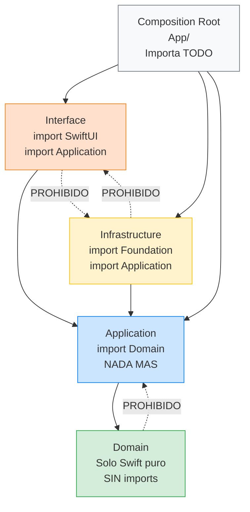

# Estructura Feature-First: paso a paso en Xcode

## Partimos del setup ya completado

En la lección anterior explicamos la teoría de cada pieza del stack. En esta lección vamos a materializarla en Xcode con una estructura Feature-First clara y lista para trabajar con TDD.

Si todavía no creaste el proyecto base, vuelve primero a [Setup: Preparación del entorno](00-setup.md). Aquí **no** repetimos el asistente completo de creación ni la configuración inicial de Firebase; nos enfocamos en organizar el código con límites arquitectónicos correctos.

---

## Paso 1: Verificar punto de partida

Antes de reorganizar carpetas, confirma que tienes el baseline de Setup:

- Proyecto `StackMyArchitecture` creado y abriendo correctamente en Xcode.
- Build en verde con `Cmd + B`.
- App ejecutando en simulador con `Cmd + R`.
- Target de tests operativo con `Cmd + U`.

Con ese baseline validado, ahora sí empezamos la reorganización Feature-First.

---

## Paso 2: Crear la estructura de carpetas

Ahora vamos a crear la estructura Feature-First dentro del proyecto. En Xcode, haz clic derecho en el grupo `StackMyArchitecture` (el directorio principal del target de la app) y ve creando los siguientes grupos (carpetas). Para cada grupo: **clic derecho → New Group** y ponle el nombre correspondiente.

La estructura final que queremos es esta:

```
StackMyArchitecture/
├── App/
│   ├── StackMyArchitectureApp.swift
│   └── CompositionRoot.swift
├── Features/
│   └── Login/
│       ├── Domain/
│       │   ├── Models/
│       │   ├── Errors/
│       │   └── Events/
│       ├── Application/
│       │   ├── Ports/
│       │   └── UseCases/
│       ├── Infrastructure/
│       └── Interface/
└── SharedKernel/
```

Vamos a explicar qué hace cada carpeta y por qué está donde está.

### La carpeta `App/`

Esta es el **Composition Root** de nuestra aplicación. Aquí vive el punto de entrada (`@main`) y el código de ensamblado. Mueve el archivo `StackMyArchitectureApp.swift` que Xcode creó automáticamente a esta carpeta. Elimina `ContentView.swift` porque no lo vamos a usar (nuestra primera vista será `LoginView`, que vivirá dentro de la feature Login).

El archivo `StackMyArchitectureApp.swift` es el punto de entrada de la aplicación. Es donde está el atributo `@main` que le dice al sistema "aquí empieza todo". Lo vamos a modificar más adelante para que use el Composition Root y muestre la vista correcta según el estado de la app.

El archivo `CompositionRoot.swift` (que crearemos en una lección posterior) será el responsable de crear todas las features con sus dependencias inyectadas. Es el único lugar de todo el proyecto que conoce las implementaciones concretas de los puertos.

### La carpeta `Features/Login/`

Aquí va a vivir toda la feature de Login. Contiene cuatro subcarpetas, una por cada capa de Clean Architecture:

**`Domain/`** contendrá los tipos puros del dominio de autenticación. Dentro tiene tres subcarpetas:

`Models/` es donde vivirán los Value Objects (`Email.swift`, `Password.swift`), los modelos compuestos (`Credentials.swift`, `Session.swift`), y cualquier entidad que necesitemos. Los modelos del dominio son tipos Swift puros: no importan SwiftUI, no importan Foundation (salvo lo estrictamente necesario como `Equatable`), no dependen de nada externo. Son el corazón del sistema y lo más estable del proyecto.

`Errors/` es donde vivirán los errores tipados del dominio (`AuthError.swift`). Los errores son enums que conforman `Error` y `Equatable`, y representan las cosas que pueden ir mal desde la perspectiva del negocio: credenciales inválidas, falta de conectividad. No son errores técnicos genéricos; son errores de dominio con significado de negocio.

`Events/` es donde vivirán los eventos del dominio (`LoginEvent.swift`). Los eventos representan hechos que ya ocurrieron y que son relevantes para el sistema: el login fue exitoso, el login falló. Los eventos permiten desacoplar la feature de lo que ocurre después: Login emite un evento, y un componente externo (coordinador) decide qué hacer con él.

**`Application/`** contendrá la lógica de orquestación de la feature. Dentro tiene dos subcarpetas:

`Ports/` es donde vivirán los protocolos que definen las interfaces que el caso de uso necesita. Un "puerto" es una abstracción que dice "necesito algo que pueda autenticar credenciales y devolver una sesión". No dice cómo se hace esa autenticación. El protocolo `AuthGateway.swift` vivirá aquí.

`UseCases/` es donde vivirán los casos de uso. Un caso de uso es una operación de negocio completa: recibe datos de entrada (email y password como strings), los valida, delega la autenticación al puerto, y devuelve el resultado. `LoginUseCase.swift` vivirá aquí.

**`Infrastructure/`** contendrá las implementaciones concretas de los puertos. `RemoteAuthGateway.swift` (que habla con un servidor real) y `StubAuthGateway.swift` (que devuelve datos falsos para desarrollo) vivirán aquí. Esta carpeta es la única que tiene dependencias de frameworks de Apple (Foundation para URLSession, por ejemplo).

**`Interface/`** contendrá la vista SwiftUI y el ViewModel. `LoginView.swift` y `LoginViewModel.swift` vivirán aquí. La vista es la capa más externa: muestra datos y recoge acciones del usuario. No contiene lógica de negocio. El ViewModel adapta los datos del caso de uso al formato que necesita la vista.

### La carpeta `SharedKernel/`

Esta carpeta está vacía ahora y probablemente seguirá casi vacía durante bastante tiempo. La regla es: si un tipo solo lo usa una feature, va dentro de esa feature, aunque parezca "genérico". Solo cuando dos o más features necesitan genuinamente el mismo tipo, lo extraemos a SharedKernel.

Por ejemplo, si en la Etapa 2 tanto Login como Catalog necesitan un tipo `DomainEvent` base, ese tipo iría a SharedKernel. Pero si solo Login tiene eventos, se queda dentro de Login.

---

## Paso 3: Crear la estructura de tests

Ahora haz lo mismo con el target de tests (`StackMyArchitectureTests`). La estructura de tests refleja la estructura del código de producción:

```
StackMyArchitectureTests/
├── Features/
│   └── Login/
│       ├── Domain/
│       │   ├── EmailTests.swift
│       │   └── PasswordTests.swift
│       ├── Application/
│       │   └── LoginUseCaseTests.swift
│       ├── Infrastructure/
│       │   └── RemoteAuthGatewayTests.swift
│       └── Helpers/
│           └── AuthGatewayStub.swift
```

Fíjate en la carpeta `Helpers/`. Aquí vivirán los dobles de test (stubs, spies) que necesitemos. Un stub es una implementación falsa de un protocolo que devuelve valores predeterminados. Por ejemplo, `AuthGatewayStub` será una implementación de `AuthGateway` que podemos configurar para que devuelva un éxito o un error, sin hacer ninguna petición de red real.

Los helpers de test son específicos de cada feature. Los stubs de Login van dentro de `Tests/Features/Login/Helpers/`, no en una carpeta global `TestHelpers/`. Si dos features necesitan el mismo helper, lo extraemos a un directorio compartido. Pero empezamos local.

---

## Paso 4: Configurar el proyecto para Swift 6.2 strict concurrency

Antes de escribir código, vamos a configurar el proyecto para que compile con strict concurrency activado. Esto nos obliga a escribir código seguro desde el primer momento, en lugar de tener que arreglar cientos de warnings al final.

En Xcode, selecciona el proyecto en el navigator, selecciona el target `StackMyArchitecture`, ve a **Build Settings**, busca **Swift Language Version** y asegúrate de que está en **Swift 6**. Luego busca **Strict Concurrency Checking** y ponlo en **Complete**.

Haz lo mismo para el target de tests `StackMyArchitectureTests`.

Con esto, cualquier código que no sea concurrency-safe no compilará. Esto puede parecer molesto al principio, pero te va a ahorrar horas de debugging de bugs intermitentes en producción. Mejor que el compilador te diga "esto no es seguro" ahora, a que un usuario te reporte un crash aleatorio dentro de tres meses.

---

## Paso 5: Verificar que el proyecto compila

En este punto el proyecto debería compilar sin errores. No tiene código real todavía (salvo el `@main` que Xcode generó), pero la estructura de carpetas está lista.

Pulsa **Cmd+B** para compilar. Si todo está bien, verás "Build Succeeded". Si hay algún error, probablemente es porque al mover `StackMyArchitectureApp.swift` a la carpeta `App/` no se actualizó correctamente la membresía del target. Verifica que el archivo sigue perteneciendo al target `StackMyArchitecture` (selecciona el archivo, abre el inspector de la derecha, y verifica que el target está marcado).

---

## Las reglas de dependencia en la práctica

Ahora que tienes la estructura, es importante que entiendas las reglas de dependencia que vamos a respetar. Estas reglas no las enforza Xcode automáticamente (todavía estamos en un solo target), pero las vamos a seguir por disciplina. En la Etapa 4 veremos cómo automatizar su verificación.

### Diagrama: quién puede importar a quién



Las flechas sólidas muestran las dependencias permitidas. Las punteadas con ❌ son las **prohibidas**. La regla fundamental: **las dependencias siempre apuntan hacia el centro (Domain)**. Nunca al revés. Domain no sabe que Application existe. Application no sabe que Infrastructure existe. Solo el Composition Root conoce todo.

Si rompes esta regla (por ejemplo, si Domain importa Foundation para usar URLSession), el Domain deja de ser testeable sin infraestructura real. Y si Interface importa Infrastructure directamente, ya no puedes cambiar la implementación sin tocar la UI. Cada flecha prohibida que añades es deuda técnica que paga el equipo durante meses.

**Domain no importa nada externo.** Los archivos dentro de `Domain/` no deben tener `import SwiftUI`, `import Foundation` (salvo que necesites algo muy básico como `trimmingCharacters`, que viene de Foundation), `import UIKit`, ni ningún framework. Solo puro Swift. Si te encuentras necesitando un `import` en el Domain, es una señal de que algo está mal en el diseño.

**Application importa Domain y nada más.** Los archivos dentro de `Application/` pueden usar los tipos definidos en `Domain/` (Value Objects, errores, modelos), pero no pueden importar SwiftUI, UIKit, ni usar directamente clases de infraestructura como URLSession. Los puertos (protocolos) se definen aquí, pero sus implementaciones viven en Infrastructure.

**Infrastructure importa Application (los puertos) y frameworks de Apple.** Los archivos dentro de `Infrastructure/` implementan los protocolos definidos en `Application/Ports/` y pueden usar Foundation, URLSession, CoreData, o cualquier SDK que necesiten. Pero no importan SwiftUI ni conocen nada de la capa Interface.

**Interface importa Application y SwiftUI.** Los archivos dentro de `Interface/` usan SwiftUI para la UI y los tipos de Application (casos de uso, modelos) para conectar la UI con la lógica. No importan Infrastructure directamente: la vista no sabe si detrás hay un servidor real o un stub. Eso lo decide el Composition Root.

**El Composition Root (App/) importa todo.** Es el único lugar que conoce las implementaciones concretas. Importa los casos de uso de Application, las implementaciones de Infrastructure, y las vistas de Interface, y los conecta todos.

### Por qué estas reglas importan tanto

Estas reglas de dependencia no son burocracia. Tienen consecuencias prácticas directas:

Si Domain no importa nada, puedes testearlo en milisegundos, sin simuladores, sin red, sin nada. Un `XCTestCase` que testea el Value Object `Email` se ejecuta en 0.001 segundos. Eso es feedback instantáneo.

Si Application solo depende de Domain y de protocolos, puedes testear un caso de uso inyectando stubs en lugar de implementaciones reales. No necesitas un servidor para testear que el login falla con credenciales inválidas. Le pasas un stub que devuelve un error, y verificas que el caso de uso lo traduce correctamente.

Si Interface no conoce Infrastructure, puedes hacer SwiftUI Previews que funcionen sin servidor, sin red, y de forma instantánea, inyectando stubs a través del Composition Root.

Y si quieres cambiar de URLSession a una librería de networking, o de un servidor REST a GraphQL, solo cambias los archivos de Infrastructure. Ninguna otra capa del sistema se entera.

---

## Lo que hemos construido hasta ahora

Al terminar esta lección tienes:

Un proyecto Xcode llamado `StackMyArchitecture` con la estructura Feature-First completa. La carpeta `App/` para el Composition Root. La carpeta `Features/Login/` con las cuatro capas (Domain, Application, Infrastructure, Interface) y sus subcarpetas. La carpeta `SharedKernel/` vacía, esperando. El target de tests con estructura espejo. El proyecto configurado para Swift 6 strict concurrency.

No tienes código de producción todavía. Eso viene en la siguiente lección, donde empezaremos por la especificación BDD de la feature de Login: los escenarios de comportamiento que definirán exactamente qué tiene que hacer el sistema antes de escribir ni una sola línea de Swift.

---

**Anterior:** [Stack tecnológico ←](03-stack-tecnologico.md) · **Siguiente:** [Feature Login: Especificación BDD →](05-feature-login/00-especificacion-bdd.md)
