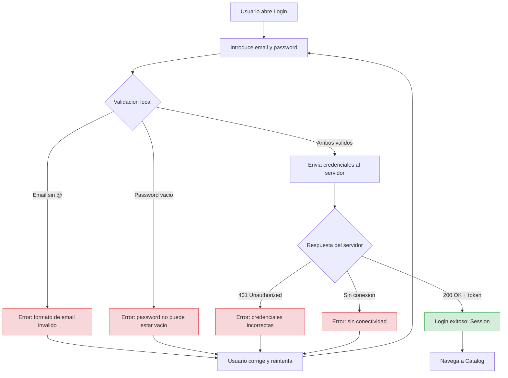

# Feature Login: Especificación BDD

## Antes de abrir Xcode, definimos qué tiene que pasar

Esta es la primera lección donde aplicamos BDD en la práctica. Vamos a sentarnos a definir, escenario por escenario, todos los comportamientos que la feature de Login debe soportar. No vamos a escribir ni una línea de Swift. Solo vamos a pensar, escribir escenarios, y tomar decisiones de diseño que se derivan directamente de esos escenarios.

Al terminar esta lección tendrás una especificación completa del Login: todos los casos posibles (éxito, errores, edge cases), los términos del dominio que usaremos en el código, las decisiones de diseño que los escenarios nos obligan a tomar, y una tabla de trazabilidad que conecta cada escenario con el test que lo verificará.

### Recordatorio de principios

¿Recuerdas el **Principio 1** de [Principios de ingeniería](../01-principios-ingenieria.md)? "Aclarar la intención antes de codificar". Esta lección es exactamente esa práctica aplicada de forma operativa: primero definimos comportamiento, luego diseñamos, y solo después implementamos.

---

## El contexto de negocio

Nuestra aplicación necesita que el usuario se identifique antes de acceder al contenido. La forma de identificarse es mediante un email y una contraseña. El sistema verifica esas credenciales contra un servidor remoto y, si son correctas, devuelve una sesión que permite al usuario acceder a la aplicación.

Esto parece sencillo, pero cuando te paras a pensar en todos los caminos posibles, te das cuenta de que hay bastantes más casos de los que parece a primera vista. ¿Qué pasa si el email no tiene formato válido? ¿Qué pasa si la contraseña está vacía? ¿Qué pasa si el servidor dice que las credenciales son incorrectas? ¿Qué pasa si no hay internet? ¿Qué pasa si el usuario cancela mientras se está autenticando? Cada uno de estos caminos es un escenario que debemos definir y, eventualmente, implementar y testear.

### El Bounded Context

En DDD, un Bounded Context es un límite semántico dentro del cual los términos tienen un significado preciso. Nuestra feature de Login pertenece al Bounded Context que vamos a llamar **Identity**. En este contexto, los términos que importan son: credenciales, autenticación, sesión, email, password. Estos son los términos del **lenguaje ubicuo** que usaremos en los escenarios, en el código, en los tests, y en las conversaciones.

Es importante notar que "usuario" en el contexto de Identity no es lo mismo que "usuario" en un contexto de Perfil o de Pedidos. En Identity, un usuario son unas credenciales y una sesión. No tiene avatar, ni nombre para mostrar, ni historial de compras. Esos son conceptos de otros bounded contexts que no nos incumben aquí.

### El lenguaje ubicuo del Login

Antes de escribir los escenarios, vamos a definir los términos que usaremos. Esto es más importante de lo que parece. Si todos usamos los mismos términos, el código se lee como una conversación natural. Si cada uno inventa sus propios nombres, el código se convierte en un galimatías donde nadie sabe si "loginData" y "credentials" y "authPayload" son lo mismo o cosas diferentes.

**Credenciales** es el par formado por un email y un password. No es un string suelto ni un diccionario. Es un concepto de negocio que agrupa dos valores validados.

**Email** es una dirección de correo electrónico con formato válido. No es un string cualquiera. Si el formato no es válido, no puede existir como Email. Es un Value Object.

**Password** es la contraseña del usuario. No puede estar vacía. Es otro Value Object.

**Autenticación** es el proceso de verificar que unas credenciales son válidas contra el servidor. El resultado es éxito (con una sesión) o error (con una razón).

**Sesión** es el resultado de una autenticación exitosa. Contiene un token de acceso y el email del usuario autenticado. La sesión es lo que el sistema necesita para saber que el usuario está identificado.

**AuthError** es un error de autenticación. Hay dos tipos: credenciales inválidas (el servidor las rechazó) y conectividad (no se pudo llegar al servidor).

Fíjate en que cada término tiene una definición precisa. No es casualidad. En las próximas lecciones, estos mismos términos aparecerán como nombres de tipos Swift: `Email`, `Password`, `Credentials`, `Session`, `AuthError`. Si alguien lee el código y no ha leído estos escenarios, debería poder entender de qué trata cada tipo simplemente por su nombre. Esa es la promesa del lenguaje ubicuo.

---

### Diagrama: mapa completo de comportamiento del Login



Este mapa muestra **todos los caminos posibles** del Login. Cada rama es un escenario BDD que se traduce en un test. Si un camino no esta en este mapa, no deberia estar en el codigo.

---

## Los escenarios completos

Ahora sí, vamos con los escenarios. Los hemos organizado en tres categorías: el camino feliz (todo sale bien), los caminos tristes (algo falla de forma esperada), y los casos extremos (situaciones límite que debemos manejar).

### El camino feliz (Happy Path)

El camino feliz es el escenario en el que todo funciona correctamente. El usuario introduce un email válido y un password correcto, el servidor los acepta, y el sistema devuelve una sesión.

```
Feature: Login de usuario

Scenario: Login exitoso con credenciales válidas
  Given un usuario registrado con email "user@example.com"
  And un password válido "Str0ngP@ss"
  When el usuario envía sus credenciales al sistema
  Then el sistema valida el formato del email localmente
  And el sistema valida que el password no está vacío
  And el sistema envía las credenciales al servidor de autenticación
  And el servidor responde con una sesión válida
  And el sistema devuelve la sesión al llamante
  And la sesión contiene un token de acceso
  And la sesión contiene el email del usuario autenticado
```

Este escenario es detallado a propósito. Fíjate en que no dice simplemente "el usuario hace login y funciona". Describe el flujo paso a paso: primero se valida localmente, luego se envía al servidor, luego se recibe la respuesta. Esto es importante porque nos dice el **orden** de las operaciones. La validación local ocurre antes de la llamada al servidor. Si la validación falla, el servidor nunca se entera.

### Los caminos tristes (Sad Paths)

Los caminos tristes son los escenarios en los que algo falla de una forma que el negocio ha previsto. No son bugs; son situaciones esperadas que el sistema debe manejar correctamente.

```
Scenario: Login fallido porque el servidor rechaza las credenciales
  Given un usuario registrado con email "user@example.com"
  And un password incorrecto "wrong-password"
  When el usuario envía sus credenciales al sistema
  Then el sistema valida el formato del email localmente (pasa)
  And el sistema valida que el password no está vacío (pasa)
  And el sistema envía las credenciales al servidor de autenticación
  And el servidor rechaza las credenciales
  Then el sistema devuelve un error de tipo InvalidCredentials
  And no se crea ninguna sesión
```

Este escenario nos dice algo importante: las credenciales pueden ser válidas **localmente** (el email tiene formato correcto, el password no está vacío) pero inválidas **remotamente** (el servidor no las reconoce). Son dos niveles de validación diferentes: local (formato) y remota (autenticidad). El error `InvalidCredentials` viene del servidor, no de la validación local.

```
Scenario: Login fallido porque no hay conexión a internet
  Given un usuario con email "user@example.com"
  And un password válido "Str0ngP@ss"
  And el dispositivo no tiene conexión a internet
  When el usuario envía sus credenciales al sistema
  Then el sistema valida el formato del email localmente (pasa)
  And el sistema valida que el password no está vacío (pasa)
  And el sistema intenta enviar las credenciales al servidor
  And la conexión falla porque no hay internet
  Then el sistema devuelve un error de tipo Connectivity
  And no se crea ninguna sesión
```

Este escenario nos dice que el error de conectividad es diferente del error de credenciales inválidas. El usuario necesita saber si su password está mal o si simplemente no hay internet, porque la acción que debe tomar es diferente en cada caso. Por eso tenemos errores tipados y no un genérico "algo falló".

### Los casos extremos (Edge Cases)

Los edge cases son situaciones que no son el flujo principal pero que el sistema debe manejar sin romper. Son los escenarios que los desarrolladores tendemos a ignorar cuando vamos con prisa, y que luego generan bugs en producción.

```
Scenario: Login rechazado porque el email no tiene formato válido
  Given un email con formato inválido "esto-no-es-un-email"
  And un password "Str0ngP@ss"
  When el usuario intenta hacer login
  Then el sistema detecta que el email no tiene formato válido
  And el sistema devuelve un error de tipo InvalidEmail
  And NO se envía ninguna petición al servidor
  And no se crea ninguna sesión
```

Este escenario es crucial porque define una decisión de diseño: la validación del formato del email ocurre **localmente, antes de intentar la autenticación remota**. No enviamos basura al servidor. Si el email no tiene arroba, lo rechazamos inmediatamente, sin gastar una petición de red. Esto mejora la experiencia del usuario (feedback instantáneo) y protege al servidor de peticiones inútiles.

```
Scenario: Login rechazado porque el password está vacío
  Given un email válido "user@example.com"
  And un password vacío ""
  When el usuario intenta hacer login
  Then el sistema detecta que el password está vacío
  And el sistema devuelve un error de tipo EmptyPassword
  And NO se envía ninguna petición al servidor
  And no se crea ninguna sesión
```

Mismo principio que el anterior: no enviamos un password vacío al servidor. Lo rechazamos localmente.

```
Scenario: Login cancelado por el usuario mientras la autenticación está en progreso
  Given un usuario con credenciales válidas
  And el sistema ha enviado las credenciales al servidor
  And la respuesta del servidor todavía no ha llegado
  When el usuario cancela la operación de login
  Then el sistema cancela la petición de red en curso
  And no se devuelve ningún resultado (ni éxito ni error)
  And no se crea ninguna sesión
```

La cancelación es un caso que muchos tutoriales ignoran pero que en producción es fundamental. Si el usuario navega fuera de la pantalla de login mientras la petición está en vuelo, esa petición debe cancelarse. No tiene sentido procesar una respuesta que nadie va a ver. Y lo que es más importante: si no cancelas la petición, puedes acabar actualizando UI que ya no está en pantalla, lo que en el mejor de los casos desperdicia recursos y en el peor provoca un crash.

---

## Lo que los escenarios nos revelan sobre el diseño

Después de escribir los escenarios, si los lees con atención, descubrirás que ya han tomado varias decisiones de diseño por ti. No necesitas "inventar" la arquitectura; los escenarios te la dictan.

### Hay dos niveles de validación

Los escenarios dejan claro que hay validación **local** (formato del email, password no vacío) y validación **remota** (el servidor acepta o rechaza las credenciales). La validación local es instantánea y no depende de la red. La validación remota requiere una petición HTTP y puede fallar por conectividad.

Esta separación se traduce directamente en el código: los Value Objects (`Email`, `Password`) se encargan de la validación local. El caso de uso (`LoginUseCase`) orquesta ambas: primero intenta crear los Value Objects (validación local), y solo si pasan, llama al servidor (validación remota).

### Hay cuatro tipos de error diferentes

De los escenarios extraemos cuatro errores, cada uno con un origen diferente:

`Email.ValidationError.invalidFormat` ocurre cuando el string no tiene formato de email. Viene del Value Object `Email`, vive en la capa Domain.

`Password.ValidationError.empty` ocurre cuando el password es un string vacío. Viene del Value Object `Password`, vive en la capa Domain.

`AuthError.invalidCredentials` ocurre cuando el servidor rechaza las credenciales. Viene de la infraestructura (la respuesta HTTP), se traduce a un error de dominio.

`AuthError.connectivity` ocurre cuando no se puede conectar con el servidor. Viene de la infraestructura (fallo de red), se traduce a un error de dominio.

### La operación es asíncrona y cancelable

El login requiere una petición de red, lo que significa que es asíncrona. Y como es asíncrona, debe ser cancelable. En Swift, esto se traduce en funciones `async throws` y cooperación con el sistema de cancelación de `Task`.

### Las features emiten eventos, no navegan

El escenario de login exitoso dice "el sistema devuelve la sesión al llamante". No dice "el sistema navega a la pantalla de Home". Esa decisión (qué pasa después del login) no le corresponde a la feature de Login. Login solo informa de lo que pasó (éxito con sesión, o error). Otro componente externo (el coordinador) decidirá qué hacer con esa información.

---

## Tabla de trazabilidad: del escenario al test

Cada escenario debe poder rastrearse hasta un test automatizado. Esta tabla muestra qué test cubrirá cada escenario cuando los implementemos en las próximas lecciones:

| Escenario | Nombre del test XCTest | Componente que se testea |
|-----------|----------------------|--------------------------|
| Login exitoso | `test_execute_with_valid_credentials_returns_session` | `LoginUseCaseTests` |
| Credenciales rechazadas | `test_execute_with_rejected_credentials_returns_invalidCredentials` | `LoginUseCaseTests` |
| Sin conectividad | `test_execute_without_connectivity_returns_connectivityError` | `LoginUseCaseTests` |
| Email inválido | `test_init_with_invalid_format_throws_invalidFormat` | `EmailTests` |
| Password vacío | `test_init_with_empty_string_throws_empty` | `PasswordTests` |
| Cancelación | `test_execute_cancellation_does_not_return_result` | `LoginUseCaseTests` |

Fíjate en los nombres de los tests. Siguen un patrón: `test_[método]_[condición]_[resultado esperado]`. Este patrón hace que al leer el nombre del test sepas exactamente qué escenario cubre sin necesidad de abrir el código. Es una convención que seguiremos en todo el curso.

---

## Diagrama de flujo del Login

Para visualizar el flujo completo, aquí tienes un diagrama de secuencia que muestra cómo interactúan los componentes:

```
┌──────────┐     ┌───────────────┐     ┌──────────────┐     ┌────────────┐
│  Usuario │     │  LoginUseCase │     │ AuthGateway  │     │  Servidor  │
│  (UI)    │     │ (Application) │     │   (Puerto)   │     │  (Remoto)  │
└────┬─────┘     └───────┬───────┘     └──────┬───────┘     └─────┬──────┘
     │                   │                     │                    │
     │ envía email+pass  │                     │                    │
     │──────────────────>│                     │                    │
     │                   │                     │                    │
     │                   │ 1. Crea Email(VO)   │                    │
     │                   │    ¿formato OK?     │                    │
     │                   │    Sí → continúa    │                    │
     │                   │    No → error local │                    │
     │                   │                     │                    │
     │                   │ 2. Crea Password(VO)│                    │
     │                   │    ¿no vacío?       │                    │
     │                   │    Sí → continúa    │                    │
     │                   │    No → error local │                    │
     │                   │                     │                    │
     │                   │ 3. authenticate()   │                    │
     │                   │────────────────────>│                    │
     │                   │                     │ POST /auth/login   │
     │                   │                     │───────────────────>│
     │                   │                     │                    │
     │                   │                     │ 200 + session      │
     │                   │                     │ o 401 + error      │
     │                   │                     │ o timeout/error    │
     │                   │                     │<───────────────────│
     │                   │                     │                    │
     │                   │ Session o AuthError  │                    │
     │                   │<────────────────────│                    │
     │                   │                     │                    │
     │ Session o Error   │                     │                    │
     │<──────────────────│                     │                    │
     │                   │                     │                    │
```

El diagrama muestra claramente los dos puntos de fallo local (pasos 1 y 2: validación de Value Objects) y el punto de fallo remoto (paso 3: autenticación contra el servidor). Cuando implementemos el código, esta separación se verá reflejada en la estructura del `LoginUseCase`.

---

## Lo que hemos conseguido en esta lección

Sin escribir ni una línea de Swift, ahora tenemos:

Una lista completa de todos los comportamientos que el Login debe soportar. Un vocabulario preciso (lenguaje ubicuo) que usaremos en el código. Decisiones de diseño concretas que se derivan de los escenarios (validación local antes que remota, errores tipados, operación cancelable). Una tabla de trazabilidad que conecta cada escenario con un test concreto. Y un diagrama que visualiza el flujo de datos entre componentes.

En la siguiente lección empezaremos a implementar, empezando por la capa Domain: los Value Objects `Email` y `Password`, con TDD usando XCTest.

---

**Anterior:** [Setup: Preparación del entorno ←](../00-setup.md) · **Siguiente:** [Domain →](01-domain.md)
