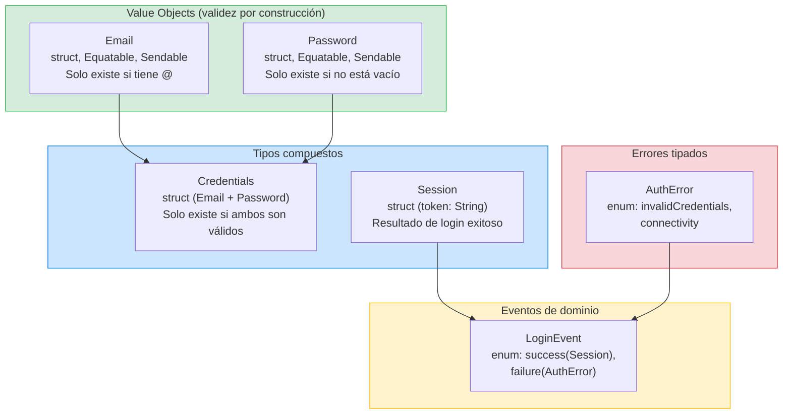
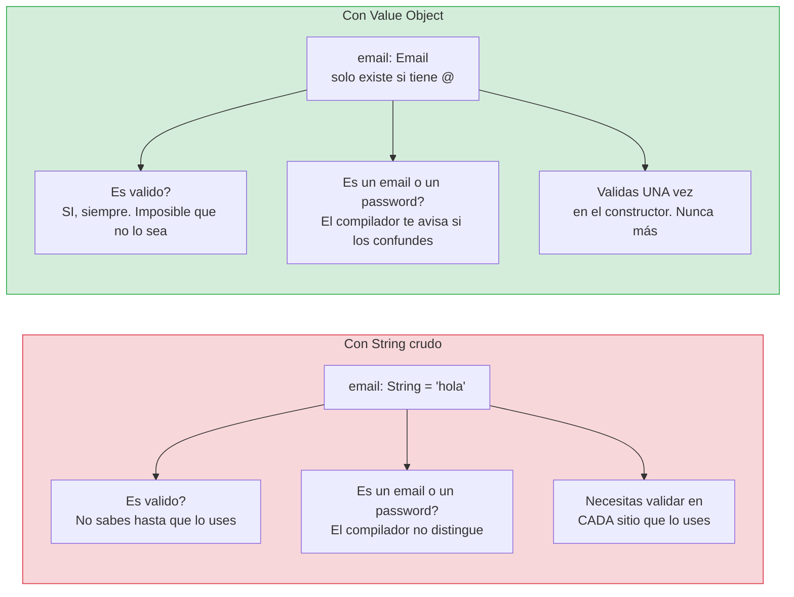

# Feature Login: Capa Domain

## Las reglas de negocio puras, implementadas con TDD

En la lección anterior definimos los escenarios BDD del Login. Ahora vamos a empezar a implementar, y lo hacemos por donde debe empezarse: por la capa Domain. El Domain es el corazón de la feature. Contiene los modelos de negocio, las reglas de validación, los errores tipados, y los eventos. No depende de SwiftUI, ni de Foundation, ni de URLSession, ni de nada externo. Es puro Swift.

En esta lección vamos a construir los siguientes tipos, todos con TDD (test primero, implementación después, usando XCTest):

El Value Object `Email`, que garantiza que un email tiene formato válido. El Value Object `Password`, que garantiza que una contraseña no está vacía. El tipo `Credentials` que agrupa ambos. El enum `AuthError` con los errores de autenticación. El enum `LoginEvent` con los eventos del dominio. Y el struct `Session` que representa una autenticación exitosa.

---

## Diagrama: todos los tipos del Domain y cómo se relacionan

Antes de implementar, mira el mapa completo de lo que vas a construir en esta lección:



Cada tipo en este diagrama es algo que vas a construir con TDD. Los Value Objects (verde) son lo primero, porque todo lo demás depende de ellos.

### Diagrama: String vs Value Object — por qué importa



---

## Qué es un Value Object y por qué es tan importante

Antes de escribir el primer test, necesitas entender qué es un Value Object, porque es el concepto de DDD que más vas a usar en todo el curso.

Un Value Object es un tipo que no tiene identidad propia. Se define exclusivamente por sus valores. Dos `Email` con el valor "user@example.com" son exactamente iguales. No hay un "Email con id 1" y un "Email con id 2" que tengan el mismo valor pero sean distintos. Si tienen el mismo valor, son el mismo objeto.

Los Value Objects tienen tres propiedades fundamentales:

**Son inmutables.** Una vez creados, no cambian. Si necesitas un email diferente, creas uno nuevo. Esto elimina una cantidad enorme de bugs relacionados con mutación accidental.

**Se validan en la construcción.** Un Value Object no puede existir en un estado inválido. Si intentas crear un `Email` con el string "esto-no-es-email", el constructor lanza un error y el objeto no se crea. No hay forma de tener un `Email` inválido en tu sistema. Nunca. Esta propiedad se llama "validez por construcción" y es extremadamente poderosa.

**Se comparan por valor.** No por referencia. `Email("a@b.com") == Email("a@b.com")` es `true`. En Swift, esto se consigue conformando `Equatable`.

Compara esto con usar `String` directamente. Con strings, cualquier valor es posible: "", "hola", "42", lo que sea. Necesitas validar en cada sitio que uses el email. Y es fácil confundir un email con un password porque ambos son `String`. Con Value Objects, el tipo `Email` solo puede contener valores válidos, y el compilador no te deja pasar un `Email` donde se espera un `Password` porque son tipos diferentes.

---

## Implementación del Value Object Email con TDD

Vamos a implementar `Email` paso a paso, siguiendo el ciclo TDD que explicamos en las lecciones anteriores. Recuerda: un test a la vez, en orden Red → Green → Refactor.

### Iteración 1: Un email válido se crea correctamente

**Red:** Escribimos el primer test. Este test dice: "cuando le paso un string con formato de email válido, quiero poder crear un `Email` y acceder a su valor".

```swift
// StackMyArchitectureTests/Features/Login/Domain/EmailTests.swift

import XCTest
@testable import StackMyArchitecture

final class EmailTests: XCTestCase {
    
    func test_init_with_valid_email_creates_email_successfully() throws {
        let email = try Email("user@example.com")
        
        XCTAssertEqual(email.value, "user@example.com")
    }
}
```

**Explicación línea por línea para que no quede ninguna duda:**

`import XCTest` — Importamos el framework de testing de Apple. XCTest es la librería que nos permite escribir y ejecutar tests. Sin este import, no podemos usar `XCTestCase`, ni `XCTAssertEqual`, ni ninguna función de testing.

`@testable import StackMyArchitecture` — Importamos nuestro módulo de la app con la palabra clave `@testable`. Normalmente, solo puedes acceder a tipos marcados como `public` desde otro módulo. Pero `@testable` es una excepción especial para tests: te permite acceder a todo lo que tiene acceso `internal` (que es el acceso por defecto en Swift). Sin `@testable`, no podríamos usar `Email` desde el test porque `Email` es `internal`.

`final class EmailTests: XCTestCase` — Creamos una clase de tests. `XCTestCase` es la clase base de la que heredan todos los tests en XCTest. `final` significa que nadie puede heredar de esta clase (es una buena práctica). El nombre `EmailTests` sigue la convención: el nombre del tipo que testeas + "Tests".

`func test_init_with_valid_email_creates_email_successfully() throws` — El nombre del método de test sigue una convención muy importante: `test_` + `qué método estás testeando` + `bajo qué condición` + `qué resultado esperas`. Aquí: testeamos el `init`, con un email válido, y esperamos que se cree exitosamente. XCTest ejecuta automáticamente todos los métodos que empiecen con `test`. Si tu método no empieza con `test`, XCTest lo ignora. La palabra `throws` después de los paréntesis significa que este test puede lanzar errores. Si un error se lanza y no se captura, el test falla automáticamente.

`let email = try Email("user@example.com")` — Intentamos crear un `Email` pasándole un string válido. La palabra `try` es obligatoria porque el `init` de `Email` puede lanzar un error (está marcado con `throws`). Si el `init` lanza un error, la ejecución se detiene aquí y el test falla (porque la función es `throws`). Si no lanza error, `email` contiene el `Email` creado.

`XCTAssertEqual(email.value, "user@example.com")` — Esta es la **verificación** (assert). `XCTAssertEqual` compara dos valores y **hace fallar el test si no son iguales**. Aquí verificamos que el email que creamos tiene el valor que le pasamos. Si `email.value` fuera "otra-cosa", el test fallaría con un mensaje como: `XCTAssertEqual failed: ("otra-cosa") is not equal to ("user@example.com")`.

**¿Qué pasa cuando ejecutamos este test?** Abrimos Xcode, pulsamos Cmd+U (o el botón de play junto al test). El compilador intenta compilar el código. Pero `Email` no existe todavía. El compilador dice: "No sé qué es `Email`". Eso es un **error de compilación**. En TDD, un error de compilación cuenta como "rojo". El test falla.

**Green:** Implementamos lo mínimo para que el test pase:

```swift
// StackMyArchitecture/Features/Login/Domain/Models/Email.swift

struct Email: Equatable, Sendable {
    let value: String
    
    init(_ rawValue: String) throws {
        self.value = rawValue
    }
}
```

**Explicación línea por línea:**

`struct Email` — Usamos `struct`, no `class`. ¿Por qué? Porque un Value Object es **inmutable** (no cambia después de crearse) y se **compara por valor** (dos Emails con el mismo string son iguales). Los structs en Swift son tipos de valor: se copian cuando se asignan, se comparan por sus propiedades, y son inmutables si usas `let`. Eso es exactamente lo que necesitamos.

`: Equatable` — Le decimos a Swift que dos `Email` son iguales si sus propiedades son iguales. Sin `Equatable`, no podríamos usar `XCTAssertEqual` en los tests (porque `XCTAssertEqual` necesita poder comparar dos valores). Swift genera automáticamente la implementación de `==` para structs que conforman `Equatable`, comparando todas las propiedades.

`, Sendable` — Le decimos a Swift que `Email` es seguro para usar desde múltiples hilos al mismo tiempo. En Swift 6 con strict concurrency, todo tipo que pase entre contextos async debe ser `Sendable`. Como `Email` es un struct inmutable con propiedades `Sendable` (String lo es), Swift puede verificar en compilación que es seguro. Si no ponemos `Sendable`, el compilador se quejará cuando usemos `Email` en funciones `async`.

`let value: String` — La propiedad que almacena el string del email. Es `let` (constante), no `var` (variable), porque los Value Objects son inmutables. Una vez que creas un Email, su valor no cambia nunca. Si necesitas otro valor, creas otro Email.

`init(_ rawValue: String) throws` — El constructor. El `_` antes de `rawValue` significa que no necesitas escribir el nombre del parámetro al llamarlo (puedes hacer `Email("user@example.com")` en vez de `Email(rawValue: "user@example.com")`). La palabra `throws` significa que este constructor puede fallar lanzando un error. Aunque de momento no lanza nada, lo ponemos ya porque sabemos que lo necesitaremos en la siguiente iteración.

`self.value = rawValue` — Guardamos el string que nos pasaron. De momento no validamos nada. Eso es lo mínimo para que el test pase.

Ejecutamos. El test pasa. ¿La implementación está completa? Ni de lejos. No valida nada. Pero el test que tenemos solo pide que se pueda crear un `Email` con un string, y eso funciona. TDD nos dice: implementa lo mínimo. Los tests que falten pedirán el comportamiento que falta.

**Refactor:** Nada que mejorar todavía.

### Iteración 2: Un email sin arroba es rechazado

**Red:** Añadimos un test que pide el comportamiento de rechazo:

```swift
func test_init_with_string_without_at_sign_throws_invalidFormat() {
    XCTAssertThrowsError(try Email("invalid-email")) { error in
        XCTAssertEqual(error as? Email.ValidationError, .invalidFormat)
    }
}
```

**Explicación línea por línea:**

`func test_init_with_string_without_at_sign_throws_invalidFormat()` — El nombre dice exactamente qué testeamos: el init, con un string sin arroba, y esperamos que lance `invalidFormat`. Fíjate en que este método NO tiene `throws`. ¿Por qué? Porque no usamos `try` directamente. En su lugar, usamos `XCTAssertThrowsError`, que captura el error por nosotros.

`XCTAssertThrowsError(try Email("invalid-email"))` — Esta función de XCTest dice: "ejecuta este código y **verifica que lanza un error**". Si el código NO lanza un error, el test falla. Si el código SÍ lanza un error, el test continúa al bloque `{ error in ... }`. Es lo opuesto a `try`: en vez de querer que funcione, **queremos que falle**.

`{ error in` — Este bloque se ejecuta solo si se lanzó un error. La variable `error` contiene el error que se lanzó. Es de tipo `any Error` (el tipo base de todos los errores en Swift).

`XCTAssertEqual(error as? Email.ValidationError, .invalidFormat)` — Aquí verificamos que el error lanzado es **exactamente** el que esperamos. `error as? Email.ValidationError` intenta convertir el error genérico al tipo específico `Email.ValidationError`. Si la conversión funciona, comparamos con `.invalidFormat`. Si no funciona (el error es de otro tipo), `as?` devuelve `nil` y el assert falla porque `nil != .invalidFormat`.

Ejecutamos. Falla porque `Email.ValidationError` no existe y porque el `init` actual acepta cualquier string.

**Green:** Añadimos la validación y el tipo de error:

```swift
struct Email: Equatable, Sendable {
    let value: String
    
    enum ValidationError: Error, Equatable {
        case invalidFormat
    }
    
    init(_ rawValue: String) throws {
        guard rawValue.contains("@") else {
            throw ValidationError.invalidFormat
        }
        self.value = rawValue
    }
}
```

**Explicación de las líneas nuevas:**

`enum ValidationError: Error, Equatable` — Creamos un enum **dentro** del struct `Email`. Esto se llama un tipo anidado (nested type). ¿Por qué dentro de Email? Porque este error solo tiene sentido en el contexto de Email. No es un error genérico del sistema, es un error de validación de Email específicamente. Conformar `Error` permite usarlo con `throw`. Conformar `Equatable` permite compararlo en los tests con `XCTAssertEqual`.

`case invalidFormat` — El único caso de error que tenemos de momento. Más adelante podrían añadirse otros (como `empty`), pero TDD nos dice: solo lo que necesitamos ahora.

`guard rawValue.contains("@") else { throw ValidationError.invalidFormat }` — `guard` es una estructura de control de Swift que dice: "si esta condición NO se cumple, ejecuta el bloque `else`". Aquí: si el string NO contiene "@", lanzamos el error. Si SÍ contiene "@", continuamos con la siguiente línea. `guard` es perfecto para validaciones porque deja claro cuál es la condición que debe cumplirse y qué pasa si no se cumple.

`throw ValidationError.invalidFormat` — Lanzamos el error. Cuando se ejecuta `throw`, la ejecución del `init` se detiene inmediatamente. El `Email` no se crea. El que llamó al `init` recibe el error (y tiene que manejarlo con `try`, `try?`, o `try!`).

Ejecutamos. Ambos tests pasan.

**Refactor:** La validación solo mira si hay arroba. Es suficiente para estos tests. Si necesitamos algo más estricto, un test futuro nos lo pedirá.

### Iteración 3: Un email sin punto en el dominio es rechazado

Ahora queremos ser un poco más estrictos: "user@domain" no debería ser válido porque el dominio no tiene un punto.

**Red:**

```swift
func test_init_with_email_without_domain_dot_throws_invalidFormat() {
    XCTAssertThrowsError(try Email("user@domain")) { error in
        XCTAssertEqual(error as? Email.ValidationError, .invalidFormat)
    }
}
```

Ejecutamos. Falla porque "user@domain" contiene arroba y pasa nuestra validación actual.

**Green:** Hacemos la validación más estricta:

```swift
init(_ rawValue: String) throws {
    guard Self.isValid(rawValue) else {
        throw ValidationError.invalidFormat
    }
    self.value = rawValue
}

private static func isValid(_ value: String) -> Bool {
    let parts = value.split(separator: "@")
    guard parts.count == 2 else { return false }
    return parts[1].contains(".")
}
```

Ejecutamos. Los tres tests pasan.

### Iteración 4: Un email vacío es rechazado

**Red:**

```swift
func test_init_with_empty_string_throws_invalidFormat() {
    XCTAssertThrowsError(try Email("")) { error in
        XCTAssertEqual(error as? Email.ValidationError, .invalidFormat)
    }
}
```

Ejecutamos. Pasa sin cambiar nada porque un string vacío no contiene "@". El test tiene valor documental: deja explícito que un email vacío es inválido.

### Iteración 5: El email se trimea de espacios

Los usuarios a veces pegan un email con espacios al principio o al final. Queremos que el sistema los limpie automáticamente.

**Red:**

```swift
func test_init_trims_whitespace_from_valid_email() throws {
    let email = try Email("  user@example.com  ")
    
    XCTAssertEqual(email.value, "user@example.com")
}
```

Ejecutamos. Falla porque nuestro `init` guarda el valor tal cual, con espacios.

**Green:** Añadimos el trimming:

```swift
init(_ rawValue: String) throws {
    let trimmed = rawValue.trimmingCharacters(in: .whitespaces)
    guard Self.isValid(trimmed) else {
        throw ValidationError.invalidFormat
    }
    self.value = trimmed
}
```

Ejecutamos. Todos los tests pasan.

**Refactor:** `trimmingCharacters(in:)` viene de Foundation. Es el único import de Foundation que necesitamos en este Value Object. Si quisiéramos evitarlo completamente, podríamos escribir nuestro propio trimming, pero el coste no justifica el beneficio. Lo dejamos así.

### El código final de Email

Después de las 5 iteraciones de TDD, el código de producción de `Email` es:

```swift
// StackMyArchitecture/Features/Login/Domain/Models/Email.swift

import Foundation

struct Email: Equatable, Sendable {
    let value: String
    
    enum ValidationError: Error, Equatable {
        case invalidFormat
    }
    
    init(_ rawValue: String) throws {
        let trimmed = rawValue.trimmingCharacters(in: .whitespaces)
        guard Self.isValid(trimmed) else {
            throw ValidationError.invalidFormat
        }
        self.value = trimmed
    }
    
    private static func isValid(_ value: String) -> Bool {
        let parts = value.split(separator: "@")
        guard parts.count == 2 else { return false }
        return parts[1].contains(".")
    }
}
```

Y el archivo de tests completo es:

```swift
// StackMyArchitectureTests/Features/Login/Domain/EmailTests.swift

import XCTest
@testable import StackMyArchitecture

final class EmailTests: XCTestCase {
    
    func test_init_with_valid_email_creates_email_successfully() throws {
        let email = try Email("user@example.com")
        
        XCTAssertEqual(email.value, "user@example.com")
    }
    
    func test_init_with_string_without_at_sign_throws_invalidFormat() {
        XCTAssertThrowsError(try Email("invalid-email")) { error in
            XCTAssertEqual(error as? Email.ValidationError, .invalidFormat)
        }
    }
    
    func test_init_with_email_without_domain_dot_throws_invalidFormat() {
        XCTAssertThrowsError(try Email("user@domain")) { error in
            XCTAssertEqual(error as? Email.ValidationError, .invalidFormat)
        }
    }
    
    func test_init_with_empty_string_throws_invalidFormat() {
        XCTAssertThrowsError(try Email("")) { error in
            XCTAssertEqual(error as? Email.ValidationError, .invalidFormat)
        }
    }
    
    func test_init_trims_whitespace_from_valid_email() throws {
        let email = try Email("  user@example.com  ")
        
        XCTAssertEqual(email.value, "user@example.com")
    }
}
```

Fíjate en lo que ha pasado: 5 tests, 5 iteraciones de TDD, y el resultado es un tipo de dominio completo, verificado, y con una cobertura que cubre todos los escenarios BDD que definimos. Y el código de producción tiene exactamente lo que necesitamos, nada más. No hay "código por si acaso". Todo lo que hay, lo pidió un test.

---

## Implementación del Value Object Password con TDD

Ahora aplicamos el mismo proceso al `Password`. Es más sencillo que `Email` porque la única regla es que no puede estar vacío.

### Iteración 1: Un password válido se crea correctamente

**Red:**

```swift
// StackMyArchitectureTests/Features/Login/Domain/PasswordTests.swift

import XCTest
@testable import StackMyArchitecture

final class PasswordTests: XCTestCase {
    
    func test_init_with_non_empty_string_creates_password_successfully() throws {
        let password = try Password("securePass123")
        
        XCTAssertEqual(password.value, "securePass123")
    }
}
```

No compila porque `Password` no existe.

**Green:**

```swift
// StackMyArchitecture/Features/Login/Domain/Models/Password.swift

struct Password: Equatable, Sendable {
    let value: String
    
    init(_ rawValue: String) throws {
        self.value = rawValue
    }
}
```

Pasa.

### Iteración 2: Un password vacío es rechazado

**Red:**

```swift
func test_init_with_empty_string_throws_empty() {
    XCTAssertThrowsError(try Password("")) { error in
        XCTAssertEqual(error as? Password.ValidationError, .empty)
    }
}
```

Falla.

**Green:**

```swift
struct Password: Equatable, Sendable {
    let value: String
    
    enum ValidationError: Error, Equatable {
        case empty
    }
    
    init(_ rawValue: String) throws {
        guard !rawValue.isEmpty else {
            throw ValidationError.empty
        }
        self.value = rawValue
    }
}
```

Ambos tests pasan. El `Password` está completo.

---

## El tipo Credentials

`Credentials` agrupa un `Email` y un `Password`. No necesita validación propia porque ambos componentes ya se validaron en su construcción. Si tienes un `Credentials`, sabes que tanto el email como el password son válidos.

```swift
// StackMyArchitecture/Features/Login/Domain/Models/Credentials.swift

struct Credentials: Equatable, Sendable {
    let email: Email
    let password: Password
}
```

No escribimos tests para `Credentials` porque no tiene comportamiento propio. Es un tipo de datos puro, sin lógica. Testear que un struct guarda los valores que le pasas no aporta valor. Los tests de `Email` y `Password` ya cubren la validación de sus componentes.

---

## Los errores de autenticación

De los escenarios BDD extrajimos que hay dos tipos de error que ocurren **después** de pasar la validación local: el servidor rechaza las credenciales (`invalidCredentials`) o no se puede conectar con el servidor (`connectivity`).

```swift
// StackMyArchitecture/Features/Login/Domain/Errors/AuthError.swift

enum AuthError: Error, Equatable, Sendable {
    case invalidCredentials
    case connectivity
}
```

Estos errores son diferentes de los errores de validación de los Value Objects (`Email.ValidationError.invalidFormat`, `Password.ValidationError.empty`). Los errores de los Value Objects son errores de **formato**: los datos del usuario no pasan la validación local. `AuthError` son errores de **autenticación**: los datos pasaron la validación local pero algo falló en la comunicación con el servidor.

¿Por qué esta distinción? Porque el manejo es diferente. Si el email tiene formato inválido, la UI puede mostrar el error inmediatamente sin hacer ninguna petición de red. Si el servidor rechaza las credenciales, la UI muestra un mensaje diferente ("email o contraseña incorrectos"). Si no hay conectividad, la UI muestra otro mensaje diferente ("sin conexión a internet, inténtalo de nuevo").

---

## Los eventos del dominio

Los eventos representan hechos que ya ocurrieron y que son relevantes para el sistema. No son comandos ("haz login") ni intenciones ("quiero hacer login"). Son hechos consumados ("el login fue exitoso", "el login falló").

```swift
// StackMyArchitecture/Features/Login/Domain/Events/LoginEvent.swift

enum LoginEvent: Equatable, Sendable {
    case succeeded(email: String)
    case failed(AuthError)
}
```

¿Para qué sirven los eventos? Para desacoplar la feature de lo que ocurre después. Cuando el login es exitoso, la feature emite `LoginEvent.succeeded(email: "user@example.com")`. Pero la feature **no sabe** qué pasa después. No sabe que el coordinador va a navegar a la pantalla de Home. No sabe que quizá se va a guardar la sesión en el keychain. Esas son decisiones de otros componentes que escuchan el evento y actúan en consecuencia.

Esto es fundamental para la modularidad. Si Login supiera que después del éxito hay que navegar a Home, estaría acoplado a Home. No podrías reutilizar Login en otro contexto donde después del éxito se vaya a otra pantalla. Con eventos, Login dice "pasó esto" y se desentiende del "y ahora qué".

---

## El modelo de sesión

La sesión es el resultado de una autenticación exitosa. Contiene la información mínima que el sistema necesita para saber que el usuario está autenticado.

```swift
// StackMyArchitecture/Features/Login/Domain/Models/Session.swift

struct Session: Equatable, Sendable {
    let token: String
    let email: String
}
```

El `token` es opaco para el dominio. El dominio no sabe ni le importa qué formato tiene (JWT, UUID, lo que sea). Solo sabe que es un string que la infraestructura le devolvió y que el sistema necesita para futuras peticiones autenticadas. El formato y la interpretación del token son responsabilidad de la capa de infraestructura.

El `email` está aquí como string (no como `Email`) porque la sesión representa la respuesta del servidor, no un dato validado localmente. El servidor devuelve el email como string en su respuesta JSON, y nosotros lo guardamos tal cual. Podríamos construir un `Email` a partir de él, pero no aportaría valor en este contexto: si el servidor nos devuelve un email, confiamos en que es válido.

---

## Por qué todas las decisiones de diseño

Vamos a detenernos un momento para explicar las decisiones transversales que hemos tomado en todos estos tipos y por qué:

### ¿Por qué `throws` en vez de `init?` (init failable)?

Cuando un constructor puede fallar, Swift ofrece dos opciones: `init?` que devuelve `nil` si falla, o `init() throws` que lanza un error si falla.

`init?` pierde información. Si `Email("malo")` devuelve `nil`, el llamante solo sabe que falló. No sabe si fue por falta de arroba, por falta de punto en el dominio, o por string vacío. Solo sabe que es `nil`.

`init() throws` con un error tipado comunica exactamente qué salió mal. `Email("malo")` lanza `Email.ValidationError.invalidFormat`. El llamante puede decidir qué hacer con esa información: mostrar un mensaje de error específico, logear el tipo de error, o propagarlo.

En Swift 5.9+ existe `throws(ValidationError)` (typed throws), que permite especificar el tipo exacto del error en la signatura de la función. Esto es aún mejor porque el compilador sabe exactamente qué errores puede lanzar el constructor. Puedes usarlo si tu versión de Swift lo soporta. En nuestro código usamos `throws` estándar porque es más compatible y el beneficio de typed throws es marginal en este contexto.

### ¿Por qué `Sendable` en todos los tipos?

Swift 6 con strict concurrency exige que cualquier dato que cruce una frontera de concurrencia (por ejemplo, que se pase de un `Task` a otro, o de un hilo de background al main thread) sea `Sendable`. Nuestros Value Objects, errores y eventos son todos structs inmutables con propiedades `let` de tipos que también son `Sendable` (`String`). Esto los hace automáticamente `Sendable`, pero los marcamos explícitamente para documentar la intención y para que el compilador lo verifique.

Si algún día alguien añade una propiedad mutable o un tipo no-Sendable a uno de estos structs, el compilador dará un error inmediato. Eso es exactamente lo que queremos: que las violaciones de seguridad de concurrencia se detecten en compilación, no en producción.

### ¿Por qué `Equatable` en todos los tipos?

Los Value Objects se definen por sus valores, así que deben ser comparables por valor. `Email("a@b.com") == Email("a@b.com")` debe ser `true`. En Swift, esto se consigue conformando `Equatable`. Para structs con propiedades que ya son `Equatable`, Swift sintetiza la conformancia automáticamente.

Además, `Equatable` es necesario para los asserts de XCTest (`XCTAssertEqual`) y para que SwiftUI pueda hacer diffs eficientes cuando compara estados.

---

## Reflexión: lo que acabamos de construir

Hemos creado la capa Domain completa de la feature Login. Repasa mentalmente lo que tenemos:

Dos Value Objects (`Email`, `Password`) que garantizan validez por construcción. Un tipo compuesto (`Credentials`) que agrupa ambos. Un enum de errores de autenticación (`AuthError`) con dos casos que cubren los escenarios BDD. Un enum de eventos (`LoginEvent`) que desacopla la feature del resto del sistema. Y un modelo de sesión (`Session`) que representa la autenticación exitosa.

Todo es inmutable, `Sendable`, `Equatable`, y no importa nada externo (salvo Foundation para el trimming del email). Todo está cubierto por tests XCTest escritos antes del código de producción. Y todo usa los términos del lenguaje ubicuo que definimos en la especificación BDD.

En la siguiente lección vamos a subir una capa: la Application. Allí construiremos el caso de uso `LoginUseCase` que orquesta todo el flujo de login, usando los Value Objects del Domain para validación local y un puerto (protocolo) para delegar la autenticación remota.

---

**Anterior:** [Especificación BDD ←](00-especificacion-bdd.md) · **Siguiente:** [Application →](02-application.md)
