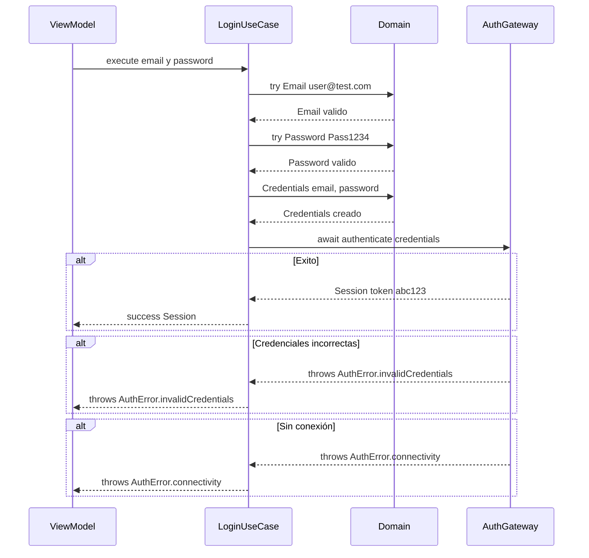
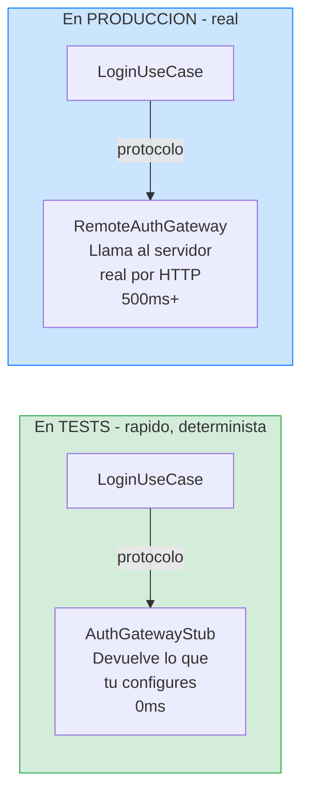
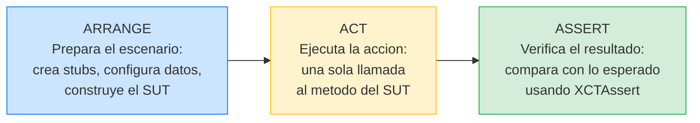
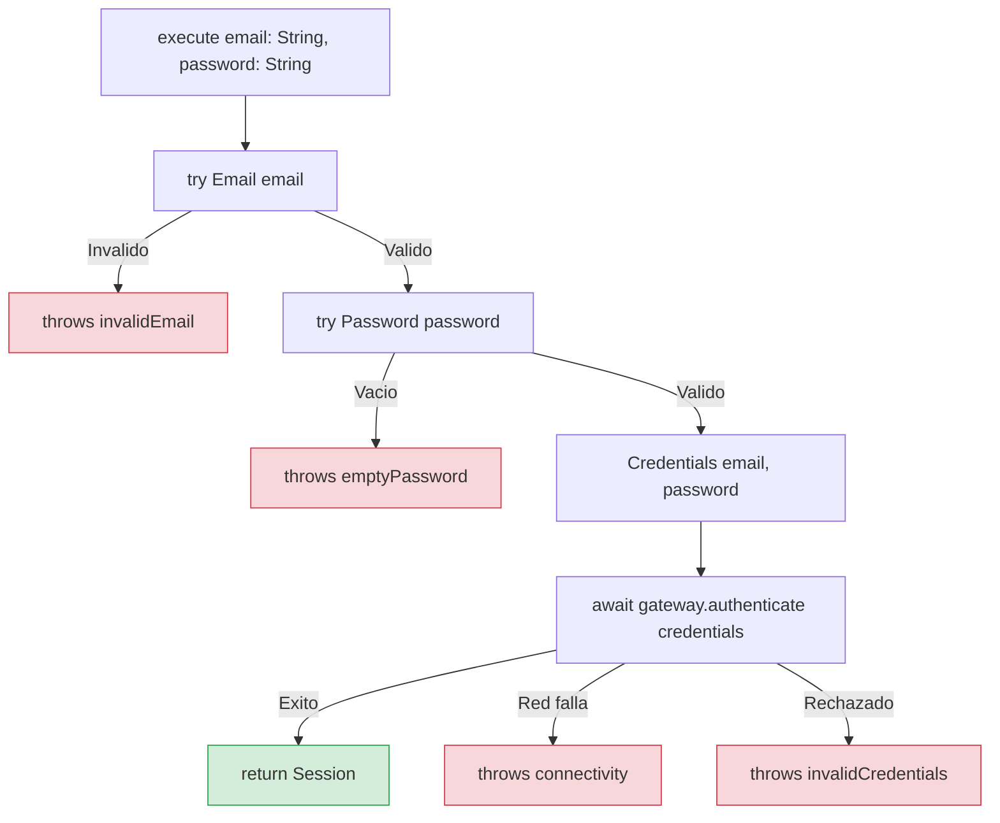

# Feature Login: Capa Application

## El caso de uso que orquesta todo el flujo

En la lección anterior construimos la capa Domain: los Value Objects `Email` y `Password`, los errores `AuthError`, los eventos `LoginEvent`, y el modelo `Session`. Todo puro, sin dependencias externas, testeado con XCTest.

Ahora subimos una capa. La capa Application contiene los **casos de uso**, que son las operaciones de negocio completas. Un caso de uso recibe datos crudos (los strings que el usuario escribió), los valida usando el Domain, delega operaciones externas a través de un protocolo (un "puerto"), y devuelve un resultado.

En esta lección vamos a construir dos cosas:

El **puerto** `AuthGateway`, que es el protocolo que define la interfaz de autenticación. El caso de uso sabe que necesita "algo que pueda autenticar credenciales", pero no sabe (ni le importa) si es un servidor real, un fake, o un mock.

El **caso de uso** `LoginUseCase`, que orquesta el flujo completo: valida email, valida password, construye credenciales, delega autenticación, y traduce errores.

Todo con TDD usando XCTest, un test a la vez.

---

## Qué es un puerto y por qué lo necesitamos

Un puerto/protocolo es simplemente un protocolo Swift que define una interfaz que el caso de uso necesita pero que no implementa. Es la materialización del principio de inversión de dependencias que explicamos en lecciones anteriores.

Piensa en ello así: el `LoginUseCase` necesita autenticar credenciales contra un servidor. Pero si el caso de uso llamara directamente a `URLSession`, estaría acoplado a la red. No podrías testearlo sin un servidor real. No podrías hacer previews sin conexión. No podrías cambiar de URLSession a otra librería sin modificar el caso de uso.

La solución es definir un protocolo/puerto que diga "necesito algo que pueda recibir credenciales y devolver una sesión o un error". El caso de uso depende de este protocolo/puerto, no de una implementación concreta. Y la implementación concreta (que vive en la capa Infrastructure) implementa ese protocolo/puerto. Es como el enchufe y la bombilla que mencionamos en la lección de principios: la interfaz estándar que permite cambiar una pieza sin afectar a la otra.

### El protocolo AuthGateway

```swift
// StackMyArchitecture/Features/Login/Application/Ports/AuthGateway.swift

protocol AuthGateway: Sendable {
    func authenticate(credentials: Credentials) async throws -> Session
}
```

Vamos a analizar cada aspecto de esta declaración, porque cada palabra está ahí por una razón:

**`protocol`** — es un protocolo/puerto, no una clase ni un struct. Esto es fundamental: define una interfaz sin implementación. Cualquier tipo que conforme este protocolo/puerto puede ser usado por el caso de uso.

**`AuthGateway`** — el nombre usa el lenguaje ubicuo del dominio. No es `NetworkService`, ni `APIClient`, ni `AuthManager`. Es un "gateway de autenticación": una puerta de entrada al servicio de autenticación, sea cual sea su implementación.

**`: Sendable`** — el protocolo es `Sendable` porque en Swift 6 con strict concurrency, cualquier tipo que se use en contextos async debe ser `Sendable`. Las implementaciones de este protocolo van a ser llamadas desde funciones `async`, así que necesitamos garantizar que son seguras para concurrencia.

**`func authenticate(credentials: Credentials)`** — recibe un `Credentials` (que ya sabemos que es válido, porque los Value Objects se validaron en la construcción). No recibe strings crudos. ¿Por qué? Porque la responsabilidad de validar los datos de entrada es del caso de uso, no del gateway. Cuando los datos llegan al gateway, ya están validados.

**`async throws -> Session`** — la operación es asíncrona (requiere una petición de red o similar) y puede fallar. Si falla, lanza un error. Si tiene éxito, devuelve una `Session`.

Fíjate en lo que este protocolo **no** dice: no dice nada de URLs, ni de HTTP, ni de JSON, ni de tokens de autorización. Solo dice "dame credenciales, te devuelvo una sesión o un error". Los detalles de cómo se implementa eso son responsabilidad de la capa Infrastructure, que veremos en la siguiente lección.

---

## Diagrama: el flujo completo del LoginUseCase

Antes de implementar, visualiza qué hace el caso de uso paso a paso:



Fíjate en que el UseCase hace **tres cosas** en orden:
1. **Valida** los datos de entrada usando los Value Objects del Domain
2. **Delega** la autenticación al gateway a través del protocolo/puerto
3. **Propaga** el resultado (éxito o error) al caller

No hace más. No navega. No muestra alertas. No guarda tokens en UserDefaults. Esas responsabilidades pertenecen a otras capas.

### Diagrama: por qué usamos un stub en los tests



El mismo `LoginUseCase` funciona con ambos. No sabe si detrás hay un stub o un servidor real. Solo sabe que tiene un `AuthGateway` (su protocolo/puerto). **Esto es inyección de dependencias en acción.**

---

## Construyendo el LoginUseCase con TDD

Ahora viene la parte más importante de esta lección: implementar el caso de uso con TDD. Vamos a necesitar un doble de test (un stub) del protocolo/puerto `AuthGateway` para poder testear el caso de uso sin depender de infraestructura real. Lo construiremos conforme lo necesitemos.

### Primero: el doble de test (AuthGatewayStub)

Para testear el `LoginUseCase` de forma aislada, necesitamos una implementación falsa de `AuthGateway` que podamos configurar para devolver lo que necesitemos en cada test. A esto se le llama un **stub**: un doble de test que devuelve valores predeterminados.

```swift
// StackMyArchitectureTests/Features/Login/Helpers/AuthGatewayStub.swift

import XCTest
@testable import StackMyArchitecture

final class AuthGatewayStub: AuthGateway, @unchecked Sendable {
    private let result: Result<Session, AuthError>
    private(set) var receivedCredentials: Credentials?
    
    init(result: Result<Session, AuthError>) {
        self.result = result
    }
    
    func authenticate(credentials: Credentials) async throws -> Session {
        receivedCredentials = credentials
        return try result.get()
    }
}
```

**Explicación línea por línea (esto es un spy, lee la guía de test doubles si no recuerdas qué es):**

`final class AuthGatewayStub: AuthGateway, @unchecked Sendable` — Es una clase, no un struct. ¿Por qué? Porque necesitamos **mutabilidad**: cuando el UseCase llame a `authenticate`, queremos guardar las credenciales que recibió (eso es mutar la propiedad `receivedCredentials`). Los structs no permiten eso fácilmente en funciones de protocolo. `: AuthGateway` significa que conforma el protocolo — es decir, tiene el mismo método `authenticate` que el AuthGateway real. Esto es clave: el UseCase no sabe si recibe un stub o el real, porque ambos conforman el mismo protocolo. `@unchecked Sendable` le dice al compilador "confía en mí, este tipo es seguro para concurrencia". En producción evitamos `@unchecked`, pero en tests es aceptable porque cada test se ejecuta de forma aislada.

`private let result: Result<Session, AuthError>` — El stub se configura en el constructor con el resultado que queremos que devuelva. `Result` es un tipo de Swift que puede ser `.success(valor)` o `.failure(error)`. Si queremos testear el caso feliz: `.success(session)`. Si queremos testear un error: `.failure(.invalidCredentials)`. Esto nos da **control total** sobre lo que "responde" el gateway en cada test.

`private(set) var receivedCredentials: Credentials?` — Esta propiedad es la parte **spy** del stub. Registra las credenciales que el stub recibió cuando fue llamado. `private(set)` significa que solo el propio stub puede cambiar su valor (en `authenticate`), pero desde fuera del stub puedes leerlo. Es `Optional` (`Credentials?`) porque empieza en `nil` (nadie ha llamado al stub todavía). Si después de ejecutar el test `receivedCredentials` sigue siendo `nil`, significa que el gateway **nunca fue llamado**. Esto es útil para verificar que el UseCase NO llama al gateway cuando el email es inválido.

`func authenticate(credentials: Credentials) async throws -> Session` — Este método tiene exactamente la misma firma que el protocolo `AuthGateway`. El compilador nos obliga: si no implementamos este método con esta firma exacta, no conformamos el protocolo y no compila.

`receivedCredentials = credentials` — **Registra** las credenciales que recibió. Esto es lo que hace que sea un spy, no solo un stub.

`return try result.get()` — Devuelve el resultado que configuramos en el constructor. `result.get()` es un método de `Result` que devuelve el valor si es `.success` o lanza el error si es `.failure`. El `try` es necesario porque `.get()` puede lanzar.

### Iteración 1: Login exitoso con credenciales válidas

Este es el test del escenario BDD "Login exitoso con credenciales válidas". Es el primer test que escribimos para el caso de uso.

**Red:**

```swift
// StackMyArchitectureTests/Features/Login/Application/LoginUseCaseTests.swift

import XCTest
@testable import StackMyArchitecture

final class LoginUseCaseTests: XCTestCase {
    
    func test_execute_with_valid_credentials_returns_session() async throws {
        let expectedSession = Session(token: "valid-token", email: "user@example.com")
        let gateway = AuthGatewayStub(result: .success(expectedSession))
        let sut = LoginUseCase(authGateway: gateway)
        
        let session = try await sut.execute(email: "user@example.com", password: "pass123")
        
        XCTAssertEqual(session, expectedSession)
    }
}
```

**Explicación línea por línea, siguiendo el patrón Arrange-Act-Assert:**

Todos los tests del curso siguen un patrón de 3 fases llamado **Arrange-Act-Assert** (Preparar-Actuar-Verificar). Es como cocinar: primero preparas los ingredientes (Arrange), luego cocinas (Act), y finalmente pruebas el resultado (Assert). Siempre en ese orden.



**Fase ARRANGE (preparar el escenario):**

`let expectedSession = Session(token: "valid-token", email: "user@example.com")` — Creamos la sesión que esperamos recibir como resultado. La creamos nosotros para poder compararla después en el assert. "valid-token" y "user@example.com" son valores inventados para el test — no importa qué valores sean, lo que importa es que el resultado coincida con lo que configuramos.

`let gateway = AuthGatewayStub(result: .success(expectedSession))` — Creamos el stub del gateway y le decimos: "cuando te pidan autenticar, devuelve éxito con esta sesión". Esto simula que el servidor acepta las credenciales y devuelve un token válido. Es como programar a un actor: "cuando te pregunten, di esta frase".

`let sut = LoginUseCase(authGateway: gateway)` — Creamos el componente que queremos testear: el `LoginUseCase`. Le **inyectamos** el stub como dependencia. `sut` significa "System Under Test" (sistema bajo prueba). Es una convención universal en testing para dejar claro cuál es el objeto que estamos testeando. Siempre que veas `sut` en un test, sabes que es el protagonista.

**Fase ACT (ejecutar la acción):**

`let session = try await sut.execute(email: "user@example.com", password: "pass123")` — Llamamos al método que queremos probar. Solo UNA llamada. Nunca dos. El Act siempre es una sola línea. `try` porque puede lanzar errores (si el email es inválido, por ejemplo). `await` porque es una función asíncrona (el UseCase llama al gateway que es `async`). Los strings "user@example.com" y "pass123" son los datos de entrada que simulan lo que el usuario escribiría en la pantalla.

**Fase ASSERT (verificar el resultado):**

`XCTAssertEqual(session, expectedSession)` — Verificamos que la sesión que nos devolvió el UseCase es **exactamente** la misma que configuramos en el stub. Si son iguales, el test pasa (verde). Si son diferentes, el test falla (rojo) con un mensaje que dice exactamente qué valores son diferentes.

**¿Qué demuestra este test?** Que cuando le pasamos un email válido y un password válido al UseCase, y el gateway responde con éxito, el UseCase nos devuelve la sesión correcta. Es el escenario BDD del "camino feliz" traducido a código ejecutable.

Ejecutamos. No compila porque `LoginUseCase` no existe. Eso es nuestro rojo.

**Green:** Implementamos lo mínimo:

```swift
// StackMyArchitecture/Features/Login/Application/UseCases/LoginUseCase.swift

struct LoginUseCase: Sendable {
    private let authGateway: any AuthGateway
    
    init(authGateway: any AuthGateway) {
        self.authGateway = authGateway
    }
    
    func execute(email: String, password: String) async throws -> Session {
        let validEmail = try Email(email)
        let validPassword = try Password(password)
        let credentials = Credentials(email: validEmail, password: validPassword)
        return try await authGateway.authenticate(credentials: credentials)
    }
}
```

**Explicación línea por línea del LoginUseCase:**

`struct LoginUseCase: Sendable` — Es un struct, no una clase. ¿Por qué? Porque el UseCase no tiene estado mutable. Solo tiene una referencia al gateway (que es `let`, constante). Los structs son más ligeros que las clases y no necesitan gestión de memoria (ARC). `Sendable` le dice al compilador que este tipo es seguro para concurrencia (puede usarse desde funciones `async` sin problemas).

`private let authGateway: any AuthGateway` — La dependencia del UseCase. Es un **protocolo** (`AuthGateway`), no un tipo concreto. La palabra `any` es obligatoria en Swift 5.7+ para indicar que es un "existential type" (un tipo que puede ser cualquier cosa que conforme el protocolo). Esto es la clave de la **inyección de dependencias**: el UseCase no sabe si el gateway es real (llama a un servidor) o un stub (devuelve datos fijos). Solo sabe que tiene un método `authenticate`.

`init(authGateway: any AuthGateway)` — El constructor recibe el gateway como parámetro. No lo crea él. Esto es **inyección de dependencias por constructor**: alguien de fuera (el Composition Root o el test) le pasa la dependencia. Si el UseCase creara su propia dependencia (`let gateway = RemoteAuthGateway()`), no podríamos testearlo sin un servidor real.

`func execute(email: String, password: String) async throws -> Session` — La interfaz pública del UseCase. Recibe strings crudos (lo que el usuario escribió en la UI), y devuelve una `Session` o lanza un error. `async` porque la autenticación es asíncrona (requiere una petición de red). `throws` porque puede fallar (email inválido, sin conexión, credenciales rechazadas).

`let validEmail = try Email(email)` — Intenta crear un Value Object `Email` a partir del string crudo. Si el string no tiene formato de email (no tiene @), el `Email.init` lanza `Email.ValidationError.invalidFormat`. El `try` propaga ese error hacia arriba. **Si esta línea falla, las siguientes no se ejecutan.** El gateway nunca se llama. Esto es importante: validamos ANTES de hacer la petición de red.

`let validPassword = try Password(password)` — Lo mismo para el password. Si está vacío, `Password.init` lanza `Password.ValidationError.empty`.

`let credentials = Credentials(email: validEmail, password: validPassword)` — Creamos el tipo `Credentials` que agrupa email y password validados. Si llegamos hasta aquí, sabemos con certeza que tanto el email como el password son válidos. No necesitamos volver a validar nunca más.

`return try await authGateway.authenticate(credentials: credentials)` — Delegamos al gateway. `try` porque el gateway puede lanzar `AuthError.connectivity` o `AuthError.invalidCredentials`. `await` porque es asíncrono. El gateway devuelve una `Session` que nosotros devolvemos directamente al que nos llamó (el ViewModel).

**El flujo completo en un diagrama:**



Ejecutamos. El test pasa. Fíjate en que la implementación ya hace algo útil: crea los Value Objects (que se validan solos) y delega al gateway. No hemos hecho "lo mínimo tonto" (como devolver una sesión hardcodeada) porque el test pide una sesión que viene del gateway, y la forma natural de satisfacer eso es pasar las credenciales al gateway. TDD no significa hacer trampas; significa no implementar más de lo que los tests piden.

**Refactor:** El código está limpio. Seguimos.

### Iteración 2: Verificar que las credenciales llegan al gateway

Este test verifica un aspecto diferente: que el caso de uso pasa al gateway las credenciales correctas, no cualquier cosa.

**Red:**

```swift
func test_execute_sends_validated_credentials_to_gateway() async throws {
    let gateway = AuthGatewayStub(result: .success(Session(token: "t", email: "e")))
    let sut = LoginUseCase(authGateway: gateway)
    
    _ = try await sut.execute(email: "user@example.com", password: "pass123")
    
    XCTAssertEqual(gateway.receivedCredentials?.email.value, "user@example.com")
    XCTAssertEqual(gateway.receivedCredentials?.password.value, "pass123")
}
```

Ejecutamos. Pasa sin cambios. Las credenciales ya se pasan correctamente. El test tiene valor documental: deja explícito que el caso de uso transforma los strings de entrada en Value Objects validados antes de pasarlos al gateway.

### Iteración 3: Email inválido devuelve error

Ahora testeamos el primer sad path: qué pasa cuando el email no tiene formato válido.

**Red:**

```swift
func test_execute_with_invalid_email_throws_invalidEmail() async {
    let gateway = AuthGatewayStub(result: .success(Session(token: "t", email: "e")))
    let sut = LoginUseCase(authGateway: gateway)
    
    do {
        _ = try await sut.execute(email: "invalid-email", password: "pass123")
        XCTFail("Expected error but succeeded")
    } catch {
        XCTAssertTrue(error is Email.ValidationError)
    }
}
```

Ejecutamos. Pasa, porque `Email("invalid-email")` ya lanza `Email.ValidationError.invalidFormat` y nuestro `execute` propaga el error con `try`. Pero hay un problema: el error que recibe el llamante es `Email.ValidationError.invalidFormat`, que es un tipo interno del Domain. ¿Queremos que la UI tenga que conocer los tipos internos de validación del Domain? No. Queremos que el caso de uso traduzca ese error a un error propio, más limpio.

Vamos a modificar el test para pedir un error del caso de uso, no del Domain:

```swift
func test_execute_with_invalid_email_throws_invalidEmail() async {
    let gateway = AuthGatewayStub(result: .success(Session(token: "t", email: "e")))
    let sut = LoginUseCase(authGateway: gateway)
    
    do {
        _ = try await sut.execute(email: "invalid-email", password: "pass123")
        XCTFail("Expected LoginUseCase.Error.invalidEmail but succeeded")
    } catch let error as LoginUseCase.Error {
        XCTAssertEqual(error, .invalidEmail)
    } catch {
        XCTFail("Unexpected error type: \(error)")
    }
}
```

Ejecutamos. Falla porque `LoginUseCase.Error` no existe y el caso de uso no traduce errores.

**Green:** Añadimos el tipo de error y la traducción:

```swift
struct LoginUseCase: Sendable {
    private let authGateway: any AuthGateway
    
    init(authGateway: any AuthGateway) {
        self.authGateway = authGateway
    }
    
    enum Error: Swift.Error, Equatable, Sendable {
        case invalidEmail
        case emptyPassword
        case invalidCredentials
        case connectivity
    }
    
    func execute(email: String, password: String) async throws -> Session {
        let validEmail: Email
        do {
            validEmail = try Email(email)
        } catch {
            throw Error.invalidEmail
        }
        
        let validPassword: Password
        do {
            validPassword = try Password(password)
        } catch {
            throw Error.emptyPassword
        }
        
        let credentials = Credentials(email: validEmail, password: validPassword)
        
        do {
            return try await authGateway.authenticate(credentials: credentials)
        } catch let authError as AuthError {
            switch authError {
            case .invalidCredentials: throw Error.invalidCredentials
            case .connectivity: throw Error.connectivity
            }
        }
    }
}
```

Ejecutamos. Todos los tests pasan (incluido el test del happy path, que sigue funcionando).

Fíjate en lo que ha pasado: el test nos obligó a introducir un tipo `LoginUseCase.Error` y a hacer traducción de errores. Esto es TDD guiando el diseño. Sin el test que pidió explícitamente un `LoginUseCase.Error`, podríamos haber dejado que los errores internos del Domain se propagaran a la UI, lo cual sería un acoplamiento incorrecto.

### Iteración 4: Password vacío devuelve error

**Red:**

```swift
func test_execute_with_empty_password_throws_emptyPassword() async {
    let gateway = AuthGatewayStub(result: .success(Session(token: "t", email: "e")))
    let sut = LoginUseCase(authGateway: gateway)
    
    do {
        _ = try await sut.execute(email: "user@example.com", password: "")
        XCTFail("Expected LoginUseCase.Error.emptyPassword but succeeded")
    } catch let error as LoginUseCase.Error {
        XCTAssertEqual(error, .emptyPassword)
    } catch {
        XCTFail("Unexpected error type: \(error)")
    }
}
```

Ejecutamos. Pasa sin cambios, porque la implementación ya traduce `Password.ValidationError` a `LoginUseCase.Error.emptyPassword`.

### Iteración 5: No se llama al gateway si el email es inválido

Este test verifica un comportamiento que los escenarios BDD requieren explícitamente: "NO se envía ninguna petición al servidor" cuando el email es inválido.

**Red:**

```swift
func test_execute_with_invalid_email_does_not_call_gateway() async {
    let gateway = AuthGatewayStub(result: .success(Session(token: "t", email: "e")))
    let sut = LoginUseCase(authGateway: gateway)
    
    _ = try? await sut.execute(email: "invalid-email", password: "pass123")
    
    XCTAssertNil(gateway.receivedCredentials)
}
```

Ejecutamos. Pasa sin cambios, porque el `try Email(email)` falla antes de llegar a `authGateway.authenticate(...)`. El gateway nunca es invocado, así que `receivedCredentials` sigue siendo `nil`.

### Iteración 6: Credenciales rechazadas por el servidor

Ahora testeamos los errores que vienen del gateway (no de la validación local).

**Red:**

```swift
func test_execute_with_rejected_credentials_throws_invalidCredentials() async {
    let gateway = AuthGatewayStub(result: .failure(.invalidCredentials))
    let sut = LoginUseCase(authGateway: gateway)
    
    do {
        _ = try await sut.execute(email: "user@example.com", password: "wrong")
        XCTFail("Expected LoginUseCase.Error.invalidCredentials but succeeded")
    } catch let error as LoginUseCase.Error {
        XCTAssertEqual(error, .invalidCredentials)
    } catch {
        XCTFail("Unexpected error type: \(error)")
    }
}
```

Ejecutamos. Pasa sin cambios, porque la implementación ya captura `AuthError.invalidCredentials` y lo traduce a `LoginUseCase.Error.invalidCredentials`.

### Iteración 7: Sin conectividad

**Red:**

```swift
func test_execute_without_connectivity_throws_connectivity() async {
    let gateway = AuthGatewayStub(result: .failure(.connectivity))
    let sut = LoginUseCase(authGateway: gateway)
    
    do {
        _ = try await sut.execute(email: "user@example.com", password: "pass123")
        XCTFail("Expected LoginUseCase.Error.connectivity but succeeded")
    } catch let error as LoginUseCase.Error {
        XCTAssertEqual(error, .connectivity)
    } catch {
        XCTFail("Unexpected error type: \(error)")
    }
}
```

Ejecutamos. Pasa. Todos los escenarios BDD están cubiertos.

---

## El código final completo

### LoginUseCase (producción)

```swift
// StackMyArchitecture/Features/Login/Application/UseCases/LoginUseCase.swift

struct LoginUseCase: Sendable {
    private let authGateway: any AuthGateway
    
    init(authGateway: any AuthGateway) {
        self.authGateway = authGateway
    }
    
    enum Error: Swift.Error, Equatable, Sendable {
        case invalidEmail
        case emptyPassword
        case invalidCredentials
        case connectivity
    }
    
    func execute(email: String, password: String) async throws -> Session {
        let validEmail: Email
        do {
            validEmail = try Email(email)
        } catch {
            throw Error.invalidEmail
        }
        
        let validPassword: Password
        do {
            validPassword = try Password(password)
        } catch {
            throw Error.emptyPassword
        }
        
        let credentials = Credentials(email: validEmail, password: validPassword)
        
        do {
            return try await authGateway.authenticate(credentials: credentials)
        } catch let authError as AuthError {
            switch authError {
            case .invalidCredentials: throw Error.invalidCredentials
            case .connectivity: throw Error.connectivity
            }
        }
    }
}
```

### LoginUseCaseTests (tests completos)

```swift
// StackMyArchitectureTests/Features/Login/Application/LoginUseCaseTests.swift

import XCTest
@testable import StackMyArchitecture

final class LoginUseCaseTests: XCTestCase {
    
    // MARK: - Happy Path
    
    func test_execute_with_valid_credentials_returns_session() async throws {
        let expectedSession = Session(token: "valid-token", email: "user@example.com")
        let gateway = AuthGatewayStub(result: .success(expectedSession))
        let sut = LoginUseCase(authGateway: gateway)
        
        let session = try await sut.execute(email: "user@example.com", password: "pass123")
        
        XCTAssertEqual(session, expectedSession)
    }
    
    func test_execute_sends_validated_credentials_to_gateway() async throws {
        let gateway = AuthGatewayStub(result: .success(Session(token: "t", email: "e")))
        let sut = LoginUseCase(authGateway: gateway)
        
        _ = try await sut.execute(email: "user@example.com", password: "pass123")
        
        XCTAssertEqual(gateway.receivedCredentials?.email.value, "user@example.com")
        XCTAssertEqual(gateway.receivedCredentials?.password.value, "pass123")
    }
    
    // MARK: - Validation Errors
    
    func test_execute_with_invalid_email_throws_invalidEmail() async {
        let gateway = AuthGatewayStub(result: .success(Session(token: "t", email: "e")))
        let sut = LoginUseCase(authGateway: gateway)
        
        do {
            _ = try await sut.execute(email: "invalid-email", password: "pass123")
            XCTFail("Expected LoginUseCase.Error.invalidEmail but succeeded")
        } catch let error as LoginUseCase.Error {
            XCTAssertEqual(error, .invalidEmail)
        } catch {
            XCTFail("Unexpected error type: \(error)")
        }
    }
    
    func test_execute_with_empty_password_throws_emptyPassword() async {
        let gateway = AuthGatewayStub(result: .success(Session(token: "t", email: "e")))
        let sut = LoginUseCase(authGateway: gateway)
        
        do {
            _ = try await sut.execute(email: "user@example.com", password: "")
            XCTFail("Expected LoginUseCase.Error.emptyPassword but succeeded")
        } catch let error as LoginUseCase.Error {
            XCTAssertEqual(error, .emptyPassword)
        } catch {
            XCTFail("Unexpected error type: \(error)")
        }
    }
    
    func test_execute_with_invalid_email_does_not_call_gateway() async {
        let gateway = AuthGatewayStub(result: .success(Session(token: "t", email: "e")))
        let sut = LoginUseCase(authGateway: gateway)
        
        _ = try? await sut.execute(email: "invalid-email", password: "pass123")
        
        XCTAssertNil(gateway.receivedCredentials)
    }
    
    // MARK: - Gateway Errors
    
    func test_execute_with_rejected_credentials_throws_invalidCredentials() async {
        let gateway = AuthGatewayStub(result: .failure(.invalidCredentials))
        let sut = LoginUseCase(authGateway: gateway)
        
        do {
            _ = try await sut.execute(email: "user@example.com", password: "wrong")
            XCTFail("Expected LoginUseCase.Error.invalidCredentials but succeeded")
        } catch let error as LoginUseCase.Error {
            XCTAssertEqual(error, .invalidCredentials)
        } catch {
            XCTFail("Unexpected error type: \(error)")
        }
    }
    
    func test_execute_without_connectivity_throws_connectivity() async {
        let gateway = AuthGatewayStub(result: .failure(.connectivity))
        let sut = LoginUseCase(authGateway: gateway)
        
        do {
            _ = try await sut.execute(email: "user@example.com", password: "pass123")
            XCTFail("Expected LoginUseCase.Error.connectivity but succeeded")
        } catch let error as LoginUseCase.Error {
            XCTAssertEqual(error, .connectivity)
        } catch {
            XCTFail("Unexpected error type: \(error)")
        }
    }
}
```

---

## Trazabilidad completa: escenario BDD → test XCTest

| Escenario BDD | Test XCTest | Resultado |
|----------------|------------|-----------|
| Login exitoso | `test_execute_with_valid_credentials_returns_session` | Verifica que se devuelve la sesión |
| Credenciales correctas llegan al gateway | `test_execute_sends_validated_credentials_to_gateway` | Verifica que se pasan los Value Objects |
| Email inválido | `test_execute_with_invalid_email_throws_invalidEmail` | Verifica el error tipado |
| Password vacío | `test_execute_with_empty_password_throws_emptyPassword` | Verifica el error tipado |
| Email inválido no contacta servidor | `test_execute_with_invalid_email_does_not_call_gateway` | Verifica que el gateway NO fue invocado |
| Servidor rechaza credenciales | `test_execute_with_rejected_credentials_throws_invalidCredentials` | Verifica traducción de error |
| Sin conectividad | `test_execute_without_connectivity_throws_connectivity` | Verifica traducción de error |

---

## Por qué el caso de uso tiene sus propios errores

Una decisión de diseño que merece una explicación más profunda es por qué `LoginUseCase` define su propio enum `Error` en lugar de propagar directamente los errores del Domain y la Infrastructure.

El motivo es que el caso de uso actúa como **frontera de la feature**. Es la interfaz pública que la capa Interface (la UI) consume. Si la UI tuviera que manejar `Email.ValidationError.invalidFormat` y `Password.ValidationError.empty` y `AuthError.invalidCredentials` y `AuthError.connectivity`, tendría que conocer los tipos internos del Domain. Eso sería acoplamiento entre la UI y el Domain.

En su lugar, el caso de uso traduce todos los errores posibles a un conjunto unificado de errores (`LoginUseCase.Error`) que tiene sentido desde la perspectiva de la feature como un todo. La UI solo necesita conocer `LoginUseCase.Error`, que es limpio, completo, y no expone detalles internos.

Si mañana cambiamos la validación del email (por ejemplo, añadiendo un nuevo caso de error `Email.ValidationError.disposableProvider`), el caso de uso puede decidir cómo traducir ese nuevo error sin que la UI se entere. Quizá lo traduce a `.invalidEmail` como los demás, quizá añade un nuevo caso a `LoginUseCase.Error`. Pero la decisión se toma aquí, no en la UI.

---

## Por qué el caso de uso es un struct y no una clase

El `LoginUseCase` es un `struct`, no un `class`. Esto puede parecer inusual si vienes de otros frameworks donde los servicios y use cases son clases singleton. Pero en nuestro caso, el `struct` es la opción correcta:

El caso de uso **no tiene estado mutable**. Recibe sus dependencias en el `init` y las guarda como `let`. No hay ninguna propiedad que cambie después de la construcción. Un struct inmutable es más seguro, más eficiente, y más fácil de razonar que una clase.

El caso de uso es `Sendable` automáticamente (porque es un struct con propiedades `Sendable`). Esto es importante para strict concurrency: puedes pasar el caso de uso entre Tasks sin problemas.

Si el caso de uso fuera una clase, necesitarías preocuparte por retención cíclica, por herencia accidental, y por identidad (dos instancias con las mismas dependencias serían diferentes objetos). Con un struct, nada de eso aplica.

La propiedad `authGateway` es `any AuthGateway` (un existential). En teoría esto tiene un pequeño overhead de runtime comparado con usar un genérico (`struct LoginUseCase<Gateway: AuthGateway>`). En la práctica, este overhead es negligible para un caso de uso que se ejecuta una vez por acción del usuario. Si algún día el profiler mostrara que es un cuello de botella (spoiler: no lo será), lo cambiaríamos a genérico. Pero no optimizamos sin datos.

---

## Reflexión: qué hemos conseguido

Tenemos ahora la capa Application completa de la feature Login:

Un protocolo `AuthGateway` que define la interfaz de autenticación, sin acoplamiento a ninguna implementación concreta.

Un caso de uso `LoginUseCase` que orquesta todo el flujo: valida con Value Objects, delega al gateway, traduce errores. No importa SwiftUI. No importa URLSession. No sabe nada de UI ni de red.

Siete tests XCTest que cubren todos los escenarios BDD: happy path, validación local, errores de gateway, y verificación de que el gateway no se invoca cuando los datos son inválidos.

Un stub (`AuthGatewayStub`) que permite testear el caso de uso de forma aislada, rápida, y determinista.

En la siguiente lección implementaremos la capa Infrastructure: la implementación real del `AuthGateway` que habla con un servidor, y un `StubAuthGateway` para desarrollo sin servidor.

---

**Anterior:** [Domain ←](01-domain.md) · **Siguiente:** [Infrastructure →](03-infrastructure.md)
