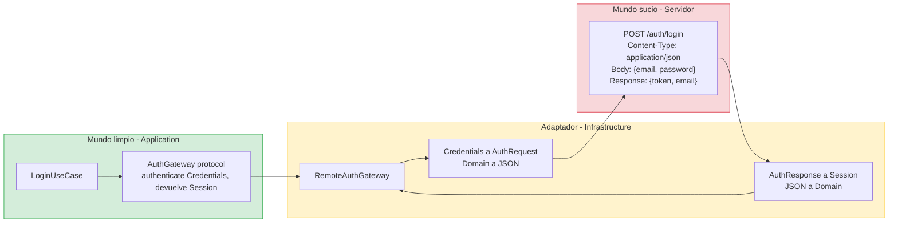
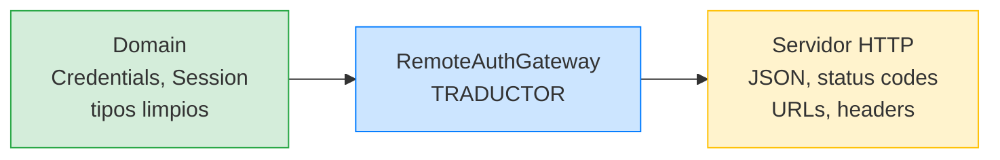
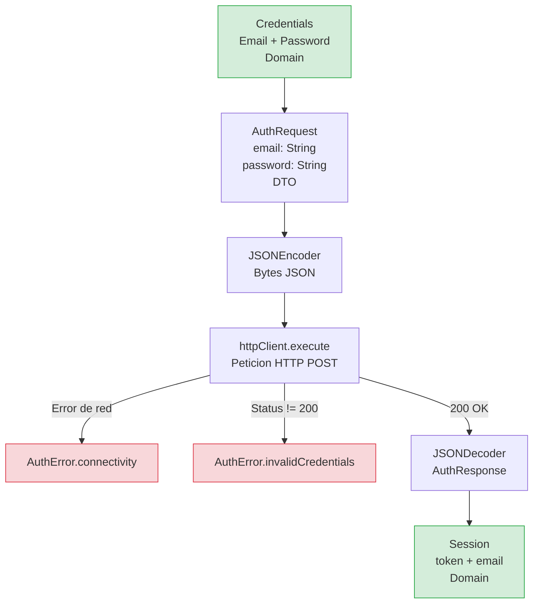

# Feature Login: Capa Infrastructure

## Donde el código habla con el mundo real

En las lecciones anteriores construimos el Domain (modelos puros, Value Objects, errores) y la Application (el caso de uso que orquesta el flujo y el puerto `AuthGateway`). Todo eso es código que no sabe nada del mundo exterior: no sabe de HTTP, ni de JSON, ni de URLs, ni de `URLSession`.

Ahora llegamos a la capa Infrastructure. Esta es la capa que **implementa los puertos** definidos por Application. Es donde vive el código que habla con servidores, que parsea JSON, que persiste datos en disco. Es la capa más "sucia" en el sentido de que depende de frameworks de Apple, de formatos de datos externos, y de servicios que pueden fallar de formas impredecibles.

En esta lección vamos a construir tres cosas:

El **`RemoteAuthGateway`**, que implementa el protocolo `AuthGateway` llamando a un servidor HTTP real. El **`StubAuthGateway`**, que implementa el mismo protocolo devolviendo datos falsos, útil para desarrollo sin servidor y para SwiftUI Previews. Y los **DTOs** (Data Transfer Objects), que son los tipos que representan el formato de datos que el servidor envía y recibe, separados de los modelos del Domain.

Todo con tests XCTest.

---

## El concepto de adaptador

### Diagrama: el adaptador traduce entre dos mundos



El adaptador es el **traductor** entre dos idiomas: el idioma limpio del Domain (`Credentials`, `Session`) y el idioma del servidor (JSON, HTTP status codes, URLs). Si el servidor cambia su JSON, solo cambias el adaptador. El UseCase ni se entera.

En la terminología de Hexagonal Architecture (Ports and Adapters), la Infrastructure contiene los **adaptadores**: implementaciones concretas de los puertos que adaptan el mundo exterior a la interfaz que el caso de uso espera. El `RemoteAuthGateway` es un adaptador: adapta una API HTTP (con URLs, JSON, status codes) a la interfaz limpia del protocolo `AuthGateway` (que solo habla de `Credentials` y `Session`).

Esta separación es importante porque el mundo exterior cambia constantemente. El servidor puede cambiar el formato de su JSON. Puede cambiar de REST a GraphQL. Puede cambiar la URL del endpoint. Puede añadir headers de autenticación. Cada uno de estos cambios afecta **solo** a la Infrastructure. El Domain y la Application no se enteran.

---

## Los DTOs: el contrato con el servidor

Antes de implementar el gateway, necesitamos definir los tipos que representan los datos que el servidor envía y recibe. En DDD, estos tipos se llaman DTOs (Data Transfer Objects). Son distintos de los modelos del Domain:

Los modelos del Domain (`Email`, `Password`, `Credentials`, `Session`) representan **conceptos de negocio**. Tienen validación, invariantes, y semántica rica.

Los DTOs (`AuthRequest`, `AuthResponse`) representan **el formato de los datos en tránsito**. Son la representación exacta del JSON que el servidor espera recibir y del JSON que el servidor envía. No tienen validación, no tienen lógica. Son contenedores de datos.

¿Por qué no usar directamente los modelos del Domain como DTOs? Porque si lo haces, estás acoplando tu dominio al formato del servidor. Si el servidor cambia el nombre de un campo de "email" a "user_email", tendrías que cambiar el modelo `Email` del Domain. Eso es inaceptable: el Domain no debería cambiar por caprichos del API.

### AuthRequest: lo que enviamos al servidor

```swift
// StackMyArchitecture/Features/Login/Infrastructure/DTOs/AuthRequest.swift

struct AuthRequest: Encodable, Sendable {
    let email: String
    let password: String
}
```

El `AuthRequest` es el cuerpo de la petición HTTP que enviamos al servidor. Es `Encodable` porque lo vamos a serializar a JSON. Fíjate en que usa `String`, no `Email` ni `Password`. ¿Por qué? Porque al servidor le enviamos strings planos en JSON. La validación ya ocurrió en la capa Domain. Para cuando los datos llegan aquí, ya sabemos que son válidos.

### AuthResponse: lo que el servidor nos devuelve

```swift
// StackMyArchitecture/Features/Login/Infrastructure/DTOs/AuthResponse.swift

struct AuthResponse: Decodable, Sendable {
    let token: String?
    let email: String?
}
```

El `AuthResponse` es el body de la respuesta HTTP del servidor. Es `Decodable` porque lo vamos a deserializar desde JSON. El `token` es opcional porque en caso de error (credenciales rechazadas), el servidor no envía token. El `email` también es opcional por la misma razón.

---

## El protocolo HTTPClient

El `RemoteAuthGateway` necesita hacer peticiones HTTP. Pero si usara `URLSession` directamente, no podríamos testearlo sin un servidor real. Así que definimos un protocolo `HTTPClient` que abstraiga la petición HTTP:

```swift
// StackMyArchitecture/Features/Login/Infrastructure/HTTPClient.swift

protocol HTTPClient: Sendable {
    func execute(_ request: URLRequest) async throws -> (Data, HTTPURLResponse)
}
```

Este protocolo dice: "dame un URLRequest, te devuelvo los datos y la respuesta HTTP". Es lo mínimo que necesitamos. En producción, la implementación será un wrapper alrededor de `URLSession`. En tests, será un stub que devuelve datos predeterminados.

¿Por qué este protocolo vive en Infrastructure y no en SharedKernel? Porque es un detalle de implementación de la infraestructura de red. Si otra feature necesita hacer peticiones HTTP, tendrá su propio gateway con su propio protocolo de puerto. El `HTTPClient` es una dependencia interna de los gateways, no una dependencia del Domain ni de Application.

---

## Implementación del RemoteAuthGateway

Ahora implementamos el gateway real. Este es el código que en producción hará la petición HTTP al servidor.

```swift
// StackMyArchitecture/Features/Login/Infrastructure/RemoteAuthGateway.swift

import Foundation

struct RemoteAuthGateway: AuthGateway, Sendable {
    private let httpClient: any HTTPClient
    private let baseURL: URL
    
    init(httpClient: any HTTPClient, baseURL: URL) {
        self.httpClient = httpClient
        self.baseURL = baseURL
    }
    
    func authenticate(credentials: Credentials) async throws -> Session {
        let url = baseURL.appendingPathComponent("auth/login")
        var request = URLRequest(url: url)
        request.httpMethod = "POST"
        request.setValue("application/json", forHTTPHeaderField: "Content-Type")
        
        let body = AuthRequest(
            email: credentials.email.value,
            password: credentials.password.value
        )
        request.httpBody = try JSONEncoder().encode(body)
        
        let data: Data
        let response: HTTPURLResponse
        do {
            (data, response) = try await httpClient.execute(request)
        } catch {
            throw AuthError.connectivity
        }
        
        guard response.statusCode == 200 else {
            throw AuthError.invalidCredentials
        }
        
        let authResponse = try JSONDecoder().decode(AuthResponse.self, from: data)
        
        guard let token = authResponse.token else {
            throw AuthError.invalidCredentials
        }
        
        return Session(token: token, email: credentials.email.value)
    }
}
```

**Explicación línea por línea del RemoteAuthGateway:**

Este es el componente más "sucio" de la feature Login: es el que habla con el mundo exterior (el servidor HTTP). Su trabajo es traducir entre dos idiomas: el idioma limpio del Domain (`Credentials`, `Session`) y el idioma de la red (`URLRequest`, `Data`, `HTTPURLResponse`, JSON).



`struct RemoteAuthGateway: AuthGateway, Sendable` — Conforma el protocolo `AuthGateway` (definido en Application). Esto significa que implementa el método `authenticate(credentials:)`. Es `Sendable` para poder usarse en funciones `async`.

`private let httpClient: any HTTPClient` — La dependencia para hacer peticiones HTTP. Es un protocolo, no `URLSession` directamente. En producción será un wrapper de `URLSession`. En tests será un `HTTPClientStub`. El gateway no sabe cuál es.

`private let baseURL: URL` — La URL base del servidor (por ejemplo, `https://api.miapp.com`). Es un parámetro del constructor, no una constante hardcodeada. Esto permite usar URLs diferentes para producción (`https://api.miapp.com`), staging (`https://staging.miapp.com`), y tests (`https://api.example.com`), sin cambiar el código del gateway.

**Fase 1: Construir la petición HTTP**

`let url = baseURL.appendingPathComponent("auth/login")` — Construimos la URL completa del endpoint. Si `baseURL` es `https://api.example.com`, la URL resultante es `https://api.example.com/auth/login`.

`var request = URLRequest(url: url)` — Creamos un `URLRequest`. Es `var` (mutable) porque vamos a configurar sus propiedades.

`request.httpMethod = "POST"` — Especificamos que es una petición POST (enviamos datos al servidor). GET es para pedir datos, POST es para enviar datos.

`request.setValue("application/json", forHTTPHeaderField: "Content-Type")` — Le decimos al servidor que el cuerpo de la petición es JSON. Sin este header, el servidor no sabría interpretar los bytes que le enviamos.

`let body = AuthRequest(email: credentials.email.value, password: credentials.password.value)` — Creamos el DTO `AuthRequest` a partir de los Value Objects del Domain. `credentials.email.value` extrae el string del `Email`. **Aquí ocurre el mapping Domain a Infrastructure:** los tipos ricos del Domain (`Email`, `Password`) se convierten en strings planos que el servidor entiende.

`request.httpBody = try JSONEncoder().encode(body)` — Convertimos el DTO a bytes JSON. `JSONEncoder` usa las propiedades del struct para generar algo como `{"email":"user@example.com","password":"pass123"}`. Esos bytes se ponen como cuerpo de la petición HTTP.

**Fase 2: Ejecutar la petición**

`do { (data, response) = try await httpClient.execute(request) } catch { throw AuthError.connectivity }` — Enviamos la petición y esperamos la respuesta. Si **cualquier** error ocurre (sin internet, timeout, DNS no resuelve, el servidor no responde...), capturamos el error y lanzamos `AuthError.connectivity`. No nos importa el detalle del error de red. Desde la perspectiva del Domain, cualquier fallo de red es simplemente "no pudimos conectar".

**Fase 3: Interpretar la respuesta**

`guard response.statusCode == 200 else { throw AuthError.invalidCredentials }` — Si el servidor respondió con un código que no es 200 (éxito), asumimos que las credenciales fueron rechazadas. Un 401 (Unauthorized) o un 500 (Server Error) se traducen ambos a `invalidCredentials`. Simplificamos intencionalmente: el Domain no necesita saber la diferencia entre "servidor caído" y "credenciales rechazadas".

`let authResponse = try JSONDecoder().decode(AuthResponse.self, from: data)` — Parseamos los bytes de la respuesta como JSON y los convertimos al DTO `AuthResponse`. Si el JSON no tiene el formato esperado, `JSONDecoder` lanza un error que se propaga.

`guard let token = authResponse.token else { throw AuthError.invalidCredentials }` — Verificamos que el token está presente. Si el servidor respondió 200 pero no envió token (un caso raro pero posible), lanzamos error.

`return Session(token: token, email: credentials.email.value)` — Si todo fue bien, construimos y devolvemos una `Session` del Domain. **Aquí ocurre el mapping inverso: Infrastructure a Domain.** Los datos del servidor (strings planos del JSON) se convierten en un tipo rico del Domain (`Session`).

**El flujo completo de traducción:**



---

## Implementación del StubAuthGateway

Para desarrollo sin servidor y para SwiftUI Previews, necesitamos una implementación que devuelva datos falsos sin hacer ninguna petición de red:

```swift
// StackMyArchitecture/Features/Login/Infrastructure/StubAuthGateway.swift

struct StubAuthGateway: AuthGateway, Sendable {
    private let delay: UInt64
    
    init(delayNanoseconds: UInt64 = 500_000_000) {
        self.delay = delayNanoseconds
    }
    
    func authenticate(credentials: Credentials) async throws -> Session {
        try await Task.sleep(nanoseconds: delay)
        return Session(
            token: "stub-token-\(UUID().uuidString)",
            email: credentials.email.value
        )
    }
}
```

El stub tiene un delay configurable que por defecto es 0.5 segundos. ¿Por qué no devolver el resultado inmediatamente? Porque queremos que el desarrollo con el stub sea lo más parecido posible a la producción. En producción, la petición de red tarda un tiempo. Si el stub devuelve instantáneamente, no detectarás problemas de UX: estados de loading que no se muestran, animaciones que se saltan, condiciones de carrera cuando el usuario pulsa dos veces el botón. El delay simulado te obliga a manejar estos casos durante el desarrollo, no en producción cuando ya es tarde.

Para los tests unitarios, puedes configurar el delay a 0 para que los tests sean rápidos: `StubAuthGateway(delayNanoseconds: 0)`.

---

## Tests de contrato del RemoteAuthGateway

Los tests de contrato verifican que la implementación del gateway traduce correctamente las respuestas HTTP a los tipos del Domain. Necesitamos un stub de `HTTPClient`:

```swift
// StackMyArchitectureTests/Features/Login/Infrastructure/Helpers/HTTPClientStub.swift

import Foundation
@testable import StackMyArchitecture

final class HTTPClientStub: HTTPClient, @unchecked Sendable {
    private let result: Result<(Data, HTTPURLResponse), Error>
    private(set) var receivedRequests: [URLRequest] = []
    
    init(data: Data, statusCode: Int) {
        let response = HTTPURLResponse(
            url: URL(string: "https://any-url.com")!,
            statusCode: statusCode,
            httpVersion: nil,
            headerFields: nil
        )!
        self.result = .success((data, response))
    }
    
    init(error: Error) {
        self.result = .failure(error)
    }
    
    func execute(_ request: URLRequest) async throws -> (Data, HTTPURLResponse) {
        receivedRequests.append(request)
        return try result.get()
    }
}
```

**Explicación línea por línea del HTTPClientStub:**

Este stub hace exactamente lo mismo que el `AuthGatewayStub` pero para un nivel más bajo: simula la red HTTP en vez de simular la autenticación.

`final class HTTPClientStub: HTTPClient, @unchecked Sendable` — Conforma el protocolo `HTTPClient`. El gateway real usará `URLSession` para hacer peticiones HTTP reales. Este stub devuelve datos que tú configuras, sin tocar la red.

`private let result: Result<(Data, HTTPURLResponse), Error>` — El resultado configurado. `Data` son los bytes de la respuesta (el JSON). `HTTPURLResponse` contiene el status code (200, 401, 500...). Si es `.failure`, simula un error de red.

El stub tiene **dos constructores**: uno para simular respuestas exitosas (`init(data:statusCode:)`) y otro para simular errores de red (`init(error:)`). Esto facilita crear stubs en los tests: `HTTPClientStub(data: json, statusCode: 200)` simula un servidor que responde bien, y `HTTPClientStub(error: NSError(domain: "net", code: -1))` simula que no hay internet.

`private(set) var receivedRequests: [URLRequest] = []` — La parte **spy**: registra todas las peticiones que el gateway envió. Esto nos permite verificar que el gateway construyó la petición HTTP correctamente (URL correcta, método POST, body JSON correcto).

Y ahora los tests. Presta especial atención al patrón `makeSUT` que es un helper que vamos a usar en **todos** los archivos de tests del curso:

```swift
// StackMyArchitectureTests/Features/Login/Infrastructure/RemoteAuthGatewayTests.swift

import XCTest
@testable import StackMyArchitecture

final class RemoteAuthGatewayTests: XCTestCase {
    
    private let baseURL = URL(string: "https://api.example.com")!
    
    // MARK: - Helpers
    
    private func makeSUT(
        data: Data = Data(),
        statusCode: Int = 200
    ) throws -> (sut: RemoteAuthGateway, client: HTTPClientStub) {
        let client = HTTPClientStub(data: data, statusCode: statusCode)
        let sut = RemoteAuthGateway(httpClient: client, baseURL: baseURL)
        return (sut, client)
    }
    
    private func makeSUT(error: Error) -> (sut: RemoteAuthGateway, client: HTTPClientStub) {
        let client = HTTPClientStub(error: error)
        let sut = RemoteAuthGateway(httpClient: client, baseURL: baseURL)
        return (sut, client)
    }
    
    private func makeCredentials() throws -> Credentials {
        Credentials(
            email: try Email("user@example.com"),
            password: try Password("pass123")
        )
    }
    
    private func makeSuccessJSON(token: String, email: String) -> Data {
        let json = ["token": token, "email": email]
        return try! JSONSerialization.data(withJSONObject: json)
    }
```

**¿Qué es `makeSUT` y por qué existe?**

`makeSUT` es un **helper** (función auxiliar) que crea el componente bajo prueba (SUT) junto con sus dependencias. Existe por tres razones:

1. **Reduce duplicación.** Sin `makeSUT`, cada test tendría que crear el `HTTPClientStub`, el `RemoteAuthGateway`, y conectarlos. Con 6 tests, son 18 líneas repetidas. Con `makeSUT`, cada test llama a una sola función.

2. **Centraliza la creación.** Si mañana el constructor de `RemoteAuthGateway` cambia (por ejemplo, se añade un nuevo parámetro), solo cambias `makeSUT`. Sin el helper, tendrías que cambiar 6 tests.

3. **Hace los tests más legibles.** El test se enfoca en lo que es **diferente** en cada escenario (qué datos devuelve el stub, qué status code), no en la plomería repetitiva de crear objetos.

`makeSUT` devuelve una **tupla** `(sut: RemoteAuthGateway, client: HTTPClientStub)`. Una tupla es simplemente varios valores empaquetados juntos. Usamos nombres (`sut:` y `client:`) para poder acceder a cada valor por nombre: `result.sut` y `result.client`. O, más comúnmente, desestructuramos la tupla directamente: `let (sut, client) = try makeSUT(...)`.

`makeCredentials()` y `makeSuccessJSON(...)` son otros helpers que crean datos de prueba reutilizables. El objetivo es el mismo: que cada test solo contenga lo que es **único** de ese escenario.

```swift
    // MARK: - Happy Path
    
    func test_authenticate_on_200_with_valid_json_returns_session() async throws {
        let json = makeSuccessJSON(token: "abc-123", email: "user@example.com")
        let (sut, _) = try makeSUT(data: json, statusCode: 200)
        let credentials = try makeCredentials()
        
        let session = try await sut.authenticate(credentials: credentials)
        
        XCTAssertEqual(session.token, "abc-123")
        XCTAssertEqual(session.email, "user@example.com")
    }
    
    func test_authenticate_sends_post_to_correct_url() async throws {
        let json = makeSuccessJSON(token: "t", email: "e")
        let (sut, client) = try makeSUT(data: json, statusCode: 200)
        let credentials = try makeCredentials()
        
        _ = try await sut.authenticate(credentials: credentials)
        
        XCTAssertEqual(client.receivedRequests.count, 1)
        XCTAssertEqual(
            client.receivedRequests.first?.url?.absoluteString,
            "https://api.example.com/auth/login"
        )
        XCTAssertEqual(client.receivedRequests.first?.httpMethod, "POST")
    }
    
    func test_authenticate_sends_credentials_as_json_body() async throws {
        let json = makeSuccessJSON(token: "t", email: "e")
        let (sut, client) = try makeSUT(data: json, statusCode: 200)
        let credentials = try makeCredentials()
        
        _ = try await sut.authenticate(credentials: credentials)
        
        let bodyData = client.receivedRequests.first?.httpBody
        XCTAssertNotNil(bodyData)
        
        let body = try JSONDecoder().decode(AuthRequest.self, from: bodyData!)
        XCTAssertEqual(body.email, "user@example.com")
        XCTAssertEqual(body.password, "pass123")
    }
    
    // MARK: - Error Paths
    
    func test_authenticate_on_network_error_throws_connectivity() async throws {
        let (sut, _) = makeSUT(error: URLError(.notConnectedToInternet))
        let credentials = try makeCredentials()
        
        do {
            _ = try await sut.authenticate(credentials: credentials)
            XCTFail("Expected AuthError.connectivity but succeeded")
        } catch let error as AuthError {
            XCTAssertEqual(error, .connectivity)
        } catch {
            XCTFail("Unexpected error: \(error)")
        }
    }
    
    func test_authenticate_on_401_throws_invalidCredentials() async throws {
        let (sut, _) = try makeSUT(data: Data(), statusCode: 401)
        let credentials = try makeCredentials()
        
        do {
            _ = try await sut.authenticate(credentials: credentials)
            XCTFail("Expected AuthError.invalidCredentials but succeeded")
        } catch let error as AuthError {
            XCTAssertEqual(error, .invalidCredentials)
        } catch {
            XCTFail("Unexpected error: \(error)")
        }
    }
    
    func test_authenticate_on_500_throws_invalidCredentials() async throws {
        let (sut, _) = try makeSUT(data: Data(), statusCode: 500)
        let credentials = try makeCredentials()
        
        do {
            _ = try await sut.authenticate(credentials: credentials)
            XCTFail("Expected AuthError.invalidCredentials but succeeded")
        } catch let error as AuthError {
            XCTAssertEqual(error, .invalidCredentials)
        } catch {
            XCTFail("Unexpected error: \(error)")
        }
    }
}
```

### Por qué usamos helpers en los tests

Fíjate en los métodos `makeSUT(...)`, `makeCredentials()`, y `makeSuccessJSON(...)`. Estos son **helpers de test** que reducen la duplicación. Cada test crea un SUT, unas credenciales, y algún dato de respuesta. En lugar de repetir la misma configuración en cada test, lo extraemos a helpers. Esto tiene dos ventajas: los tests son más cortos y fáciles de leer, y si cambia la forma de crear un `RemoteAuthGateway` (por ejemplo, si añadimos un parámetro al constructor), solo cambiamos el helper, no los 6 tests.

### Qué verifican estos tests

Estos tests no verifican que `URLSession` funciona (eso es responsabilidad de Apple). Verifican que nuestro **mapping** es correcto:

Que una respuesta 200 con un JSON válido se convierte correctamente en una `Session`. Que la petición se envía al URL correcto con el método correcto. Que las credenciales se serializan correctamente en el body JSON. Que un error de red se traduce a `AuthError.connectivity`. Que un status code no-200 se traduce a `AuthError.invalidCredentials`.

Estos son **contract tests**: verifican que el adaptador cumple el contrato que define el puerto. Si el día de mañana el servidor cambia el formato del JSON, estos tests fallarán y nos dirán exactamente qué cambió y qué necesitamos ajustar.

---

## Por qué los DTOs son tipos separados del Domain

Esta es una decisión de diseño que merece una explicación extendida porque va en contra de lo que muchos tutoriales hacen.

En muchos tutoriales, el modelo de dominio es el mismo que se usa para parsear JSON:

```swift
// ❌ Esto es lo que NO hacemos
struct Session: Codable {
    let token: String
    let email: String
}
```

Si `Session` es `Codable`, se puede usar directamente para parsear la respuesta del servidor. Parece eficiente: un solo tipo para todo. Pero tiene un problema grave: estás acoplando tu modelo de dominio al formato de datos del servidor.

¿Qué pasa si el servidor cambia el nombre del campo de "token" a "access_token"? Necesitas cambiar `Session`, que es un tipo del Domain. Pero `Session` lo usan los casos de uso, los tests del Domain, los tests de Application, los ViewModels. Un cambio en el formato del API impacta en cascada a todo el sistema.

Con DTOs separados, el cambio solo afecta al DTO y al mapping dentro del gateway:

```swift
// ✅ Esto es lo que hacemos
// El DTO cambia cuando cambia el servidor
struct AuthResponse: Decodable, Sendable {
    let access_token: String?  // El servidor cambió el nombre
    let email: String?
}

// El mapping se ajusta dentro del gateway
return Session(token: authResponse.access_token!, email: credentials.email.value)

// Session no cambia. El Domain no se entera.
```

El coste de esta separación es escribir unos pocos tipos adicionales y un mapping. El beneficio es que tu Domain es estable e independiente del mundo exterior. En un proyecto enterprise que dura años, este beneficio se paga con creces.

---

## Por qué el StubAuthGateway tiene delay configurable

El `StubAuthGateway` simula un delay de 0.5 segundos por defecto. Esto puede parecer un detalle menor, pero es una decisión deliberada de diseño.

En desarrollo con el stub, quieres que la experiencia sea lo más parecida posible a producción. Si el stub devuelve datos instantáneamente, te pierdes toda una categoría de problemas:

El loading indicator no se muestra nunca porque el resultado llega antes de que SwiftUI renderice el estado de "loading". El usuario puede pulsar el botón dos veces porque no hay feedback visual de que la operación está en progreso. Las animaciones de transición se saltan. Los tests de cancelación no tienen sentido porque no hay nada que cancelar.

El delay configurable permite tener lo mejor de ambos mundos: delay realista para desarrollo visual, y delay cero para tests unitarios que necesitan ser rápidos.

---

## Reflexión: lo que hemos construido

Tenemos ahora la capa Infrastructure completa de la feature Login:

Un `RemoteAuthGateway` que traduce entre el mundo HTTP/JSON y la interfaz limpia del protocolo `AuthGateway`. Un protocolo `HTTPClient` que permite testear el gateway sin hacer peticiones de red reales. DTOs separados (`AuthRequest`, `AuthResponse`) que aíslan el Domain de los cambios en el formato del API. Un `StubAuthGateway` para desarrollo sin servidor y previews. Tests de contrato que verifican el mapping correcto en todos los escenarios: éxito, error de credenciales, error de conectividad, URL correcta, body correcto.

En la siguiente lección llegaremos a la última capa: Interface. Allí construiremos el `LoginViewModel` y la `LoginView` con SwiftUI, conectando todo el flujo desde la UI hasta el Domain.

---

**Anterior:** [Application ←](02-application.md) · **Siguiente:** [Interface SwiftUI →](04-interface-swiftui.md)
