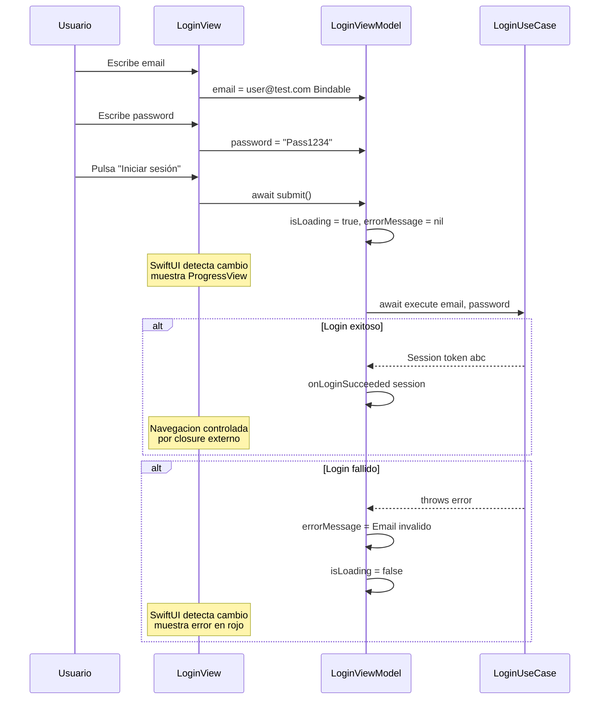
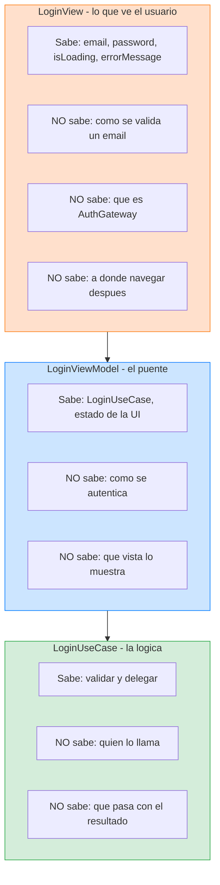
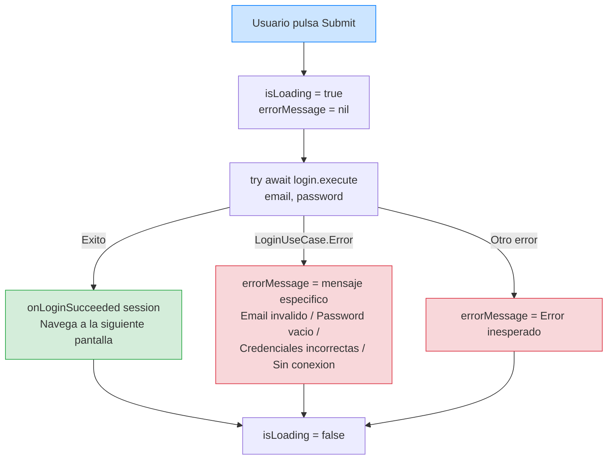
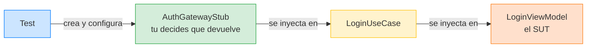

# Feature Login: Capa Interface (SwiftUI)

## La última capa: donde el usuario ve y toca

Hemos construido las tres capas internas de la feature Login: el Domain con sus Value Objects y errores tipados, la Application con el caso de uso y el puerto, y la Infrastructure con el gateway real y el stub. Todo testeado con XCTest, todo desacoplado, todo siguiendo los escenarios BDD.

Ahora llegamos a la capa más externa: la Interface. Esta es la capa que el usuario ve y con la que interactúa. Contiene dos componentes: el **ViewModel** que adapta los datos del caso de uso al formato que la UI necesita, y la **Vista SwiftUI** que muestra esos datos y recoge las acciones del usuario.

La regla fundamental de esta capa es: **no contiene lógica de negocio**. La vista no valida emails. No decide si el login fue exitoso. No traduce errores. Solo muestra lo que el ViewModel le dice y envía las acciones del usuario al ViewModel. Es la capa más "tonta" del sistema, y eso es exactamente lo que queremos.

### Recordatorio de principios

Aquí reaparece el **Principio 4** de [Principios de ingeniería](../01-principios-ingenieria.md): la UI se mantiene cohesionada en presentación y desacoplada del core de negocio.

---

## Diagrama: cómo fluyen los datos entre Vista y ViewModel



La vista **no sabe nada** de `LoginUseCase`, ni de `AuthGateway`, ni de `Email`, ni de `Password`. Solo conoce strings (`email`, `password`, `errorMessage`) y booleans (`isLoading`). **Esa es la separación de responsabilidades en acción.**

### Diagrama: qué sabe cada componente



---

## El LoginViewModel

El ViewModel es el puente entre el caso de uso y la vista. Su responsabilidad es triple: almacenar el estado que la vista necesita mostrar (email, password, loading, error), invocar el caso de uso cuando el usuario pulsa el botón, y traducir el resultado del caso de uso a un formato que la vista pueda mostrar directamente (strings de error, flags booleanos).

```swift
// StackMyArchitecture/Features/Login/Interface/LoginViewModel.swift

import SwiftUI

@Observable
@MainActor
final class LoginViewModel {
    var email = ""
    var password = ""
    var isLoading = false
    var errorMessage: String?
    
    private let login: LoginUseCase
    private let onLoginSucceeded: @MainActor (Session) -> Void
    
    init(
        login: LoginUseCase,
        onLoginSucceeded: @MainActor @escaping (Session) -> Void
    ) {
        self.login = login
        self.onLoginSucceeded = onLoginSucceeded
    }
    
    func submit() async {
        isLoading = true
        errorMessage = nil
        
        do {
            let session = try await login.execute(email: email, password: password)
            onLoginSucceeded(session)
        } catch let error as LoginUseCase.Error {
            errorMessage = Self.message(for: error)
        } catch {
            errorMessage = "Error inesperado. Inténtalo de nuevo."
        }
        
        isLoading = false
    }
    
    private static func message(for error: LoginUseCase.Error) -> String {
        switch error {
        case .invalidEmail:
            return "El email no tiene un formato válido."
        case .emptyPassword:
            return "La contraseña no puede estar vacía."
        case .invalidCredentials:
            return "Email o contraseña incorrectos."
        case .connectivity:
            return "Sin conexión a internet. Inténtalo de nuevo."
        }
    }
}
```

**Explicación línea por línea del LoginViewModel completo:**

`import SwiftUI` — Necesitamos SwiftUI porque el ViewModel usa la macro `@Observable` que pertenece al framework Observation (parte de SwiftUI). Este es el único archivo de la feature Login que importa SwiftUI (aparte de la vista). El Domain, la Application, y la Infrastructure no importan SwiftUI.

`@Observable` — Esta macro de Swift 5.9 le dice a SwiftUI: "observa las propiedades de este objeto y cuando alguna cambie, actualiza las partes de la vista que la leen". Sin `@Observable`, SwiftUI no sabría cuándo re-renderizar la vista. Con `@Observable`, SwiftUI detecta automáticamente qué propiedad leyó cada parte de la vista, y solo actualiza esa parte cuando esa propiedad cambia. Es mucho más eficiente que el antiguo `ObservableObject` + `@Published`.

`@MainActor` — Esto garantiza que **todo el código de esta clase** se ejecuta en el hilo principal (main thread). ¿Por qué es necesario? Porque las propiedades del ViewModel (`email`, `password`, `isLoading`, `errorMessage`) son leídas por SwiftUI para renderizar la vista. SwiftUI exige que las mutaciones de estado de UI ocurran en el main thread. Si cambiaras `isLoading` desde un hilo de background, la app podría crashear o mostrar datos corruptos. `@MainActor` previene eso automáticamente.

`final class` — Usamos `class` (no `struct`) porque: (1) `@Observable` solo funciona con clases, y (2) el ViewModel tiene identidad (es un objeto único que la vista observa, no un valor que se copia). `final` significa que nadie puede heredar de esta clase.

`var email = ""` — El email que el usuario escribe en el TextField. Es `var` (mutable) porque SwiftUI lo modifica a través de bindings cuando el usuario teclea. Empieza vacío.

`var password = ""` — Lo mismo para el password.

`var isLoading = false` — Indica si hay una petición en curso. Cuando es `true`, la vista muestra un spinner y deshabilita el botón. Empieza en `false` porque cuando abres la pantalla, no hay ninguna petición en curso.

`var errorMessage: String?` — El mensaje de error que se muestra al usuario. Es `Optional` (`String?`) porque la mayor parte del tiempo no hay error (es `nil`). Solo tiene valor cuando algo falla.

`private let login: LoginUseCase` — La dependencia del UseCase. Es `private` porque nadie fuera del ViewModel necesita acceder al UseCase. Es `let` (constante) porque no cambia después de la creación.

`private let onLoginSucceeded: @MainActor (Session) -> Void` — El closure que se llama cuando el login es exitoso. El ViewModel no sabe qué hace este closure. Solo sabe que debe llamarlo con la sesión. En la app real, el Composition Root le inyecta un closure que navega a la siguiente pantalla. En los tests, le inyecta un closure que captura la sesión para verificarla.

**El método `submit()` paso a paso:**



`isLoading = true` — Lo primero que hace submit: pone el loading en true. SwiftUI detecta el cambio y muestra el spinner automáticamente.

`errorMessage = nil` — Limpia cualquier error previo. Si el usuario vio "Email inválido", corrigió el email, y volvió a pulsar submit, no queremos que el error anterior siga visible mientras se procesa la nueva petición.

`do { let session = try await login.execute(...) }` — Ejecuta el UseCase. `try` porque puede lanzar errores. `await` porque es asíncrono (el UseCase llama al gateway que simula una petición de red). Si todo va bien, `session` contiene la sesión del servidor.

`onLoginSucceeded(session)` — Si llegamos aquí, el login fue exitoso. Llamamos al closure para notificar al exterior. El Composition Root decidirá qué hacer (normalmente, navegar a Home).

`catch let error as LoginUseCase.Error` — Si el UseCase lanzó un error, lo capturamos y verificamos si es un `LoginUseCase.Error` (un error conocido y tipado). `as` intenta convertir el error genérico al tipo específico. Si la conversión funciona, entramos en este bloque.

`Self.message(for: error)` — Traducimos el error de negocio a un string legible por humanos. `Self` (con S mayúscula) se refiere al tipo `LoginViewModel`, no a la instancia `self`.

`catch { errorMessage = "Error inesperado..." }` — Si el error NO es un `LoginUseCase.Error` (por ejemplo, un error del sistema que no anticipamos), mostramos un mensaje genérico. Este `catch` sin tipo es el "catch-all" de Swift: captura cualquier error que no fue capturado por los `catch` anteriores.

`isLoading = false` — Siempre, sin importar si el login fue exitoso o falló, ponemos isLoading en false. El spinner desaparece. Fíjate en que esta línea está **fuera** del `do/catch`, así que se ejecuta en todos los casos.

Vamos a analizar cada decisión de diseño:

### Por qué `@Observable` y no `ObservableObject`

`@Observable` es la macro introducida en Swift 5.9 (iOS 17) que reemplaza al protocolo `ObservableObject` con `@Published`. La diferencia principal es la granularidad de las actualizaciones. Con `ObservableObject`, cualquier cambio en cualquier `@Published` property invalida todas las vistas que observan el objeto, aunque solo una propiedad haya cambiado. Con `@Observable`, SwiftUI sabe exactamente qué propiedad leyó cada vista, y solo invalida las vistas que leen la propiedad que cambió.

En nuestro caso, si solo cambia `isLoading`, solo se re-renderiza la parte de la vista que lee `isLoading`. El `TextField` del email no se toca porque no lee `isLoading`. Esto es más eficiente, pero sobre todo es el enfoque moderno que Apple recomienda. No hay razón para usar `ObservableObject` en código nuevo.

### Por qué `@MainActor`

El ViewModel muta propiedades (`email`, `password`, `isLoading`, `errorMessage`) que SwiftUI observa. SwiftUI requiere que las mutaciones de estado que afectan a la UI ocurran en el hilo principal. Si mutas `isLoading` desde un hilo de background, SwiftUI puede crashear o comportarse de forma errática.

`@MainActor` garantiza que todas las mutaciones del ViewModel ocurren en el main thread. No necesitas hacer `DispatchQueue.main.async` manualmente. Swift Concurrency se encarga de ejecutar el código del ViewModel en el main actor automáticamente.

Recuerda la regla del curso: `@MainActor` está justificado aquí porque el ViewModel genuinamente necesita ejecutarse en el main thread (muta estado de UI). No lo estamos usando para silenciar warnings.

### Por qué `onLoginSucceeded` es un closure

Cuando el login es exitoso, el ViewModel llama a `onLoginSucceeded(session)`. Este closure no lo define el ViewModel; se lo inyecta el Composition Root. El ViewModel no sabe qué pasa después del login. No sabe que se navega a Home. No sabe nada de navegación. Solo dice "el login fue exitoso, aquí tienes la sesión" y otro componente decide qué hacer.

Esto es la navegación por eventos que describimos en las lecciones de fundamentos. La feature Login es completamente independiente de lo que ocurre después. Si mañana quieres que después del login se vaya a una pantalla de onboarding en lugar de Home, cambias el closure en el Composition Root. Login no se entera.

### Por qué la traducción de errores a strings está en el ViewModel

El método `message(for:)` traduce cada caso de `LoginUseCase.Error` a un string legible por el usuario. Esta traducción vive en el ViewModel porque es una responsabilidad de **presentación**, no de negocio. El Domain sabe que las credenciales son inválidas. La Application sabe que eso es un `LoginUseCase.Error.invalidCredentials`. Pero el texto "Email o contraseña incorrectos." es un detalle de presentación que solo le importa a la UI.

Si el día de mañana necesitas localizar la app a otros idiomas, solo cambias estos strings en el ViewModel (o los mueves a un sistema de localización). Ni el Domain ni la Application cambian.

---

## La LoginView

La vista SwiftUI es el componente más simple de toda la feature. No tiene lógica. Solo layout y bindings.

```swift
// StackMyArchitecture/Features/Login/Interface/LoginView.swift

import SwiftUI

struct LoginView: View {
    @State private var viewModel: LoginViewModel
    
    init(viewModel: LoginViewModel) {
        _viewModel = State(wrappedValue: viewModel)
    }
    
    var body: some View {
        Form {
            Section {
                TextField("Email", text: $viewModel.email)
                    .textContentType(.emailAddress)
                    .autocorrectionDisabled()
                    .textInputAutocapitalization(.never)
                    .keyboardType(.emailAddress)
                
                SecureField("Contraseña", text: $viewModel.password)
                    .textContentType(.password)
            }
            
            if let error = viewModel.errorMessage {
                Section {
                    Text(error)
                        .foregroundStyle(.red)
                        .font(.callout)
                }
            }
            
            Section {
                Button {
                    Task { await viewModel.submit() }
                } label: {
                    if viewModel.isLoading {
                        ProgressView()
                            .frame(maxWidth: .infinity)
                    } else {
                        Text("Iniciar sesión")
                            .frame(maxWidth: .infinity)
                    }
                }
                .disabled(viewModel.isLoading || viewModel.email.isEmpty || viewModel.password.isEmpty)
            }
        }
        .navigationTitle("Login")
    }
}
```

Vamos a repasar cada parte:

**Los TextFields.** El `TextField` del email tiene configuraciones que mejoran la experiencia del usuario: `textContentType(.emailAddress)` activa el autocompletado del teclado, `textInputAutocapitalization(.never)` desactiva la mayúscula inicial (los emails no empiezan por mayúscula), y `keyboardType(.emailAddress)` muestra el teclado con arroba. El `SecureField` oculta los caracteres del password. Estos son detalles de UX que no afectan a la lógica, pero que hacen la diferencia entre una app amateur y una profesional.

**El binding.** `$viewModel.email` y `$viewModel.password` son bindings bidireccionales: cuando el usuario escribe, el ViewModel se actualiza automáticamente, y cuando el ViewModel cambia (por ejemplo, al limpiar un error), la vista se actualiza también. Esto es la magia de SwiftUI + `@Observable`: el flujo de datos es declarativo y automático.

**El manejo de errores.** Si `viewModel.errorMessage` no es `nil`, se muestra un texto rojo. Cuando el usuario pulsa submit de nuevo, el ViewModel limpia el error (`errorMessage = nil`) antes de hacer la llamada. Si la llamada falla, se muestra el nuevo error.

**El botón de submit.** El botón lanza un `Task` que ejecuta `viewModel.submit()`. ¿Por qué un `Task`? Porque `submit()` es `async` (hace una petición de red a través del caso de uso), pero el closure del `Button` es síncrono. El `Task` crea un contexto async dentro del closure síncrono. El botón se deshabilita cuando `isLoading` es `true` para evitar que el usuario pulse dos veces.

**El `@State` wrapping del ViewModel.** Fíjate en que el ViewModel se declara como `@State private var viewModel`. Esto es necesario porque con `@Observable`, SwiftUI necesita "poseer" el objeto para observar sus cambios. El `init` recibe el ViewModel y lo envuelve en `State`. Esta es la forma idiomática de inyectar un `@Observable` ViewModel en una vista SwiftUI.

---

## Tests del ViewModel

El ViewModel se puede testear sin UI, sin SwiftUI, sin renderizar nada. Solo necesitamos un stub del caso de uso y verificar que el ViewModel actualiza su estado correctamente.

Pero hay un detalle: el ViewModel depende de `LoginUseCase`, que es un struct (no un protocolo). ¿Cómo lo stubbeamos? No necesitamos stubear el UseCase directamente. `LoginUseCase` depende de `AuthGateway` (que sí es un protocolo), así que inyectamos un `AuthGatewayStub` en el caso de uso y controlamos el comportamiento desde ahí. Es como una cadena: controlamos el stub del gateway, el gateway controla lo que hace el UseCase, y el UseCase controla lo que hace el ViewModel.



```swift
// StackMyArchitectureTests/Features/Login/Interface/LoginViewModelTests.swift

import XCTest
@testable import StackMyArchitecture

@MainActor
final class LoginViewModelTests: XCTestCase {
    
    // MARK: - Helpers
    
    private func makeSUT(
        gatewayResult: Result<Session, AuthError> = .success(Session(token: "t", email: "e")),
        onLoginSucceeded: @MainActor @escaping (Session) -> Void = { _ in }
    ) -> (sut: LoginViewModel, gateway: AuthGatewayStub) {
        let gateway = AuthGatewayStub(result: gatewayResult)
        let useCase = LoginUseCase(authGateway: gateway)
        let sut = LoginViewModel(login: useCase, onLoginSucceeded: onLoginSucceeded)
        return (sut, gateway)
    }
```

**Explicación del makeSUT del ViewModel:**

`@MainActor final class LoginViewModelTests` — Toda la clase de tests está marcada con `@MainActor`. ¿Por qué? Porque el ViewModel que testeamos es `@MainActor`, y para acceder a sus propiedades necesitamos estar en el mismo actor. Sin este atributo, los tests no compilarían.

`gatewayResult: Result<Session, AuthError> = .success(...)` — El primer parámetro del makeSUT te permite configurar qué devuelve el gateway. Si no pasas nada, devuelve éxito por defecto. Esto simplifica los tests que no se preocupan por el resultado del gateway (como el test del estado inicial).

`onLoginSucceeded: @MainActor @escaping (Session) -> Void = { _ in }` — El segundo parámetro es el closure que se llama cuando el login es exitoso. Por defecto es un closure vacío que ignora la sesión (`{ _ in }` significa "recibe algo pero no hago nada con ello"). En el test del happy path, lo sustituiremos por un closure que captura la sesión para verificarla.

Dentro de makeSUT, se crean los tres componentes en cadena: stub → useCase → viewModel. Cada uno se inyecta en el siguiente.

```swift
    // MARK: - Initial State
    
    func test_init_starts_with_empty_fields_and_no_error() {
        let (sut, _) = makeSUT()
        
        XCTAssertEqual(sut.email, "")
        XCTAssertEqual(sut.password, "")
        XCTAssertFalse(sut.isLoading)
        XCTAssertNil(sut.errorMessage)
    }
```

**Explicación del test de estado inicial:**

Este test verifica que cuando creas un ViewModel nuevo, su estado es correcto: email vacío, password vacío, no está cargando, y no hay ningún mensaje de error. Parece trivial, pero documenta un requisito: "cuando el usuario abre la pantalla de Login, no debe ver ningún error ni estado de carga". Si alguien cambiara accidentalmente el valor inicial de `isLoading` a `true`, este test lo detectaría inmediatamente.

`let (sut, _) = makeSUT()` — Creamos el ViewModel. El `_` descarta el gateway porque en este test no nos importa (no vamos a llamar a submit, así que el gateway no se usa). Usamos los valores por defecto de makeSUT.

`XCTAssertFalse(sut.isLoading)` — Verifica que `isLoading` es `false`. Es como `XCTAssertEqual(sut.isLoading, false)` pero más legible.

`XCTAssertNil(sut.errorMessage)` — Verifica que no hay ningún mensaje de error. `nil` en Swift significa "no tiene valor" o "está vacío".

```swift
    // MARK: - Happy Path
    
    func test_submit_with_valid_credentials_calls_onLoginSucceeded() async {
        let expectedSession = Session(token: "abc", email: "user@example.com")
        var receivedSession: Session?
        let (sut, _) = makeSUT(
            gatewayResult: .success(expectedSession),
            onLoginSucceeded: { receivedSession = $0 }
        )
        sut.email = "user@example.com"
        sut.password = "pass123"
        
        await sut.submit()
        
        XCTAssertEqual(receivedSession, expectedSession)
        XCTAssertNil(sut.errorMessage)
    }
```

**Explicación del test del happy path (el más interesante):**

Este test verifica que cuando el usuario escribe credenciales válidas y pulsa submit, el ViewModel llama al closure `onLoginSucceeded` con la sesión correcta.

`var receivedSession: Session?` — Creamos una variable que actuará como **trampa** para capturar la sesión. Empieza en `nil`. Si el closure se ejecuta, dejará de ser `nil`.

`onLoginSucceeded: { receivedSession = $0 }` — Este closure es la trampa: cuando el ViewModel lo llame, guardará la sesión recibida en `receivedSession`. `$0` es la forma abreviada de Swift para referirse al primer parámetro del closure (la sesión). Es equivalente a escribir `{ session in receivedSession = session }`.

**¿Por qué usamos un closure como trampa en vez de un spy?** Porque `onLoginSucceeded` no es un protocolo — es un closure inyectado. No podemos crear un "spy de closure", pero podemos crear un closure que captura una variable local. Es la misma idea: registrar lo que se recibió para verificarlo después.

`sut.email = "user@example.com"` y `sut.password = "pass123"` — Simulamos que el usuario escribió en los campos de texto. En la app real, esto lo haría SwiftUI a través de los bindings. En el test, lo hacemos directamente.

`await sut.submit()` — Ejecutamos el submit. Usamos `await` porque `submit()` es `async`. El test espera a que termine toda la ejecución (incluyendo la llamada al UseCase y al gateway stub) antes de continuar.

`XCTAssertEqual(receivedSession, expectedSession)` — Verificamos que la trampa capturó la sesión correcta. Si `receivedSession` sigue siendo `nil`, significa que el closure nunca se ejecutó (lo cual sería un bug). Si contiene una sesión diferente, también es un bug.

`XCTAssertNil(sut.errorMessage)` — Verificamos que no hay mensaje de error. En el happy path, todo sale bien, así que no debería haber error.

```swift
    // MARK: - Error Display
    
    func test_submit_with_invalid_email_shows_email_error_message() async {
        let (sut, _) = makeSUT()
        sut.email = "invalid"
        sut.password = "pass123"
        
        await sut.submit()
        
        XCTAssertEqual(sut.errorMessage, "El email no tiene un formato válido.")
    }
```

**Explicación del test de error de email:**

Este test verifica un sad path: cuando el usuario escribe un email sin arroba y pulsa submit, el ViewModel muestra un mensaje de error específico.

`sut.email = "invalid"` — Simulamos un email sin arroba. El Value Object `Email` rechazará este string.

Fíjate en que **no configuramos el gateway para que falle**. Usamos el gateway por defecto (que devuelve éxito). ¿Por qué? Porque el error ocurre **antes** de llegar al gateway. El UseCase intenta crear un `Email` con "invalid", el `Email` lanza `ValidationError.invalidFormat`, el UseCase lo traduce a `LoginUseCase.Error.invalidEmail`, y el ViewModel lo traduce al string "El email no tiene un formato válido." El gateway ni se entera porque nunca se llega a llamar.

`XCTAssertEqual(sut.errorMessage, "El email no tiene un formato válido.")` — Verificamos que el ViewModel tradujo el error al mensaje correcto. Si el mensaje fuera diferente (un typo, por ejemplo), el test fallaría.

```swift
    func test_submit_with_empty_password_shows_password_error_message() async {
        let (sut, _) = makeSUT()
        sut.email = "user@example.com"
        sut.password = ""
        
        await sut.submit()
        
        XCTAssertEqual(sut.errorMessage, "La contraseña no puede estar vacía.")
    }
    
    func test_submit_with_rejected_credentials_shows_credentials_error() async {
        let (sut, _) = makeSUT(gatewayResult: .failure(.invalidCredentials))
        sut.email = "user@example.com"
        sut.password = "wrong"
        
        await sut.submit()
        
        XCTAssertEqual(sut.errorMessage, "Email o contraseña incorrectos.")
    }
    
    func test_submit_with_connectivity_error_shows_connectivity_message() async {
        let (sut, _) = makeSUT(gatewayResult: .failure(.connectivity))
        sut.email = "user@example.com"
        sut.password = "pass123"
        
        await sut.submit()
        
        XCTAssertEqual(sut.errorMessage, "Sin conexión a internet. Inténtalo de nuevo.")
    }
    
    // MARK: - Loading State
    
    func test_submit_sets_isLoading_to_false_after_completion() async {
        let (sut, _) = makeSUT()
        sut.email = "user@example.com"
        sut.password = "pass123"
        
        await sut.submit()
        
        XCTAssertFalse(sut.isLoading)
    }
    
    // MARK: - Error Clearing
    
    func test_submit_clears_previous_error_before_new_attempt() async {
        let (sut, _) = makeSUT(gatewayResult: .failure(.invalidCredentials))
        sut.email = "user@example.com"
        sut.password = "wrong"
        
        await sut.submit()
        XCTAssertNotNil(sut.errorMessage)
        
        // Second attempt - error should be cleared at the start
        sut.password = "correct"
        // We can't easily test the intermediate state (isLoading=true, errorMessage=nil)
        // but we test that after completion the error reflects the new result
        await sut.submit()
        XCTAssertEqual(sut.errorMessage, "Email o contraseña incorrectos.")
    }
}
```

Fíjate en que los tests del ViewModel son `@MainActor`. Esto es necesario porque el ViewModel es `@MainActor`, así que todas las interacciones con él deben ocurrir en el main actor. Los tests `async` de XCTest soportan esto correctamente.

Los tests verifican:

Que el estado inicial es correcto (campos vacíos, no loading, sin error). Que un login exitoso llama al closure `onLoginSucceeded` con la sesión correcta. Que cada tipo de error se traduce al mensaje correcto en español. Que `isLoading` vuelve a `false` después de completar. Que el error anterior se limpia al intentar de nuevo.

---

## La Preview con Stub

Una de las grandes ventajas de nuestra arquitectura es que las previews de SwiftUI funcionan sin servidor, sin red, y de forma instantánea. Esto es posible porque podemos inyectar el `StubAuthGateway` en lugar del gateway real:

```swift
// StackMyArchitecture/Features/Login/Interface/LoginView+Preview.swift

#Preview("Login - Happy Path") {
    NavigationStack {
        LoginView(
            viewModel: LoginViewModel(
                login: LoginUseCase(
                    authGateway: StubAuthGateway(delayNanoseconds: 1_000_000_000)
                ),
                onLoginSucceeded: { session in
                    print("Preview: login exitoso con \(session.email)")
                }
            )
        )
    }
}
```

El stub tiene un delay de 1 segundo para que puedas ver el estado de loading en la preview. Si quieres probar el estado de error, puedes crear un stub que siempre falle:

```swift
struct FailingAuthGateway: AuthGateway, Sendable {
    func authenticate(credentials: Credentials) async throws -> Session {
        try await Task.sleep(nanoseconds: 500_000_000)
        throw AuthError.invalidCredentials
    }
}

#Preview("Login - Error") {
    NavigationStack {
        LoginView(
            viewModel: LoginViewModel(
                login: LoginUseCase(authGateway: FailingAuthGateway()),
                onLoginSucceeded: { _ in }
            )
        )
    }
}
```

Esto te permite ver cómo se ve la pantalla de login con un mensaje de error sin necesidad de tener un servidor real que rechace credenciales. Las previews son una herramienta de desarrollo, y con nuestra arquitectura, son extremadamente potentes.

---

## El Composition Root: ensamblando todo

Ahora que tenemos todas las piezas, veamos cómo el Composition Root las conecta:

```swift
// StackMyArchitecture/App/CompositionRoot.swift

import SwiftUI

@MainActor
struct CompositionRoot {
    
    func makeLoginView(
        onLoginSucceeded: @MainActor @escaping (Session) -> Void
    ) -> LoginView {
        let httpClient = URLSessionHTTPClient()
        let baseURL = URL(string: "https://api.example.com")!
        let gateway = RemoteAuthGateway(httpClient: httpClient, baseURL: baseURL)
        let useCase = LoginUseCase(authGateway: gateway)
        let viewModel = LoginViewModel(
            login: useCase,
            onLoginSucceeded: onLoginSucceeded
        )
        return LoginView(viewModel: viewModel)
    }
}
```

El Composition Root es el **único lugar** que conoce las implementaciones concretas. Es el único que sabe que `AuthGateway` se implementa con `RemoteAuthGateway`, que `HTTPClient` se implementa con `URLSessionHTTPClient`, y que la URL del servidor es `https://api.example.com`.

Si quieres cambiar a un stub para desarrollo local, cambias una línea:

```swift
// Para desarrollo sin servidor:
let gateway = StubAuthGateway()
```

Si quieres apuntar a staging:

```swift
let baseURL = URL(string: "https://staging.example.com")!
```

Ningún otro archivo del proyecto cambia. Eso es inversión de dependencias en acción.

### Cómo se usa en la App principal

```swift
// StackMyArchitecture/App/StackMyArchitectureApp.swift

import SwiftUI

@main
struct StackMyArchitectureApp: App {
    private let compositionRoot = CompositionRoot()
    
    var body: some Scene {
        WindowGroup {
            NavigationStack {
                compositionRoot.makeLoginView { session in
                    print("Login exitoso: \(session.email)")
                    // Aquí el coordinador navegaría a Home
                }
            }
        }
    }
}
```

En la Etapa 2, cuando tengamos un coordinador de navegación, el closure `onLoginSucceeded` no hará un simple `print`: le dirá al coordinador que navegue a la siguiente pantalla. Pero por ahora, esto es suficiente para verificar que todo el flujo funciona de punta a punta.

---

## El flujo completo de un login exitoso

Para que veas cómo todas las capas trabajan juntas, vamos a trazar el flujo completo de un login exitoso, desde que el usuario pulsa el botón hasta que ve el resultado:

1. El usuario escribe "user@example.com" en el TextField de email y "pass123" en el SecureField de password.

2. El usuario pulsa el botón "Iniciar sesión". El botón crea un `Task` que llama a `viewModel.submit()`.

3. El ViewModel pone `isLoading = true` y `errorMessage = nil`. SwiftUI detecta el cambio y re-renderiza: el botón muestra un `ProgressView` en lugar del texto, y el mensaje de error anterior (si había uno) desaparece.

4. El ViewModel llama a `login.execute(email: "user@example.com", password: "pass123")`.

5. El `LoginUseCase` intenta crear un `Email("user@example.com")`. El Value Object valida el formato: tiene arroba, tiene punto en el dominio. Es válido. Se crea el `Email`.

6. El `LoginUseCase` intenta crear un `Password("pass123")`. El Value Object verifica que no está vacío. No lo está. Se crea el `Password`.

7. El `LoginUseCase` crea un `Credentials(email: email, password: password)`.

8. El `LoginUseCase` llama a `authGateway.authenticate(credentials: credentials)`. En producción, esto llega al `RemoteAuthGateway`.

9. El `RemoteAuthGateway` construye un `URLRequest` con método POST, URL `https://api.example.com/auth/login`, header `Content-Type: application/json`, y body `{"email":"user@example.com","password":"pass123"}`.

10. El `RemoteAuthGateway` llama a `httpClient.execute(request)`. La petición HTTP viaja al servidor.

11. El servidor verifica las credenciales, genera un token, y responde con status 200 y body `{"token":"abc-123","email":"user@example.com"}`.

12. El `RemoteAuthGateway` recibe la respuesta. Status code 200: OK. Parsea el JSON con `JSONDecoder`. Extrae el token. Crea y devuelve `Session(token: "abc-123", email: "user@example.com")`.

13. El `LoginUseCase` recibe la `Session` del gateway y la devuelve al llamante (el ViewModel).

14. El ViewModel recibe la `Session`. Llama a `onLoginSucceeded(session)`, que es el closure que el Composition Root inyectó. En producción, esto le dirá al coordinador que navegue a Home.

15. El ViewModel pone `isLoading = false`. SwiftUI detecta el cambio y re-renderiza: el botón vuelve a mostrar "Iniciar sesión" en lugar del `ProgressView`.

Trece componentes involucrados (usuario, vista, viewmodel, caso de uso, email VO, password VO, credentials, gateway, http client, request DTO, response DTO, session, closure de navegación), pero cada uno con una responsabilidad clara y bien definida. Si cualquiera de ellos falla, sabes exactamente dónde mirar porque cada capa tiene sus propios tests.

---

## Reflexión: la feature completa

Con esta lección hemos completado la implementación de la feature Login de punta a punta. Repasemos lo que tenemos:

**Domain:** Value Objects `Email` y `Password` con validación en construcción. `Credentials`, `Session`, `AuthError`, `LoginEvent`. Tests XCTest para los Value Objects.

**Application:** Protocolo `AuthGateway` (el puerto). `LoginUseCase` que orquesta validación local, delegación al gateway, y traducción de errores. Tests XCTest con stub para todos los escenarios BDD.

**Infrastructure:** `RemoteAuthGateway` que implementa el puerto con HTTP/JSON. `StubAuthGateway` para desarrollo sin servidor. DTOs separados. Protocolo `HTTPClient`. Tests de contrato XCTest.

**Interface:** `LoginViewModel` con `@Observable` y `@MainActor`. `LoginView` en SwiftUI. Tests XCTest del ViewModel. Previews funcionales con stub.

**Composition Root:** Ensamblaje de todas las piezas con inyección de dependencias.

Todo conectado, todo testeado, todo desacoplado. La feature es una unidad vertical completa que se puede desarrollar, testear, y mantener de forma independiente.

En la siguiente lección haremos un resumen del ciclo TDD completo que acabamos de vivir, consolidando las lecciones aprendidas.

---

**Anterior:** [Infrastructure ←](03-infrastructure.md) · **Siguiente:** [TDD: ciclo completo →](05-tdd-ciclo-completo.md)
