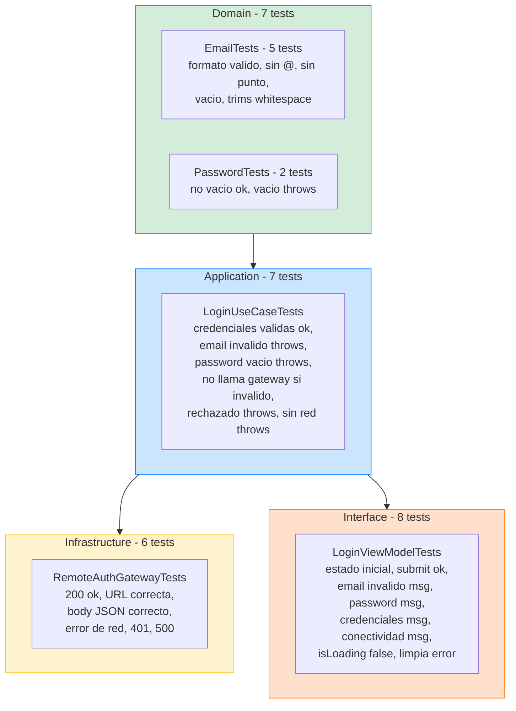
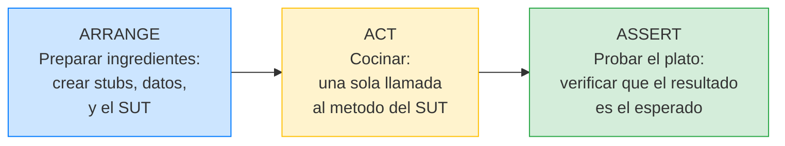

# Feature Login: Retrospectiva del ciclo TDD completo

## Mirando hacia atrás para consolidar lo aprendido

A lo largo de las últimas cuatro lecciones hemos implementado la feature Login completa, capa por capa, test por test. Ahora vamos a hacer algo que en el mundo profesional es fundamental pero que los tutoriales casi nunca hacen: una retrospectiva. Vamos a mirar hacia atrás, analizar el proceso que seguimos, identificar los patrones que emergieron, y extraer las lecciones que nos servirán para todas las features futuras del curso.

Esta lección no tiene código nuevo. Es una lección de reflexión y consolidación. Si te la saltas, los siguientes capítulos funcionarán igual, pero entenderás menos el "por qué" detrás de cada decisión.

---

### Diagrama: mapa de tests por capa de la feature Login



**Total: 28 tests** para una sola feature. Todos se ejecutan en menos de 1 segundo.

---

## El mapa completo de tests que escribimos

Antes de reflexionar, pongamos sobre la mesa todo lo que hemos construido. Estos son todos los tests XCTest de la feature Login, organizados por capa:

### Tests de Domain (Value Objects)

```
EmailTests
├── test_init_with_valid_email_creates_email_successfully
├── test_init_with_string_without_at_sign_throws_invalidFormat
├── test_init_with_email_without_domain_dot_throws_invalidFormat
├── test_init_with_empty_string_throws_invalidFormat
└── test_init_trims_whitespace_from_valid_email

PasswordTests
├── test_init_with_non_empty_string_creates_password_successfully
└── test_init_with_empty_string_throws_empty
```

Siete tests. Se ejecutan en milisegundos. No necesitan simulador, ni red, ni base de datos. Son los tests más rápidos y más estables de todo el proyecto. Si fallan, sabes exactamente dónde está el problema: en la validación de un Value Object.

### Tests de Application (Caso de uso)

```
LoginUseCaseTests
├── test_execute_with_valid_credentials_returns_session
├── test_execute_sends_validated_credentials_to_gateway
├── test_execute_with_invalid_email_throws_invalidEmail
├── test_execute_with_empty_password_throws_emptyPassword
├── test_execute_with_invalid_email_does_not_call_gateway
├── test_execute_with_rejected_credentials_throws_invalidCredentials
└── test_execute_without_connectivity_throws_connectivity
```

Siete tests. También rápidos (usan un stub, no hacen red real). Verifican que el caso de uso orquesta correctamente: valida con Value Objects, delega al gateway, traduce errores. Si fallan, el problema está en la lógica de orquestación.

### Tests de Infrastructure (Gateway)

```
RemoteAuthGatewayTests
├── test_authenticate_on_200_with_valid_json_returns_session
├── test_authenticate_sends_post_to_correct_url
├── test_authenticate_sends_credentials_as_json_body
├── test_authenticate_on_network_error_throws_connectivity
├── test_authenticate_on_401_throws_invalidCredentials
└── test_authenticate_on_500_throws_invalidCredentials
```

Seis tests. Usan un stub de HTTPClient. Verifican el mapping entre HTTP/JSON y los tipos del Domain. Si fallan, el problema está en la serialización, el parsing, o la traducción de status codes.

### Tests de Interface (ViewModel)

```
LoginViewModelTests
├── test_init_starts_with_empty_fields_and_no_error
├── test_submit_with_valid_credentials_calls_onLoginSucceeded
├── test_submit_with_invalid_email_shows_email_error_message
├── test_submit_with_empty_password_shows_password_error_message
├── test_submit_with_rejected_credentials_shows_credentials_error
├── test_submit_with_connectivity_error_shows_connectivity_message
├── test_submit_sets_isLoading_to_false_after_completion
└── test_submit_clears_previous_error_before_new_attempt
```

Ocho tests. Verifican que el ViewModel traduce correctamente el resultado del caso de uso a estado de UI.

**Total: 28 tests** para una feature. Todos se ejecutan en menos de un segundo. Todos son deterministas (no dependen de red, timing, ni estado global). Y cada uno cubre un escenario BDD específico o un comportamiento de presentación.

---

## Cómo el ciclo TDD guió el diseño

Si miras la secuencia en la que escribimos los tests y el código, verás un patrón claro: los tests no solo verificaron el código, sino que **guiaron las decisiones de diseño**.

### Los tests nos obligaron a crear el tipo `LoginUseCase.Error`

Cuando escribimos el test de email inválido en el `LoginUseCaseTests`, podríamos haber dejado que el error `Email.ValidationError.invalidFormat` se propagara directamente a la UI. El test habría pasado. Pero decidimos que el test pidiera un `LoginUseCase.Error.invalidEmail`, porque eso es lo que tiene sentido desde la perspectiva de la feature. Esa decisión nos obligó a crear el enum `LoginUseCase.Error` y a hacer traducción de errores.

Sin TDD, probablemente habríamos dejado que los errores internos se propagaran, y habríamos descubierto el problema de acoplamiento meses después cuando alguien cambiara la validación del email y la UI se rompiera.

### Los tests nos obligaron a verificar que el gateway no se invoca innecesariamente

El test `test_execute_with_invalid_email_does_not_call_gateway` verifica que cuando el email es inválido, el gateway nunca se llama. Este test no cambia el comportamiento del código (ya funcionaba así), pero documenta un requisito de negocio: no enviar peticiones al servidor cuando la validación local falla. Si alguien refactorizara el caso de uso y accidentalmente moviera la llamada al gateway antes de la validación, este test fallaría inmediatamente.

### Los tests definieron la interfaz pública antes de la implementación

Cuando escribimos el primer test del `LoginUseCase`, decidimos que la interfaz fuera `execute(email: String, password: String) async throws -> Session`. Esa decisión se tomó en el test, no en la implementación. Primero decidimos cómo queremos usar el componente (la perspectiva del consumidor), y después implementamos para satisfacer esa interfaz.

Esto es fundamentalmente diferente de escribir primero la implementación y luego los tests. Cuando escribes primero la implementación, tiendes a diseñar para la comodidad del implementador. Cuando escribes primero el test, diseñas para la comodidad del consumidor. Y en la mayoría de los casos, diseñar para el consumidor produce mejores interfaces.

---

## Patrones que emergieron en los tests

A lo largo de las cuatro capas de tests, emergieron varios patrones que usaremos repetidamente en el resto del curso:

### El patrón Arrange-Act-Assert (AAA)

Todos nuestros tests siguen la misma estructura de tres fases. Este patrón se llama **Arrange-Act-Assert** (o AAA) y es el estándar universal en testing de software. Piensa en ello como en una receta de cocina:



Veamos un ejemplo real anotado para que quede cristalino:

```swift
func test_execute_with_valid_credentials_returns_session() async throws {
    // ══════════════════════════════════════════════════════════════
    // ARRANGE (preparar el escenario)
    // ══════════════════════════════════════════════════════════════
    // 1. Creo la sesión que espero recibir como resultado
    let expectedSession = Session(token: "valid-token", email: "user@example.com")
    
    // 2. Creo el stub del gateway y lo configuro para que devuelva éxito
    //    Es como decirle a un actor: "cuando te pregunten, di esta frase"
    let gateway = AuthGatewayStub(result: .success(expectedSession))
    
    // 3. Creo el componente que quiero testear (SUT = System Under Test)
    //    Le inyecto el stub como si fuera el gateway real
    let sut = LoginUseCase(authGateway: gateway)
    
    // ══════════════════════════════════════════════════════════════
    // ACT (ejecutar la acción — siempre UNA sola línea)
    // ══════════════════════════════════════════════════════════════
    let session = try await sut.execute(email: "user@example.com", password: "pass123")
    
    // ══════════════════════════════════════════════════════════════
    // ASSERT (verificar el resultado)
    // ══════════════════════════════════════════════════════════════
    // Si session != expectedSession, el test falla con un mensaje claro
    XCTAssertEqual(session, expectedSession)
}
```

**¿Por qué siempre en este orden?** Porque cuando un test falla, necesitas entender rápidamente qué pasó. Si todos los tests siguen el mismo orden, sabes exactamente dónde mirar:

- ¿El error está en la preparación? Mira el ARRANGE.
- ¿La acción no se ejecutó como esperabas? Mira el ACT.
- ¿El resultado no es el correcto? Mira el ASSERT.

**¿Por qué el ACT es siempre UNA sola línea?** Porque si haces dos llamadas en el ACT, no sabes cuál de las dos causó el resultado. Un test debe verificar **una sola cosa**. Si necesitas verificar dos comportamientos diferentes, escribe dos tests separados.

### El patrón makeSUT

En cada archivo de tests, definimos un helper `makeSUT(...)` que crea el SUT con sus dependencias. Imagina que tienes 6 tests y cada uno necesita crear un `RemoteAuthGateway` con un `HTTPClientStub` y una URL base. Sin `makeSUT`, tendrías 6 veces el mismo bloque de 3 líneas. Con `makeSUT`, cada test llama a una sola función:

```swift
// SIN makeSUT (mucha repetición):
func test_1() {
    let client = HTTPClientStub(data: json, statusCode: 200)
    let sut = RemoteAuthGateway(httpClient: client, baseURL: url)  // repetido 6 veces
    // ...
}

// CON makeSUT (limpio y centralizado):
func test_1() {
    let (sut, client) = try makeSUT(data: json, statusCode: 200)  // 1 línea
    // ...
}
```

Tres beneficios concretos:

1. **Reduce duplicación** — cada test solo escribe lo que es único de su escenario.
2. **Centraliza la creación** — si el constructor del SUT cambia, solo cambias `makeSUT`.
3. **Hace los tests más legibles** — ves al instante qué es diferente en cada test.

### El patrón de stub configurable

Nuestros stubs (`AuthGatewayStub`, `HTTPClientStub`) se configuran **en el constructor** con el resultado que deben devolver:

```swift
// Quiero testear el caso feliz → configuro éxito
let stub = AuthGatewayStub(result: .success(session))

// Quiero testear un error → configuro fallo
let stub = AuthGatewayStub(result: .failure(.invalidCredentials))
```

Cada test crea su propio stub con su propia configuración. No hay estado compartido entre tests. Esto garantiza que cada test es **independiente**: puedes ejecutarlos en cualquier orden y el resultado es siempre el mismo.

### El patrón de spy (verificación de llamadas)

Nuestros stubs son en realidad **spies** (si leíste la guía de test doubles en la lección de Metodología BDD+TDD, ya sabes la diferencia): además de devolver datos configurados, **registran las llamadas que reciben**:

```swift
// El spy registra las credenciales que recibió:
gateway.receivedCredentials  // → las Credentials que el UseCase le pasó

// El spy del HTTP registra las peticiones:
client.receivedRequests      // → los URLRequest que el gateway envió
client.receivedRequests.first?.url       // → la URL de la petición
client.receivedRequests.first?.httpMethod // → "POST"
client.receivedRequests.first?.httpBody   // → el JSON del body
```

Esto nos permite verificar no solo **qué resultado** devuelve el SUT, sino **cómo interactúa** con sus dependencias. Por ejemplo, verificar que el UseCase NO llama al gateway cuando el email es inválido:

```swift
func test_execute_with_invalid_email_does_not_call_gateway() async {
    let gateway = AuthGatewayStub(result: .success(anySession))
    let sut = LoginUseCase(authGateway: gateway)
    
    _ = try? await sut.execute(email: "sin-arroba", password: "pass")
    
    // Si receivedCredentials sigue en nil, el gateway NUNCA fue llamado
    XCTAssertNil(gateway.receivedCredentials)
}
```

---

## Cuándo un test pasa sin cambiar código

En nuestro ciclo, varios tests pasaron sin necesidad de modificar el código de producción (tests 3, 4, 5 y 6 del `LoginUseCase`). ¿Eso significa que esos tests no tienen valor?

No. Un test que pasa sin cambiar código tiene valor **documental** y **protector**:

**Documental:** deja explícito un comportamiento que el negocio requiere. "El gateway no se invoca si el email es inválido" es un requisito de negocio que ahora está documentado como un test ejecutable. Si alguien que no conoce el proyecto lee los tests, entiende el requisito.

**Protector:** protege contra regresiones futuras. Hoy el código ya maneja el caso correctamente. Pero mañana alguien podría refactorizar el caso de uso y accidentalmente cambiar el orden de las operaciones. El test fallaría y capturaría la regresión antes de que llegue a producción.

Dicho esto, si escribes muchos tests que pasan sin cambiar código, probablemente estás siendo demasiado granular o estás testeando detalles de implementación en lugar de comportamiento. El balance ideal es: la mayoría de los tests requieren un cambio en el código, y unos pocos pasan por inercia pero documentan requisitos importantes.

---

## La pirámide de tests de esta feature

Si clasificamos nuestros 28 tests según la pirámide clásica de testing:

**Tests unitarios de Domain (7):** Los más rápidos, los más estables. Testean lógica pura sin dependencias. Son la base de la pirámide.

**Tests unitarios de Application (7):** Rápidos, usan stubs. Testean orquestación y traducción de errores.

**Tests de contrato de Infrastructure (6):** Rápidos (usan stubs de HTTP), pero verifican integración con formatos externos (JSON, HTTP status codes).

**Tests de presentación de Interface (8):** Rápidos, testean el ViewModel sin renderizar UI. Verifican traducción de resultado a estado visual.

No tenemos tests de integración end-to-end (que conecten todas las capas con un servidor real) ni tests de UI (que rendericen la vista y verifiquen pixels). Esos vendrán en las Etapas 2 y 3, cuando la app tenga más features y la complejidad lo justifique.

Por ahora, nuestra pirámide es ancha en la base (muchos tests unitarios rápidos) y vacía en la punta (sin tests end-to-end). Esto es correcto para una feature individual en desarrollo. Los tests end-to-end son más valiosos cuando hay integración entre features.

---

## Los errores más comunes que evitamos

A lo largo del desarrollo de esta feature, hay varios errores comunes que el proceso TDD nos ayudó a evitar:

**Testear la implementación en vez del comportamiento.** No testeamos que el `LoginUseCase` usa `Email` internamente. Testeamos que con un email inválido devuelve un error. Si mañana cambiamos la implementación interna (por ejemplo, validamos con regex en vez de con un Value Object), los tests siguen pasando porque verifican el comportamiento externo, no los detalles internos.

**Compartir estado entre tests.** Cada test crea su propio SUT y sus propios stubs. No hay propiedades compartidas que se mutan entre tests. Esto garantiza que cada test es independiente: puedes ejecutarlos en cualquier orden, puedes ejecutar uno solo, y el resultado siempre es el mismo.

**Testear demasiado o demasiado poco.** No testeamos que `Credentials` almacena sus propiedades (eso es trivial y no tiene valor). Sí testeamos que el `LoginUseCase` traduce errores (eso tiene comportamiento real con valor de negocio). El criterio es: si el código tiene una decisión (un `if`, un `switch`, un `catch`), probablemente merece un test. Si solo almacena datos, no.

**No testear los sad paths.** Es tentador escribir solo el test del happy path y considerar la feature "terminada". Pero los sad paths son donde viven los bugs de producción. Un login exitoso es sencillo; lo difícil es manejar correctamente todos los modos de fallo. Nuestros tests cubren 6 escenarios de error y solo 1 de éxito.

---

## Lo que aprendimos que aplicaremos a todas las features futuras

Estas son las lecciones que extraemos de la feature Login y que aplicaremos a cada feature que construyamos en el resto del curso:

**Empezar siempre por la especificación BDD.** Antes de abrir Xcode, definir todos los escenarios. Esto revela las decisiones de diseño antes de escribir código.

**Implementar de dentro hacia fuera.** Domain primero (los modelos puros), luego Application (la orquestación), luego Infrastructure (los adaptadores), luego Interface (la UI). Cada capa se apoya en la anterior.

**Un test a la vez, en orden Red-Green-Refactor.** No escribir 5 tests de golpe. Un test, ver que falla, implementar lo mínimo, ver que pasa, limpiar, repetir.

**Usar XCTest con el patrón Arrange-Act-Assert.** Todos los tests siguen la misma estructura. Nombres descriptivos: `test_[método]_[condición]_[resultado]`.

**Usar stubs configurables con capacidad de spy.** Los dobles de test se configuran con el resultado deseado y registran las llamadas recibidas.

**El caso de uso traduce errores.** No propagar errores internos del Domain a la UI. El caso de uso define su propio tipo de error unificado.

**El ViewModel traduce resultados a estado de UI.** Errores tipados se convierten en strings legibles. Booleanos de loading. El ViewModel es el adaptador entre lógica y presentación.

**El Composition Root ensambla todo.** Es el único lugar que conoce las implementaciones concretas. Cambiar una dependencia es cambiar una línea.

**Las previews usan stubs.** No necesitas servidor para desarrollar UI. Las previews son instantáneas y reproducibles.

---

## Métricas de la feature

Para cerrar, unas métricas que dan perspectiva:

**Archivos de producción:** 12 (Email, Password, Credentials, Session, AuthError, LoginEvent, AuthGateway, LoginUseCase, RemoteAuthGateway, StubAuthGateway, LoginViewModel, LoginView + DTOs y HTTPClient)

**Archivos de test:** 5 (EmailTests, PasswordTests, LoginUseCaseTests, RemoteAuthGatewayTests, LoginViewModelTests + stubs)

**Tests totales:** 28

**Escenarios BDD cubiertos:** 6 de 6 (100%)

**Dependencias externas:** 0 (solo Swift stdlib y Foundation para el trimming y la red)

**Tiempo de ejecución de todos los tests:** < 1 segundo

Esta es la primera feature completa del curso. Es pequeña (un formulario de login), pero contiene todos los patrones arquitectónicos que escalaremos a features más complejas. En la Etapa 2, cuando construyamos la feature Catalog, el proceso será exactamente el mismo: BDD → Domain → Application → Infrastructure → Interface. Solo cambiará el contenido, no el proceso.

---

**Anterior:** [Interface SwiftUI ←](04-interface-swiftui.md) · **Siguiente:** [ADR-001: Login →](ADR-001-login.md)
