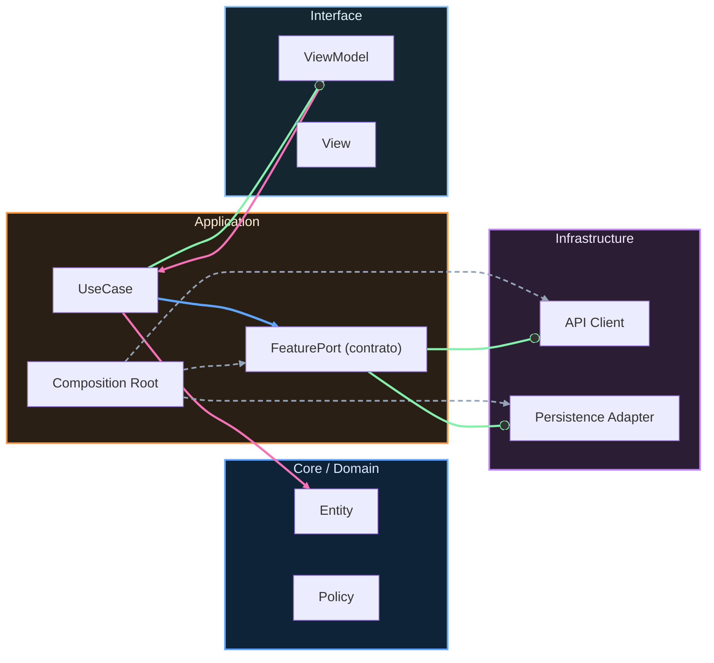

# Conectando la App: Tu Primera App Funcional

## El momento de la verdad: ver tu trabajo en el simulador

Has construido la feature Login completa con sus 4 capas: Domain con `Email` y `Password`, Application con `LoginUseCase`, Infrastructure con `RemoteAuthGateway` y `StubAuthGateway`, y Interface con `LoginViewModel` y `LoginView`. Todo testeado, todo desacoplado.

Pero hasta ahora has estado trabajando **en la oscuridad**. Has visto tests pasar en la consola, pero no has visto nada en el simulador de iOS. Esta lección es el puente: vamos a conectar todo para que tu app compile, se ejecute, y veas el formulario de login en pantalla.

> **Objetivo de esta lección:** Al terminar, tendrás una app iOS funcional que muestra el login. Será un **milestone visible** que confirma que todo lo construido hasta ahora realmente funciona.

---

## Paso 1: Crear el archivo de entrada de la app

Cada app iOS necesita un punto de entrada. En SwiftUI moderno, esto es un archivo con `@main` que crea la `WindowGroup`.

**Crea el archivo:** `App/StackMyArchitectureApp.swift`

```swift
import SwiftUI

// @main marca el punto de entrada de la aplicación.
// El sistema operativo llama a main() automáticamente cuando el usuario
// abre la app. Sin esto, la app no tiene donde empezar.
@main
struct StackMyArchitectureApp: App {
    
    // El CompositionRoot es el único lugar donde creamos dependencias.
    // Lo hacemos aquí, a nivel de app, para que vivan durante toda
    // la vida de la aplicación. Si lo creáramos dentro de body,
    // se recrearía cada vez que SwiftUI reconstruye la vista.
    private let compositionRoot = CompositionRoot()
    
    // @SceneBuilder es un property wrapper que permite definir
    // la estructura de ventanas de la app. WindowGroup es la escena
    // estándar para apps iOS - maneja la ventana principal.
    var body: some Scene {
        WindowGroup {
            // Aquí conectamos el CompositionRoot con la primera vista.
            // compositionRoot.makeLoginView() devuelve una LoginView
            // completamente configurada con su ViewModel y dependencias.
            compositionRoot.makeLoginView()
        }
    }
}
```

**Paso a paso en Xcode:**
1. Click derecho en la carpeta `App/` en el navegador
2. New File → Swift File
3. Nombre: `StackMyArchitectureApp.swift`
4. Selecciona el target principal (StackMyArchitecture), NO el de tests
5. Pega el código arriba

---

## Paso 2: Crear el CompositionRoot

El `CompositionRoot` es el **único lugar** donde se ensamblan las dependencias. Es el pegamento que conecta las capas sin que ellas se conozcan entre sí.

**Crea el archivo:** `App/CompositionRoot.swift`

```swift
import SwiftUI

// CompositionRoot es el lugar donde ensamblamos el grafo de dependencias.
// Es el único lugar donde una capa "conoce" de otra.
// Por ejemplo: Application conoce de Domain (eso está bien),
// pero Domain NO conoce de Application.
struct CompositionRoot {
    
    // MARK: - Gateways (Infrastructure)
    
    // Creamos el gateway stub para desarrollo local.
    // Usamos 'private' porque nadie fuera de CompositionRoot
    // necesita acceder directamente al gateway.
    private func makeAuthGateway() -> AuthGateway {
        // StubAuthGateway simula login sin red.
        // Útil para desarrollo: no necesitas servidor backend.
        return StubAuthGateway(
            behaviour: .successAfterDelay(
                token: "fake-token-123",
                delay: .seconds(1)
            )
        )
        
        // Cuando conectes tu backend real, cambias a:
        // return RemoteAuthGateway(baseURL: URL(string: "https://api.tuapp.com")!)
    }
    
    // MARK: - Use Cases (Application)
    
    private func makeLoginUseCase() -> LoginUseCase {
        // LoginUseCase depende de AuthGateway (inyectado por constructor).
        // No sabe si es stub o real - eso es desacoplamiento.
        return LoginUseCase(gateway: makeAuthGateway())
    }
    
    // MARK: - View Models (Interface)
    
    func makeLoginViewModel() -> LoginViewModel {
        // El ViewModel necesita el use case para ejecutar login.
        // También recibe un closure que se llama cuando el login tiene éxito.
        return LoginViewModel(
            loginUseCase: makeLoginUseCase(),
            onLoginSucceeded: { session in
                // Por ahora, solo imprimimos en consola.
                // En E2 (Integración) conectaremos la navegación real.
                print("✅ Login exitoso! Token: \(session.token)")
            }
        )
    }
    
    // MARK: - Views (Interface)
    
    func makeLoginView() -> some View {
        // LoginView es una struct, así que la creamos directamente.
        // Su ViewModel se crea aquí y se pasa a la vista.
        return LoginView(viewModel: makeLoginViewModel())
    }
}
```

**¿Por qué struct y no class?**

`CompositionRoot` es un `struct` porque no necesita mantener estado mutable. Cada método crea nuevas instancias. Si fuera `class`, podría tener propiedades que cambian, y eso complicaría el testing.

---

## Paso 3: Verificar imports necesarios

Abre cada archivo que creaste y verifica que los imports sean correctos:

**En `StackMyArchitectureApp.swift`:**
```swift
import SwiftUI
// No necesitas importar otros módulos porque
// CompositionRoot está en el mismo target
```

**En `CompositionRoot.swift`:**
```swift
import SwiftUI
// AuthGateway, LoginUseCase, etc. están en el mismo target,
// así que no necesitas imports adicionales
```

**Si tienes errores de "Cannot find in scope":**

1. Revisa que los archivos estén en el target correcto:
   - Selecciona el archivo en Xcode
   - Abre el Inspector (panel derecho)
   - Verifica que "Target Membership" tenga check en tu app target

2. Verifica que los protocolos y structs tengan visibilidad `internal` o `public`:

```swift
// En AuthGateway.swift
protocol AuthGateway { ... }  // internal por defecto, accesible dentro del target
```

---

## Paso 4: Ajustar el LoginView para navegación (placeholder)

El `LoginViewModel` que construimos en la lección anterior espera un closure `onLoginSucceeded`. Asegúrate de que tu `LoginViewModel` tenga este init:

```swift
// En Features/Login/Interface/LoginViewModel.swift

@MainActor
@Observable
class LoginViewModel {
    private let loginUseCase: LoginUseCase
    private let onLoginSucceeded: (Session) -> Void
    
    // Propiedades para la UI (ya existentes)
    var email: String = ""
    var password: String = ""
    var isLoading: Bool = false
    var errorMessage: String?
    
    // Inyectamos el use case y el callback de navegación
    init(
        loginUseCase: LoginUseCase,
        onLoginSucceeded: @escaping (Session) -> Void
    ) {
        self.loginUseCase = loginUseCase
        self.onLoginSucceeded = onLoginSucceeded
    }
    
    func submit() async {
        isLoading = true
        errorMessage = nil
        
        do {
            // Creamos value objects (pueden lanzar errores de validación)
            let emailVO = try Email(value: email)
            let passwordVO = try Password(value: password)
            let credentials = Credentials(email: emailVO, password: passwordVO)
            
            // Ejecutamos el use case
            let session = try await loginUseCase.execute(credentials: credentials)
            
            // Éxito: notificamos al coordinador
            onLoginSucceeded(session)
            
        } catch let error as AuthError {
            // Error de dominio (email inválido, password corto, etc.)
            errorMessage = error.localizedDescription
        } catch {
            // Error genérico
            errorMessage = "Error desconocido"
        }
        
        isLoading = false
    }
}
```

**Nota:** Si tu `LoginViewModel` original no tenía `onLoginSucceeded`, añádelo ahora. Es la clave para que la navegación funcione más tarde.

---

## Paso 5: Build y Run

**Paso a paso:**

1. Selecciona un simulador:
   - En Xcode, menú superior: `Product → Destination → iPhone 16 Pro`

2. Compila el proyecto:
   - `Cmd + B` (Build)
   - Deberías ver "Build Succeeded" en la barra superior

3. Ejecuta la app:
   - `Cmd + R` (Run)
   - El simulador se abrirá (tarda 10-30 segundos la primera vez)

4. Verifica que ves:
   - El campo de email
   - El campo de password
   - El botón "Iniciar sesión"

**Si hay errores de compilación comunes:**

| Error | Solución |
|-------|----------|
| "Cannot find 'CompositionRoot' in scope" | Verifica que `CompositionRoot.swift` esté en el target correcto |
| "Cannot find 'AuthGateway' in scope" | Revisa que los archivos de Infrastructure estén en el target |
| "Missing argument 'onLoginSucceeded'" | Añade el parámetro al init de LoginViewModel |
| "No such module 'SwiftUI'" | Este archivo no está en un target de app |

---

## Paso 6: Probar el flujo manualmente

Una vez que la app corre en el simulador:

1. **Prueba el happy path:**
   - Email: `user@test.com`
   - Password: `password123`
   - Pulsa "Iniciar sesión"
   - Deberías ver el spinner, y luego en la consola de Xcode: `✅ Login exitoso!`

2. **Prueba un error:**
   - Email: `invalid-email`
   - Pulsa "Iniciar sesión"
   - Deberías ver el mensaje de error en rojo debajo del formulario

3. **Ver la consola:**
   - `Cmd + Shift + C` abre la consola de Xcode
   - Ahí verás los print statements

---

## Checkpoint: ¿Funciona?

Antes de continuar, verifica:

- [ ] La app compila sin errores (`Cmd + B`)
- [ ] La app se ejecuta en el simulador (`Cmd + R`)
- [ ] Veo el formulario de login con dos campos y un botón
- [ ] Puedo escribir email y password
- [ ] Al pulsar el botón, aparece un spinner de carga
- [ ] Con datos válidos, veo el mensaje de éxito en consola
- [ ] Con datos inválidos, veo un mensaje de error en la UI

**Si todo está ✅, felicidades.** Tu arquitectura limpia está funcionando. El Domain valida, el Use Case orquesta, el Gateway simula la red, y la Interface muestra todo al usuario.

**Si algo falla:**
- Revisa los imports
- Verifica los targets de cada archivo
- Comprueba que los nombres de archivos coincidan con las referencias
- Mira la consola de errores de Xcode (`Cmd + Shift + Y`)

---

## ¿Qué sigue?

Ahora tienes una app funcional, pero aislada. Solo tiene login, y no navega a ningún lado. En la **Etapa 2 (Integración)**, añadirás:

- Una segunda feature (Catalog)
- Navegación entre Login y Catalog
- Un coordinador central que maneja el flujo

Pero primero, asegúrate de completar los entregables de la Etapa 1.

---

---

<!-- plantilla-pedagógica:auto -->

## Refuerzo pedagógico
Contexto: normalización automática para `01-fundamentos/06-conectando-la-app.md`.

### Prerrequisitos
- Revisa la lección anterior inmediata y confirma los conceptos base antes de continuar.

### Práctica guiada
- Aplica un cambio pequeño y verificable en el scaffold relacionado con esta lección.

### Validación
- Checklist rápido:
  - [ ] Entiendo la decisión técnica principal de la lección.
  - [ ] He ejecutado una comprobación mínima (test/build/script) asociada.
  - [ ] Puedo explicar el trade-off clave con mis palabras.

<!-- auto-gapfix:layered-mermaid -->
## Diagrama de arquitectura por capas



La lectura del diagrama sigue esta semántica:
1. `-->` dependencia directa en runtime.
2. `-.->` wiring o configuración.
3. `==>` contrato o abstracción.
4. `--o` salida o propagación de resultado.
