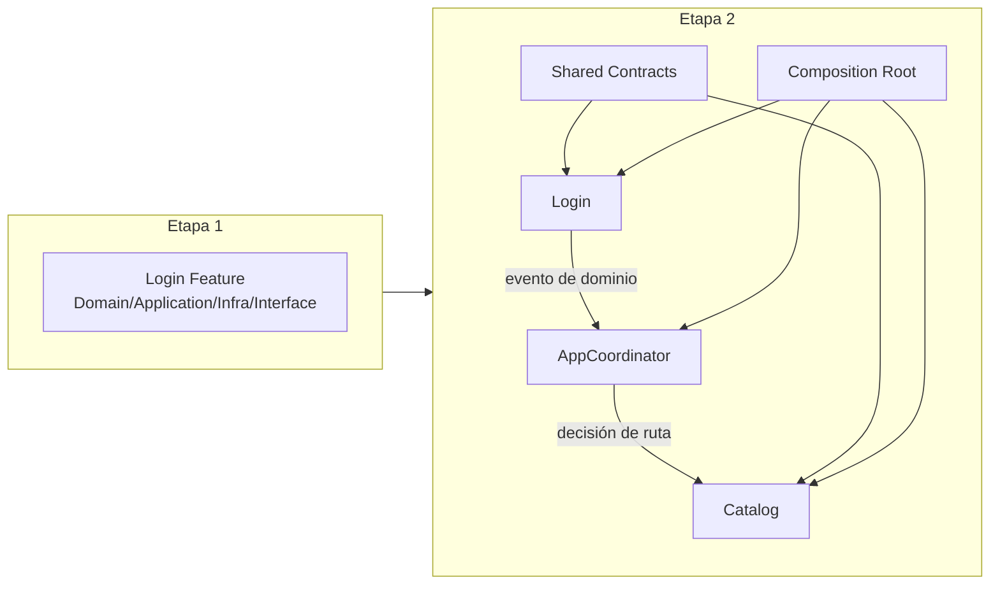
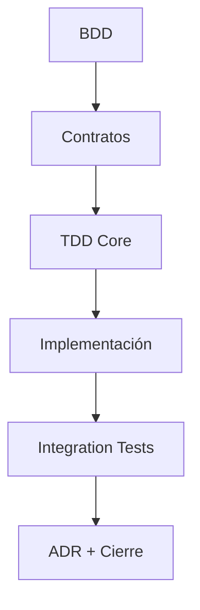

# Etapa 2: Integración — Dos features que trabajan juntas sin acoplarse

## Por qué esta etapa cambia el juego

En la Etapa 1 construiste una feature completa (Login) con límites limpios, tests y flujo end-to-end. Eso te dio una base sólida, pero todavía estabas en un entorno controlado: una feature aislada se parece a entrenar en gimnasio. La Etapa 2 es salir a jugar partido real: ahora hay dos features, contratos compartidos, navegación cross-feature y decisiones de composición.

La pregunta central de esta etapa es simple y profunda:

**¿Cómo conseguimos que Login y Catalog colaboren intensamente sin convertirse en una maraña de dependencias?**

Si lo haces mal, cada cambio en Login rompe Catalog, y cada cambio en Catalog obliga a tocar navegación, ViewModels y networking en cadena. Si lo haces bien, cada feature evoluciona con autonomía y la integración se vuelve un sistema predecible.

---

## Objetivo pedagógico de la etapa

Esta etapa está diseñada para que el alumno pase de “sé construir una feature” a “sé diseñar un sistema de features”. En términos de progresión:

- Junior: entiende una feature por dentro.
- Mid (esta etapa): entiende cómo se conectan features sin contaminarse.

Resultado esperado al finalizar:

- Puedes justificar contratos entre features en lenguaje de negocio, no solo técnico.
- Puedes diseñar navegación por eventos sin que una feature conozca internals de otra.
- Puedes integrar infraestructura real mínima manteniendo testabilidad.
- Puedes decidir qué pruebas son unitarias, cuáles de integración y por qué.

---

## Qué cambia exactamente respecto a Etapa 1

En Etapa 1, el foco era la calidad interna de Login. En Etapa 2, el foco pasa a ser la calidad de las fronteras entre componentes.

### Antes (Etapa 1)

- Una feature principal.
- Orquestación local.
- Tests mayormente unitarios.
- Navegación simple.

### Ahora (Etapa 2)

- Dos features (`Login`, `Catalog`).
- Coordinación global por eventos.
- Contratos compartidos mínimos.
- Infraestructura de red real mínima.
- Tests de integración para validar colaboración.

---

## Modelo mental de integración (explicado para junior)

Piensa en Login y Catalog como dos departamentos de una empresa.

- Login (Identity) verifica quién eres.
- Catalog (Products) te muestra lo que puedes ver/comprar.

Si el departamento de Login entra al despacho de Catalog a decirle “haz esto, así, en este orden”, hay caos. Eso es acoplamiento.

La integración sana funciona así:

1. Login termina su trabajo y emite un hecho: `loginSucceeded`.
2. Un coordinador escucha ese hecho y decide la siguiente ruta.
3. Catalog recibe contexto por contrato, no por dependencia interna.

Con este modelo, cada departamento trabaja en lo suyo, pero el sistema completo se coordina bien.

---

## Contrato pedagógico transversal de la etapa

Cada lección de Etapa 2 se estudia y se implementa con el mismo estándar:

1. Definición simple del concepto.
2. Modelo mental interno.
3. Cuándo sí / cuándo no.
4. Ejemplo mínimo.
5. Ejemplo realista enterprise.
6. Anti-patrón + estrategia de depuración.

Si una lección no cumple estas 6 capas, no se considera cerrada.

---

## Qué vamos a construir

## 1) Feature Catalog (segunda feature completa)

Catalog repite la disciplina de Login:

- Domain: `Product`, `Price`, errores de negocio.
- Application: `LoadProductsUseCase`, puertos de repositorio.
- Infrastructure: repositorio remoto y stubs.
- Interface: `CatalogViewModel`, `CatalogView`, filas reutilizables.

Objetivo didáctico:
- demostrar que el método no era solo para Login, sino reproducible.

## 2) Navegación por eventos

Se introduce `AppCoordinator` como árbitro de rutas globales.

- Features emiten eventos.
- Coordinador decide rutas.
- UI renderiza estado de navegación.

Objetivo didáctico:
- separar “emitir intención” de “decidir navegación”.

## 3) Contratos entre features

Definimos qué tipos se comparten y por qué.

Regla de oro:
- compartir solo lo imprescindible en un shared kernel/contract.
- prohibido depender de internals de otra feature.

Objetivo didáctico:
- controlar acoplamiento semántico y técnico.

## 4) Infraestructura real mínima

Introducción de `URLSessionHTTPClient` y composición con clientes autenticados.

Objetivo didáctico:
- conectar mundo real sin romper Clean Architecture.

## 5) Integration tests

Validamos colaboración real entre componentes (no solo mocks).

Objetivo didáctico:
- detectar errores de contrato/mapping que unit tests no ven.

---

## Flujo operativo de trabajo por lección

La etapa se ejecuta con un ciclo fijo:

1. **BDD**: escenarios happy/sad/edge en lenguaje de negocio.
2. **Contratos**: puertos, modelos compartidos, errores y eventos.
3. **TDD en core**: unit tests para domain/application.
4. **Implementación de infra/interface** con límites limpios.
5. **Integration tests** para colaboración entre componentes.
6. **ADR** de decisión principal y trade-offs.

---

## Skills que se aplican en esta etapa (trabajo diario enterprise)

### `swift-concurrency`

Se aplica en:

- modelos/eventos `Sendable`,
- boundaries de aislamiento en ViewModels/coordinador,
- cancelación en tareas de carga.

Señal de buen uso:
- no usar `@MainActor` como parche,
- justificar cada frontera de aislamiento.

### `swiftui-expert-skill`

Se aplica en:

- data flow de `CatalogViewModel` y vistas,
- navegación moderna con `NavigationStack`,
- performance base de listas y composición.

Señal de buen uso:
- estado claramente poseído vs inyectado,
- vista sin lógica de negocio.

### `windsurf-rules-ios` (si aplica al proyecto destino)

Se aplica en:

- consistencia de arquitectura Clean + feature-first,
- reglas de concurrencia y composición,
- disciplina BDD->TDD.

Señal de buen uso:
- decisiones repetibles de equipo, no soluciones ad-hoc.

---

## Errores típicos de esta etapa y cómo evitarlos

## Error 1: “Integrar” conectando features directamente

Síntoma:
- `import FeatureCatalog` desde Login (o viceversa).

Riesgo:
- dependencia circular conceptual, regresiones en cascada.

Corrección:
- contrato/evento + coordinador.

## Error 2: confundir shared kernel con cajón desastre

Síntoma:
- todo acaba en `Shared` sin ownership.

Riesgo:
- módulo común gigante y frágil.

Corrección:
- compartir solo tipos estables y mínimos.

## Error 3: usar solo unit tests y asumir integración

Síntoma:
- green local, fallo al conectar capas reales.

Riesgo:
- bugs de mapping/formato detectados tarde.

Corrección:
- integration tests focalizados por flujo crítico.

## Error 4: navegación decidida en vistas

Síntoma:
- `NavigationLink`/push con reglas de negocio embebidas.

Riesgo:
- rutas duplicadas y no trazables.

Corrección:
- coordinador con política de ruta centralizada.

---

## Qué no cubre esta etapa (a propósito)

Para mantener lotes pequeños y feedback rápido, esta etapa no resuelve todavía:

- estrategia avanzada cache/offline,
- observabilidad profunda,
- governance de bounded contexts a nivel plataforma,
- migración completa de concurrencia avanzada.

Eso viene en etapas 3, 4 y 5.

---

## Criterio de cierre de Etapa 2

Esta etapa está realmente cerrada cuando puedes demostrar:

1. Dos features colaborando sin dependencia interna directa.
2. Navegación desacoplada gobernada por eventos.
3. Infra real mínima integrada con contratos limpios.
4. Cobertura equilibrada de unit + integration tests.
5. Decisiones arquitectónicas documentadas con trade-offs.

Si falta cualquiera, el cierre está incompleto.

---

## Checklist de autoevaluación del alumno

- [ ] Puedo explicar por qué Login no debe navegar directamente a Catalog.
- [ ] Puedo identificar qué tipo debe vivir en feature y cuál en contrato compartido.
- [ ] Puedo diseñar un integration test útil sin sobre-mockear.
- [ ] Puedo justificar decisiones de aislamiento/concurrencia en coordinación y UI.
- [ ] Puedo argumentar trade-offs con criterio de negocio y mantenimiento.

---

## Siguiente paso

Empieza por la especificación BDD de Catalog y recorre la etapa completa en orden. No saltes directamente a infraestructura o tests: en esta etapa, el orden es parte de la arquitectura.

**Siguiente:** [Feature Catalog →](01-feature-catalog/00-especificacion-bdd.md)

---

## Señales de progreso dentro de la etapa

Para validar que realmente estás pasando de “features aisladas” a “sistema integrado”, revisa estas señales:

- los cambios en Login no rompen Catalog por imports ocultos;
- los contratos compartidos se modifican con intención y pruebas;
- la navegación entre features se prueba sin UI real;
- los integration tests detectan regresiones antes que QA manual.

Si una de estas señales falta, la integración aún no está cerrada.

---

## Ejercicio recomendado de consolidación

1. añadir un nuevo evento cross-feature (`sessionExpired`);
2. actualizar coordinator y rutas;
3. añadir un caso de integración que valide el flujo;
4. documentar decisión en ADR breve;
5. verificar reglas de dependencia.

Este ejercicio obliga a aplicar toda la etapa en miniatura y revela huecos de diseño rápidamente.

---

## Escala de madurez de integración (rápida)

Nivel 1: features conectadas manualmente.
Nivel 2: contratos tipados y tests de integración básicos.
Nivel 3: navegación por eventos + reglas de dependencia estables.
Nivel 4: integración gobernada con CI y ADRs.

La meta de esta etapa es cerrar fuerte en nivel 2-3 para preparar nivel 4.

---

## Resultado esperado del alumno al cerrar etapa

Debe poder explicar y defender el flujo completo Login -> evento -> Coordinator -> Catalog con contratos y pruebas, sin depender de imports cruzados.
