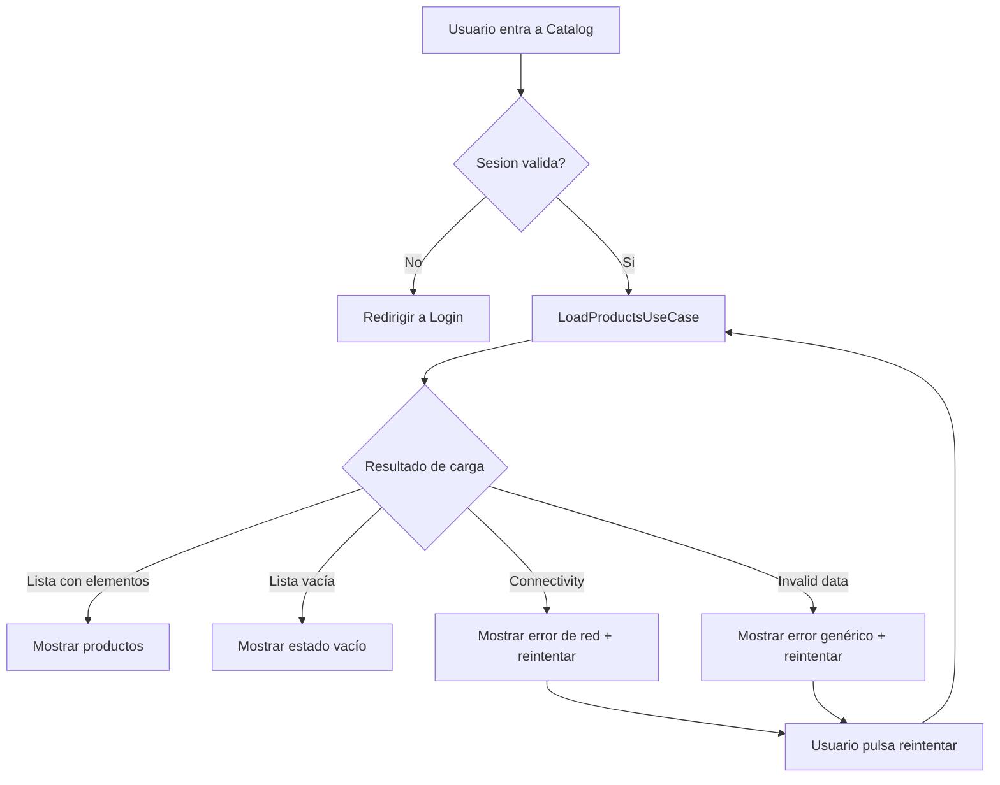

# Feature Catalog: Especificación BDD

## Objetivo de esta especificación

Esta especificación no existe para "rellenar documentación". Existe para evitar una de las causas más comunes de deuda técnica: empezar a programar sin tener definido con precisión qué comportamiento espera negocio en escenarios reales.

En Etapa 2, Catalog es la primera feature que convive con otra (Login). Por eso no basta con decir "mostrar productos". Necesitamos definir:

- qué pasa cuando todo va bien,
- qué pasa cuando falla la red,
- qué pasa cuando los datos son inválidos,
- qué pasa cuando no hay sesión válida,
- qué pasa cuando el usuario reintenta o abandona la pantalla.

Si estos escenarios no están definidos antes, los tests terminan validando decisiones improvisadas, no requisitos reales.

---

## Contexto de negocio (DDD)

Catalog pertenece al contexto de `Products`, pero depende de una condición de `Identity`: el usuario debe estar autenticado para acceder a rutas protegidas y, en ciertos casos, para consumir endpoints autenticados.

Lenguaje ubicuo de esta feature:

- **Product**: entidad de lectura que representa un producto disponible.
- **Catalog**: colección de productos visibles para el usuario.
- **LoadProducts**: caso de uso para obtener catálogo.
- **Connectivity error**: fallo de red (sin internet, timeout, DNS, etc.).
- **Invalid data**: respuesta técnicamente recibida pero semánticamente inválida.
- **Empty catalog**: respuesta válida sin elementos.
- **Retry**: nuevo intento explícito tras fallo.

Invariante principal:

- El usuario nunca debe ver datos corruptos como si fueran catálogo válido.

Invariante secundario:

- Un fallo de conectividad no debe presentarse como catálogo vacío.

---

## Mapa mental del comportamiento



Este diagrama define la lógica observable de negocio de la feature. Cualquier cambio funcional debería reflejarse aquí antes de tocar implementación.

---

## Escenarios BDD (Given/When/Then)

## Escenario 1 — Carga exitosa con productos

```gherkin
Feature: Catálogo de productos
  Como usuario autenticado
  Quiero ver productos disponibles
  Para explorar lo que ofrece la tienda

Scenario: Carga exitosa con productos disponibles
  Given el usuario está autenticado
  And el servidor responde con productos válidos
  When la pantalla Catalog se carga
  Then el usuario ve la lista de productos
  And cada producto muestra nombre, precio e imagen
  And el estado de carga desaparece
```

### Interpretación técnica

- `LoadProductsUseCase` devuelve `[Product]` no vacío.
- `CatalogViewModel` pasa de `.loading` a `.loaded(products)`.
- La vista renderiza lista y permite interacción.

---

## Escenario 2 — Catálogo vacío

```gherkin
Scenario: Respuesta válida sin productos
  Given el usuario está autenticado
  And el servidor responde 200 con lista vacía
  When la pantalla Catalog se carga
  Then el usuario ve un estado vacío amigable
  And NO se muestra error de conectividad
```

### Interpretación técnica

- Estado de negocio válido: no es error.
- `CatalogState.empty` debe ser explícito.
- No confundir "no hay datos" con "falló la carga".

---

## Escenario 3 — Error de conectividad

```gherkin
Scenario: No hay conexión de red
  Given el usuario está autenticado
  And el dispositivo no tiene conexión a internet
  When Catalog intenta cargar productos
  Then el usuario ve mensaje de error de conectividad
  And se ofrece acción de reintentar
  And NO se muestra estado vacío
```

### Interpretación técnica

- El repositorio traduce fallo de transporte a `CatalogError.connectivity`.
- La UI muestra error accionable, no contenido ambiguo.

---

## Escenario 4 — Datos inválidos del backend

```gherkin
Scenario: El backend devuelve payload inválido
  Given el usuario está autenticado
  And el servidor responde con JSON inválido o inesperado
  When Catalog intenta decodificar la respuesta
  Then el usuario ve un error genérico de carga
  And se ofrece reintentar
```

### Interpretación técnica

- Error de infraestructura/mapeo, no de conectividad.
- El repositorio debe distinguir `invalidData`.

---

## Escenario 5 — Reintento exitoso tras error

```gherkin
Scenario: El usuario reintenta y la carga se recupera
  Given el usuario ve estado de error en Catalog
  And la conectividad vuelve a estar disponible
  When el usuario pulsa Reintentar
  Then Catalog vuelve a estado loading
  And finalmente muestra productos cargados
```

### Interpretación técnica

- `retry()` del ViewModel vuelve a ejecutar caso de uso.
- Debe limpiar mensaje anterior y mostrar transición correcta.

---

## Escenario 6 — Sesión inválida al entrar por deep link/ruta protegida

```gherkin
Scenario: Acceso a ruta protegida sin sesión
  Given el usuario no tiene sesión válida
  When intenta acceder a Catalog por navegación interna o deep link
  Then el sistema redirige a Login
  And conserva intención de navegación cuando aplique
```

### Interpretación técnica

- Este escenario se gobierna por coordinador/routing (no por View).
- Catalog no decide autenticación global.

---

## Escenario 7 — Cancelación por abandono de pantalla

```gherkin
Scenario: Usuario abandona la pantalla durante la carga
  Given Catalog está en estado loading
  When el usuario navega fuera antes de recibir respuesta
  Then la tarea de carga se cancela
  And no se publica un estado tardío que ensucie la UI
```

### Interpretación técnica

- Relevante en concurrencia: ownership de `Task` en ViewModel/coordinador.
- Evita updates tardíos sobre vistas ya descartadas.

---

## Escenario 8 — Productos duplicados en payload

```gherkin
Scenario: El backend devuelve productos duplicados
  Given el usuario está autenticado
  And la respuesta contiene IDs duplicados
  When Catalog procesa la respuesta
  Then el sistema aplica política de normalización definida
  And NO rompe la UI por identidad inconsistente
```

### Interpretación técnica

- La política puede ser: deduplicar por `id` o fallar como `invalidData`.
- Debe quedar documentada en ADR y cubierta por tests.

---

## Derivación de decisiones de diseño desde escenarios

Estos escenarios fuerzan decisiones concretas:

## 1) Estado de UI como máquina de estados

No usar banderas sueltas (`isLoading`, `errorMessage`, `products`) porque permiten estados imposibles.

Modelo recomendado:

```swift
enum CatalogState: Equatable {
    case idle
    case loading
    case loaded([Product])
    case empty
    case error(CatalogErrorViewData)
}
```

## 2) Error modelado explícitamente

Separar:

- `connectivity`
- `invalidData`
- `unauthorized` (si aplica por contrato)

para no mezclar UX y semántica.

## 3) Contrato del repositorio orientado a dominio

El puerto no devuelve DTO ni tipos de red.

```swift
protocol ProductRepository: Sendable {
    func loadProducts() async throws -> [Product]
}
```

## 4) Routing y sesión fuera de la feature

Catalog no decide reglas globales de autorización. Eso corresponde al coordinador de navegación.

---

## Trazabilidad BDD -> pruebas -> capas

| Escenario | Tipo de prueba principal | Capa foco | Nombre sugerido |
| --- | --- | --- | --- |
| Carga exitosa | Unit + integration | Application/Infrastructure | `test_loadProducts_deliversProductsOn200ValidData` |
| Catálogo vacío | Unit | Application/ViewModel | `test_stateIsEmpty_whenRepositoryReturnsEmpty` |
| Conectividad | Unit + integration | Infrastructure/ViewModel | `test_loadProducts_deliversConnectivityErrorOnTransportFailure` |
| Datos inválidos | Unit + integration | Infrastructure | `test_loadProducts_deliversInvalidDataOnMalformedPayload` |
| Reintento | Unit | Interface/Application | `test_retry_transitionsFromErrorToLoading` |
| Sin sesión | Integration | Navigation/Coordinator | `test_routeToLogin_whenCatalogRequestedWithoutSession` |
| Cancelación | Concurrency test | Interface/Application | `test_cancelLoad_doesNotPublishLateState` |
| Duplicados | Unit | Domain/Application | `test_deduplicatesProductsById` (o error policy equivalente) |

Esta tabla evita una trampa común: tener escenarios de negocio sin correspondencia en tests reales.

---

## Matriz de pruebas de la feature Catalog (Etapa 2)

| Tipo de prueba | Qué valida | Coste | Frecuencia |
| --- | --- | --- | --- |
| Unit Domain | invariantes de Product/Price | Bajo | Cada cambio |
| Unit Application | reglas de caso de uso/estados | Bajo | Cada cambio |
| Unit Interface | transiciones de ViewModel | Bajo-Medio | Cada cambio |
| Integration Infra | mapping real con cliente HTTP stubbed | Medio | Por PR |
| Integration navegación | colaboración Login -> Coordinator -> Catalog | Medio | Por PR |
| UI/E2E | camino crítico de valor | Alto | Selectivo |

---

## Anti-patrones frecuentes (y corrección)

## Anti-patrón 1: BDD superficial

Síntoma:
- escenarios genéricos sin edge cases.

Corrección:
- incorporar al menos un escenario de cancelación y uno de datos inválidos.

## Anti-patrón 2: Estado ambiguo en UI

Síntoma:
- vista mostrando lista y error simultáneamente.

Corrección:
- enum de estado mutuamente excluyente.

## Anti-patrón 3: Repositorio devuelve DTO

Síntoma:
- Interface conoce campos de red.

Corrección:
- mapear en Infrastructure y exponer dominio puro.

## Anti-patrón 4: Retry sin limpiar estado previo

Síntoma:
- UI queda bloqueada en error aunque recargue.

Corrección:
- transicionar explícitamente a `.loading` antes del nuevo intento.

---

## Skills aplicadas en esta especificación

- `swift-concurrency`: escenario explícito de cancelación y ownership de tareas.
- `swiftui-expert-skill`: modelado de estado de pantalla sin estados imposibles.
- `windsurf-rules-ios` (si aplica): disciplina BDD->TDD, Clean por feature y separación de responsabilidades.

---

## Checklist de cierre de especificación

- [ ] Hay escenarios happy/sad/edge suficientes para negocio real.
- [ ] Cada escenario tiene destino de prueba definido.
- [ ] Quedó explícito qué decide feature y qué decide coordinador.
- [ ] Errores de negocio y errores técnicos están diferenciados.
- [ ] Existe al menos un escenario de concurrencia (cancelación).

---

## Siguiente paso

Con esta especificación cerrada, ya se puede implementar con TDD sin improvisar comportamiento.

**Siguiente:** [Domain →](01-domain.md)
