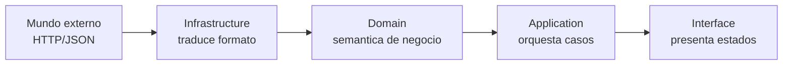

# Feature Catalog: Capa Domain

## Objetivo de aprendizaje

Al terminar esta lección vas a poder modelar un dominio de `Catalog` que no sea una colección pasiva de structs, sino un núcleo semántico estable: tipos con significado de negocio, invariantes explícitas y errores útiles para Application/UI.

En palabras simples: Domain es el diccionario oficial de la feature. Si el diccionario está mal, todo el equipo discute por malentendidos.

---

## Por qué esta lección importa en enterprise

En proyectos grandes, cuando el dominio está pobremente modelado aparecen tres dolores caros:

1. cada capa interpreta datos a su manera;
2. los errores no explican qué decisión tomar;
3. pequeños cambios de API externa rompen media app.

Un Domain sólido evita eso al definir lenguaje ubicuo y límites claros.

---

## Definición simple

Domain es la capa que representa reglas y significado del negocio sin depender de UI, red o persistencia.

En `Catalog` de esta etapa, Domain debe resolver:

- qué es un `Product` válido para el negocio;
- cómo representar dinero (`Price`) de forma segura;
- cómo clasificar fallos relevantes (`CatalogError`).

---

## Modelo mental: contrato semántico

Imagina que Infrastructure trae cajas desde fuera y UI muestra escaparates. Domain decide qué objetos entran al almacén oficial y con qué etiqueta.



Si Domain acepta cualquier cosa sin criterio, todo lo demás hereda ruido.

---

## Lenguaje ubicuo de Catalog

Términos oficiales para esta feature:

- `Product`: unidad de catálogo mostrable al usuario.
- `Price`: valor monetario con moneda.
- `CatalogError.connectivity`: no se pudo obtener datos por acceso.
- `CatalogError.invalidData`: los datos recibidos no cumplen contrato interno.

Regla: estos términos se usan igual en BDD, tests, código y ADRs.

---

## Diseño de tipos principales

### `Product`

```swift
import Foundation

struct Product: Equatable, Sendable {
    let id: String
    let name: String
    let price: Price
    let imageURL: URL
}
```

### `Price`

```swift
import Foundation

struct Price: Equatable, Sendable {
    let amount: Decimal
    let currency: String
}
```

### `CatalogError`

```swift
enum CatalogError: Error, Equatable, Sendable {
    case connectivity
    case invalidData
}
```

Decisiones clave:

- `Decimal` para dinero, no `Double`;
- `URL` tipada en lugar de `String` suelta;
- errores semánticos, no técnicos crudos.

---

## Invariantes y evolución progresiva

En Etapa 2 mantenemos invariantes mínimas para no sobrediseñar:

- `Product.id` no vacío (validado en mapper/domain initializer cuando aplique);
- `Price.amount` no negativo (si el negocio lo exige);
- `currency` coherente con formato acordado.

Supuesto: de momento permitimos currency como `String` para reducir complejidad inicial. En etapa superior podemos evolucionar a `Currency` value object.

### Evolución posible

- hoy: `id: String`, `currency: String`;
- mañana: `ProductID`, `CurrencyCode` con validaciones dedicadas.

Ese paso se activa cuando el dolor de errores semánticos crezca.

---

## Cuándo SÍ / cuándo NO enriquecer Domain

### Cuándo SÍ

- cuando una regla se repite en varias capas;
- cuando un error requiere decisiones distintas en UI/Application;
- cuando necesitas proteger invariantes de negocio.

### Cuándo NO

- cuando solo añades complejidad “por si acaso”;
- cuando la regla es puramente técnica de red/persistencia;
- cuando la regla pertenece a presentación.

Regla práctica:

- modela lo suficiente para reducir ambigüedad, no para ganar concursos de patrones.

---

## BDD -> Domain (trazabilidad real)

Escenarios BDD de `Catalog` y su impacto:

| Escenario BDD | Elemento Domain | Contrato semántico |
| --- | --- | --- |
| carga exitosa | `Product`, `Price` | datos listos para negocio/UI |
| sin conectividad | `CatalogError.connectivity` | permite estrategia de retry/fallback |
| payload corrupto | `CatalogError.invalidData` | evita propagar basura |
| lista vacía válida | `[Product]` vacío | estado válido, no error |

Si no existe esta tabla mental, el equipo termina corrigiendo bugs por interpretación, no por lógica.

---

## TDD del dominio

### Plan

1. Red: test que define igualdad/identidad de `Product`.
2. Green: implementación mínima de modelos.
3. Red: test de precisión monetaria con `Decimal`.
4. Green: `Price` estable.
5. Red: test de clasificación de errores.
6. Refactor: limpiar tipos y naming.

### Tests mínimo y realista

```swift
import XCTest

final class ProductDomainTests: XCTestCase {
    func test_product_identity_changes_whenIDChanges() {
        let url = URL(string: "https://example.com/p.png")!
        let basePrice = Price(amount: Decimal(string: "29.99")!, currency: "EUR")

        let first = Product(id: "1", name: "Camiseta", price: basePrice, imageURL: url)
        let second = Product(id: "2", name: "Camiseta", price: basePrice, imageURL: url)

        XCTAssertNotEqual(first, second)
    }

    func test_price_keepsDecimalPrecision() {
        let value = Decimal(string: "29.99")!
        let price = Price(amount: value, currency: "EUR")

        XCTAssertEqual(price.amount, value)
    }

    func test_catalogError_isSemanticallyComparable() {
        XCTAssertEqual(CatalogError.connectivity, .connectivity)
        XCTAssertNotEqual(CatalogError.connectivity, .invalidData)
    }
}
```

**Explicación de cada test:**

**`test_product_identity_changes_whenIDChanges`** — Este test verifica que dos productos con **distinto id** son considerados **distintos**, aunque tengan el mismo nombre, precio y URL de imagen. ¿Por qué importa? Porque si `Equatable` comparara solo el nombre (un bug hipotético), dos productos diferentes con el mismo nombre se considerarían iguales, y SwiftUI podría no mostrar uno de ellos en una lista. Este test protege contra eso.

`Decimal(string: "29.99")!` — Creamos un `Decimal` desde un string. ¿Por qué desde string y no con `Decimal(29.99)`? Porque `Decimal(29.99)` primero crea un `Double` (29.99) y luego lo convierte a `Decimal`, arrastrando la imprecisión del `Double`. `Decimal(string: "29.99")!` parsea directamente el string a `Decimal` sin pasar por `Double`, manteniendo la precisión exacta. El `!` es un force-unwrap que dice "estoy seguro de que este string es un número válido". En tests es aceptable porque controlamos los datos.

**`test_price_keepsDecimalPrecision`** — Este test verifica que `Price` preserva la precisión decimal. Si alguien cambiara `amount` de `Decimal` a `Double` (un error común), este test fallaría porque `Double` introduce errores de redondeo. Es una **ancla de regresión**: protege una decisión de diseño crítica.

**`test_catalogError_isSemanticallyComparable`** — Este test verifica que los errores del catálogo se pueden comparar correctamente. `connectivity == connectivity` debe ser `true`, y `connectivity != invalidData` debe ser `true`. Parece trivial, pero si alguien eliminara `: Equatable` del enum por error, todos los `XCTAssertEqual` de errores en los tests de Application e Infrastructure dejarían de compilar. Este test es el primero en detectar esa rotura.

---

## Concurrencia (Swift 6.2)

### Aislamiento

Domain debería ser mayoritariamente inmutable y sin side effects. Eso simplifica concurrencia.

### `Sendable`

`Product`, `Price` y `CatalogError` son `Sendable`, por tanto pueden cruzar boundaries async con seguridad.

### Anti-ejemplo

Exponer en Domain una clase mutable compartida para cache temporal. Eso pertenece a Infrastructure/Application con aislamiento explícito.

### Regla

- Domain puro e inmutable reduce riesgos de data races casi a cero.

---

## Anti-patrones y depuración

### Anti-patrón 1: usar DTO como modelo de dominio

Problema:

- el backend dicta el lenguaje interno.

Corrección:

- mapper y modelos propios de dominio.

### Anti-patrón 2: `Double` para dinero

Problema:

- errores de precisión acumulados.

Corrección:

- `Decimal` + tests específicos.

### Anti-patrón 3: error genérico único

Problema:

- UI no sabe si mostrar retry, aviso o bloqueo.

Corrección:

- errores semánticos diferenciados.

### Depuración práctica

1. si UI actúa raro ante fallo, revisar clasificación de `CatalogError`;
2. si hay discrepancias de precio, validar pipeline `Decimal` de punta a punta;
3. si hay datos absurdos, revisar contrato Domain antes de culpar a UI.

---

## A/B/C de modelado en esta etapa

### Opción A: modelos mínimos semánticos (decisión actual)

Ventajas:

- buena claridad con coste bajo;
- facilita integración rápida.

Costes:

- algunas validaciones avanzadas quedan para etapas siguientes.

### Opción B: value objects estrictos desde ya

Ventajas:

- seguridad semántica máxima.

Costes:

- más fricción inicial y curva de aprendizaje.

### Opción C: dominio anémico acoplado a DTO

Ventajas:

- rapidez inicial aparente.

Costes:

- deuda inmediata alta.

Trigger para A -> B:

- aumento de bugs semánticos repetidos en id/currency/precio.

---

## ADR corto de la lección

```markdown
## ADR-002A: Dominio de Catalog con modelos semanticos minimos y errores tipados
- Estado: Aprobado
- Contexto: necesidad de integrar feature manteniendo contratos claros entre capas
- Decisión: usar `Product`, `Price(Decimal)` y `CatalogError` como lenguaje ubicuo base
- Consecuencias: claridad alta con complejidad controlada; evolución futura a value objects estrictos cuando haya evidencia
- Fecha: 2026-02-07
```

---

## Checklist de calidad

- [ ] Domain no depende de red/UI/persistencia.
- [ ] Tipos y errores reflejan lenguaje de negocio.
- [ ] `Price` usa `Decimal` y está cubierto por tests.
- [ ] Modelos son `Sendable` e inmutables.
- [ ] Existe trazabilidad BDD -> Domain.

---

## Cierre

Cuando tu Domain está bien definido, el resto de capas dejan de discutir “qué significan los datos” y se concentran en su trabajo. Ese orden semántico es uno de los multiplicadores más fuertes de productividad en sistemas enterprise.

**Anterior:** [Especificación BDD ←](00-especificacion-bdd.md) · **Siguiente:** [Application →](02-application.md)

---

## Ejercicio de consolidación de dominio

Práctica recomendada:

1. introducir `ProductID` como value object;
2. adaptar mapper de infraestructura;
3. actualizar tests de igualdad/identidad;
4. validar que Application/UI no se rompen.

Este ejercicio entrena evolución de dominio con impacto controlado por tests.

---

## Señal de dominio saludable

Si puedes cambiar proveedor de datos o presentación sin renombrar conceptos de negocio (`Product`, `Price`, `CatalogError`), el dominio está bien aislado.
