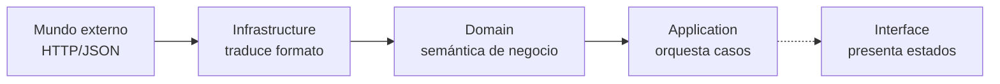

# Feature Catalog: Capa Domain

## Ruta scaffold relacionada

- `apps/ios/ArchitectureKit/Sources/` para implementación de código real de esta lección.
- `apps/ios/ArchitectureKit/Tests/` para validación y regresión de contratos.
- `apps/ios/ArchitectureHostApp/` cuando la lección impacta navegación/UI integrada.

> **Nota de nomenclatura lección ↔ scaffold:** Los snippets de esta lección usan nombres pedagógicos (`Product.name`, `Price`, `CatalogError`). En el scaffold real los equivalentes son `Product.title`, `Double` para precio, y errores genéricos via `throws`. Consulta la [tabla de equivalencias completa](../../anexos/equivalencias-scaffold.md).

## Objetivo de aprendizaje

Al terminar esta lección vas a poder modelar un dominio de `Catalog` que no sea una colección pasiva de structs, sino un núcleo semántico estable: tipos con significado de negocio, invariantes explícitas y errores útiles para Application/UI.

En palabras simples: Domain es el diccionario oficial de la feature. Si el diccionario está mal, todo el equipo discute por malentendidos.

---

## Por qué esta lección importa en enterprise

En proyectos grandes, cuando el dominio está pobremente modelado aparecen tres dolores caros:

1. cada capa interpreta datos a su manera;
2. los errores no explican qué decisión tomar;
3. pequeños cambios de API externa rompen media app.

Un Domain sólido evita eso al definir lenguaje ubicuo y límites claros.

---

## Definición simple

Domain es la capa que representa reglas y significado del negocio sin depender de UI, red o persistencia.

```swift
// ❌ Sin Domain propio: el modelo es lo que el servidor dicta
// Cualquier cambio de API rompe Application, UI y tests en cascada
struct Product: Codable {
    let product_id: String    // snake_case del servidor — no lenguaje de negocio
    let price_value: Double   // Double para dinero — errores de redondeo garantizados
    let img: String           // String suelta — nil en runtime si el servidor cambia la clave
}
// Si backend renombra "product_id" → "id", rompe: decode, tests de UI, mocks de tests

// ✅ Con Domain propio: el modelo habla el lenguaje del negocio
// El servidor puede cambiar su formato — el Domain no cambia
struct Product: Equatable, Sendable {
    let id: String      // lenguaje de negocio, no del servidor
    let name: String    // "name" es el término del equipo, no "title" ni "label"
    let price: Price    // tipo propio con semántica de dinero
    let imageURL: URL   // URL tipada — imposible tener un URL malformado sin saberlo
}
// Si backend renombra "product_id" → "id": solo cambia el mapper en Infrastructure
// Domain, Application y UI no saben ni que existió "product_id"
```

En `Catalog` de esta etapa, Domain debe resolver:

- qué es un `Product` válido para el negocio;
- cómo representar dinero (`Price`) de forma segura;
- cómo clasificar fallos relevantes (`CatalogError`).

---

## Modelo mental: contrato semántico

Imagina que Infrastructure trae cajas desde fuera y UI muestra escaparates. Domain decide qué objetos entran al almacén oficial y con qué etiqueta.


```mermaid
flowchart LR
    EXT["Mundo externo\nHTTP/JSON"] --> INFRA["Infrastructure\ntraduce formato"]
    INFRA --> DOMAIN["Domain\nsemántica de negocio"]
    DOMAIN --> APP["Application\norquesta casos"]
    APP -.-> UI["Interface\npresenta estados"]
```

Lectura paso a paso:

1. `EXT → INFRA`: el mundo externo (servidor HTTP, base de datos, archivo JSON) entrega datos crudos en su propio formato. Infrastructure recibe esos datos y los traduce al lenguaje del Domain.
2. `INFRA → DOMAIN`: Infrastructure construye objetos `Product`, `Price` y `CatalogError` del Domain — los tipos con semántica de negocio. Si los datos no cumplen el contrato, Infrastructure lanza `CatalogError.invalidData` antes de que nada suba.
3. `DOMAIN → APP`: Application recibe solo objetos de Domain ya validados. Nunca ve un `ProductDTO` ni un `JSONDecoder`. Solo ve `[Product]` o `CatalogError`.
4. `APP -.- UI` (línea punteada): la flecha punteada indica que la dependencia es indirecta — Application expone resultados que Interface consume, pero Interface no depende del código de Application directamente; solo de sus contratos de salida.

Si Domain acepta cualquier cosa sin criterio, todo lo demás hereda ruido. Una propiedad `product_id: String?` en Domain se convierte en un `if let` en Application, otro en Interface, y un tercer punto donde alguien olvida el guard y crashea en producción.

---

## Lenguaje ubicuo de Catalog

Términos oficiales para esta feature:

- `Product`: unidad de catálogo mostrable al usuario.
- `Price`: valor monetario con moneda.
- `CatalogError.connectivity`: no se pudo obtener datos por acceso.
- `CatalogError.invalidData`: los datos recibidos no cumplen contrato interno.

Regla: estos términos se usan igual en BDD, tests, código y ADRs.

---

## Diseño de tipos principales

### `Product`

```swift
import Foundation

struct Product: Equatable, Sendable {
    let id: String
    let name: String
    let price: Price
    let imageURL: URL
}
```

### `Price`

```swift
import Foundation

struct Price: Equatable, Sendable {
    let amount: Decimal
    let currency: String
}
```

### `CatalogError`

```swift
enum CatalogError: Error, Equatable, Sendable {
    case connectivity
    case invalidData
}
```

Decisiones clave:

- `Decimal` para dinero, no `Double`;
- `URL` tipada en lugar de `String` suelta;
- errores semánticos, no técnicos crudos.

---

## Invariantes y evolución progresiva

En Etapa 2 mantenemos invariantes mínimas para no sobrediseñar:

- `Product.id` no vacío (validado en mapper/domain initializer cuando aplique);
- `Price.amount` no negativo (si el negocio lo exige);
- `currency` coherente con formato acordado.

Supuesto: de momento permitimos currency como `String` para reducir complejidad inicial. En etapa superior podemos evolucionar a `Currency` value object.

¿Dónde se validan estas invariantes? Hay dos enfoques según cuánto control quieres en Domain:

```swift
// Opción A: validación en el init de Domain
// Domain garantiza que ningún Product inválido puede existir
struct Product: Equatable, Sendable {
    let id: String
    let name: String
    let price: Price
    let imageURL: URL

    init?(id: String, name: String, price: Price, imageURL: URL) {
        guard !id.isEmpty else { return nil }  // invariante explícita
        self.id = id
        self.name = name
        self.price = price
        self.imageURL = imageURL
    }
}

// Opción B: validación en el mapper de Infrastructure (más común en Etapa 2)
// Domain es un struct simple; el mapper lanza CatalogError.invalidData
// si id está vacío antes de construir Product.
// Ventaja: Domain queda sin lógica condicional, más fácil de testear en aislamiento.
```

En Etapa 2 usamos la Opción B: el mapper de Infrastructure actúa como frontera y Domain permanece como struct puro. La Opción A cobra sentido cuando el modelo de dominio crece y las invariantes son suficientemente complejas para justificar un init failable.

### Evolución posible

- hoy: `id: String`, `currency: String`;
- mañana: `ProductID`, `CurrencyCode` con validaciones dedicadas.

Ese paso se activa cuando el dolor de errores semánticos crezca. Un value object convierte una validación dispersa en un contrato centralizado:

```swift
// Hoy (Etapa 2): String directo, simple y suficiente
struct Product: Equatable, Sendable {
    let id: String      // "abc-123"
    let name: String
    // ...
}

// Mañana: value object que hace imposible construir un id inválido
struct ProductID: Equatable, Hashable, Sendable {
    let value: String

    init?(_ raw: String) {
        guard !raw.isEmpty else { return nil }
        self.value = raw
    }
}

struct Product: Equatable, Sendable {
    let id: ProductID   // ← imposible tener un Product con id vacío
    let name: String
    // ...
}
// El compilador te fuerza a tratar el caso nil en el init de ProductID,
// moviendo la defensa semántica al tipo en lugar de a los if sueltos.
```

---

## Cuándo SÍ / cuándo NO enriquecer Domain

### Cuándo SÍ

- cuando una regla se repite en varias capas;
- cuando un error requiere decisiones distintas en UI/Application;
- cuando necesitas proteger invariantes de negocio.

```swift
// ✅ Regla que se repite en varias capas → encapsularla en Domain
// Sin Domain: Application calcula descuento, UI muestra precio, Infrastructure valida rango
// → tres lugares, tres interpretaciones, tres puntos de fallo

extension Price {
    func applying(discount: Decimal) -> Price {
        Price(amount: max(0, amount - discount), currency: currency)
    }
}
// Ahora Application, UI e Infrastructure consumen la misma lógica

// ✅ Error que requiere decisiones distintas en UI
// CatalogError.connectivity → mostrar “sin conexión” + botón reintentar
// CatalogError.invalidData  → mostrar “error técnico” + registrar en log
// Si usas un único caso genérico, UI no puede diferenciar qué acción ofrecer
```

### Cuándo NO

- cuando solo añades complejidad “por si acaso”;
- cuando la regla es puramente técnica de red/persistencia;
- cuando la regla pertenece a presentación.

```swift
// ❌ Regla puramente técnica de red — no pertenece a Domain
struct Product: Equatable, Sendable {
    let id: String
    let name: String
    let retryPolicy: URLSessionConfiguration   // ❌ detalle de Infrastructure
    let cacheControl: String                   // ❌ cabecera HTTP, no semántica de negocio
}

// ❌ Regla de presentación — no pertenece a Domain
struct Product: Equatable, Sendable {
    let id: String
    let name: String
    var isHighlightedInUI: Bool   // ❌ estado visual, pertenece a ViewModel/Interface
}
```

Regla práctica:

- modela lo suficiente para reducir ambigüedad, no para ganar concursos de patrones.

---

## BDD -> Domain (trazabilidad real)

Escenarios BDD de `Catalog` y su impacto:

| Escenario BDD | Elemento Domain | Contrato semántico |
| --- | --- | --- |
| carga exitosa | `Product`, `Price` | datos listos para negocio/UI |
| sin conectividad | `CatalogError.connectivity` | permite estrategia de retry/fallback |
| payload corrupto | `CatalogError.invalidData` | evita propagar basura |
| lista vacía válida | `[Product]` vacío | estado válido, no error |

Si no existe esta tabla mental, el equipo termina corrigiendo bugs por interpretación, no por lógica.

---

## TDD del dominio

### Plan con código por paso

**Paso 1 — Red: test de identidad de `Product`.**

El test no puede compilar porque `Product` no existe aún. Escribirlo primero nos fuerza a decidir su interfaz pública antes de implementar.

```swift
// Test que guía el diseño de Product — falla en compilación porque Product no existe
func test_product_identity_changes_whenIDChanges() {
    let url = URL(string: "https://example.com/p.png")!
    let price = Price(amount: Decimal(string: "29.99")!, currency: "EUR")
    // ← Price tampoco existe: el test nos dice qué tipos necesitamos
    let first = Product(id: "1", name: "Camiseta", price: price, imageURL: url)
    let second = Product(id: "2", name: "Camiseta", price: price, imageURL: url)
    XCTAssertNotEqual(first, second)
}
// El test establece el contrato antes de existir código de producción.
```

**Paso 2 — Green: implementación mínima de `Product` y `Price`.**

Solo lo estrictamente necesario para que el test pase. Ni un campo más.

```swift
struct Price: Equatable, Sendable {
    let amount: Decimal
    let currency: String
}

struct Product: Equatable, Sendable {
    let id: String
    let name: String
    let price: Price
    let imageURL: URL
}
// Equatable sintetizado automáticamente por el compilador Swift para structs con campos Equatable.
// Si todos los campos son Equatable, Swift genera == que compara campo a campo.
```

**Paso 3 — Red: test de precisión monetaria.**

El test anterior no verifica que `Decimal` preserve la precisión. Añadimos un test específico:

```swift
func test_price_keepsDecimalPrecision() {
    let value = Decimal(string: "29.99")!
    let price = Price(amount: value, currency: "EUR")
    XCTAssertEqual(price.amount, value)
    // Si alguien cambiara amount a Double, este test fallaría:
    // Double(29.99) ≠ Decimal("29.99") por la imprecisión de punto flotante
}
```

**Paso 4 — Green.** El test ya pasa con la implementación del Paso 2 (usamos `Decimal` desde el inicio).

**Paso 5 — Red: test de clasificación de errores.**

```swift
func test_catalogError_isSemanticallyComparable() {
    XCTAssertEqual(CatalogError.connectivity, .connectivity)
    XCTAssertNotEqual(CatalogError.connectivity, .invalidData)
    // CatalogError no existe aún → el test no compila → guía la implementación
}
```

**Paso 6 — Green: `CatalogError`.**

```swift
enum CatalogError: Error, Equatable, Sendable {
    case connectivity
    case invalidData
}
// Equatable necesario para XCTAssertEqual en tests.
// Sendable necesario para cruzar boundaries async en Swift 6.
```

**Paso 7 — Refactor.** Los tres tipos tienen nombres consistentes con el lenguaje ubicuo. Los tests pasan. Revisamos que ningún test repita lógica de otro y que los helpers de test estén en un fichero separado.

### Tests mínimo y realista

```swift
import XCTest

final class ProductDomainTests: XCTestCase {
    func test_product_identity_changes_whenIDChanges() {
        let url = URL(string: "https://example.com/p.png")!
        let basePrice = Price(amount: Decimal(string: "29.99")!, currency: "EUR")

        let first = Product(id: "1", name: "Camiseta", price: basePrice, imageURL: url)
        let second = Product(id: "2", name: "Camiseta", price: basePrice, imageURL: url)

        XCTAssertNotEqual(first, second)
    }

    func test_price_keepsDecimalPrecision() {
        let value = Decimal(string: "29.99")!
        let price = Price(amount: value, currency: "EUR")

        XCTAssertEqual(price.amount, value)
    }

    func test_catalogError_isSemanticallyComparable() {
        XCTAssertEqual(CatalogError.connectivity, .connectivity)
        XCTAssertNotEqual(CatalogError.connectivity, .invalidData)
    }
}
```

**Explicación de cada test:**

**`test_product_identity_changes_whenIDChanges`** — Este test verifica que dos productos con **distinto id** son considerados **distintos**, aunque tengan el mismo nombre, precio y URL de imagen. ¿Por qué importa? Porque si `Equatable` comparara solo el nombre (un bug hipotético), dos productos diferentes con el mismo nombre se considerarían iguales, y SwiftUI podría no mostrar uno de ellos en una lista. Este test protege contra eso.

`Decimal(string: "29.99")!` — Creamos un `Decimal` desde un string. ¿Por qué desde string y no con `Decimal(29.99)`? Porque `Decimal(29.99)` primero crea un `Double` (29.99) y luego lo convierte a `Decimal`, arrastrando la imprecisión del `Double`. `Decimal(string: "29.99")!` parsea directamente el string a `Decimal` sin pasar por `Double`, manteniendo la precisión exacta. El `!` es un force-unwrap que dice "estoy seguro de que este string es un número válido". En tests es aceptable porque controlamos los datos.

**`test_price_keepsDecimalPrecision`** — Este test verifica que `Price` preserva la precisión decimal. Si alguien cambiara `amount` de `Decimal` a `Double` (un error común), este test fallaría porque `Double` introduce errores de redondeo. Es una **ancla de regresión**: protege una decisión de diseño crítica.

**`test_catalogError_isSemanticallyComparable`** — Este test verifica que los errores del catálogo se pueden comparar correctamente. `connectivity == connectivity` debe ser `true`, y `connectivity != invalidData` debe ser `true`. Parece trivial, pero si alguien eliminara `: Equatable` del enum por error, todos los `XCTAssertEqual` de errores en los tests de Application e Infrastructure dejarían de compilar. Este test es el primero en detectar esa rotura.

---

## Concurrencia (Swift 6.2)

### Aislamiento

La mayor parte de los problemas de concurrencia en arquitecturas iOS vienen de **estado mutable compartido**: un objeto con `var` que dos contextos concurrentes intentan modificar al mismo tiempo. Domain evita este problema por diseño.

Todos los tipos de Domain en esta lección (`Product`, `Price`, `CatalogError`) son `struct` con propiedades `let`. Un struct Swift con propiedades `let` es un **value type inmutable**: cuando lo pasas de un contexto a otro (de un actor a una tarea, de una tarea al MainActor), cada receptor recibe su propia copia independiente. No hay memoria compartida. No hay data race posible.

Esto no es un accidente — es una consecuencia directa de modelar Domain como tipos de valor puros. Un Domain con `class` mutable o con `var` pierde esta garantía y empieza a necesitar `actor`, `NSLock`, o `@unchecked Sendable` para compensar. Cuanto más limpio esté Domain, menos protección manual necesitas en el resto de capas.

### `Sendable`

`Product`, `Price` y `CatalogError` son `Sendable`, por tanto pueden cruzar boundaries async con seguridad. En Swift 6 esto ya no es opcional: el compilador rechaza en tiempo de compilación cualquier tipo no `Sendable` que cruce un boundary de actor.

```swift
// ✅ Swift 6 valida Sendable en compilación — no en runtime
// Si Product es Sendable, esto compila sin advertencias:
func fetchProducts() async -> [Product] { ... }
// Application puede recibir [Product] desde cualquier actor o tarea concurrente.

// ❌ Si añades una propiedad mutable, Swift 6 lo detecta inmediatamente:
struct Product: Equatable, Sendable {
    let id: String
    var cachedDisplayName: String?   // ❌ 'var' en struct Sendable → error de compilación
    // "Stored property 'cachedDisplayName' of 'Sendable'-conforming struct
    //  'Product' has non-sendable type 'String?'"
    // (en realidad String sí es Sendable, pero cualquier clase mutable no lo sería)
}
// El compilador actúa como red de seguridad: no puedes degradar Domain sin saberlo.
// Si necesitas estado derivado cacheado, ponlo en ViewModel o en Infrastructure.
```

### Anti-ejemplo

Exponer en Domain una clase mutable compartida para cache temporal. Eso pertenece a Infrastructure/Application con aislamiento explícito.

```swift
// ❌ Mal — clase mutable en Domain, riesgo de data race
final class CatalogCache {
    var products: [Product] = []  // mutable, compartida sin aislamiento
}

// ✅ Bien — Domain es puro e inmutable; la cache va en Infrastructure con actor
actor CatalogCache {
    private var products: [Product] = []
    func store(_ products: [Product]) { self.products = products }
    func retrieve() -> [Product] { products }
}
```

### Regla

- Domain puro e inmutable reduce riesgos de data races casi a cero.

---

## Anti-patrones y depuración

### Anti-patrón 1: usar DTO como modelo de dominio

Problema: el backend dicta el lenguaje interno, y cualquier cambio de API rompe Domain.

```swift
// ❌ Mal — ProductDTO del backend usado directamente en Domain
struct ProductDTO: Codable {
    let product_id: String     // snake_case del servidor
    let price_value: Double    // Double para dinero y sin semántica propia
}

// ✅ Bien — Domain define su propio modelo con lenguaje de negocio
struct Product: Equatable, Sendable {
    let id: String
    let name: String
    let price: Price
    let imageURL: URL
}
// El mapper en Infrastructure traduce ProductDTO → Product; Domain no sabe que existe
```

### Anti-patrón 2: `Double` para dinero

Problema: `Double` acumula errores de redondeo que pueden afectar precios mostrados al usuario.

```swift
// ❌ Mal — Double pierde precisión
let total = 0.1 + 0.2   // → 0.30000000000000004, no 0.3
struct Price { let amount: Double }

// ✅ Bien — Decimal mantiene precisión exacta
let total = Decimal(string: "0.1")! + Decimal(string: "0.2")!  // → 0.3 exacto
struct Price: Equatable, Sendable {
    let amount: Decimal
    let currency: String
}
```

### Anti-patrón 3: error genérico único

Problema: la UI no puede decidir qué hacer (reintentar, avisar, bloquear) si todos los fallos son iguales.

```swift
// ❌ Mal — un solo caso genérico pierde información semántica
enum CatalogError: Error {
    case failed(String)  // ¿qué hago con esto en la UI?
}

// ✅ Bien — cada caso habilita una decisión distinta
enum CatalogError: Error, Equatable, Sendable {
    case connectivity   // → mostrar "sin conexión" + botón reintentar
    case invalidData    // → mostrar "error técnico" + registrar en log
}
```

### Depuración práctica

1. si UI actúa raro ante fallo, revisar clasificación de `CatalogError`;
2. si hay discrepancias de precio, validar pipeline `Decimal` de punta a punta;
3. si hay datos absurdos, revisar contrato Domain antes de culpar a UI.

---

## A/B/C de modelado en esta etapa

Las tres opciones que cualquier equipo tiene al diseñar Domain. La elección no es solo técnica: depende del momento del proyecto, la madurez del equipo y la evidencia de dolor real.

### Opción A: modelos mínimos semánticos (decisión actual)

Ventajas:

- los tipos reflejan el lenguaje de negocio sin sobreingeniería;
- el equipo puede integrar y testear rápido;
- fácil de evolucionar cuando aparezca evidencia de dolor real.

Costes:

- algunas invariantes quedan implícitas: validadas en el mapper, no en el tipo;
- si el equipo crece sin disciplina, puede derivar hacia Opción C.

```swift
// ✅ Opción A — lo que tenemos en Etapa 2
// Tipos con significado de negocio, sin lógica de validación embebida en Domain
struct Product: Equatable, Sendable {
    let id: String          // suficiente en esta etapa
    let name: String
    let price: Price        // tipo propio, no Double suelto
    let imageURL: URL       // URL tipada, no String
}

struct Price: Equatable, Sendable {
    let amount: Decimal     // precisión garantizada
    let currency: String    // String por ahora; value object cuando haya evidencia
}

enum CatalogError: Error, Equatable, Sendable {
    case connectivity
    case invalidData
}
// Resultado: lenguaje ubicuo claro, sin acoplamiento a red ni a UI.
// Las validaciones viven en el mapper de Infrastructure, que es la frontera real.
```

### Opción B: value objects estrictos desde ya

Ventajas:

- es imposible construir un `Product` inválido; el compilador lo garantiza;
- las reglas de negocio viven en los tipos, no dispersas en mappers o helpers.

Costes:

- más código desde el primer día: cada campo conceptual se convierte en un tipo propio;
- curva de aprendizaje más pronunciada para el equipo;
- si el modelo de negocio cambia frecuentemente, los value objects se vuelven caros de mantener.

```swift
// Opción B — value objects estrictos (lo que vendría en una etapa superior)
struct ProductID: Equatable, Hashable, Sendable {
    let value: String
    init?(_ raw: String) {
        guard !raw.isEmpty else { return nil }
        self.value = raw
    }
}

struct CurrencyCode: Equatable, Hashable, Sendable {
    let value: String   // "EUR", "USD"
    init?(_ raw: String) {
        guard raw.count == 3, raw == raw.uppercased() else { return nil }
        self.value = raw
    }
}

struct Product: Equatable, Sendable {
    let id: ProductID       // imposible tener id vacío
    let name: String
    let price: Price
    let imageURL: URL
}

struct Price: Equatable, Sendable {
    let amount: Decimal
    let currency: CurrencyCode  // imposible tener código de moneda inválido
}
// Resultado: máxima seguridad semántica. Pero cada campo tiene su propio tipo
// y su propio init?. El mapper de Infrastructure se vuelve más complejo.
// Si el backend cambia el formato de id o currency, el impacto está localizado.
```

### Opción C: dominio anémico acoplado a DTO

Ventajas:

- se monta en minutos: copiar el JSON del backend y añadir `Codable`.

Costes:

- el backend dicta el lenguaje interno de la app;
- cualquier cambio de API rompe Domain, Application y UI en cascada;
- no hay lugar natural para las reglas de negocio: acaban en helpers sueltos sin dueño.

```swift
// ❌ Opción C — dominio anémico acoplado al backend
struct Product: Codable {           // Codable = Domain conoce el formato de red
    let product_id: String          // snake_case del servidor, no lenguaje de negocio
    let price_value: Double         // Double para dinero, sin semántica propia
    let img: String                 // String suelta en lugar de URL tipada
}
// Consecuencia directa: cualquier cambio en el backend (renombrar campo,
// cambiar tipo) rompe Domain, que debería ser estable e independiente de la red.
// La UI acaba convirtiendo tipos en cada vista; Application duplica validaciones.
// Esta "rapidez inicial" se paga con interés cuando el proyecto crece.
```

Trigger para pasar de A a B:

- aparecen bugs recurrentes por ids vacíos, monedas inválidas o precios negativos que llegan hasta UI;
- el equipo discute repetidamente "¿dónde se valida esto?";
- más de una capa duplica la misma comprobación.

Mientras esos síntomas no existan, la Opción A es la decisión correcta.

---

## ADR corto de la lección

```markdown
## ADR-002A: Dominio de Catalog con modelos semanticos minimos y errores tipados
- Estado: Aprobado
- Contexto: necesidad de integrar feature manteniendo contratos claros entre capas
- Decisión: usar `Product`, `Price(Decimal)` y `CatalogError` como lenguaje ubicuo base
- Consecuencias: claridad alta con complejidad controlada; evolución futura a value objects estrictos cuando haya evidencia
- Fecha: 2026-02-07
```

---

## Checklist de calidad

- [ ] Domain no depende de red/UI/persistencia.
- [ ] Tipos y errores reflejan lenguaje de negocio.
- [ ] `Price` usa `Decimal` y está cubierto por tests.
- [ ] Modelos son `Sendable` e inmutables.
- [ ] Existe trazabilidad BDD -> Domain.

---

## Cierre

Cuando tu Domain está bien definido, el resto de capas dejan de discutir “qué significan los datos” y se concentran en su trabajo. Ese orden semántico es uno de los multiplicadores más fuertes de productividad en sistemas enterprise.

---

## Ejercicio de consolidación de dominio

Práctica recomendada:

1. introducir `ProductID` como value object;
2. adaptar mapper de infraestructura;
3. actualizar tests de igualdad/identidad;
4. validar que Application/UI no se rompen.

Este ejercicio entrena evolución de dominio con impacto controlado por tests.

---

## Señal de dominio saludable

Si puedes cambiar proveedor de datos o presentación sin renombrar conceptos de negocio (`Product`, `Price`, `CatalogError`), el dominio está bien aislado.

---

## Implementación en tu proyecto

El scaffold real en `apps/ios/ArchitectureKit/` ya tiene estos tipos implementados. Ábrelos ahora para ver cómo se materializan los conceptos de esta lección y dónde difieren intencionalmente del modelo pedagógico.

### Ficheros a abrir en Xcode

| Tipo en lección | Fichero en scaffold | Diferencias clave |
|---|---|---|
| `Product` | `Sources/FeatureCatalogDomain/Product.swift` | Usa `title: String` (no `name`) y `price: Double` (no `Price/Decimal`) |
| `CatalogError` | `Sources/FeatureCatalogDomain/CatalogError.swift` | Casos distintos: `network`, `offlineNoCache`, `staleCacheUnavailable` |
| `CatalogRepository` (protocol) | `Sources/FeatureCatalogDomain/CatalogRepository.swift` | Método `fetchCatalog()` (no `loadAll()`) |

### Por qué el scaffold diverge del modelo pedagógico

**`Product` usa `Double` para precio, no `Price/Decimal`.** Esta es una decisión deliberada del scaffold para mantener el modelo simple mientras no haya requisitos de precisión monetaria crítica (no es un app de pagos). Esta lección te enseña el patrón correcto para cuando SÍ importa la precisión. Si estuvieras construyendo un ecommerce real, usarías `Decimal` y el tipo `Price` aquí enseñado.

**`CatalogError` tiene casos de caché.** El scaffold está en Etapa 3 (resilience), donde ya existe cache offline. Los casos `offlineNoCache` y `staleCacheUnavailable` aparecen en la Lección de Caching de Etapa 3. En tu implementación de Etapa 2 empieza con `connectivity` e `invalidData` como enseña esta lección.

### Qué hacer ahora en Xcode

1. Abre `Sources/FeatureCatalogDomain/Product.swift` — verás la implementación real. Compara su `title: String, price: Double` con el `name: String, price: Price` de esta lección. Son dos puntos en el mismo espectro de evolución.

2. Abre `Sources/FeatureCatalogDomain/CatalogError.swift` — verás los casos de cache. Ignóralos por ahora; son Etapa 3. En tu Etapa 2 el enum queda con solo `connectivity` e `invalidData`.

3. Si sigues el scaffold para construir tu app: mantén `Product` y `CatalogError` tal como están en el scaffold. Lo que aprendes en esta lección es el **patrón de diseño y las decisiones detrás de él**, no necesariamente los nombres exactos de cada campo.

```swift
// Lo que ya existe en el scaffold — ábrelo en Xcode
// Sources/FeatureCatalogDomain/Product.swift
public struct Product: Equatable, Sendable {
    public let id: String
    public let title: String   // ← "title" en scaffold, "name" en lección
    public let price: Double   // ← Double en scaffold, Decimal en lección

    public init(id: String, title: String, price: Double) { ... }
}

// Sources/FeatureCatalogDomain/CatalogRepository.swift
public protocol CatalogRepository: Sendable {
    func fetchCatalog() async throws -> [Product]
}
```

Los tests del scaffold viven en `Tests/FeatureCatalogDomainTests/`. Ábrelos para ver cómo se validan las invariantes del Domain real.

---

## Qué sigue

Con el Domain de Catalog definido y testeado, el siguiente paso es construir el caso de uso que orquesta la carga de productos respetando los contratos de esta capa.

→ [Feature Catalog: Capa Application](02-application.md) — `LoadProductsUseCase`, puerto del repositorio y traducción de errores.

