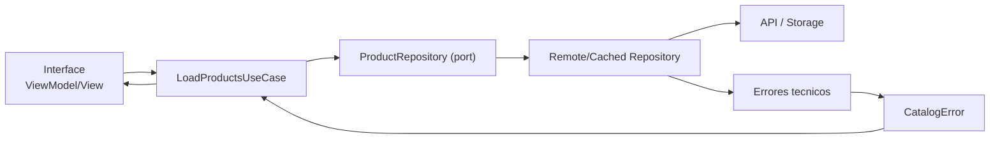
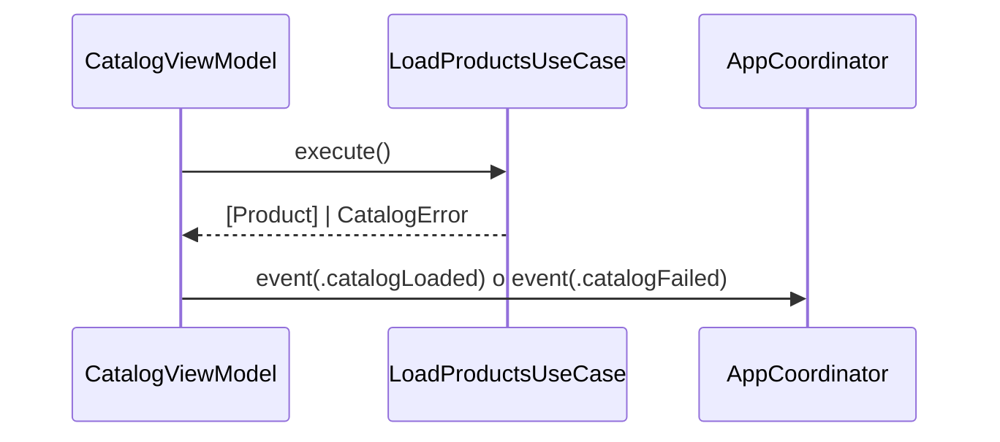

# Feature Catalog: Capa Application

## Objetivo de aprendizaje

Al terminar esta lección vas a dominar la responsabilidad real de Application en una feature de lectura (`Catalog`): orquestar el flujo de negocio, proteger contratos entre UI y Domain/Infrastructure, y mantener la puerta abierta para evolución (cache, filtros, paginación, políticas de consistencia) sin romper llamadas existentes.

En lenguaje simple: Application es el jefe de estación. No conduce todos los trenes, pero decide el orden de salida, qué hacer cuando falla una vía y cómo informar al resto del sistema.

---

## Definición simple

Application en `Catalog` es la capa que define casos de uso (`LoadProductsUseCase`) y puertos (`ProductRepository`) para ejecutar comportamientos de negocio sin conocer detalles de UI ni de red.

Regla clave:

- Application no sabe de `URLSession`, JSON ni SwiftUI.
- Application solo sabe de contratos y semántica de la feature.

---

## Relación con negocio (DDD)

Aunque `Catalog` sea un caso de lectura, sigue siendo negocio. No es “solo traer datos”.

Lo que negocio espera de Application:

- una operación clara: “cargar catálogo”;
- errores interpretables para decisiones de UX (`connectivity`, `invalidData`);
- comportamiento coherente cuando el resultado está vacío;
- punto único de evolución cuando aparezcan nuevas reglas.

Lenguaje ubicuo en esta lección:

- `LoadProductsUseCase`
- `ProductRepository`
- `CatalogError`

---

## Modelo mental: Application como adaptador semántico



Application no hace parseo ni renderizado, pero sí mantiene contrato semántico estable para toda la feature.

---

## Qué SÍ y qué NO hace Application

### Sí hace

- define casos de uso con intención de negocio;
- define puertos/protocolos requeridos por el caso de uso;
- orquesta flujo y decisiones de alto nivel;
- conserva semántica de errores para capa superior.

### No hace

- construir requests HTTP;
- parsear DTOs;
- decidir layout/estilos de UI;
- almacenar estado de pantalla.

Si ves `URLRequest` o `@State` dentro de Application, estás cruzando límites.

---

## Manos a Xcode: crear los archivos de Application de Catalog

Crea estos archivos de produccion (Target = **StackMyArchitecture**):

1. **Catalog/Application/Ports/ProductRepository.swift**
2. **Catalog/Application/UseCases/LoadProductsUseCase.swift**

Crea estos archivos de test (Target = **StackMyArchitectureTests**):

1. **Tests/Features/Catalog/Application/LoadProductsUseCaseTests.swift**
2. **Tests/Features/Catalog/Helpers/ProductRepositoryStub.swift** (incluira el stub y el spy)

Borra el contenido por defecto de todos.

---

## Contrato principal: ProductRepository

Abre `ProductRepository.swift` y escribe:

```swift
import Foundation

protocol ProductRepository: Sendable {
    func loadAll() async throws -> [Product]
}
```

**Por que `Sendable` en un protocolo:** Cuando escribes `protocol ProductRepository: Sendable`, le dices a Swift: "cualquier tipo que implemente este protocolo debe ser seguro para concurrencia". Esto es necesario porque el `LoadProductsUseCase` guarda una referencia al repositorio (`any ProductRepository`) y lo llama desde una funcion `async`. Si el protocolo no fuera `Sendable`, Swift 6 no te dejaria guardar esa referencia ni llamar al repositorio desde un contexto concurrente.

**Por que `async throws`:** `async` porque cargar productos implica una operacion lenta (red o disco) que no debe bloquear la interfaz. `throws` porque esa operacion puede fallar (sin internet, datos corruptos). El tipo de retorno `[Product]` devuelve modelos de dominio, no DTOs — el repositorio traduce internamente.

Por que este puerto/protocolo esta bien disenado para etapa 2:

- expresa intencion de negocio ("cargar todos los productos");
- no filtra detalles tecnicos;
- es facil de stubear en TDD;
- permite implementaciones multiples (remote, cached, hibrida).

---

## Caso de uso: LoadProductsUseCase

Abre `LoadProductsUseCase.swift` y escribe:

```swift
import Foundation

struct LoadProductsUseCase: Sendable {
    private let repository: any ProductRepository

    init(repository: any ProductRepository) {
        self.repository = repository
    }

    func execute() async throws -> [Product] {
        try await repository.loadAll()
    }
}
```

**Por que `Sendable` en el UseCase:** El ViewModel (que vive en `@MainActor`) guarda una referencia al `LoadProductsUseCase` y lo llama con `await`. Eso significa que el UseCase cruza la frontera entre el hilo principal y el contexto `async`. Swift 6 exige que sea `Sendable`. Como es un `struct` con una sola propiedad `let` (el repositorio, que tambien es `Sendable` por protocolo), Swift verifica automaticamente que es seguro.

**Por que `any ProductRepository`:** La palabra `any` le dice a Swift: "no se cual es el tipo concreto, solo se que conforma `ProductRepository`". Esto es inyeccion de dependencias — en produccion sera un `RemoteProductRepository`, en tests sera un `ProductRepositoryStub`, en previews sera un `StubProductRepository`. El UseCase no sabe ni le importa cual es.

Parece simple, y es correcto que lo sea en esta etapa.

Punto arquitectonico importante:

- la simplicidad actual no invalida el caso de uso;
- el caso de uso es el punto de extension para reglas futuras sin tocar UI.

---

## BDD -> Application (trazabilidad)

### Escenario happy

- Given repositorio devuelve productos válidos,
- When se ejecuta `LoadProductsUseCase`,
- Then se devuelve lista de `Product`.

### Escenario sad

- Given fallo de conectividad,
- When se ejecuta `LoadProductsUseCase`,
- Then se propaga `CatalogError.connectivity`.

### Escenario edge

- Given repositorio devuelve lista vacía,
- When se ejecuta `LoadProductsUseCase`,
- Then resultado es `[]` válido (no error).

Esta trazabilidad evita decisiones ambiguas en UI y en pruebas.

---

## Plan TDD paso a paso

1. Red: test de éxito devolviendo lista.
2. Green: implementación mínima delegando en puerto.
3. Red: test de error `connectivity`.
4. Green: propagación de error semántico.
5. Red: test de lista vacía.
6. Refactor: mejorar helpers/nombres de test.

Aunque el caso de uso sea pequeño, el test-first sigue siendo valioso porque define contrato explícito.

---

## Tests: versión mínima y versión realista

### Mínimo imprescindible

Abre `LoadProductsUseCaseTests.swift` y escribe:

```swift
import XCTest
@testable import StackMyArchitecture

final class LoadProductsUseCaseTests: XCTestCase {
    func test_execute_returnsProductsOnRepositorySuccess() async throws {
        let expected = [makeProduct("1"), makeProduct("2")]
        let repository = ProductRepositoryStub(result: .success(expected))
        let sut = LoadProductsUseCase(repository: repository)

        let result = try await sut.execute()

        XCTAssertEqual(result, expected)
    }

    private func makeProduct(_ id: String) -> Product {
        Product(
            id: id,
            name: "Product \(id)",
            price: Price(amount: 10, currency: "EUR"),
            imageURL: URL(string: "https://example.com/\(id).png")!
        )
    }
}
```

### Cobertura realista de etapa

```swift
import XCTest

final class LoadProductsUseCaseContractTests: XCTestCase {
    func test_execute_throwsConnectivityOnConnectivityFailure() async {
        let repository = ProductRepositoryStub(result: .failure(.connectivity))
        let sut = LoadProductsUseCase(repository: repository)

        await XCTAssertThrowsErrorAsync(try await sut.execute()) { error in
            XCTAssertEqual(error as? CatalogError, .connectivity)
        }
    }

    func test_execute_throwsInvalidDataOnInvalidDataFailure() async {
        let repository = ProductRepositoryStub(result: .failure(.invalidData))
        let sut = LoadProductsUseCase(repository: repository)

        await XCTAssertThrowsErrorAsync(try await sut.execute()) { error in
            XCTAssertEqual(error as? CatalogError, .invalidData)
        }
    }

    func test_execute_returnsEmptyArray_whenRepositoryIsEmpty() async throws {
        let repository = ProductRepositoryStub(result: .success([]))
        let sut = LoadProductsUseCase(repository: repository)

        let result = try await sut.execute()

        XCTAssertTrue(result.isEmpty)
    }

    func test_execute_callsRepositoryExactlyOnce() async throws {
        let repository = ProductRepositorySpy(result: .success([]))
        let sut = LoadProductsUseCase(repository: repository)

        _ = try await sut.execute()

        let calls = await repository.loadCallCount
        XCTAssertEqual(calls, 1)
    }
}
```

---

## Dobles de test seguros en concurrencia

Abre `ProductRepositoryStub.swift` y escribe ambos tipos (stub y spy) en el mismo archivo:

```swift
import Foundation
@testable import StackMyArchitecture

struct ProductRepositoryStub: ProductRepository, Sendable {
    let result: Result<[Product], CatalogError>

    func loadAll() async throws -> [Product] {
        try result.get()
    }
}

actor ProductRepositorySpy: ProductRepository {
    private(set) var loadCallCount = 0
    private let result: Result<[Product], CatalogError>

    init(result: Result<[Product], CatalogError>) {
        self.result = result
    }

    func loadAll() async throws -> [Product] {
        loadCallCount += 1
        return try result.get()
    }
}
```

Uso de `actor` en spy evita data races si cambias a pruebas concurrentes más agresivas en etapas posteriores.

---

## Concurrencia (Swift 6.2) aplicada a Application

### Aislamiento

`LoadProductsUseCase` no requiere `@MainActor`. Es lógica de negocio pura.

### `Sendable`

- caso de uso `Sendable`;
- puerto `Sendable`;
- modelos de dominio `Sendable`.

### Cancelación

Application no “gestiona la vista”, pero debe respetar cancelación de `Task` superior. Si la tarea se cancela, no debe convertir cancelación en éxito falso.

### Backpressure

Si UI dispara `execute()` múltiples veces, policy de “última petición gana” se gestiona en ViewModel/coordinator, no en el caso de uso.

Application debe mantenerse predecible e idempotente.

---

## Integración con navegación por eventos

Application devuelve resultado; Interface decide emitir evento.

Ejemplo conceptual:



Regla:

- UseCase no navega;
- UseCase no conoce coordinator;
- ViewModel/Coordinator consumen su contrato.

---

## Evolución futura prevista (sin romper contrato)

El diseño actual permite estas evoluciones:

1. añadir cache/offline por composición de repositorio;
2. añadir filtros/paginación como nuevos casos de uso (`SearchProductsUseCase`);
3. añadir política de reintentos en infraestructura;
4. añadir métricas de latencia por decoradores.

Todo eso sin cambiar `Interface` en cascada si se mantiene contrato de Application.

---

## Anti-patrones y depuración

### Anti-patrón 1: lógica de negocio en ViewModel

Síntoma:

- ViewModel decide si error es `connectivity` o `invalidData`.

Corrección:

- semántica debe venir ya modelada desde repo/use case.

### Anti-patrón 2: Application dependiendo de URLSession

Síntoma:

- `URLRequest` dentro de use case.

Corrección:

- mover a infraestructura detrás de puerto.

### Anti-patrón 3: usar caso de uso solo como passthrough sin tests

Síntoma:

- “es trivial, no hace falta test”.

Corrección:

- los tests documentan contrato y protegen evolución.

### Guía rápida de depuración

1. si UI muestra estado incorrecto, verifica contrato de error en use case;
2. si falla integración, revisa implementación de puerto, no use case primero;
3. si hay race sospechosa, inspecciona dobles no seguros en tests.

---

## Matriz de pruebas de Application

| Tipo de prueba | Qué valida | Coste | Frecuencia |
| --- | --- | --- | --- |
| Unit use case | contrato execute + propagación semántica | Bajo | Cada cambio |
| Unit dobles | seguridad/conteo de llamadas | Bajo | Cada cambio |
| Integration app+infra | ensamblaje con repositorio real | Medio | Por feature |

---

## A/B/C de diseño de Application en esta etapa

### Opción A: UseCase mínimo + puerto claro (decisión)

Ventajas:

- simple, legible y evolutivo.

Costes:

- parece “poco código” al principio.

### Opción B: eliminar UseCase y llamar repositorio desde VM

Ventajas:

- menos archivos iniciales.

Costes:

- acoplamiento UI-negocio y menor trazabilidad.

### Opción C: sobre-ingeniería de orquestadores complejos

Ventajas:

- flexibilidad futura aparente.

Costes:

- complejidad innecesaria en etapa 2.

Trigger para pasar de A a diseño más complejo:

- aparición de múltiples reglas de negocio en flujo de carga.

---

## ADR corto de la lección

```markdown
## ADR-002B: Application de Catalog con UseCase minimo y puerto ProductRepository
- Estado: Aprobado
- Contexto: feature de lectura con necesidad de contratos estables y evolución posterior
- Decisión: mantener `LoadProductsUseCase` como entrada única y delegar acceso en `ProductRepository`
- Consecuencias: simplicidad inicial alta y evolución segura por composición; más disciplina de test-first en contratos
- Fecha: 2026-02-07
```

---

## Checklist de calidad

- [ ] Application define puertos y casos de uso sin detalles técnicos.
- [ ] `LoadProductsUseCase` está cubierto por tests de contrato.
- [ ] Errores semánticos de la feature son observables desde Interface.
- [ ] Tipos/puertos de Application son `Sendable`.
- [ ] UseCase sigue siendo punto de entrada único para UI.

---

## Manos a Xcode: checkpoint de la leccion

1. Pulsa **Cmd + B**. Deberia decir **"Build Succeeded"**.
2. Pulsa **Cmd + U**. Deberia decir **"Test Succeeded"** con los tests de E1 + Catalog Domain + Catalog Application pasando.

### Checklist de calidad

- [ ] 2 archivos de produccion creados (ProductRepository, LoadProductsUseCase).
- [ ] 2 archivos de test creados (LoadProductsUseCaseTests, ProductRepositoryStub).
- [ ] Todos los tests pasando en verde (Cmd + U).
- [ ] Application define puertos/protocolos y casos de uso sin detalles tecnicos.
- [ ] Tipos/puertos de Application son `Sendable`.
- [ ] UseCase sigue siendo punto de entrada único para UI.

---

## Cierre

Una capa Application buena no se juzga por cuántas líneas tiene, sino por cuánto protege la arquitectura cuando cambian requisitos. En `Catalog`, este diseño te permite crecer sin deuda lateral: puedes evolucionar infraestructura y UI sin romper el corazón semántico del flujo.

**Anterior:** [Domain ←](01-domain.md) · **Siguiente:** [Infrastructure →](03-infrastructure.md)
