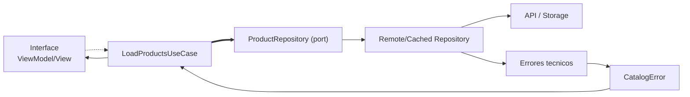
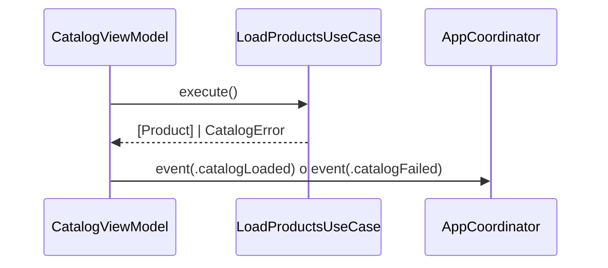

# Feature Catalog: Capa Application

> **Nota de nomenclatura pedagógica**
> Algunos snippets de esta lección usan `ProductRepository` como nombre conceptual.
> En el scaffold real (`apps/ios/ArchitectureKit`) el equivalente operativo es `CatalogRepository`.

## Objetivo de aprendizaje

Al terminar esta lección vas a dominar la responsabilidad real de Application en una feature de lectura (`Catalog`): orquestar el flujo de negocio, proteger contratos entre UI y Domain/Infrastructure, y mantener la puerta abierta para evolución (cache, filtros, paginación, políticas de consistencia) sin romper llamadas existentes.

En lenguaje simple: Application es el jefe de estación. No conduce todos los trenes, pero decide el orden de salida, qué hacer cuando falla una vía y cómo informar al resto del sistema.

---

## Definición simple

Application en `Catalog` es la capa que define casos de uso (`LoadProductsUseCase`) y puertos (`ProductRepository`) para ejecutar comportamientos de negocio sin conocer detalles de UI ni de red.

```swift
// ❌ Sin capa Application: ViewModel gestiona lógica de negocio y detalles técnicos
// Cuando aparecen nuevas reglas (filtros, políticas de reintento, cache),
// todas se acumulan en el ViewModel sin un punto de extensión claro
@MainActor
final class CatalogViewModel: ObservableObject {
    func load() async {
        let url = URL(string: "https://api.example.com/products")!
        let (data, resp) = try await URLSession.shared.data(from: url)  // sabe de red
        guard (resp as? HTTPURLResponse)?.statusCode == 200 else { return }
        let dtos = try JSONDecoder().decode([ProductDTO].self, from: data) // sabe de DTO
        products = dtos.map { Product(id: $0.id, name: $0.name, ...) }    // sabe de mapping
        // Añadir "filtra los descontinuados", "aplica descuento", "loguea latencia"
        // → todo en ViewModel, imposible de testear sin UI
    }
}

// ✅ Con capa Application: ViewModel solo transforma estado
// La lógica de negocio vive en LoadProductsUseCase, testeable sin UI ni red
@MainActor
final class CatalogViewModel: ObservableObject {
    func load() async {
        do {
            let products = try await useCase.execute()  // Application gestiona la lógica
            state = .loaded(products)                   // ViewModel solo transforma estado
        } catch let error as CatalogError {
            state = .error(error)
        }
    }
}
```

- Application no sabe de `URLSession`, JSON ni SwiftUI.
- Application solo sabe de contratos y semántica de la feature.

---

## Relación con negocio (DDD)

Aunque `Catalog` sea un caso de lectura, sigue siendo negocio. No es “solo traer datos”.

Lo que negocio espera de Application:

- una operación clara: “cargar catálogo”;
- errores interpretables para decisiones de UX (`connectivity`, `invalidData`);
- comportamiento coherente cuando el resultado está vacío;
- punto único de evolución cuando aparezcan nuevas reglas.

Lenguaje ubicuo en esta lección:

- `LoadProductsUseCase`
- `ProductRepository`
- `CatalogError`

---

## Modelo mental: Application como adaptador semántico


```mermaid
flowchart LR
    UI["Interface\nViewModel/View"] -.-> UC["LoadProductsUseCase"]
    UC ==> PORT["ProductRepository (port)"]
    PORT --> INFRA["Remote/Cached Repository"]
    INFRA --> API["API / Storage"]

    INFRA --> ERRT["Errores tecnicos"]
    ERRT --> SEM["CatalogError"]
    SEM --> UC
    UC --> UI
```

Lectura paso a paso:

1. `UI -.- UC` (línea punteada): Interface usa `LoadProductsUseCase` pero no depende de él directamente en el sentido arquitectónico — Interface depende del contrato (la firma de `execute()`), no de la implementación. Si el UseCase cambia internamente, Interface no se entera mientras el contrato no cambie.
2. `UC ⇒ PORT` (línea gruesa): el UseCase tiene una dependencia fuerte con el puerto `ProductRepository` — es su única forma de obtener productos. La doble línea indica que esta es la dependencia nuclear del caso de uso.
3. `PORT → INFRA`: el puerto es implementado por Infrastructure. En producción, es `RemoteProductRepository`. En tests, es `ProductRepositoryStub`. El puerto es el punto donde se intercambia la implementación sin tocar el UseCase.
4. `ERRT → SEM → UC`: los errores técnicos que lanza Infrastructure (como `URLError`) se traducen a errores semánticos (`CatalogError`) antes de llegar al UseCase. El UseCase nunca ve `URLError` crudo — solo ve `CatalogError.connectivity` o `.invalidData`.

Application no hace parseo ni renderizado, pero sí mantiene contrato semántico estable para toda la feature.

---

## Qué SÍ y qué NO hace Application

### Sí hace

- define casos de uso con intención de negocio;
- define puertos/protocolos requeridos por el caso de uso;
- orquesta flujo y decisiones de alto nivel;
- conserva semántica de errores para capa superior.

### No hace

- construir requests HTTP;
- parsear DTOs;
- decidir layout/estilos de UI;
- almacenar estado de pantalla.

Si ves `URLRequest` o `@State` dentro de Application, estás cruzando límites.

```swift
// ❌ Application cruzando límites — sabe de red y de UI
struct LoadProductsUseCase: Sendable {
    func execute() async throws -> [Product] {
        let url = URL(string: "https://api.example.com/products")!
        let (data, _) = try await URLSession.shared.data(from: url)  // ❌ detalle de red
        return try JSONDecoder().decode([ProductDTO].self, from: data)
            .map { Product(id: $0.id, name: $0.name, price: ..., imageURL: ...) }
    }
}

// ✅ Application solo conoce el contrato del puerto
struct LoadProductsUseCase: Sendable {
    private let repository: any ProductRepository

    func execute() async throws -> [Product] {
        try await repository.loadAll()  // ← URLSession, JSON y mapping viven en Infrastructure
    }
}
```

---

## Manos a Xcode: crear los archivos de Application de Catalog

Crea estos archivos de produccion (Target = **StackMyArchitecture**):

1. **Catalog/Application/Ports/ProductRepository.swift**
2. **Catalog/Application/UseCases/LoadProductsUseCase.swift**

Crea estos archivos de test (Target = **StackMyArchitectureTests**):

1. **Tests/Features/Catalog/Application/LoadProductsUseCaseTests.swift**
2. **Tests/Features/Catalog/Helpers/ProductRepositoryStub.swift** (incluira el stub y el spy)

Borra el contenido por defecto de todos.

---

## Contrato principal: ProductRepository

Abre `ProductRepository.swift` y escribe:

```swift
import Foundation

protocol ProductRepository: Sendable {
    func loadAll() async throws -> [Product]
}
```

**Por que `Sendable` en un protocolo:** Cuando escribes `protocol ProductRepository: Sendable`, le dices a Swift: "cualquier tipo que implemente este protocolo debe ser seguro para concurrencia". Esto es necesario porque el `LoadProductsUseCase` guarda una referencia al repositorio (`any ProductRepository`) y lo llama desde una función `async`. Si el protocolo no fuera `Sendable`, Swift 6 no te dejaria guardar esa referencia ni llamar al repositorio desde un contexto concurrente.

**Por que `async throws`:** `async` porque cargar productos implica una operación lenta (red o disco) que no debe bloquear la interfaz. `throws` porque esa operación puede fallar (sin internet, datos corruptos). El tipo de retorno `[Product]` devuelve modelos de dominio, no DTOs — el repositorio traduce internamente.

Por que este puerto/protocolo esta bien disenado para etapa 2:

- expresa intencion de negocio ("cargar todos los productos");
- no filtra detalles técnicos;
- es facil de stubear en TDD;
- permite implementaciones multiples (remote, cached, hibrida).

---

## Caso de uso: LoadProductsUseCase

Abre `LoadProductsUseCase.swift` y escribe:

```swift
import Foundation

struct LoadProductsUseCase: Sendable {
    private let repository: any ProductRepository

    init(repository: any ProductRepository) {
        self.repository = repository
    }

    func execute() async throws -> [Product] {
        try await repository.loadAll()
    }
}
```

**Por que `Sendable` en el UseCase:** El ViewModel (que vive en `@MainActor`) guarda una referencia al `LoadProductsUseCase` y lo llama con `await`. Eso significa que el UseCase cruza la frontera entre el hilo principal y el contexto `async`. Swift 6 exige que sea `Sendable`. Como es un `struct` con una sola propiedad `let` (el repositorio, que tambien es `Sendable` por protocolo), Swift verifica automáticamente que es seguro.

**Por que `any ProductRepository`:** La palabra `any` le dice a Swift: "no se cual es el tipo concreto, solo se que conforma `ProductRepository`". Esto es inyección de dependencias — en produccion sera un `RemoteProductRepository`, en tests sera un `ProductRepositoryStub`, en previews sera un `StubProductRepository`. El UseCase no sabe ni le importa cual es.

Parece simple, y es correcto que lo sea en esta etapa.

Punto arquitectonico importante:

- la simplicidad actual no invalida el caso de uso;
- el caso de uso es el punto de extension para reglas futuras sin tocar UI.

---

## BDD -> Application (trazabilidad)

### Escenario happy

- Given repositorio devuelve productos válidos,
- When se ejecuta `LoadProductsUseCase`,
- Then se devuelve lista de `Product`.

### Escenario sad

- Given fallo de conectividad,
- When se ejecuta `LoadProductsUseCase`,
- Then se propaga `CatalogError.connectivity`.

### Escenario edge

- Given repositorio devuelve lista vacía,
- When se ejecuta `LoadProductsUseCase`,
- Then resultado es `[]` válido (no error).

Esta trazabilidad evita decisiones ambiguas en UI y en pruebas.

---

## Plan TDD paso a paso

**Paso 1 — Red: test de éxito.** El test no compila porque `LoadProductsUseCase` no existe aún. Escribirlo primero define su interfaz pública: acepta `repository: any ProductRepository`, tiene un método `execute()` que devuelve `[Product]`.

```swift
func test_execute_returnsProductsOnRepositorySuccess() async throws {
    let expected = [makeProduct("1")]
    let repository = ProductRepositoryStub(result: .success(expected))
    let sut = LoadProductsUseCase(repository: repository)  // no existe aún → no compila
    let result = try await sut.execute()
    XCTAssertEqual(result, expected)
}
// El test dice exactamente cómo se construye y se usa el UseCase.
```

**Paso 2 — Green: implementación mínima.** Solo lo que hace pasar el test — delegar en el puerto:

```swift
struct LoadProductsUseCase: Sendable {
    private let repository: any ProductRepository
    init(repository: any ProductRepository) { self.repository = repository }
    func execute() async throws -> [Product] { try await repository.loadAll() }
}
```

**Paso 3 — Red: test de error `connectivity`.** El UseCase debe propagar el error semántico sin transformarlo:

```swift
func test_execute_throwsConnectivityOnConnectivityFailure() async {
    let repository = ProductRepositoryStub(result: .failure(.connectivity))
    let sut = LoadProductsUseCase(repository: repository)
    do {
        _ = try await sut.execute()
        XCTFail("Expected CatalogError.connectivity")
    } catch {
        XCTAssertEqual(error as? CatalogError, .connectivity)
    }
}
```

**Paso 4 — Green.** El test ya pasa: `execute()` hace `try await repository.loadAll()` que propaga el error directamente.

**Paso 5 — Red: test de lista vacía.** Documenta explícitamente que `[]` es resultado válido, no error:

```swift
func test_execute_returnsEmptyArray_whenRepositoryReturnsEmpty() async throws {
    let repository = ProductRepositoryStub(result: .success([]))
    let sut = LoadProductsUseCase(repository: repository)
    let result = try await sut.execute()
    XCTAssertTrue(result.isEmpty)
    // Sin este test, alguien podría añadir "guard !products.isEmpty else { throw .invalidData }"
    // y romper el comportamiento sin darse cuenta.
}
```

**Paso 6 — Refactor.** Extraer `makeProduct(_:)` helper y `ProductRepositoryStub` a ficheros compartidos de test. Los nombres de test ahora son claros y los helpers reutilizables.

Aunque el caso de uso sea pequeño, el test-first sigue siendo valioso porque define contrato explícito.

---

## Tests: versión mínima y versión realista

### Mínimo imprescindible

Abre `LoadProductsUseCaseTests.swift` y escribe:

```swift
import XCTest
@testable import StackMyArchitecture

final class LoadProductsUseCaseTests: XCTestCase {
    func test_execute_returnsProductsOnRepositorySuccess() async throws {
        let expected = [makeProduct("1"), makeProduct("2")]
        let repository = ProductRepositoryStub(result: .success(expected))
        let sut = LoadProductsUseCase(repository: repository)

        let result = try await sut.execute()

        XCTAssertEqual(result, expected)
    }

    private func makeProduct(_ id: String) -> Product {
        Product(
            id: id,
            name: "Product \(id)",
            price: Price(amount: 10, currency: "EUR"),
            imageURL: URL(string: "https://example.com/\(id).png")!
        )
    }
}
```

**`async throws` en la firma del test** — `async` porque `execute()` es asíncrono; el test necesita esperar su resultado. `throws` porque si el test falla con un error inesperado, XCTest lo recoge y lo reporta como fallo, en lugar de crashear.

**`makeProduct(_ id: String)`** — factory helper que centraliza la construcción de `Product` en los tests. Si mañana `Product` añade un campo obligatorio, solo cambias este método y todos los tests se adaptan. Sin este patrón, cada test construye su propio `Product` y un cambio de modelo rompe decenas de líneas dispersas.

**`ProductRepositoryStub(result: .success(expected))`** — el stub devuelve exactamente lo que le dices. No hay red, no hay disco. El test controla el resultado con precisión y ejecuta en microsegundos.

**`XCTAssertEqual(result, expected)`** — verifica que el caso de uso devuelve los productos que el repositorio entregó, sin modificarlos ni perder ninguno. Si el UseCase filtrara o transformara datos sin permiso, este test fallaría.

### Cobertura realista de etapa

```swift
import XCTest

final class LoadProductsUseCaseContractTests: XCTestCase {
    func test_execute_throwsConnectivityOnConnectivityFailure() async {
        let repository = ProductRepositoryStub(result: .failure(.connectivity))
        let sut = LoadProductsUseCase(repository: repository)

        // XCTest no tiene XCTAssertThrowsError para async; se usa do/catch explícito
        do {
            _ = try await sut.execute()
            XCTFail("Expected CatalogError.connectivity to be thrown")
        } catch {
            XCTAssertEqual(error as? CatalogError, .connectivity)
        }
    }

    func test_execute_throwsInvalidDataOnInvalidDataFailure() async {
        let repository = ProductRepositoryStub(result: .failure(.invalidData))
        let sut = LoadProductsUseCase(repository: repository)

        do {
            _ = try await sut.execute()
            XCTFail("Expected CatalogError.invalidData to be thrown")
        } catch {
            XCTAssertEqual(error as? CatalogError, .invalidData)
        }
    }

    func test_execute_returnsEmptyArray_whenRepositoryIsEmpty() async throws {
        let repository = ProductRepositoryStub(result: .success([]))
        let sut = LoadProductsUseCase(repository: repository)

        let result = try await sut.execute()

        XCTAssertTrue(result.isEmpty)
    }

    func test_execute_callsRepositoryExactlyOnce() async throws {
        let repository = ProductRepositorySpy(result: .success([]))
        let sut = LoadProductsUseCase(repository: repository)

        _ = try await sut.execute()

        let calls = await repository.loadCallCount
        XCTAssertEqual(calls, 1)
    }
}
```

**Patrón `do/catch` en tests async** — XCTest no tiene `XCTAssertThrowsError` para funciones `async`. El patrón correcto es: intentar ejecutar, llamar `XCTFail()` si no lanza (porque se esperaba un error), y verificar el error en el `catch`. El `XCTFail()` en la línea del `try` es la clave: sin él, si el código no lanza, el test pasa en silencio aunque el comportamiento sea incorrecto.

**`error as? CatalogError`** — el `catch` captura cualquier `Error`. El cast a `CatalogError` verifica que el UseCase no solo lanzó algo, sino que lanzó exactamente el tipo semántico correcto. Si el UseCase dejara escapar un `URLError` crudo en lugar de traducirlo a `CatalogError`, este cast devolvería `nil` y el `XCTAssertEqual` fallaría.

**`test_execute_returnsEmptyArray_whenRepositoryIsEmpty`** — documenta explícitamente que una lista vacía es un resultado válido, no un error. Sin este test, alguien podría añadir `guard !products.isEmpty else { throw CatalogError.invalidData }` pensando que es una mejora, y lo rompería sin saberlo.

**`ProductRepositorySpy` y `await repository.loadCallCount`** — el spy es un actor, por eso necesita `await` para acceder a su propiedad. Esto garantiza que la lectura del contador es segura aunque el test se ejecute en un contexto concurrente. El test verifica que el UseCase llama al repositorio exactamente una vez: ni cero (bug de lógica), ni dos (bug de cache o retry no intencionado).

---

## Dobles de test seguros en concurrencia

Abre `ProductRepositoryStub.swift` y escribe ambos tipos (stub y spy) en el mismo archivo:

```swift
import Foundation
@testable import StackMyArchitecture

struct ProductRepositoryStub: ProductRepository, Sendable {
    let result: Result<[Product], CatalogError>

    func loadAll() async throws -> [Product] {
        try result.get()
    }
}

actor ProductRepositorySpy: ProductRepository {
    private(set) var loadCallCount = 0
    private let result: Result<[Product], CatalogError>

    init(result: Result<[Product], CatalogError>) {
        self.result = result
    }

    func loadAll() async throws -> [Product] {
        loadCallCount += 1
        return try result.get()
    }
}
```

**`struct` para el Stub** — el stub no tiene estado mutable: recibe el resultado en `init` y lo devuelve siempre igual. Por eso es un `struct`. Swift garantiza automáticamente que es `Sendable` porque todos sus campos son `let` y de tipo `Sendable`. No necesitas `actor` ni `@unchecked Sendable`.

**`Result<[Product], CatalogError>`** — usar `Result` en el stub permite representar tanto éxito (`.success([...])`) como fallo (`.failure(.connectivity)`) con el mismo tipo, sin duplicar structs. El test elige qué escenario simular en el momento de construcción.

**`try result.get()`** — `Result.get()` convierte el `Result` en un valor o lanza el error. Si es `.success`, devuelve el array. Si es `.failure`, lanza el error. Es la forma idiomática de convertir `Result` en una función `throws` en Swift.

**`actor` para el Spy** — el spy sí tiene estado mutable: el contador `loadCallCount` se incrementa con cada llamada. Si el spy fuera un `struct` o una clase sin protección, dos tareas concurrentes podrían incrementar el contador al mismo tiempo y producir un resultado incorrecto (data race). `actor` serializa el acceso automáticamente, lo que hace el spy seguro en tests concurrentes sin `@unchecked Sendable`.

**`private(set) var loadCallCount`** — `private(set)` significa que solo el propio actor puede escribir en `loadCallCount`, pero cualquier código externo puede leerlo (con `await`). Esto previene que un test modifique accidentalmente el contador y falsee el resultado.

---

## Concurrencia (Swift 6.2) aplicada a Application

### Aislamiento

`LoadProductsUseCase` no requiere `@MainActor`. Es lógica de negocio pura: no actualiza la UI, no lee estado de pantalla, no tiene efectos secundarios sobre el hilo principal. Forzarle `@MainActor` sería un error de diseño — ejecutaría en el hilo principal sin necesidad, bloqueando interacciones del usuario durante la carga.

### `Sendable`

- caso de uso `Sendable` — el ViewModel (`@MainActor`) guarda una referencia al UseCase y lo llama con `await`; sin `Sendable`, Swift 6 rechaza esa referencia en compilación;
- puerto `Sendable` — el UseCase guarda el repositorio como `any ProductRepository`; si el protocolo no fuera `Sendable`, el UseCase tampoco podría serlo;
- modelos de dominio `Sendable` — `[Product]` cruza desde el contexto async del repositorio hasta el `@MainActor` del ViewModel; sin `Sendable`, esa transferencia es un error de compilación en Swift 6.

La cadena `Sendable` es completa o no funciona: si un eslabón falla, el compilador te lo indica con un error claro.

### Cancelación

Application no gestiona la vista, pero sí debe respetar la cancelación de la `Task` que la lanzó. `async/await` en Swift propaga la cancelación automáticamente: si el ViewModel cancela la tarea mientras `execute()` está esperando respuesta, `repository.loadAll()` recibe la señal de cancelación y lanza `CancellationError`. El UseCase no necesita código extra para esto — no debe capturar ni silenciar `CancellationError`, porque convertirlo en éxito falso rompería el comportamiento esperado por quien lanzó la tarea.

### Backpressure

Si el usuario pulsa “recargar” tres veces seguidas, el ViewModel puede llamar `execute()` tres veces. La política de “última petición gana” (cancelar las anteriores cuando llega una nueva) se implementa en el ViewModel o coordinador, no en el UseCase. El UseCase debe mantenerse predecible e idempotente: la misma entrada produce siempre la misma salida, sin importar cuántas veces se llame ni en qué orden.

---

## Integración con navegación por eventos

Application devuelve resultado; Interface decide emitir evento.

Ejemplo conceptual:


```mermaid
sequenceDiagram
    participant VM as CatalogViewModel
    participant UC as LoadProductsUseCase
    participant CO as AppCoordinator

    VM->>UC: execute()
    UC-->>VM: [Product] | CatalogError
    VM->>CO: event(.catalogLoaded) o event(.catalogFailed)
```

**Lectura del diagrama:** el ViewModel llama a `execute()` y espera el resultado. Con ese resultado, el ViewModel decide qué evento emitir al coordinador: si la carga fue exitosa, `.catalogLoaded`; si falló, `.catalogFailed`. El UseCase no sabe que existe el coordinador, y el coordinador no sabe que existe el UseCase. La separación es total: cada pieza hace exactamente una cosa.

Regla:

- UseCase no navega: no llama a coordinador ni modifica estado de pantalla;
- UseCase no conoce coordinator: no tiene referencia ni importa su módulo;
- ViewModel/Coordinator consumen su contrato: reciben el resultado y deciden qué hacer con él.

---

## Evolución futura prevista (sin romper contrato)

El diseño actual permite estas evoluciones:

1. añadir cache/offline por composición de repositorio;
2. añadir filtros/paginación como nuevos casos de uso (`SearchProductsUseCase`);
3. añadir política de reintentos en infraestructura;
4. añadir métricas de latencia por decoradores.

Todo eso sin cambiar `Interface` en cascada si se mantiene contrato de Application.

---

## Anti-patrones y depuración

### Anti-patrón 1: lógica de negocio en ViewModel

Síntoma: el ViewModel inspecciona el error técnico y decide su semántica. La lógica de clasificación de errores se duplica o se dispersa por la capa Interface.

```swift
// ❌ Mal — ViewModel interpreta el error técnico
func loadProducts() async {
    do {
        products = try await URLSession.shared.fetchProducts()
    } catch let urlError as URLError {
        if urlError.code == .notConnectedToInternet {
            state = .error(.connectivity)   // ❌ ViewModel decide qué significa cada error
        } else {
            state = .error(.invalidData)    // ❌ clasificación dispersa, difícil de testear
        }
    }
}

// ✅ Bien — UseCase/repositorio entrega el error ya semántico
func loadProducts() async {
    do {
        let products = try await useCase.execute()
        state = .loaded(products)
    } catch let error as CatalogError {
        state = .error(error)   // ✅ ViewModel transforma estado, no interpreta errores
    }
}
```

### Anti-patrón 2: Application dependiendo de URLSession

Síntoma: `import Foundation` con `URLRequest` o `URLSession` dentro del caso de uso. Application conoce detalles del transporte HTTP.

```swift
// ❌ Mal — Application sabe de red, headers y formato
struct LoadProductsUseCase: Sendable {
    func execute() async throws -> [Product] {
        var request = URLRequest(url: URL(string: “https://api.example.com/products”)!)
        request.setValue(“Bearer \(token)”, forHTTPHeaderField: “Authorization”)
        let (data, _) = try await URLSession.shared.data(for: request)
        return try JSONDecoder().decode([ProductDTO].self, from: data)
            .map { /* mapping aquí también */ }
    }
}
// Cambiar de REST a GraphQL, añadir autenticación o cambiar el endpoint
// obliga a editar el caso de uso. Application se vuelve frágil.

// ✅ Bien — Application solo conoce el contrato
struct LoadProductsUseCase: Sendable {
    private let repository: any ProductRepository

    func execute() async throws -> [Product] {
        try await repository.loadAll()
        // URLSession, headers, DTOs y mapping viven en Infrastructure detrás del puerto
    }
}
```

### Anti-patrón 3: usar caso de uso solo como passthrough sin tests

Síntoma: “es trivial, no hace falta test”. El caso de uso se deja sin cobertura porque parece obvio.

```swift
// ❌ Sin tests, estas preguntas quedan sin respuesta documentada:
// - ¿propaga CatalogError.connectivity o lo convierte en algo distinto?
// - ¿qué devuelve si el repositorio devuelve []? ¿es error o estado válido?
// - ¿llama al repositorio exactamente una vez o puede llamarlo dos veces?

// ✅ Bien — los tests documentan el contrato y protegen la evolución
func test_execute_returnsEmptyArray_whenRepositoryIsEmpty() async throws {
    let repository = ProductRepositoryStub(result: .success([]))
    let sut = LoadProductsUseCase(repository: repository)

    let result = try await sut.execute()

    XCTAssertTrue(result.isEmpty)
    // Documenta explícitamente que [] es resultado válido, no un error.
    // Si alguien añade lógica “si vacío, lanza error”, este test lo detecta.
}

func test_execute_callsRepositoryExactlyOnce() async throws {
    let spy = ProductRepositorySpy(result: .success([]))
    _ = try await LoadProductsUseCase(repository: spy).execute()
    let count = await spy.loadCallCount
    XCTAssertEqual(count, 1)
    // Si mañana añades cache y llamas al repositorio dos veces por error, este test falla.
}
```

### Guía rápida de depuración

1. si UI muestra estado incorrecto, verifica contrato de error en use case;
2. si falla integración, revisa implementación de puerto, no use case primero;
3. si hay race sospechosa, inspecciona dobles no seguros en tests.

---

## Matriz de pruebas de Application

| Tipo de prueba | Qué valida | Coste | Frecuencia |
| --- | --- | --- | --- |
| Unit use case | contrato execute + propagación semántica | Bajo | Cada cambio |
| Unit dobles | seguridad/conteo de llamadas | Bajo | Cada cambio |
| Integration app+infra | ensamblaje con repositorio real | Medio | Por feature |

---

## A/B/C de diseño de Application en esta etapa

La elección de cómo diseñar esta capa no es dogmática: depende de cuántas reglas de negocio hay hoy y qué evidencia de complejidad futura tienes. En Etapa 2, la evidencia es escasa, así que la apuesta es la más sencilla que resuelve el problema real.

### Opción A: UseCase mínimo + puerto claro (decisión actual)

Ventajas:

- contrato explícito entre Interface y negocio desde el primer día;
- fácil de testear sin UI ni red;
- punto de extensión natural cuando aparezcan nuevas reglas.

Costes:

- parece “poco código” al principio — algunos equipos cuestionan su valor;
- requiere disciplina para no saltárselo cuando parece trivial.

```swift
// ✅ Opción A — lo que tenemos en Etapa 2
protocol ProductRepository: Sendable {
    func loadAll() async throws -> [Product]
}

struct LoadProductsUseCase: Sendable {
    private let repository: any ProductRepository

    init(repository: any ProductRepository) {
        self.repository = repository
    }

    func execute() async throws -> [Product] {
        try await repository.loadAll()
    }
}
// Resultado: Interface llama a execute(), ignora la red.
// Si mañana añades cache, filtros o métricas, solo tocas este caso de uso.
// Interface no se entera del cambio.
```

### Opción B: eliminar UseCase y llamar repositorio desde ViewModel

Ventajas:

- menos archivos iniciales;
- menos capas que entender en proyectos muy pequeños.

Costes:

- cuando aparecen reglas de negocio, se acumulan en el ViewModel;
- testear lógica de orquestación requiere instanciar UI o mocks de vista;
- menor trazabilidad entre escenarios BDD y código.

```swift
// ❌ Opción B — ViewModel llama al repositorio directamente
@MainActor
final class CatalogViewModel: ObservableObject {
    private let repository: any ProductRepository  // ViewModel conoce el puerto

    func load() async {
        state = .loading
        do {
            let products = try await repository.loadAll()
            // Si aparecen reglas: filtrar por stock, aplicar descuentos, reintentar...
            // todo se acumula aquí. ViewModel crece sin límite claro.
            state = products.isEmpty ? .empty : .loaded(products)
        } catch let error as CatalogError {
            state = .error(error)
        }
    }
}
```

### Opción C: orquestadores complejos desde ya

Ventajas:

- máxima flexibilidad teórica para casos de uso con múltiples inputs/outputs.

Costes:

- complejidad innecesaria sin evidencia de que la necesitas en Etapa 2;
- los protocolos genéricos oscurecen la intención de negocio;
- el equipo tarda más en entender qué hace cada pieza.

```swift
// ❌ Opción C — sobre-ingeniería prematura
protocol UseCase {
    associatedtype Input
    associatedtype Output
    func execute(_ input: Input) async throws -> Output
}

struct LoadProductsInput { var filters: [String]; var page: Int }   // ¿qué filtros? ¿qué página?
struct LoadProductsOutput { var products: [Product]; var hasNextPage: Bool }

struct LoadProductsUseCase: UseCase {
    func execute(_ input: LoadProductsInput) async throws -> LoadProductsOutput { ... }
}
// En Etapa 2 no hay filtros ni paginación.
// Este diseño añade complejidad que no tienes evidencia de necesitar todavía.
```

Trigger para evolucionar de A hacia diseño más complejo:

- el caso de uso supera las 30-40 líneas con orquestación real (validaciones, políticas, múltiples fuentes de datos);
- aparecen varios casos de uso que comparten comportamiento común que vale la pena abstraer;
- el equipo tiene evidencia de paginación o filtros como requisito confirmado.

Mientras esos síntomas no existan, la Opción A es la decisión correcta.

---

## ADR corto de la lección

```markdown
## ADR-002B: Application de Catalog con UseCase minimo y puerto ProductRepository
- Estado: Aprobado
- Contexto: feature de lectura con necesidad de contratos estables y evolución posterior
- Decisión: mantener `LoadProductsUseCase` como entrada única y delegar acceso en `ProductRepository`
- Consecuencias: simplicidad inicial alta y evolución segura por composición; más disciplina de test-first en contratos
- Fecha: 2026-02-07
```

---

## Manos a Xcode: checkpoint de la lección

1. Pulsa **Cmd + B**. Deberia decir **"Build Succeeded"**.
2. Pulsa **Cmd + U**. Deberia decir **"Test Succeeded"** con los tests de E1 + Catalog Domain + Catalog Application pasando.

## Checklist de calidad

- [ ] 2 archivos de producción creados (`ProductRepository.swift`, `LoadProductsUseCase.swift`).
- [ ] 2 archivos de test creados (`LoadProductsUseCaseTests.swift`, `ProductRepositoryStub.swift`).
- [ ] Todos los tests pasando en verde (Cmd + U).
- [ ] Application define puertos/protocolos y casos de uso sin detalles técnicos.
- [ ] Tipos y puertos de Application son `Sendable`.
- [ ] `LoadProductsUseCase` es el punto de entrada único para Interface.
- [ ] Errores semánticos (`CatalogError`) son observables desde Interface sin reinterpretar.

---

## Cierre

Una capa Application buena no se juzga por cuántas líneas tiene, sino por cuánto protege la arquitectura cuando cambian requisitos. En `Catalog`, este diseño te permite crecer sin deuda lateral: puedes evolucionar infraestructura y UI sin romper el corazón semántico del flujo.

---

## Implementación en tu proyecto

El scaffold real ya tiene `LoadCatalogUseCase` y `CatalogRepository` en `Sources/FeatureCatalogDomain/`. Ábrelos ahora:

| Concepto en lección | Fichero en scaffold | Diferencia clave |
|---|---|---|
| `ProductRepository` (protocol) | `Sources/FeatureCatalogDomain/CatalogRepository.swift` | Método `fetchCatalog()` (no `loadAll()`) |
| `LoadProductsUseCase` | `Sources/FeatureCatalogDomain/LoadCatalogUseCase.swift` | Nombre `LoadCatalogUseCase`; misma estructura |

```swift
// Lo que ya existe en el scaffold
// Sources/FeatureCatalogDomain/CatalogRepository.swift
public protocol CatalogRepository: Sendable {
    func fetchCatalog() async throws -> [Product]
}

// Sources/FeatureCatalogDomain/LoadCatalogUseCase.swift
public struct LoadCatalogUseCase: Sendable {
    private let repository: any CatalogRepository

    public init(repository: any CatalogRepository) {
        self.repository = repository
    }

    public func execute() async throws -> [Product] {
        try await repository.fetchCatalog()
    }
}
```

El patrón es idéntico al que enseña esta lección. Los únicos cambios son de nomenclatura: `ProductRepository` → `CatalogRepository`, `loadAll()` → `fetchCatalog()`, `LoadProductsUseCase` → `LoadCatalogUseCase`.

**Qué hacer ahora:**
1. Abre `Sources/FeatureCatalogDomain/CatalogRepository.swift` — ve la definición del puerto real.
2. Abre `Sources/FeatureCatalogDomain/LoadCatalogUseCase.swift` — confirma que es exactamente el mismo patrón que acabas de implementar.
3. Abre `Tests/FeatureCatalogDomainTests/` — revisa cómo el scaffold testea el UseCase real.

---

## Qué sigue

Con Application definida y testeada, el siguiente paso es construir el adaptador que conecta el puerto con la red real.

→ [Feature Catalog: Capa Infrastructure](03-infrastructure.md) — repositorio remoto, mapping de DTOs y tests de integración.

