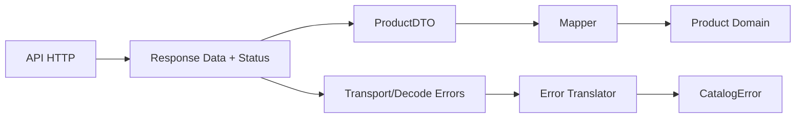

# Feature Catalog: Capa Infrastructure

## Objetivo de aprendizaje

Al terminar esta lección vas a poder construir una infraestructura de `Catalog` que conecte con red real sin contaminar el core de negocio, con contratos claros, traducción de errores consistente y pruebas de contrato estables.

Si lo explicamos como a un chaval de 14 años: Infrastructure es el traductor del equipo. Habla dos idiomas a la vez.

- Idioma externo: HTTP, JSON, status codes, timeouts.
- Idioma interno: `Product`, `Price`, `CatalogError`.

Si el traductor mezcla idiomas, todo el equipo acaba confundido. Si traduce bien, cada capa trabaja en paz.

---

## Relación con negocio (DDD)

En DDD, el dominio no debería enterarse de si un producto vino de REST, GraphQL, SQLite o un archivo local. El negocio solo quiere responder preguntas como:

- ¿puedo listar productos?
- ¿si falla la conectividad qué mensaje/estrategia aplico?
- ¿si los datos vienen corruptos cómo reacciono?

Por eso Infrastructure no decide reglas de negocio. Su trabajo es asegurar que el negocio recibe información limpia o errores semánticos útiles.

Invariante operativo de esta lección:

- nunca exponer detalles técnicos (`URLError`, JSON bruto, `HTTPURLResponse`) fuera de Infrastructure.

---

## Definición simple

Infrastructure es el conjunto de adaptadores concretos que implementan puertos definidos por Application/Domain.

En Catalog:

- `RemoteProductRepository` implementa `ProductRepository`.
- `HTTPClient` encapsula transporte.
- DTOs representan payload externo.
- Mapper convierte DTO -> Domain.
- Traductor de errores transforma fallos técnicos -> `CatalogError`.

---

## Modelo mental: aduana de datos

Imagina un aeropuerto. El dominio es el país interno. Infrastructure es la aduana.

- Si llega alguien con pasaporte válido, entra.
- Si llega con documentos corruptos, se rechaza con motivo claro.
- El país interno no necesita saber qué aerolínea lo trajo.



Si falla el mapping y dejas pasar basura, rompes el dominio.

---

## Cuándo sí y cuándo no poner lógica aquí

### Cuándo sí

- construir requests HTTP;
- parsear payload externo;
- convertir tipos técnicos a modelos de dominio;
- traducir errores técnicos a errores de negocio;
- aplicar políticas técnicas de infraestructura (timeout, retries básicos, cache policy técnica).

### Cuándo no

- decidir navegación de UI;
- decidir textos de error para usuario final;
- aplicar reglas de negocio como “producto no publicable por categoría”; 
- validar formularios de interfaz.

Regla de oro:

- Infrastructure traduce, Application orquesta, Domain gobierna.

---

## Contratos base (puertos)

Supuesto: el puerto `ProductRepository` ya está definido en Application/Domain así:

```swift
import Foundation

protocol ProductRepository: Sendable {
    func loadAll() async throws -> [Product]
}
```

Infrastructure debe cumplir este contrato exacto, sin extenderlo con detalles de red.

---

## Diseño de DTO y mapping

### Ejemplo mínimo

```swift
import Foundation

struct ProductDTO: Decodable, Sendable {
    let id: String
    let name: String
    let price: Decimal
    let currency: String
    let imageURL: URL

    private enum CodingKeys: String, CodingKey {
        case id
        case name
        case price
        case currency
        case imageURL = "image_url"
    }
}
```

Este ejemplo usa `Decimal` y `URL` ya decodificados para fallar pronto cuando el payload venga mal.

### Ejemplo realista

En APIs reales, a veces `price` llega como `Double` o `String`. Se puede aceptar DTO técnico flexible y endurecer en mapper.

```swift
import Foundation

struct ProductDTO: Decodable, Sendable {
    let id: String
    let name: String
    let price: Double
    let currency: String
    let imageURLRaw: String

    private enum CodingKeys: String, CodingKey {
        case id
        case name
        case price
        case currency
        case imageURLRaw = "image_url"
    }
}

struct ProductMapper {
    func map(_ dto: ProductDTO) throws -> Product {
        guard let imageURL = URL(string: dto.imageURLRaw) else {
            throw CatalogError.invalidData
        }

        return Product(
            id: dto.id,
            name: dto.name,
            price: Price(amount: Decimal(dto.price), currency: dto.currency),
            imageURL: imageURL
        )
    }
}
```

Diferencia clave:

- DTO tolera el formato externo.
- Mapper impone semántica interna.

---

## Implementación del repositorio remoto

```swift
import Foundation

protocol HTTPClient: Sendable {
    func execute(_ request: URLRequest) async throws -> (Data, HTTPURLResponse)
}

struct RemoteProductRepository: ProductRepository, Sendable {
    private let httpClient: any HTTPClient
    private let baseURL: URL
    private let mapper: ProductMapper
    private let decoder: JSONDecoder

    init(
        httpClient: any HTTPClient,
        baseURL: URL,
        mapper: ProductMapper = ProductMapper(),
        decoder: JSONDecoder = JSONDecoder()
    ) {
        self.httpClient = httpClient
        self.baseURL = baseURL
        self.mapper = mapper
        self.decoder = decoder
    }

    func loadAll() async throws -> [Product] {
        let request = makeProductsRequest()

        let data: Data
        let response: HTTPURLResponse

        do {
            (data, response) = try await httpClient.execute(request)
        } catch {
            throw CatalogError.connectivity
        }

        guard response.statusCode == 200 else {
            throw CatalogError.connectivity
        }

        let dtos: [ProductDTO]
        do {
            dtos = try decoder.decode([ProductDTO].self, from: data)
        } catch {
            throw CatalogError.invalidData
        }

        do {
            return try dtos.map(mapper.map)
        } catch {
            throw CatalogError.invalidData
        }
    }

    private func makeProductsRequest() -> URLRequest {
        var request = URLRequest(url: baseURL.appendingPathComponent("products"))
        request.httpMethod = "GET"
        return request
    }
}
```

### Por qué así

- El repositorio sigue el contrato de dominio, no el de API.
- Errores técnicos se comprimen en errores semánticos.
- `Sendable` evita sorpresas en Swift 6.2 strict concurrency.

---

## Composition Root: dónde se cablea todo

Infrastructure no debe auto-construirse dentro de UI. Se ensambla en `Composition Root`.

```swift
import Foundation

struct CatalogFeatureFactory {
    let baseURL: URL
    let httpClient: any HTTPClient

    func makeLoadProductsUseCase() -> LoadProductsUseCase {
        let repository = RemoteProductRepository(httpClient: httpClient, baseURL: baseURL)
        return LoadProductsUseCase(repository: repository)
    }
}
```

Esto mantiene la regla de curso: composición fuera del core.

---

## BDD -> contratos -> TDD

### Escenarios BDD que impactan Infrastructure

1. `Given` backend responde 200 con payload válido, `Then` obtengo productos de dominio.
2. `Given` backend responde 200 con payload inválido, `Then` obtengo `.invalidData`.
3. `Given` falla la red, `Then` obtengo `.connectivity`.
4. `Given` status != 200, `Then` obtengo `.connectivity`.

### Plan TDD sugerido

1. Red: test de endpoint correcto y mapping feliz.
2. Green: implementación mínima de request + decode.
3. Red: test de errores técnicos traducidos.
4. Green: mapeo a `CatalogError`.
5. Refactor: extraer `ProductMapper` y reducir duplicación.

---

## Tests de contrato (mínimo + realista)

```swift
import XCTest

final class RemoteProductRepositoryTests: XCTestCase {
    private let baseURL = URL(string: "https://api.example.com")!

    func test_loadAll_deliversProductsOn200ValidJSON() async throws {
        let data = makeProductsJSON([
            ["id": "1", "name": "Camiseta", "price": 29.99, "currency": "EUR", "image_url": "https://example.com/1.png"]
        ])
        let client = HTTPClientStub(data: data, statusCode: 200)
        let sut = RemoteProductRepository(httpClient: client, baseURL: baseURL)

        let products = try await sut.loadAll()

        XCTAssertEqual(products.count, 1)
        XCTAssertEqual(products[0].id, "1")
        XCTAssertEqual(products[0].price.amount, Decimal(29.99))
    }

    func test_loadAll_deliversInvalidDataOn200InvalidJSON() async {
        let client = HTTPClientStub(data: Data("not-json".utf8), statusCode: 200)
        let sut = RemoteProductRepository(httpClient: client, baseURL: baseURL)

        await XCTAssertThrowsErrorAsync(try await sut.loadAll()) { error in
            XCTAssertEqual(error as? CatalogError, .invalidData)
        }
    }

    func test_loadAll_deliversConnectivityOnTransportFailure() async {
        let client = HTTPClientStub(error: URLError(.notConnectedToInternet))
        let sut = RemoteProductRepository(httpClient: client, baseURL: baseURL)

        await XCTAssertThrowsErrorAsync(try await sut.loadAll()) { error in
            XCTAssertEqual(error as? CatalogError, .connectivity)
        }
    }

    func test_loadAll_requestsProductsEndpoint() async throws {
        let client = HTTPClientSpy(data: makeProductsJSON([]), statusCode: 200)
        let sut = RemoteProductRepository(httpClient: client, baseURL: baseURL)

        _ = try await sut.loadAll()

        XCTAssertEqual(client.requestedURLs, [baseURL.appendingPathComponent("products")])
    }

    private func makeProductsJSON(_ rows: [[String: Any]]) -> Data {
        try! JSONSerialization.data(withJSONObject: rows)
    }
}
```

**Explicación de cada test de contrato:**

**`test_loadAll_deliversProductsOn200ValidJSON`** — Happy path: el servidor responde 200 con JSON válido. Verificamos que el repositorio parsea el JSON, lo mapea a `Product` del Domain, y devuelve la lista correcta. Si el mapper tiene un bug (por ejemplo, ignora el precio), este test lo detecta.

**`test_loadAll_deliversInvalidDataOn200InvalidJSON`** — Edge case: el servidor responde 200 pero el body no es JSON válido (es el string "not-json"). Verificamos que el repositorio traduce el error de decodificación a `CatalogError.invalidData`. Sin esta traducción, la UI recibiría un `DecodingError` técnico que no sabe cómo manejar.

**`test_loadAll_deliversConnectivityOnTransportFailure`** — Sad path: la red falla (sin internet). El stub lanza `URLError(.notConnectedToInternet)`. Verificamos que el repositorio traduce ese error técnico a `CatalogError.connectivity`. La UI no necesita saber que fue un `URLError` — solo necesita saber que no hay conexión.

**`test_loadAll_requestsProductsEndpoint`** — Verificación de contrato HTTP: usamos un spy para verificar que el repositorio envió la petición a la URL correcta (`/products`). Si alguien cambiara la URL por error, este test lo detectaría inmediatamente.

`makeProductsJSON` es un helper que convierte un array de diccionarios Swift a bytes JSON, simulando lo que el servidor enviaría.

---

## Concurrencia estricta (Swift 6.2)

### Aislamiento

- `RemoteProductRepository` es `struct` inmutable, seguro para concurrencia.
- `HTTPClient` debe ser `Sendable` y responsable internamente de su thread-safety.

### `Sendable`

- DTOs, errores y modelos retornados deben ser `Sendable`.
- Evitar capturar referencias mutables compartidas en closures async.

### Cancelación

Cuando el usuario sale de pantalla, la tarea de carga debe cancelarse desde capa superior. Infrastructure debe propagar esa cancelación, no ignorarla.

Supuesto: tu `HTTPClient` basado en `URLSession` hereda cancelación de `Task` automáticamente en `await` de `data(for:)`.

### Backpressure

Si UI dispara muchas recargas seguidas, la protección no debería vivir en repositorio sino en Application/ViewModel (throttle/debounce/cancelación de tarea previa).

Infrastructure debe ser idempotente y simple.

---

## Anti-ejemplo real (bug clásico)

```swift
struct BadRemoteRepository: ProductRepository {
    func loadAll() async throws -> [Product] {
        let url = URL(string: "https://api.example.com/products")!
        let data = try! Data(contentsOf: url)
        let dtos = try! JSONDecoder().decode([ProductDTO].self, from: data)
        return dtos.map { dto in
            Product(
                id: dto.id,
                name: dto.name,
                price: Price(amount: Decimal(dto.price), currency: dto.currency),
                imageURL: URL(string: dto.imageURLRaw)!
            )
        }
    }
}
```

Qué está mal:

- bloquea hilo con API sync;
- `try!` y `!` provocan crash;
- no traduce errores;
- acopla URL fija hardcoded;
- ignora cancelación.

Cómo depurarlo:

1. reproducir con payload inválido;
2. convertir crash a error tipado;
3. introducir `HTTPClient` inyectable;
4. mover URL al factory/root;
5. añadir contract tests antes de refactor final.

---

## ADR corto de la lección

```markdown
## ADR-003: Catalog Repository traduce errores técnicos a CatalogError
- Estado: Aprobado
- Contexto: Application y UI requieren semántica estable de fallo
- Decisión: Compactar fallos de transporte/status a `.connectivity` y payload/mapping a `.invalidData`
- Consecuencias: menor granularidad técnica en capas superiores; mayor estabilidad de contratos
- Fecha: 2026-02-07
```

---

## Matriz de pruebas de esta lección

| Tipo de prueba | Qué valida | Coste | Frecuencia |
| --- | --- | --- | --- |
| Unit mapper | DTO -> Domain + invalidaciones | Bajo | Cada cambio |
| Integration repo | colaboración HTTPClient + repository | Medio | Por feature |
| UI/E2E | flujo crítico de catálogo visible | Alto | Selectivo |

---

## Checklist de calidad

- [ ] Infrastructure implementa puertos del core sin filtrar detalles técnicos.
- [ ] Mapping DTO -> Domain está aislado y testeado.
- [ ] Errores técnicos se traducen a `CatalogError`.
- [ ] Concurrencia: tipos `Sendable` y cancelación propagada.
- [ ] Composition Root construye dependencias fuera del core.

---

## Cierre

Si Application es el director de orquesta, Infrastructure es el técnico de sonido: nadie le aplaude cuando todo va bien, pero si falla, el concierto se cae. Esta capa bien diseñada te da algo muy enterprise: cambiar proveedores externos sin romper reglas de negocio.

**Anterior:** [Application ←](02-application.md) · **Siguiente:** [Interface SwiftUI →](04-interface-swiftui.md)
