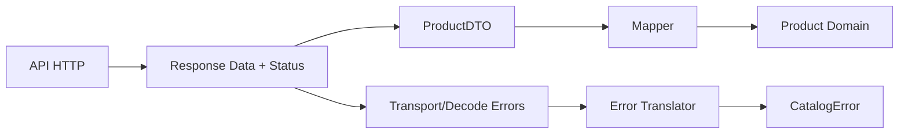

# Feature Catalog: Capa Infrastructure

> **Nota de nomenclatura pedagógica**
> Algunos snippets de esta lección usan `ProductRepository` como nombre conceptual.
> En el scaffold real (`apps/ios/ArchitectureKit`) el equivalente operativo es `CatalogRepository`.

## Objetivo de aprendizaje

Al terminar esta lección vas a poder construir una infraestructura de `Catalog` que conecte con red real sin contaminar el core de negocio, con contratos claros, traducción de errores consistente y pruebas de contrato estables.

Si lo explicamos como a un chaval de 14 años: Infrastructure es el traductor del equipo. Habla dos idiomas a la vez.

- Idioma externo: HTTP, JSON, status codes, timeouts.
- Idioma interno: `Product`, `Price`, `CatalogError`.

Si el traductor mezcla idiomas, todo el equipo acaba confundido. Si traduce bien, cada capa trabaja en paz.

---

## Relación con negocio (DDD)

En DDD, el dominio no debería enterarse de si un producto vino de REST, GraphQL, SQLite o un archivo local. El negocio solo quiere responder preguntas como:

- ¿puedo listar productos?
- ¿si falla la conectividad qué mensaje/estrategia aplico?
- ¿si los datos vienen corruptos cómo reacciono?

Por eso Infrastructure no decide reglas de negocio. Su trabajo es asegurar que el negocio recibe información limpia o errores semánticos útiles.

Invariante operativo de esta lección:

- nunca exponer detalles técnicos (`URLError`, JSON bruto, `HTTPURLResponse`) fuera de Infrastructure.

---

## Definición simple

Infrastructure es el conjunto de adaptadores concretos que implementan puertos definidos por Application/Domain.

En Catalog:

- `RemoteProductRepository` implementa `ProductRepository`.
- `HTTPClient` encapsula transporte.
- DTOs representan payload externo.
- Mapper convierte DTO -> Domain.
- Traductor de errores transforma fallos técnicos -> `CatalogError`.

---

## Modelo mental: aduana de datos

Imagina un aeropuerto. El dominio es el país interno. Infrastructure es la aduana.

- Si llega alguien con pasaporte válido, entra.
- Si llega con documentos corruptos, se rechaza con motivo claro.
- El país interno no necesita saber qué aerolínea lo trajo.


```mermaid
flowchart LR
    API["API HTTP"] --> RES["Response Data + Status"]
    RES --> DTO["ProductDTO"]
    DTO --> MAP["Mapper"]
    MAP --> DOM["Product Domain"]
    RES --> ERRTECH["Transport/Decode Errors"]
    ERRTECH --> ERRT["Error Translator"]
    ERRT --> DOMERR["CatalogError"]
```

Lectura paso a paso:

1. `API → RES`: el servidor HTTP devuelve dos cosas: los bytes del cuerpo (`Data`) y el código de estado (`HTTPURLResponse`). Infrastructure es el primero en recibirlos — Domain nunca los ve.
2. `RES → DTO`: si el status es 200 y los bytes son JSON válido, se crea un `ProductDTO` con `JSONDecoder`. Si el JSON está malformado, el decoder lanza y la flecha no llega a `MAP`.
3. `DTO → MAP → DOM`: el `ProductMapper` convierte cada `ProductDTO` a `Product` de Domain. Si un DTO tiene un campo inválido (URL malformada, precio negativo), el mapper lanza antes de construir el `Product`. El Domain nunca recibe datos corruptos.
4. `RES → ERRTECH → ERRT → DOMERR`: cuando algo falla (sin red, status 5xx, JSON malformado, campo inválido), el flujo va por el camino de error. El "Error Translator" es el bloque `do/catch` del repositorio que convierte errores técnicos (`URLError`, `DecodingError`) a errores semánticos (`CatalogError`).

Si falla el mapping y dejas pasar basura, rompes el dominio. La distinción crítica es: solo hay dos tipos de fallo semántico desde el punto de vista del negocio — "no llegó nada" (`connectivity`) y "llegó algo pero no sirve" (`invalidData`).

---

## Cuándo sí y cuándo no poner lógica aquí

### Cuándo sí

- construir requests HTTP;
- parsear payload externo;
- convertir tipos técnicos a modelos de dominio;
- traducir errores técnicos a errores de negocio;
- aplicar políticas técnicas de infraestructura (timeout, retries básicos, cache policy técnica).

```swift
// ✅ Infrastructure traduciendo — lo que sí pertenece aquí
struct RemoteProductRepository: ProductRepository, Sendable {
    func loadAll() async throws -> [Product] {
        do {
            let (data, response) = try await httpClient.execute(makeRequest())
            guard response.statusCode == 200 else { throw CatalogError.invalidData }
            let dtos = try decoder.decode([ProductDTO].self, from: data)
            return try dtos.map(mapper.map)   // DTO → Domain, errores técnicos → CatalogError
        } catch let error as CatalogError {
            throw error
        } catch {
            throw CatalogError.connectivity   // URLError, timeout, DNS → semántica de negocio
        }
    }
}
```

### Cuándo no

- decidir navegación de UI;
- decidir textos de error para usuario final;
- aplicar reglas de negocio como “producto no publicable por categoría”;
- validar formularios de interfaz.

```swift
// ❌ Infrastructure tomando decisiones que no le corresponden
struct RemoteProductRepository: ProductRepository, Sendable {
    func loadAll() async throws -> [Product] {
        let products = try await fetchAndMap()
        // ❌ Infrastructure decidiendo navegación — no sabe nada de rutas
        if products.isEmpty { coordinator.navigate(to: .empty) }
        // ❌ Infrastructure generando texto de UI — no sabe el idioma ni el contexto
        if products.count > 100 { showAlert(“Demasiados productos, filtra primero”) }
        return products
    }
}
```

Regla de oro:

- Infrastructure traduce, Application orquesta, Domain gobierna.

---

## Contratos base (puertos)

Supuesto: el puerto/protocolo `ProductRepository` ya está definido en Application/Domain así:

```swift
import Foundation

protocol ProductRepository: Sendable {
    func loadAll() async throws -> [Product]
}
```

Infrastructure debe cumplir este contrato exacto, sin extenderlo con detalles de red.

---

## Diseño de DTO y mapping

### Ejemplo mínimo

```swift
import Foundation

struct ProductDTO: Decodable, Sendable {
    let id: String
    let name: String
    let price: Decimal
    let currency: String
    let imageURL: URL

    private enum CodingKeys: String, CodingKey {
        case id
        case name
        case price
        case currency
        case imageURL = "image_url"
    }
}
```

**`Decodable` y no `Codable`** — el DTO solo necesita ser decodificado (JSON → Swift). `Codable` añade `Encodable` sin necesidad. Usar solo lo necesario hace el contrato más explícito: este tipo entra pero no sale.

**`Sendable`** — el DTO se crea en un contexto async (al decodificar la respuesta HTTP) y se pasa al mapper. Si no fuera `Sendable`, Swift 6 podría rechazar esa transferencia entre contextos.

**`CodingKeys`** — el servidor envía `"image_url"` (snake_case) pero en Swift usamos camelCase. `CodingKeys` mapea el nombre externo al interno sin afectar al resto del tipo. Si el servidor cambia el nombre del campo, solo cambias una línea aquí, no todo el código que usa `imageURL`.

**`Decimal` y `URL` ya tipados** — este ejemplo elige fallar pronto: si el JSON trae `"price": "no-es-un-numero"` o `"image_url": "://invalida"`, el `JSONDecoder` lanza `DecodingError` y el repositorio lo traduce a `CatalogError.invalidData`. Es la estrategia "estricta": prefiere fallar limpiamente a aceptar datos sospechosos.

### Ejemplo realista

En APIs reales, el precio puede llegar como `Double`, `String` o incluso `Int`. Si usas `Decimal` en el DTO, cualquier variación rompe la decodificación. El enfoque realista acepta el formato externo tal como viene y aplica las restricciones semánticas en el mapper.

```swift
import Foundation

struct ProductDTO: Decodable, Sendable {
    let id: String
    let name: String
    let price: Double        // acepta el Double del JSON sin rechazarlo
    let currency: String
    let imageURLRaw: String  // acepta String; el mapper valida si es URL válida

    private enum CodingKeys: String, CodingKey {
        case id
        case name
        case price
        case currency
        case imageURLRaw = "image_url"
    }
}

struct ProductMapper {
    func map(_ dto: ProductDTO) throws -> Product {
        guard let imageURL = URL(string: dto.imageURLRaw) else {
            throw CatalogError.invalidData
        }

        return Product(
            id: dto.id,
            name: dto.name,
            price: Price(amount: Decimal(dto.price), currency: dto.currency),
            imageURL: imageURL
        )
    }
}
```

**`guard let imageURL = URL(string: dto.imageURLRaw)`** — `URL(string:)` devuelve `nil` si el string no es una URL válida. Si el servidor envía un string vacío o malformado, `guard` lanza `CatalogError.invalidData` antes de construir un `Product` con datos corruptos. Nunca debería llegar un `Product` con `imageURL` inválida al dominio.

**`Decimal(dto.price)`** — convierte el `Double` del servidor a `Decimal`. Importante: esta conversión arrastra la imprecisión del `Double` (0.1 + 0.2 = 0.30000000000000004). Para precios exactos, el servidor debería enviar el precio como `String` ("29.99") y el mapper debería usar `Decimal(string: dto.price)`. En APIs reales negocia con el backend el formato más preciso.

**`ProductMapper` como tipo separado** — separar el mapping en su propio tipo tiene dos ventajas: se puede testear en aislamiento (sin red, sin HTTP, solo DTO → Product) y se puede sustituir o decorar sin tocar el repositorio.

Diferencia clave entre los dos enfoques:

- DTO mínimo: falla rápido en deserialización, menos código de mapper.
- DTO realista: más tolerante al formato externo, las validaciones semánticas viven en el mapper donde son más explícitas y testeables.

---

## Implementación del repositorio remoto

```swift
import Foundation

protocol HTTPClient: Sendable {
    func execute(_ request: URLRequest) async throws -> (Data, HTTPURLResponse)
}

struct RemoteProductRepository: ProductRepository, Sendable {
    private let httpClient: any HTTPClient
    private let baseURL: URL
    private let mapper: ProductMapper
    private let decoder: JSONDecoder

    init(
        httpClient: any HTTPClient,
        baseURL: URL,
        mapper: ProductMapper = ProductMapper(),
        decoder: JSONDecoder = JSONDecoder()
    ) {
        self.httpClient = httpClient
        self.baseURL = baseURL
        self.mapper = mapper
        self.decoder = decoder
    }

    func loadAll() async throws -> [Product] {
        let request = makeProductsRequest()

        let data: Data
        let response: HTTPURLResponse

        do {
            (data, response) = try await httpClient.execute(request)
        } catch {
            throw CatalogError.connectivity   // URLError, timeout, DNS — no llegó respuesta
        }

        guard response.statusCode == 200 else {
            // Un 4xx/5xx no es un error de conectividad: el servidor respondió,
            // pero con un estado que no podemos procesar → invalidData
            throw CatalogError.invalidData
        }

        let dtos: [ProductDTO]
        do {
            dtos = try decoder.decode([ProductDTO].self, from: data)
        } catch {
            throw CatalogError.invalidData    // JSON inválido o inesperado
        }

        do {
            return try dtos.map(mapper.map)
        } catch {
            throw CatalogError.invalidData    // DTO no mapeó a Product válido
        }
    }

    private func makeProductsRequest() -> URLRequest {
        var request = URLRequest(url: baseURL.appendingPathComponent("products"))
        request.httpMethod = "GET"
        return request
    }
}
```

**`protocol HTTPClient: Sendable`** — separar el cliente HTTP en su propio protocolo permite sustituirlo por un stub en tests sin levantar ningún servidor. El repositorio no sabe si está hablando con `URLSession` real, un stub que devuelve fixtures, o un cliente autenticado decorado. Esto es el patrón de inyección de dependencias aplicado al transporte.

**Tres bloques `do/catch` separados** — cada bloque captura un tipo de fallo diferente y lo traduce a un `CatalogError` específico:
- primer bloque: el transporte falló (sin red, timeout, DNS) → `.connectivity`
- segundo bloque (guard): el servidor respondió pero con un estado inesperado → `.invalidData`
- tercer bloque: el JSON llegó pero no se pudo decodificar → `.invalidData`
- cuarto bloque: el DTO se decodificó pero el mapper no pudo crear un `Product` válido → `.invalidData`

Si usaras un único `catch` para todo, perderías la distinción entre "no hay red" y "el servidor devolvió basura", que son situaciones muy distintas para la UI.

**`guard response.statusCode == 200 else { throw CatalogError.invalidData }`** — un error HTTP 4xx o 5xx no es un error de conectividad: el servidor respondió, pero con un estado que no podemos procesar. Semánticamente es más correcto mapearlo a `.invalidData` que a `.connectivity`. En una implementación más completa se podría añadir `CatalogError.unauthorized` para 401 o `CatalogError.serverError` para 5xx, pero en Etapa 2 mantenemos el modelo mínimo del Domain.

**`makeProductsRequest()` extraído** — construir la `URLRequest` en su propio método tiene dos ventajas: el método `loadAll()` queda más legible (una línea de construcción, no cinco), y se puede testear independientemente si la URL o los headers cambian.

**`struct` en lugar de `class`** — `RemoteProductRepository` es un `struct` con propiedades `let`. Swift garantiza automáticamente `Sendable` sin necesidad de `@unchecked`. Si fuera una clase con propiedades mutables, necesitarías aislamiento adicional.

---

## Composition Root: dónde se cablea todo

Infrastructure no debe auto-construirse dentro de UI. Se ensambla en `Composition Root`.

```swift
import Foundation

struct CatalogFeatureFactory {
    let baseURL: URL
    let httpClient: any HTTPClient

    func makeLoadProductsUseCase() -> LoadProductsUseCase {
        let repository = RemoteProductRepository(httpClient: httpClient, baseURL: baseURL)
        return LoadProductsUseCase(repository: repository)
    }
}
```

**Composition Root** es el único lugar de la app donde se crean las dependencias concretas y se conectan entre sí. Aquí es donde `RemoteProductRepository` (Infrastructure) se instancia y se inyecta en `LoadProductsUseCase` (Application). Ni el UseCase ni el ViewModel saben que existe `RemoteProductRepository` — solo conocen `ProductRepository` (el protocolo).

**Por qué un factory struct** — centralizar la construcción en `CatalogFeatureFactory` tiene tres ventajas:
- en producción, se crea un factory con `URLSessionHTTPClient` real;
- en tests de integración, se crea con un `HTTPClientStub`;
- en previews de SwiftUI, se crea con datos fijos sin red.

Solo cambia el factory; el UseCase y la UI no se tocan.

**La regla del Composition Root**: ningún tipo del core (Domain, Application, Interface) debería instanciar sus propias dependencias. Si un ViewModel crea su propio `RemoteProductRepository`, estás acoplando Interface a Infrastructure. El factory rompe ese acoplamiento.

---

## BDD -> contratos -> TDD

### Escenarios BDD que impactan Infrastructure

**Escenario 1 (happy path):** `Given` backend responde 200 con payload válido, `Then` obtengo `[Product]` de dominio.

**Por qué**: valida que el pipeline completo funciona — JSON → DTO → mapper → Domain. Un unit test del mapper solo prueba el mapper en aislamiento; este escenario prueba que el repositorio ensamble correctamente el decoder, el mapper y el manejo de respuesta.

**Escenario 2 (edge — JSON corrupto):** `Given` backend responde 200 con payload inválido (no JSON), `Then` obtengo `CatalogError.invalidData`.

**Por qué**: un 200 con body corrupto es el fallo silencioso más común. El servidor dice "OK" pero el contenido no es parseable. Sin este test, el `DecodingError` del decoder podría llegar sin traducir a la UI, que no sabe qué hacer con él.

**Escenario 3 (sad path — sin red):** `Given` falla el transporte HTTP (`URLError`), `Then` obtengo `CatalogError.connectivity`.

**Por qué**: `URLError.notConnectedToInternet` es el error que lanza `URLSession` cuando no hay red. El repositorio debe interceptarlo y traducirlo. Sin esta traducción, la capa de Application/UI recibiría `URLError` crudo — un tipo de Foundation que no pertenece al lenguaje de negocio.

**Escenario 4 (sad path — error HTTP):** `Given` backend responde 500 (o cualquier status != 200), `Then` obtengo `CatalogError.invalidData`.

**Por qué (corrección importante):** un error 500 NO es un problema de conectividad. La red funcionó — el servidor respondió. Lo que falló es el servidor. Semánticamente es `.invalidData`: el servidor respondió pero con datos que no podemos procesar. Mapear un 500 a `.connectivity` engañaría a la UI, que mostraría "sin conexión" cuando en realidad hay conexión pero el servidor tiene un problema.

### Plan TDD con código por paso

**Paso 1 — Red: test de happy path.**

```swift
func test_loadAll_deliversProductsOn200ValidJSON() async throws {
    let data = makeProductsJSON([["id": "1", "name": "Camiseta", "price": 29.99, "currency": "EUR", "image_url": "https://example.com/1.png"]])
    let client = HTTPClientStub(data: data, statusCode: 200)
    let sut = RemoteProductRepository(httpClient: client, baseURL: anyURL())
    // RemoteProductRepository no existe → error de compilación → guía el diseño
    let products = try await sut.loadAll()
    XCTAssertEqual(products.count, 1)
}
```

**Paso 2 — Green:** implementación mínima — `httpClient.execute()` + `JSONDecoder` + `ProductMapper`.

**Paso 3 — Red: test de error de transporte.**

```swift
func test_loadAll_deliversConnectivityOnTransportFailure() async {
    let client = HTTPClientStub(error: URLError(.notConnectedToInternet))
    let sut = RemoteProductRepository(httpClient: client, baseURL: anyURL())
    do {
        _ = try await sut.loadAll()
        XCTFail("Expected .connectivity")
    } catch { XCTAssertEqual(error as? CatalogError, .connectivity) }
}
```

**Paso 4 — Green:** añadir el primer bloque `do/catch` que traduce `URLError` → `.connectivity`.

**Paso 5 — Red: test de JSON corrupto y status != 200.** Dos tests adicionales usando el mismo patrón `do/catch`.

**Paso 6 — Refactor:** extraer `makeProductsJSON()`, `HTTPClientStub`, `HTTPClientSpy` a helpers de test compartidos.

---

## Tests de contrato (mínimo + realista)

```swift
import XCTest

final class RemoteProductRepositoryTests: XCTestCase {
    private let baseURL = URL(string: "https://api.example.com")!

    func test_loadAll_deliversProductsOn200ValidJSON() async throws {
        let data = makeProductsJSON([
            ["id": "1", "name": "Camiseta", "price": 29.99, "currency": "EUR", "image_url": "https://example.com/1.png"]
        ])
        let client = HTTPClientStub(data: data, statusCode: 200)
        let sut = RemoteProductRepository(httpClient: client, baseURL: baseURL)

        let products = try await sut.loadAll()

        XCTAssertEqual(products.count, 1)
        XCTAssertEqual(products[0].id, "1")
        XCTAssertEqual(products[0].name, "Camiseta")
        // Nota: Decimal(29.99) convierte Double→Decimal con imprecisión de punto flotante.
        // Ambos lados (DTO y assert) pasan por el mismo Double, por lo que el test pasa,
        // pero el valor real puede ser 29.9900000000000002... no 29.99 exacto.
        // En producción, negocia con el backend enviar el precio como String.
        XCTAssertEqual(products[0].price.currency, "EUR")
    }

    func test_loadAll_deliversInvalidDataOn200InvalidJSON() async {
        let client = HTTPClientStub(data: Data("not-json".utf8), statusCode: 200)
        let sut = RemoteProductRepository(httpClient: client, baseURL: baseURL)

        // XCTest no tiene XCTAssertThrowsError para async; se usa do/catch explícito
        do {
            _ = try await sut.loadAll()
            XCTFail("Expected CatalogError.invalidData to be thrown")
        } catch {
            XCTAssertEqual(error as? CatalogError, .invalidData)
        }
    }

    func test_loadAll_deliversConnectivityOnTransportFailure() async {
        let client = HTTPClientStub(error: URLError(.notConnectedToInternet))
        let sut = RemoteProductRepository(httpClient: client, baseURL: baseURL)

        do {
            _ = try await sut.loadAll()
            XCTFail("Expected CatalogError.connectivity to be thrown")
        } catch {
            XCTAssertEqual(error as? CatalogError, .connectivity)
        }
    }

    func test_loadAll_deliversInvalidDataOnNon200Response() async {
        let client = HTTPClientStub(data: Data(), statusCode: 500)
        let sut = RemoteProductRepository(httpClient: client, baseURL: baseURL)

        do {
            _ = try await sut.loadAll()
            XCTFail("Expected CatalogError.invalidData to be thrown")
        } catch {
            XCTAssertEqual(error as? CatalogError, .invalidData)
        }
    }

    func test_loadAll_requestsProductsEndpoint() async throws {
        let client = HTTPClientSpy(data: makeProductsJSON([]), statusCode: 200)
        let sut = RemoteProductRepository(httpClient: client, baseURL: baseURL)

        _ = try await sut.loadAll()

        XCTAssertEqual(client.requestedURLs, [baseURL.appendingPathComponent("products")])
    }

    private func makeProductsJSON(_ rows: [[String: Any]]) -> Data {
        try! JSONSerialization.data(withJSONObject: rows)
    }
}
```

**`test_loadAll_deliversProductsOn200ValidJSON`** — Happy path: el servidor responde 200 con JSON válido. Verificamos que el repositorio parsea el JSON y lo mapea a `Product` con los campos correctos. Si el mapper tiene un bug (ignora el nombre, invierte id y currency), este test lo detecta. La nota sobre `Decimal(29.99)` es importante: en este test no podemos verificar la precisión exacta del precio porque el JSON serializa como `Double`. Para tests de precisión monetaria, ver los tests de Domain con `Decimal(string:)`.

**`test_loadAll_deliversInvalidDataOn200InvalidJSON`** — Edge case: el servidor responde 200 pero el body no es JSON parseable. Verificamos que el repositorio traduce el `DecodingError` técnico a `CatalogError.invalidData`. Sin esta traducción, la UI recibiría un error que no sabe cómo manejar. El `XCTFail()` en la línea del `try` es crítico: si el código no lanza (bug), el test falla explícitamente en lugar de pasar silenciosamente.

**`test_loadAll_deliversConnectivityOnTransportFailure`** — Sad path de red: el stub lanza `URLError(.notConnectedToInternet)`. Verificamos que el repositorio lo traduce a `CatalogError.connectivity`. La UI no debe recibir `URLError` — solo el error semántico.

**`test_loadAll_deliversInvalidDataOnNon200Response`** — Verifica que un error HTTP (500, 404, 401) se mapea a `.invalidData` y no a `.connectivity`. Un 500 significa que el servidor respondió pero con un problema — no es lo mismo que no tener red. Este test protege la distinción semántica.

**`test_loadAll_requestsProductsEndpoint`** — Verifica el contrato HTTP: la URL solicitada es exactamente `baseURL/products`. Si alguien cambia el path por error (`"product"` sin `s`, o `"v2/products"`), este test falla inmediatamente. Aquí se usa un `HTTPClientSpy` en lugar de un `Stub` porque necesitamos observar qué URL se usó.

**`makeProductsJSON`** — convierte un array de diccionarios Swift a `Data` JSON, simulando el body de respuesta del servidor. El `try!` es aceptable en helpers de test porque el diccionario es fijo y controlado por nosotros — no puede fallar en tiempo de ejecución.

---

## Concurrencia estricta (Swift 6.2)

### Aislamiento

`RemoteProductRepository` es un `struct` con todas sus propiedades `let` — `httpClient`, `baseURL`, `mapper`, `decoder` son inmutables después de `init`. Esto significa que cuando el ViewModel (en `@MainActor`) crea el repositorio y lo pasa a una tarea async, no hay estado compartido que pueda modificarse en paralelo. Swift garantiza automáticamente que este struct es `Sendable` sin que tengas que declararlo explícitamente.

Si en cambio usaras una `class` con una propiedad `var` (por ejemplo, un contador de peticiones), deberías protegerla con un `actor` o `NSLock` para evitar data races. El struct inmutable es el diseño más simple que elimina esta clase entera de problemas.

### `Sendable`

Todos los tipos que cruzan fronteras concurrentes en este flujo son `Sendable`:

- `ProductDTO` es `struct + let` → `Sendable` automático. Se construye al decodificar (en contexto async) y se pasa al mapper.
- `Product` es `struct + let` → `Sendable` automático. Cruza desde el contexto async del repositorio hasta el `@MainActor` del ViewModel.
- `CatalogError` es `enum` con casos sin valores asociados mutables → `Sendable` automático.
- `HTTPClient` tiene `Sendable` en el protocolo → cualquier implementación concreta debe conformarlo.

Si cualquiera de estos tipos no fuera `Sendable`, Swift 6 generaría un error de compilación en el punto donde se transfiere entre contextos. No es un warning — es un error. Esta cadena de `Sendable` es completa o no compila.

### Cancelación

Cuando el usuario sale de la pantalla del catálogo, el ViewModel cancela la `Task` de carga. Esa cancelación se propaga automáticamente a través de los `await`: cuando `httpClient.execute(request)` está esperando la respuesta del servidor, recibe la señal de cancelación y lanza `CancellationError`.

Infrastructure no necesita código extra para esto — el sistema de concurrencia de Swift lo gestiona. Lo que Infrastructure sí debe hacer es **no suprimir `CancellationError`**. Si el bloque `catch` del repositorio captura cualquier `Error` y lanza `CatalogError.connectivity`, estaría silenciando la cancelación y el ViewModel nunca sabría que la tarea fue cancelada.

```swift
// ✅ Correcto — CancellationError no se intercepta
func loadAll() async throws -> [Product] {
    let (data, response): (Data, HTTPURLResponse)
    do {
        (data, response) = try await httpClient.execute(makeRequest())
    } catch is CancellationError {
        throw CancellationError()   // relanzar — dejar que se propague
    } catch {
        throw CatalogError.connectivity
    }
    // ...
}
```

### Backpressure

El repositorio no es el lugar correcto para controlar cuántas peticiones se lanzan en paralelo. Si el ViewModel llama a `loadAll()` tres veces seguidas, el repositorio ejecuta tres peticiones. Es correcto: el repositorio es idempotente y sin estado — no sabe qué peticiones anteriores hizo, ni debería saberlo.

La política de "cancelar la anterior antes de lanzar la nueva" pertenece al ViewModel o al coordinador, que es quien tiene el contexto del ciclo de vida de la pantalla. Infrastructure se mantiene simple y predecible: entra una petición, sale un resultado o un error.

---

## Anti-ejemplo real (bug clásico)

```swift
// ❌ Repositorio con múltiples problemas graves
struct BadRemoteRepository: ProductRepository {
    func loadAll() async throws -> [Product] {
        let url = URL(string: "https://api.example.com/products")!
        let data = try! Data(contentsOf: url)          // ❌ 1. API síncrona — bloquea el hilo
        let dtos = try! JSONDecoder().decode([ProductDTO].self, from: data)  // ❌ 2. crash si falla
        return dtos.map { dto in
            Product(
                id: dto.id,
                name: dto.name,
                price: Price(amount: Decimal(dto.price), currency: dto.currency),
                imageURL: URL(string: dto.imageURLRaw)! // ❌ 3. crash si URL inválida
            )
        }
    }
}
// ❌ 4. URL hardcodeada — imposible testear ni cambiar de entorno
// ❌ 5. No traduce errores — URLError, DecodingError llegan a la UI tal cual
// ❌ 6. No es Sendable — problemas de concurrencia en Swift 6
// ❌ 7. Sin cancelación — si el usuario sale de pantalla, la carga continúa
```

Problema a problema:

1. **`Data(contentsOf: url)` es síncrona** — bloquea el hilo hasta que el servidor responde (o falla). En un contexto `async`, esto ignora el sistema de concurrencia de Swift y puede colgar la app entera si la red es lenta.

2. **`try!` en decodificación** — si el servidor devuelve un campo con tipo inesperado o falta un campo obligatorio, la app crasha sin posibilidad de recuperación. El usuario ve una pantalla negra, no un error amigable.

3. **`URL(string:)!` en el mapper** — si el servidor devuelve `"image_url": ""` o `"image_url": null`, el crash ocurre al construir el `Product`. El dominio recibe datos corruptos o se cae.

4. **URL hardcodeada** — imposible cambiar entre entornos (dev, staging, producción) sin recompilar. Imposible testear sin levantar el servidor real.

5. **Sin traducción de errores** — la UI recibe `URLError`, `DecodingError` o `Swift.Error` genérico. El ViewModel no puede distinguir qué pasó ni qué mensaje mostrar al usuario.

```swift
// ✅ La versión correcta — todos los problemas resueltos
struct RemoteProductRepository: ProductRepository, Sendable {
    private let httpClient: any HTTPClient  // inyectable → testeable
    private let baseURL: URL               // configurable por entorno

    func loadAll() async throws -> [Product] {
        let request = makeProductsRequest()   // sin hardcode

        let data: Data
        let response: HTTPURLResponse

        do {
            (data, response) = try await httpClient.execute(request)  // async real
        } catch {
            throw CatalogError.connectivity   // URLError traducido
        }

        guard response.statusCode == 200 else {
            throw CatalogError.invalidData    // HTTP error traducido
        }

        do {
            let dtos = try JSONDecoder().decode([ProductDTO].self, from: data)
            return try dtos.map(mapper.map)   // throws si URL inválida → .invalidData
        } catch let error as CatalogError {
            throw error
        } catch {
            throw CatalogError.invalidData    // DecodingError traducido
        }
    }
}
```

Cómo migrar si heredas el anti-ejemplo:

1. añadir contract tests primero (sin tocar implementación): definen el comportamiento esperado;
2. sustituir `Data(contentsOf:)` por `URLSession.data(for:)` con `async/await`;
3. envolver los `try!` en `do/catch` que lancen `CatalogError`;
4. extraer la URL a un parámetro inyectado;
5. verificar que los tests existentes siguen en verde antes de continuar.

---

## ADR corto de la lección

```markdown
## ADR-003: Catalog Repository traduce errores técnicos a CatalogError
- Estado: Aprobado
- Contexto: Application y UI requieren semántica estable de fallo
- Decisión: Compactar fallos de transporte/status a `.connectivity` y payload/mapping a `.invalidData`
- Consecuencias: menor granularidad técnica en capas superiores; mayor estabilidad de contratos
- Fecha: 2026-02-07
```

---

## Matriz de pruebas de esta lección

| Tipo de prueba | Qué valida | Coste | Frecuencia |
| --- | --- | --- | --- |
| Unit mapper | DTO -> Domain + invalidaciones | Bajo | Cada cambio |
| Integration repo | colaboración HTTPClient + repository | Medio | Por feature |
| UI/E2E | flujo crítico de catálogo visible | Alto | Selectivo |

---

## Checklist de calidad

- [ ] Infrastructure implementa puertos del core sin filtrar detalles técnicos.
- [ ] Mapping DTO -> Domain está aislado y testeado.
- [ ] Errores técnicos se traducen a `CatalogError`.
- [ ] Concurrencia: tipos `Sendable` y cancelación propagada.
- [ ] Composition Root construye dependencias fuera del core.

---

## Cierre

Si Application es el director de orquesta, Infrastructure es el técnico de sonido: nadie le aplaude cuando todo va bien, pero si falla, el concierto se cae. Esta capa bien diseñada te da algo muy enterprise: cambiar proveedores externos sin romper reglas de negocio.

---

## Implementación en tu proyecto

El scaffold real tiene la capa de datos de Catalog en `Sources/FeatureCatalogData/`. Los ficheros clave son:

| Concepto en lección | Fichero en scaffold | Diferencia clave |
|---|---|---|
| `RemoteProductRepository` | `Sources/FeatureCatalogData/DefaultCatalogRemoteDataSource.swift` | Es un `actor`, no un `struct`; implementa `CatalogRemoteDataSource`, no `CatalogRepository` directamente |
| `ProductMapper` / `ProductDTO` | Dentro de `DefaultCatalogRemoteDataSource.swift` | El scaffold stub devuelve datos directamente sin red real en Etapa 2 |
| `HTTPClient` (protocol) | `Sources/FeatureCatalogData/CatalogDataContracts.swift` | Protocolo `CatalogRemoteDataSource` encapsula el acceso remoto |
| Contratos de datos | `Sources/FeatureCatalogData/CatalogDataContracts.swift` | Incluye `CatalogCacheStore`, `CatalogObservability` — estos son conceptos de Etapa 3 |

**Sobre el scaffold de Etapa 2:** `DefaultCatalogRemoteDataSource` es actualmente un actor que devuelve datos en memoria (sin HTTP real). En el scaffold se demuestra el patrón de aislamiento con `actor`, no el patrón `RemoteRepository + HTTPClient` de esta lección. Esto es deliberado: el scaffold en Etapa 2 prioriza que la app funcione de punta a punta con datos predecibles. El HTTP real se introduce en Etapa 3.

```swift
// Lo que ya existe en el scaffold
// Sources/FeatureCatalogData/DefaultCatalogRemoteDataSource.swift
public actor DefaultCatalogRemoteDataSource: CatalogRemoteDataSource {
    private let products: [Product]

    public init(products: [Product] = [
        Product(id: "p-1", title: "Bike", price: 199.0),
        Product(id: "p-2", title: "Helmet", price: 49.0),
        Product(id: "p-3", title: "Bottle", price: 12.0)
    ]) {
        self.products = products
    }

    public func fetchProducts() async throws -> [Product] {
        products
    }
}
```

**Qué hacer ahora:**
1. Abre `Sources/FeatureCatalogData/CatalogDataContracts.swift` — ve todos los protocolos de la capa de datos: `CatalogRemoteDataSource`, `CatalogCacheStore`, `CatalogObservability`. Estos protocolos definen las "aduanas" del scaffold.
2. Abre `Sources/FeatureCatalogData/DefaultCatalogRemoteDataSource.swift` — observa cómo el `actor` garantiza thread-safety automáticamente (el patrón de esta lección pero con `actor` en lugar de `struct + Sendable`).
3. Abre `Tests/FeatureCatalogDataIntegrationTests/` — revisa los integration tests del scaffold real.

---

## 🔨 Checkpoint Xcode — FeatureCatalogData

La capa de datos del scaffold es más rica que el ejemplo de la lección: incluye cache, observabilidad y conectividad como dependencias explícitas.

```bash
open apps/ios/ArchitectureKit/Package.swift
# Navega a: Sources/FeatureCatalogData/CachedCatalogRepository.swift
#           Sources/FeatureCatalogData/DefaultCatalogRemoteDataSource.swift
#           Sources/FeatureCatalogData/CatalogDataContracts.swift
```

**Diferencias clave entre la lección y el scaffold:**

| Lección | Scaffold real |
|---|---|
| `CatalogRemoteRepository` (struct) | `DefaultCatalogRemoteDataSource` — `actor` para thread-safety automático |
| Repositorio accede red directamente | `CachedCatalogRepository` decora un `CatalogRemoteDataSource` + `CatalogCacheStore` |
| Sin contratos explícitos de datos | `CatalogDataContracts.swift` define `CatalogRemoteDataSource`, `CatalogCacheStore`, `CatalogObservability` |
| `InMemoryProductRepository` | `InMemoryCatalogStores.swift` — stubs en memoria para tests |

```bash
cd apps/ios/ArchitectureKit
swift test --filter FeatureCatalogDataTests
```

**Preguntas de reflexión:**
1. `DefaultCatalogRemoteDataSource` es un `actor`. ¿Qué ventaja tiene frente a `struct + @unchecked Sendable` para una fuente de datos remota?
2. `CatalogDataContracts.swift` agrupa todos los protocolos de la capa de datos. ¿Por qué es útil tener un único punto de definición de contratos en lugar de distribuirlos por cada archivo?
3. El scaffold separa `CatalogRemoteDataSource` de `CatalogRepository`. ¿Qué ocurre si cambias el proveedor de red? ¿Cuántos archivos necesitas tocar?

---


## Qué sigue

Con Infrastructure construida y testeada, la feature Catalog tiene Domain, Application e Infrastructure completos. El siguiente paso es conectar todo esto a la interfaz de usuario.

→ [Feature Catalog: Capa Interface SwiftUI](04-interface-swiftui.md) — ViewModel, estado de pantalla, SwiftUI y navegación integrada.

