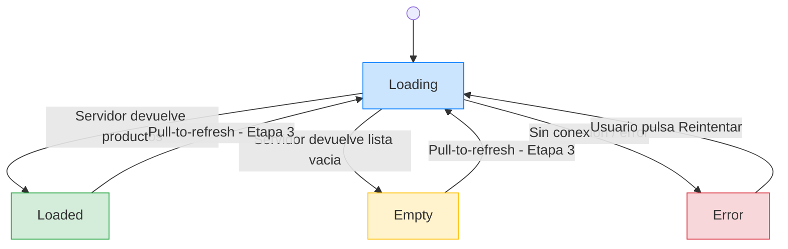
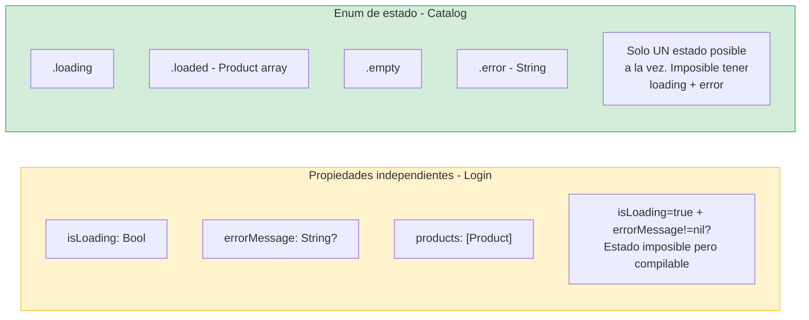
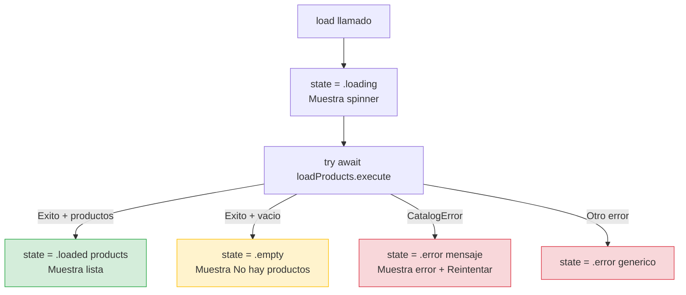

# Feature Catalog: Capa Interface (SwiftUI)

## Una pantalla con cuatro estados

La Interface del Catalog es más compleja que la de Login. Login tenía un formulario con dos campos, un botón, y un mensaje de error. Catalog tiene una pantalla que puede estar en cuatro estados diferentes (loading, loaded, empty, error), cada uno con una representación visual distinta. Esto nos obligará a pensar en cómo modelar el estado de la UI de forma limpia.

---

### Diagrama: los 4 estados de la pantalla del Catalog



### Diagrama: enum de estado vs propiedades independientes



El enum de estado es más seguro que las propiedades independientes porque **elimina estados imposibles en tiempo de compilación**. Con propiedades sueltas, podrías tener `isLoading = true` y `errorMessage = "Error"` al mismo tiempo — un estado contradictorio que el compilador no detecta. Con el enum, eso es imposible.

---

## El CatalogViewModel

El ViewModel del Catalog gestiona la carga de productos y expone el estado actual de la pantalla. A diferencia del `LoginViewModel` (que tenía propiedades independientes como `isLoading`, `errorMessage`), aquí usamos un **enum de estado** que representa las cuatro posibilidades mutuamente excluyentes:

```swift
// StackMyArchitecture/Features/Catalog/Interface/CatalogViewModel.swift

import SwiftUI

@Observable
@MainActor
final class CatalogViewModel {
    
    enum State: Equatable {
        case loading
        case loaded([Product])
        case empty
        case error(String)
    }
    
    private(set) var state: State = .loading
    
    private let loadProducts: LoadProductsUseCase
    private let onProductSelected: @MainActor (Product) -> Void
    
    init(
        loadProducts: LoadProductsUseCase,
        onProductSelected: @MainActor @escaping (Product) -> Void
    ) {
        self.loadProducts = loadProducts
        self.onProductSelected = onProductSelected
    }
    
    func load() async {
        state = .loading
        
        do {
            let products = try await loadProducts.execute()
            state = products.isEmpty ? .empty : .loaded(products)
        } catch let error as CatalogError {
            state = .error(Self.message(for: error))
        } catch {
            state = .error("Error inesperado. Inténtalo de nuevo.")
        }
    }
    
    func selectProduct(_ product: Product) {
        onProductSelected(product)
    }
    
    private static func message(for error: CatalogError) -> String {
        switch error {
        case .connectivity:
            return "Sin conexión a internet. Inténtalo de nuevo."
        case .invalidData:
            return "Error al cargar los productos. Inténtalo de nuevo."
        }
    }
}
```

**Explicacion linea por linea del CatalogViewModel:**

`@Observable @MainActor final class CatalogViewModel` — Mismo patrón que `LoginViewModel`: `@Observable` para que SwiftUI detecte cambios, `@MainActor` para garantizar que las mutaciones de estado ocurren en el hilo principal.

`enum State: Equatable` — Este enum define **todos** los estados posibles de la pantalla. Es `Equatable` para poder compararlo en los tests con `XCTAssertEqual`. Cada caso tiene exactamente los datos que ese estado necesita:

- `.loading` — no necesita datos (solo muestra un spinner).
- `.loaded([Product])` — contiene la lista de productos a mostrar.
- `.empty` — no necesita datos (solo muestra un mensaje de "sin productos").
- `.error(String)` — contiene el mensaje de error a mostrar.

`private(set) var state: State = .loading` — El estado actual de la pantalla. Es `private(set)` porque solo el propio ViewModel puede cambiar el estado (la vista solo lo lee). Empieza en `.loading` porque la primera acción de la pantalla es cargar productos.

`private let loadProducts: LoadProductsUseCase` — La dependencia del UseCase, inyectada por el Composition Root.

`private let onProductSelected: @MainActor (Product) -> Void` — El closure que se llama cuando el usuario pulsa un producto. El ViewModel no sabe qué pasa después (navegar a detalle, abrir un modal, etc.). El Composition Root decide.

**El metodo `load()` paso a paso:**



`state = .loading` — Lo primero: poner el estado en loading. SwiftUI detecta el cambio y muestra el spinner.

`let products = try await loadProducts.execute()` — Llamar al UseCase para cargar los productos. `try` porque puede fallar. `await` porque es asíncrono.

`state = products.isEmpty ? .empty : .loaded(products)` — Si la lista está vacía, ponemos `.empty`. Si tiene productos, ponemos `.loaded` con la lista. Este operador ternario (`condición ? valorSiTrue : valorSiFalse`) es una forma compacta de escribir un `if/else`.

`catch let error as CatalogError` — Si es un error conocido, lo traducimos a un mensaje legible.

`catch` — Si es un error desconocido, mostramos un mensaje genérico.

`func selectProduct(_ product: Product)` — Cuando el usuario pulsa un producto, el ViewModel llama al closure. No tiene lógica propia, solo delega. Este método existe para que la vista no acceda directamente al closure privado.

### Por qué un enum de estado en vez de propiedades independientes

En Login, usamos propiedades independientes: `isLoading`, `errorMessage`, `email`, `password`. Eso funcionaba porque Login tiene campos de formulario que coexisten con el estado de loading y error. Pero en Catalog, los estados son mutuamente excluyentes: si estás loading, no puedes estar en error. Si tienes productos, no estás vacío. Si estás en error, no tienes productos.

Con propiedades independientes tendríamos estados imposibles:

```swift
// ❌ Esto permite estados inconsistentes
isLoading = true
products = [product1, product2]  // ¿Loading con productos? ¿Qué muestra la UI?
errorMessage = "Sin conexión"     // ¿Loading con error? ¿Y con productos?
```

Con un enum, cada estado es una variante única. No puedes estar en dos estados a la vez:

```swift
// ✅ Cada estado es claro y exclusivo
state = .loading              // Solo loading
state = .loaded([p1, p2])     // Solo productos
state = .empty                // Solo vacío
state = .error("Sin conexión") // Solo error
```

### La lógica de empty vs. loaded

Fíjate en la línea: `state = products.isEmpty ? .empty : .loaded(products)`. Aquí el ViewModel decide si un array vacío es un estado `.empty` o un `.loaded` con array vacío. Elegimos tener un estado `.empty` separado porque la UI quiere mostrar un mensaje diferente para "no hay productos" vs. "aquí están tus productos". Si usáramos `.loaded([])`, la vista tendría que verificar si el array está vacío dentro de la lista, mezclando lógica de presentación con layout.

### El closure onProductSelected

Como en Login con `onLoginSucceeded`, el Catalog no sabe qué pasa cuando el usuario pulsa un producto. El closure `onProductSelected` se lo inyecta el Composition Root. En la Etapa 2, lo conectaremos al coordinador que navegará a la pantalla de detalle (cuando la implementemos).

---

## La CatalogView

```swift
// StackMyArchitecture/Features/Catalog/Interface/CatalogView.swift

import SwiftUI

struct CatalogView: View {
    @State private var viewModel: CatalogViewModel
    
    init(viewModel: CatalogViewModel) {
        _viewModel = State(wrappedValue: viewModel)
    }
    
    var body: some View {
        Group {
            switch viewModel.state {
            case .loading:
                ProgressView("Cargando productos...")
                    .frame(maxWidth: .infinity, maxHeight: .infinity)
                
            case .loaded(let products):
                List(products, id: \.id) { product in
                    ProductRow(product: product)
                        .onTapGesture {
                            viewModel.selectProduct(product)
                        }
                }
                
            case .empty:
                ContentUnavailableView(
                    "No hay productos",
                    systemImage: "cart",
                    description: Text("No hay productos disponibles en este momento.")
                )
                
            case .error(let message):
                ContentUnavailableView {
                    Label("Error", systemImage: "wifi.slash")
                } description: {
                    Text(message)
                } actions: {
                    Button("Reintentar") {
                        Task { await viewModel.load() }
                    }
                }
            }
        }
        .navigationTitle("Catálogo")
        .task {
            await viewModel.load()
        }
    }
}
```

### El switch sobre el estado

La vista usa un `switch` sobre `viewModel.state` para decidir qué mostrar. Esto es lo natural cuando el estado es un enum: cada caso del enum tiene una representación visual diferente. No hay `if/else` anidados, no hay combinaciones de flags booleanos. La correspondencia entre estado y UI es directa y exhaustiva (el compilador te obliga a manejar todos los casos).

### El modifier `.task`

En Login, la acción se iniciaba cuando el usuario pulsaba un botón. En Catalog, la carga se inicia automáticamente cuando la vista aparece. El modifier `.task` es la forma idiomática de hacer esto en SwiftUI: ejecuta un closure async cuando la vista aparece y lo cancela automáticamente cuando la vista desaparece. Esto es importante para evitar memory leaks y operaciones huérfanas.

### ContentUnavailableView

Para los estados vacío y error, usamos `ContentUnavailableView`, un componente de SwiftUI (iOS 17+) diseñado específicamente para pantallas sin contenido. Muestra un icono, un título, una descripción, y opcionalmente acciones (como el botón de reintentar). Es mucho más limpio que construir estas vistas manualmente.

---

## El ProductRow

Extraemos la fila de cada producto a una subvista para mantener `CatalogView` limpia:

```swift
// StackMyArchitecture/Features/Catalog/Interface/ProductRow.swift

import SwiftUI

struct ProductRow: View {
    let product: Product
    
    var body: some View {
        HStack(spacing: 12) {
            AsyncImage(url: product.imageURL) { image in
                image
                    .resizable()
                    .aspectRatio(contentMode: .fill)
            } placeholder: {
                Color.gray.opacity(0.3)
            }
            .frame(width: 60, height: 60)
            .clipShape(RoundedRectangle(cornerRadius: 8))
            
            VStack(alignment: .leading, spacing: 4) {
                Text(product.name)
                    .font(.headline)
                
                Text(product.price.formatted)
                    .font(.subheadline)
                    .foregroundStyle(.secondary)
            }
            
            Spacer()
        }
        .padding(.vertical, 4)
    }
}
```

La imagen se carga con `AsyncImage`, el componente de SwiftUI para carga asíncrona de imágenes por URL. Mientras la imagen carga, muestra un placeholder gris. Si la carga falla, también muestra el placeholder.

Para formatear el precio, añadimos una propiedad computada a `Price`:

```swift
// StackMyArchitecture/Features/Catalog/Domain/Models/Price+Formatted.swift

import Foundation

extension Price {
    var formatted: String {
        let formatter = NumberFormatter()
        formatter.numberStyle = .currency
        formatter.currencyCode = currency
        return formatter.string(from: amount as NSDecimalNumber) ?? "\(amount) \(currency)"
    }
}
```

Esto formatea el precio según la moneda: `29.99 EUR` se muestra como "29,99 €" en un dispositivo configurado en español. `NumberFormatter` usa la localización del dispositivo automáticamente.

---

## Tests del CatalogViewModel

```swift
// StackMyArchitectureTests/Features/Catalog/Interface/CatalogViewModelTests.swift

import XCTest
@testable import StackMyArchitecture

@MainActor
final class CatalogViewModelTests: XCTestCase {
    
    // MARK: - Helpers
    
    private func makeSUT(
        repositoryResult: Result<[Product], CatalogError> = .success([]),
        onProductSelected: @MainActor @escaping (Product) -> Void = { _ in }
    ) -> (sut: CatalogViewModel, repository: ProductRepositoryStub) {
        let repository = ProductRepositoryStub(result: repositoryResult)
        let useCase = LoadProductsUseCase(repository: repository)
        let sut = CatalogViewModel(
            loadProducts: useCase,
            onProductSelected: onProductSelected
        )
        return (sut, repository)
    }
    
    private func makeProduct(id: String = "1") -> Product {
        Product(
            id: id,
            name: "Product \(id)",
            price: Price(amount: 10.0, currency: "EUR"),
            imageURL: URL(string: "https://example.com/\(id).png")!
        )
    }
    
    // MARK: - Initial State
    
    func test_init_starts_in_loading_state() {
        let (sut, _) = makeSUT()
        
        XCTAssertEqual(sut.state, .loading)
    }
    
    // MARK: - Happy Path
    
    func test_load_with_products_sets_loaded_state() async {
        let products = [makeProduct(id: "1"), makeProduct(id: "2")]
        let (sut, _) = makeSUT(repositoryResult: .success(products))
        
        await sut.load()
        
        XCTAssertEqual(sut.state, .loaded(products))
    }
    
    // MARK: - Empty State
    
    func test_load_with_empty_list_sets_empty_state() async {
        let (sut, _) = makeSUT(repositoryResult: .success([]))
        
        await sut.load()
        
        XCTAssertEqual(sut.state, .empty)
    }
    
    // MARK: - Error States
    
    func test_load_with_connectivity_error_sets_error_state() async {
        let (sut, _) = makeSUT(repositoryResult: .failure(.connectivity))
        
        await sut.load()
        
        XCTAssertEqual(
            sut.state,
            .error("Sin conexión a internet. Inténtalo de nuevo.")
        )
    }
    
    func test_load_with_invalid_data_sets_error_state() async {
        let (sut, _) = makeSUT(repositoryResult: .failure(.invalidData))
        
        await sut.load()
        
        XCTAssertEqual(
            sut.state,
            .error("Error al cargar los productos. Inténtalo de nuevo.")
        )
    }
    
    // MARK: - Retry
    
    func test_load_resets_to_loading_before_fetching() async {
        let (sut, _) = makeSUT(repositoryResult: .failure(.connectivity))
        
        await sut.load()
        XCTAssertEqual(sut.state, .error("Sin conexión a internet. Inténtalo de nuevo."))
        
        // Second load should go through loading state
        // After completion it will be error again (same stub), but the state was reset
        await sut.load()
        // We can verify the final state; the intermediate loading state
        // is hard to test without async observation
        XCTAssertEqual(sut.state, .error("Sin conexión a internet. Inténtalo de nuevo."))
    }
    
    // MARK: - Product Selection
    
    func test_selectProduct_calls_onProductSelected() {
        let product = makeProduct()
        var receivedProduct: Product?
        let (sut, _) = makeSUT(onProductSelected: { receivedProduct = $0 })
        
        sut.selectProduct(product)
        
        XCTAssertEqual(receivedProduct, product)
    }
}
```

**Explicacion de cada test del CatalogViewModel:**

**`makeSUT`** — El helper sigue el patrón ya conocido. Crea la cadena completa: stub del repository → UseCase → ViewModel. Por defecto, el repository devuelve una lista vacía (éxito). Puedes pasar `.failure(.connectivity)` para simular error de red, o `.success([productos])` para simular datos. El closure `onProductSelected` por defecto no hace nada (`{ _ in }`).

**`test_init_starts_in_loading_state`** — Verifica que al crear el ViewModel, su estado inicial es `.loading`. No llamamos a `load()`. Solo creamos el ViewModel y verificamos que empieza en loading. Si alguien cambiara el estado inicial a `.empty` por error, este test lo detectaría.

**`test_load_with_products_sets_loaded_state`** — Happy path: configuramos el stub para devolver 2 productos, llamamos a `load()`, y verificamos que el estado es `.loaded` con esos 2 productos. Aquí comparamos el enum completo: `.loaded(products)`. Gracias a que `State` es `Equatable` y `Product` es `Equatable`, `XCTAssertEqual` puede comparar el enum con su valor asociado.

**`test_load_with_empty_list_sets_empty_state`** — Edge case: el servidor responde con una lista vacía. Configuramos `.success([])` y verificamos que el estado es `.empty`, **no** `.loaded([])`. Esto valida la decisión de diseño: un array vacío se traduce al estado `.empty` para que la UI muestre un mensaje adecuado.

**`test_load_with_connectivity_error_sets_error_state`** — Sad path: configuramos `.failure(.connectivity)`. Verificamos que el estado es `.error("Sin conexión a internet...")`. Estamos verificando dos cosas a la vez: (1) que el error se traduce correctamente, y (2) que el mensaje de error es el esperado.

**`test_load_with_invalid_data_sets_error_state`** — Otro sad path: `.failure(.invalidData)` produce el mensaje "Error al cargar los productos...".

**`test_load_resets_to_loading_before_fetching`** — Test de retry: primero cargamos con error, luego volvemos a cargar. Verificamos que después de la segunda carga, el estado sigue siendo error (porque el stub siempre devuelve error). El test documenta que `load()` puede llamarse múltiples veces (el botón "Reintentar" de la vista).

**`test_selectProduct_calls_onProductSelected`** — Verificamos que cuando el usuario pulsa un producto, el closure se ejecuta con el producto correcto. Usamos la misma técnica de "trampa" que en los tests del `LoginViewModel`: un closure que captura una variable local (`var receivedProduct: Product?`), y después verificamos que capturó el valor esperado.

---

## Preview con StubProductRepository

```swift
// StackMyArchitecture/Features/Catalog/Interface/CatalogView+Preview.swift

#Preview("Catalog - Products") {
    NavigationStack {
        CatalogView(
            viewModel: CatalogViewModel(
                loadProducts: LoadProductsUseCase(
                    repository: StubProductRepository()
                ),
                onProductSelected: { product in
                    print("Selected: \(product.name)")
                }
            )
        )
    }
}
```

---

## Reflexión: Catalog vs Login en la Interface

| Aspecto | Login | Catalog |
|---------|-------|---------|
| Estado del ViewModel | Propiedades independientes | Enum con 4 variantes |
| Inicio de la acción | Botón del usuario | Automático con `.task` |
| Layout principal | Form con campos | List con filas |
| Estados de error | Un string de error | ContentUnavailableView con retry |
| Evento de salida | `onLoginSucceeded(Session)` | `onProductSelected(Product)` |

Ambas features siguen el mismo patrón arquitectónico (ViewModel con @Observable, vista que delega al ViewModel, closure para navegación), pero la implementación de la UI es diferente porque las necesidades son diferentes. Eso es exactamente lo que queremos: la arquitectura es consistente, pero la implementación es flexible.

---

**Anterior:** [Infrastructure ←](03-infrastructure.md) · **Siguiente:** [ADR-002: Catalog →](ADR-002-catalog.md)
