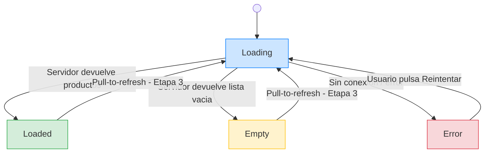
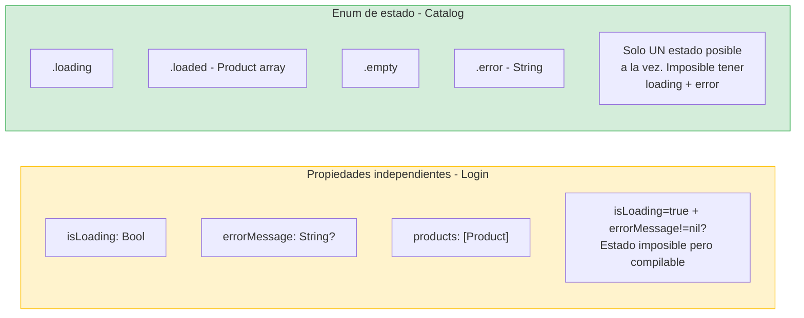
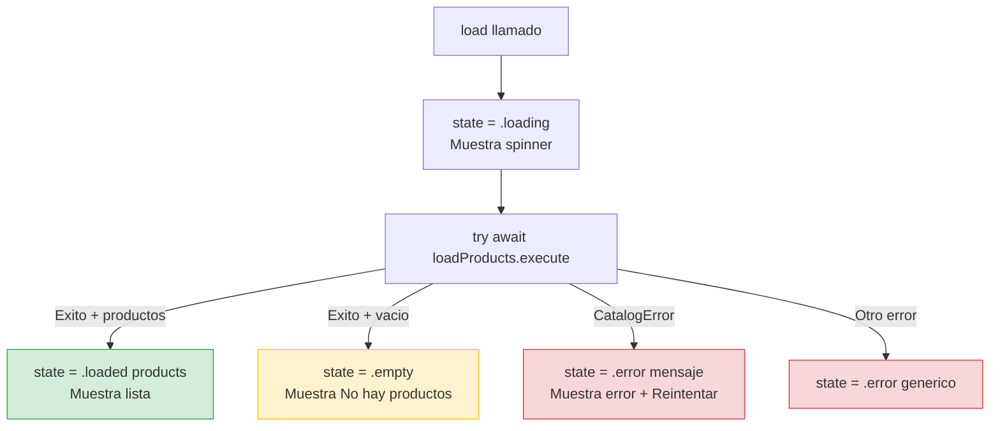

# Feature Catalog: Capa Interface (SwiftUI)

> **Nota de nomenclatura pedagógica**
> Algunos snippets de esta lección usan `ProductRepository` como nombre conceptual.
> En el scaffold real (`apps/ios/ArchitectureKit`) el equivalente operativo es `CatalogRepository`.

## Objetivo de aprendizaje

Al terminar esta lección vas a poder construir la capa Interface de `Catalog` con un ViewModel que modela el estado de pantalla como una máquina de estados tipada, una View SwiftUI que reacciona a ese estado sin lógica de negocio, y tests que cubren los cuatro estados posibles sin depender de la UI real.

En lenguaje simple: Interface es el escaparate. No decide qué hay en el almacén (Domain) ni cómo llega (Infrastructure). Solo decide cómo se muestra lo que le entregan.

---

## Una pantalla con cuatro estados

La Interface del Catalog es más compleja que la de Login. Login tenía un formulario con dos campos, un botón, y un mensaje de error. Catalog tiene una pantalla que puede estar en cuatro estados diferentes (loading, loaded, empty, error), cada uno con una representación visual distinta. Esto nos obligará a pensar en cómo modelar el estado de la UI de forma limpia.

---

### Diagrama: los 4 estados de la pantalla del Catalog


```mermaid
flowchart TD
    START(( )) --> Loading
    Loading -->|"Servidor devuelve productos"| Loaded
    Loading -->|"Servidor devuelve lista vacia"| Empty
    Loading -->|"Sin conexion / error"| Error

    Error -->|"Usuario pulsa Reintentar"| Loading
    Loaded -->|"Pull-to-refresh - Etapa 3"| Loading
    Empty -->|"Pull-to-refresh - Etapa 3"| Loading

    style Loading fill:#cce5ff,stroke:#007bff
    style Loaded fill:#d4edda,stroke:#28a745
    style Empty fill:#fff3cd,stroke:#ffc107
    style Error fill:#f8d7da,stroke:#dc3545
```

### Diagrama: enum de estado vs propiedades independientes


```mermaid
graph LR
    subgraph Props["Propiedades independientes - Login"]
        direction TB
        P1["isLoading: Bool"]
        P2["errorMessage: String?"]
        P3["products: [Product]"]
        P4["isLoading=true + errorMessage!=nil?<br/>Estado imposible pero compilable"]
    end

    subgraph EnumState["Enum de estado - Catalog"]
        direction TB
        S1[".loading"]
        S2[".loaded - Product array"]
        S3[".empty"]
        S4[".error - String"]
        S5["Solo UN estado posible<br/>a la vez. Imposible tener<br/>loading + error"]
    end

    style Props fill:#fff3cd,stroke:#ffc107
    style EnumState fill:#d4edda,stroke:#28a745
```

El enum de estado es más seguro que las propiedades independientes porque **elimina estados imposibles en tiempo de compilación**. Con propiedades sueltas, podrías tener `isLoading = true` y `errorMessage = "Error"` al mismo tiempo — un estado contradictorio que el compilador no detecta. Con el enum, eso es imposible.

---

## El CatalogViewModel

El ViewModel del Catalog gestiona la carga de productos y expone el estado actual de la pantalla. A diferencia del `LoginViewModel` (que tenía propiedades independientes como `isLoading`, `errorMessage`), aquí usamos un **enum de estado** que representa las cuatro posibilidades mutuamente excluyentes:

```swift
// StackMyArchitecture/Features/Catalog/Interface/CatalogViewModel.swift

import SwiftUI

@Observable
@MainActor
final class CatalogViewModel {
    
    enum State: Equatable {
        case loading
        case loaded([Product])
        case empty
        case error(String)
    }
    
    private(set) var state: State = .loading
    
    private let loadProducts: LoadProductsUseCase
    private let onProductSelected: @MainActor (Product) -> Void
    
    init(
        loadProducts: LoadProductsUseCase,
        onProductSelected: @MainActor @escaping (Product) -> Void
    ) {
        self.loadProducts = loadProducts
        self.onProductSelected = onProductSelected
    }
    
    func load() async {
        state = .loading
        
        do {
            let products = try await loadProducts.execute()
            state = products.isEmpty ? .empty : .loaded(products)
        } catch let error as CatalogError {
            state = .error(Self.message(for: error))
        } catch {
            state = .error("Error inesperado. Inténtalo de nuevo.")
        }
    }
    
    func selectProduct(_ product: Product) {
        onProductSelected(product)
    }
    
    private static func message(for error: CatalogError) -> String {
        switch error {
        case .connectivity:
            return "Sin conexión a internet. Inténtalo de nuevo."
        case .invalidData:
            return "Error al cargar los productos. Inténtalo de nuevo."
        }
    }
}
```

**Explicacion linea por linea del CatalogViewModel:**

`@Observable @MainActor final class CatalogViewModel` — Mismo patrón que `LoginViewModel`: `@Observable` para que SwiftUI detecte cambios, `@MainActor` para garantizar que las mutaciones de estado ocurren en el hilo principal.

`enum State: Equatable` — Este enum define **todos** los estados posibles de la pantalla. Es `Equatable` para poder compararlo en los tests con `XCTAssertEqual`. Cada caso tiene exactamente los datos que ese estado necesita:

- `.loading` — no necesita datos (solo muestra un spinner).
- `.loaded([Product])` — contiene la lista de productos a mostrar.
- `.empty` — no necesita datos (solo muestra un mensaje de "sin productos").
- `.error(String)` — contiene el mensaje de error a mostrar.

`private(set) var state: State = .loading` — El estado actual de la pantalla. Es `private(set)` porque solo el propio ViewModel puede cambiar el estado (la vista solo lo lee). Empieza en `.loading` porque la primera acción de la pantalla es cargar productos.

`private let loadProducts: LoadProductsUseCase` — La dependencia del UseCase, inyectada por el Composition Root.

`private let onProductSelected: @MainActor (Product) -> Void` — El closure que se llama cuando el usuario pulsa un producto. El ViewModel no sabe qué pasa después (navegar a detalle, abrir un modal, etc.). El Composition Root decide.

**El metodo `load()` paso a paso:**


```mermaid
flowchart TD
    START["load llamado"] --> SET_LOADING["state = .loading<br/>Muestra spinner"]
    SET_LOADING --> CALL["try await loadProducts.execute"]
    CALL -->|"Exito + productos"| LOADED["state = .loaded products<br/>Muestra lista"]
    CALL -->|"Exito + vacio"| EMPTY["state = .empty<br/>Muestra No hay productos"]
    CALL -->|"CatalogError"| KNOWN["state = .error mensaje<br/>Muestra error + Reintentar"]
    CALL -->|"Otro error"| UNKNOWN["state = .error generico"]

    style LOADED fill:#d4edda,stroke:#28a745
    style EMPTY fill:#fff3cd,stroke:#ffc107
    style KNOWN fill:#f8d7da,stroke:#dc3545
    style UNKNOWN fill:#f8d7da,stroke:#dc3545
```

`state = .loading` — Lo primero: poner el estado en loading. SwiftUI detecta el cambio y muestra el spinner.

`let products = try await loadProducts.execute()` — Llamar al UseCase para cargar los productos. `try` porque puede fallar. `await` porque es asíncrono.

`state = products.isEmpty ? .empty : .loaded(products)` — Si la lista está vacía, ponemos `.empty`. Si tiene productos, ponemos `.loaded` con la lista. Este operador ternario (`condición ? valorSiTrue : valorSiFalse`) es una forma compacta de escribir un `if/else`.

`catch let error as CatalogError` — Si es un error conocido, lo traducimos a un mensaje legible.

`catch` — Si es un error desconocido, mostramos un mensaje genérico.

`func selectProduct(_ product: Product)` — Cuando el usuario pulsa un producto, el ViewModel llama al closure. No tiene lógica propia, solo delega. Este método existe para que la vista no acceda directamente al closure privado.

### Por qué un enum de estado en vez de propiedades independientes

En Login, usamos propiedades independientes: `isLoading`, `errorMessage`, `email`, `password`. Eso funcionaba porque Login tiene campos de formulario que coexisten con el estado de loading y error. Pero en Catalog, los estados son mutuamente excluyentes: si estás loading, no puedes estar en error. Si tienes productos, no estás vacío. Si estás en error, no tienes productos.

Con propiedades independientes tendríamos estados imposibles:

```swift
// ❌ Esto permite estados inconsistentes
isLoading = true
products = [product1, product2]  // ¿Loading con productos? ¿Qué muestra la UI?
errorMessage = "Sin conexión"     // ¿Loading con error? ¿Y con productos?
```

Con un enum, cada estado es una variante única. No puedes estar en dos estados a la vez:

```swift
// ✅ Cada estado es claro y exclusivo
state = .loading              // Solo loading
state = .loaded([p1, p2])     // Solo productos
state = .empty                // Solo vacío
state = .error("Sin conexión") // Solo error
```

### La lógica de empty vs. loaded

Fíjate en la línea: `state = products.isEmpty ? .empty : .loaded(products)`. Aquí el ViewModel decide si un array vacío es un estado `.empty` o un `.loaded` con array vacío. Elegimos tener un estado `.empty` separado porque la UI quiere mostrar un mensaje diferente para "no hay productos" vs. "aquí están tus productos". Si usáramos `.loaded([])`, la vista tendría que verificar si el array está vacío dentro de la lista, mezclando lógica de presentación con layout.

### El closure onProductSelected

Como en Login con `navigator.goToCatalog()`, el Catalog no sabe qué pasa cuando el usuario pulsa un producto. El closure `onProductSelected` se lo inyecta el Composition Root. En la Etapa 2, lo conectaremos al coordinador que navegará a la pantalla de detalle (cuando la implementemos).

---

## La CatalogView

```swift
// StackMyArchitecture/Features/Catalog/Interface/CatalogView.swift

import SwiftUI

struct CatalogView: View {
    @State private var viewModel: CatalogViewModel
    
    init(viewModel: CatalogViewModel) {
        _viewModel = State(wrappedValue: viewModel)
    }
    
    var body: some View {
        Group {
            switch viewModel.state {
            case .loading:
                ProgressView("Cargando productos...")
                    .frame(maxWidth: .infinity, maxHeight: .infinity)
                
            case .loaded(let products):
                List(products, id: \.id) { product in
                    ProductRow(product: product)
                        .onTapGesture {
                            viewModel.selectProduct(product)
                        }
                }
                
            case .empty:
                ContentUnavailableView(
                    "No hay productos",
                    systemImage: "cart",
                    description: Text("No hay productos disponibles en este momento.")
                )
                
            case .error(let message):
                ContentUnavailableView {
                    Label("Error", systemImage: "wifi.slash")
                } description: {
                    Text(message)
                } actions: {
                    Button("Reintentar") {
                        Task { await viewModel.load() }
                    }
                }
            }
        }
        .navigationTitle("Catálogo")
        .task {
            await viewModel.load()
        }
    }
}
```

### El switch sobre el estado

La vista usa un `switch` sobre `viewModel.state` para decidir qué mostrar. Esto es lo natural cuando el estado es un enum: cada caso del enum tiene una representación visual diferente. No hay `if/else` anidados, no hay combinaciones de flags booleanos. La correspondencia entre estado y UI es directa y exhaustiva (el compilador te obliga a manejar todos los casos).

### El modifier `.task`

En Login, la acción se iniciaba cuando el usuario pulsaba un botón. En Catalog, la carga se inicia automáticamente cuando la vista aparece. El modifier `.task` es la forma idiomática de hacer esto en SwiftUI: ejecuta un closure async cuando la vista aparece y lo cancela automáticamente cuando la vista desaparece. Esto es importante para evitar memory leaks y operaciones huérfanas.

### ContentUnavailableView

Para los estados vacío y error, usamos `ContentUnavailableView`, un componente de SwiftUI (iOS 17+) diseñado específicamente para pantallas sin contenido. Muestra un icono, un título, una descripción, y opcionalmente acciones (como el botón de reintentar). Es mucho más limpio que construir estas vistas manualmente.

---

## El ProductRow

Extraemos la fila de cada producto a una subvista para mantener `CatalogView` limpia:

```swift
// StackMyArchitecture/Features/Catalog/Interface/ProductRow.swift

import SwiftUI

struct ProductRow: View {
    let product: Product
    
    var body: some View {
        HStack(spacing: 12) {
            AsyncImage(url: product.imageURL) { image in
                image
                    .resizable()
                    .aspectRatio(contentMode: .fill)
            } placeholder: {
                Color.gray.opacity(0.3)
            }
            .frame(width: 60, height: 60)
            .clipShape(RoundedRectangle(cornerRadius: 8))
            
            VStack(alignment: .leading, spacing: 4) {
                Text(product.name)
                    .font(.headline)
                
                Text(product.price.formatted)
                    .font(.subheadline)
                    .foregroundStyle(.secondary)
            }
            
            Spacer()
        }
        .padding(.vertical, 4)
    }
}
```

**Por qué `ProductRow` es una subvista separada** — extraer la fila a su propia `View` tiene tres ventajas: `CatalogView` queda limpia (solo gestiona el switch de estado), `ProductRow` es testeable en preview de forma independiente, y si el diseño de la fila cambia, no hay que tocar la vista principal.

**`AsyncImage`** — carga la imagen de forma asíncrona sin bloquear la UI. El primer closure (`{ image in image.resizable()... }`) recibe la imagen cuando está disponible. El segundo (`placeholder`) se muestra mientras carga o si la carga falla. SwiftUI gestiona el ciclo de vida automáticamente: si el `ProductRow` desaparece de pantalla, `AsyncImage` cancela la descarga.

**`.clipShape(RoundedRectangle(cornerRadius: 8))`** — recorta la imagen en un rectángulo redondeado. Si la imagen es más grande que el frame de 60×60, `aspectRatio(.fill)` la escala para llenar el espacio y `.clipShape` elimina lo que sobresale.

Para formatear el precio, añadimos una propiedad computada a `Price`:

```swift
// StackMyArchitecture/Features/Catalog/Domain/Models/Price+Formatted.swift

import Foundation

extension Price {
    var formatted: String {
        let formatter = NumberFormatter()
        formatter.numberStyle = .currency
        formatter.currencyCode = currency
        return formatter.string(from: amount as NSDecimalNumber) ?? "\(amount) \(currency)"
    }
}
```

**`formatter.string(from: amount as NSDecimalNumber)`** — `NumberFormatter` no acepta `Decimal` directamente, por eso el cast `as NSDecimalNumber` (que es el tipo Obj-C compatible). El resultado incluye el símbolo de moneda y el formato local: "29,99 €" en España, "$29.99" en EEUU. El `?? "\(amount) \(currency)"` es el fallback por si `NumberFormatter` devuelve `nil` (muy raro, pero posible con localizaciones inusuales).

**Trade-off de esta extensión en Domain** — `Price+Formatted` añade lógica de presentación a un tipo de Domain. Estrictamente, Domain no debería conocer `NumberFormatter` porque es un detalle de UI. La alternativa más pura sería una extensión en la capa Interface (`Price+Display.swift` en la carpeta Interface). En Etapa 2 aceptamos este trade-off por simplicidad: el formateo de un precio es una responsabilidad tan cercana al tipo que la mayoría de equipos la acepta aquí. Si en el futuro necesitas múltiples formatos para el mismo precio (lista vs. detalle vs. factura), ese sería el momento de moverlo a Interface o a un formatter dedicado.

---

## Tests del CatalogViewModel

```swift
// StackMyArchitectureTests/Features/Catalog/Interface/CatalogViewModelTests.swift

import XCTest
@testable import StackMyArchitecture

@MainActor
final class CatalogViewModelTests: XCTestCase {
    
    // MARK: - Helpers
    
    private func makeSUT(
        repositoryResult: Result<[Product], CatalogError> = .success([]),
        onProductSelected: @MainActor @escaping (Product) -> Void = { _ in }
    ) -> (sut: CatalogViewModel, repository: ProductRepositoryStub) {
        let repository = ProductRepositoryStub(result: repositoryResult)
        let useCase = LoadProductsUseCase(repository: repository)
        let sut = CatalogViewModel(
            loadProducts: useCase,
            onProductSelected: onProductSelected
        )
        return (sut, repository)
    }
    
    private func makeProduct(id: String = "1") -> Product {
        Product(
            id: id,
            name: "Product \(id)",
            price: Price(amount: 10.0, currency: "EUR"),
            imageURL: URL(string: "https://example.com/\(id).png")!
        )
    }
    
    // MARK: - Initial State
    
    func test_init_starts_in_loading_state() {
        let (sut, _) = makeSUT()
        
        XCTAssertEqual(sut.state, .loading)
    }
    
    // MARK: - Happy Path
    
    func test_load_with_products_sets_loaded_state() async {
        let products = [makeProduct(id: "1"), makeProduct(id: "2")]
        let (sut, _) = makeSUT(repositoryResult: .success(products))
        
        await sut.load()
        
        XCTAssertEqual(sut.state, .loaded(products))
    }
    
    // MARK: - Empty State
    
    func test_load_with_empty_list_sets_empty_state() async {
        let (sut, _) = makeSUT(repositoryResult: .success([]))
        
        await sut.load()
        
        XCTAssertEqual(sut.state, .empty)
    }
    
    // MARK: - Error States
    
    func test_load_with_connectivity_error_sets_error_state() async {
        let (sut, _) = makeSUT(repositoryResult: .failure(.connectivity))
        
        await sut.load()
        
        XCTAssertEqual(
            sut.state,
            .error("Sin conexión a internet. Inténtalo de nuevo.")
        )
    }
    
    func test_load_with_invalid_data_sets_error_state() async {
        let (sut, _) = makeSUT(repositoryResult: .failure(.invalidData))
        
        await sut.load()
        
        XCTAssertEqual(
            sut.state,
            .error("Error al cargar los productos. Inténtalo de nuevo.")
        )
    }
    
    // MARK: - Retry
    
    func test_load_resets_to_loading_before_fetching() async {
        let (sut, _) = makeSUT(repositoryResult: .failure(.connectivity))
        
        await sut.load()
        XCTAssertEqual(sut.state, .error("Sin conexión a internet. Inténtalo de nuevo."))
        
        // Segunda carga: verifica que load() puede llamarse múltiples veces (botón Reintentar).
        // El estado intermedio .loading ocurre síncronamente al inicio de load(),
        // pero no es observable desde XCTest sin añadir mecanismos de observación async.
        // Lo que sí podemos verificar es el estado final después de la segunda carga.
        await sut.load()
        XCTAssertEqual(sut.state, .error("Sin conexión a internet. Inténtalo de nuevo."))
    }
    
    // MARK: - Product Selection
    
    func test_selectProduct_calls_onProductSelected() {
        let product = makeProduct()
        var receivedProduct: Product?
        let (sut, _) = makeSUT(onProductSelected: { receivedProduct = $0 })
        
        sut.selectProduct(product)
        
        XCTAssertEqual(receivedProduct, product)
    }
}
```

**`@MainActor` en la clase de tests** — `CatalogViewModel` está aislado en `@MainActor`, lo que significa que sus métodos solo pueden llamarse desde el actor principal. Si los tests no tuvieran `@MainActor`, Swift 6 rechazaría `await sut.load()` porque estarías llamando un método de `@MainActor` desde un contexto sin aislamiento. Anotar la clase entera con `@MainActor` es la forma más limpia de indicar que todos sus tests se ejecutan en el hilo principal, que es exactamente donde el ViewModel vive.

**Explicacion de cada test del CatalogViewModel:**

**`makeSUT`** — El helper sigue el patrón ya conocido. Crea la cadena completa: stub del repository → UseCase → ViewModel. Por defecto, el repository devuelve una lista vacía (éxito). Puedes pasar `.failure(.connectivity)` para simular error de red, o `.success([productos])` para simular datos. El closure `onProductSelected` por defecto no hace nada (`{ _ in }`).

**`test_init_starts_in_loading_state`** — Verifica que al crear el ViewModel, su estado inicial es `.loading`. No llamamos a `load()`. Solo creamos el ViewModel y verificamos que empieza en loading. Si alguien cambiara el estado inicial a `.empty` por error, este test lo detectaría.

**`test_load_with_products_sets_loaded_state`** — Happy path: configuramos el stub para devolver 2 productos, llamamos a `load()`, y verificamos que el estado es `.loaded` con esos 2 productos. Aquí comparamos el enum completo: `.loaded(products)`. Gracias a que `State` es `Equatable` y `Product` es `Equatable`, `XCTAssertEqual` puede comparar el enum con su valor asociado.

**`test_load_with_empty_list_sets_empty_state`** — Edge case: el servidor responde con una lista vacía. Configuramos `.success([])` y verificamos que el estado es `.empty`, **no** `.loaded([])`. Esto valida la decisión de diseño: un array vacío se traduce al estado `.empty` para que la UI muestre un mensaje adecuado.

**`test_load_with_connectivity_error_sets_error_state`** — Sad path: configuramos `.failure(.connectivity)`. Verificamos que el estado es `.error("Sin conexión a internet...")`. Estamos verificando dos cosas a la vez: (1) que el error se traduce correctamente, y (2) que el mensaje de error es el esperado.

**`test_load_with_invalid_data_sets_error_state`** — Otro sad path: `.failure(.invalidData)` produce el mensaje "Error al cargar los productos...".

**`test_load_resets_to_loading_before_fetching`** — Test de retry: primero cargamos con error, luego volvemos a cargar. Verificamos que después de la segunda carga, el estado sigue siendo error (porque el stub siempre devuelve error). El test documenta que `load()` puede llamarse múltiples veces (el botón "Reintentar" de la vista).

**`test_selectProduct_calls_onProductSelected`** — Verificamos que cuando el usuario pulsa un producto, el closure se ejecuta con el producto correcto. Usamos la misma técnica de "trampa" que en los tests del `LoginViewModel`: un closure que captura una variable local (`var receivedProduct: Product?`), y después verificamos que capturó el valor esperado.

---

## Preview con StubProductRepository

```swift
// StackMyArchitecture/Features/Catalog/Interface/CatalogView+Preview.swift

#Preview("Catalog - Products") {
    NavigationStack {
        CatalogView(
            viewModel: CatalogViewModel(
                loadProducts: LoadProductsUseCase(
                    repository: StubProductRepository()
                ),
                onProductSelected: { product in
                    print("Seleccionado: \(product.name)")
                }
            )
        )
    }
}
```

**`StubProductRepository` vs `ProductRepositoryStub`** — en los tests usamos `ProductRepositoryStub` (configurable con `.success` o `.failure`). En previews se usa `StubProductRepository`, que típicamente devuelve datos fijos hardcodeados para visualización en Xcode Canvas sin red. Son dos tipos distintos con propósitos distintos: el stub de tests es flexible para simular cualquier escenario; el stub de preview tiene datos fijos representativos del happy path. Ambos implementan `ProductRepository`.

**`#Preview("Catalog - Products")`** — el nombre del preview aparece en el selector de Xcode Canvas. Con varios previews puedes visualizar todos los estados sin modificar el código: `#Preview("Catalog - Empty")`, `#Preview("Catalog - Error")`, etc.

**`NavigationStack` en el preview** — la `CatalogView` usa `.navigationTitle("Catálogo")`, que solo se muestra cuando la vista está dentro de un `NavigationStack`. Sin él, el preview no muestra el título y la apariencia es distinta a la del dispositivo real. Siempre envuelve previews de vistas que usan navegación en el contenedor correcto.

---

## Reflexión: Catalog vs Login en la Interface

| Aspecto | Login | Catalog |
|---------|-------|---------|
| Estado del ViewModel | Propiedades independientes | Enum con 4 variantes |
| Inicio de la acción | Botón del usuario | Automático con `.task` |
| Layout principal | Form con campos | List con filas |
| Estados de error | Un string de error | ContentUnavailableView con retry |
| Evento de salida | `navigator.goToCatalog()` | `onProductSelected(Product)` |

Ambas features siguen el mismo patrón arquitectónico (ViewModel con @Observable, vista que delega al ViewModel, closure para navegación), pero la implementación de la UI es diferente porque las necesidades son diferentes. Eso es exactamente lo que queremos: la arquitectura es consistente, pero la implementación es flexible.

---

---

## Anti-patrones y depuración

### Anti-patrón 1: lógica de negocio en la View

Síntoma: la View decide qué mostrar basándose en múltiples condiciones en lugar de reaccionar al estado del ViewModel.

```swift
// ❌ Mal — la View toma decisiones de lógica
struct CatalogView: View {
    @State private var viewModel: CatalogViewModel

    var body: some View {
        if viewModel.isLoading {
            ProgressView()
        } else if viewModel.products.isEmpty && viewModel.errorMessage == nil {
            Text("No hay productos")  // ❌ lógica de estado dispersa en la View
        } else if let error = viewModel.errorMessage {
            Text(error)
        } else {
            List(viewModel.products, id: \.id) { ProductRow(product: $0) }
        }
    }
}

// ✅ Bien — la View solo reacciona al estado; el ViewModel decide
struct CatalogView: View {
    @State private var viewModel: CatalogViewModel

    var body: some View {
        Group {
            switch viewModel.state {        // ← un único punto de decisión
            case .loading:  ProgressView()
            case .loaded(let products): List(products, id: \.id) { ProductRow(product: $0) }
            case .empty:    ContentUnavailableView("No hay productos", systemImage: "cart")
            case .error(let msg): Text(msg)
            }
        }
    }
}
```

### Anti-patrón 2: ViewModel con propiedades independientes en lugar de enum

Síntoma: el ViewModel tiene flags separados que permiten estados contradictorios.

```swift
// ❌ Mal — estados imposibles pero compilables
@Observable @MainActor
final class CatalogViewModel {
    var isLoading = false
    var products: [Product] = []
    var errorMessage: String?
    // isLoading=true + products=[p1] + errorMessage="error" → ¿qué muestra la UI?
}

// ✅ Bien — enum que hace imposibles los estados contradictorios
@Observable @MainActor
final class CatalogViewModel {
    enum State: Equatable {
        case loading
        case loaded([Product])
        case empty
        case error(String)
    }
    private(set) var state: State = .loading
    // Solo UN estado activo a la vez. El compilador lo garantiza.
}
```

### Anti-patrón 3: ViewModel construye sus propias dependencias

Síntoma: el ViewModel crea `RemoteProductRepository` o `URLSession` directamente. Se vuelve imposible de testear.

```swift
// ❌ Mal — ViewModel acoplado a Infrastructure
@Observable @MainActor
final class CatalogViewModel {
    private let repository = RemoteProductRepository(  // ❌ acoplado a implementación concreta
        httpClient: URLSessionHTTPClient(),
        baseURL: URL(string: "https://api.example.com")!
    )
}

// ✅ Bien — dependencias inyectadas desde Composition Root
@Observable @MainActor
final class CatalogViewModel {
    private let loadProducts: LoadProductsUseCase   // ← solo conoce el UseCase
    init(loadProducts: LoadProductsUseCase, ...) { ... }
}
```

### Guía rápida de depuración

1. Si la UI no actualiza tras `load()`, verificar que el ViewModel es `@Observable` y que la View usa `@State` (no `@StateObject`).
2. Si aparece un estado imposible, buscar propiedades `var` sueltas — convertir a enum.
3. Si los tests no compilan con `await sut.load()`, verificar que la clase de tests tiene `@MainActor`.
4. Si `AsyncImage` nunca muestra la imagen, verificar que `imageURL` es una URL válida (no `nil`) con un breakpoint antes del `ProductRow`.

---

## A/B/C de diseño de Interface en esta etapa

La elección de cómo modelar el estado y gestionar la reactividad determina la complejidad de la Interface. En Etapa 2 usamos las APIs modernas de iOS 17+, que simplifican el código a costa de requerir una versión mínima más alta.

### Opción A: `@Observable` + enum State (decisión actual)

Ventajas:

- `@Observable` elimina el boilerplate de `@Published` y observación manual;
- el enum de estado hace imposibles los estados contradictorios en compilación;
- el ViewModel es un `class` normal con menos wrapping sintáctico.

Costes:

- requiere iOS 17+;
- `@State private var viewModel: CatalogViewModel` puede sorprender a devs acostumbrados a `@StateObject`.

```swift
// ✅ Opción A — iOS 17+, moderno y limpio
@Observable @MainActor
final class CatalogViewModel {
    private(set) var state: State = .loading
    // SwiftUI detecta cambios en 'state' automáticamente sin @Published
}

struct CatalogView: View {
    @State private var viewModel: CatalogViewModel  // @State para @Observable
    // ...
}
```

### Opción B: `ObservableObject` + `@Published` (patrón iOS 14-16)

Ventajas:

- compatible con iOS 14+ y proyectos legacy;
- ampliamente documentado y conocido por el equipo.

Costes:

- más boilerplate: `@Published` en cada propiedad, `@StateObject` en la View;
- `@StateObject` tiene semántica de ownership diferente a `@State` — confunde a juniors.

```swift
// Opción B — iOS 14+, más verboso
@MainActor
final class CatalogViewModel: ObservableObject {
    @Published private(set) var state: State = .loading
}

struct CatalogView: View {
    @StateObject private var viewModel: CatalogViewModel  // @StateObject para ObservableObject
}
```

### Opción C: lógica en la View, sin ViewModel

Ventajas:

- menos archivos iniciales.

Costes:

- lógica no testeable sin levantar la UI;
- si el estado crece, la View se convierte en un monolito imposible de mantener;
- viola la separación Interface / Application.

```swift
// ❌ Opción C — lógica de carga directamente en la View
struct CatalogView: View {
    @State private var products: [Product] = []
    @State private var isLoading = true
    @State private var errorMessage: String?

    var body: some View { ... }

    func load() async {
        // Lógica de negocio mezclada con SwiftUI — imposible de testear unitariamente
        do {
            products = try await URLSession.shared.loadProducts()
            isLoading = false
        } catch {
            errorMessage = error.localizedDescription
        }
    }
}
```

Trigger para pasar de A (Opción A) a Opción B:

- el proyecto necesita soportar iOS 16 o inferior;
- el equipo tiene experiencia consolidada con `ObservableObject` y el cambio tiene coste de migración alto.

---

## Checklist de calidad

- [ ] ViewModel anotado con `@Observable` y `@MainActor`.
- [ ] Estado modelado como enum con casos mutuamente excluyentes.
- [ ] View usa `@State` para el ViewModel (no `@StateObject`).
- [ ] View inicia la carga con `.task` (no en `onAppear` con `Task { }`).
- [ ] View sin lógica de negocio: solo `switch` sobre el estado.
- [ ] Tests cubren los 4 estados posibles (loading, loaded, empty, error).
- [ ] Closure de navegación inyectado desde Composition Root, no hardcodeado.
- [ ] `ProductRow` como subvista separada y testeable en preview.

---

## ADR corto de la lección

```markdown
## ADR-004: Interface de Catalog con @Observable + enum State
- Estado: Aprobado
- Contexto: pantalla con 4 estados mutuamente excluyentes; proyecto iOS 17+
- Decisión: usar enum State anidado en ViewModel con @Observable para eliminar estados imposibles
- Consecuencias: código más seguro y legible; requiere iOS 17+; devs deben aprender @State vs @StateObject
- Fecha: 2026-02-07
```

---

## Implementación en tu proyecto

El scaffold tiene `CatalogViewModel` en `Sources/FeatureCatalogUI/CatalogViewModel.swift`. Ábrelo ahora y observa una diferencia importante con respecto a lo que enseña esta lección:

```swift
// Lo que ya existe en el scaffold
// Sources/FeatureCatalogUI/CatalogViewModel.swift
@MainActor
public final class CatalogViewModel {
    public private(set) var products: [Product] = []   // ← propiedades independientes
    public private(set) var isLoading = false           //   NO enum de estado
    public private(set) var errorMessage: String?

    private let useCase: LoadCatalogUseCase

    public func load() async {
        isLoading = true
        errorMessage = nil
        do {
            products = try await useCase.execute()
        } catch {
            errorMessage = "No se pudo cargar el catálogo."
        }
        isLoading = false
    }
}
```

**Por qué el scaffold usa propiedades independientes en lugar del enum State.** El scaffold prioriza ser lo más accesible posible para un primer encuentro con la arquitectura. Las propiedades independientes son más familiares para estudiantes que vienen de tutoriales de SwiftUI básicos. El enum State (que enseña esta lección) es la evolución natural que aprenderás a aplicar cuando construyas apps más complejas.

**Lo que pierdes con propiedades independientes:** puedes tener `isLoading = true` y `errorMessage = "Error"` al mismo tiempo — un estado contradictorio que el compilador no detecta y que la UI puede interpretar de forma inesperada. El anti-patrón 2 de esta lección documenta exactamente este problema.

**Qué hacer ahora:**
1. Abre `Sources/FeatureCatalogUI/CatalogViewModel.swift` — confirma la implementación del scaffold.
2. **Ejercicio de mejora:** actualiza el ViewModel del scaffold para usar el `enum State` de esta lección. La refactorización implica:
   - Añadir el enum `State` anidado en el ViewModel
   - Reemplazar las tres propiedades por `private(set) var state: State = .loading`
   - Actualizar `load()` para asignar `state` en lugar de las tres propiedades
   - Actualizar la `CatalogView` (si existe en el scaffold) para hacer `switch viewModel.state`
   - Actualizar los tests del ViewModel para verificar `state` en lugar de las propiedades individuales
3. Abre `Tests/FeatureCatalogDomainTests/` para ver cómo el scaffold testea la capa de UI.

Esta refactorización es un ejercicio excelente porque no cambia el comportamiento — solo mejora la seguridad de tipos del estado de pantalla. Si los tests pasan antes y después, la refactorización fue correcta.

---

## 🔨 Checkpoint Xcode — FeatureCatalogUI

El scaffold usa `@Observable` y propiedades independientes de estado. La lección enseña el enum `State` como evolución. Aquí las dos implementaciones se ven cara a cara.

```bash
open apps/ios/ArchitectureKit/Package.swift
# Navega a: Sources/FeatureCatalogUI/CatalogViewModel.swift
#           Sources/FeatureCatalogUI/CatalogView.swift
```

**Diferencias clave entre la lección y el scaffold:**

| Lección | Scaffold real |
|---|---|
| `enum State { loading, loaded([Product]), error(String) }` | Propiedades independientes: `isLoading`, `products`, `errorMessage` |
| `@Observable @MainActor` | `@Observable @MainActor` — mismo patrón moderno |
| `product.name` | `product.title` |
| `private(set) var state: State` | `private(set) var isLoading`, `var products`, `var errorMessage` |

El compilador no puede detectar estados contradictorios con propiedades independientes (`isLoading = true` y `errorMessage != nil` simultáneamente). El enum `State` elimina esa clase de bugs en tiempo de compilación.

```bash
cd apps/ios/ArchitectureKit
swift test --filter FeatureCatalogUITests
```

**Preguntas de reflexión:**
1. Refactoriza `CatalogViewModel` del scaffold para usar `enum State`. ¿Cuántos tests necesitas actualizar y por qué?
2. Con `@Observable`, `CatalogView` se re-renderiza solo cuando las propiedades que observa cambian. ¿Hay diferencia de rendimiento entre propiedades independientes y un enum `State`?
3. ¿Por qué `@MainActor` es necesario en `CatalogViewModel` y no solo en las propiedades que actualizan la UI?

---


## Qué sigue

Con las cuatro capas de Catalog completadas (Domain, Application, Infrastructure, Interface), el siguiente paso es el ADR consolidado de toda la feature y la conexión con el sistema de navegación por eventos.

→ [ADR-002: Catalog — Decisiones de arquitectura consolidadas](ADR-002-catalog.md)

