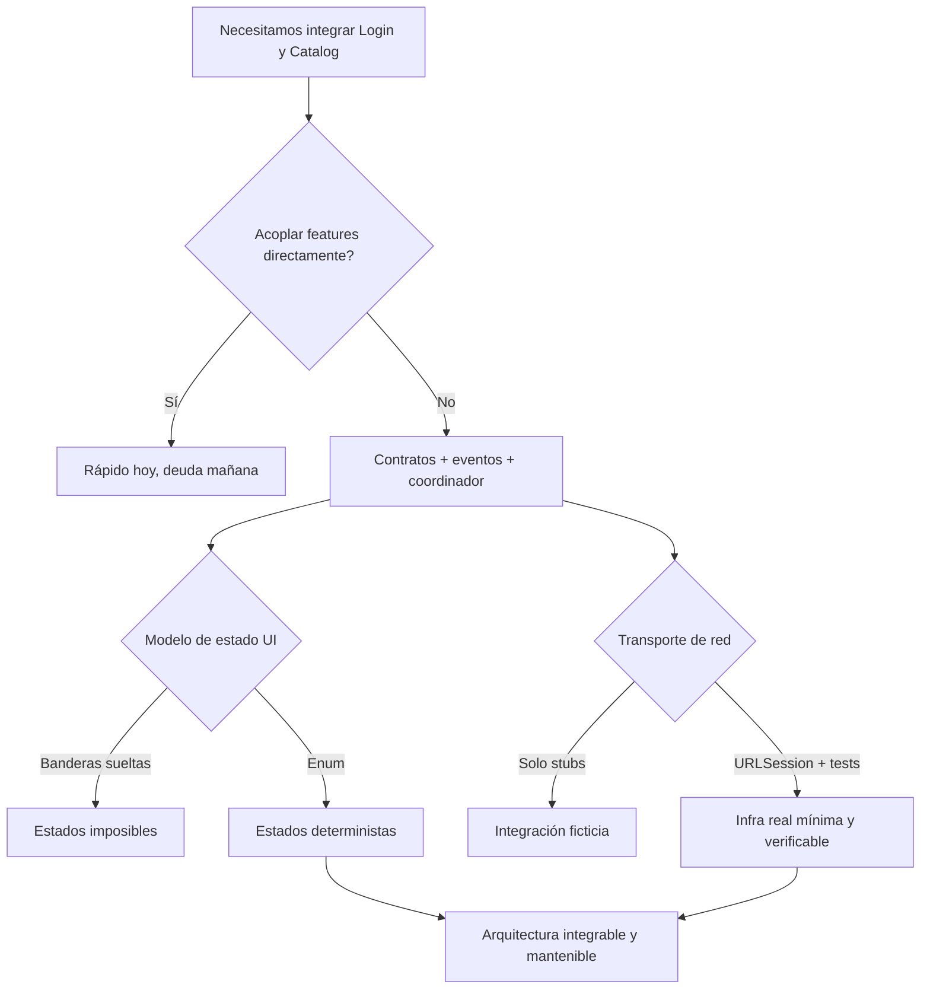

# ADR-002: Diseño de la Feature Catalog

- Estado: Aprobado
- Fecha: 2026-02-07
- Contexto: Etapa 2 (Integración)
- Feature: Catalog
- Relacionada con: `01-feature-catalog/*`, `02-navegacion-eventos.md`, `03-contratos-features.md`

---

## Contexto

Catalog es la segunda feature del sistema y el primer caso donde la arquitectura deja de ser "interna" para convertirse en "colaborativa". Login ya existe y funciona. Ahora necesitamos:

1. Incorporar una feature de lectura (`Catalog`) con calidad equivalente.
2. Integrarla con Login sin dependencia interna cruzada.
3. Introducir infraestructura de red real mínima manteniendo testabilidad.

El riesgo principal en este punto no es técnico de Swift, sino arquitectónico: que por rapidez se introduzcan atajos que acoplen features y degraden el sistema.

---

## Drivers de decisión

Las decisiones de esta ADR se evaluaron contra estos criterios:

1. **Desacople entre features**.
2. **Trazabilidad de comportamiento (BDD -> tests -> código)**.
3. **Coste de mantenimiento bajo cambio**.
4. **Compatibilidad con Clean Architecture + DDD**.
5. **Compatibilidad con concurrencia segura (Swift 6.2)**.

---

## Decisión principal

Se implementa Catalog como **feature vertical completa** (Domain/Application/Infrastructure/Interface), integrada por **contratos y navegación por eventos**, no por imports entre internals de features.

Esto implica:

- Login y Catalog se comunican por eventos/contratos.
- Coordinador decide rutas globales.
- Infraestructura mapea DTO -> dominio antes de exponer datos.

---

## Decisiones específicas y rationale

## 1) `Price` usa `Decimal` y no `Double`

Decisión:
- El valor monetario de producto se modela con `Decimal`.

Alternativas:
- A) `Double`: simple pero impreciso para dinero.
- B) `Decimal`: precisión decimal correcta.
- C) `Int` en centavos: robusto pero menos legible para didáctica inicial.

Elección:
- **B** para equilibrio entre precisión y legibilidad.

Consecuencia:
- Mapping explícito de payload a `Decimal` en infraestructura.

Trigger de revisión:
- Si aparecen problemas de localización/precisión avanzada, evaluar C con VO monetario más estricto.

---

## 2) Puerto `ProductRepository` (semántica de dominio)

Decisión:
- El caso de uso depende de `ProductRepository`, no de un cliente HTTP.

Alternativas:
- A) `LoadProductsUseCase` llama `HTTPClient` directamente.
- B) Puerto de repositorio orientado a dominio.
- C) Gateway híbrido (mezcla transporte + negocio).

Elección:
- **B**.

Consecuencia:
- Application conoce intención de negocio, no detalles de transporte.

Trigger de revisión:
- Si surge múltiples fuentes (cache + remote), mantener B y ampliar estrategia interna del repositorio.

---

## 3) Estado de pantalla con enum exclusivo

Decisión:
- `CatalogViewModel` modela estado con enum (`loading/loaded/empty/error`).

Alternativas:
- A) Banderas sueltas (`isLoading`, `error`, `products`).
- B) Enum de estado mutuamente excluyente.
- C) Máquina de estados formal con reducer completo.

Elección:
- **B** en Etapa 2.

Consecuencia:
- Menos estados imposibles, rendering más determinista.

Trigger de revisión:
- Si la complejidad de pantalla crece (filtros, paginación, refresh parcial), evaluar C.

---

## 4) Error handling explícito por semántica

Decisión:
- Diferenciar al menos `connectivity` e `invalidData` en dominio/aplicación.

Alternativas:
- A) Error genérico único.
- B) Errores tipados por categoría de negocio/técnica.
- C) Propagar errores de Foundation tal cual.

Elección:
- **B**.

Consecuencia:
- UX y observabilidad más precisas.

Trigger de revisión:
- Si aparece autenticación expirada en ruta de catálogo, incorporar `unauthorized` con política de routing.

---

## 5) Integración entre features por eventos, no por imports

Decisión:
- Login emite evento; coordinador decide transición hacia Catalog.

Alternativas:
- A) Login navega directamente a vistas de Catalog.
- B) Coordinador + eventos tipados.
- C) Service locator de rutas en strings.

Elección:
- **B**.

Consecuencia:
- Menor acoplamiento, mejor testabilidad de flujo.

Trigger de revisión:
- Si coordinador crece demasiado, extraer políticas de routing por dominio sin romper contrato de eventos.

---

## 6) Infraestructura real mínima con `URLSessionHTTPClient`

Decisión:
- Implementar transporte real mediante adaptador dedicado al protocolo `HTTPClient`.

Alternativas:
- A) Mantener todo en stubs (sin cliente real).
- B) Introducir cliente real mínimo y testearlo con `URLProtocolStub`.
- C) Integrar SDK externo de networking desde ya.

Elección:
- **B**.

Consecuencia:
- Se prueba integración real sin perder determinismo.

Trigger de revisión:
- Si aparecen necesidades transversales (retry/backoff/circuit-breaking), introducir decoradores adicionales.

---

## Diagrama de decisión global

---

## Consecuencias aceptadas

Positivas:

- Reproducibilidad del método en segunda feature.
- Integración desacoplada y trazable.
- Base sólida para Etapa 3 (cache/offline y observabilidad).

Costes aceptados:

- Mayor disciplina inicial de contratos/tests.
- Más archivos y estructura que una solución ad-hoc.

Riesgos abiertos:

- Crecimiento del coordinador si no se gobierna.
- Shared contracts sobredimensionado si no se controla ownership.

Mitigación:

- Revisiones por límites de dependencia.
- ADRs incrementales para cambios de contrato.
- Integration tests en flujos críticos.

---

## Verificabilidad

Supuestos:

- El curso usa Swift 6.2 con concurrencia estricta según documento base.

N/D:

- Esta ADR no fija tooling externo concreto para análisis estático de dependencias.

Cómo validar en práctica:

- Revisar imports cruzados por feature.
- Validar trazabilidad BDD -> tests.
- Ejecutar tests unitarios + integración de rutas críticas.

---

## Estado de implementación esperado

Esta ADR se considera implementada cuando:

- existe `Catalog` completo por capas,
- la navegación Login -> Catalog pasa por coordinador/evento,
- el transporte real mínimo está integrado,
- y los tests de integración cubren colaboración real.

---

## Referencias

- [00-especificacion-bdd.md](00-especificacion-bdd.md)
- [01-domain.md](01-domain.md)
- [02-application.md](02-application.md)
- [03-infrastructure.md](03-infrastructure.md)
- [04-interface-swiftui.md](04-interface-swiftui.md)
- [../02-navegacion-eventos.md](../02-navegacion-eventos.md)
- [../03-contratos-features.md](../03-contratos-features.md)
