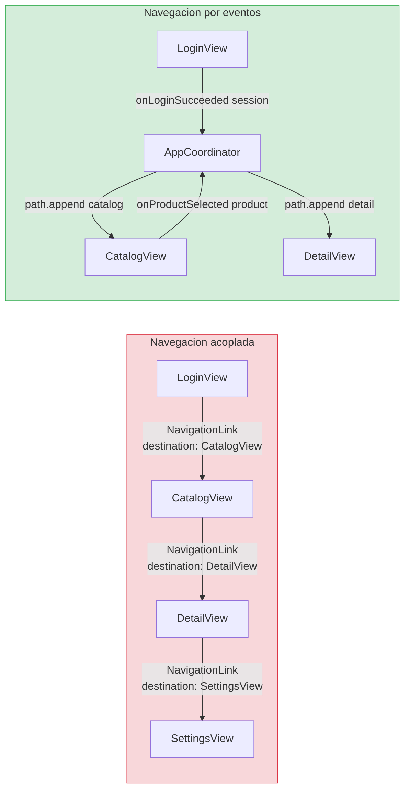
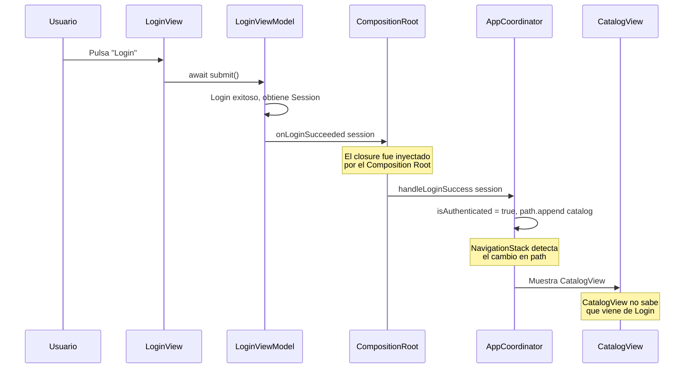

# Navegación por eventos: el AppCoordinator

## El problema de la navegación acoplada

En la Etapa 1, la feature Login tenía un closure `onLoginSucceeded: (Session) -> Void` que el Composition Root inyectaba. Ese closure hacía un `print`. Ahora necesitamos que haga algo real: navegar a la pantalla del Catalog. Pero hay una restricción: Login no puede conocer Catalog. Si `LoginView` hiciera un `NavigationLink(destination: CatalogView(...))`, Login dependería de Catalog, violando el principio de independencia entre features.

La solución es un **coordinador**: un componente que conoce todas las features y decide la navegación en función de los eventos que emiten. Las features no saben a dónde van; el coordinador decide.

---

### Diagrama: navegación acoplada vs desacoplada



En el modelo acoplado, cada vista conoce la siguiente. Si quieres cambiar el flujo (por ejemplo, mostrar un onboarding entre Login y Catalog), necesitas modificar LoginView. En el modelo desacoplado, solo cambias el Coordinator. Las features no se tocan.

### Diagrama: el flujo completo de un evento de navegación



Este flujo muestra la cadena completa: el usuario pulsa, el ViewModel ejecuta, emite un evento, el Composition Root lo redirige, el Coordinator navega. En ningún momento Login conoce la existencia de Catalog.

---

## El modelo de navegación con NavigationStack

En SwiftUI moderno (iOS 16+), la navegación se gestiona con `NavigationStack` y `NavigationPath`. El `NavigationPath` es una colección tipada de destinos: puedes hacer push de valores y la vista los renderiza con `navigationDestination`.

Nuestro coordinador gestiona un `NavigationPath` y expone métodos para cada transición de navegación. Las features llaman a estos métodos a través de closures, sin saber qué pasa internamente.

### El enum de destinos

Primero definimos los destinos posibles de la navegación:

```swift
// StackMyArchitecture/App/Navigation/AppDestination.swift

enum AppDestination: Hashable {
    case catalog
    case productDetail(Product)
}
```

Cada caso del enum representa una pantalla a la que se puede navegar. `catalog` es la pantalla del catálogo después del login. `productDetail(Product)` es la pantalla de detalle de un producto (la implementaremos en una etapa futura, pero la definimos ahora para que la arquitectura esté preparada).

### El AppCoordinator

```swift
// StackMyArchitecture/App/Navigation/AppCoordinator.swift

import SwiftUI

@Observable
@MainActor
final class AppCoordinator {
    var path = NavigationPath()
    var isAuthenticated = false
    
    private let compositionRoot: CompositionRoot
    
    init(compositionRoot: CompositionRoot) {
        self.compositionRoot = compositionRoot
    }
    
    // MARK: - Navigation Actions
    
    func handleLoginSuccess(_ session: Session) {
        isAuthenticated = true
        path.append(AppDestination.catalog)
    }
    
    func handleProductSelected(_ product: Product) {
        path.append(AppDestination.productDetail(product))
    }
    
    func handleBack() {
        guard !path.isEmpty else { return }
        path.removeLast()
    }
    
    // MARK: - View Factory
    
    func makeLoginView() -> LoginView {
        compositionRoot.makeLoginView(
            onLoginSucceeded: { [weak self] session in
                self?.handleLoginSuccess(session)
            }
        )
    }
    
    func makeCatalogView() -> CatalogView {
        compositionRoot.makeCatalogView(
            onProductSelected: { [weak self] product in
                self?.handleProductSelected(product)
            }
        )
    }
}
```

Vamos a analizar las decisiones de diseño:

**`@Observable`** — el coordinador es observable porque su estado (`path`, `isAuthenticated`) afecta a la UI. Cuando el path cambia, SwiftUI re-renderiza la navegación.

**`@MainActor`** — la navegación es una operación de UI que debe ocurrir en el main thread.

**`NavigationPath`** — es el stack de navegación. Cuando hacemos `path.append(.catalog)`, SwiftUI hace push de la pantalla del catálogo. Cuando hacemos `path.removeLast()`, hace pop.

**View Factory** — el coordinador crea las vistas usando el `CompositionRoot`, inyectando closures que conectan los eventos de las features con las acciones de navegación. Cuando Login emite `onLoginSucceeded`, el coordinador llama a `handleLoginSuccess`, que hace push del catálogo.

**`[weak self]`** — usamos weak self en los closures para evitar retención cíclica. El coordinador retiene a las vistas (indirectamente, a través del NavigationPath), y las vistas retienen closures que referencian al coordinador. Sin `[weak self]`, habría un ciclo de retención.

### El Composition Root actualizado

El Composition Root necesita un nuevo factory method para la vista del Catalog:

```swift
// StackMyArchitecture/App/CompositionRoot.swift (actualizado)

import SwiftUI

@MainActor
struct CompositionRoot {
    private let baseURL = URL(string: "https://api.example.com")!
    
    func makeLoginView(
        onLoginSucceeded: @MainActor @escaping (Session) -> Void
    ) -> LoginView {
        let httpClient = URLSessionHTTPClient()
        let gateway = RemoteAuthGateway(httpClient: httpClient, baseURL: baseURL)
        let useCase = LoginUseCase(authGateway: gateway)
        let viewModel = LoginViewModel(
            login: useCase,
            onLoginSucceeded: onLoginSucceeded
        )
        return LoginView(viewModel: viewModel)
    }
    
    func makeCatalogView(
        onProductSelected: @MainActor @escaping (Product) -> Void
    ) -> CatalogView {
        let httpClient = URLSessionHTTPClient()
        let repository = RemoteProductRepository(httpClient: httpClient, baseURL: baseURL)
        let useCase = LoadProductsUseCase(repository: repository)
        let viewModel = CatalogViewModel(
            loadProducts: useCase,
            onProductSelected: onProductSelected
        )
        return CatalogView(viewModel: viewModel)
    }
}
```

### La App principal con el coordinador

```swift
// StackMyArchitecture/App/StackMyArchitectureApp.swift

import SwiftUI

@main
struct StackMyArchitectureApp: App {
    @State private var coordinator: AppCoordinator
    
    init() {
        let compositionRoot = CompositionRoot()
        _coordinator = State(wrappedValue: AppCoordinator(compositionRoot: compositionRoot))
    }
    
    var body: some Scene {
        WindowGroup {
            NavigationStack(path: $coordinator.path) {
                coordinator.makeLoginView()
                    .navigationDestination(for: AppDestination.self) { destination in
                        switch destination {
                        case .catalog:
                            coordinator.makeCatalogView()
                        case .productDetail(let product):
                            Text("Detalle de \(product.name)")
                        }
                    }
            }
        }
    }
}
```

El flujo completo es:

1. La app arranca y muestra `LoginView` (la raíz del NavigationStack).
2. El usuario hace login. `LoginViewModel` llama a `onLoginSucceeded(session)`.
3. El closure llega al `AppCoordinator.handleLoginSuccess`, que hace `path.append(.catalog)`.
4. SwiftUI detecta el cambio en `path` y busca el `navigationDestination` que maneja `.catalog`.
5. El coordinator crea `CatalogView` y SwiftUI la muestra con animación de push.

Las features no se conocen entre sí. Login no importa Catalog. Catalog no importa Login. El coordinador es el punto de conexión.

---

## Tests del AppCoordinator

```swift
// StackMyArchitectureTests/App/Navigation/AppCoordinatorTests.swift

import XCTest
@testable import StackMyArchitecture

@MainActor
final class AppCoordinatorTests: XCTestCase {
    
    private func makeSUT() -> AppCoordinator {
        let compositionRoot = CompositionRoot()
        return AppCoordinator(compositionRoot: compositionRoot)
    }
    
    func test_init_starts_unauthenticated_with_empty_path() {
        let sut = makeSUT()
        
        XCTAssertFalse(sut.isAuthenticated)
        XCTAssertTrue(sut.path.isEmpty)
    }
    
    func test_handleLoginSuccess_sets_authenticated_and_pushes_catalog() {
        let sut = makeSUT()
        let session = Session(token: "t", email: "e")
        
        sut.handleLoginSuccess(session)
        
        XCTAssertTrue(sut.isAuthenticated)
        XCTAssertEqual(sut.path.count, 1)
    }
    
    func test_handleProductSelected_pushes_product_detail() {
        let sut = makeSUT()
        let product = Product(
            id: "1",
            name: "Test",
            price: Price(amount: 10, currency: "EUR"),
            imageURL: URL(string: "https://example.com/img.png")!
        )
        
        sut.handleProductSelected(product)
        
        XCTAssertEqual(sut.path.count, 1)
    }
    
    func test_handleBack_removes_last_from_path() {
        let sut = makeSUT()
        sut.handleLoginSuccess(Session(token: "t", email: "e"))
        XCTAssertEqual(sut.path.count, 1)
        
        sut.handleBack()
        
        XCTAssertTrue(sut.path.isEmpty)
    }
    
    func test_handleBack_on_empty_path_does_nothing() {
        let sut = makeSUT()
        
        sut.handleBack()
        
        XCTAssertTrue(sut.path.isEmpty)
    }
}
```

Los tests verifican el estado del coordinador (autenticación y path) sin necesidad de renderizar UI. Esto es posible porque la lógica de navegación vive en el coordinador, no en las vistas.

---

## El diagrama del flujo de navegación

```
┌──────────────────────────────────────────────────────────┐
│                    StackMyArchitectureApp                  │
│                                                           │
│  ┌─────────────┐    ┌──────────────┐    ┌──────────────┐ │
│  │  LoginView   │───>│ AppCoordinator│───>│ CatalogView  │ │
│  │              │    │              │    │              │ │
│  │ onLogin      │    │ path.append  │    │ onProduct    │ │
│  │ Succeeded()  │    │ (.catalog)   │    │ Selected()   │ │
│  └──────────────┘    └──────────────┘    └──────────────┘ │
│                              │                            │
│                    ┌─────────────────┐                    │
│                    │CompositionRoot  │                    │
│                    │ • makeLoginView │                    │
│                    │ • makeCatalogView│                    │
│                    └─────────────────┘                    │
└──────────────────────────────────────────────────────────┘
```

Las flechas representan closures, no dependencias directas. Login y Catalog no se importan mutuamente. El coordinador y el Composition Root son los únicos que conocen ambas features.

---

## Por qué no usamos un event bus genérico

Una alternativa popular es crear un "event bus" o "message bus" donde las features publican eventos y los suscriptores reaccionan. Esto puede sonar atractivo, pero tiene problemas:

Los eventos no son tipados: cualquier componente puede publicar cualquier evento, y no hay garantía de que alguien lo escuche. El flujo de datos es difícil de rastrear: si algo no funciona, ¿quién publicó? ¿quién debería haber escuchado? Los tests son complicados porque el bus es un singleton global.

Nuestro enfoque con closures directos es más simple y más seguro: cada conexión es explícita, tipada, y visible en el código. Si un closure no se conecta, el compilador avisa. Si quieres saber qué pasa cuando Login tiene éxito, miras el coordinador y ves `path.append(.catalog)`. No hay indirección invisible.

Si en el futuro la app crece a 20+ features con eventos cross-cutting (analytics, logging, deep links), consideraremos un bus de eventos formal. Pero para 2-3 features, los closures son la solución correcta.

---

**Anterior:** [Feature Catalog ←](01-feature-catalog/04-interface-swiftui.md) · **Siguiente:** [Contratos entre features →](03-contratos-features.md)

---

## Matriz de rutas y origen de evento

Mantén un inventario por ruta:

- ruta destino;
- evento que la dispara;
- precondiciones (auth/permisos);
- test que la cubre.

Esta matriz evita rutas huérfanas y simplifica soporte de deep links futuros.

---

## Verificación rápida de navegación desacoplada

Si puedes cambiar destino de un evento sin editar la feature emisora, la navegación está correctamente desacoplada.
