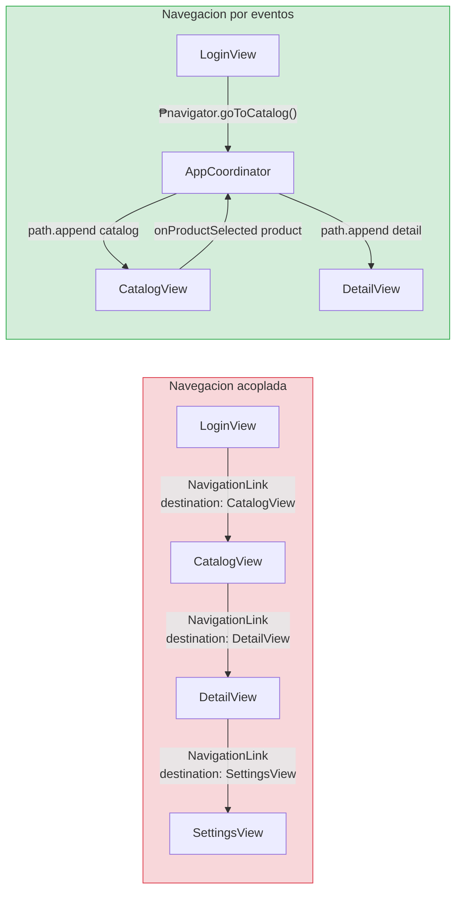
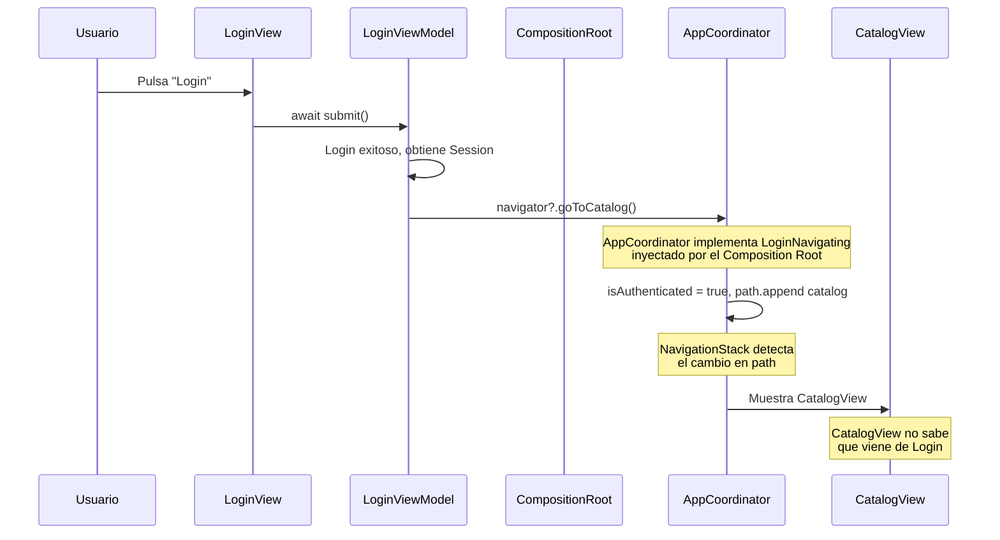

# Navegación por eventos: el AppCoordinator

## Objetivo de aprendizaje

Al terminar esta lección vas a poder implementar un sistema de navegación event-driven con `AppCoordinator` que desacopla completamente las features entre sí. Podrás agregar nuevas rutas y transiciones modificando solo el coordinador, sin tocar ninguna feature existente.

En lenguaje simple: el coordinador es el mapa de la ciudad. Las features son los edificios. Los edificios no saben dónde están los demás — el mapa sí. Si añades un edificio nuevo, no rebuildes los existentes, solo actualizas el mapa.

---

## El problema de la navegación acoplada

En la Etapa 1, la feature Login ya definía el protocolo `LoginNavigating` con el método `goToCatalog()`. La implementación era un simple `PrintNavigator` que solo hacía un `print`. Ahora necesitamos que el `AppCoordinator` implemente `LoginNavigating` y haga navegación real hacia la pantalla del Catalog. Pero hay una restricción: Login no puede conocer Catalog. Si `LoginView` hiciera un `NavigationLink(destination: CatalogView(...))`, Login dependería de Catalog, violando el principio de independencia entre features.

La solución es un **coordinador**: un componente que conoce todas las features y decide la navegación en función de los eventos que emiten. Las features no saben a dónde van; el coordinador decide.

---

### Diagrama: navegación acoplada vs desacoplada


```mermaid
graph LR
    subgraph Coupled["Navegacion acoplada"]
        direction TB
        LV1["LoginView"] -->|"NavigationLink<br/>destination: CatalogView"| CV1["CatalogView"]
        CV1 -->|"NavigationLink<br/>destination: DetailView"| DV1["DetailView"]
        DV1 -->|"NavigationLink<br/>destination: SettingsView"| SV1["SettingsView"]
    end

    subgraph Decoupled["Navegacion por eventos"]
        direction TB
        LV2["LoginView"] -->|"₱navigator.goToCatalog()"| COORD["AppCoordinator"]
        CV2["CatalogView"] -->|"onProductSelected product"| COORD
        COORD -->|"path.append catalog"| CV2
        COORD -->|"path.append detail"| DV2["DetailView"]
    end

    style Coupled fill:#f8d7da,stroke:#dc3545
    style Decoupled fill:#d4edda,stroke:#28a745
```

En el modelo acoplado, cada vista conoce la siguiente. Si quieres cambiar el flujo (por ejemplo, mostrar un onboarding entre Login y Catalog), necesitas modificar LoginView. En el modelo desacoplado, solo cambias el Coordinator. Las features no se tocan.

### Diagrama: el flujo completo de un evento de navegación


```mermaid
sequenceDiagram
    participant User as Usuario
    participant LV as LoginView
    participant VM as LoginViewModel
    participant CR as CompositionRoot
    participant COORD as AppCoordinator
    participant CV as CatalogView

    User->>LV: Pulsa "Login"
    LV->>VM: await submit()
    VM->>VM: Login exitoso, obtiene Session
    VM->>COORD: navigator?.goToCatalog()
    Note over COORD: AppCoordinator implementa LoginNavigating<br/>inyectado por el Composition Root
    COORD->>COORD: isAuthenticated = true, path.append catalog
    Note over COORD: NavigationStack detecta<br/>el cambio en path
    COORD->>CV: Muestra CatalogView
    Note over CV: CatalogView no sabe<br/>que viene de Login
```

Este flujo muestra la cadena completa: el usuario pulsa, el ViewModel ejecuta, emite un evento, el Composition Root lo redirige, el Coordinator navega. En ningún momento Login conoce la existencia de Catalog.

---

## El modelo de navegación con NavigationStack

En SwiftUI moderno (iOS 16+), la navegación se gestiona con `NavigationStack` y `NavigationPath`. El `NavigationPath` es una colección tipada de destinos: puedes hacer push de valores y la vista los renderiza con `navigationDestination`.

Nuestro coordinador gestiona un `NavigationPath` y expone métodos para cada transición de navegación. Las features llaman a estos métodos a través de closures, sin saber qué pasa internamente.

### El enum de destinos

Primero definimos los destinos posibles de la navegación:

```swift
// StackMyArchitecture/App/Navigation/AppDestination.swift

enum AppDestination: Hashable {
    case catalog
    case productDetail(Product)
}
```

**`Hashable`** — `NavigationPath` requiere que los tipos que almacena sean `Hashable`. Sin esta conformancia, el compilador rechaza `path.append(.catalog)` con un error de tipo. Como `AppDestination` es un enum cuyos casos asociados también son `Hashable` (y `Product` lo es por ser `Equatable` + `Hashable`), Swift sintetiza `Hashable` automáticamente.

**Por qué un enum** — cada caso representa una pantalla concreta con exactamente los datos que necesita. Si el destino necesita un parámetro (`productDetail(Product)`), se incluye en el caso. Si no necesita datos (`catalog`), el caso es simple. El compilador garantiza que todo `switch` sobre `AppDestination` cubra todos los destinos posibles.

**`productDetail(Product)` ya desde ahora** — aunque la pantalla de detalle no se implementa hasta una etapa futura, definir el destino aquí tiene dos ventajas: la arquitectura de navegación está preparada para recibirlo, y el coordinador puede añadir la ruta con un `Text` placeholder sin tocar las features existentes. No es sobreingeniería — es planificar la extensibilidad sin implementarla.

### El AppCoordinator

```swift
// StackMyArchitecture/App/Navigation/AppCoordinator.swift

import SwiftUI

@Observable
@MainActor
final class AppCoordinator: LoginNavigating {
    var path = NavigationPath()
    var isAuthenticated = false
    
    private let compositionRoot: CompositionRoot
    
    init(compositionRoot: CompositionRoot) {
        self.compositionRoot = compositionRoot
    }
    
    // MARK: - LoginNavigating
    
    func goToCatalog() {
        isAuthenticated = true
        path.append(AppDestination.catalog)
    }
    
    func handleProductSelected(_ product: Product) {
        path.append(AppDestination.productDetail(product))
    }
    
    func handleBack() {
        guard !path.isEmpty else { return }
        path.removeLast()
    }
    
    // MARK: - View Factory
    
    func makeLoginView() -> LoginView {
        compositionRoot.makeLoginView(navigator: self)
    }
    
    func makeCatalogView() -> CatalogView {
        compositionRoot.makeCatalogView(
            onProductSelected: { [weak self] product in
                self?.handleProductSelected(product)
            }
        )
    }
}
```

Vamos a analizar las decisiones de diseño:

**`@Observable`** — el coordinador es observable porque su estado (`path`, `isAuthenticated`) afecta a la UI. Cuando el path cambia, SwiftUI re-renderiza la navegación.

**`@MainActor`** — la navegación es una operación de UI que debe ocurrir en el main thread.

**`NavigationPath`** — es el stack de navegación. Cuando hacemos `path.append(.catalog)`, SwiftUI hace push de la pantalla del catálogo. Cuando hacemos `path.removeLast()`, hace pop.

**View Factory** — el coordinador crea las vistas usando el `CompositionRoot` e inyectándose a sí mismo como navigator. Como `AppCoordinator: LoginNavigating`, puede pasar `self` directamente. Cuando `LoginViewModel` llama a `navigator?.goToCatalog()`, el coordinador hace push del catálogo.

**Sin `[weak self]`** — el `LoginViewModel` ya declara `private weak var navigator`. El coordinador pasa `self` y el ViewModel lo retiene como `weak`. No hay ciclo de retención.

### El Composition Root actualizado

El Composition Root necesita un nuevo factory method para la vista del Catalog:

```swift
// StackMyArchitecture/App/CompositionRoot.swift (actualizado)

import SwiftUI

@MainActor
struct CompositionRoot {
    private let baseURL = URL(string: "https://api.example.com")!
    
    func makeLoginView(navigator: any LoginNavigating) -> LoginView {
        let httpClient = URLSessionHTTPClient()
        let gateway = AuthHTTPRepository(httpClient: httpClient, baseURL: baseURL)
        let useCase = AuthenticateUserUseCase(repository: gateway)
        let viewModel = LoginViewModel(
            useCase: useCase,
            navigator: navigator
        )
        return LoginView(viewModel: viewModel)
    }
    
    func makeCatalogView(
        onProductSelected: @MainActor @escaping (Product) -> Void
    ) -> CatalogView {
        let httpClient = URLSessionHTTPClient()
        let repository = RemoteProductRepository(httpClient: httpClient, baseURL: baseURL)
        let useCase = LoadProductsUseCase(repository: repository)
        let viewModel = CatalogViewModel(
            loadProducts: useCase,
            onProductSelected: onProductSelected
        )
        return CatalogView(viewModel: viewModel)
    }
}
```

> **Nota:** `URLSessionHTTPClient` aparece aquí como referencia conceptual. Su implementación completa se detalla en la Lección 9 (Infraestructura real: URLSessionHTTPClient). En este punto del curso, puedes usar un stub o dejar el tipo como placeholder si sigues el orden de lecciones.

**Dos instancias de `URLSessionHTTPClient`** — por claridad, cada factory crea su propio cliente. En producción con múltiples features, compartirías una única instancia de `URLSessionHTTPClient` inyectada en el `CompositionRoot` para evitar duplicar recursos. En Etapa 2, la simplicidad prima sobre la optimización.

**`baseURL` compartida** — el mismo endpoint base para todas las features. Si las features usan endpoints diferentes, `CompositionRoot` puede recibir un `Environment` con múltiples URLs.

### La App principal con el coordinador

```swift
// StackMyArchitecture/App/StackMyArchitectureApp.swift

import SwiftUI

@main
struct StackMyArchitectureApp: App {
    @State private var coordinator: AppCoordinator
    
    init() {
        let compositionRoot = CompositionRoot()
        _coordinator = State(wrappedValue: AppCoordinator(compositionRoot: compositionRoot))
    }
    
    var body: some Scene {
        WindowGroup {
            NavigationStack(path: $coordinator.path) {
                coordinator.makeLoginView()
                    .navigationDestination(for: AppDestination.self) { destination in
                        switch destination {
                        case .catalog:
                            coordinator.makeCatalogView()
                        case .productDetail(let product):
                            Text("Detalle de \(product.name)")
                        }
                    }
            }
        }
    }
}
```

**`@State private var coordinator: AppCoordinator`** — el coordinador usa `@Observable`, por eso `@State` y no `@StateObject`. Si usaras `@StateObject` con `@Observable`, recibirías un warning de Xcode porque son sistemas de observación distintos.

**`_coordinator = State(wrappedValue:)`** — cuando inicializas un `@State` dentro de `init()`, necesitas acceder a la propiedad con el prefijo `_` (el "storage" del property wrapper). Es la única forma de inicializar `@State` con un valor calculado (como el `AppCoordinator` que necesita el `CompositionRoot`). Fuera de `init()`, siempre usas `coordinator` sin el guión bajo.

**`NavigationStack(path: $coordinator.path)`** — el binding `$coordinator.path` conecta el stack de navegación de SwiftUI con la propiedad del coordinador. Cuando el coordinador hace `path.append(.catalog)`, SwiftUI detecta el cambio y hace push. Cuando SwiftUI detecta que el usuario desliza para volver, actualiza `path` y el coordinador queda sincronizado automáticamente.

**`navigationDestination(for: AppDestination.self)`** — registra un builder de vista para cada tipo de destino. Cuando `path` contiene un `AppDestination`, SwiftUI invoca este closure con el valor concreto. El `switch` sobre `destination` decide qué vista mostrar. Si añades un nuevo caso al enum sin actualizar el `switch`, el compilador te avisa.

**`isAuthenticated`** — el coordinador lo pone a `true` en `handleLoginSuccess`. En esta etapa se usa como indicador de estado para posible lógica de guardia futura (por ejemplo, redirigir a Login si la sesión expira). El `NavigationPath` ya gestiona la navegación real; `isAuthenticated` es la fuente de verdad para el estado de autenticación global.

El flujo completo es:

1. La app arranca y muestra `LoginView` (la raíz del `NavigationStack`).
2. El usuario hace login. `LoginViewModel` llama a `navigator?.goToCatalog()`.
3. `AppCoordinator.goToCatalog()` hace `isAuthenticated = true` y `path.append(.catalog)`.
4. SwiftUI detecta el cambio en `path` y busca el `navigationDestination` que maneja `.catalog`.
5. El coordinador crea `CatalogView` y SwiftUI la muestra con animación de push.

Las features no se conocen entre sí. Login no importa Catalog. Catalog no importa Login. El coordinador es el único punto de conexión.

---

## Tests del AppCoordinator

```swift
// StackMyArchitectureTests/App/Navigation/AppCoordinatorTests.swift

import XCTest
@testable import StackMyArchitecture

@MainActor
final class AppCoordinatorTests: XCTestCase {
    
    private func makeSUT() -> AppCoordinator {
        let compositionRoot = CompositionRoot()
        return AppCoordinator(compositionRoot: compositionRoot)
    }
    
    func test_init_starts_unauthenticated_with_empty_path() {
        let sut = makeSUT()
        
        XCTAssertFalse(sut.isAuthenticated)
        XCTAssertTrue(sut.path.isEmpty)
    }
    
    func test_handleLoginSuccess_sets_authenticated_and_pushes_catalog() {
        let sut = makeSUT()
        let session = Session(token: "t", email: "e")
        
        sut.handleLoginSuccess(session)
        
        XCTAssertTrue(sut.isAuthenticated)
        XCTAssertEqual(sut.path.count, 1)
    }
    
    func test_handleProductSelected_pushes_product_detail() {
        let sut = makeSUT()
        let product = Product(
            id: "1",
            name: "Test",
            price: Price(amount: 10, currency: "EUR"),
            imageURL: URL(string: "https://example.com/img.png")!
        )
        
        sut.handleProductSelected(product)
        
        XCTAssertEqual(sut.path.count, 1)
    }
    
    func test_handleBack_removes_last_from_path() {
        let sut = makeSUT()
        sut.handleLoginSuccess(Session(token: "t", email: "e"))
        XCTAssertEqual(sut.path.count, 1)
        
        sut.handleBack()
        
        XCTAssertTrue(sut.path.isEmpty)
    }
    
    func test_handleBack_on_empty_path_does_nothing() {
        let sut = makeSUT()
        
        sut.handleBack()
        
        XCTAssertTrue(sut.path.isEmpty)
    }
}
```

**`@MainActor` en la clase de tests** — `AppCoordinator` está aislado en `@MainActor`, igual que `CatalogViewModel`. Sin anotar la clase de tests, Swift 6 rechazaría las llamadas a métodos del coordinador desde un contexto sin aislamiento.

**`makeSUT()` usa `CompositionRoot()` real** — en esta etapa, el `CompositionRoot` no hace llamadas de red al instanciarse (solo al llamar a `makeLoginView` o `makeCatalogView`). Los tests que tenemos solo verifican el estado del coordinador, no crean vistas, así que no hay riesgo de llamadas reales. En etapas futuras, si `CompositionRoot` necesita recursos externos al construirse, convendrá introducir un `CompositionRootProtocol` mockeable.

**`XCTAssertEqual(sut.path.count, 1)` y no el destino concreto** — `NavigationPath` es un tipo opaco: no expone su contenido como array. Solo puedes consultar `.count` e `.isEmpty`. Esto es una limitación de diseño de SwiftUI — la ruta es interna y no inspeccionable en detalle desde tests. En la práctica, verificar que se añadió exactamente un elemento es suficiente para documentar el contrato de `handleLoginSuccess`.

**`test_handleBack_on_empty_path_does_nothing`** — este test puede parecer trivial pero es importante: documenta que llamar a `handleBack()` sobre un path vacío es seguro. Sin la `guard !path.isEmpty`, `path.removeLast()` lanzaría un fatalError en runtime. El test protege esa invariante.

Los tests verifican el estado del coordinador (autenticación y path) sin necesidad de renderizar UI. Esto es posible precisamente porque la lógica de navegación vive en el coordinador, no en las vistas.

---

## El diagrama del flujo de navegación

```text
┌──────────────────────────────────────────────────────────┐
│                    StackMyArchitectureApp                  │
│                                                           │
│  ┌─────────────┐    ┌──────────────┐    ┌──────────────┐ │
│  │  LoginView   │───>│ AppCoordinator│───>│ CatalogView  │ │
│  │              │    │              │    │              │ │
│  │ onLogin      │    │ path.append  │    │ onProduct    │ │
│  │ Succeeded()  │    │ (.catalog)   │    │ Selected()   │ │
│  └──────────────┘    └──────────────┘    └──────────────┘ │
│                              │                            │
│                    ┌─────────────────┐                    │
│                    │CompositionRoot  │                    │
│                    │ • makeLoginView │                    │
│                    │ • makeCatalogView│                    │
│                    └─────────────────┘                    │
└──────────────────────────────────────────────────────────┘
```

Las flechas representan closures, no dependencias directas. Login y Catalog no se importan mutuamente. El coordinador y el Composition Root son los únicos que conocen ambas features.

---

## Por qué no usamos un event bus genérico

Una alternativa popular es crear un "event bus" o "message bus" donde las features publican eventos y los suscriptores reaccionan.

```swift
// ❌ Event bus genérico — atractivo en apariencia, problemático en práctica
class EventBus {
    static let shared = EventBus()  // ❌ singleton global — difícil de testear
    func publish(_ event: Any) { ... }
    func subscribe(_ handler: (Any) -> Void) { ... }  // ❌ sin tipos — cualquier cosa
}

// En LoginViewModel:
EventBus.shared.publish(LoginSucceededEvent(session: session))
// ¿Quién escucha esto? ¿Siempre hay alguien? El compilador no lo sabe.

// ✅ Protocolo tipado — explícito, trazable, testeable
final class LoginViewModel {
    private weak var navigator: (any LoginNavigating)?  // ← protocolo, visible
    // Cuando llamamos navigator?.goToCatalog(), sabemos exactamente qué pasa:
    // el Composition Root inyectó AppCoordinator que hace path.append(.catalog)
}
```

Nuestro enfoque con protocolos tipados tiene tres ventajas clave:

- **Tipado en compilación** — si el tipo del closure no coincide, el compilador falla antes de ejecutar;
- **Trazabilidad directa** — para saber qué pasa cuando Login tiene éxito, miras el coordinador y ves `path.append(.catalog)`. Sin indirección invisible;
- **Tests simples** — el coordinador es un objeto normal; no hay singleton que limpiar entre tests.

Si en el futuro la app crece a 20+ features con eventos cross-cutting (analytics, logging, deep links), consideraremos un bus de eventos formal con tipos sealed. Pero para 2-3 features, los protocolos de navegación son la solución correcta.

---

## Matriz de rutas y origen de evento

Mantén siempre un inventario de las rutas definidas en el coordinador. Esta tabla evita rutas huérfanas y es la primera referencia cuando se añaden deep links o nuevas features:

| Destino | Evento disparador | Feature emisora | Precondición | Test que lo cubre |
| --- | --- | --- | --- | --- |
| `.catalog` | `navigator.goToCatalog()` | Login | — | `test_goToCatalog_sets_authenticated_and_pushes_catalog` |
| `.productDetail(Product)` | `onProductSelected(Product)` | Catalog | Autenticado | `test_handleProductSelected_pushes_product_detail` |

Cuando añadas una nueva ruta, actualiza esta tabla antes de tocar el código. Si la tabla tiene una entrada sin test asociado, la ruta está incompleta.

---

## Plan TDD del AppCoordinator

El coordinador tiene lógica de negocio real — no es solo un contenedor de vistas. Sus invariantes merecen test-first: estado inicial, transiciones, protección contra estados imposibles.

**Paso 1 — Red: test del estado inicial.**

```swift
// AppCoordinator no existe aún → no compila → guía el diseño
func test_init_starts_unauthenticated_with_empty_path() {
    let sut = AppCoordinator(compositionRoot: CompositionRoot())
    XCTAssertFalse(sut.isAuthenticated)
    XCTAssertTrue(sut.path.isEmpty)
    // El test define: AppCoordinator necesita un init con CompositionRoot,
    // y debe exponer isAuthenticated: Bool y path: NavigationPath (o .count / .isEmpty).
}
```

**Paso 2 — Green:** implementación mínima de `AppCoordinator` con las dos propiedades.

**Paso 3 — Red: test de login exitoso.**

```swift
func test_handleLoginSuccess_sets_authenticated_and_pushes_catalog() {
    let sut = AppCoordinator(compositionRoot: CompositionRoot())
    sut.handleLoginSuccess(Session(token: "t", email: "e@test.com"))
    XCTAssertTrue(sut.isAuthenticated)
    XCTAssertEqual(sut.path.count, 1)
    // NavigationPath es opaco — solo puedes consultar count e isEmpty.
    // No puedes verificar que el destino es ".catalog", solo que se añadió algo.
    // El compilador garantiza que solo AppDestination puede entrar en path.
}
```

**Paso 4 — Green:** implementar `handleLoginSuccess` que muta `isAuthenticated` y hace `path.append(.catalog)`.

**Paso 5 — Red: test de protección contra path vacío.**

```swift
func test_handleBack_on_empty_path_does_nothing() {
    let sut = AppCoordinator(compositionRoot: CompositionRoot())
    sut.handleBack()  // sin guard, esto sería un fatalError en runtime
    XCTAssertTrue(sut.path.isEmpty)
    // Este test documenta que handleBack es seguro siempre — invariante de diseño.
}
```

**Paso 6 — Green:** añadir `guard !path.isEmpty else { return }` en `handleBack()`. El test pasa.

**Paso 7 — Refactor:** extraer `makeSUT()` como factory helper, añadir `makeSession()` y `makeProduct()` helpers para que los tests no repitan construcción.

---

## Concurrencia: navegación en el hilo correcto

### Aislamiento

`AppCoordinator` está anotado con `@MainActor` por una razón específica: mutaciones de `NavigationPath` y del binding `$coordinator.path` deben ocurrir en el hilo principal. SwiftUI lee el `path` en el main thread para decidir qué vistas renderizar. Si un contexto background modifica `path` (incluso de forma segura, sin data race), la animación puede desincronizarse o producir comportamiento indefinido.

La anotación `@MainActor` no es una preferencia — es un requisito de correctitud. Sin ella, cada llamada a `handleLoginSuccess` desde una tarea async introduciría una condición de carrera invisible entre el hilo que escribe `path` y el hilo principal que lo lee.

```swift
// ✅ @MainActor garantiza que path solo se muta en el hilo principal
@Observable @MainActor
final class AppCoordinator {
    var path = NavigationPath()   // siempre leído y escrito en el main thread

    func handleLoginSuccess(_ session: Session) {
        // Esta función solo puede llamarse desde @MainActor
        // Si la llamas desde un Task sin aislamiento, el compilador lo rechaza
        isAuthenticated = true
        path.append(AppDestination.catalog)
    }
}
```

### `Sendable`

Los tipos que cruzan la frontera entre el contexto async del ViewModel (donde ocurre el login) y el `@MainActor` del coordinador deben ser `Sendable`:

- `Session` — cruza desde el contexto async de `AuthenticateUserUseCase` al `@MainActor` del coordinador. Debe ser `Sendable` (es un struct con `let` → automático).
- `AppDestination` — se almacena en `NavigationPath` que vive en `@MainActor`. Debe ser `Hashable + Sendable`.
- El método `@MainActor func goToCatalog()` del protocolo `LoginNavigating` — la anotación `@MainActor` en el protocolo garantiza que cualquier implementación ejecute la navegación en el hilo principal. El compilador lo exige.

```swift
// ✅ Protocolo con @MainActor garantiza que goToCatalog ocurre en el hilo correcto
func makeLoginView(navigator: any LoginNavigating) -> LoginView {
    // El ViewModel es @MainActor y llama a navigator?.goToCatalog().
    // La anotación @MainActor en el protocolo hace que Swift valide la aislación.
}
```

### Cancelación

Si el usuario pulsa "Login", la app inicia la tarea de autenticación y luego navega hacia atrás antes de que complete. La tarea de autenticación debe cancelarse, y el coordinador no debe recibir el evento de login exitoso si la tarea ya fue cancelada.

El ViewModel gestiona la cancelación almacenando la `Task` activa. El coordinador solo recibe el evento si la tarea completa sin ser cancelada:

```swift
// En LoginViewModel:
private var loginTask: Task<Void, Never>?

func submit() async {
    loginTask?.cancel()
    loginTask = Task { [weak self] in
        guard let self, !Task.isCancelled else { return }
        do {
            let session = try await loginUseCase.execute(...)
            guard !Task.isCancelled else { return }  // verificar antes de navegar
            navigator?.goToCatalog()                   // @MainActor (seguro desde VM @MainActor)
        } catch { ... }
    }
}
// Si el usuario navega atrás antes de que execute() complete:
// 1. loginTask?.cancel() cancela la tarea anterior
// 2. Task.isCancelled = true antes de llamar goToCatalog
// 3. El guard previene que el coordinador reciba la llamada de una tarea cancelada
```

---

## Anti-patrones y depuración

### Anti-patrón 1: features que se conocen directamente

Síntoma: `LoginView` crea o importa `CatalogView` para navegar a ella.

```swift
// ❌ Mal — Login conoce Catalog directamente
import FeatureCatalog  // ❌ dependencia cruzada entre features

struct LoginView: View {
    var body: some View {
        Button("Entrar") {
            // ❌ LoginView decide la navegación y conoce CatalogView
            NavigationLink(destination: CatalogView(...)) { ... }
        }
    }
}

// ✅ Bien — Login solo emite un evento; el coordinador decide la ruta
struct LoginView: View {
    var body: some View {
        Button("Entrar") {
            Task { await viewModel.submit() }
            // viewModel.navigator?.goToCatalog() → AppCoordinator → path.append(.catalog)
        }
    }
}
```

### Anti-patrón 2: lógica de navegación en el ViewModel

Síntoma: el ViewModel hace `path.append(...)` o tiene referencia al coordinador.

```swift
// ❌ Mal — ViewModel conoce el coordinador y navega directamente
@Observable @MainActor
final class LoginViewModel {
    private let coordinator: AppCoordinator  // ❌ ViewModel acoplado a navegación

    func submit() async {
        let session = try await loginUseCase.execute(...)
        coordinator.handleLoginSuccess(session)  // ❌ ViewModel decide la ruta
    }
}

// ✅ Bien — ViewModel delega la navegación al navigator; el exterior decide qué hacer
@Observable @MainActor
final class LoginViewModel {
    private weak var navigator: (any LoginNavigating)?  // ← protocolo opaco

    func submit() async {
        _ = try await useCase.execute(...)
        navigator?.goToCatalog()  // ✅ el ViewModel no sabe qué pasa después
    }
}
```

### Anti-patrón 3: God Coordinator con demasiadas responsabilidades

Síntoma: el coordinador gestiona navegación, autenticación, analytics, networking y estado global en el mismo tipo.

```swift
// ❌ Mal — God Coordinator
final class AppCoordinator {
    func handleLoginSuccess(_ session: Session) {
        isAuthenticated = true
        path.append(.catalog)
        analytics.track("login_success")       // ❌ analytics no es navegación
        keychain.save(session.token)           // ❌ persistencia no es navegación
        networkMonitor.startMonitoring()       // ❌ infraestructura no es navegación
        notificationCenter.requestPermission() // ❌ permisos no es navegación
    }
}

// ✅ Bien — coordinador solo navega; otras responsabilidades en sus propios servicios
final class AppCoordinator {
    func handleLoginSuccess(_ session: Session) {
        isAuthenticated = true
        path.append(.catalog)
        // analytics, persistencia, networking → otros servicios inyectados donde corresponde
    }
}
```

### Guía rápida de depuración

1. Si la navegación no ocurre tras un evento, verificar que el closure está conectado en `CompositionRoot` — un closure no conectado simplemente no se llama.
2. Si la pantalla aparece dos veces (push doble), verificar que `handleLoginSuccess` no se llama dos veces; añadir un guard `guard !isAuthenticated else { return }`.
3. Si el botón "Atrás" del sistema no funciona como esperas, verificar que no estás gestionando `path` manualmente en conflicto con el gesto del sistema.
4. Si los tests del coordinador fallan con errores de actor, añadir `@MainActor` a la clase de tests.

---

## A/B/C de diseño de navegación en esta etapa

### Opción A: AppCoordinator + NavigationPath (decisión actual)

Ventajas:

- navegación 100% desacoplada entre features;
- trazable: cada ruta está documentada en el coordinador;
- testeable sin UI.

Costes:

- requiere iOS 16+ para `NavigationPath`;
- más archivos iniciales que `NavigationLink` directo.

```swift
// ✅ Opción A — lo que tenemos en Etapa 2
final class AppCoordinator {
    var path = NavigationPath()

    func handleLoginSuccess(_ session: Session) {
        path.append(AppDestination.catalog)
    }
}
// Las features no se importan entre sí. Solo el coordinador conoce ambas.
```

### Opción B: NavigationLink directo en las vistas

Ventajas:

- menos archivos, implementación más rápida inicialmente.

Costes:

- cada feature conoce la siguiente — acoplamiento que crece con la app;
- cambiar un flujo de navegación requiere editar múltiples vistas;
- la lógica de flujo (¿a dónde vamos?) está dispersa por la UI.

```swift
// ❌ Opción B — NavigationLink acoplado
struct LoginView: View {
    var body: some View {
        NavigationLink(destination: CatalogView(...)) {
            Button("Entrar") { ... }
        }
        // Login conoce Catalog. Si añades un onboarding entre ellos,
        // tienes que editar LoginView.
    }
}
```

### Opción C: event bus global

Ventajas:

- desacoplado como los closures, con menos conexiones explícitas.

Costes:

- tipos no garantizados en compilación;
- difícil de testear (singleton global);
- flujo de datos invisible — quién escucha qué no es obvio.

```swift
// ❌ Opción C — event bus sin tipos
EventBus.shared.publish("login_success")  // String en lugar de tipo
// ¿Quién escucha esto? El compilador no lo sabe. El equipo tampoco.
```

Trigger para evolucionar de A hacia un bus de eventos formal:

- la app supera las 10 features con eventos que deben propagarse a múltiples suscriptores (analytics, deep links, logging);
- el equipo tiene evidencia de que los closures son insuficientes para la complejidad real.

---

## Checklist de calidad

- [ ] `AppDestination` define todos los destinos de navegación de la app.
- [ ] El coordinador es el único tipo que conoce todas las features.
- [ ] Las features emiten eventos mediante closures; no importan otras features.
- [ ] `navigationDestination` cubre todos los casos de `AppDestination`.
- [ ] Tests del coordinador verifican estado de path y autenticación.
- [ ] `handleBack()` protege contra path vacío.
- [ ] Matriz de rutas actualizada con todos los destinos.

---

## ADR corto de la lección

```markdown
## ADR-004: Navegación event-driven con AppCoordinator y NavigationPath
- Estado: Aprobado
- Contexto: dos features que necesitan colaborar sin acoplarse directamente
- Decisión: AppCoordinator centraliza rutas; features emiten closures tipados sin conocer destinos
- Consecuencias: mayor trazabilidad y testabilidad; requiere iOS 16+; más archivos iniciales
- Fecha: 2026-02-07
```

---

## Implementación en tu proyecto

El scaffold real tiene el sistema de navegación en `Sources/AppContracts/` y `Sources/AppComposition/`. Ambos usan el protocolo `LoginNavigating` — el mismo patrón que esta lección. Las diferencias son de naming y estructura:

| Concepto en lección | Fichero en scaffold | Diferencia clave |
|---|---|---|
| `AppDestination` enum | `Sources/AppContracts/NavigationContracts.swift` → `AppRoute` | Sin `productDetail` asociado; casos: `login`, `catalog` |
| `AppCoordinator` | `Sources/AppComposition/NavigationStore.swift` → `NavigationStore` | Usa `routes: [AppRoute]` en lugar de `NavigationPath` |
| Protocolo `LoginNavigating` | Protocolo `LoginNavigating` | Alineado — leción y scaffold usan el mismo patrón |

```swift
// Lo que ya existe en el scaffold
// Sources/AppContracts/NavigationContracts.swift
public enum AppRoute: Equatable, Sendable {
    case login
    case catalog
}

@MainActor
public protocol LoginNavigating: AnyObject {
    func goToCatalog()
}

// Sources/AppComposition/NavigationStore.swift
@MainActor
public final class NavigationStore: LoginNavigating {
    public private(set) var routes: [AppRoute] = [.login]

    public func goToCatalog() {
        guard routes.last != .catalog else { return }
        routes.append(.catalog)
    }
}
```

**Por qué el scaffold usa protocolo en lugar de closure.** El protocolo `LoginNavigating` es más explícito sobre el contrato — la feature Login solo necesita saber que "hay algo que puede navegar al catálogo", pero no cómo. Cualquier tipo que conforme `LoginNavigating` funciona como coordinador. En tests, puedes crear un `MockNavigationStore` que conforma `LoginNavigating` sin pasar un `AppCoordinator` real.

Los closures de esta lección son más simples de leer (menos boilerplate) y más directos. Los protocolos del scaffold son más explícitos sobre el contrato y más fáciles de mockear en tests de integración. Ambos resuelven el mismo problema: desacoplar features de la lógica de navegación.

**Qué hacer ahora:**
1. Abre `Sources/AppContracts/NavigationContracts.swift` — ve `AppRoute` y `LoginNavigating`.
2. Abre `Sources/AppComposition/NavigationStore.swift` — observa cómo `routes: [AppRoute]` cumple el mismo rol que `NavigationPath` en la lección.
3. Abre `Tests/AppCompositionTests/AppCompositionRootTests.swift` — revisa los tests del scaffold para `NavigationStore`.
4. **Ejercicio de extensión:** añade un caso `productDetail` a `AppRoute` y un método `func goToProductDetail(_ productId: String)` a `LoginNavigating`. Actualiza `NavigationStore` para implementarlo y añade un test que verifique que `routes` contiene `.productDetail(id)` tras la llamada.

---

## 🔭 Explora el scaffold — Navegación por eventos

```bash
open apps/ios/ArchitectureKit/Package.swift
# Navega a: Sources/AppContracts/NavigationContracts.swift
#           Sources/AppComposition/NavigationStore.swift (si existe)
```

El scaffold define `AppRoute` como enum (`login`, `catalog`) y `LoginNavigating` como protocolo `@MainActor`. Compara `NavigationContracts.swift` con los closures de coordinación de la lección: el protocolo es más explícito sobre el contrato, el closure es más simple de leer. Ambos logran el mismo desacoplamiento.

```bash
cd apps/ios/ArchitectureKit
swift test --filter AppCompositionTests
```

---


## Qué sigue

Con el coordinador en marcha, Login y Catalog colaboran sin conocerse. El siguiente paso es definir qué tipos se comparten entre features y cómo evitar que ese espacio compartido se convierta en un cajón de sastre.

→ [Lección 8: Contratos entre features](03-contratos-features.md) — shared kernel, tipos estables y reglas de dependencia.

