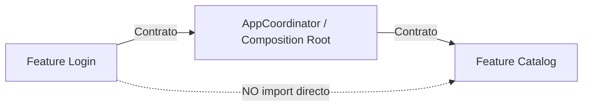
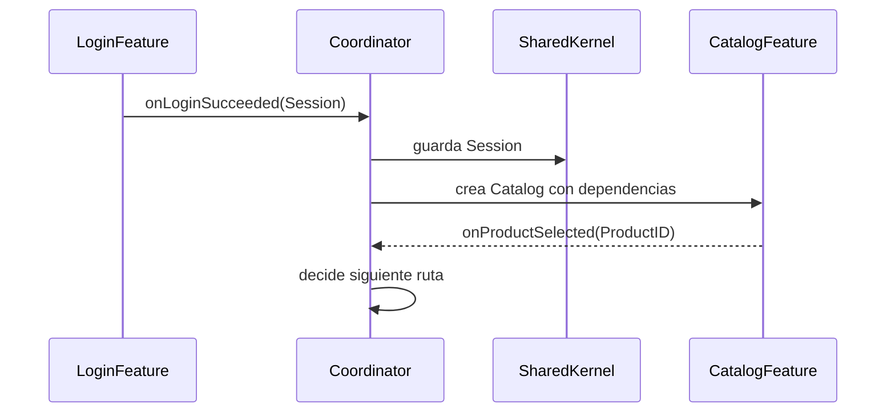

# Contratos entre features

## Objetivo de aprendizaje

Al terminar esta lección vas a poder diseñar contratos entre features que permitan integración real sin acoplamiento accidental. Eso incluye:

- definir qué cruza fronteras y qué no;
- separar tipos compartidos de tipos internos;
- usar eventos/intenciones en lugar de imports directos;
- validar contratos con pruebas y checklist arquitectónico.

En versión simple: dos equipos pueden hablarse sin entrar en la casa del otro, siempre que acuerden idioma y formato de mensaje.

---

## Definición simple

Contrato entre features = acuerdo explícito sobre los datos y eventos que pueden intercambiarse, manteniendo independencia de implementación interna.

Si no hay contrato, hay dependencia implícita.
Si hay dependencia implícita, cada cambio rompe a otro sin avisar.

---

## Modelo mental: API de equipo, no de clase

Piensa cada feature como un mini-producto con su API pública.

- lo público: tipos compartidos mínimos + eventos permitidos;
- lo privado: Domain/Application/Infrastructure internos.



La comunicación ocurre por contrato y coordinación, no por acceso lateral al código interno.

---

## Qué puede cruzar la frontera

En este curso, solo deberían cruzar fronteras tres tipos de artefactos:

1. tipos de Shared Kernel verdaderamente compartidos;
2. eventos/intenciones de alto nivel;
3. DTOs/adaptadores de composición en el borde de app (no en core de feature).

### Qué NO debe cruzar

- repositorios internos de otra feature;
- entidades de dominio internas “por conveniencia”;
- view models o estados de UI de otra feature;
- detalles de infraestructura (status code, DTO remotos internos, headers).

---

## Shared Kernel mínimo

`SharedKernel` no es “cajón común”. Es contrato mínimo.

Ejemplo correcto:

```swift
import Foundation

struct Session: Equatable, Hashable, Sendable {
    let token: String
    let email: String
}
```

Por qué este tipo sí cruza:

- Login lo produce;
- App lo conserva como estado de autenticación;
- otras features pueden necesitarlo para permisos/autenticación de requests.

Ejemplo que NO debería ir a Shared Kernel en esta etapa:

- `Product` de Catalog (aún semántica específica de ese contexto).

---

## Eventos como contrato de interacción

En lugar de “Login llama a Catalog”, usamos intención/evento.

```swift
import Foundation

enum AppEvent: Sendable, Equatable {
    case loginSucceeded(Session)
    case logoutRequested
    case productSelected(ProductID)
}

struct ProductID: Sendable, Equatable, Hashable {
    let rawValue: String
}
```

Con esto:

- Login emite `loginSucceeded`;
- coordinador decide qué ruta tomar;
- Catalog no necesita conocer Login.

---

## Flujo end-to-end por contrato



Cada flecha usa contrato explícito. Ninguna feature entra a internals de otra.

---

## BDD de contratos entre features

### Escenario 1 (happy)

- Given usuario completa login válido,
- When Login emite `loginSucceeded(Session)`,
- Then Coordinator navega a Catalog sin import directo Login->Catalog.

### Escenario 2 (sad)

- Given contrato `Session` cambia incompatiblemente,
- When no se actualizan consumidores,
- Then build/test de contrato falla temprano.

### Escenario 3 (edge)

- Given llega evento desconocido para la versión actual,
- When Coordinator lo procesa,
- Then ignora o enruta a fallback documentado, sin crash.

---

## Plan TDD para contratos

1. Red: test que Coordinator procesa `loginSucceeded`.
2. Green: mínima lógica de ruta.
3. Red: test que contrato incompatible rompe de forma detectada.
4. Green: adaptar consumidores o versionar contrato.
5. Refactor: centralizar eventos compartidos y reducir duplicación.

---

## Ejemplo mínimo de test de contrato

```swift
import XCTest

@MainActor
final class AppCoordinatorContractTests: XCTestCase {
    func test_handleLoginSucceeded_navigatesToCatalog() {
        let sut = AppCoordinator()

        sut.handle(event: .loginSucceeded(Session(token: "t", email: "e@example.com")))

        XCTAssertEqual(sut.path.count, 1)
    }

    func test_handleProductSelected_keepsFeatureDecoupledFromLogin() {
        let sut = AppCoordinator()

        sut.handle(event: .productSelected(ProductID(rawValue: "p-1")))

        XCTAssertEqual(sut.path.count, 1)
    }
}
```

Este test protege interacción entre features sin acoplarlas.

---

## Ejemplo realista: contrato versionado

Supuesto: necesitas añadir `expiresAt` a `Session`.

Estrategia segura:

1. versión compatible (`expiresAt` opcional);
2. migrar consumidores;
3. endurecer contrato si hace falta.

```swift
import Foundation

struct Session: Equatable, Hashable, Sendable {
    let token: String
    let email: String
    let expiresAt: Date?
}
```

Si en lugar de esto renombras campos directamente, rompes a todos los consumidores a la vez.

---

## Concurrencia (Swift 6.2) en contratos

### Aislamiento

- contratos compartidos deben ser value types inmutables cuando sea posible.

### `Sendable`

- todo tipo/evento que cruce boundaries async debe ser `Sendable`.

### Cancelación

- si una intención ya no aplica (navegación invalidada), Coordinator debe descartar evento tardío.

### Backpressure

- si llegan eventos rápidos consecutivos, definir política:
  - cola ordenada, o
  - “último gana” por tipo de evento.

Sin política, la navegación y estado global se vuelven no deterministas.

---

## Matriz de pruebas de contratos

| Tipo de prueba | Qué valida | Coste | Frecuencia |
| --- | --- | --- | --- |
| Unit contract | tipos y eventos compartidos coherentes | Bajo | Cada cambio |
| Integration coordinator | procesamiento real de eventos entre features | Medio | Por feature |
| Regression contract | compatibilidad de cambios en Shared Kernel | Medio | En cambios de contrato |

---

## Anti-patrones y corrección

### Anti-patrón 1: Shared Kernel gigante

Síntoma:

- todo “por si acaso” acaba compartido.

Corrección:

- mantener solo contratos realmente necesarios.

### Anti-patrón 2: import directo entre features

Síntoma:

- cambio en Login rompe Catalog.

Corrección:

- eventos + coordinator + contratos mínimos.

### Anti-patrón 3: contratos sin owner

Síntoma:

- nadie sabe quién aprueba cambios.

Corrección:

- ownership explícito por contrato/contexto.

### Anti-patrón 4: cambios breaking sin transición

Síntoma:

- PR gigante rompiendo consumidores.

Corrección:

- versionado progresivo y plan de migración.

---

## A/B/C de estrategia de comunicación entre features

### Opción A: imports directos

Ventajas:

- rapidez inicial.

Costes:

- acoplamiento alto inmediato.

### Opción B: contratos mínimos + coordinator/eventos (decisión)

Ventajas:

- escalabilidad y testabilidad altas.

Costes:

- requiere disciplina de diseño.

### Opción C: bus global sin contratos tipados

Ventajas:

- flexibilidad aparente.

Costes:

- trazabilidad y seguridad débiles.

Trigger para endurecer B:

- crecimiento de features/equipos y cambios frecuentes de contrato.

---

## ADR corto de la lección

```markdown
## ADR-004A: Contratos entre features via Shared Kernel minimo y eventos tipados
- Estado: Aprobado
- Contexto: necesidad de integrar Login y Catalog sin dependencias directas
- Decisión: compartir solo tipos mínimos (`Session`, IDs) y comunicar por eventos/coordinator
- Consecuencias: menor acoplamiento y mejor testabilidad; más disciplina en definición de contratos
- Fecha: 2026-02-07
```

---

## Checklist de calidad

- [ ] No existen imports directos entre features.
- [ ] Shared Kernel contiene solo contratos mínimos.
- [ ] Eventos/intenciones entre features están tipados y testeados.
- [ ] Cambios de contrato tienen plan de compatibilidad.
- [ ] Tipos compartidos son `Sendable` cuando cruzan concurrencia.

---

## Cierre

La diferencia entre integración frágil e integración profesional está en los contratos. Cuando defines bien qué cruza fronteras, las features pueden evolucionar en paralelo sin pisarse. Ese es el primer paso real hacia arquitectura enterprise escalable.

**Anterior:** [Navegación por eventos ←](02-navegacion-eventos.md) · **Siguiente:** [Infraestructura real: Network →](04-infra-real-network.md)

---

## Ejercicio guiado (para fijar skill)

Para interiorizar esta lección, ejecuta este mini-laboratorio:

1. añade evento nuevo `case sessionExpired` a `AppEvent`;
2. define comportamiento de coordinator ante ese evento (logout + ruta login);
3. escribe tests antes de implementar;
4. verifica que ninguna feature importa internals de otra;
5. documenta la decisión en ADR corto.

Si puedes completar este flujo sin crear dependencia lateral entre features, ya estás aplicando contratos de forma madura.

---

## Señales de que el alumno ya domina esta skill

- explica qué va en Shared Kernel y qué no con criterios de coste/beneficio;
- propone contratos tipados antes de cablear UI;
- detecta imports cruzados en review sin depender de intuición;
- diseña migraciones de contrato sin big-bang.

Esa combinación de diseño + prevención es exactamente la base de integración enterprise sostenible.

---

## Protocolo de migración de contratos sin ruptura

Cuando un contrato compartido debe cambiar:

1. introducir versión compatible primero;
2. mantener campo viejo durante ventana de migración;
3. actualizar consumidores por lotes pequeños;
4. retirar contrato antiguo con fecha acordada.

Este protocolo reduce regresiones y discusiones de última hora entre equipos.

---

## Checklist de revisión de contrato en PR

- [ ] ¿el contrato nuevo es realmente cross-feature?
- [ ] ¿se minimizó la superficie compartida?
- [ ] ¿hay tests de compatibilidad?
- [ ] ¿quedó clara estrategia de migración si es breaking?

Este checklist simple reduce muchísimo errores de integración tardíos.

---

## Cierre operativo

Cuando un contrato está bien definido, los equipos dejan de negociar detalles internos y pueden concentrarse en entregar valor. Esa reducción de fricción diaria es uno de los mayores multiplicadores de productividad en arquitectura enterprise.

Además, un buen contrato sirve como herramienta de onboarding: un junior puede entender cómo conectar una feature sin leer implementaciones internas de otras. Ese efecto acumulativo reduce dependencia de “personas clave” y fortalece la continuidad del equipo.
