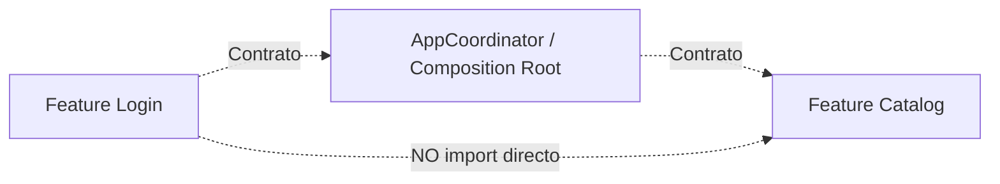
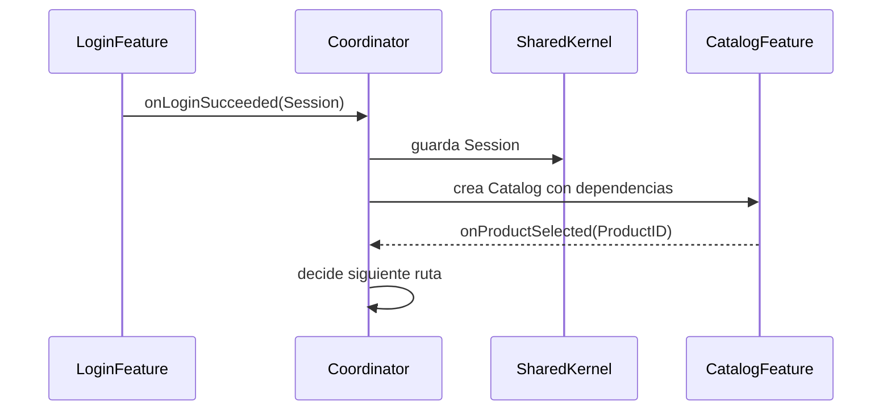

# Contratos entre features

## Objetivo de aprendizaje

Al terminar esta lección vas a poder diseñar contratos entre features que permitan integración real sin acoplamiento accidental. Eso incluye:

- definir qué cruza fronteras y qué no;
- separar tipos compartidos de tipos internos;
- usar eventos/intenciones en lugar de imports directos;
- validar contratos con pruebas y checklist arquitectónico.

En versión simple: dos equipos pueden hablarse sin entrar en la casa del otro, siempre que acuerden idioma y formato de mensaje.

---

## Definición simple

Contrato entre features = acuerdo explícito sobre los datos y eventos que pueden intercambiarse, manteniendo independencia de implementación interna.

```swift
// ❌ Sin contrato: dependencia implícita
// Login accede directamente a internals de Catalog
import CatalogFeature

final class LoginViewModel {
    func onSuccess() {
        // LoginViewModel conoce RemoteProductRepository — un detalle interno de Catalog
        let catalog = CatalogViewModel(repository: RemoteProductRepository())
        navigator.push(catalog)
    }
}
// Problema: renombrar RemoteProductRepository obliga a tocar LoginViewModel.
// No hay nada en el compilador que proteja esta dependencia.

// ✅ Con contrato: Login solo publica una intención tipada
final class LoginViewModel {
    var onEvent: ((AppEvent) -> Void)?

    func onSuccess(session: Session) {
        onEvent?(.loginSucceeded(session))
        // Login no sabe qué pantalla sigue. Solo dice "el login fue exitoso".
        // El coordinator decide el resto.
    }
}
```

Si no hay contrato, hay dependencia implícita. Si hay dependencia implícita, cada cambio rompe a otro sin avisar — y el compilador no lo detecta hasta que ya es tarde.

---

## Modelo mental: API de equipo, no de clase

Piensa cada feature como un mini-producto con su API pública.

- lo público: tipos compartidos mínimos + eventos permitidos;
- lo privado: Domain/Application/Infrastructure internos.


```mermaid
flowchart LR
    LOGIN["Feature Login"] -.->|"Contrato"| APP["AppCoordinator / Composition Root"]
    APP -.->|"Contrato"| CATALOG["Feature Catalog"]

    LOGIN -. "NO import directo" .-> CATALOG
```

Las flechas `-.->` indican wiring de ensamblado: Login y Catalog no se referencian entre sí en código. Solo conocen los contratos que el coordinator gestiona. La línea `LOGIN -. "NO import directo" .-> CATALOG` no es una dependencia — es precisamente la dependencia que **no debe existir**.

En la práctica esto se traduce en: el target `LoginFeature` no tiene ningún `import CatalogFeature` en sus archivos Swift. El compilador lo garantiza si se usan módulos separados. Con un único módulo monolítico hay que mantener la disciplina manualmente y verificarla con tests de arquitectura.

La comunicación ocurre por contrato y coordinación, no por acceso lateral al código interno.

---

## Qué puede cruzar la frontera

En este curso, solo deberían cruzar fronteras tres tipos de artefactos:

1. tipos de Shared Kernel verdaderamente compartidos;
2. eventos/intenciones de alto nivel;
3. DTOs/adaptadores de composición en el borde de app (no en core de feature).

### Qué NO debe cruzar

- repositorios internos de otra feature;
- entidades de dominio internas “por conveniencia”;
- view models o estados de UI de otra feature;
- detalles de infraestructura (status code, DTO remotos internos, headers).

```swift
// ❌ Catalog expone su repositorio interno a Login — cruce de frontera incorrecto
import CatalogFeature

@MainActor
final class LoginViewModel {
    let catalogRepository: CatalogRepository  // Login tiene referencia directa a infra de Catalog
    // → si CatalogRepository cambia su firma, LoginViewModel se rompe
}

// ❌ Catalog expone su ViewModel a otra feature
let catalogVM = CatalogViewModel(...)  // importado y usado directamente desde AppCoordinator
// → AppCoordinator ahora depende de los detalles de UI de Catalog

// ✅ Solo cruza el contrato mínimo: ProductID como intención
func handle(event: AppEvent) {
    switch event {
    case .productSelected(let id):
        path.append(AppDestination.productDetail(id))  // solo el ID tipado cruza la frontera
    }
}
```

---

## Shared Kernel mínimo

`SharedKernel` no es “cajón común”. Es contrato mínimo.

```swift
// ✅ Tipo que sí pertenece al Shared Kernel
import Foundation

struct Session: Equatable, Hashable, Sendable {
    let token: String
    let email: String
}
```

`Session` es un value type (`struct`) sin lógica de negocio propia: solo transporta datos de autenticación. Es `Equatable` para comparar en tests, `Hashable` por si se necesita como clave en diccionarios, y `Sendable` para cruzar boundaries async de forma segura. La immutabilidad (`let`) garantiza que ninguna feature puede modificar la sesión de otra.

Por qué este tipo sí cruza:

- Login lo produce al autenticar;
- App lo conserva como estado de autenticación global;
- otras features pueden necesitarlo para incluir el token en requests autenticadas.

```swift
// ❌ Tipo que NO debería ir a Shared Kernel en esta etapa
struct Product: Equatable, Hashable, Sendable {
    let id: ProductID
    let name: String
    let price: Price
    // campos con semántica propia de Catalog
}
// → ponerlo en SharedKernel obliga a Catalog, Cart y Order a ponerse de acuerdo
// en una definición única de Product, cuando cada uno puede necesitar
// un subconjunto diferente (precio con IVA, nombre localizado, stock...)
```

La regla práctica: un tipo va a Shared Kernel si **dos o más features necesitan exactamente los mismos campos** para operar, y si cambiarlo requiere notificar a todos los consumidores de forma controlada.

---

## Eventos como contrato de interacción

En lugar de “Login llama a Catalog”, usamos intención/evento.

```swift
import Foundation

enum AppEvent: Sendable, Equatable {
    case loginSucceeded(Session)
    case logoutRequested
    case productSelected(ProductID)
}

struct ProductID: Sendable, Equatable, Hashable {
    let rawValue: String
}
```

`AppEvent` es el contrato de interacción entre features y coordinator. Cada `case` representa una intención de alto nivel — no un detalle de implementación. `loginSucceeded` lleva asociada la `Session` porque el coordinator necesita ese dato para propagar el estado de autenticación. `logoutRequested` no lleva payload porque la intención es clara sin datos adicionales. `productSelected` lleva `ProductID` (un value object tipado) en lugar de un `String` raw para que el compilador detecte confusiones de tipo en tiempo de compilación.

`ProductID` usa el patrón “newtype wrapper”: `String` por dentro, pero un tipo distinto para el compilador. Esto evita pasar un `categoryID` donde se espera un `productID` por tener ambos el mismo tipo base.

Con este diseño:

- Login emite `loginSucceeded` sin saber qué pantalla viene después;
- coordinador decide qué ruta tomar según su lógica de navegación;
- Catalog no necesita conocer Login — solo recibe un `ProductID` cuando es relevante.

---

## Flujo end-to-end por contrato


```mermaid
sequenceDiagram
    participant L as LoginFeature
    participant C as Coordinator
    participant K as SharedKernel
    participant G as CatalogFeature

    L->>C: onLoginSucceeded(Session)
    C->>K: guarda Session
    C->>G: crea Catalog con dependencias
    G-->>C: onProductSelected(ProductID)
    C->>C: decide siguiente ruta
```

Lectura paso a paso:

1. `L->>C: onLoginSucceeded(Session)` — Login emite el evento con la sesión. Login no sabe qué ocurre después; solo publica el resultado de la autenticación.
2. `C->>K: guarda Session` — el Coordinator persiste la sesión en el Shared Kernel (estado global de autenticación). A partir de aquí, cualquier feature puede leer el token si lo necesita.
3. `C->>G: crea Catalog con dependencias` — el Coordinator instancia el módulo Catalog inyectándole sus dependencias (repositorio, sesión). Catalog no se crea solo; el Coordinator controla cuándo y cómo.
4. `G-->>C: onProductSelected(ProductID)` — Catalog emite una selección. La flecha `-->>` (punteada) indica que es una respuesta o callback, no una llamada directa de vuelta.
5. `C->>C: decide siguiente ruta` — el Coordinator evalúa el evento y elige la siguiente pantalla. Nadie más tiene acceso a esa lógica de routing.

Cada flecha usa contrato explícito (`Session`, `ProductID`). Ninguna feature entra a internals de otra — no hay `import CatalogFeature` en Login ni `import LoginFeature` en Catalog.

---

## BDD de contratos entre features

### Escenario 1 (happy)

- Given usuario completa login válido,
- When Login emite `loginSucceeded(Session)`,
- Then Coordinator navega a Catalog sin import directo Login→Catalog.

Este es el camino feliz del contrato. El test verifica el desacoplamiento: que navegar a Catalog no requiere que Login conozca nada de Catalog. Si el test pasa, el contrato funciona como se diseñó.

### Escenario 2 (sad)

- Given contrato `Session` cambia incompatiblemente (ej. `token` renombrado a `accessToken`),
- When no se actualizan consumidores,
- Then build/test de contrato falla temprano — en compilación, no en producción.

Este escenario es el más valioso de los tres: demuestra que el contrato tiene dientes. Un contrato sin tests de compatibilidad es solo documentación que puede desactualizarse.

```swift
// El test de regresión de contrato más simple posible:
// si Session cambia, este test no compila
func test_session_contract_shape() {
    let session = Session(token: "t", email: "e@example.com")
    XCTAssertFalse(session.token.isEmpty)
    XCTAssertFalse(session.email.isEmpty)
    // Si alguien renombra 'token' → 'accessToken', esto no compila
    // y el fallo ocurre en CI, no en producción
}
```

### Escenario 3 (edge)

- Given llega evento desconocido para la versión actual del coordinator,
- When Coordinator procesa el evento,
- Then ignora o enruta a fallback documentado, sin crash.

Este escenario cubre el caso de versiones mezcladas: si una feature nueva emite un evento que el coordinator antiguo no conoce, no debe crashear. La solución es un `default: break` en el switch que descarta eventos desconocidos de forma segura:

```swift
func handle(event: AppEvent) {
    switch event {
    case .loginSucceeded(let session):
        self.session = session
        path.append(.catalog)
    case .logoutRequested:
        session = nil
        path = NavigationPath()
    case .productSelected(let id):
        path.append(.productDetail(id))
    // Sin default explícito: el compilador fuerza a cubrir todos los casos conocidos.
    // Añadir un case nuevo a AppEvent genera error de compilación aquí — intencionado.
    }
}
```

El trade-off: sin `default`, añadir un `case` a `AppEvent` produce error de compilación en el coordinator — esto es deseable porque fuerza a decidir la ruta del nuevo evento de forma consciente.

---

## Plan TDD para contratos

**Paso 1 — Red**: escribe el test que verifica que el coordinator procesa `loginSucceeded` y navega a Catalog.

```swift
// Falla: AppCoordinator no existe aún
func test_handleLoginSucceeded_appendsCatalogRoute() {
    let sut = AppCoordinator()
    sut.handle(event: .loginSucceeded(Session(token: "t", email: "e@test.com")))
    XCTAssertEqual(sut.path.count, 1)
}
```

**Paso 2 — Green**: implementación mínima para que el test pase.

```swift
@MainActor
final class AppCoordinator: ObservableObject {
    @Published private(set) var path = NavigationPath()

    func handle(event: AppEvent) {
        switch event {
        case .loginSucceeded:
            path.append(AppDestination.catalog)
        case .logoutRequested:
            path = NavigationPath()
        case .productSelected(let id):
            path.append(AppDestination.productDetail(id))
        }
    }
}
```

**Paso 3 — Red**: test que verifica que un cambio breaking en el contrato se detecta temprano.

```swift
// Este test no compila si alguien renombra 'token' — la rotura es intencional y rápida
func test_session_contract_hasTokenAndEmail() {
    let _ = Session(token: "abc", email: "u@test.com")
}
```

**Paso 4 — Green**: si el contrato `Session` cambia, actualizar consumidores o versionar el campo.

**Paso 5 — Refactor**: centralizar `AppEvent` y `AppDestination` en un módulo compartido si hay más de 2 features. Mientras sean solo Login y Catalog, un único archivo `AppEvent.swift` en el módulo app es suficiente.

---

## Ejemplo mínimo de test de contrato

En esta lección, `AppCoordinator` expone `handle(event:)` como único punto de entrada tipado. Es la evolución natural de los métodos específicos de la Lección 7 (`handleLoginSuccess`, `onProductSelected`) — cuando los eventos crecen, un único `switch` centralizado resulta más escalable y fácil de extender que añadir métodos por cada caso nuevo.

> **Nota de continuidad con Lección 7**: el `AppCoordinator()` de estos tests usa una versión simplificada sin `CompositionRoot` para aislar el contrato. En producción sigue el patrón `init(compositionRoot:)` de la Lección 7. La API `handle(event:)` unifica los handlers específicos anteriores en un único punto de extensión tipado.

```swift
import XCTest

@MainActor
final class AppCoordinatorContractTests: XCTestCase {
    func test_handleLoginSucceeded_navigatesToCatalog() {
        // Dado: coordinator limpio (sin sesión activa)
        let sut = AppCoordinator()

        // Cuando: Login emite loginSucceeded con sesión válida
        sut.handle(event: .loginSucceeded(Session(token: "t", email: "e@example.com")))

        // Entonces: el coordinator añade exactamente una ruta a Catalog
        XCTAssertEqual(sut.path.count, 1)
    }

    func test_handleProductSelected_keepsFeatureDecoupledFromLogin() {
        // Dado: coordinator limpio
        let sut = AppCoordinator()

        // Cuando: Catalog emite productSelected con un ID válido
        sut.handle(event: .productSelected(ProductID(rawValue: "p-1")))

        // Entonces: el coordinator navega al detalle sin necesitar contexto de Login
        XCTAssertEqual(sut.path.count, 1)
    }
}
```

El test no verifica la implementación interna del coordinator: solo valida que el contrato `AppEvent` se procesa correctamente y que ninguna feature accede a internals de otra. Si el contrato cambia incompatiblemente, este test falla antes de que llegue a CI.

---

## Ejemplo realista: contrato versionado

Supuesto: necesitas añadir `expiresAt` a `Session` para que el coordinator pueda detectar sesiones caducadas.

Estrategia segura:

1. versión compatible (`expiresAt` opcional, por defecto `nil`);
2. migrar consumidores para que usen el nuevo campo;
3. endurecer el contrato si todos los consumidores ya lo necesitan.

```swift
import Foundation

// Paso 1: campo nuevo como opcional — todos los consumidores existentes compilan sin cambios
struct Session: Equatable, Hashable, Sendable {
    let token: String
    let email: String
    let expiresAt: Date?  // nil = sin expiración explícita (comportamiento anterior)
}

// El coordinator puede empezar a usar expiresAt de forma segura
func handle(event: AppEvent) {
    switch event {
    case .loginSucceeded(let session):
        if let expiry = session.expiresAt, expiry < Date() {
            handle(event: .logoutRequested)  // sesión ya caducada al recibirla
        } else {
            path.append(AppDestination.catalog)
        }
    // ...
    }
}
```

`expiresAt` es `Date?` en lugar de `Date` porque hay consumidores existentes que crean `Session` sin ese dato. Forzarlo a no-opcional rompería todos los `init` de un golpe. La opcionalidad es el "contrato de transición" que da tiempo a migrar. Si en lugar de esto renombras campos directamente, el compilador reporta errores en todos los consumidores a la vez — sin tiempo para migrar por lotes.

---

## Concurrencia (Swift 6.2) en contratos

### Aislamiento

Los contratos compartidos deben ser value types inmutables. La razón es concurrencia: un `struct` con `let` no puede mutarse desde otro contexto, lo que hace el cruce de actor boundary seguro por diseño.

Con clases (`class`) la situación es diferente. Swift 6 requiere que las clases sean `@Sendable` explícitamente, y una clase con estado mutable no lo puede ser sin `@unchecked`:

```swift
// ❌ Clase con estado mutable — no es Sendable automáticamente en Swift 6
final class SessionState {
    var token: String = ""   // estado mutable en una reference type
    var email: String = ""
}

@MainActor
final class AppCoordinator: ObservableObject {
    func handle(event: AppEvent) {
        let state = SessionState()
        Task.detached {
            // ⚠️ error: capture of 'state' with non-sendable type 'SessionState'
            // in a '@Sendable' closure
            print(state.token)
        }
    }
}

// ✅ Struct inmutable — Sendable automático, seguro para cruzar actor boundaries
struct Session: Equatable, Hashable, Sendable {
    let token: String   // let = inmutable; structs son value types → copia en cruce
    let email: String
}
// Session puede pasarse entre actores sin restricción: cada actor tiene su propia copia
```

Nota importante: los `struct` con `var` también pueden ser `Sendable` en Swift 6 (son value types, cada copia es independiente). La preferencia por `let` es de correctitud semántica — un contrato no debería mutar una vez creado — no solo de concurrencia.

### `Sendable`

Todo tipo/evento que cruce boundaries async debe ser `Sendable`. El compilador lo verifica:

```swift
// ❌ AppEvent no Sendable — error al pasar entre actores
enum AppEvent: Equatable {  // sin Sendable
    case loginSucceeded(Session)
}

@MainActor
func handle(event: AppEvent) async { ... }

// En otro actor:
Task {
    await coordinator.handle(event: .loginSucceeded(session))
    // error: passing argument of non-sendable type 'AppEvent' into main actor-isolated context
}

// ✅ AppEvent Sendable — el compilador acepta el cruce de actor boundary
enum AppEvent: Sendable, Equatable {
    case loginSucceeded(Session)
    case logoutRequested
    case productSelected(ProductID)
}
```

### Cancelación

Si una intención ya no aplica (navegación invalidada, usuario salió de pantalla), el Coordinator debe descartar el evento tardío:

```swift
@MainActor
final class AppCoordinator: ObservableObject {
    private var navigationTask: Task<Void, Never>?

    func handle(event: AppEvent) {
        // Cancelar tarea previa antes de procesar el nuevo evento
        navigationTask?.cancel()
        navigationTask = Task { [weak self] in
            guard let self, !Task.isCancelled else { return }
            // procesar event
        }
    }
}
```

### Backpressure

Si llegan eventos rápidos consecutivos (ej. usuario toca varios productos en ráfaga), definir política explícita:

```swift
// Política “último gana”: debounce descartando eventos intermedios
@MainActor
final class AppCoordinator: ObservableObject {
    private var pendingNavigation: Task<Void, Never>?

    func handle(event: AppEvent) {
        pendingNavigation?.cancel()              // descarta el anterior sin procesar
        pendingNavigation = Task { @MainActor in
            guard !Task.isCancelled else { return }
            processNavigation(for: event)
        }
    }
}
```

Sin política, la navegación puede apilarse en orden no determinista si los eventos llegan más rápido de lo que el coordinator los procesa.

---

## Matriz de pruebas de contratos

| Tipo de prueba | Qué valida | Coste | Frecuencia |
| --- | --- | --- | --- |
| Unit contract | tipos y eventos compartidos coherentes | Bajo | Cada cambio |
| Integration coordinator | procesamiento real de eventos entre features | Medio | Por feature |
| Regression contract | compatibilidad de cambios en Shared Kernel | Medio | En cambios de contrato |

---

## Anti-patrones y corrección

### Anti-patrón 1: Shared Kernel gigante

Síntoma:

- todo “por si acaso” acaba compartido.

Corrección:

- mantener solo contratos realmente necesarios.

```swift
// ❌ SharedKernel como cajón de sastre
// Todo tipo interesante acaba aquí “por conveniencia”
struct User { ... }
struct Product { ... }
struct Cart { ... }
struct Order { ... }
struct Notification { ... }
// → cualquier cambio en SharedKernel rompe todos los módulos

// ✅ SharedKernel mínimo: solo lo que cruza fronteras de verdad
struct Session: Equatable, Hashable, Sendable {
    let token: String
    let email: String
}

struct ProductID: Equatable, Hashable, Sendable {
    let rawValue: String
}
// Product, Cart, Order permanecen en sus respectivos contextos
```

El síntoma más fiable de este anti-patrón es la frecuencia de cambios en SharedKernel: si se modifica más de una vez por sprint, casi siempre hay tipos que no deberían estar ahí. Un Shared Kernel sano cambia raramente — solo cuando el contrato entre varios equipos necesita evolucionar de forma coordinada.

### Anti-patrón 2: import directo entre features

Síntoma:

- cambio en Login rompe Catalog.

Corrección:

- eventos + coordinator + contratos mínimos.

```swift
// ❌ Login importa Catalog directamente
import CatalogFeature

@MainActor
final class LoginViewModel: ObservableObject {
    func loginSuccess(session: Session) {
        // Login conoce la implementación interna de Catalog
        let catalogVM = CatalogViewModel(session: session, repository: RemoteProductRepository())
        router.push(catalogVM)
    }
}
// → renombrar CatalogViewModel rompe LoginViewModel

// ✅ Login emite evento; el coordinator decide qué sigue
@MainActor
final class LoginViewModel: ObservableObject {
    var onEvent: ((AppEvent) -> Void)?

    func loginSuccess(session: Session) {
        onEvent?(.loginSucceeded(session))  // Login no sabe qué viene después
    }
}

// El coordinator conecta sin acoplamiento lateral
func handle(event: AppEvent) {
    switch event {
    case .loginSucceeded(let session):
        state.session = session
        path.append(.catalog)
    default: break
    }
}
```

La clave del ✅ es que `LoginViewModel` no tiene ninguna referencia a tipos de Catalog. Su closure `onEvent` acepta `AppEvent` — un tipo del contrato compartido, no de ninguna feature concreta. Si mañana Catalog se renombra a `ProductBrowser`, `LoginViewModel` no necesita cambiar ni recompilar.

### Anti-patrón 3: contratos sin owner

Síntoma:

- nadie sabe quién aprueba cambios.

Corrección:

- ownership explícito por contrato/contexto.

```swift
// ❌ Session modificado por cualquiera sin coordinación
// PR de Login: añade userId
// PR de Catalog: añade role
// PR de Cart: renombra email → userEmail
// → tres cambios incompatibles en paralelo; nadie lo detecta hasta merge

// ✅ Owner documentado en el tipo + ADR de referencia
/// Owner: Login feature team (ver ADR-004A)
/// Cambios en este tipo requieren revisión de todos los consumidores:
/// Login, Catalog, Cart, Notification
struct Session: Equatable, Hashable, Sendable {
    let token: String
    let email: String
}
```

El ownership no necesita ser complejo: un comentario de doc en el tipo más un ADR es suficiente para que en un code review quede claro quién debe aprobar la modificación. Sin eso, cualquier PR puede cambiar `Session` sin coordinar, y el problema solo se descubre cuando los tests de otro equipo fallan.

### Anti-patrón 4: cambios breaking sin transición

Síntoma:

- PR gigante rompiendo consumidores.

Corrección:

- versionado progresivo y plan de migración.

```swift
// ❌ Renombrado directo — rompe todos los consumidores simultáneamente
struct Session: Equatable, Hashable, Sendable {
    let token: String
    let userEmail: String  // era `email` → rompe Login, Catalog, Cart...
}

// ✅ Paso 1: añadir campo nuevo como opcional
struct Session: Equatable, Hashable, Sendable {
    let token: String
    let email: String        // campo antiguo, aún activo
    let userEmail: String?   // campo nuevo, opcional durante migración
}

// ✅ Paso 2: migrar consumidores por lotes pequeños
// ✅ Paso 3: retirar `email` en la versión acordada
// → en ningún momento hay un PR que rompe todo a la vez
```

La diferencia real con el ❌ no es solo técnica: es organizativa. El PR gigante breaking obliga a coordinar todos los equipos en paralelo. El versionado progresivo permite que cada equipo migre en su propio ritmo, con menos riesgo y sin bloquear releases.

---

## A/B/C de estrategia de comunicación entre features

Las tres opciones surgen en contextos reales: equipo pequeño con prisa (A), arquitectura escalable con disciplina (B), o sistema legado con integración flexible (C). Conocer los costes de cada una permite tomar la decisión correcta en cada momento.

### Opción A: imports directos

Ventajas:

- rapidez inicial — sin indirección, sin capas extra.

Costes:

- acoplamiento alto inmediato; cambios en una feature rompen a otras.

```swift
// Opción A: LoginViewModel conoce CatalogViewModel
import CatalogFeature

@MainActor
final class LoginViewModel: ObservableObject {
    var catalogViewModel: CatalogViewModel?

    func loginSuccess(session: Session) {
        // Login construye Catalog directamente — acoplamiento duro
        catalogViewModel = CatalogViewModel(
            session: session,
            repository: RemoteProductRepository()
        )
    }
}
// Coste visible: renombrar CatalogViewModel requiere editar LoginViewModel
// Coste oculto: no se puede testear Login sin instanciar Catalog
```

Trigger para abandonar A: cuando un cambio en Catalog rompe tests de Login, o cuando se necesita reutilizar Login en otra app sin Catalog.

### Opción B: contratos mínimos + coordinator/eventos (decisión)

Ventajas:

- escalabilidad y testabilidad altas; cada feature evoluciona independientemente.

Costes:

- requiere disciplina de diseño; más indirección que A.

```swift
// Opción B: Login emite evento tipado; el coordinator decide

// En LoginViewModel — sin import de Catalog
@MainActor
final class LoginViewModel: ObservableObject {
    var onEvent: ((AppEvent) -> Void)?

    func loginSuccess(session: Session) {
        onEvent?(.loginSucceeded(session))
    }
}

// En AppCoordinator — único lugar que conoce la ruta
@MainActor
final class AppCoordinator: ObservableObject {
    @Published private(set) var path = NavigationPath()
    private var session: Session?

    func handle(event: AppEvent) {
        switch event {
        case .loginSucceeded(let session):
            self.session = session
            path.append(AppDestination.catalog)
        case .logoutRequested:
            session = nil
            path = NavigationPath()
        case .productSelected(let id):
            path.append(AppDestination.productDetail(id))
        }
    }
}
// Login y Catalog no se conocen entre sí; el coordinator es el único que sabe de ambos
```

Trigger para endurecer B: más de 2 features necesitan coordinarse, o cuando los tests de integración deben verificar flujos completos.

### Opción C: bus global sin contratos tipados

Ventajas:

- flexibilidad aparente — cualquier módulo puede publicar o suscribirse.

Costes:

- trazabilidad y seguridad débiles; los errores aparecen en runtime, no en compilación.

```swift
// Opción C: NotificationCenter sin tipos
// Publicación desde Login
NotificationCenter.default.post(
    name: .loginSucceeded,
    object: nil,
    userInfo: ["token": session.token, "email": session.email]
)

// Suscripción en Catalog — sin garantías de tipos
NotificationCenter.default.addObserver(
    forName: .loginSucceeded,
    object: nil,
    queue: .main
) { notification in
    guard
        let token = notification.userInfo?["token"] as? String,
        let email = notification.userInfo?["email"] as? String
    else { return }  // fallo silencioso en runtime si los keys cambian
    // ...
}
// Si Login cambia "token" → "accessToken", Catalog falla silenciosamente en producción
```

Trigger para abandonar C: cuando los crashes de casting se vuelven habituales, o cuando se necesita trazar qué módulo publicó qué evento y cuándo.

---

## ADR corto de la lección

```markdown
## ADR-004A: Contratos entre features via Shared Kernel minimo y eventos tipados
- Estado: Aprobado
- Contexto: necesidad de integrar Login y Catalog sin dependencias directas
- Decisión: compartir solo tipos mínimos (`Session`, IDs) y comunicar por eventos/coordinator
- Consecuencias: menor acoplamiento y mejor testabilidad; más disciplina en definición de contratos
- Fecha: 2026-02-07
```

---

## Checklist de calidad

- [ ] No existen imports directos entre features.
- [ ] Shared Kernel contiene solo contratos mínimos.
- [ ] Eventos/intenciones entre features están tipados y testeados.
- [ ] Cambios de contrato tienen plan de compatibilidad.
- [ ] Tipos compartidos son `Sendable` cuando cruzan concurrencia.

---

## Ejercicio guiado (para fijar skill)

Para interiorizar esta lección, ejecuta este mini-laboratorio:

1. añade evento nuevo `case sessionExpired` a `AppEvent`;
2. define comportamiento de coordinator ante ese evento (logout + ruta login);
3. escribe tests antes de implementar;
4. verifica que ninguna feature importa internals de otra;
5. documenta la decisión en ADR corto.

Si puedes completar este flujo sin crear dependencia lateral entre features, ya estás aplicando contratos de forma madura.

<details>
<summary>Solución de referencia</summary>

```swift
enum AppEvent: Sendable, Equatable {
    case loginSucceeded(Session)
    case sessionExpired
    case productSelected(ProductID)
}

@MainActor
final class AppCoordinator {
    private(set) var route: AppRoute = .login

    func handle(_ event: AppEvent) {
        switch event {
        case .loginSucceeded:
            route = .catalog
        case .sessionExpired:
            route = .login
        case let .productSelected(id):
            route = .productDetail(id)
        }
    }
}

@MainActor
func test_sessionExpired_routes_back_to_login() {
    let sut = AppCoordinator()
    sut.handle(.loginSucceeded(Session(token: "t", email: "u-1@example.com")))

    sut.handle(.sessionExpired)

    XCTAssertEqual(sut.route, .login)
}
```

La pieza importante no es el `switch`, sino el limite. La feature emisora publica un `AppEvent` tipado y el coordinator decide la ruta. No aparece ningun `import` cruzado entre `Login` y `Catalog`, y el contrato compartido sigue reducido a eventos y tipos minimos.
</details>

---

## Señales de que el alumno ya domina esta skill

- explica qué va en Shared Kernel y qué no con criterios de coste/beneficio;
- propone contratos tipados antes de cablear UI;
- detecta imports cruzados en review sin depender de intuición;
- diseña migraciones de contrato sin big-bang.

Esa combinación de diseño + prevención es exactamente la base de integración enterprise sostenible.

---

## Protocolo de migración de contratos sin ruptura

Cuando un contrato compartido debe cambiar:

1. introducir versión compatible primero;
2. mantener campo viejo durante ventana de migración;
3. actualizar consumidores por lotes pequeños;
4. retirar contrato antiguo con fecha acordada.

Este protocolo reduce regresiones y discusiones de última hora entre equipos.

---

## Checklist de revisión de contrato en PR

- [ ] ¿el contrato nuevo es realmente cross-feature?
- [ ] ¿se minimizó la superficie compartida?
- [ ] ¿hay tests de compatibilidad?
- [ ] ¿quedó clara estrategia de migración si es breaking?

Este checklist simple reduce muchísimo errores de integración tardíos.

---

## Cierre

La diferencia entre integración frágil e integración profesional está en los contratos. Cuando defines bien qué cruza fronteras, las features pueden evolucionar en paralelo sin pisarse. Ese es el primer paso real hacia arquitectura enterprise escalable.

Cuando un contrato está bien definido, los equipos dejan de negociar detalles internos y pueden concentrarse en entregar valor. Esa reducción de fricción diaria es uno de los mayores multiplicadores de productividad en arquitectura enterprise.

Además, un buen contrato sirve como herramienta de onboarding: un junior puede entender cómo conectar una feature sin leer implementaciones internas de otras. Ese efecto acumulativo reduce dependencia de “personas clave” y fortalece la continuidad del equipo.

---

## Qué sigue

La siguiente lección conecta los contratos con la red real: [Lección 9: Infraestructura real — URLSession y HTTPClient](04-infra-real-network.md), donde se implementa el `URLSessionHTTPClient` mencionado en lecciones anteriores y se integra en el `CompositionRoot`.
