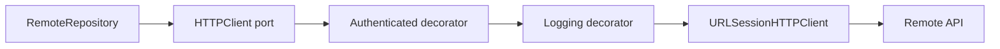
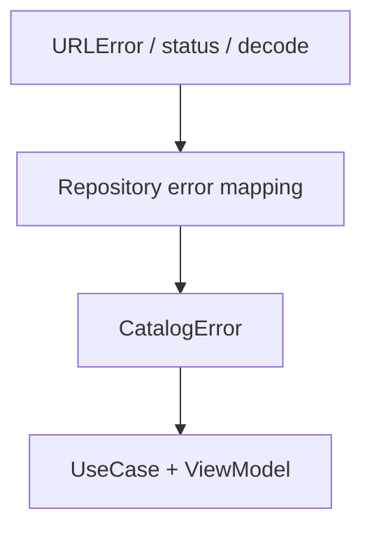

# Infraestructura real: URLSessionHTTPClient

## Objetivo de aprendizaje

Al terminar esta lección vas a poder conectar la arquitectura del curso con red real manteniendo intactos los límites de Clean Architecture: infraestructura concreta fuera del core, errores traducidos de forma semántica y pruebas estables.

En lenguaje simple: vamos a conectar el sistema a internet sin que Domain/Application se llenen de cables.

---

## Definición simple

Infraestructura real de network = implementación concreta del puerto `HTTPClient` usando `URLSession`, envuelta por decoradores para preocupaciones transversales (auth, logging, retry cuando toque).

La regla clave:

- UI/Application/Domain no dependen de `URLSession` directamente.

---

## Modelo mental: enchufe universal y adaptadores

- el puerto `HTTPClient` es el enchufe universal;
- `URLSessionHTTPClient` es un adaptador concreto;
- decoradores añaden capacidades sin cambiar el enchufe.



Esto permite escalar capacidades sin reescribir repositorios.

---

## Contrato HTTP de la arquitectura

```swift
import Foundation

protocol HTTPClient: Sendable {
    func execute(_ request: URLRequest) async throws -> (Data, HTTPURLResponse)
}
```

Por qué este contrato es bueno:

- mínimo;
- neutral al proveedor;
- fácil de stubear;
- fácil de decorar.

---

## Implementación base con URLSession

```swift
import Foundation

struct URLSessionHTTPClient: HTTPClient, Sendable {
    private let session: URLSession

    init(session: URLSession = .shared) {
        self.session = session
    }

    func execute(_ request: URLRequest) async throws -> (Data, HTTPURLResponse) {
        let (data, response) = try await session.data(for: request)

        guard let httpResponse = response as? HTTPURLResponse else {
            throw URLError(.badServerResponse)
        }

        return (data, httpResponse)
    }
}
```

Decisiones:

- `session` inyectable para test/configuración;
- cast explícito a `HTTPURLResponse`;
- tipo inmutable y `Sendable`.

---

## Decorador de autenticación

```swift
import Foundation

struct AuthenticatedHTTPClient: HTTPClient, Sendable {
    private let wrapped: any HTTPClient
    private let tokenProvider: @Sendable () -> String?

    init(
        wrapped: any HTTPClient,
        tokenProvider: @escaping @Sendable () -> String?
    ) {
        self.wrapped = wrapped
        self.tokenProvider = tokenProvider
    }

    func execute(_ request: URLRequest) async throws -> (Data, HTTPURLResponse) {
        var authenticatedRequest = request

        if let token = tokenProvider() {
            authenticatedRequest.setValue("Bearer \(token)", forHTTPHeaderField: "Authorization")
        }

        return try await wrapped.execute(authenticatedRequest)
    }
}
```

Ventaja:

- repositorios no conocen headers de auth;
- Composition Root decide cuándo aplicar auth.

---

## Traducción de errores en repositorio

Network client devuelve errores técnicos. Repositorio traduce a semántica de negocio.



Ejemplo de criterio de etapa:

- transporte/status no válido -> `.connectivity`;
- payload/mapping inválido -> `.invalidData`.

No exponer `URLError` en UI como contrato principal.

---

## Wiring correcto en Composition Root

```swift
import Foundation

struct CatalogComposer {
    let baseURL: URL
    let sessionProvider: () -> Session?

    func makeRepository() -> any ProductRepository {
        let baseClient = URLSessionHTTPClient()
        let authClient = AuthenticatedHTTPClient(
            wrapped: baseClient,
            tokenProvider: { sessionProvider()?.token }
        )
        return RemoteProductRepository(httpClient: authClient, baseURL: baseURL)
    }
}
```

Principio importante del curso:

- composición y DI fuera del core.

---

## BDD -> integración de red

### Escenario happy

- Given backend responde 200 válido,
- When `LoadProductsUseCase` ejecuta,
- Then UI recibe productos listos.

### Escenario sad

- Given falla conectividad,
- When ejecuta use case,
- Then recibe `CatalogError.connectivity`.

### Escenario edge

- Given backend 200 pero payload corrupto,
- When decodifica,
- Then recibe `CatalogError.invalidData`.

Estos escenarios deben estar cubiertos por pruebas de integración controlada.

---

## TDD aplicado a infraestructura real

1. Red: test del contrato `URLSessionHTTPClient` (response no HTTP falla).
2. Green: implementación mínima.
3. Red: test de `AuthenticatedHTTPClient` añade header.
4. Green: decorador de auth.
5. Red: tests de mapping de errores en repositorio.
6. Refactor: separar builders/mappers si crece complejidad.

---

## Pruebas deterministas con URLProtocolStub

### Por qué usarlo

- evita red externa real en CI;
- permite controlar status/data/error;
- valida request (URL, headers, método).

### Ejemplo

```swift
import XCTest

final class URLSessionHTTPClientTests: XCTestCase {
    func test_execute_returnsDataAndResponse_onHTTPResponse() async throws {
        let expectedData = Data("ok".utf8)
        let expectedResponse = HTTPURLResponse(
            url: URL(string: "https://example.com")!,
            statusCode: 200,
            httpVersion: nil,
            headerFields: nil
        )!

        URLProtocolStub.stub(data: expectedData, response: expectedResponse, error: nil)
        let session = makeStubbedSession()
        let sut = URLSessionHTTPClient(session: session)

        let (data, response) = try await sut.execute(URLRequest(url: URL(string: "https://example.com")!))

        XCTAssertEqual(data, expectedData)
        XCTAssertEqual(response.statusCode, 200)
    }

    func test_execute_throws_onNonHTTPResponse() async {
        let response = URLResponse(
            url: URL(string: "https://example.com")!,
            mimeType: nil,
            expectedContentLength: 0,
            textEncodingName: nil
        )
        URLProtocolStub.stub(data: Data(), response: response, error: nil)
        let session = makeStubbedSession()
        let sut = URLSessionHTTPClient(session: session)

        await XCTAssertThrowsErrorAsync(try await sut.execute(URLRequest(url: URL(string: "https://example.com")!)))
    }
}
```

---

## Concurrencia (Swift 6.2)

### Aislamiento

- `URLSessionHTTPClient` puede ser no-actor porque no tiene estado mutable propio.
- `ViewModel` sigue en `@MainActor` para estado UI.

### `Sendable`

- puerto y adaptadores `Sendable`;
- closures de providers marcadas `@Sendable`.

### Cancelación

- `Task` cancelada desde owner (ViewModel/Coordinator);
- `URLSession` coopera con cancelación en `data(for:)`.

### Backpressure

Aunque aquí es request/response, la capa superior debe evitar tormenta de requests:

- cancelar solicitud previa si el flujo lo requiere;
- debouncing en eventos de UI intensos.

---

## Anti-ejemplos y depuración

### Anti-ejemplo 1: `URLSession` llamada directamente desde ViewModel

Impacto:

- rompe separación de capas;
- tests frágiles.

Corrección:

- usar use case + repo + HTTPClient.

### Anti-ejemplo 2: mapping de status codes en UI

Impacto:

- lógica de negocio dispersa.

Corrección:

- mapear en infraestructura/application.

### Anti-ejemplo 3: red real en toda la suite

Impacto:

- flaky tests y CI lenta.

Corrección:

- stub controlado por defecto; smoke real selectivo.

### Guía de depuración

1. verificar request final (URL + headers);
2. verificar status recibido;
3. verificar mapping error técnico -> semántico;
4. verificar cancelación en flujo de pantalla.

---

## Matriz de pruebas de la lección

| Tipo de prueba | Qué valida | Coste | Frecuencia |
| --- | --- | --- | --- |
| Unit HTTP client | contrato execute y response HTTP | Bajo | Cada cambio |
| Unit auth decorator | header Authorization correcto | Bajo | Cada cambio |
| Unit repository mapping | traducción de errores/status/payload | Bajo | Cada cambio |
| Integration usecase+repo | colaboración real de capas | Medio | Por PR |
| Smoke real opcional | compatibilidad con entorno remoto | Alto | Selectivo |

---

## A/B/C de estrategia de network

### Opción A: solo stubs

Ventajas:

- velocidad inicial alta.

Costes:

- baja confianza de integración real.

### Opción B: cliente real mínimo + tests controlados (decisión)

Ventajas:

- equilibrio realismo/estabilidad.

Costes:

- setup de pruebas más elaborado.

### Opción C: SDK externo desde inicio

Ventajas:

- features avanzadas rápidas.

Costes:

- dependencia temprana y acoplamiento.

Trigger para revisar B:

- requisitos no cubiertos (retry avanzado, circuit breaker, observabilidad distribuida).

---

## ADR corto de la lección

```markdown
## ADR-005A: Infraestructura de red real via HTTPClient + URLSession + decoradores
- Estado: Aprobado
- Contexto: necesidad de integrar red real sin contaminar capas core
- Decisión: implementar `URLSessionHTTPClient` detrás de puerto y componer auth por decorador
- Consecuencias: integración más realista y mantenible; requiere disciplina de testing de infraestructura
- Fecha: 2026-02-07
```

---

## Checklist de calidad

- [ ] `URLSession` está encapsulada detrás de `HTTPClient`.
- [ ] Decoradores transversales (auth/logging) no contaminan repositorios.
- [ ] Errores técnicos se traducen a errores semánticos.
- [ ] Tests de transporte y mapping son deterministas.
- [ ] Cancelación y ownership de tareas están definidos.

---

## Cierre

Con esta pieza, el curso pasa de “arquitectura bien dibujada” a “arquitectura conectada al mundo real”. La clave no es usar `URLSession`; la clave es usarla sin romper los límites que hacen que el sistema siga siendo evolutivo.

**Siguiente:** [Integration tests →](05-integration-tests.md)

---

## Ejercicio guiado para consolidar la skill

Propón y aplica una mejora incremental:

1. añadir decorador `RetryHTTPClient` con política simple de 1 reintento para fallos transitorios;
2. escribir tests del decorador antes de implementarlo;
3. conectarlo en Composition Root sin tocar UseCase ni Domain;
4. verificar que la suite de integración sigue estable.

Si puedes hacerlo sin contaminar capas y sin romper contratos, ya dominas la mecánica de infraestructura evolutiva.

---

## Señales de madurez técnica en esta lección

- introduces capacidades transversales por composición, no por herencia forzada;
- traduces errores técnicos a semántica de negocio de forma consistente;
- puedes explicar dónde termina responsabilidad de transporte y dónde empieza la de negocio;
- mantienes tests deterministas pese a añadir red real.

Estas señales marcan el salto de “código que funciona” a “infraestructura que escala con cambios”.

---

## Requisitos no funcionales mínimos de red

Además de “funcionar”, define criterios operativos:

- timeout razonable por petición;
- manejo consistente de errores transitorios;
- observabilidad de latencia y fallo;
- compatibilidad con cancelación de UI.

Sin estos criterios, la infraestructura se vuelve impredecible bajo carga real.

---

## Señal de éxito de infraestructura

Una buena infraestructura no se mide por “cuánto framework usa”, sino por cuántas veces puedes cambiar implementación externa sin tocar Domain/Application.

---

## Nota final de práctica

Si un cambio de proveedor HTTP obliga a tocar UseCases o Domain, no cambiaste infraestructura: rompiste la arquitectura. Ese test mental te protege en cada refactor.
