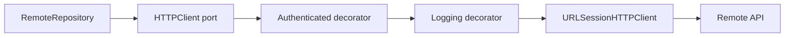
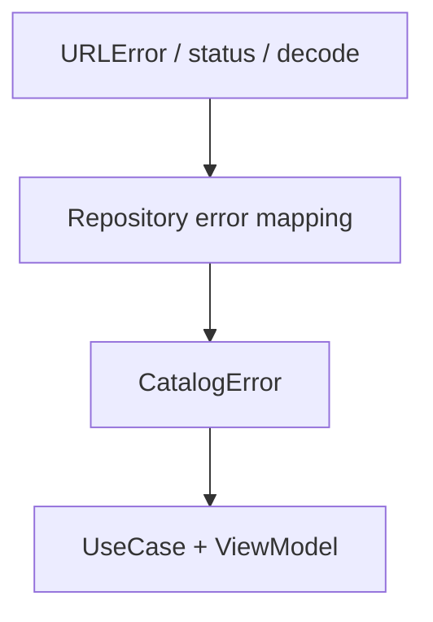

# Infraestructura real: URLSessionHTTPClient

## Objetivo de aprendizaje

Al terminar esta lección vas a poder conectar la arquitectura del curso con red real manteniendo intactos los límites de Clean Architecture: infraestructura concreta fuera del core, errores traducidos de forma semántica y pruebas estables.

En lenguaje simple: vamos a conectar el sistema a internet sin que Domain/Application se llenen de cables.

---

## Definición simple

Infraestructura real de network = implementación concreta del puerto `HTTPClient` usando `URLSession`, envuelta por decoradores para preocupaciones transversales (auth, logging, retry cuando toque).

La regla clave:

- UI/Application/Domain no dependen de `URLSession` directamente.

---

## Modelo mental: enchufe universal y adaptadores

- el puerto `HTTPClient` es el enchufe universal;
- `URLSessionHTTPClient` es un adaptador concreto;
- decoradores añaden capacidades sin cambiar el enchufe.


```mermaid
flowchart LR
    REPO["RemoteRepository"] --> PORT["HTTPClient port"]
    PORT --> AUTH["Authenticated decorator"]
    AUTH --> LOG["Logging decorator"]
    LOG --> BASE["URLSessionHTTPClient"]
    BASE --> API["Remote API"]
```

Esto permite escalar capacidades sin reescribir repositorios.

---

## Contrato HTTP de la arquitectura

```swift
import Foundation

protocol HTTPClient: Sendable {
    func execute(_ request: URLRequest) async throws -> (Data, HTTPURLResponse)
}
```

Por qué este contrato es bueno:

- mínimo;
- neutral al proveedor;
- fácil de stubear;
- fácil de decorar.

---

## Implementación base con URLSession

```swift
import Foundation

struct URLSessionHTTPClient: HTTPClient, Sendable {
    private let session: URLSession

    init(session: URLSession = .shared) {
        self.session = session
    }

    func execute(_ request: URLRequest) async throws -> (Data, HTTPURLResponse) {
        let (data, response) = try await session.data(for: request)

        guard let httpResponse = response as? HTTPURLResponse else {
            throw URLError(.badServerResponse)
        }

        return (data, httpResponse)
    }
}
```

`session.data(for:)` puede lanzar `URLError` si hay fallo de transporte (sin conexión, timeout). Si la respuesta llega pero no es HTTP (caso raro con `URLSession` pero posible con stubs mal configurados), el `guard` lo detecta y lanza `.badServerResponse`. El repositorio que llama a este cliente es el que traduce esos errores técnicos a `CatalogError` de negocio — `URLSessionHTTPClient` no sabe nada de features, solo de transporte.

Razones del diseño:

- `session` inyectable: permite sustituir por una `URLSession` configurada con `URLProtocolStub` en tests sin modificar la implementación;
- cast explícito a `HTTPURLResponse`: la API de `URLSession` retorna `URLResponse` base; el cast garantiza que el caller recibe información HTTP real (statusCode, headers);
- `struct` + `Sendable`: sin estado mutable, seguro para pasar entre actores en Swift 6.

---

## Decorador de autenticación

```swift
import Foundation

struct AuthenticatedHTTPClient: HTTPClient, Sendable {
    private let wrapped: any HTTPClient
    private let tokenProvider: @Sendable () -> String?

    init(
        wrapped: any HTTPClient,
        tokenProvider: @escaping @Sendable () -> String?
    ) {
        self.wrapped = wrapped
        self.tokenProvider = tokenProvider
    }

    func execute(_ request: URLRequest) async throws -> (Data, HTTPURLResponse) {
        var authenticatedRequest = request

        if let token = tokenProvider() {
            authenticatedRequest.setValue("Bearer \(token)", forHTTPHeaderField: "Authorization")
        }

        return try await wrapped.execute(authenticatedRequest)
    }
}
```

`tokenProvider` es una closure `@Sendable` inyectada desde el Composition Root, que consulta la sesión activa en el momento de cada request (no en el momento de construir el decorador). Así el token siempre es el más reciente sin que el decorador tenga referencia directa al estado de la app.

El patrón es "decorador de petición": `execute` intercepta la request, la modifica añadiendo el header, y la reenvía al `wrapped` client. El repositorio que usa este cliente no sabe que existe autenticación — solo ejecuta requests.

Ventajas del diseño:

- repositorios no conocen headers de auth ni el ciclo de vida del token;
- Composition Root decide cuándo aplicar auth (y cuándo no — en un endpoint público se pasa el cliente base directamente);
- el decorador es testeable de forma aislada verificando el header añadido.

---

## Traducción de errores en repositorio

Network client devuelve errores técnicos. Repositorio traduce a semántica de negocio.


```mermaid
flowchart TD
    TECH["URLError / status / decode"] --> MAP["Repository error mapping"]
    MAP --> SEM["CatalogError"]
    SEM --> APP["UseCase + ViewModel"]
```

Criterio de mapeo de esta etapa:

- error de transporte (sin respuesta de red, timeout, conexión rechazada) → `.connectivity`;
- status HTTP inesperado (cualquier código distinto de 200) → `.invalidData`;
- payload corrupto o decode fallido → `.invalidData`.

La distinción es importante: un servidor respondiendo con 404 o 500 **no** es un problema de conectividad — la red funciona, el problema es el contenido. Mezclar ambos casos en `.connectivity` ocultaría errores de contrato de API.

No exponer `URLError` en UI como contrato principal.

---

## Wiring correcto en Composition Root

```swift
import Foundation

struct CatalogComposer {
    let baseURL: URL
    let sessionProvider: () -> Session?

    func makeRepository() -> any ProductRepository {
        let baseClient = URLSessionHTTPClient()
        let authClient = AuthenticatedHTTPClient(
            wrapped: baseClient,
            tokenProvider: { sessionProvider()?.token }
        )
        return RemoteProductRepository(httpClient: authClient, baseURL: baseURL)
    }
}
```

> **Nota de nomenclatura**: `makeRepository()` retorna `any ProductRepository`. En el scaffold del curso, el protocolo equivalente es `CatalogRepository`. El patrón de composición es idéntico en ambos casos.

`CatalogComposer` encadena tres piezas: el transporte base (`URLSessionHTTPClient`), el decorador de auth (`AuthenticatedHTTPClient`) y el repositorio (`RemoteProductRepository`). Ninguna de estas piezas conoce a las demás directamente — solo conocen el puerto `HTTPClient`. Cambiar cualquiera de ellas (por ejemplo, sustituir `URLSessionHTTPClient` por un cliente basado en otro framework) no requiere tocar las otras dos.

Principio importante del curso:

- composición y DI fuera del core; Domain y Application solo conocen puertos (protocolos), nunca implementaciones concretas.

---

## BDD -> integración de red

### Escenario happy

- Given backend responde 200 válido,
- When `LoadProductsUseCase` ejecuta,
- Then UI recibe productos listos.

### Escenario sad

- Given falla conectividad,
- When ejecuta use case,
- Then recibe `CatalogError.connectivity`.

### Escenario edge

- Given backend 200 pero payload corrupto,
- When decodifica,
- Then recibe `CatalogError.invalidData`.

Estos escenarios deben estar cubiertos por pruebas de integración controlada.

---

## TDD aplicado a infraestructura real

1. Red: test del contrato `URLSessionHTTPClient` (response no HTTP falla).
2. Green: implementación mínima.
3. Red: test de `AuthenticatedHTTPClient` añade header.
4. Green: decorador de auth.
5. Red: tests de mapping de errores en repositorio.
6. Refactor: separar builders/mappers si crece complejidad.

---

## Pruebas deterministas con URLProtocolStub

### Por qué usarlo

- evita red externa real en CI;
- permite controlar status/data/error;
- valida request (URL, headers, método).

### Ejemplo

`makeStubbedSession()` construye una `URLSession` configurada con `URLProtocolStub` como clase de protocolo. El stub intercepta todas las peticiones antes de que lleguen a la red real, retornando los datos, la respuesta y el error que hayamos programado con `URLProtocolStub.stub(...)`. Esta técnica prueba el stack completo de `URLSessionHTTPClient` sin necesitar conexión.

```swift
import XCTest

final class URLSessionHTTPClientTests: XCTestCase {

    // Construye una URLSession efímera que usa URLProtocolStub como transporte
    private func makeStubbedSession() -> URLSession {
        let config = URLSessionConfiguration.ephemeral
        config.protocolClasses = [URLProtocolStub.self]
        return URLSession(configuration: config)
    }

    func test_execute_returnsDataAndResponse_onHTTPResponse() async throws {
        // Dado: el stub simula un servidor que responde 200 con datos válidos
        let expectedData = Data("ok".utf8)
        let expectedResponse = HTTPURLResponse(
            url: URL(string: "https://example.com")!,
            statusCode: 200,
            httpVersion: nil,
            headerFields: nil
        )!
        URLProtocolStub.stub(data: expectedData, response: expectedResponse, error: nil)
        let sut = URLSessionHTTPClient(session: makeStubbedSession())

        // Cuando: se ejecuta la petición
        let (data, response) = try await sut.execute(URLRequest(url: URL(string: "https://example.com")!))

        // Entonces: data y statusCode coinciden con lo programado en el stub
        XCTAssertEqual(data, expectedData)
        XCTAssertEqual(response.statusCode, 200)
    }

    func test_execute_throws_onNonHTTPResponse() async {
        // Dado: el stub retorna una URLResponse base (no HTTP) — caso inusual pero posible
        let nonHTTPResponse = URLResponse(
            url: URL(string: "https://example.com")!,
            mimeType: nil,
            expectedContentLength: 0,
            textEncodingName: nil
        )
        URLProtocolStub.stub(data: Data(), response: nonHTTPResponse, error: nil)
        let sut = URLSessionHTTPClient(session: makeStubbedSession())

        // Cuando/Entonces: execute(_:) debe lanzar al fallar el cast a HTTPURLResponse
        do {
            _ = try await sut.execute(URLRequest(url: URL(string: "https://example.com")!))
            XCTFail("Se esperaba que execute(_:) lanzara un error con respuesta no HTTP")
        } catch {
            // comportamiento correcto: URLError.badServerResponse
        }
    }
}
```

El primer test valida el camino feliz: datos + statusCode correctos. El segundo valida el `guard` del cast — si `URLSession` retorna algo que no sea `HTTPURLResponse`, el cliente debe lanzar en lugar de propagar datos inútiles. Ambos tests son deterministas y pasan sin red.

---

## Concurrencia (Swift 6.2)

### Aislamiento

- `URLSessionHTTPClient` puede ser no-actor porque no tiene estado mutable propio.
- `ViewModel` sigue en `@MainActor` para estado UI.

### `Sendable`

- puerto y adaptadores `Sendable`;
- closures de providers marcadas `@Sendable`.

### Cancelación

- `Task` cancelada desde owner (ViewModel/Coordinator);
- `URLSession` coopera con cancelación en `data(for:)`.

### Backpressure

Aunque aquí es request/response, la capa superior debe evitar tormenta de requests:

- cancelar solicitud previa si el flujo lo requiere;
- debouncing en eventos de UI intensos.

---

## Anti-ejemplos y depuración

### Anti-ejemplo 1: `URLSession` llamada directamente desde ViewModel

Impacto:

- rompe separación de capas;
- tests frágiles — no se puede testear el ViewModel sin red real.

Corrección:

- usar use case + repositorio + `HTTPClient` como puerto.

```swift
// ❌ URLSession directamente en ViewModel
@MainActor
final class ProductListViewModel: ObservableObject {
    @Published var products: [Product] = []

    func loadProducts() async {
        // Domain/Application acoplados a URLSession
        guard let url = URL(string: "https://api.example.com/products") else { return }
        let (data, _) = try! await URLSession.shared.data(from: url)
        products = try! JSONDecoder().decode([Product].self, from: data)
    }
}
// → test requiere red real; decode falla en CI sin servidor

// ✅ ViewModel delega en UseCase; transporte queda en infraestructura
@MainActor
final class ProductListViewModel: ObservableObject {
    @Published var products: [Product] = []
    @Published var errorMessage: String?

    private let useCase: LoadProductsUseCase

    init(useCase: LoadProductsUseCase) {
        self.useCase = useCase
    }

    func loadProducts() async {
        do {
            products = try await useCase.execute()
        } catch let error as CatalogError {
            errorMessage = error.localizedDescription
        }
    }
}
// → ViewModel testeable con StubUseCase; red encapsulada en infraestructura
```

### Anti-ejemplo 2: mapping de status codes en UI

Impacto:

- lógica de negocio dispersa en capa de presentación;
- duplicada en cada ViewModel que haga peticiones.

Corrección:

- mapear errores en el repositorio (infraestructura); Application y UI solo ven `CatalogError`.

```swift
// ❌ Mapping de status en el ViewModel
@MainActor
final class ProductListViewModel: ObservableObject {
    func loadProducts() async {
        let (_, response) = try! await URLSession.shared.data(from: url)
        let statusCode = (response as? HTTPURLResponse)?.statusCode ?? 0
        if statusCode == 404 {
            errorMessage = "Productos no encontrados"
        } else if statusCode == 500 {
            errorMessage = "Error del servidor"
        }
        // → lógica repetida en cada ViewModel; si el contrato de API cambia, se actualiza en N sitios
    }
}

// ✅ Mapping único en el repositorio
struct RemoteProductRepository: ProductRepository {
    func loadAll() async throws -> [Product] {
        let (data, response) = try await httpClient.execute(request)
        guard response.statusCode == 200 else {
            throw CatalogError.invalidData  // un único punto de mapping
        }
        return try JSONDecoder().decode([ProductDTO].self, from: data).map(ProductMapper.map)
    }
}
// → ViewModel solo recibe CatalogError; el código HTTP nunca llega a UI
```

### Anti-ejemplo 3: red real en toda la suite

Impacto:

- tests flaky dependientes de conectividad y disponibilidad del servidor;
- CI lenta y no determinista.

Corrección:

- `URLProtocolStub` controlado por defecto; smoke tests con red real solo en pipelines selectivos.

```swift
// ❌ Test con URLSession.shared — requiere servidor real
final class ProductRepositoryTests: XCTestCase {
    func test_loadAll_deliversProducts() async throws {
        let sut = RemoteProductRepository(httpClient: URLSessionHTTPClient())
        let products = try await sut.loadAll()  // falla si el servidor está caído o en staging
        XCTAssertFalse(products.isEmpty)
    }
}

// ✅ Test con URLProtocolStub — determinista, sin red
final class RemoteProductRepositoryTests: XCTestCase {
    func test_loadAll_deliversProductsOn200WithValidJSON() async throws {
        let json = makeProductsJSON([["id": "p-1", "name": "Product 1", "price": 9.99]])
        URLProtocolStub.stub(data: json, response: make200Response(), error: nil)
        let sut = RemoteProductRepository(httpClient: URLSessionHTTPClient(session: makeStubbedSession()), baseURL: anyURL())

        let products = try await sut.loadAll()

        XCTAssertEqual(products.count, 1)
        XCTAssertEqual(products[0].id.rawValue, "p-1")
    }
}
// → siempre pasa en CI independientemente de la red
```

### Guía de depuración

1. verificar request final (URL + headers);
2. verificar status recibido;
3. verificar mapping error técnico -> semántico;
4. verificar cancelación en flujo de pantalla.

---

## Matriz de pruebas de la lección

| Tipo de prueba | Qué valida | Coste | Frecuencia |
| --- | --- | --- | --- |
| Unit HTTP client | contrato execute y response HTTP | Bajo | Cada cambio |
| Unit auth decorator | header Authorization correcto | Bajo | Cada cambio |
| Unit repository mapping | traducción de errores/status/payload | Bajo | Cada cambio |
| Integration usecase+repo | colaboración real de capas | Medio | Por PR |
| Smoke real opcional | compatibilidad con entorno remoto | Alto | Selectivo |

---

## A/B/C de estrategia de network

Las tres opciones se presentan en proyectos reales en momentos distintos. Comprender sus costes evita decisiones de las que arrepentirse cuando el proyecto crece.

### Opción A: solo stubs en tests

Ventajas:

- velocidad inicial alta; setup mínimo.

Costes:

- baja confianza de integración real — un bug en `URLSession.data(for:)` o en el cast pasa desapercibido.

```swift
// Opción A: stub de interfaz, nunca URLSession real
struct StubHTTPClient: HTTPClient, Sendable {
    let result: Result<(Data, HTTPURLResponse), Error>
    func execute(_ request: URLRequest) async throws -> (Data, HTTPURLResponse) {
        try result.get()
    }
}

// Test rápido pero con cobertura parcial
func test_loadAll_deliversProducts_withStub() async throws {
    let stub = StubHTTPClient(result: .success((validJSON, make200Response())))
    let sut = RemoteProductRepository(httpClient: stub, baseURL: anyURL())
    let products = try await sut.loadAll()
    XCTAssertEqual(products.count, 1)
}
// El test no valida nada del stack real de URLSession
// Si URLSessionHTTPClient tiene un bug, este test no lo detecta
```

Trigger para abandonar A: cuando un bug de transporte llega a producción porque los tests solo cubren stubs de interfaz.

### Opción B: cliente real mínimo + URLProtocolStub (decisión)

Ventajas:

- equilibrio entre realismo y estabilidad; valida el stack completo sin red externa.

Costes:

- setup de `URLProtocolStub` más elaborado que un simple stub de interfaz.

```swift
// Opción B: URLSessionHTTPClient real + URLProtocolStub como transporte
func makeStubbedSession() -> URLSession {
    let config = URLSessionConfiguration.ephemeral
    config.protocolClasses = [URLProtocolStub.self]
    return URLSession(configuration: config)
}

// Test valida URLSessionHTTPClient + RemoteProductRepository + mapping, sin red
func test_loadAll_deliversProductsOn200() async throws {
    URLProtocolStub.stub(data: validJSON, response: make200Response(), error: nil)
    let sut = RemoteProductRepository(
        httpClient: URLSessionHTTPClient(session: makeStubbedSession()),
        baseURL: anyURL()
    )
    let products = try await sut.loadAll()
    XCTAssertEqual(products.count, 1)
}
// Cubre: URLSession.data(for:), cast HTTPURLResponse, decode, mapping → todo en un test determinista
```

Trigger para revisar B: cuando aparecen requisitos no cubiertos (retry avanzado, circuit breaker, observabilidad distribuida con tracing headers).

### Opción C: SDK externo desde inicio (Alamofire, Moya)

Ventajas:

- retry, auth, logging y otras features disponibles de inmediato.

Costes:

- dependencia temprana en Domain/Application; migración costosa si el SDK cambia de API.

```swift
// Opción C: Alamofire directamente en el repositorio
import Alamofire

struct AlamofireProductRepository: ProductRepository {
    func loadAll() async throws -> [Product] {
        let response = await AF
            .request("https://api.example.com/products")
            .serializingDecodable([ProductDTO].self)
            .response

        switch response.result {
        case .success(let dtos):
            return dtos.map(ProductMapper.map)
        case .failure(let afError):
            throw afError.isSessionTaskError ? CatalogError.connectivity : CatalogError.invalidData
        }
    }
}
// Alamofire gestiona retry, auth headers, etc. — pero ahora el repositorio
// tiene una dependencia directa de Alamofire en su cuerpo
// → si Alamofire depreca una API, hay que editar todos los repositorios
// → los tests de repositorio ahora dependen del comportamiento de Alamofire
```

Trigger para considerar C: cuando los requisitos de retry, observabilidad o auth compleja superan lo que es razonable implementar con decoradores simples.

---

## ADR corto de la lección

```markdown
## ADR-005A: Infraestructura de red real via HTTPClient + URLSession + decoradores
- Estado: Aprobado
- Contexto: necesidad de integrar red real sin contaminar capas core
- Decisión: implementar `URLSessionHTTPClient` detrás de puerto y componer auth por decorador
- Consecuencias: integración más realista y mantenible; requiere disciplina de testing de infraestructura
- Fecha: 2026-02-07
```

---

## Checklist de calidad

- [ ] `URLSession` está encapsulada detrás de `HTTPClient`.
- [ ] Decoradores transversales (auth/logging) no contaminan repositorios.
- [ ] Errores técnicos se traducen a errores semánticos.
- [ ] Tests de transporte y mapping son deterministas.
- [ ] Cancelación y ownership de tareas están definidos.

---

## Cierre

Con esta pieza, el curso pasa de “arquitectura bien dibujada” a “arquitectura conectada al mundo real”. La clave no es usar `URLSession`; la clave es usarla sin romper los límites que hacen que el sistema siga siendo evolutivo.

---

## Ejercicio guiado para consolidar la skill

Propón y aplica una mejora incremental:

1. añadir decorador `RetryHTTPClient` con política simple de 1 reintento para fallos transitorios;
2. escribir tests del decorador antes de implementarlo;
3. conectarlo en Composition Root sin tocar UseCase ni Domain;
4. verificar que la suite de integración sigue estable.

Si puedes hacerlo sin contaminar capas y sin romper contratos, ya dominas la mecánica de infraestructura evolutiva.

<details>
<summary>Solución de referencia</summary>

```swift
// RetryHTTPClient: decorador que reintenta en fallos transitorios
struct RetryHTTPClient: HTTPClient, Sendable {
    let decoratee: any HTTPClient
    let maxRetries: Int

    func execute(_ request: URLRequest) async throws -> (Data, HTTPURLResponse) {
        var attempt = 0

        while true {
            do {
                return try await decoratee.execute(request)
            } catch {
                // isTransientConnectivityError es una extensión de conveniencia en el target de tests:
                // var isTransientConnectivityError: Bool {
                //     (self as? URLError)?.code == .notConnectedToInternet
                // }
                guard attempt < maxRetries, error.isTransientConnectivityError else {
                    throw error
                }
                attempt += 1
            }
        }
    }
}

// Wiring en Composition Root — sin tocar UseCase ni Domain
func makeHTTPClient() -> any HTTPClient {
    let base = URLSessionHTTPClient(session: .shared)
    return RetryHTTPClient(decoratee: base, maxRetries: 1)
}

// Test del decorador usando un spy que simula fallo transitorio → éxito
func test_retry_client_retries_once_on_transient_error() async throws {
    // HTTPClientSpy es un doble de test que retorna respuestas programadas en orden
    // make200Response() = HTTPURLResponse(url:..., statusCode: 200, ...)
    let okResponse = HTTPURLResponse(
        url: URL(string: "https://example.com")!,
        statusCode: 200,
        httpVersion: nil,
        headerFields: nil
    )!
    let transport = HTTPClientSpy(results: [
        .failure(URLError(.notConnectedToInternet)),  // primer intento: fallo transitorio
        .success((Data("{}".utf8), okResponse))       // segundo intento: éxito
    ])
    let sut = RetryHTTPClient(decoratee: transport, maxRetries: 1)

    _ = try await sut.execute(URLRequest(url: URL(string: "https://example.com")!))

    // El spy debe haber recibido exactamente 2 llamadas a execute(_:)
    XCTAssertEqual(transport.executedRequests.count, 2)
}
```

La mejora entra por composición en `CompositionRoot`, no tocando `UseCase`, `Domain` ni el repositorio. Eso demuestra que la infraestructura sigue siendo sustituible y que el comportamiento transversal vive donde corresponde.
</details>

---

## Señales de madurez técnica en esta lección

- introduces capacidades transversales por composición, no por herencia forzada;
- traduces errores técnicos a semántica de negocio de forma consistente;
- puedes explicar dónde termina responsabilidad de transporte y dónde empieza la de negocio;
- mantienes tests deterministas pese a añadir red real.

Estas señales marcan el salto de “código que funciona” a “infraestructura que escala con cambios”.

---

## Requisitos no funcionales mínimos de red

Además de “funcionar”, define criterios operativos:

- timeout razonable por petición;
- manejo consistente de errores transitorios;
- observabilidad de latencia y fallo;
- compatibilidad con cancelación de UI.

Sin estos criterios, la infraestructura se vuelve impredecible bajo carga real.

---

## Señal de éxito de infraestructura

Una buena infraestructura no se mide por “cuánto framework usa”, sino por cuántas veces puedes cambiar implementación externa sin tocar Domain/Application.

---

## Nota final de práctica

Si un cambio de proveedor HTTP obliga a tocar UseCases o Domain, no cambiaste infraestructura: rompiste la arquitectura. Ese test mental te protege en cada refactor.

---

## 🔭 Explora el scaffold — Infraestructura de red real

```bash
open apps/ios/ArchitectureKit/Package.swift
# Navega a: Sources/FeatureLoginData/AuthHTTPRepository.swift  (patrón de ref.)
#           Sources/FeatureCatalogData/DefaultCatalogRemoteDataSource.swift
#           Sources/InfraHTTP/  (cliente HTTP compartido)
```

`AuthHTTPRepository` en `FeatureLoginData` y `DefaultCatalogRemoteDataSource` en `FeatureCatalogData` siguen el mismo patrón de la lección: adaptan el cliente HTTP al protocolo de dominio. La infra compartida vive en `InfraHTTP` — ninguna feature accede a `URLSession` directamente.

```bash
cd apps/ios/ArchitectureKit
swift test --filter FeatureLoginDataTests
```

---


## Qué sigue

La siguiente lección pone a prueba lo construido hasta aquí: [Lección 10: Tests de integración](05-integration-tests.md), donde se verifica la colaboración real entre capas usando el `URLSessionHTTPClient` y el `CompositionRoot` ensamblados en esta lección.
