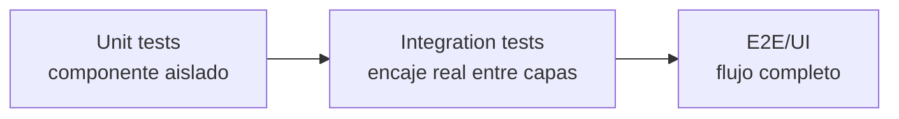
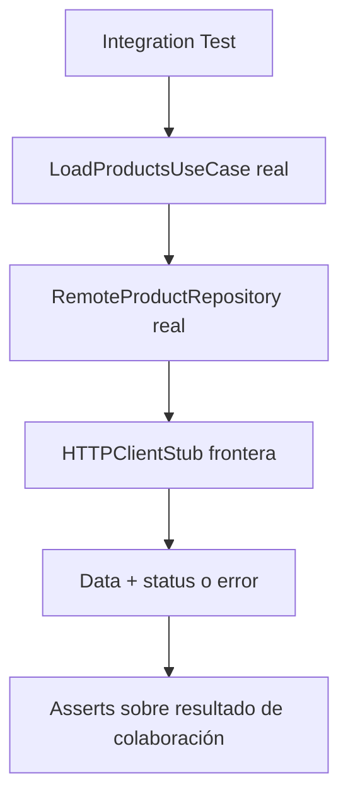

# Integration Tests

## Objetivo de aprendizaje

Al final de esta lección vas a dominar cuándo y cómo escribir tests de integración que realmente aporten valor en arquitectura enterprise: sin convertirlos en E2E lentos, sin duplicar unit tests, y con foco en contratos entre capas.

Si lo explicamos simple: unit test comprueba si una pieza funciona sola; integration test comprueba si dos piezas encajan cuando las juntas en el mundo real.

---

## Definición simple

Un integration test valida colaboración real entre 2 o más componentes adyacentes, usando dobles solo en fronteras externas.

- No es unit test (demasiado aislado).
- No es E2E (demasiado amplio y caro).

Es el punto medio que protege los “fallos silenciosos de ensamblaje”.

---

## Modelo mental: enchufes y voltajes

Piensa cada capa como un aparato eléctrico y su puerto como un enchufe. El unit test verifica que cada aparato enciende por separado. El integration test verifica que al enchufarlos no salta el diferencial.



La estrategia madura no elimina ninguna capa de la pirámide; define para cada una su misión y su coste.

---

## Cuándo SÍ / cuándo NO usar integration tests

### Cuándo SÍ

- cuando hay transformación de datos entre capas;
- cuando hay traducción de errores técnicos a errores semánticos;
- cuando un caso de uso depende de infraestructura real (sin mocks internos);
- cuando ya hubo regresiones por contratos mal interpretados.

### Cuándo NO

- para revalidar pura lógica de dominio ya cubierta por unit tests;
- para probar layout visual;
- cuando solo tienes una función pura y sin colaboraciones;
- para cubrir todo el sistema en cada PR.

---

## BDD -> contratos -> integración

### Escenario BDD 1 (Catalog happy path)

- Given API responde 200 con payload válido.
- When `LoadProductsUseCase` ejecuta.
- Then se obtienen `Product` de dominio listos para UI.

### Escenario BDD 2 (sad path conectividad)

- Given falla transporte HTTP.
- When ejecuta el caso de uso.
- Then devuelve `CatalogError.connectivity`.

### Escenario BDD 3 (edge payload corrupto)

- Given API responde 200 con JSON inválido.
- When ejecuta el caso de uso.
- Then devuelve `CatalogError.invalidData`.

Trazabilidad importante: cada escenario BDD aquí se materializa en al menos un integration test.

---

## Diseño de la prueba de integración en Etapa 2

Combinación recomendada para `Catalog`:

- componente real 1: `LoadProductsUseCase`
- componente real 2: `RemoteProductRepository`
- frontera doble: `HTTPClientStub` (simula red)



Lo que no hacemos:

- mockear `RemoteProductRepository` (si lo haces, dejas de testear integración).

---

## Ejemplo mínimo

```swift
import XCTest

final class LoadProductsIntegrationTests: XCTestCase {
    private let baseURL = URL(string: "https://api.example.com")!

    func test_loadProducts_useCaseAndRepository_deliverProductsOnValidPayload() async throws {
        let json: [[String: Any]] = [[
            "id": "1",
            "name": "Camiseta",
            "price": 29.99,
            "currency": "EUR",
            "image_url": "https://example.com/1.png"
        ]]
        let data = try JSONSerialization.data(withJSONObject: json)
        let http = HTTPClientStub(data: data, statusCode: 200)

        let repository = RemoteProductRepository(httpClient: http, baseURL: baseURL)
        let sut = LoadProductsUseCase(repository: repository)

        let products = try await sut.execute()

        XCTAssertEqual(products.count, 1)
        XCTAssertEqual(products[0].id, "1")
    }
}
```

**Explicación línea por línea de este integration test:**

`test_loadProducts_useCaseAndRepository_deliverProductsOnValidPayload` — El nombre del test dice exactamente qué estamos integrando y qué esperamos: el UseCase **y** el Repository (ambos reales), cuando reciben un payload válido, entregan productos.

**ARRANGE:**

`let json: [[String: Any]] = [["id": "1", "name": "Camiseta", ...]]` — Creamos el JSON que simula lo que devolvería el servidor real. Es un array de diccionarios (porque el servidor devuelve un array de productos). Los campos coinciden exactamente con lo que el `ProductDTO` espera parsear: `id`, `name`, `price`, `currency`, `image_url`.

`let data = try JSONSerialization.data(withJSONObject: json)` — Convertimos el diccionario de Swift a `Data` (bytes). Esto simula los bytes que llegarían por la red.

`let http = HTTPClientStub(data: data, statusCode: 200)` — Creamos el stub de HTTP que devuelve esos bytes con status 200 (éxito). **Este es el único stub del test.** Todo lo demás es real.

`let repository = RemoteProductRepository(httpClient: http, baseURL: baseURL)` — Creamos el Repository **REAL**. No es un stub. Es el mismo código que se ejecutará en producción. Le inyectamos el stub de HTTP para que no haga peticiones reales a internet.

`let sut = LoadProductsUseCase(repository: repository)` — Creamos el UseCase **REAL**. Tampoco es un stub. Le inyectamos el Repository real.

**ACT:**

`let products = try await sut.execute()` — Ejecutamos el flujo completo: el UseCase llama al Repository real, el Repository llama al HTTPClient stub, recibe los bytes JSON, los parsea con `JSONDecoder` a DTOs, los mapea a modelos de Domain (`Product`), y los devuelve al UseCase. Todo esto ocurre con código real, no con stubs.

**ASSERT:**

`XCTAssertEqual(products.count, 1)` — Verificamos que llegó 1 producto.
`XCTAssertEqual(products[0].id, "1")` — Verificamos que el ID se mapeó correctamente del JSON al modelo de Domain.

**¿Qué detectaría este test que un unit test no?** Si el Repository parsea el JSON en un formato que el UseCase no espera (por ejemplo, si el Repository devuelve `Price` como `Double` pero el UseCase espera `Decimal`), el unit test del UseCase pasaría (porque usa un stub que devuelve datos perfectos) pero este integration test fallaría (porque usa el Repository real que parsea datos reales).

---

## Ejemplo realista completo (happy/sad/edge)

```swift
import XCTest

final class CatalogIntegrationTests: XCTestCase {
    private let baseURL = URL(string: "https://api.example.com")!

    func test_loadProducts_deliversConnectivityOnTransportError() async {
        let http = HTTPClientStub(error: URLError(.notConnectedToInternet))
        let sut = makeUseCase(http: http)

        await XCTAssertThrowsErrorAsync(try await sut.execute()) { error in
            XCTAssertEqual(error as? CatalogError, .connectivity)
        }
    }

    func test_loadProducts_deliversInvalidDataOnMalformedJSON() async {
        let http = HTTPClientStub(data: Data("bad-json".utf8), statusCode: 200)
        let sut = makeUseCase(http: http)

        await XCTAssertThrowsErrorAsync(try await sut.execute()) { error in
            XCTAssertEqual(error as? CatalogError, .invalidData)
        }
    }

    func test_loadProducts_deliversConnectivityOnNon200Status() async {
        let data = try! JSONSerialization.data(withJSONObject: [])
        let http = HTTPClientStub(data: data, statusCode: 500)
        let sut = makeUseCase(http: http)

        await XCTAssertThrowsErrorAsync(try await sut.execute()) { error in
            XCTAssertEqual(error as? CatalogError, .connectivity)
        }
    }

    private func makeUseCase(http: any HTTPClient) -> LoadProductsUseCase {
        let repository = RemoteProductRepository(httpClient: http, baseURL: baseURL)
        return LoadProductsUseCase(repository: repository)
    }
}
```

---

## Integration tests para Login (contrato cross-feature)

En Etapa 2 no solo integraremos `Catalog`. También comprobaremos que `Login` mantiene contrato cuando habla con infraestructura real mínima.

Escenarios recomendados:

1. credenciales válidas -> sesión emitida;
2. error de red -> `LoginError.connectivity`;
3. credenciales inválidas detectadas por dominio antes de tocar red.

Esto evita que Login y Catalog evolucionen con criterios distintos de mapeo de errores.

---

## Plan TDD para integración (sí, también aquí)

Aunque TDD se asocia mucho al core, en integración también aplica.

1. Red: escribir test de contrato de colaboración (falla porque falta wiring real).
2. Green: implementar mínimo ensamblaje para cumplir contrato.
3. Refactor: extraer helpers de test, mejorar naming, eliminar duplicación.

Clave: el test primero no diseña detalle interno, diseña frontera observable.

---

## Concurrencia: estabilidad real de suite

### Aislamiento

- construir SUT por test;
- no compartir estado mutable global;
- evitar singletons en infraestructura de pruebas.

### `Sendable`

- dobles usados en async (`HTTPClientStub`) deben ser seguros para acceso concurrente.
- si guardan estado, usar `actor` o sincronización explícita.

### Cancelación

Prueba obligatoria sugerida:

- cuando se cancela la `Task` de carga, el resultado no debe actualizar estado final en UI/Application.

### Backpressure

Si ejecutas 10 cargas simultáneas en test sin control, puedes generar flakiness falsa. Define estrategia:

- cancelar anterior y conservar última, o
- serializar en actor.

---

## Anti-ejemplo: integración disfrazada de unit

```swift
func test_loadProducts_callsRepository() async throws {
    let repo = ProductRepositorySpy()
    let sut = LoadProductsUseCase(repository: repo)
    _ = try await sut.execute()
    XCTAssertTrue(repo.loadCalled)
}
```

Este test es válido como unit de Application, pero no es integración. No detecta fallos de JSON, status, mapping ni traducción de errores.

Cómo arreglarlo:

- reemplazar spy por `RemoteProductRepository` real;
- dejar doble solo en `HTTPClient` frontera;
- asertar comportamiento observable final.

---

## Depuración de tests flaky (guía práctica)

Cuando un integration test falla de forma intermitente:

1. comprobar si depende de tiempo real (`sleep`, relojes de sistema);
2. comprobar estado compartido entre tests;
3. forzar orden determinista en inputs;
4. revisar cancelación no controlada;
5. registrar `traceId` simple por ejecución para reconstruir secuencia.

Si aún falla, reducir el caso hasta reproducir en 10 ejecuciones consecutivas localmente.

---

## Matriz de pruebas de integración (Etapa 2)

| Flujo | Componentes reales | Frontera stub | Riesgo que cubre |
| --- | --- | --- | --- |
| Catalog load | UseCase + RemoteRepository | HTTPClient | mapping/errores entre capas |
| Login submit | UseCase + RemoteGateway | HTTPClient | validación + traducción de fallo |
| Navegación eventos | EventBus + Coordinator | opcional | contrato de ruta cross-feature |

---

## ADR corto de la lección

```markdown
## ADR-004: Integration tests con dobles solo en fronteras externas
- Estado: Aprobado
- Contexto: regresiones entre Application e Infrastructure no detectadas por unit tests
- Decisión: cubrir flujos críticos con colaboración real entre capas adyacentes
- Consecuencias: suite algo más lenta pero mucho más representativa
- Fecha: 2026-02-07
```

---

## Checklist de calidad

- [ ] Cada flujo crítico tiene al menos happy + sad + edge de integración.
- [ ] Los dobles están en fronteras externas, no en componentes internos.
- [ ] Nombres de tests expresan contrato de colaboración.
- [ ] Tests async son deterministas y sin dependencia temporal frágil.
- [ ] Los errores observados son semánticos (`CatalogError`, `LoginError`), no técnicos crudos.

---

## Cierre

Un equipo junior suele confiar demasiado en unit tests y un equipo cansado suele abusar de E2E. Un equipo senior domina el punto medio: integration tests que protegen ensamblaje real con coste controlado. Esa es la habilidad que te prepara para enterprise diario.

**Anterior:** [Infraestructura real ←](04-infra-real-network.md) · **Siguiente:** [Entregables Etapa 2 →](entregables-etapa-2.md)
