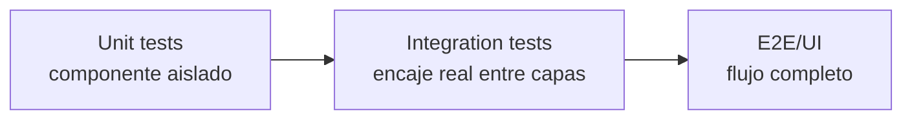
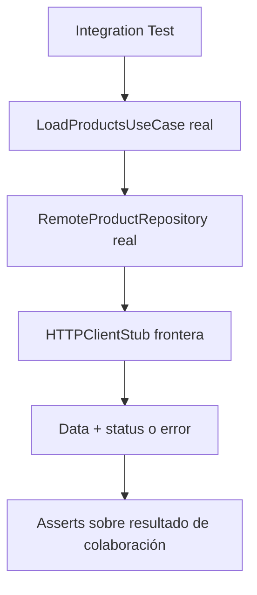

# Integration Tests

## Objetivo de aprendizaje

Al final de esta lección vas a dominar cuándo y cómo escribir tests de integración que realmente aporten valor en arquitectura enterprise: sin convertirlos en E2E lentos, sin duplicar unit tests, y con foco en contratos entre capas.

Si lo explicamos simple: unit test comprueba si una pieza funciona sola; integration test comprueba si dos piezas encajan cuando las juntas en el mundo real.

---

## Definición simple

Un integration test valida colaboración real entre 2 o más componentes adyacentes, usando dobles solo en fronteras externas.

```swift
// Unit test: cada pieza aislada con stubs — rápido, pero no detecta fallos de ensamblaje
func test_unit_loadProducts_callsRepository() async throws {
    let stub = ProductRepositoryStub(result: .success([makeProduct()]))
    let sut = LoadProductsUseCase(repository: stub)
    let products = try await sut.execute()
    XCTAssertEqual(products.count, 1)
    // ⚠️ Este test pasaría aunque RemoteProductRepository tenga un bug de decode.
    // El stub siempre devuelve datos perfectos — no hay JSON de por medio.
}

// Integration test: UseCase + Repository reales, solo el transporte es stub
func test_integration_loadProducts_deliversProductsOnValidPayload() async throws {
    let json = makeProductsJSON([[“id”: “p-1”, “name”: “Camiseta”, “price”: 29.99, “currency”: “EUR”]])
    let http = HTTPClientStub(data: json, statusCode: 200)
    let repository = RemoteProductRepository(httpClient: http, baseURL: anyURL())
    let sut = LoadProductsUseCase(repository: repository)

    let products = try await sut.execute()

    XCTAssertEqual(products.count, 1)
    XCTAssertEqual(products[0].name, “Camiseta”)
    // ✅ Si el mapper produce un tipo incorrecto, o si el decode falla,
    // este test lo detecta — con código real, no con datos prefabricados.
}
```

La diferencia crítica: el unit test usa un `ProductRepositoryStub` que devuelve `[Product]` directamente. El integration test usa `RemoteProductRepository` real que tiene que parsear JSON, mapear DTOs y lanzar errores semánticos. Esa cadena de transformación es exactamente lo que protege el integration test.

- No es unit test (demasiado aislado — no detecta fallos entre capas).
- No es E2E (demasiado amplio y caro — depende de red real, servidor real, UI real).

Es el punto medio que protege los “fallos silenciosos de ensamblaje”: errores que ninguna capa individual introduce, pero que aparecen cuando se conectan.

---

## Modelo mental: enchufes y voltajes

Piensa cada capa como un aparato eléctrico y su puerto como un enchufe. El unit test verifica que cada aparato enciende por separado. El integration test verifica que al enchufarlos no salta el diferencial.


```mermaid
flowchart LR
    U["Unit tests\ncomponente aislado"] --> I["Integration tests\nencaje real entre capas"] --> E["E2E/UI\nflujo completo"]
```

Cada nivel del diagrama tiene un coste y una misión distintos:

- **Unit tests** (`U`): máxima velocidad, mínimo coste. Aíslan una clase o función. Detectan bugs de lógica interna. No detectan fallos de contrato entre capas.
- **Integration tests** (`I`): coste medio. Conectan 2-3 componentes reales. Detectan problemas de ensamblaje: tipos incompatibles, errores mal traducidos, JSON que no coincide con el modelo. Son el "precio" de confiar en que las piezas encajan.
- **E2E / UI tests** (`E`): coste alto, ejecución lenta. Validan flujos de usuario completos. Frágiles ante cambios de UI. Necesarios para smoke de features críticas, no para cada PR.

La estrategia madura no elimina ninguna capa; define para cada una qué protege y qué no, y evita duplicar cobertura entre niveles.

---

## Cuándo SÍ / cuándo NO usar integration tests

### Cuándo SÍ

```swift
// ✅ Hay transformación de datos entre capas: ProductDTO → Product
// El integration test valida que el mapping completo (JSON → DTO → Domain) es correcto
func test_loadProducts_mapsDTO_toDomainProductWithCorrectPrice() async throws {
    let json = makeProductsJSON([["id": "p-1", "name": "Camiseta", "price": 29.99, "currency": "EUR"]])
    let http = HTTPClientStub(data: json, statusCode: 200)
    let sut = makeIntegrationUseCase(http: http)

    let products = try await sut.execute()

    XCTAssertEqual(products[0].price.amount, Decimal(string: "29.99")!)
    XCTAssertEqual(products[0].price.currency, .EUR)
    // Un unit test con stub no puede detectar si el mapper convierte
    // el precio a Double (con pérdida de precisión) en lugar de Decimal.
}

// ✅ Hay traducción de errores técnicos a semánticos
// El integration test verifica que URLError → CatalogError.connectivity ocurre correctamente
func test_loadProducts_translatesTransportError_toConnectivity() async {
    let http = HTTPClientStub(error: URLError(.notConnectedToInternet))
    let sut = makeIntegrationUseCase(http: http)
    do {
        _ = try await sut.execute()
        XCTFail("Se esperaba CatalogError.connectivity")
    } catch let error as CatalogError {
        XCTAssertEqual(error, .connectivity)
    }
}
```

### Cuándo NO

```swift
// ❌ No usar integration test para validar regla de dominio pura
// — requiere construir UseCase + Repository + HTTPClient solo para probar una invariante
func test_integration_price_cannotBeNegative() async throws {
    let json = makeProductsJSON([["id": "p-1", "price": -1.00, "currency": "EUR"]])
    let http = HTTPClientStub(data: json, statusCode: 200)
    let sut = makeIntegrationUseCase(http: http)
    // Demasiado complejo para algo que un unit test cubre con una línea
}

// ✅ Invariante de dominio pura: unit test directo
func test_unit_price_throwsOnNegativeAmount() throws {
    XCTAssertThrowsError(try Price(amount: Decimal(-1), currency: .EUR))
}
// 5 líneas, sin wiring, determinista, instantáneo — este es su lugar correcto.
```

---

## BDD -> contratos -> integración

Cada escenario BDD aquí protege un tipo distinto de fallo que solo el integration test puede detectar. El "por qué" de cada escenario es tan importante como el "qué".

### Escenario BDD 1 (Catalog happy path)

- Given API responde 200 con payload válido.
- When `LoadProductsUseCase` ejecuta.
- Then se obtienen `Product` de dominio listos para UI.

**Por qué**: valida la cadena completa de transformación JSON → DTO → Domain. Si el mapper introduce un bug (precio como `Double` en lugar de `Decimal`, ID mal mapeado), este es el test que lo detecta. No lo detecta ningún unit test de las capas individuales porque cada una recibe datos prefabricados perfectos.

### Escenario BDD 2 (sad path conectividad)

- Given falla transporte HTTP (`URLError.notConnectedToInternet`).
- When ejecuta el caso de uso.
- Then devuelve `CatalogError.connectivity` — no `URLError` crudo.

**Por qué**: verifica que el repositorio actúa como barrera semántica. La capa de Application no debe recibir `URLError` — recibe `CatalogError`. Si en algún momento el repositorio deja de traducir el error (por ejemplo, hace `throw` del error original sin mapear), este test lo detecta inmediatamente.

### Escenario BDD 3 (edge payload corrupto)

- Given API responde 200 con JSON inválido o inesperado.
- When ejecuta el caso de uso.
- Then devuelve `CatalogError.invalidData`.

**Por qué**: un 200 con JSON corrupto es el fallo silencioso más común en integración de APIs. El servidor responde OK pero el contenido no es parseable. Sin este test, el error aparece como crash en producción cuando el `JSONDecoder` lanza y nadie captura correctamente.

Trazabilidad: cada escenario BDD se materializa en al menos un integration test. Si el test no existe, el escenario es solo documentación.

---

## Diseño de la prueba de integración en Etapa 2

Combinación recomendada para `Catalog`:

- componente real 1: `LoadProductsUseCase`
- componente real 2: `RemoteProductRepository`
- frontera doble: `HTTPClientStub` (simula red)


```mermaid
flowchart TD
    TEST["Integration Test"] --> UC["LoadProductsUseCase real"]
    UC --> REPO["RemoteProductRepository real"]
    REPO --> HTTP["HTTPClientStub frontera"]
    HTTP --> RESP["Data + status o error"]
    RESP --> ASSERT["Asserts sobre resultado de colaboración"]
```

Lectura paso a paso:

1. El **integration test** instancia directamente `LoadProductsUseCase` inyectándole `RemoteProductRepository` real.
2. `LoadProductsUseCase` llama a `RemoteProductRepository.loadAll()` — código real de producción.
3. `RemoteProductRepository` llama a `HTTPClient.execute(_:)` — aquí está el único doble (`HTTPClientStub`).
4. `HTTPClientStub` devuelve los `Data` y `statusCode` programados por el test — sin red real.
5. El test aserta sobre el resultado final: productos de dominio o error semántico.

Lo que **no** hacemos y por qué:

```swift
// ❌ Mockear RemoteProductRepository convierte el test en unit, no integration
let mockRepo = ProductRepositoryMock(result: .success([makeProduct()]))
let sut = LoadProductsUseCase(repository: mockRepo)
// → el wiring real UseCase↔Repository nunca se ejecuta
// → fallos de tipos, errores mal traducidos, decode incorrecto: no detectados

// ✅ Solo el transporte (HTTPClient) es stub — todo lo demás es real
let http = HTTPClientStub(data: validJSON, statusCode: 200)
let repository = RemoteProductRepository(httpClient: http, baseURL: anyURL())
let sut = LoadProductsUseCase(repository: repository)
// → el código de producción completo se ejecuta, con datos controlados
```

---

## Ejemplo mínimo

```swift
import XCTest

final class LoadProductsIntegrationTests: XCTestCase {
    private let baseURL = URL(string: "https://api.example.com")!

    func test_loadProducts_useCaseAndRepository_deliverProductsOnValidPayload() async throws {
        let json: [[String: Any]] = [[
            "id": "1",
            "name": "Camiseta",
            "price": 29.99,
            "currency": "EUR",
            "image_url": "https://example.com/1.png"
        ]]
        let data = try JSONSerialization.data(withJSONObject: json)
        let http = HTTPClientStub(data: data, statusCode: 200)

        let repository = RemoteProductRepository(httpClient: http, baseURL: baseURL)
        let sut = LoadProductsUseCase(repository: repository)

        let products = try await sut.execute()

        XCTAssertEqual(products.count, 1)
        XCTAssertEqual(products[0].id.rawValue, "1")  // Product.id es ProductID, no String
    }
}
```

**Explicación línea por línea de este integration test:**

`test_loadProducts_useCaseAndRepository_deliverProductsOnValidPayload` — El nombre del test dice exactamente qué estamos integrando y qué esperamos: el UseCase **y** el Repository (ambos reales), cuando reciben un payload válido, entregan productos.

**ARRANGE:**

`let json: [[String: Any]] = [["id": "1", "name": "Camiseta", ...]]` — Creamos el JSON que simula lo que devolvería el servidor real. Es un array de diccionarios (porque el servidor devuelve un array de productos). Los campos coinciden exactamente con lo que el `ProductDTO` espera parsear: `id`, `name`, `price`, `currency`, `image_url`.

`let data = try JSONSerialization.data(withJSONObject: json)` — Convertimos el diccionario de Swift a `Data` (bytes). Esto simula los bytes que llegarían por la red.

`let http = HTTPClientStub(data: data, statusCode: 200)` — Creamos el stub de HTTP que devuelve esos bytes con status 200 (éxito). **Este es el único stub del test.** Todo lo demás es real.

`let repository = RemoteProductRepository(httpClient: http, baseURL: baseURL)` — Creamos el Repository **REAL**. No es un stub. Es el mismo código que se ejecutará en producción. Le inyectamos el stub de HTTP para que no haga peticiones reales a internet.

`let sut = LoadProductsUseCase(repository: repository)` — Creamos el UseCase **REAL**. Tampoco es un stub. Le inyectamos el Repository real.

**ACT:**

`let products = try await sut.execute()` — Ejecutamos el flujo completo: el UseCase llama al Repository real, el Repository llama al HTTPClient stub, recibe los bytes JSON, los parsea con `JSONDecoder` a DTOs, los mapea a modelos de Domain (`Product`), y los devuelve al UseCase. Todo esto ocurre con código real, no con stubs.

**ASSERT:**

`XCTAssertEqual(products.count, 1)` — Verificamos que llegó 1 producto.
`XCTAssertEqual(products[0].id, "1")` — Verificamos que el ID se mapeó correctamente del JSON al modelo de Domain.

**¿Qué detectaría este test que un unit test no?** Si el Repository parsea el JSON en un formato que el UseCase no espera (por ejemplo, si el Repository devuelve `Price` como `Double` pero el UseCase espera `Decimal`), el unit test del UseCase pasaría (porque usa un stub que devuelve datos perfectos) pero este integration test fallaría (porque usa el Repository real que parsea datos reales).

---

## Ejemplo realista completo (happy/sad/edge)

`makeUseCase(http:)` es el factory helper que evita repetir el wiring en cada test. Centraliza la construcción del SUT: si el constructor de `RemoteProductRepository` cambia, solo hay que actualizar un lugar.

```swift
import XCTest

final class CatalogIntegrationTests: XCTestCase {
    private let baseURL = URL(string: "https://api.example.com")!

    // Sad path: fallo de transporte → CatalogError.connectivity
    func test_loadProducts_deliversConnectivityOnTransportError() async {
        let http = HTTPClientStub(error: URLError(.notConnectedToInternet))
        let sut = makeUseCase(http: http)

        do {
            _ = try await sut.execute()
            XCTFail("Se esperaba CatalogError.connectivity — el UseCase no debería completar sin red")
        } catch let error as CatalogError {
            XCTAssertEqual(error, .connectivity)
        }
    }
    // URLError.notConnectedToInternet = sin conexión de red.
    // El repositorio captura este URLError y lo traduce a CatalogError.connectivity.
    // El UseCase recibe CatalogError, nunca URLError crudo.

    // Edge: 200 con JSON corrupto → CatalogError.invalidData
    func test_loadProducts_deliversInvalidDataOnMalformedJSON() async {
        let http = HTTPClientStub(data: Data("not-valid-json".utf8), statusCode: 200)
        let sut = makeUseCase(http: http)

        do {
            _ = try await sut.execute()
            XCTFail("Se esperaba CatalogError.invalidData — JSON inválido debe lanzar error")
        } catch let error as CatalogError {
            XCTAssertEqual(error, .invalidData)
        }
    }
    // El servidor respondió 200 pero el cuerpo no es JSON válido.
    // JSONDecoder lanza DecodingError, el repositorio lo traduce a .invalidData.

    // Sad path: status HTTP != 200 → CatalogError.invalidData (NO .connectivity)
    func test_loadProducts_deliversInvalidDataOnNon200Status() async {
        let data = Data("[]".utf8)
        let http = HTTPClientStub(data: data, statusCode: 500)
        let sut = makeUseCase(http: http)

        do {
            _ = try await sut.execute()
            XCTFail("Se esperaba CatalogError.invalidData — status 500 es error de datos, no de red")
        } catch let error as CatalogError {
            XCTAssertEqual(error, .invalidData)
            // Un status 500 no es un problema de conectividad:
            // la red funciona, el servidor respondió — con un error.
            // .connectivity = no hay red. .invalidData = la red funciona pero los datos son malos.
        }
    }

    private func makeUseCase(http: any HTTPClient) -> LoadProductsUseCase {
        let repository = RemoteProductRepository(httpClient: http, baseURL: baseURL)
        return LoadProductsUseCase(repository: repository)
    }
}
```

---

## Integration tests para Login (contrato cross-feature)

En Etapa 2 no solo integraremos `Catalog`. También comprobaremos que `Login` mantiene contrato cuando habla con infraestructura real mínima. Si Login y Catalog usan criterios distintos para mapear errores (uno traduce 401 a `.unauthorized`, el otro a `.invalidData`), la inconsistencia aparece en producción. Los tests de integración de ambas features lo detectan antes.

```swift
final class LoginIntegrationTests: XCTestCase {

    // Escenario 1: credenciales válidas → sesión emitida
    func test_login_deliversSessionOnValidCredentials() async throws {
        let json = Data("""
            {"token": "abc123", "email": "user@test.com"}
        """.utf8)
        let http = HTTPClientStub(data: json, statusCode: 200)
        let sut = makeAuthUseCase(http: http)

        let session = try await sut.execute(email: "user@test.com", password: "pass123")

        XCTAssertEqual(session.token, "abc123")
        XCTAssertEqual(session.email, "user@test.com")
        // Valida que el mapper de Login produce una Session correcta.
        // Un unit test con stub devolvería la Session ya construida — aquí la construye el código real.
    }

    // Escenario 2: error de red → LoginError.connectivity
    func test_login_deliversConnectivityOnTransportError() async {
        let http = HTTPClientStub(error: URLError(.notConnectedToInternet))
        let sut = makeAuthUseCase(http: http)

        do {
            _ = try await sut.execute(email: "u@test.com", password: "p")
            XCTFail("Se esperaba LoginError.connectivity")
        } catch let error as LoginError {
            XCTAssertEqual(error, .connectivity)
        }
    }

    // Escenario 3: dominio rechaza credenciales vacías antes de tocar red
    func test_login_deliversValidationErrorOnEmptyCredentials() async {
        let http = HTTPClientStub(data: Data(), statusCode: 200)  // no debería llamarse
        let sut = makeAuthUseCase(http: http)

        do {
            _ = try await sut.execute(email: "", password: "")
            XCTFail("Se esperaba LoginError.invalidCredentials")
        } catch let error as LoginError {
            XCTAssertEqual(error, .invalidCredentials)
        }
        // Si este test pasa, la validación ocurrió en Domain sin llegar a HTTPClient.
        // Se puede verificar adicionalmente que el stub no fue llamado.
    }

    private func makeAuthUseCase(http: any HTTPClient) -> AuthenticateUserUseCase {
        let gateway = RemoteLoginGateway(httpClient: http, baseURL: URL(string: "https://api.example.com")!)
        return AuthenticateUserUseCase(repository: gateway)
    }
}
```

---

## Plan TDD para integración (sí, también aquí)

Aunque TDD se asocia mucho al core, en integración también aplica. La diferencia es que el test primero no diseña lógica interna — diseña la **frontera observable**: qué entra, qué sale, qué error se espera.

**Paso 1 — Red**: escribe el test de contrato de colaboración. Falla porque `RemoteProductRepository` no existe aún (o no compila con los tipos correctos).

```swift
// Escribe este test primero — falla en compilación
func test_loadProducts_deliversProductsOnValidPayload() async throws {
    let json = makeProductsJSON([["id": "p-1", "name": "Camiseta", "price": 29.99, "currency": "EUR"]])
    let http = HTTPClientStub(data: json, statusCode: 200)
    let repository = RemoteProductRepository(httpClient: http, baseURL: anyURL())
    let sut = LoadProductsUseCase(repository: repository)

    let products = try await sut.execute()

    XCTAssertEqual(products[0].name, "Camiseta")
}
// El test guía el diseño: qué parámetros acepta RemoteProductRepository,
// qué tipo devuelve execute(), qué campo necesita tener Product.
```

**Paso 2 — Green**: implementación mínima para que el test pase — `RemoteProductRepository` real que parsea el JSON y mapea a `Product`.

**Paso 3 — Refactor**: extraer helpers (`makeProductsJSON`, `anyURL`, `makeIntegrationUseCase`) para que los tests sad/edge usen la misma infraestructura de test sin duplicar wiring.

```swift
// Después del refactor, sad y edge tests son concisos gracias al helper
func test_loadProducts_deliversConnectivityOnTransportError() async {
    let http = HTTPClientStub(error: URLError(.notConnectedToInternet))
    let sut = makeIntegrationUseCase(http: http)  // helper de test
    // ... do/catch assert
}
```

La clave: los tests de integración diseñan la frontera observable, no el detalle de implementación de cada capa.

---

## Concurrencia: estabilidad real de suite

### Aislamiento

Cuando una suite de integration tests falla de forma intermitente —a veces pasa, a veces falla sin que hayas cambiado nada— lo primero que se sospecha es estado compartido. Para entender por qué esto ocurre, necesitas saber cómo XCTest ejecuta los tests.

XCTest crea **una instancia nueva de la clase `XCTestCase` por cada método `func test_*`**. No reutiliza la misma instancia. Pero hay una excepción crítica: la memoria `static`. Las propiedades `static` pertenecen a la clase, no a la instancia. Cuando el segundo test arranca con una instancia nueva, la propiedad `static` conserva el valor que dejó el primer test. Es exactamente como compartir una pizarra entre dos alumnos sin borrarla entre exámenes.

El resultado es **flakiness**: tests que pasan si se ejecutan solos pero fallan cuando se ejecutan en suite, o que pasan hoy y fallan mañana según el orden de ejecución. XCTest no garantiza un orden fijo entre tests.

```swift
// ❌ Estado compartido con static — residuos del test anterior contaminan el siguiente
final class CatalogIntegrationTests: XCTestCase {
    static var capturedRequests: [URLRequest] = []
    // Test A añade requests a este array.
    // Test B empieza con los requests de A todavía ahí.
    // XCTAssertEqual(Self.capturedRequests.count, 1) puede fallar
    // si el test anterior dejó 2 requests en el array.
}
```

La solución no es limpiar el estado en `setUp` o `tearDown` —eso es frágil y fácil de olvidar. La solución es **no tener estado compartido**. Un factory helper que construye el SUT dentro de cada test garantiza que cada test arranca con objetos completamente nuevos, sin ningún residuo:

```swift
// ✅ Factory helper: cada test crea su propio SUT — aislamiento garantizado por diseño
final class CatalogIntegrationTests: XCTestCase {

    func test_loadProducts_deliversProducts() async throws {
        let http = HTTPClientStub(data: validJSON, statusCode: 200)
        let sut = makeIntegrationUseCase(http: http)   // fresh SUT, cada vez
        // ...
    }

    func test_loadProducts_deliversConnectivity() async {
        let http = HTTPClientStub(error: URLError(.notConnectedToInternet))
        let sut = makeIntegrationUseCase(http: http)   // otro fresh SUT, independiente del anterior
        // ...
    }

    private func makeIntegrationUseCase(http: any HTTPClient) -> LoadProductsUseCase {
        let repo = RemoteProductRepository(httpClient: http, baseURL: anyURL())
        return LoadProductsUseCase(repository: repo)
    }
    // makeIntegrationUseCase no es un helper de conveniencia — es la garantía de aislamiento.
    // Si RemoteProductRepository cambia su constructor, solo hay que actualizar este lugar.
}
```

Cada vez que el test llama a `makeIntegrationUseCase`, crea objetos nuevos desde cero. El test anterior puede haber dejado cualquier estado en los objetos que él creó — esos objetos ya no existen. Los tests son completamente independientes.

---

### `Sendable`

El compilador de Swift 6 rechaza código que pasa valores entre contextos de concurrencia distintos sin garantías de seguridad. La razón es que si dos contextos (por ejemplo, el hilo del test y una tarea asíncrona) leen y escriben el mismo objeto simultáneamente sin sincronización, obtienes una **data race**: el comportamiento del programa se vuelve indefinido.

`Sendable` es el protocolo que comunica al compilador: "este tipo es seguro para pasar entre contextos de concurrencia". No es un marcador cosmético —el compilador lo verifica y rechaza el código si no se puede garantizar.

Para los dobles de test hay dos casos:

**Caso 1: stub sin estado mutable.** Un `HTTPClientStub` que solo devuelve datos preprogramados no tiene estado que cambie durante la ejecución. Todas sus propiedades son `let`. Cuando lo pasas a una tarea asíncrona, la tarea recibe su propia copia (semántica de valor) o accede a propiedades inmutables. No hay riesgo de data race. Un `struct` con propiedades `let` es automáticamente `Sendable`:

```swift
// ✅ Stub sin estado mutable — Sendable automático por struct + let
struct HTTPClientStub: HTTPClient, Sendable {
    let data: Data         // inmutable — no puede haber data race
    let statusCode: Int    // inmutable
    let error: Error?      // inmutable

    func execute(_ request: URLRequest) async throws -> (Data, HTTPURLResponse) {
        if let error { throw error }
        let response = HTTPURLResponse(
            url: request.url!,
            statusCode: statusCode,
            httpVersion: nil,
            headerFields: nil
        )!
        return (data, response)
    }
    // Swift 6 acepta esto sin warnings: struct + let = Sendable implícito.
}
```

**Caso 2: spy con estado mutable.** Un `HTTPClientSpy` necesita registrar las llamadas que recibe para que el test pueda verificar que se realizaron. Eso requiere `var` —una lista que crece. Si Swift 6 te permite pasar este spy a una tarea asíncrona sin protección, tienes una data race: el test puede leer `executedRequests` al mismo tiempo que la tarea asíncrona escribe en él.

Un `actor` resuelve exactamente esto. Swift garantiza que nunca dos contextos ejecutan código del actor simultáneamente — el acceso está serializado. No necesitas `DispatchQueue`, no necesitas `NSLock`. El compilador impone la regla:

```swift
// ✅ Spy con estado mutable — actor serializa el acceso
actor HTTPClientSpy: HTTPClient {
    private(set) var executedRequests: [URLRequest] = []
    // var: estado mutable — necesita protección de actor

    func execute(_ request: URLRequest) async throws -> (Data, HTTPURLResponse) {
        executedRequests.append(request)
        // Swift garantiza que esta escritura nunca ocurre en paralelo con otra.
        // No hay que pensar en threading — el actor lo maneja.
        return (Data(), makeOKResponse(for: request))
    }
}

// En el test:
func test_loadProducts_sendsRequestToCorrectURL() async throws {
    let spy = HTTPClientSpy()
    let sut = makeIntegrationUseCase(http: spy)

    _ = try await sut.execute()

    let requests = await spy.executedRequests   // await porque es actor — acceso serializado
    XCTAssertEqual(requests.count, 1)
    XCTAssertEqual(requests[0].url?.host, "api.example.com")
}
```

La regla práctica: si el doble solo devuelve datos fijos → `struct + Sendable`. Si el doble necesita registrar o acumular estado → `actor`.

---

### Cancelación

En producción, el usuario puede navegar hacia atrás antes de que termine una carga. Si la `Task` de carga continúa ejecutándose después de que el usuario se fue, y eventualmente completa, actualizará el estado de un ViewModel que ya no debería cambiar. En el mejor caso produce una actualización de UI inútil. En el peor caso produce un crash si la vista ya no existe.

El problema no es la cancelación en sí —Swift la propaga automáticamente a través de `await`. El problema es si el código que llama a la tarea **no gestiona la cancelación**, es decir, lanza una `Task` y nunca guarda la referencia para cancelarla:

```swift
// ❌ Task lanzada sin referencia — no hay forma de cancelarla
func loadProducts() {
    Task {
        let products = try await useCase.execute()
        self.products = products   // puede ejecutarse después de que el ViewModel desaparezca
    }
    // Si el usuario navega hacia atrás aquí, la Task sigue viva.
    // Cuando completa, intenta escribir en self — que puede ya no existir.
}
```

El test que valida este comportamiento verifica que al cancelar la `Task`, el estado del ViewModel no se actualiza con datos parciales:

```swift
// ✅ Test de cancelación — sin dead code, sin AsyncStream innecesario
func test_cancelledLoad_doesNotUpdateViewModelState() async {
    let http = HTTPClientStub(data: validJSON, statusCode: 200)
    let sut = makeIntegrationUseCase(http: http)
    let viewModel = ProductListViewModel(useCase: sut)

    let task = Task { await viewModel.loadProducts() }
    task.cancel()    // cancelar antes de que el await dentro complete
    await task.value // esperar a que la Task termine (o sea cancelada limpiamente)

    XCTAssertTrue(viewModel.products.isEmpty)
    // Si viewModel.products no está vacío, significa que la carga completó
    // a pesar de la cancelación — el ViewModel no respeta Task.isCancelled.
}
```

Para que este test pase, el ViewModel debe verificar `Task.isCancelled` o usar `withTaskCancellationHandler`. Cuando la Task se cancela, los `await` dentro lanzan `CancellationError` automáticamente — pero solo si el código los deja propagarse. Si el código hace `try?` o `catch {}` sin relanzar, la cancelación se traga y el ViewModel actualiza igualmente.

---

### Backpressure

"Backpressure" en el contexto de tests describe la situación donde múltiples cargas se inician más rápido de lo que pueden completarse, y el estado final depende de qué carga termina última. No es un término exclusivo de networking — es un patrón de concurrencia general.

Imagina un test que lanza dos cargas paralelas sobre el mismo ViewModel sin cancelar la primera antes de iniciar la segunda:

```swift
// ❌ Dos cargas paralelas sobre el mismo ViewModel — resultado no determinista
func test_twoParallelLoads_lastWins() async {
    let viewModel = ProductListViewModel(useCase: sut)

    async let first = viewModel.loadProducts()   // carga A con datos X
    async let second = viewModel.loadProducts()  // carga B con datos Y
    await (first, second)

    // ¿Qué hay en viewModel.products ahora?
    // Si first termina después de second: datos X
    // Si second termina después de first: datos Y
    // No es determinista. El test puede pasar hoy y fallar mañana.
}
```

El resultado final depende de qué `Task` completa última — y eso depende del scheduler, de la carga del procesador, y de factores fuera del control del test. No puedes escribir un `XCTAssertEqual` que sea verdadero en ambos casos.

La solución es que el ViewModel implemente "last writer wins" de forma **explícita**: cancela la carga anterior antes de iniciar la nueva. Con esto, siempre hay exactamente una carga activa:

```swift
// ✅ ViewModel que cancela carga anterior — comportamiento determinista
@MainActor
final class ProductListViewModel: ObservableObject {
    @Published private(set) var products: [Product] = []
    private var loadTask: Task<Void, Never>?
    private let useCase: LoadProductsUseCase

    init(useCase: LoadProductsUseCase) { self.useCase = useCase }

    func loadProducts() async {
        loadTask?.cancel()                         // cancelar carga anterior si existe
        loadTask = Task { [weak self] in
            guard let self else { return }
            guard !Task.isCancelled else { return } // no ejecutar si ya cancelada
            do {
                let result = try await useCase.execute()
                self.products = result             // solo se ejecuta si no fue cancelada
            } catch {
                // manejar error semántico
            }
        }
    }
}
```

El test de backpressure con este ViewModel es determinista porque siempre hay exactamente una carga activa. La segunda llamada cancela la primera antes de empezar, y el estado final siempre proviene de la segunda carga:

```swift
// ✅ Test determinista: segunda carga cancela la primera
func test_secondLoad_cancelsPreviousLoad() async {
    let viewModel = ProductListViewModel(useCase: sut)

    await viewModel.loadProducts()  // primera carga, cancela cualquier anterior
    await viewModel.loadProducts()  // segunda carga, cancela la primera

    // El resultado siempre es el de la segunda carga — determinista.
    XCTAssertEqual(viewModel.products.count, expectedCount)
}
```

---

## Anti-patrón: integración disfrazada de unit

```swift
// ❌ "Integration test" con spy — en realidad es un unit test de Application
func test_loadProducts_callsRepository() async throws {
    let repo = ProductRepositorySpy()  // spy devuelve datos prefabricados
    let sut = LoadProductsUseCase(repository: repo)

    _ = try await sut.execute()

    XCTAssertTrue(repo.loadCalled)
    // Aserta que se llamó al repositorio — no que los datos llegaron correctos.
    // No detecta: fallo de JSON, error de decode, tipo de dato incorrecto,
    // error semántico mal traducido. Es un unit test con nombre confuso.
}
```

Este test no es integración porque `ProductRepositorySpy` nunca ejecuta código real de producción. El wiring UseCase↔Repository nunca se prueba — el spy simula siempre el resultado perfecto.

```swift
// ✅ Integration test real: Repository real + HTTPClient stub en la frontera
func test_loadProducts_deliversProductsOnValidPayload() async throws {
    let json = makeProductsJSON([
        ["id": "p-1", "name": "Camiseta", "price": 29.99, "currency": "EUR"]
    ])
    let http = HTTPClientStub(data: json, statusCode: 200)
    let repository = RemoteProductRepository(httpClient: http, baseURL: anyURL())
    let sut = LoadProductsUseCase(repository: repository)

    let products = try await sut.execute()

    // Aserta el valor de negocio final — no si se llamó algo
    XCTAssertEqual(products.count, 1)
    XCTAssertEqual(products[0].id.rawValue, "p-1")
    XCTAssertEqual(products[0].name, "Camiseta")
}
// Detecta: fallo de decode, mapper incorrecto, tipo de dato erróneo,
// contrato UseCase↔Repository roto — todo con código real de producción.
```

La firma de un integration test bien escrito es que el `XCTAssert` verifica un **valor de negocio** (un producto con nombre correcto), no un **comportamiento de colaboración** (si se llamó `loadAll`).

---

## Depuración de tests flaky (guía práctica)

Cuando un integration test falla de forma intermitente:

1. comprobar si depende de tiempo real (`sleep`, relojes de sistema);
2. comprobar estado compartido entre tests;
3. forzar orden determinista en inputs;
4. revisar cancelación no controlada;
5. registrar `traceId` simple por ejecución para reconstruir secuencia.

Si aún falla, reducir el caso hasta reproducir en 10 ejecuciones consecutivas localmente.

---

## Matriz de pruebas de integración (Etapa 2)

| Flujo | Componentes reales | Frontera stub | Riesgo que cubre |
| --- | --- | --- | --- |
| Catalog load | UseCase + RemoteRepository | HTTPClient | mapping/errores entre capas |
| Login submit | UseCase + RemoteGateway | HTTPClient | validación + traducción de fallo |
| Navegación eventos | EventBus + Coordinator | opcional | contrato de ruta cross-feature |

---

## ADR corto de la lección

```markdown
## ADR-004: Integration tests con dobles solo en fronteras externas
- Estado: Aprobado
- Contexto: regresiones entre Application e Infrastructure no detectadas por unit tests
- Decisión: cubrir flujos críticos con colaboración real entre capas adyacentes
- Consecuencias: suite algo más lenta pero mucho más representativa
- Fecha: 2026-02-07
```

---

## Checklist de calidad

- [ ] Cada flujo crítico tiene al menos happy + sad + edge de integración.
- [ ] Los dobles están en fronteras externas, no en componentes internos.
- [ ] Nombres de tests expresan contrato de colaboración.
- [ ] Tests async son deterministas y sin dependencia temporal frágil.
- [ ] Los errores observados son semánticos (`CatalogError`, `LoginError`), no técnicos crudos.

---

## Cierre

Un equipo junior suele confiar demasiado en unit tests y un equipo cansado suele abusar de E2E. Un equipo senior domina el punto medio: integration tests que protegen ensamblaje real con coste controlado. Esa es la habilidad que te prepara para enterprise diario.

---

## 🔭 Explora el scaffold — Tests de integración reales

```bash
open apps/ios/ArchitectureKit/Package.swift
# Navega a: Tests/FeatureLoginDataIntegrationTests/
#           Tests/FeatureCatalogDataTests/
```

Los tests de integración del scaffold usan stubs en memoria (`InMemoryAuthRepository`, `InMemoryCatalogStores`) en lugar de mocks de `URLSession`. Esto hace los tests deterministas y sin dependencia temporal. Compara los nombres de los métodos de test con los escenarios del checklist de calidad de esta lección.

```bash
cd apps/ios/ArchitectureKit
swift test --filter FeatureLoginDataIntegrationTests
```

---


## Qué sigue

La siguiente lección ensambla todo lo construido hasta aquí: [Lección 11: Composition Root](06-composition-root.md), donde se conectan UseCase, Repository, HTTPClient y Coordinator en el único lugar que tiene permiso para hacerlo — el Composition Root.

