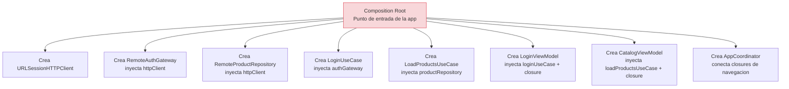
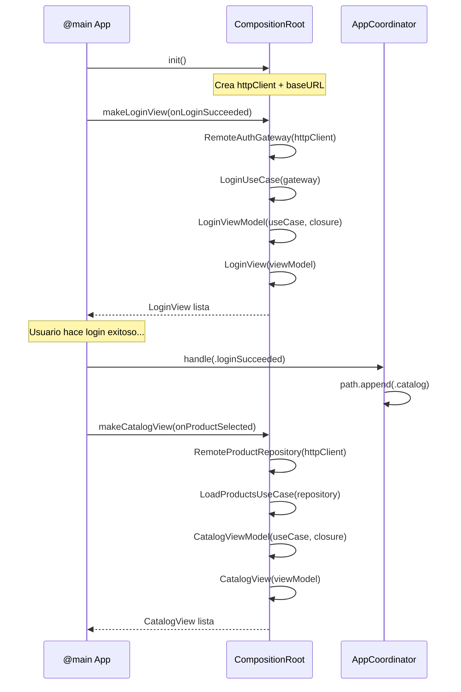

# Composition Root: donde se ensambla todo

## Objetivo de aprendizaje

Al terminar esta leccion vas a entender que es el Composition Root, por que es el unico lugar que conoce todas las implementaciones concretas, y como se cablea una app real con dos features (Login + Catalog) paso a paso.

En palabras simples: el Composition Root es el "director de orquesta" que decide quien toca cada instrumento, pero no toca ninguno el mismo.

---

## Definicion simple

El Composition Root es el punto de la aplicacion donde se crean todas las dependencias y se conectan entre si. Es el unico lugar que sabe que `AuthGateway` se implementa con `RemoteAuthGateway`, que `ProductRepository` se implementa con `RemoteProductRepository`, y que `HTTPClient` se implementa con `URLSessionHTTPClient`.

Ninguna otra capa sabe estas cosas. Domain no sabe. Application no sabe. Interface no sabe. Solo el Composition Root.

---

## Modelo mental: la fabrica de montaje

Imagina una fabrica de coches:

- **Domain** diseña el motor (reglas de negocio puras).
- **Application** diseña el chasis (casos de uso que conectan piezas).
- **Infrastructure** fabrica las piezas (adaptadores concretos: red, disco).
- **Interface** pinta y decora la carroceria (UI).
- **Composition Root** es la **linea de montaje**: toma todas las piezas y las ensambla en un coche funcional.

Si el Domain supiera como se fabrica cada pieza, estaria acoplado al proceso de fabricacion. El Composition Root existe para que nadie mas tenga que saber como se ensambla el todo.



---

## Por que no usar un Service Locator global

Una alternativa comun (y problematica) es crear un objeto global accesible desde cualquier parte de la app, donde cualquier componente puede pedir cualquier dependencia cuando quiera. Esto se conoce como **Service Locator** y es un anti-patron en este curso.

Problemas del Service Locator:

- **Acoplamiento oculto:** No sabes que dependencias tiene un componente hasta que lo ejecutas y falla. El `init` no te dice nada.
- **Tests dificiles:** Tienes que mutar un estado global para inyectar stubs, lo cual introduce fragilidad y orden de ejecucion en los tests.
- **Dependencias invisibles:** Un `LoginUseCase` que accede a un localizador global no declara en su `init` que necesita un `AuthGateway`. Lo descubres leyendo toda la implementacion.

Con Composition Root + constructor injection:

```swift
// Dependencias explicitas: ves todo en el init
let useCase = LoginUseCase(gateway: authGateway)
```

Beneficios:

- **Dependencias visibles:** El `init` te dice exactamente que necesita.
- **Tests triviales:** Pasas un stub en el `init` y listo.
- **Compilador te ayuda:** Si olvidas una dependencia, no compila.

---

## Cuando SI y cuando NO

### Cuando SI usar Composition Root

- Siempre que tengas inyeccion de dependencias (es decir, siempre en este curso).
- En el punto de entrada de la app (`@main`).
- Cuando necesites crear features con todas sus capas conectadas.

### Cuando NO

- No crees multiples Composition Roots repartidos por la app. Debe haber uno solo (o uno por scope muy claro, como un widget de iOS).
- No metas logica de negocio en el Composition Root. Su trabajo es solo cablear, no decidir.

---

## Implementacion paso a paso

### Paso 1: El HTTPClient compartido

Todas las features que hablan con un servidor necesitan un `HTTPClient`. Lo creamos una sola vez:

```swift
// StackMyArchitecture/App/CompositionRoot.swift

import SwiftUI

@MainActor
struct CompositionRoot {

    // MARK: - Shared dependencies (se crean una sola vez)

    private let httpClient: HTTPClient
    private let baseURL: URL

    init() {
        self.httpClient = URLSessionHTTPClient()
        self.baseURL = URL(string: "https://api.example.com")!
    }
}
```

**Linea por linea:**

- `@MainActor` — El Composition Root crea ViewModels que son `@MainActor`, asi que el propio root debe estar en el hilo principal.
- `private let httpClient` — Creado una vez, compartido por todas las features que necesiten red.
- `private let baseURL` — La URL base del servidor. En produccion vendria de una configuracion de entorno.

### Paso 2: Factory de Login

Cada feature tiene su propia factory (metodo que crea la cadena completa):

```swift
extension CompositionRoot {

    func makeLoginView(onLoginSucceeded: @MainActor @escaping (Session) -> Void) -> LoginView {
        // 1. Crear el gateway (Infrastructure)
        let authGateway = RemoteAuthGateway(
            httpClient: httpClient,
            baseURL: baseURL
        )

        // 2. Crear el caso de uso (Application)
        let loginUseCase = LoginUseCase(gateway: authGateway)

        // 3. Crear el ViewModel (Interface)
        let viewModel = LoginViewModel(
            loginUseCase: loginUseCase,
            onLoginSucceeded: onLoginSucceeded
        )

        // 4. Crear la vista
        return LoginView(viewModel: viewModel)
    }
}
```

**Que pasa aqui:**

1. Creamos `RemoteAuthGateway` inyectando el `httpClient` compartido.
2. Creamos `LoginUseCase` inyectando el gateway. El UseCase no sabe que es un `RemoteAuthGateway`; solo sabe que conforma `AuthGateway`.
3. Creamos `LoginViewModel` inyectando el UseCase y el closure de navegacion.
4. Creamos `LoginView` inyectando el ViewModel.

**El closure `onLoginSucceeded`** es lo que conecta Login con el resto de la app. El Composition Root decide que pasa cuando el login tiene exito (por ejemplo, navegar al Catalogo). Login no lo sabe ni le importa.

### Paso 3: Factory de Catalog

```swift
extension CompositionRoot {

    func makeCatalogView(onProductSelected: @MainActor @escaping (Product) -> Void) -> CatalogView {
        // 1. Crear el repository (Infrastructure)
        let productRepository = RemoteProductRepository(
            httpClient: httpClient,
            baseURL: baseURL
        )

        // 2. Crear el caso de uso (Application)
        let loadProductsUseCase = LoadProductsUseCase(repository: productRepository)

        // 3. Crear el ViewModel (Interface)
        let viewModel = CatalogViewModel(
            loadProducts: loadProductsUseCase,
            onProductSelected: onProductSelected
        )

        // 4. Crear la vista
        return CatalogView(viewModel: viewModel)
    }
}
```

Mismo patron que Login. Misma estructura. Esa consistencia es intencional: cuando un nuevo desarrollador llega al equipo y ve como esta montado Login, sabe automaticamente como esta montado Catalog. Y cuando cree una tercera feature, sabe exactamente que factory escribir.

### Paso 4: Conectar con el AppCoordinator

```swift
// StackMyArchitecture/App/StackMyArchitectureApp.swift

import SwiftUI

@main
struct StackMyArchitectureApp: App {
    @State private var coordinator = AppCoordinator()
    private let compositionRoot = CompositionRoot()

    var body: some Scene {
        WindowGroup {
            NavigationStack(path: $coordinator.path) {
                compositionRoot.makeLoginView { session in
                    coordinator.handle(.loginSucceeded(session))
                }
                .navigationDestination(for: AppRoute.self) { route in
                    switch route {
                    case .catalog:
                        compositionRoot.makeCatalogView { product in
                            coordinator.handle(.productSelected(product))
                        }
                    case .productDetail(let product):
                        Text("Detalle de \(product.name)")
                    }
                }
            }
        }
    }
}
```

**Linea por linea:**

- `@State private var coordinator` — El coordinador gestiona la pila de navegacion.
- `private let compositionRoot` — Creado una vez al iniciar la app.
- `compositionRoot.makeLoginView { session in ... }` — La primera pantalla es Login. Cuando el login tiene exito, le decimos al coordinator.
- `.navigationDestination(for: AppRoute.self)` — SwiftUI moderno: el coordinator empuja rutas, y aqui decidimos que vista mostrar para cada ruta.
- Cada vista se crea con su factory del CompositionRoot, y el closure de navegacion se conecta al coordinator.

---

## Diagrama del flujo de ensamblaje completo



---

## El Composition Root en tests vs produccion

En produccion, el Composition Root crea implementaciones reales:

```swift
// Produccion: red real
let httpClient = URLSessionHTTPClient()
let authGateway = RemoteAuthGateway(httpClient: httpClient, baseURL: prodURL)
```

En tests, cada test crea su propia cadena con stubs:

```swift
// Tests: sin red, sin servidor
let authGateway = AuthGatewayStub(result: .success(session))
let useCase = LoginUseCase(gateway: authGateway)
let viewModel = LoginViewModel(loginUseCase: useCase, onLoginSucceeded: { _ in })
```

No hay un "Composition Root de tests". Cada test monta exactamente la cadena que necesita con el helper `makeSUT`. Eso es lo que hemos hecho en todas las lecciones anteriores: el patron `makeSUT` ES un mini-composition-root local para cada test.

---

## Errores tipicos y como depurarlos

### Error 1: Crear dependencias dentro de los componentes

Cuando un ViewModel crea internamente su UseCase y su Gateway, no puedes testearlo sin hacer peticiones reales de red. La solucion es siempre inyectar por constructor: el ViewModel recibe su UseCase en el `init`.

### Error 2: Pasar el CompositionRoot a los ViewModels

Si un ViewModel recibe el CompositionRoot entero, puede acceder a cualquier factory y dependencia. Eso rompe la separacion de capas. La solucion es pasar solo lo que el ViewModel necesita (su UseCase y su closure de navegacion).

### Error 3: Olvidar que el Composition Root es @MainActor

Si creas ViewModels (que son `@MainActor`) fuera del hilo principal, el compilador de Swift 6.2 te dara un error. Asegurate de que el Composition Root y sus factories estan marcadas con `@MainActor`.

---

## Evolucion futura del Composition Root

Cuando el proyecto crezca, el Composition Root puede evolucionar:

- **Etapa 3:** Añadir `CachedProductRepository` como decorador entre el UseCase y el repository remoto, sin tocar ninguna otra capa.
- **Etapa 4:** Migrar a un `Package.swift` donde `AppComposition` es un target SPM dedicado que importa todos los demas.
- **Firebase:** Cambiar `URLSessionHTTPClient` por `FirebaseAuthAdapter` solo aqui, sin tocar Login ni Catalog.

El Composition Root es el punto de maxima flexibilidad: puedes cambiar toda la infraestructura de la app modificando un solo archivo.

---

## ADR corto de la leccion

```markdown
## ADR-003: Composition Root centralizado con factories por feature
- Estado: Aprobado
- Contexto: necesidad de ensamblar Login + Catalog sin acoplar features entre si ni con implementaciones concretas
- Decision: un unico CompositionRoot con factory methods por feature, inyeccion por constructor, closures de navegacion hacia AppCoordinator
- Consecuencias: ensamblaje explicito y testeable; el unico punto que conoce todas las implementaciones; facil de extender con nuevas features o backends
- Fecha: 2026-02-07
```

---

## Checklist de calidad

- [ ] El Composition Root es el unico lugar que importa implementaciones concretas.
- [ ] Ningun ViewModel, UseCase ni Gateway crea sus propias dependencias.
- [ ] Cada feature tiene su factory method independiente.
- [ ] Los closures de navegacion conectan features sin que estas se conozcan.
- [ ] En tests, cada test monta su propia cadena con stubs (patron makeSUT).
- [ ] El Composition Root esta marcado como `@MainActor`.

---

## Cierre

El Composition Root parece un archivo sencillo: "solo crea objetos y los conecta". Pero su impacto arquitectonico es enorme. Es la razon por la que puedes cambiar de URLSession a Firebase sin tocar Domain. Es la razon por la que puedes testear un ViewModel en milisegundos. Es la razon por la que un nuevo desarrollador puede entender como se monta una feature mirando un solo archivo.

Un buen Composition Root no se nota. Un mal Composition Root (o su ausencia) se nota en cada PR, en cada test roto, y en cada refactor que se convierte en pesadilla.

**Anterior:** [Integration tests ←](05-integration-tests.md) · **Siguiente:** [Entregables Etapa 2 →](entregables-etapa-2.md)
