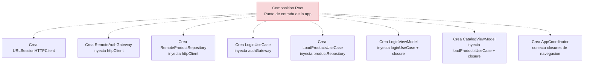
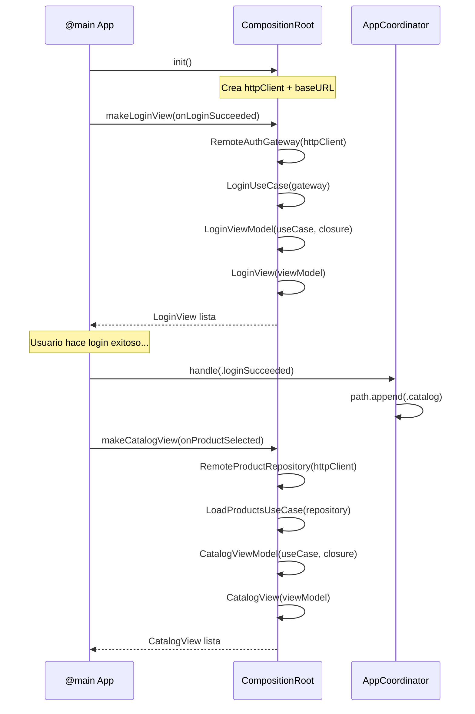

# Composition Root: donde se ensambla todo

> **Nota de nomenclatura pedagógica**
> Algunos snippets de esta lección usan `ProductRepository` como nombre conceptual.
> En el scaffold real (`apps/ios/ArchitectureKit`) el equivalente operativo es `CatalogRepository`.

## Objetivo de aprendizaje

Al terminar esta lección vas a entender qué es el Composition Root, por qué es el único lugar que conoce todas las implementaciones concretas, y cómo se cablea una app real con dos features (Login + Catalog) paso a paso.

En palabras simples: el Composition Root es el "director de orquesta" que decide quién toca cada instrumento, pero no toca ninguno él mismo.

---

## Definición simple

El Composition Root es el punto de la aplicación donde se crean todas las dependencias y se conectan entre sí. Es el único lugar que sabe que `AuthGateway` se implementa con `RemoteAuthGateway`, que `ProductRepository` se implementa con `RemoteProductRepository`, y que `HTTPClient` se implementa con `URLSessionHTTPClient`.

Ninguna otra capa sabe estas cosas. Domain no sabe. Application no sabe. Interface no sabe. Solo el Composition Root.

---

## Modelo mental: la fábrica de montaje

Imagina una fábrica de coches:

- **Domain** diseña el motor (reglas de negocio puras).
- **Application** diseña el chasis (casos de uso que conectan piezas).
- **Infrastructure** fabrica las piezas (adaptadores concretos: red, disco).
- **Interface** pinta y decora la carrocería (UI).
- **Composition Root** es la **línea de montaje**: toma todas las piezas y las ensambla en un coche funcional.

Si el Domain supiera cómo se fabrica cada pieza, estaría acoplado al proceso de fabricación. El Composition Root existe para que nadie más tenga que saber cómo se ensambla el todo.


```mermaid
flowchart TD
    CR["Composition Root<br/>Punto de entrada de la app"] -.-> HTTP["Crea URLSessionHTTPClient"]
    CR -.-> AUTH["Crea RemoteAuthGateway<br/>inyecta httpClient"]
    CR -.-> PROD["Crea RemoteProductRepository<br/>inyecta httpClient"]
    CR -.-> LUC["Crea LoginUseCase<br/>inyecta authGateway"]
    CR -.-> PUC["Crea LoadProductsUseCase<br/>inyecta productRepository"]
    CR -.-> LVM["Crea LoginViewModel<br/>inyecta loginUseCase + closure"]
    CR -.-> CVM["Crea CatalogViewModel<br/>inyecta loadProductsUseCase + closure"]
    CR -.-> COORD["Crea AppCoordinator<br/>conecta closures de navegacion"]

    style CR fill:#f8d7da,stroke:#dc3545
```

Lectura paso a paso:

1. `CR -.- HTTP`: el Composition Root crea `URLSessionHTTPClient` una sola vez. Los puntos de la flecha indican que es creación/wiring, no una dependencia de runtime — `URLSessionHTTPClient` no forma parte del API de ninguna capa; solo existe en el Composition Root.
2. `CR -.- AUTH / PROD`: el root crea `RemoteAuthGateway` y `RemoteProductRepository`, inyectando el `httpClient` ya creado. Las implementaciones concretas solo existen aquí — ninguna otra capa las importa.
3. `CR -.- LUC / PUC`: el root crea los casos de uso inyectando los gateways/repositories. A partir de aquí, Application solo ve los protocolos (`AuthGateway`, `ProductRepository`), no las implementaciones.
4. `CR -.- LVM / CVM`: los ViewModels reciben sus casos de uso. El ViewModel no sabe si detrás hay red real, cache, o un stub.
5. `CR -.- COORD`: el coordinador recibe los closures que conectan los eventos de las features con las transiciones de navegación.

Nótese que todas las flechas salen del `CR` hacia las dependencias. El Composition Root conoce todo. El resto de la app no conoce el Composition Root.

---

## Por qué no usar un Service Locator global

Una alternativa común (y problemática) es crear un objeto global accesible desde cualquier parte de la app, donde cualquier componente puede pedir cualquier dependencia cuando quiera. Esto se conoce como **Service Locator** y es un anti-patrón en este curso.

Problemas del Service Locator:

- **Acoplamiento oculto:** No sabes qué dependencias tiene un componente hasta que lo ejecutas y falla. El `init` no te dice nada.
- **Tests difíciles:** Tienes que mutar un estado global para inyectar stubs, lo cual introduce fragilidad y orden de ejecución en los tests.
- **Dependencias invisibles:** Un `LoginUseCase` que accede a un localizador global no declara en su `init` que necesita un `AuthGateway`. Lo descubres leyendo toda la implementación.

Con Composition Root + constructor injection:

```swift
// Dependencias explícitas: ves todo en el init
let useCase = LoginUseCase(gateway: authGateway)
```

Beneficios:

- **Dependencias visibles:** El `init` te dice exactamente qué necesita.
- **Tests triviales:** Pasas un stub en el `init` y listo.
- **Compilador te ayuda:** Si olvidas una dependencia, no compila.

---

## Cuándo SÍ y cuándo NO

### Cuándo SÍ usar Composition Root

```swift
// ✅ El Composition Root es el único lugar que instancia implementaciones concretas
@MainActor
struct CompositionRoot {
    private let httpClient: HTTPClient = URLSessionHTTPClient()  // ← solo aquí
    private let baseURL = URL(string: "https://api.example.com")!

    func makeLoginView(onLoginSucceeded: @MainActor @escaping (Session) -> Void) -> LoginView {
        let gateway = RemoteAuthGateway(httpClient: httpClient, baseURL: baseURL)
        // RemoteAuthGateway solo se instancia aquí — LoginUseCase solo conoce el protocolo AuthGateway
        let useCase = LoginUseCase(gateway: gateway)
        let viewModel = LoginViewModel(useCase: useCase, onLoginSucceeded: onLoginSucceeded)
        return LoginView(viewModel: viewModel)
    }
}
// Si quieres cambiar de URLSession a Alamofire o a Firebase Auth:
// cambias una línea en CompositionRoot. LoginUseCase, LoginViewModel y LoginView no se tocan.
```

### Cuándo NO

```swift
// ❌ Crear dependencias dentro de los componentes — rompe la inyección
@Observable @MainActor
final class LoginViewModel {
    private let useCase = LoginUseCase(
        gateway: RemoteAuthGateway(  // ❌ ViewModel conoce RemoteAuthGateway
            httpClient: URLSessionHTTPClient(),  // ❌ ViewModel instancia URLSession
            baseURL: URL(string: "https://api.example.com")!
        )
    )
    // Para testear este ViewModel necesitas un servidor real o interceptar URLSession globalmente.
    // El ViewModel es imposible de aislar.
}

// ❌ Múltiples Composition Roots en distintas partes de la app
// LoginCoordinator crea sus dependencias. CatalogCoordinator crea las suyas.
// Resultado: dos instancias de URLSessionHTTPClient, configuraciones divergentes,
// ningún punto único donde cambiar el entorno (dev/staging/prod).
```

- El Composition Root es siempre el `@main` o un tipo creado desde `@main`.
- No metas lógica de negocio en el Composition Root. Su trabajo es solo cablear, no decidir.

---

## Implementación paso a paso

### Paso 1: El HTTPClient compartido

Todas las features que hablan con un servidor necesitan un `HTTPClient`. Lo creamos una sola vez:

```swift
// StackMyArchitecture/App/CompositionRoot.swift

import SwiftUI

@MainActor
struct CompositionRoot {

    // MARK: - Shared dependencies (se crean una sola vez)

    private let httpClient: HTTPClient
    private let baseURL: URL

    init() {
        self.httpClient = URLSessionHTTPClient()
        self.baseURL = URL(string: "https://api.example.com")!
    }
}
```

**Línea por línea:**

- `@MainActor` — El Composition Root crea ViewModels que son `@MainActor`, así que el propio root debe estar en el hilo principal.
- `private let httpClient` — Creado una vez, compartido por todas las features que necesiten red.
- `private let baseURL` — La URL base del servidor. En producción vendría de una configuración de entorno.

### Paso 2: Factory de Login

Cada feature tiene su propia factory (metodo que crea la cadena completa):

```swift
extension CompositionRoot {

    func makeLoginView(onLoginSucceeded: @MainActor @escaping (Session) -> Void) -> LoginView {
        // 1. Crear el gateway (Infrastructure)
        let authGateway = RemoteAuthGateway(
            httpClient: httpClient,
            baseURL: baseURL
        )

        // 2. Crear el caso de uso (Application)
        let loginUseCase = LoginUseCase(gateway: authGateway)

        // 3. Crear el ViewModel (Interface)
        let viewModel = LoginViewModel(
            loginUseCase: loginUseCase,
            onLoginSucceeded: onLoginSucceeded
        )

        // 4. Crear la vista
        return LoginView(viewModel: viewModel)
    }
}
```

**Qué pasa aquí:**

1. Creamos `RemoteAuthGateway` inyectando el `httpClient` compartido.
2. Creamos `LoginUseCase` inyectando el gateway. El UseCase no sabe que es un `RemoteAuthGateway`; solo sabe que conforma `AuthGateway`.
3. Creamos `LoginViewModel` inyectando el UseCase y el closure de navegación.
4. Creamos `LoginView` inyectando el ViewModel.

**El closure `onLoginSucceeded`** es lo que conecta Login con el resto de la app. El Composition Root decide qué pasa cuando el login tiene éxito (por ejemplo, navegar al Catálogo). Login no lo sabe ni le importa.

### Paso 3: Factory de Catalog

```swift
extension CompositionRoot {

    func makeCatalogView(onProductSelected: @MainActor @escaping (Product) -> Void) -> CatalogView {
        // 1. Crear el repository (Infrastructure)
        let productRepository = RemoteProductRepository(
            httpClient: httpClient,
            baseURL: baseURL
        )

        // 2. Crear el caso de uso (Application)
        let loadProductsUseCase = LoadProductsUseCase(repository: productRepository)

        // 3. Crear el ViewModel (Interface)
        let viewModel = CatalogViewModel(
            loadProducts: loadProductsUseCase,
            onProductSelected: onProductSelected
        )

        // 4. Crear la vista
        return CatalogView(viewModel: viewModel)
    }
}
```

Mismo patrón que Login. Misma estructura. Esa consistencia es intencional: cuando un nuevo desarrollador llega al equipo y ve cómo está montado Login, sabe automáticamente cómo está montado Catalog. Y cuando cree una tercera feature, sabe exactamente qué factory escribir.

### Paso 4: Conectar con el AppCoordinator

```swift
// StackMyArchitecture/App/StackMyArchitectureApp.swift

import SwiftUI

@main
struct StackMyArchitectureApp: App {
    @State private var coordinator = AppCoordinator()
    private let compositionRoot = CompositionRoot()

    var body: some Scene {
        WindowGroup {
            NavigationStack(path: $coordinator.path) {
                compositionRoot.makeLoginView { session in
                    coordinator.handle(.loginSucceeded(session))
                }
                .navigationDestination(for: AppRoute.self) { route in
                    switch route {
                    case .catalog:
                        compositionRoot.makeCatalogView { product in
                            coordinator.handle(.productSelected(product))
                        }
                    case .productDetail(let product):
                        Text("Detalle de \(product.name)")
                    }
                }
            }
        }
    }
}
```

**Línea por línea:**

- `@State private var coordinator` — El coordinador gestiona la pila de navegación.
- `private let compositionRoot` — Creado una vez al iniciar la app.
- `compositionRoot.makeLoginView { session in ... }` — La primera pantalla es Login. Cuando el login tiene éxito, le decimos al coordinator.
- `.navigationDestination(for: AppRoute.self)` — SwiftUI moderno: el coordinator empuja rutas, y aquí decidimos qué vista mostrar para cada ruta.
- Cada vista se crea con su factory del CompositionRoot, y el closure de navegación se conecta al coordinator.

---

## Diagrama del flujo de ensamblaje completo


```mermaid
sequenceDiagram
    participant APP as @main App
    participant CR as CompositionRoot
    participant COORD as AppCoordinator

    APP->>CR: init()
    Note over CR: Crea httpClient + baseURL

    APP->>CR: makeLoginView(onLoginSucceeded)
    CR->>CR: RemoteAuthGateway(httpClient)
    CR->>CR: LoginUseCase(gateway)
    CR->>CR: LoginViewModel(useCase, closure)
    CR->>CR: LoginView(viewModel)
    CR-->>APP: LoginView lista

    Note over APP: Usuario hace login exitoso...

    APP->>COORD: handle(.loginSucceeded)
    COORD->>COORD: path.append(.catalog)

    APP->>CR: makeCatalogView(onProductSelected)
    CR->>CR: RemoteProductRepository(httpClient)
    CR->>CR: LoadProductsUseCase(repository)
    CR->>CR: CatalogViewModel(useCase, closure)
    CR->>CR: CatalogView(viewModel)
    CR-->>APP: CatalogView lista
```

Lectura del sequenceDiagram paso a paso:

1. `APP ->> CR: init()` — al arrancar la app, el Composition Root se construye: crea `httpClient` y `baseURL`. Estas son las únicas dependencias compartidas por todas las features.
2. `APP ->> CR: makeLoginView(onLoginSucceeded)` — el `@main` pide la vista de Login. El root construye la cadena completa: Gateway → UseCase → ViewModel → View. El closure `onLoginSucceeded` queda capturado en el ViewModel.
3. El usuario hace login. El closure dispara al coordinator.
4. `APP ->> COORD: handle(.loginSucceeded)` — el coordinator hace `path.append(.catalog)`. SwiftUI detecta el cambio y busca el `navigationDestination` correspondiente.
5. `APP ->> CR: makeCatalogView(onProductSelected)` — SwiftUI solicita la vista de Catalog. El root construye otra cadena independiente, reutilizando el mismo `httpClient`.

Nótese que `RemoteAuthGateway` y `RemoteProductRepository` se crean dentro de `makeLoginView` y `makeCatalogView` respectivamente — no en `init()`. Son objetos de vida corta, creados cuando se necesitan. El `httpClient` sí es de vida larga (se crea en `init` y se reutiliza).

---

## El Composition Root en tests vs producción

En producción, el Composition Root crea implementaciones reales:

```swift
// Producción: red real
let httpClient = URLSessionHTTPClient()
let authGateway = RemoteAuthGateway(httpClient: httpClient, baseURL: prodURL)
```

En tests, cada test crea su propia cadena con stubs:

```swift
// Tests: sin red, sin servidor
let authGateway = AuthGatewayStub(result: .success(session))
let useCase = LoginUseCase(gateway: authGateway)
let viewModel = LoginViewModel(loginUseCase: useCase, onLoginSucceeded: { _ in })
```

No hay un "Composition Root de tests". Cada test monta exactamente la cadena que necesita con el helper `makeSUT`. Eso es lo que hemos hecho en todas las lecciones anteriores: el patrón `makeSUT` ES un mini-composition-root local para cada test.

---

## Plan TDD del Composition Root

El Composition Root es difícil de testear unitariamente porque es el único tipo que crea implementaciones concretas. Los tests a nivel de Composition Root son tests de integración: verifican que el ensamblaje produce una cadena funcional, no que cada pieza funcione en aislamiento (eso lo hacen los tests de cada capa).

**Paso 1 — Red: test de ensamblaje de Login.**

```swift
// AppCompositionTests.swift
@MainActor
final class CompositionRootTests: XCTestCase {
    func test_makeLoginView_producesViewWithFunctionalChain() {
        let sut = CompositionRoot()
        var capturedSession: Session?

        let view = sut.makeLoginView { session in
            capturedSession = session
        }
        // CompositionRoot no existe aún → test no compila → guía el diseño del init
        // view es LoginView — confirma que el factory devuelve el tipo correcto
        XCTAssertNotNil(view)
        // No probamos el login real aquí — eso es responsabilidad de LoginUseCaseTests
    }
}
```

**Paso 2 — Green:** implementar `CompositionRoot` con `makeLoginView`. El test pasa cuando el factory devuelve una instancia válida de `LoginView`.

**Paso 3 — Red: test de ensamblaje con stub para verificar el closure.**

```swift
func test_makeLoginView_closureConnectsToCompositionRoot() {
    let authGateway = AuthGatewayStub(result: .success(Session(token: "t", email: "e@test.com")))
    // Para testear el closure necesitamos inyectar un stub en el CompositionRoot.
    // Esto requiere que CompositionRoot exponga un init con dependencias inyectables.
    let sut = CompositionRoot(authGateway: authGateway)
    var loginSucceededCalled = false
    _ = sut.makeLoginView { _ in loginSucceededCalled = true }
    // En un integration test real, simularíamos el login y verificaríamos que el closure se llama
}
```

**Paso 4 — Reflexión:** si el test anterior resulta muy difícil de escribir porque `CompositionRoot` es rígido, eso es una señal de diseño. La solución es hacer inyectable el `CompositionRoot` para tests — ver el patrón del scaffold.

**Paso 5 — Refactor:** extraer la creación del `httpClient` a un método sobreescribible o un parámetro del `init`. Los tests de integración del scaffold lo hacen inyectando `InMemoryAuthRepository` directamente.

---

## Concurrencia: ensamblaje en el hilo correcto

### Aislamiento

`CompositionRoot` está anotado con `@MainActor` porque crea ViewModels que son `@MainActor`. Si `CompositionRoot` no tuviera `@MainActor`, crear un `LoginViewModel` (que sí lo tiene) desde un contexto de fondo sería un error de compilación en Swift 6.

Esta restricción no es solo técnica — refleja la realidad de que la composición de UI ocurre en el hilo principal. El momento en que `@main` invoca `makeLoginView()`, SwiftUI ya está procesando la escena, siempre en el main thread.

### `Sendable`

El `CompositionRoot` en sí no necesita ser `Sendable` porque no se pasa entre contextos concurrentes. Se crea una vez en `@main` y vive ahí. Sus factories (`makeLoginView`, `makeCatalogView`) también se llaman desde el mismo contexto `@MainActor`.

Lo que sí debe ser `Sendable` es el `httpClient` que se comparte entre factories:

```swift
// ✅ HTTPClient debe ser Sendable — se usa desde @MainActor pero puede transferirse a tareas async
protocol HTTPClient: Sendable {
    func execute(_ request: URLRequest) async throws -> (Data, HTTPURLResponse)
}

// URLSessionHTTPClient debe ser Sendable para conformar HTTPClient
struct URLSessionHTTPClient: HTTPClient, Sendable {
    private let session: URLSession
    // URLSession es @Sendable en iOS 15+ — puede cruzar contextos concurrentes
    func execute(_ request: URLRequest) async throws -> (Data, HTTPURLResponse) {
        let (data, response) = try await session.data(for: request)
        guard let httpResponse = response as? HTTPURLResponse else {
            throw URLError(.badServerResponse)
        }
        return (data, httpResponse)
    }
}
```

### Backpressure

El Composition Root no gestiona backpressure porque crea objetos, no ejecuta operaciones repetibles. Si se llama a `makeLoginView()` múltiples veces (por ejemplo, si SwiftUI re-evalúa la vista raíz), creará múltiples instancias. Para evitar esto, los factories deben ser idempotentes o el caller debe guardar la referencia:

```swift
// En @main: guardar la referencia para no recrear el ViewModel
@State private var coordinator: AppCoordinator
// AppCoordinator guarda la vista creada una vez y la reutiliza
// No llamar makeLoginView() dentro de body{} directamente sin guard
```

---

## Errores típicos y cómo depurarlos

### Error 1: Crear dependencias dentro de los componentes

Cuando un ViewModel crea internamente su UseCase y su Gateway, no puedes testearlo sin hacer peticiones reales de red. La solución es siempre inyectar por constructor: el ViewModel recibe su UseCase en el `init`.

### Error 2: Pasar el CompositionRoot a los ViewModels

Si un ViewModel recibe el CompositionRoot entero, puede acceder a cualquier factory y dependencia. Eso rompe la separación de capas. La solución es pasar solo lo que el ViewModel necesita (su UseCase y su closure de navegación).

### Error 3: Olvidar que el Composition Root es @MainActor

Si creas ViewModels (que son `@MainActor`) fuera del hilo principal, el compilador de Swift 6.2 te dará un error. Asegúrate de que el Composition Root y sus factories están marcadas con `@MainActor`.

---

## Evolución futura del Composition Root

Cuando el proyecto crezca, el Composition Root puede evolucionar:

- **Etapa 3:** Añadir `CachedProductRepository` como decorador entre el UseCase y el repository remoto, sin tocar ninguna otra capa.
- **Etapa 4:** Migrar a un `Package.swift` donde `AppComposition` es un target SPM dedicado que importa todos los demás.
- **Firebase:** Cambiar `URLSessionHTTPClient` por `FirebaseAuthAdapter` solo aquí, sin tocar Login ni Catalog.

El Composition Root es el punto de máxima flexibilidad: puedes cambiar toda la infraestructura de la app modificando un solo archivo.

---

## ADR corto de la lección

```markdown
## ADR-003: Composition Root centralizado con factories por feature
- Estado: Aprobado
- Contexto: necesidad de ensamblar Login + Catalog sin acoplar features entre si ni con implementaciones concretas
- Decisión: un único CompositionRoot con factory methods por feature, inyección por constructor, closures de navegación hacia AppCoordinator
- Consecuencias: ensamblaje explícito y testeable; el único punto que conoce todas las implementaciones; fácil de extender con nuevas features o backends
- Fecha: 2026-02-07
```

---

## Checklist de calidad

- [ ] El Composition Root es el único lugar que importa implementaciones concretas.
- [ ] Ningún ViewModel, UseCase ni Gateway crea sus propias dependencias.
- [ ] Cada feature tiene su factory method independiente.
- [ ] Los closures de navegación conectan features sin que estas se conozcan.
- [ ] En tests, cada test monta su propia cadena con stubs (patron makeSUT).
- [ ] El Composition Root está marcado como `@MainActor`.

---

## Cierre

El Composition Root parece un archivo sencillo: "solo crea objetos y los conecta". Pero su impacto arquitectónico es enorme. Es la razón por la que puedes cambiar de URLSession a Firebase sin tocar Domain. Es la razón por la que puedes testear un ViewModel en milisegundos. Es la razón por la que un nuevo desarrollador puede entender cómo se monta una feature mirando un solo archivo.

Un buen Composition Root no se nota. Un mal Composition Root (o su ausencia) se nota en cada PR, en cada test roto, y en cada refactor que se convierte en pesadilla.

---

## Implementación en tu proyecto

El scaffold tiene el Composition Root en `Sources/AppComposition/AppCompositionRoot.swift`. Es significativamente más completo que el modelo pedagógico de esta lección — ya incluye Etapa 3 (cache con SwiftData) y la arquitectura de navegación con `NavigationStore`:

| Concepto en lección | Fichero en scaffold | Diferencia clave |
|---|---|---|
| `CompositionRoot` | `Sources/AppComposition/AppCompositionRoot.swift` → `AppCompositionRoot` | Nombre con prefijo `App`; incluye Etapa 3 |
| `URLSessionHTTPClient` | No en el scaffold de Etapa 2 | Usa `InMemoryAuthRepository` y `DefaultCatalogRemoteDataSource` por defecto |
| `AppCoordinator` | `Sources/AppComposition/NavigationStore.swift` | `NavigationStore` con `routes: [AppRoute]` |
| Factory de Login | Dentro del `init` de `AppCompositionRoot` | Construye directamente en `init`, no en factory methods separados |

```swift
// Lo que ya existe en el scaffold
// Sources/AppComposition/AppCompositionRoot.swift
@MainActor
public struct AppCompositionRoot {
    public let navigation: NavigationStore
    public let loginViewModel: LoginViewModel
    public let catalogViewModel: CatalogViewModel?

    public init(
        authRepository: any AuthRepository = InMemoryAuthRepository(),
        catalogRepository: (any CatalogRepository)? = nil
    ) {
        let navigation = NavigationStore()
        let loginUseCase = AuthenticateUserUseCase(repository: authRepository)
        let loginViewModel = LoginViewModel(useCase: loginUseCase, navigator: navigation)
        let catalogViewModel = catalogRepository.map {
            CatalogViewModel(useCase: LoadCatalogUseCase(repository: $0))
        }
        // ...
    }
}
```

**Diferencias clave a entender:**

1. **`InMemoryAuthRepository` por defecto** — el scaffold usa un repositorio en memoria, no un `RemoteAuthGateway` con `URLSession`. Esto hace el scaffold funcional sin configurar ningún servidor. Cuando implementes la red real (Etapa 3+), cambias solo este parámetro del `init`.

2. **`CatalogViewModel?` opcional** — el catalogo puede no existir si no se pasa un `catalogRepository`. Esto permite lanzar la app con solo Login mientras el catálogo está en desarrollo.

3. **`navigator: navigation`** — el `LoginViewModel` recibe el `NavigationStore` directamente como `LoginNavigating`. En la lección, el ViewModel recibe un closure. El protocolo es más explícito sobre el contrato; el closure es más simple de leer.

**Qué hacer ahora:**
1. Abre `Sources/AppComposition/AppCompositionRoot.swift` — lee el ensamblaje completo.
2. Abre `Tests/AppCompositionTests/AppCompositionRootTests.swift` — ve cómo el scaffold testea el Composition Root usando `InMemoryAuthRepository`.
3. **Ejercicio:** añade un `init` alternativo que acepte un `httpClient: any HTTPClient` para poder pasar un `URLSessionHTTPClient` real. Esto prepara el Composition Root para Etapa 3.

---

## Qué sigue

Con el Composition Root ensamblando Login y Catalog, la app tiene un flujo funcional de punta a punta. Los siguientes pasos profundizan en dos áreas: cómo construir interfaces SwiftUI más sofisticadas para empresa, y cómo manejar la concurrencia a escala enterprise.

→ [Lección 12a: SwiftUI Enterprise — Navegación](07a-swiftui-enterprise-navegacion.md) — patrones avanzados de navegación, modales y coordinación de vistas en apps enterprise.

