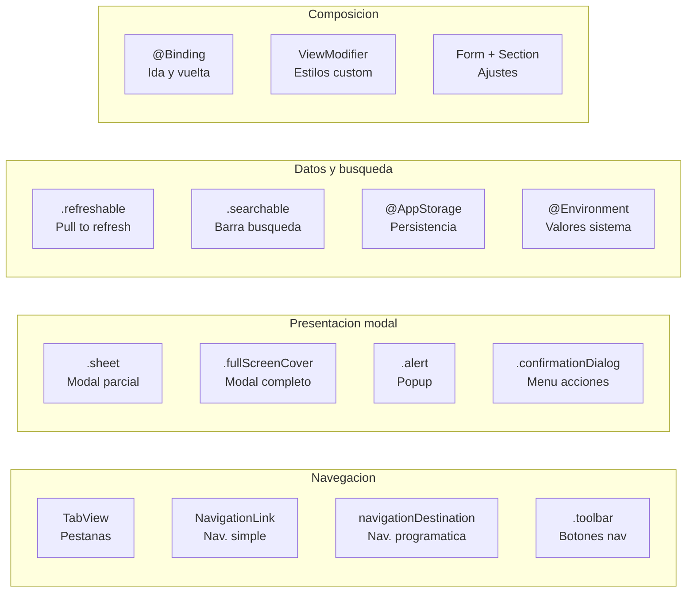
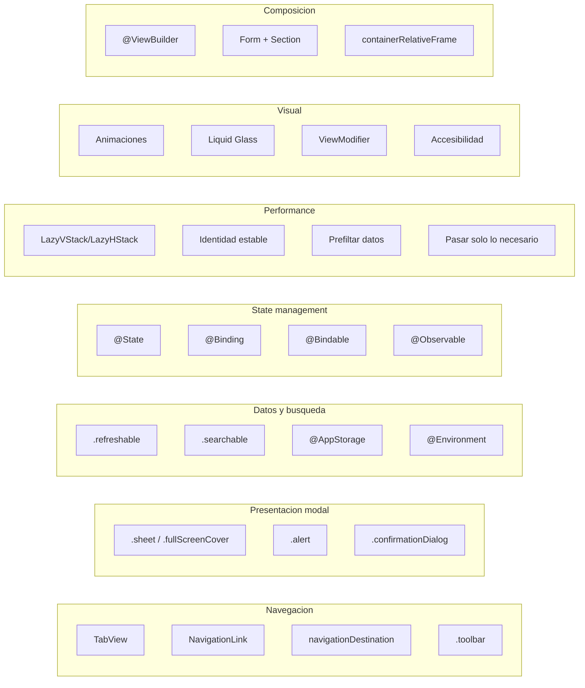

# SwiftUI Enterprise: Patrones Imprescindibles

## Por que esta leccion

En las lecciones anteriores construimos dos pantallas (Login y Catalog) usando SwiftUI. Pero una app profesional necesita mucho mas: modales, alertas, pull-to-refresh, busqueda, tabs, barras de herramientas, persistencia de preferencias... En esta leccion vamos a enriquecer nuestra app con los patrones SwiftUI que encontraras en **cualquier** app enterprise.

Cada patron se explica con:
1. **Que es** — Descripcion para un junior.
2. **Por que lo necesitas** — Caso de uso real en enterprise.
3. **Como se integra** — Codigo aplicado a nuestra arquitectura.
4. **Donde vive** — En que capa de Clean Architecture encaja.

---

## 1. TabView — Navegacion por pestanas

### Que es

`TabView` organiza la app en pestanas (tabs) en la parte inferior de la pantalla. Piensa en apps como App Store, Spotify, o Instagram: todas tienen una barra de pestanas abajo. Cada pestana es una seccion independiente de la app.

### Por que lo necesitas

En enterprise, las apps casi siempre tienen multiples secciones: catalogo, perfil, ajustes, notificaciones. `TabView` es la forma estandar de organizar esto en iOS.

### Como se integra

Modifica `StackMyArchitectureApp.swift` para envolver las secciones en un `TabView`:

```swift
@main
struct StackMyArchitectureApp: App {
    @State private var coordinator: AppCoordinator

    init() {
        let compositionRoot = CompositionRoot()
        _coordinator = State(wrappedValue: AppCoordinator(compositionRoot: compositionRoot))
    }

    var body: some Scene {
        WindowGroup {
            TabView {
                // Tab 1: Catalogo con navegacion
                Tab("Catalogo", systemImage: "book.fill") {
                    NavigationStack(path: $coordinator.catalogPath) {
                        coordinator.makeCatalogView()
                            .navigationDestination(for: AppDestination.self) { destination in
                                switch destination {
                                case .productDetail(let product):
                                    coordinator.makeProductDetailView(product: product)
                                default:
                                    EmptyView()
                                }
                            }
                    }
                }

                // Tab 2: Perfil
                Tab("Perfil", systemImage: "person.fill") {
                    NavigationStack {
                        coordinator.makeProfileView()
                    }
                }

                // Tab 3: Ajustes
                Tab("Ajustes", systemImage: "gear") {
                    NavigationStack {
                        coordinator.makeSettingsView()
                    }
                }
            }
        }
    }
}
```

**Explicacion linea por linea:**

`TabView { ... }` — Crea la barra de pestanas. Cada `Tab` dentro es una pestana.

`Tab("Catalogo", systemImage: "book.fill")` — Crea una pestana con titulo "Catalogo" y un icono de SF Symbols. El icono y texto aparecen en la barra inferior.

Cada tab tiene su propio `NavigationStack` — Esto es **critico**: cada pestana gestiona su propia pila de navegacion. Si navegas a un detalle en Catalogo y cambias a Perfil, al volver a Catalogo sigues en el detalle. Las pilas son independientes.

### Donde vive

En la **capa App** (`StackMyArchitectureApp.swift`). El `TabView` es una decision de presentacion de la app, no de una feature individual.

---

## 2. @Environment — Acceso a valores del sistema

### Que es

`@Environment` es un property wrapper que te da acceso a valores proporcionados por SwiftUI o por ti mismo. Piensalo como una **caja de herramientas compartida**: SwiftUI mete herramientas (dismiss, colorScheme, locale...) y tu las sacas cuando las necesitas.

### Los mas usados en enterprise

```swift
// Cerrar/volver atras de una vista presentada modalmente
@Environment(\.dismiss) private var dismiss

// Saber si el usuario tiene modo oscuro o claro
@Environment(\.colorScheme) private var colorScheme

// Saber la zona horaria del usuario
@Environment(\.timeZone) private var timeZone

// Saber si la app esta en modo accesibilidad (texto grande)
@Environment(\.dynamicTypeSize) private var dynamicTypeSize

// Contexto de SwiftData (persistencia)
@Environment(\.modelContext) private var modelContext
```

### Ejemplo real: cerrar un modal

```swift
struct FilterView: View {
    @Environment(\.dismiss) private var dismiss

    var body: some View {
        NavigationStack {
            List {
                Text("Filtros aqui...")
            }
            .navigationTitle("Filtrar")
            .toolbar {
                ToolbarItem(placement: .confirmationAction) {
                    Button("Aplicar") {
                        // Aplicar filtros...
                        dismiss()
                    }
                }
                ToolbarItem(placement: .cancellationAction) {
                    Button("Cancelar") {
                        dismiss()
                    }
                }
            }
        }
    }
}
```

**Explicacion:**

`@Environment(\.dismiss)` — Obtiene la accion de "cerrar esta vista". Cuando esta vista se presenta como `.sheet`, llamar a `dismiss()` la cierra con animacion. Es como un boton de "cerrar" que SwiftUI te da gratis.

`\.dismiss` es un **key path al Environment**. El `\.` apunta a una propiedad del entorno de SwiftUI. Es la misma sintaxis que `\.id` en `List(products, id: \.id)`.

### Donde vive

En la **capa Interface**. `@Environment` es exclusivo de SwiftUI — nunca en Domain, Application, ni Infrastructure.

---

## 3. .sheet y .fullScreenCover — Presentacion modal

### Que es

Un **modal** es una pantalla que aparece deslizandose desde abajo, cubriendo parcial (`.sheet`) o totalmente (`.fullScreenCover`) la pantalla actual. Se usa para tareas secundarias: filtros, formularios, confirmaciones, compartir.

### Por que lo necesitas

En enterprise: formularios de edicion, pantallas de filtros, vistas de detalle rapido, flujos de onboarding, pantallas de compartir.

### Como se integra

Anade un boton de filtros al catalogo:

```swift
struct CatalogView: View {
    @State private var viewModel: CatalogViewModel
    @State private var showingFilter = false

    // ... init ...

    var body: some View {
        Group {
            switch viewModel.state {
            case .loaded(let products):
                List(products, id: \.id) { product in
                    ProductRow(product: product)
                        .onTapGesture { viewModel.selectProduct(product) }
                }
            // ... otros casos ...
            }
        }
        .navigationTitle("Catalogo")
        .toolbar {
            ToolbarItem(placement: .topBarTrailing) {
                Button("Filtrar", systemImage: "line.3.horizontal.decrease") {
                    showingFilter = true
                }
            }
        }
        .sheet(isPresented: $showingFilter) {
            FilterView()
        }
        .task {
            await viewModel.load()
        }
    }
}
```

**Explicacion linea por linea:**

`@State private var showingFilter = false` — Un booleano que controla si el modal esta visible. `false` = cerrado, `true` = abierto. Es `@State` porque SwiftUI necesita observar los cambios para animar la apertura/cierre.

`.toolbar { ToolbarItem(placement: .topBarTrailing) { ... } }` — Anade un boton en la barra de navegacion, a la derecha (`.topBarTrailing`). Explicaremos `.toolbar` en detalle mas abajo.

`showingFilter = true` — Cuando el usuario pulsa "Filtrar", ponemos el booleano en `true`. SwiftUI detecta el cambio y abre el sheet.

`.sheet(isPresented: $showingFilter) { FilterView() }` — Le dice a SwiftUI: "cuando `showingFilter` sea `true`, muestra `FilterView` como modal deslizante desde abajo". El `$` crea un **binding**: SwiftUI puede leer Y escribir el booleano. Cuando el usuario arrastra el sheet hacia abajo para cerrarlo, SwiftUI pone `showingFilter = false` automaticamente.

**`.sheet` vs `.fullScreenCover`:**

| `.sheet` | `.fullScreenCover` |
|---|---|
| Cubre parcialmente (se ve la pantalla de atras) | Cubre toda la pantalla |
| El usuario puede cerrar arrastrando hacia abajo | El usuario NO puede cerrar arrastrando |
| Para tareas opcionales (filtros, info) | Para tareas obligatorias (login, onboarding) |

### Variante: sheet con dato

A veces quieres pasar un dato al modal. Usa `.sheet(item:)`:

```swift
@State private var selectedProduct: Product?

// ...

.sheet(item: $selectedProduct) { product in
    ProductQuickView(product: product)
}
```

`item:` recibe un binding a un opcional. Cuando el valor NO es `nil`, el sheet se abre con ese dato. Cuando se cierra, SwiftUI pone el valor a `nil`. El tipo debe conformar `Identifiable` (que requiere una propiedad `id`).

### Donde vive

`.sheet` y `.fullScreenCover` son modifiers de SwiftUI — viven en la **capa Interface**.

---

## 4. .alert y .confirmationDialog — Alertas y confirmaciones

### Que es

`.alert` muestra un popup centrado con un mensaje y botones. `.confirmationDialog` muestra un menu de acciones desde abajo (como un action sheet). Ambos se usan para pedir confirmacion al usuario.

### Caso enterprise: confirmar logout

```swift
struct ProfileView: View {
    @State private var showingLogoutAlert = false
    var onLogout: () -> Void

    var body: some View {
        List {
            Section("Cuenta") {
                Text("usuario@email.com")
            }

            Section {
                Button("Cerrar sesion", role: .destructive) {
                    showingLogoutAlert = true
                }
            }
        }
        .navigationTitle("Perfil")
        .alert("Cerrar sesion", isPresented: $showingLogoutAlert) {
            Button("Cancelar", role: .cancel) { }
            Button("Cerrar sesion", role: .destructive) {
                onLogout()
            }
        } message: {
            Text("Seguro que quieres cerrar sesion? Tendras que volver a iniciar sesion.")
        }
    }
}
```

**Explicacion:**

`.alert("titulo", isPresented: $bool)` — Misma mecanica que `.sheet`: un booleano controla si se muestra. Cuando el usuario pulsa un boton del alert, SwiftUI pone el booleano en `false`.

`Button("Cancelar", role: .cancel)` — `role: .cancel` le dice a SwiftUI que es el boton de cancelar. En iOS, lo estiliza diferente (texto en azul, mas prominente). El bloque `{ }` esta vacio porque cancelar no hace nada.

`Button("Cerrar sesion", role: .destructive)` — `role: .destructive` pinta el texto en rojo para advertir al usuario que es una accion irreversible.

`message: { Text("...") }` — El cuerpo del alert, debajo del titulo.

### confirmationDialog para multiples opciones

```swift
.confirmationDialog("Ordenar por", isPresented: $showingSortOptions) {
    Button("Nombre") { viewModel.sortBy(.name) }
    Button("Precio: menor a mayor") { viewModel.sortBy(.priceAscending) }
    Button("Precio: mayor a menor") { viewModel.sortBy(.priceDescending) }
    Button("Cancelar", role: .cancel) { }
}
```

Aparece como un menu desde abajo con las opciones. Es el reemplazo moderno del antiguo `ActionSheet`.

### Donde vive

En la **capa Interface**. La logica de "que pasa cuando el usuario confirma" (ej: `onLogout()`) es un closure que viene del coordinador o del ViewModel.

---

## 5. .refreshable — Pull to refresh

### Que es

El gesto de "arrastrar hacia abajo para refrescar" que ves en casi todas las apps con listas. SwiftUI lo implementa con un solo modifier.

### Como se integra

```swift
case .loaded(let products):
    List(products, id: \.id) { product in
        ProductRow(product: product)
            .onTapGesture { viewModel.selectProduct(product) }
    }
    .refreshable {
        await viewModel.load()
    }
```

**Eso es todo.** Una sola linea. SwiftUI se encarga de:
- Mostrar el spinner de refresh cuando el usuario arrastra hacia abajo.
- Ejecutar el closure async.
- Ocultar el spinner cuando el closure termina.

**Explicacion:**

`.refreshable { await viewModel.load() }` — El closure es `async`, por eso usamos `await`. SwiftUI sabe que `viewModel.load()` es asincrono y espera a que termine antes de ocultar el spinner. No necesitas gestionar ningun estado de "isRefreshing" — SwiftUI lo hace todo.

**Fijate:** El diagrama de estados de CatalogView ya tenia flechas de "Pull-to-refresh" marcadas como "Etapa 3". Aqui lo activamos.

### Donde vive

Modifier de SwiftUI — **capa Interface**. La logica de recarga (`viewModel.load()`) ya existe en el ViewModel.

---

## 6. .searchable — Busqueda en listas

### Que es

Anade una barra de busqueda integrada en la navegacion. Cuando el usuario escribe, puedes filtrar los resultados.

### Como se integra

Hay dos formas de busqueda: **local** (filtrar datos ya cargados) y **remota** (buscar en servidor). Veamos la local que es la mas comun:

```swift
struct CatalogView: View {
    @State private var viewModel: CatalogViewModel
    @State private var searchText = ""

    var body: some View {
        Group {
            switch viewModel.state {
            case .loaded(let products):
                let filtered = products.filter { product in
                    searchText.isEmpty ||
                    product.name.localizedCaseInsensitiveContains(searchText)
                }

                List(filtered, id: \.id) { product in
                    ProductRow(product: product)
                        .onTapGesture { viewModel.selectProduct(product) }
                }
            // ... otros casos
            }
        }
        .searchable(text: $searchText, prompt: "Buscar productos...")
        .navigationTitle("Catalogo")
        .task {
            await viewModel.load()
        }
    }
}
```

**Explicacion:**

`@State private var searchText = ""` — El texto que el usuario escribe en la barra de busqueda. Empieza vacio.

`.searchable(text: $searchText, prompt: "Buscar productos...")` — Anade la barra de busqueda. `text:` es un **binding** al texto de busqueda. SwiftUI actualiza `searchText` automaticamente cuando el usuario escribe. `prompt:` es el texto gris que aparece cuando la barra esta vacia.

`products.filter { product in ... }` — Filtra el array en memoria. `.filter` crea un nuevo array con solo los elementos que cumplen la condicion. `localizedCaseInsensitiveContains` busca sin importar mayusculas/minusculas ni acentos: "cafe" encuentra "Cafe" y "Cafe".

`searchText.isEmpty || product.name.contains(...)` — Si el texto de busqueda esta vacio, muestra todos. Si no, filtra por nombre.

**Nota para enterprise:** En apps reales, el filtrado complejo (por multiples campos, con debounce para busqueda remota) se mueve al ViewModel. Aqui lo ponemos en la vista por simplicidad, pero en produccion harias:

```swift
// En CatalogViewModel
func search(_ query: String) {
    guard case .loaded(let allProducts) = state else { return }
    let filtered = allProducts.filter { ... }
    state = .loaded(filtered)
}
```

### Donde vive

El modifier `.searchable` esta en la **Interface**. La logica de filtrado en enterprise se mueve al **ViewModel** (Interface) o incluso a un **UseCase** si la busqueda es remota (Application).

---

## 7. .toolbar — Barra de herramientas

### Que es

`.toolbar` anade botones a la barra de navegacion (arriba) o a la barra inferior. Es el lugar para acciones contextuales: filtrar, editar, compartir, anadir.

### Posiciones mas usadas

```swift
.toolbar {
    // Arriba a la izquierda (ej: boton "Editar")
    ToolbarItem(placement: .topBarLeading) {
        Button("Editar") { /* ... */ }
    }

    // Arriba a la derecha (ej: boton "Anadir")
    ToolbarItem(placement: .topBarTrailing) {
        Button("Anadir", systemImage: "plus") { /* ... */ }
    }

    // Barra inferior
    ToolbarItem(placement: .bottomBar) {
        Text("\(products.count) productos")
    }
}
```

**Explicacion:**

`ToolbarItem(placement:)` — Cada item tiene una posicion. SwiftUI adapta la posicion segun la plataforma (iPhone vs iPad vs Mac).

`placement: .topBarTrailing` — Arriba a la derecha. En idiomas RTL (arabe, hebreo), SwiftUI lo mueve automaticamente a la izquierda.

`systemImage: "plus"` — Muestra un icono SF Symbol en vez de (o junto a) texto.

### Donde vive

Modifier de SwiftUI — **capa Interface**.

---

## 8. @Binding — Conexion bidireccional

### Que es

`@Binding` crea una **conexion de ida y vuelta** entre una vista padre y una vista hija. La hija puede LEER y ESCRIBIR un valor que pertenece al padre. Ya lo usamos con `$` (ej: `$coordinator.path`), pero aqui lo explicamos en profundidad.

### Ejemplo: un toggle de filtro

```swift
// Vista PADRE
struct CatalogView: View {
    @State private var showOnlyExpensive = false

    var body: some View {
        VStack {
            FilterToggle(isOn: $showOnlyExpensive)
            // ... lista filtrada ...
        }
    }
}

// Vista HIJA
struct FilterToggle: View {
    @Binding var isOn: Bool    // <-- Binding, no State

    var body: some View {
        Toggle("Solo productos caros", isOn: $isOn)
            .padding()
    }
}
```

**Explicacion:**

En el padre: `@State private var showOnlyExpensive = false` — El padre **posee** el dato. `@State` significa "yo soy el dueno".

Al pasar: `FilterToggle(isOn: $showOnlyExpensive)` — El `$` crea un binding. Es como dar una **llave de tu casa**: el hijo puede entrar y cambiar cosas.

En el hijo: `@Binding var isOn: Bool` — El hijo **no posee** el dato, solo tiene acceso a el. Cuando el usuario mueve el toggle, `isOn` cambia, y como es un binding, el cambio se propaga al padre automaticamente.

**Regla de oro:**
- `@State` = "Yo soy el dueno de este dato"
- `@Binding` = "Alguien me presto acceso a su dato"

### Donde vive

En la **capa Interface**. `@Binding` es un mecanismo de SwiftUI para comunicar vistas padres con hijas.

---

## 9. Form y Section — Pantallas de ajustes

### Que es

`Form` es un contenedor de SwiftUI disenado para pantallas de configuracion, perfil, o ajustes. Agrupa controles en `Section`es con cabeceras y pies. Es lo que ves en la app de Ajustes del iPhone.

### Ejemplo: pantalla de ajustes

```swift
struct SettingsView: View {
    @AppStorage("notifications_enabled") private var notificationsEnabled = true
    @AppStorage("currency_code") private var currencyCode = "EUR"

    var body: some View {
        Form {
            Section("Preferencias") {
                Toggle("Notificaciones", isOn: $notificationsEnabled)

                Picker("Moneda", selection: $currencyCode) {
                    Text("Euro").tag("EUR")
                    Text("Dolar").tag("USD")
                    Text("Libra").tag("GBP")
                }
            }

            Section("Informacion") {
                LabeledContent("Version", value: "1.0.0")
                LabeledContent("Build", value: "42")
            }

            Section {
                NavigationLink("Licencias") {
                    Text("Aqui van las licencias open source...")
                }

                Link("Soporte",
                     destination: URL(string: "https://example.com/soporte")!)
            }
        }
        .navigationTitle("Ajustes")
    }
}
```

**Explicacion linea por linea:**

`Form { ... }` — Crea un formulario con el estilo visual de Ajustes de iOS (fondo gris, secciones con fondo blanco, bordes redondeados).

`Section("Preferencias") { ... }` — Agrupa controles con una cabecera. Visualmente crea un bloque blanco con titulo "PREFERENCIAS" en gris arriba.

`Toggle("Notificaciones", isOn: $notificationsEnabled)` — Un interruptor on/off. `$notificationsEnabled` es un binding: cuando el usuario lo mueve, el valor cambia.

`Picker("Moneda", selection: $currencyCode)` — Un selector. En iOS muestra la opcion actual y al pulsar navega a una lista con las opciones. `.tag("EUR")` asocia cada opcion con un valor.

`LabeledContent("Version", value: "1.0.0")` — Muestra una etiqueta a la izquierda y un valor a la derecha. Solo lectura (no editable).

`NavigationLink("Licencias") { Text("...") }` — Un enlace que navega a otra vista al pulsarlo. Aqui vemos `NavigationLink` en accion: para navegacion simple (sin coordinador), es la forma mas directa.

`Link("Soporte", destination: URL(...))` — Abre una URL en Safari. No es navegacion interna, es una apertura de navegador.

### @AppStorage — persistencia en UserDefaults

`@AppStorage("notifications_enabled")` — Este property wrapper guarda y lee valores de **UserDefaults** automaticamente. Es como `@State` pero **persistente**: si el usuario cierra y abre la app, el valor se mantiene.

- `"notifications_enabled"` es la **clave** en UserDefaults (como un nombre de caja donde guardar el valor).
- `= true` es el valor por defecto si no hay nada guardado.
- Soporta tipos basicos: `Bool`, `Int`, `Double`, `String`, `URL`, `Data`.

**Cuando usar `@AppStorage`:** Solo para preferencias simples (tema, idioma, notificaciones). **Nunca** para datos complejos (productos, sesiones, cache) — para eso usa SwiftData o una capa de Infrastructure.

### Donde vive

`Form` y `@AppStorage` viven en la **capa Interface**. Si las preferencias afectan a la logica de negocio (ej: la moneda cambia como se muestran los precios), el ViewModel lee de `@AppStorage` y lo pasa al UseCase.

---

## 10. NavigationLink vs navigationDestination

### Cuando usar cada uno

Ya usamos `navigationDestination(for:)` con `NavigationPath` en la leccion de navegacion. Pero `NavigationLink` sigue siendo util en ciertos casos.

| | `NavigationLink` | `navigationDestination` |
|---|---|---|
| **Uso** | Navegacion simple, directa | Navegacion programatica, coordinada |
| **Control** | La vista decide adonde ir | El coordinador decide |
| **Cuando usarlo** | Pantallas de ajustes, contenido estatico | Features complejas, flujos de negocio |
| **Ejemplo** | Ajustes → Licencias | Catalogo → Detalle producto |

```swift
// NavigationLink: la vista sabe adonde ir
NavigationLink("Ver licencias") {
    LicensesView()
}

// navigationDestination: el coordinador decide
Button("Ver detalle") {
    coordinator.path.append(AppDestination.productDetail(product))
}
// + en el NavigationStack:
.navigationDestination(for: AppDestination.self) { ... }
```

**Regla practica:** Si la navegacion es parte de un **flujo de negocio** (login → catalogo → detalle), usa `navigationDestination` con coordinador. Si es **contenido estatico** (ajustes → licencias → sobre nosotros), usa `NavigationLink` directamente.

---

## 11. ViewModifier — Modifiers personalizados

### Que es

Un `ViewModifier` es un modifier reutilizable que encapsula estilos o comportamientos que aplicas repetidamente. En vez de copiar y pegar `.font(.headline).foregroundStyle(.primary).padding()` en 20 sitios, creas un modifier custom.

### Ejemplo: estilo de tarjeta

```swift
struct CardStyle: ViewModifier {
    func body(content: Content) -> some View {
        content
            .padding()
            .background(.background)
            .clipShape(RoundedRectangle(cornerRadius: 12))
            .shadow(color: .black.opacity(0.1), radius: 4, y: 2)
    }
}

extension View {
    func cardStyle() -> some View {
        modifier(CardStyle())
    }
}
```

**Uso:**

```swift
ProductRow(product: product)
    .cardStyle()
```

**Explicacion:**

`struct CardStyle: ViewModifier` — Un struct que conforma el protocolo `ViewModifier`. Define como transformar una vista.

`func body(content: Content) -> some View` — Recibe la vista original (`content`) y devuelve la vista modificada. Aqui le anadimos padding, fondo, esquinas redondeadas, y sombra.

`extension View { func cardStyle() ... }` — Una extension sobre `View` que permite usar `.cardStyle()` como cualquier modifier nativo. Sin esta extension, tendrias que escribir `.modifier(CardStyle())` que es menos legible.

### Donde vive

Los modifiers personalizados viven en la **capa Interface**, generalmente en una carpeta `Components/` o `Modifiers/` compartida.

---

## Resumen: mapa de conceptos SwiftUI enterprise



---

## 12. @Bindable — El companero de @Observable

### Que es

`@Bindable` es un property wrapper que crea **bindings** a partir de un objeto `@Observable` inyectado. Es el companero moderno de `@Observable` que falta en la explicacion anterior.

### Cuando usarlo

Ya sabemos:
- `@State` = "Yo SOY el dueno del dato"
- `@Binding` = "Me prestaron acceso a un valor simple"

Ahora anadimos:
- `@Bindable` = "Me inyectaron un objeto `@Observable` y necesito crear bindings de sus propiedades"

### Ejemplo real

```swift
// El ViewModel (observable)
@Observable @MainActor
final class ProfileViewModel {
    var name: String = ""
    var email: String = ""
    var notificationsEnabled: Bool = true
}

// Vista que POSEE el ViewModel (usa @State)
struct ProfileScreen: View {
    @State private var viewModel = ProfileViewModel()

    var body: some View {
        // Puede crear bindings directamente: $viewModel.name
        ProfileForm(viewModel: viewModel)
    }
}

// Vista HIJA que RECIBE el ViewModel (usa @Bindable)
struct ProfileForm: View {
    @Bindable var viewModel: ProfileViewModel
<!-- [MermaidChart: afc61fb0-cf1e-46e9-ba7a-be5a09a6c115] -->
<!-- [MermaidChart: b7bd4a9a-8f85-48f3-b5ea-6d034e66f4b5] -->
<!-- [MermaidChart: 57951fc6-05a4-4f55-842f-f5b362b9ec83] -->
<!-- [MermaidChart: afc61fb0-cf1e-46e9-ba7a-be5a09a6c115] -->

    var body: some View {
        Form {
            TextField("Nombre", text: $viewModel.name)
            TextField("Email", text: $viewModel.email)
            Toggle("Notificaciones", isOn: $viewModel.notificationsEnabled)
        }
    }
}
```

**Explicacion:**

`ProfileScreen` posee el ViewModel con `@State` — puede hacer `$viewModel.name` para crear bindings.

`ProfileForm` recibe el ViewModel inyectado. Sin `@Bindable`, no podria hacer `$viewModel.name` — el compilador diria que `viewModel` no es un binding. `@Bindable` habilita la sintaxis `$` en objetos `@Observable` inyectados.

### Guia rapida de property wrappers (tabla definitiva)

| Wrapper | Uso | Ejemplo |
|---|---|---|
| `@State` | Vista posee un valor o un `@Observable` | `@State private var count = 0` |
| `@Binding` | Vista hija modifica un valor del padre | `@Binding var isOn: Bool` |
| `@Bindable` | Vista hija necesita bindings de un `@Observable` inyectado | `@Bindable var viewModel: VM` |
| `let` | Vista recibe un valor de solo lectura | `let product: Product` |
| `@Environment` | Vista lee valores del sistema | `@Environment(\.dismiss) var dismiss` |
| `@AppStorage` | Persistencia simple en UserDefaults | `@AppStorage("theme") var theme = "light"` |

**Regla de oro:** Si ves `@StateObject` o `@ObservedObject` en codigo nuevo, es legacy. Usa `@State` + `@Observable` y `@Bindable` en su lugar.

---

## 13. Performance — Listas rapidas y eficientes

### LazyVStack y LazyHStack

En el curso usamos `List` para el catalogo. Pero a veces necesitas mas control sobre el layout. Para eso existen los **lazy stacks**:

```swift
// VStack normal: CREA todas las vistas de golpe (lento con 1000 items)
ScrollView {
    VStack {
        ForEach(products, id: \.id) { product in
            ProductRow(product: product)
        }
    }
}

// LazyVStack: SOLO crea las vistas visibles en pantalla (rapido siempre)
ScrollView {
    LazyVStack {
        ForEach(products, id: \.id) { product in
            ProductRow(product: product)
        }
    }
}
```

**Explicacion:**

`VStack` crea TODAS las vistas inmediatamente — si tienes 1000 productos, crea 1000 `ProductRow` aunque solo 10 sean visibles. Esto gasta memoria y CPU.

`LazyVStack` solo crea las vistas que estan **visibles en pantalla**. Cuando el usuario hace scroll, crea las nuevas y destruye las que ya no se ven. Es la diferencia entre cargar un libro entero en memoria vs leer una pagina a la vez.

**Regla:** Usa `LazyVStack`/`LazyHStack` siempre que tengas mas de ~20 elementos en un `ScrollView`. Para listas simples, `List` ya es lazy internamente.

### Identidad estable en ForEach

```swift
// MAL: usar indices (la identidad cambia al reordenar)
ForEach(products.indices, id: \.self) { index in
    ProductRow(product: products[index])
}

// BIEN: usar identidad estable
ForEach(products, id: \.id) { product in
    ProductRow(product: product)
}
```

**Por que importa:** SwiftUI usa la identidad (el `id`) para saber que vista corresponde a que dato. Si usas `.indices`, al eliminar el producto 3, SwiftUI cree que el producto 4 es el 3 (porque ahora tiene indice 3). Esto causa animaciones incorrectas y bugs visuales. Con `\.id`, SwiftUI sabe que cada vista corresponde a un producto concreto, sin importar su posicion.

### No filtrar dentro de ForEach

```swift
// MAL: filtra en cada re-render
ForEach(products.filter { $0.price.amount > 10 }, id: \.id) { product in
    ProductRow(product: product)
}

// BIEN: prefiltra y cachea
let expensiveProducts = products.filter { $0.price.amount > 10 }
ForEach(expensiveProducts, id: \.id) { product in
    ProductRow(product: product)
}
```

Cada vez que SwiftUI re-renderiza la vista, ejecuta `body`. Si el filtrado esta dentro de `ForEach`, se ejecuta cada vez. Pre-filtrando fuera, el resultado se cachea y el `ForEach` solo itera.

### Pasar solo lo necesario a las subvistas

```swift
// MAL: la fila recibe todo el ViewModel
struct ProductRow: View {
    let viewModel: CatalogViewModel  // Cualquier cambio en el VM re-renderiza la fila
    // ...
}

// BIEN: la fila recibe solo lo que necesita
struct ProductRow: View {
    let product: Product  // Solo se re-renderiza si ESE producto cambia
    // ...
}
```

Si pasas un objeto grande (ViewModel, contexto), cualquier cambio en cualquier propiedad de ese objeto re-renderiza la fila. Pasando solo el dato necesario, la fila solo se actualiza cuando su dato cambia.

---

## 14. Animaciones — Transiciones profesionales

### withAnimation

`withAnimation` envuelve un cambio de estado y SwiftUI anima la transicion entre el estado viejo y el nuevo:

```swift
// Sin animacion: el cambio es instantaneo (salta)
viewModel.state = .loaded(products)

// Con animacion: SwiftUI interpola entre estados
withAnimation(.easeInOut(duration: 0.3)) {
    viewModel.state = .loaded(products)
}
```

**Explicacion:**

`withAnimation` NO anima el codigo dentro del bloque. Lo que hace es decirle a SwiftUI: "el cambio que voy a hacer dentro de este bloque, animalo". SwiftUI detecta que propiedades cambiaron y genera una animacion fluida entre el estado anterior y el nuevo.

`.easeInOut(duration: 0.3)` — La curva de animacion. `easeInOut` empieza lento, acelera, y termina lento (0.3 segundos). Otras opciones: `.spring()` (rebote natural), `.linear` (velocidad constante), `.bouncy` (rebote divertido).

### .animation en la vista

Para animar cambios automaticamente cuando una propiedad cambia:

```swift
Text(product.name)
    .opacity(isVisible ? 1 : 0)
    .animation(.easeIn, value: isVisible)
```

`.animation(.easeIn, value: isVisible)` — Cada vez que `isVisible` cambia, SwiftUI anima la opacidad. **Siempre especifica `value:`** para decirle a SwiftUI QUE cambio observar. Sin `value:`, SwiftUI anima TODO lo que cambie en esa vista, causando animaciones inesperadas.

### .transition — Animacion de aparicion/desaparicion

```swift
if showDetails {
    Text("Detalles del producto...")
        .transition(.slide)
}
```

`.transition(.slide)` — Cuando `showDetails` pasa a `true`, el texto aparece deslizandose. Cuando pasa a `false`, desaparece deslizandose. Otros: `.opacity` (fade), `.scale` (crece/encoge), `.move(edge: .bottom)` (desde un borde).

**Importante:** `.transition` solo funciona si el cambio que controla `showDetails` esta dentro de `withAnimation`:

```swift
withAnimation {
    showDetails.toggle()
}
```

### .contentTransition — Animar cambios de contenido

```swift
Text("\(cartCount) items")
    .contentTransition(.numericText())
```

Cuando `cartCount` cambia de 3 a 4, el numero hace una animacion de "ticker" (como un contador de kilometros). Sin `.contentTransition`, el texto simplemente salta de "3" a "4".

---

## 15. Accesibilidad — No es opcional

### Por que

En muchos paises (USA, EU), las apps deben ser accesibles por ley. Ademas, el 15% de la poblacion mundial tiene alguna discapacidad. Apple revisa la accesibilidad en el proceso de App Store Review. En enterprise, es un **requisito no negociable**.

### Los basicos

```swift
// Imagen decorativa (VoiceOver la ignora)
Image("background")
    .accessibilityHidden(true)

// Boton con imagen — VoiceOver necesita saber que hace
Button {
    viewModel.addToCart(product)
} label: {
    Image(systemName: "cart.badge.plus")
}
.accessibilityLabel("Anadir \(product.name) al carrito")

// Informacion adicional para VoiceOver
ProductRow(product: product)
    .accessibilityLabel("\(product.name), \(product.price.formatted)")
    .accessibilityHint("Pulsa dos veces para ver el detalle")
```

**Explicacion:**

`.accessibilityLabel("...")` — Lo que VoiceOver **lee en voz alta**. Sin esto, un boton con solo un icono diria "boton" y el usuario ciego no sabria que hace.

`.accessibilityHint("...")` — Instruccion adicional sobre que pasa al interactuar. VoiceOver lo lee despues del label, tras una pausa.

`.accessibilityHidden(true)` — Hace que VoiceOver ignore este elemento. Para imagenes decorativas que no aportan informacion.

### Texto dinamico (Dynamic Type)

Los usuarios pueden cambiar el tamano del texto en Ajustes del iPhone. Tu app debe respetar esto:

```swift
// BIEN: usa fuentes del sistema que escalan automaticamente
Text(product.name)
    .font(.headline)

// MAL: tamano fijo que ignora las preferencias del usuario
Text(product.name)
    .font(.system(size: 16))
```

Las fuentes semanticas (`.headline`, `.body`, `.caption`) escalan automaticamente con Dynamic Type. Las fuentes con tamano fijo no.

### Checklist de accesibilidad

- [ ] Todos los botones con icono tienen `.accessibilityLabel`
- [ ] Las imagenes decorativas tienen `.accessibilityHidden(true)`
- [ ] Las listas tienen labels descriptivos en cada fila
- [ ] Usas fuentes semanticas (`.headline`, `.body`), no tamanos fijos
- [ ] Tu app funciona con VoiceOver activado (probalo en el simulador: Settings → Accessibility → VoiceOver)

---

## 16. APIs Modernas — Lo que debes usar (y lo que NO)

Tu skill de SwiftUI Expert define estas correcciones que debes aplicar en cualquier proyecto:

### Tabla de reemplazos obligatorios

| Deprecado / Incorrecto | Moderno / Correcto | Por que |
|---|---|---|
| `foregroundColor(.red)` | `foregroundStyle(.red)` | Acepta gradientes y estilos, no solo colores |
| `cornerRadius(8)` | `clipShape(.rect(cornerRadius: 8))` | Mas flexible, soporta formas custom |
| `.tabItem { ... }` | `Tab("titulo", systemImage: "icon") { ... }` | API moderna iOS 18+ |
| `.onTapGesture { }` | `Button { } label: { }` | Accesible para VoiceOver, focus, teclado |
| `NavigationView` | `NavigationStack` | Moderno, soporta NavigationPath |
| `onChange(of: x) { value in }` | `onChange(of: x) { old, new in }` | API con 2 parametros o sin parametros |
| `GeometryReader` | `containerRelativeFrame()` | Mas eficiente, sin layout thrash |
| `String(format: "%.2f", val)` | `Text(val, format: .number.precision(...))` | Localizado automaticamente |
| `string.contains(search)` | `string.localizedStandardContains(search)` | Ignora mayusculas, acentos, idioma |

### onTapGesture vs Button

Este es un error **muy comun** en codigo junior:

```swift
// INCORRECTO: VoiceOver no puede interactuar con esto
ProductRow(product: product)
    .onTapGesture { viewModel.selectProduct(product) }

// CORRECTO: accesible, focusable, soporte de teclado
Button {
    viewModel.selectProduct(product)
} label: {
    ProductRow(product: product)
}
.buttonStyle(.plain)  // Quita el estilo azul de boton
```

`onTapGesture` es invisible para VoiceOver — un usuario ciego no puede interactuar con esa fila. `Button` es accesible por defecto. `.buttonStyle(.plain)` quita el estilo visual de boton para que la fila se vea igual.

**Regla:** Usa `Button` siempre que algo sea interactivo. Usa `onTapGesture` solo si necesitas la posicion del toque o el conteo de toques (doble tap, triple tap).

### .task(id:) — Tareas dependientes de un valor

```swift
struct ProductDetailView: View {
    let productId: String
    @State private var product: Product?

    var body: some View {
        Group {
            if let product {
                Text(product.name)
            } else {
                ProgressView()
            }
        }
        .task(id: productId) {
            product = await loadProduct(productId)
        }
    }
}
```

`.task(id: productId)` — Como `.task` pero se **re-ejecuta** cada vez que `productId` cambia. Si el usuario navega del producto A al producto B, `.task(id:)` cancela la carga del A y empieza la del B automaticamente. Sin `id:`, solo se ejecutaria una vez.

### .sheet(item:) en vez de .sheet(isPresented:)

```swift
// Correcto: el sheet recibe directamente el dato
@State private var selectedProduct: Product?

.sheet(item: $selectedProduct) { product in
    ProductDetailView(product: product)
}

// Menos correcto: necesitas un booleano + un estado separado
@State private var showDetail = false
@State private var selectedProduct: Product?

.sheet(isPresented: $showDetail) {
    if let product = selectedProduct {
        ProductDetailView(product: product)
    }
}
```

`.sheet(item:)` es mas limpio: cuando el valor no es nil, el sheet se abre CON ese dato. Cuando se cierra, el valor vuelve a nil. No necesitas un booleano extra. El tipo debe conformar `Identifiable`.

---

## 17. View Composition — Vistas reutilizables

### @ViewBuilder — Construir vistas como bloques

`@ViewBuilder` permite crear funciones o propiedades que devuelven **multiples vistas**, igual que `body`:

```swift
struct ContentCard<Content: View>: View {
    let title: String
    @ViewBuilder let content: Content

    var body: some View {
        VStack(alignment: .leading, spacing: 8) {
            Text(title)
                .font(.headline)
            content
        }
        .padding()
        .background(.background)
        .clipShape(.rect(cornerRadius: 12))
    }
}

// Uso:
ContentCard(title: "Producto") {
    Text(product.name)
    Text(product.price.formatted)
        .foregroundStyle(.secondary)
}
```

**Explicacion:**

`@ViewBuilder let content: Content` — El skill recomienda esta forma sobre closures. `@ViewBuilder` permite que el bloque `{ ... }` contenga multiples vistas (como `body`). `Content` es un **tipo generico** que representa "cualquier vista que me pases".

### Preferir modifiers sobre condicionales

```swift
// MAL: cambia la identidad de la vista (SwiftUI la destruye y recrea)
if isHighlighted {
    Text(product.name)
        .foregroundStyle(.blue)
        .bold()
} else {
    Text(product.name)
        .foregroundStyle(.primary)
}

// BIEN: misma vista, solo cambian las propiedades (SwiftUI anima el cambio)
Text(product.name)
    .foregroundStyle(isHighlighted ? .blue : .primary)
    .bold(isHighlighted)
```

Cuando usas `if/else` para mostrar vistas diferentes, SwiftUI las trata como **vistas distintas**. Las destruye y recrea, perdiendo estado y animaciones. Con modifiers condicionales, SwiftUI sabe que es la **misma vista** con propiedades diferentes, y puede animar la transicion suavemente.

### containerRelativeFrame — Tamanos relativos sin GeometryReader

```swift
// ANTES: GeometryReader (causa layout thrash, complejo)
GeometryReader { geometry in
    Image("banner")
        .frame(width: geometry.size.width, height: geometry.size.width * 0.5)
}

// AHORA: containerRelativeFrame (limpio, eficiente)
Image("banner")
    .containerRelativeFrame(.horizontal) { width, _ in
        width  // Usa todo el ancho disponible
    }
    .frame(height: 200)
```

`containerRelativeFrame` es el reemplazo moderno de `GeometryReader` para la mayoria de casos. Es mas eficiente porque no causa multiples pasadas de layout.

---

## 18. Liquid Glass — iOS 26+ (El futuro del diseno iOS)

### Que es

Liquid Glass es el nuevo paradigma visual de Apple introducido en iOS 26 (WWDC 2025). Los elementos de UI tienen un efecto de cristal translucido y dinamico que reacciona al contenido que hay detras. Es el mayor cambio visual de iOS desde iOS 7.

### Como se aplica

```swift
// Efecto glass basico con fallback para versiones anteriores
if #available(iOS 26, *) {
    content
        .padding()
        .glassEffect(.regular.interactive(), in: .rect(cornerRadius: 16))
} else {
    content
        .padding()
        .background(.ultraThinMaterial, in: RoundedRectangle(cornerRadius: 16))
}
```

**Explicacion:**

`#available(iOS 26, *)` — Verifica en tiempo de ejecucion si el dispositivo tiene iOS 26 o superior. El `*` significa "y cualquier otra plataforma". Es obligatorio cuando usas APIs nuevas que no existen en versiones anteriores.

`.glassEffect(.regular.interactive(), in: .rect(cornerRadius: 16))` — Aplica el efecto Liquid Glass. `.regular` es el estilo estandar. `.interactive()` indica que el elemento es tocable (boton, fila). `in:` define la forma del cristal.

**Fallback:** Para iOS < 26, usamos `.ultraThinMaterial` que da un efecto similar (pero no tan bonito).

### Agrupar elementos glass

```swift
if #available(iOS 26, *) {
    GlassEffectContainer(spacing: 24) {
        HStack(spacing: 24) {
            Button("Aceptar") { accept() }
                .buttonStyle(.glassProminent)

            Button("Cancelar") { cancel() }
                .buttonStyle(.glass)
        }
    }
}
```

`GlassEffectContainer` — Agrupa multiples elementos glass para que compartan el mismo efecto visual. Sin el contenedor, cada boton tendria su propio glass independiente (no se fusionan).

`.buttonStyle(.glassProminent)` — Estilo de boton glass prominente (mas visible). `.glass` es la variante normal.

### Reglas del skill para Liquid Glass

1. **Solo adoptar cuando se pida explicitamente** — No migrar todo a glass automaticamente.
2. Aplicar `.glassEffect()` **despues** de modifiers de layout y apariencia (padding, frame, etc.).
3. Usar `.interactive()` **solo** en elementos tocables/focusables.
4. Envolver multiples elementos glass en `GlassEffectContainer`.
5. **Siempre** proporcionar fallback con `#available` para versiones anteriores.

---

## Resumen: mapa completo de conceptos SwiftUI enterprise



### Checklist COMPLETO para un junior

Antes de entregar tu primera PR en una app enterprise, asegurate de dominar:

**Navegacion y presentacion:**
- [ ] `TabView` para organizar secciones
- [ ] `.sheet` / `.fullScreenCover` para modales
- [ ] `.alert` / `.confirmationDialog` para confirmaciones
- [ ] `.toolbar` para botones en barra de navegacion
- [ ] `NavigationLink` para navegacion simple
- [ ] `navigationDestination` para navegacion programatica

**State management:**
- [ ] `@State` para datos propios
- [ ] `@Binding` para datos prestados (modificables)
- [ ] `@Bindable` para `@Observable` inyectados
- [ ] `@Environment` para valores del sistema
- [ ] `@AppStorage` para preferencias persistentes

**Datos y listas:**
- [ ] `.refreshable` para pull-to-refresh
- [ ] `.searchable` para filtrar
- [ ] `.task` y `.task(id:)` para carga asincrona
- [ ] `Form` + `Section` para ajustes

**Performance:**
- [ ] `LazyVStack`/`LazyHStack` para listas largas
- [ ] Identidad estable en `ForEach` (nunca `.indices`)
- [ ] Pre-filtrar datos fuera de `ForEach`
- [ ] Pasar solo datos necesarios a subvistas

**Visual y UX:**
- [ ] `withAnimation` y `.transition` para transiciones
- [ ] `.contentTransition(.numericText())` para contadores
- [ ] `ViewModifier` para estilos reutilizables
- [ ] Liquid Glass con `#available(iOS 26, *)` y fallback

**Accesibilidad (obligatorio):**
- [ ] `.accessibilityLabel` en todos los botones con icono
- [ ] `.accessibilityHidden(true)` en imagenes decorativas
- [ ] Fuentes semanticas (`.headline`, `.body`), no tamanos fijos
- [ ] `Button` en vez de `onTapGesture` para elementos interactivos

**APIs modernas:**
- [ ] `foregroundStyle()` en vez de `foregroundColor()`
- [ ] `clipShape(.rect(cornerRadius:))` en vez de `cornerRadius()`
- [ ] `.sheet(item:)` en vez de `.sheet(isPresented:)` cuando hay dato
- [ ] `localizedStandardContains()` para busqueda de texto

Si dominas estos 28 puntos, estas preparado para cualquier proyecto enterprise en SwiftUI.
