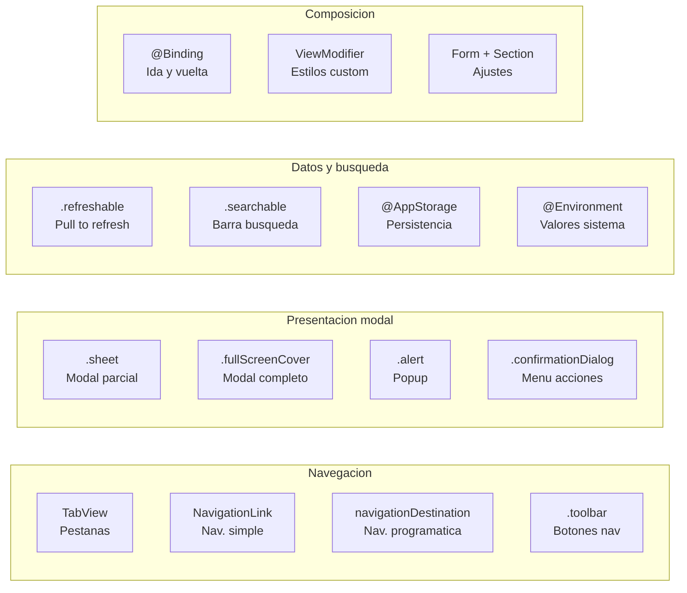

# SwiftUI Enterprise — Parte 2: Composición, Rendimiento y APIs

> Continuación de [Parte 1](./07a-swiftui-enterprise-navegacion.md). Secciones 10–17.

**Navegación:** [← Parte 1](./07a-swiftui-enterprise-navegacion.md) · [Parte 3: Liquid Glass y Ejercicio →](./07c-swiftui-enterprise-moderno.md)

---


## 10. NavigationLink vs navigationDestination

### Cuando usar cada uno

Ya usamos `navigationDestination(for:)` con `NavigationPath` en la lección de navegación. Pero `NavigationLink` sigue siendo útil en ciertos casos.

| | `NavigationLink` | `navigationDestination` |
|---|---|---|
| **Uso** | Navegación simple, directa | Navegación programatica, coordinada |
| **Control** | La vista decide adonde ir | El coordinador decide |
| **Cuando usarlo** | Pantallas de ajustes, contenido estático | Features complejas, flujos de negocio |
| **Ejemplo** | Ajustes → Licencias | Catálogo → Detalle producto |

```swift
// NavigationLink: la vista sabe adonde ir
NavigationLink("Ver licencias") {
    LicensesView()
}

// navigationDestination: el coordinador decide
Button("Ver detalle") {
    coordinator.path.append(AppDestination.productDetail(product))
}
// + en el NavigationStack:
.navigationDestination(for: AppDestination.self) { ... }
```

**Regla practica:** Si la navegación es parte de un **flujo de negocio** (login → catálogo → detalle), usa `navigationDestination` con coordinador. Si es **contenido estático** (ajustes → licencias → sobre nosotros), usa `NavigationLink` directamente.

---

## 11. ViewModifier — Modifiers personalizados

### Que es

Un `ViewModifier` es un modifier reutilizable que encapsula estilos o comportamientos que aplicas repetidamente. En vez de copiar y pegar `.font(.headline).foregroundStyle(.primary).padding()` en 20 sitios, creas un modifier custom.

### Ejemplo: estilo de tarjeta

```swift
struct CardStyle: ViewModifier {
    func body(content: Content) -> some View {
        content
            .padding()
            .background(.background)
            .clipShape(RoundedRectangle(cornerRadius: 12))
            .shadow(color: .black.opacity(0.1), radius: 4, y: 2)
    }
}

extension View {
    func cardStyle() -> some View {
        modifier(CardStyle())
    }
}
```

**Uso:**

```swift
ProductRow(product: product)
    .cardStyle()
```

**Explicacion:**

`struct CardStyle: ViewModifier` — Un struct que conforma el protocolo `ViewModifier`. Define como transformar una vista.

`func body(content: Content) -> some View` — Recibe la vista original (`content`) y devuelve la vista modificada. Aquí le anadimos padding, fondo, esquinas redondeadas, y sombra.

`extension View { func cardStyle() ... }` — Una extensión sobre `View` que permite usar `.cardStyle()` como cualquier modifier nativo. Sin está extensión, tendrias que escribir `.modifier(CardStyle())` que es menos legible.

### Donde vive

Los modifiers personalizados viven en la **capa Interface**, generalmente en una carpeta `Components/` o `Modifiers/` compartida.

---

## Resumen: mapa de conceptos SwiftUI enterprise

Antes del diagrama, fija los ejes: **Navegación** (`TabView`, `NavigationLink`, `navigationDestination`, `.toolbar`), **Presentacion modal** (`.sheet`, `.fullScreenCover`, `.alert`, `.confirmationDialog`), **Datos y busqueda** (`.refreshable`, `.searchable`, ``, ``) y **Composición** (``, `ViewModifier`, `Form`, `Section`).

La lectura correcta es de izquierda a derecha: navegación y presentacion organizan flujo UI; datos y busqueda conectan estado; composición estandariza estilos y reutilizacion para mantener coherencia enterprise.



Lectura del diagrama:

→ **Navegación** organiza el flujo entre pantallas: `TabView` estructura la app en secciones, `NavigationLink` y `navigationDestination` controlan la profundidad dentro de cada sección, `.toolbar` aporta las acciones contextuales de cada pantalla.

→ **Presentación modal** interrumpe el flujo cuando la tarea requiere atención o confirmación: `.sheet` para tareas opcionales que el usuario puede cancelar, `.fullScreenCover` para tareas obligatorias, `.alert` para decisiones binarias, `.confirmationDialog` para selección entre varias opciones.

→ **Datos y búsqueda** conectan el estado del sistema con la UI: `.refreshable` y `.searchable` actúan directamente sobre datos del ViewModel, `@AppStorage` persiste preferencias simples localmente, `@Environment` da acceso a contexto del sistema (modo oscuro, zona horaria, dismiss).

→ **Composición** estandariza la presentación: `@Binding` propaga cambios entre padre e hijo, `ViewModifier` encapsula estilos repetidos, `Form + Section` estructura pantallas de configuración siguiendo las convenciones iOS.

---

## 12. @Bindable — El compañero de @Observable

### Que es

`@Bindable` es un property wrapper que crea **bindings** a partir de un objeto `@Observable` inyectado. Es el compañero moderno de `@Observable` que falta en la explicacion anterior.

### Cuando usarlo

Ya sabemos:
- `@State` = "Yo SOY el dueno del dato"
- `@Binding` = "Me prestaron acceso a un valor simple"

Ahora anadimos:
- `@Bindable` = "Me inyectaron un objeto `@Observable` y necesito crear bindings de sus propiedades"

### Ejemplo real

```swift
// El ViewModel (observable)
@Observable @MainActor
final class ProfileViewModel {
    var name: String = ""
    var email: String = ""
    var notificationsEnabled: Bool = true
}

// Vista que POSEE el ViewModel (usa @State)
struct ProfileScreen: View {
    @State private var viewModel = ProfileViewModel()

    var body: some View {
        // Puede crear bindings directamente: $viewModel.name
        ProfileForm(viewModel: viewModel)
    }
}

// Vista HIJA que RECIBE el ViewModel (usa @Bindable)
struct ProfileForm: View {
    @Bindable var viewModel: ProfileViewModel

    var body: some View {
        Form {
            TextField("Nombre", text: $viewModel.name)
            TextField("Email", text: $viewModel.email)
            Toggle("Notificaciones", isOn: $viewModel.notificationsEnabled)
        }
    }
}
```

**Explicacion:**

`ProfileScreen` posee el ViewModel con `@State` — puede hacer `$viewModel.name` para crear bindings.

`ProfileForm` recibe el ViewModel inyectado. Sin `@Bindable`, no podria hacer `$viewModel.name` — el compilador diria que `viewModel` no es un binding. `@Bindable` habilita la sintaxis `$` en objetos `@Observable` inyectados.

### Guia rapida de property wrappers (tabla definitiva)

| Wrapper | Uso | Ejemplo |
|---|---|---|
| `@State` | Vista posee un valor o un `@Observable` | `@State private var count = 0` |
| `@Binding` | Vista hija modifica un valor del padre | `@Binding var isOn: Bool` |
| `@Bindable` | Vista hija necesita bindings de un `@Observable` inyectado | `@Bindable var viewModel: VM` |
| `let` | Vista recibe un valor de solo lectura | `let product: Product` |
| `@Environment` | Vista lee valores del sistema | `@Environment(\.dismiss) var dismiss` |
| `@AppStorage` | Persistencia simple en UserDefaults | `@AppStorage("theme") var theme = "light"` |

**Regla de oro:** Si ves `@StateObject` o `@ObservedObject` en código nuevo, es legacy. Usa `@State` + `@Observable` y `@Bindable` en su lugar.

---

## 13. Performance — Listas rapidas y eficientes

### LazyVStack y LazyHStack

En el curso usamos `List` para el catálogo. Pero a veces necesitas más control sobre el layout. Para eso existen los **lazy stacks**:

```swift
// VStack normal: CREA todas las vistas de golpe (lento con 1000 items)
ScrollView {
    VStack {
        ForEach(products, id: \.id) { product in
            ProductRow(product: product)
        }
    }
}

// LazyVStack: SOLO crea las vistas visibles en pantalla (rapido siempre)
ScrollView {
    LazyVStack {
        ForEach(products, id: \.id) { product in
            ProductRow(product: product)
        }
    }
}
```

**Explicacion:**

`VStack` crea TODAS las vistas inmediatamente — si tienes 1000 productos, crea 1000 `ProductRow` aunque solo 10 sean visibles. Esto gasta memoria y CPU.

`LazyVStack` solo crea las vistas que estan **visibles en pantalla**. Cuando el usuario hace scroll, crea las nuevas y destruye las que ya no se ven. Es la diferencia entre cargar un libro entero en memoria vs leer una página a la vez.

**Regla:** Usa `LazyVStack`/`LazyHStack` siempre que tengas más de ~20 elementos en un `ScrollView`. Para listas simples, `List` ya es lazy internamente.

### Identidad estable en ForEach

```swift
// MAL: usar indices (la identidad cambia al reordenar)
ForEach(products.indices, id: \.self) { index in
    ProductRow(product: products[index])
}

// BIEN: usar identidad estable
ForEach(products, id: \.id) { product in
    ProductRow(product: product)
}
```

**Por que importa:** SwiftUI usa la identidad (el `id`) para saber que vista corresponde a que dato. Si usas `.indices`, al eliminar el producto 3, SwiftUI cree que el producto 4 es el 3 (porque ahora tiene indice 3). Esto causa animaciones incorrectas y bugs visuales. Con `\.id`, SwiftUI sabe que cada vista corresponde a un producto concreto, sin importar su posición.

### No filtrar dentro de ForEach

```swift
// MAL: filtra en cada re-render
ForEach(products.filter { $0.price.amount > 10 }, id: \.id) { product in
    ProductRow(product: product)
}

// BIEN: prefiltra y cachea
let expensiveProducts = products.filter { $0.price.amount > 10 }
ForEach(expensiveProducts, id: \.id) { product in
    ProductRow(product: product)
}
```

Cada vez que SwiftUI re-renderiza la vista, ejecuta `body`. Si el filtrado está dentro de `ForEach`, se ejecuta cada vez. Pre-filtrando fuera, el resultado se cachea y el `ForEach` solo itera.

### Pasar solo lo necesario a las subvistas

```swift
// MAL: la fila recibe todo el ViewModel
struct ProductRow: View {
    let viewModel: CatalogViewModel  // Cualquier cambio en el VM re-renderiza la fila
    // ...
}

// BIEN: la fila recibe solo lo que necesita
struct ProductRow: View {
    let product: Product  // Solo se re-renderiza si ESE producto cambia
    // ...
}
```

Si pasas un objeto grande (ViewModel, contexto), cualquier cambio en cualquier propiedad de ese objeto re-renderiza la fila. Pasando solo el dato necesario, la fila solo se actualiza cuando su dato cambia.

---

## 14. Animaciones — Transiciones profesionales

### withAnimation

`withAnimation` envuelve un cambio de estado y SwiftUI anima la transición entre el estado viejo y el nuevo:

```swift
// Sin animacion: el cambio es instantaneo (salta)
viewModel.state = .loaded(products)

// Con animacion: SwiftUI interpola entre estados
withAnimation(.easeInOut(duration: 0.3)) {
    viewModel.state = .loaded(products)
}
```

**Explicacion:**

`withAnimation` NO anima el código dentro del bloque. Lo que hace es decirle a SwiftUI: "el cambio que voy a hacer dentro de este bloque, animalo". SwiftUI detecta que propiedades cambiaron y genera una animación fluida entre el estado anterior y el nuevo.

`.easeInOut(duration: 0.3)` — La curva de animación. `easeInOut` empieza lento, acelera, y termina lento (0.3 segundos). Otras opciones: `.spring()` (rebote natural), `.linear` (velocidad constante), `.bouncy` (rebote divertido).

### .animation en la vista

Para animar cambios automáticamente cuando una propiedad cambia:

```swift
Text(product.name)
    .opacity(isVisible ? 1 : 0)
    .animation(.easeIn, value: isVisible)
```

`.animation(.easeIn, value: isVisible)` — Cada vez que `isVisible` cambia, SwiftUI anima la opacidad. **Siempre especifica `value:`** para decirle a SwiftUI QUE cambio observar. Sin `value:`, SwiftUI anima TODO lo que cambie en esa vista, causando animaciones inesperadas.

### .transition — Animación de aparicion/desaparicion

```swift
if showDetails {
    Text("Detalles del producto...")
        .transition(.slide)
}
```

`.transition(.slide)` — Cuando `showDetails` pasa a `true`, el texto aparece deslizandose. Cuando pasa a `false`, desaparece deslizandose. Otros: `.opacity` (fade), `.scale` (crece/encoge), `.move(edge: .bottom)` (desde un borde).

**Importante:** `.transition` solo funciona si el cambio que controla `showDetails` está dentro de `withAnimation`:

```swift
withAnimation {
    showDetails.toggle()
}
```

### .contentTransition — Animar cambios de contenido

```swift
Text("\(cartCount) items")
    .contentTransition(.numericText())
```

Cuando `cartCount` cambia de 3 a 4, el número hace una animación de "ticker" (como un contador de kilometros). Sin `.contentTransition`, el texto simplemente salta de "3" a "4".

---

## 15. Accesibilidad — No es opcional

### Por que

En muchos paises (USA, EU), las apps deben ser accesibles por ley. Además, el 15% de la poblacion mundial tiene alguna discapacidad. Apple revisa la accesibilidad en el proceso de App Store Review. En enterprise, es un **requisito no negociable**.

### Los basicos

```swift
// Imagen decorativa (VoiceOver la ignora)
Image("background")
    .accessibilityHidden(true)

// Boton con imagen — VoiceOver necesita saber que hace
Button {
    viewModel.addToCart(product)
} label: {
    Image(systemName: "cart.badge.plus")
}
.accessibilityLabel("Anadir \(product.name) al carrito")

// Informacion adicional para VoiceOver
ProductRow(product: product)
    .accessibilityLabel("\(product.name), \(product.price.formatted)")
    .accessibilityHint("Pulsa dos veces para ver el detalle")
```

**Explicacion:**

`.accessibilityLabel("...")` — Lo que VoiceOver **lee en voz alta**. Sin esto, un botón con solo un icono diria "botón" y el usuario ciego no sabria que hace.

`.accessibilityHint("...")` — Instrucción adicional sobre que pasa al interactuar. VoiceOver lo lee despues del label, tras una pausa.

`.accessibilityHidden(true)` — Hace que VoiceOver ignore este elemento. Para imágenes decorativas que no aportan información.

### Texto dinámico (Dynamic Type)

Los usuarios pueden cambiar el tamaño del texto en Ajustes del iPhone. Tu app debe respetar esto:

```swift
// BIEN: usa fuentes del sistema que escalan automaticamente
Text(product.name)
    .font(.headline)

// MAL: tamano fijo que ignora las preferencias del usuario
Text(product.name)
    .font(.system(size: 16))
```

Las fuentes semánticas (`.headline`, `.body`, `.caption`) escalan automáticamente con Dynamic Type. Las fuentes con tamaño fijo no.

### Checklist de accesibilidad

- [ ] Todos los botones con icono tienen `.accessibilityLabel`
- [ ] Las imágenes decorativas tienen `.accessibilityHidden(true)`
- [ ] Las listas tienen labels descriptivos en cada fila
- [ ] Usas fuentes semánticas (`.headline`, `.body`), no tamanos fijos
- [ ] Tu app funciona con VoiceOver activado (probalo en el simulador: Settings → Accessibility → VoiceOver)

---

## 16. APIs Modernas — Lo que debes usar (y lo que NO)

Tu skill de SwiftUI Expert define estas correcciones que debes aplicar en cualquier proyecto:

### Tabla de reemplazos obligatorios

| Deprecado / Incorrecto | Moderno / Correcto | Por que |
|---|---|---|
| `foregroundColor(.red)` | `foregroundStyle(.red)` | Acepta gradientes y estilos, no solo colores |
| `cornerRadius(8)` | `clipShape(.rect(cornerRadius: 8))` | Más flexible, soporta formas custom |
| `.tabItem { ... }` | `Tab("titulo", systemImage: "icon") { ... }` | API moderna iOS 18+ |
| `.onTapGesture { }` | `Button { } label: { }` | Accesible para VoiceOver, focus, teclado |
| `NavigationView` | `NavigationStack` | Moderno, soporta NavigationPath |
| `onChange(of: x) { value in }` | `onChange(of: x) { old, new in }` | API con 2 parametros o sin parametros |
| `GeometryReader` | `containerRelativeFrame()` | Más eficiente, sin layout thrash |
| `String(format: "%.2f", val)` | `Text(val, format: .number.precision(...))` | Localizado automáticamente |
| `string.contains(search)` | `string.localizedStandardContains(search)` | Ignora mayusculas, acentos, idioma |

### onTapGesture vs Button

Este es un error **muy comun** en código junior:

```swift
// INCORRECTO: VoiceOver no puede interactuar con esto
ProductRow(product: product)
    .onTapGesture { viewModel.selectProduct(product) }

// CORRECTO: accesible, focusable, soporte de teclado
Button {
    viewModel.selectProduct(product)
} label: {
    ProductRow(product: product)
}
.buttonStyle(.plain)  // Quita el estilo azul de boton
```

`onTapGesture` es invisible para VoiceOver — un usuario ciego no puede interactuar con esa fila. `Button` es accesible por defecto. `.buttonStyle(.plain)` quita el estilo visual de botón para que la fila se vea igual.

**Regla:** Usa `Button` siempre que algo sea interactivo. Usa `onTapGesture` solo si necesitas la posición del toque o el conteo de toques (doble tap, triple tap).

### .task(id:) — Tareas dependientes de un valor

```swift
struct ProductDetailView: View {
    let productId: String
    @State private var product: Product?

    var body: some View {
        Group {
            if let product {
                Text(product.name)
            } else {
                ProgressView()
            }
        }
        .task(id: productId) {
            product = await loadProduct(productId)
        }
    }
}
```

`.task(id: productId)` — Como `.task` pero se **re-ejecuta** cada vez que `productId` cambia. Si el usuario navega del producto A al producto B, `.task(id:)` cancela la carga del A y empieza la del B automáticamente. Sin `id:`, solo se ejecutaria una vez.

### .sheet(item:) en vez de .sheet(isPresented:)

```swift
// Correcto: el sheet recibe directamente el dato
@State private var selectedProduct: Product?

.sheet(item: $selectedProduct) { product in
    ProductDetailView(product: product)
}

// Menos correcto: necesitas un booleano + un estado separado
@State private var showDetail = false
@State private var selectedProduct: Product?

.sheet(isPresented: $showDetail) {
    if let product = selectedProduct {
        ProductDetailView(product: product)
    }
}
```

`.sheet(item:)` es más limpio: cuando el valor no es nil, el sheet se abre CON ese dato. Cuando se cierra, el valor vuelve a nil. No necesitas un booleano extra. El tipo debe conformar `Identifiable`.

---

## 17. View Composition — Vistas reutilizables

### @ViewBuilder — Construir vistas como bloques

`@ViewBuilder` permite crear funciones o propiedades que devuelven **multiples vistas**, igual que `body`:

```swift
struct ContentCard<Content: View>: View {
    let title: String
    @ViewBuilder let content: Content

    var body: some View {
        VStack(alignment: .leading, spacing: 8) {
            Text(title)
                .font(.headline)
            content
        }
        .padding()
        .background(.background)
        .clipShape(.rect(cornerRadius: 12))
    }
}

// Uso:
ContentCard(title: "Producto") {
    Text(product.name)
    Text(product.price.formatted)
        .foregroundStyle(.secondary)
}
```

**Explicacion:**

`@ViewBuilder let content: Content` — El skill recomienda está forma sobre closures. `@ViewBuilder` permite que el bloque `{ ... }` contenga multiples vistas (como `body`). `Content` es un **tipo genérico** que representa "cualquier vista que me pases".

### Preferir modifiers sobre condicionales

```swift
// MAL: cambia la identidad de la vista (SwiftUI la destruye y recrea)
if isHighlighted {
    Text(product.name)
        .foregroundStyle(.blue)
        .bold()
} else {
    Text(product.name)
        .foregroundStyle(.primary)
}

// BIEN: misma vista, solo cambian las propiedades (SwiftUI anima el cambio)
Text(product.name)
    .foregroundStyle(isHighlighted ? .blue : .primary)
    .bold(isHighlighted)
```

Cuando usas `if/else` para mostrar vistas diferentes, SwiftUI las trata como **vistas distintas**. Las destruye y recrea, perdiendo estado y animaciones. Con modifiers condicionales, SwiftUI sabe que es la **misma vista** con propiedades diferentes, y puede animar la transición suavemente.

### containerRelativeFrame — Tamanos relativos sin GeometryReader

```swift
// ANTES: GeometryReader (causa layout thrash, complejo)
GeometryReader { geometry in
    Image("banner")
        .frame(width: geometry.size.width, height: geometry.size.width * 0.5)
}

// AHORA: containerRelativeFrame (limpio, eficiente)
Image("banner")
    .containerRelativeFrame(.horizontal) { width, _ in
        width  // Usa todo el ancho disponible
    }
    .frame(height: 200)
```

`containerRelativeFrame` es el reemplazo moderno de `GeometryReader` para la mayoria de casos. Es más eficiente porque no causa multiples pasadas de layout.

---

## Implementación en tu proyecto

Los patrones de rendimiento y composición de esta lección aplican directamente sobre las vistas del scaffold. Aquí los archivos relevantes y las divergencias con los ejemplos del curso.

### Archivos del scaffold

| Archivo | Qué aplicar |
|---|---|
| `Sources/FeatureCatalogInterface/CatalogView.swift` | `LazyVStack`, identidad estable, `Button` vs `onTapGesture` |
| `Sources/FeatureCatalogInterface/` | `ViewModifier` compartido (`CardStyle`, estilos de fila) |
| `Sources/FeatureLoginInterface/LoginView.swift` | Accesibilidad en campos de texto y botón de login |

### Divergencias críticas respecto a los ejemplos del curso

**1. `product.name` no existe — es `product.title`**

Los ejemplos de accesibilidad, animaciones y rendimiento del curso usan `product.name`. El scaffold tiene `product.title`:

```swift
// ✅ Scaffold real
.accessibilityLabel("\(product.title), \(product.price.formatted(.number))")
Button {
    viewModel.selectProduct(product)
} label: {
    Text(product.title)
}
```

**2. `product.price` es `Double`, no un tipo `Price`**

Los ejemplos usan `product.price.amount > 10` y `product.price.formatted`. En el scaffold `price` es `Double`:

```swift
// ✅ Scaffold real
let expensive = products.filter { $0.price > 10.0 }
Text(product.price.formatted(.number.precision(.fractionLength(2))))
```

**3. `viewModel.state = .loaded(products)` no existe**

Los ejemplos de animación usan `enum State`. El scaffold usa propiedades separadas:

```swift
// ✅ Scaffold real — animar cambio de estado
withAnimation(.easeInOut(duration: 0.3)) {
    viewModel.products = newProducts  // NO existe: setter público
}
// En la práctica, la animación se aplica al container que observa isLoading:
Group {
    if viewModel.isLoading {
        ProgressView()
    } else {
        List(viewModel.products, id: \.id) { ... }
    }
}
.animation(.easeInOut, value: viewModel.isLoading)
```

**4. `@StateObject` / `@ObservedObject` son legacy**

Si ves `@StateObject` o `@ObservedObject` en el scaffold o en ejemplos de curso anteriores a esta lección, son el patrón antiguo. El scaffold moderno usa `@Observable` + `@State`:

```swift
// ✅ Scaffold actual
@Observable @MainActor
final class CatalogViewModel { ... }

// En la vista:
@State private var viewModel: CatalogViewModel
```

### Ejercicio: aplicar `Button` + accesibilidad al CatalogView del scaffold

1. Abre `Sources/FeatureCatalogInterface/CatalogView.swift`
2. Encuentra las filas con `.onTapGesture` y cámbialas a `Button { } label: { }.buttonStyle(.plain)`
3. Añade `.accessibilityLabel("\(product.title), \(product.price.formatted(.number)) euros")` a cada fila
4. Ejecuta los tests — si tienes `CatalogViewTests`, deben pasar sin cambios (la lógica no cambia)
5. Prueba con VoiceOver en el simulador (Settings → Accessibility → VoiceOver) para verificar que cada fila se anuncia correctamente

---

## Qué sigue

[**Parte 3: Liquid Glass, APIs modernas iOS 26 y ejercicio completo →**](./07c-swiftui-enterprise-moderno.md) — Las APIs de iOS 26 (`.glassEffect`, materiales, `MeshGradient`), tabla completa de deprecaciones, y el ejercicio guiado que integra todo lo aprendido en las tres partes.
