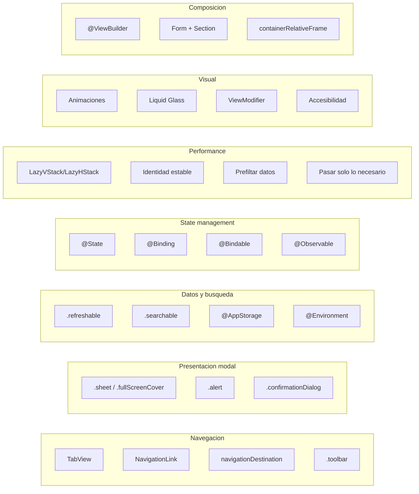

# SwiftUI Enterprise — Parte 3: Liquid Glass, Ejercicio y Cierre

> Continuación de [Parte 2](./07b-swiftui-enterprise-composicion.md). Sección 18, resumen final, ejercicio guiado y cierre.

**Navegación:** [← Parte 2](./07b-swiftui-enterprise-composicion.md) · [← Índice](./07-swiftui-enterprise.md)

---


## 18. Liquid Glass — iOS 26+ (El futuro del diseño iOS)

### Que es

Liquid Glass es el nuevo paradigma visual de Apple introducido en iOS 26 (WWDC 2025). Los elementos de UI tienen un efecto de cristal translucido y dinámico que reacciona al contenido que hay detrás. Es el mayor cambio visual de iOS desde iOS 7.

### Como se aplica

```swift
// Efecto glass basico con fallback para versiones anteriores
if #available(iOS 26, *) {
    content
        .padding()
        .glassEffect(.regular.interactive(), in: .rect(cornerRadius: 16))
} else {
    content
        .padding()
        .background(.ultraThinMaterial, in: RoundedRectangle(cornerRadius: 16))
}
```

**Explicacion:**

`#available(iOS 26, *)` — Verifica en tiempo de ejecución si el dispositivo tiene iOS 26 o superior. El `*` significa "y cualquier otra plataforma". Es obligatorio cuando usas APIs nuevas que no existen en versiones anteriores.

`.glassEffect(.regular.interactive(), in: .rect(cornerRadius: 16))` — Aplica el efecto Liquid Glass. `.regular` es el estilo estandar. `.interactive()` indica que el elemento es tocable (botón, fila). `in:` define la forma del cristal.

**Fallback:** Para iOS < 26, usamos `.ultraThinMaterial` que da un efecto similar (pero no tan bonito).

### Agrupar elementos glass

```swift
if #available(iOS 26, *) {
    GlassEffectContainer(spacing: 24) {
        HStack(spacing: 24) {
            Button("Aceptar") { accept() }
                .buttonStyle(.glassProminent)

            Button("Cancelar") { cancel() }
                .buttonStyle(.glass)
        }
    }
}
```

`GlassEffectContainer` — Agrupa multiples elementos glass para que compartan el mismo efecto visual. Sin el contenedor, cada botón tendria su propio glass independiente (no se fusionan).

`.buttonStyle(.glassProminent)` — Estilo de botón glass prominente (más visible). `.glass` es la variante normal.

### Reglas del skill para Liquid Glass

1. **Solo adoptar cuando se pida explicitamente** — No migrar todo a glass automáticamente.
2. Aplicar `.glassEffect()` **despues** de modifiers de layout y apariencia (padding, frame, etc.).
3. Usar `.interactive()` **solo** en elementos tocables/focusables.
4. Envolver multiples elementos glass en `GlassEffectContainer`.
5. **Siempre** proporcionar fallback con `#available` para versiones anteriores.

---

## Resumen: mapa completo de conceptos SwiftUI enterprise



Lectura del diagrama:

→ **Navegación** (`TabView`, `NavigationLink`, `navigationDestination`, `.toolbar`) — define cómo el usuario se mueve entre pantallas y qué acciones tiene disponibles en cada una.

→ **Presentación modal** (`.sheet`, `.fullScreenCover`, `.alert`, `.confirmationDialog`) — interrumpe el flujo con tareas secundarias o confirmaciones. El criterio de elección es si la tarea es opcional (`.sheet`) u obligatoria (`.fullScreenCover`), y si la decisión es binaria (`.alert`) o múltiple (`.confirmationDialog`).

→ **Datos y búsqueda** (`.refreshable`, `.searchable`, `@AppStorage`, `@Environment`) — conectan el sistema con la UI. `.refreshable` y `.searchable` activan el ViewModel; `@AppStorage` persiste preferencias sin capa de Infrastructure; `@Environment` da acceso a contexto del sistema.

→ **State management** (`@State`, `@Binding`, `@Bindable`, `@Observable`) — determina la propiedad del dato. La regla es: quien crea el dato usa `@State`; quien recibe un valor simple usa `@Binding`; quien recibe un objeto observable inyectado y necesita bindings de sus propiedades usa `@Bindable`.

→ **Performance** (`LazyVStack`, identidad estable, pre-filtrado, datos mínimos) — cuatro reglas que se aplican juntas. Ninguna es difícil por separado, pero olvidar una puede degradar listas de 1000 elementos de 60fps a 20fps.

→ **Visual** (animaciones, Liquid Glass, `ViewModifier`, accesibilidad) — la capa de presentación. `ViewModifier` estandariza estilos, Liquid Glass es el futuro visual de iOS 26+, y accesibilidad es un requisito legal en muchos mercados enterprise.

→ **Composición** (`@ViewBuilder`, `Form + Section`, `containerRelativeFrame`) — herramientas para construir vistas reutilizables y layouts adaptables sin `GeometryReader`.

### Checklist COMPLETO para un junior

Antes de entregar tu primera PR en una app enterprise, asegurate de dominar:

**Navegación y presentación:**
- [ ] `TabView` para organizar secciones
- [ ] `.sheet` / `.fullScreenCover` para modales
- [ ] `.alert` / `.confirmationDialog` para confirmaciones
- [ ] `.toolbar` para botones en barra de navegación
- [ ] `NavigationLink` para navegación simple
- [ ] `navigationDestination` para navegación programatica

**State management:**
- [ ] `@State` para datos propios
- [ ] `@Binding` para datos prestados (modificables)
- [ ] `@Bindable` para `@Observable` inyectados
- [ ] `@Environment` para valores del sistema
- [ ] `@AppStorage` para preferencias persistentes

**Datos y listas:**
- [ ] `.refreshable` para pull-to-refresh
- [ ] `.searchable` para filtrar
- [ ] `.task` y `.task(id:)` para carga asincrona
- [ ] `Form` + `Section` para ajustes

**Performance:**
- [ ] `LazyVStack`/`LazyHStack` para listas largas
- [ ] Identidad estable en `ForEach` (nunca `.indices`)
- [ ] Pre-filtrar datos fuera de `ForEach`
- [ ] Pasar solo datos necesarios a subvistas

**Visual y UX:**
- [ ] `withAnimation` y `.transition` para transiciones
- [ ] `.contentTransition(.numericText())` para contadores
- [ ] `ViewModifier` para estilos reutilizables
- [ ] Liquid Glass con `#available(iOS 26, *)` y fallback

**Accesibilidad (obligatorio):**
- [ ] `.accessibilityLabel` en todos los botones con icono
- [ ] `.accessibilityHidden(true)` en imágenes decorativas
- [ ] Fuentes semánticas (`.headline`, `.body`), no tamanos fijos
- [ ] `Button` en vez de `onTapGesture` para elementos interactivos

**APIs modernas:**
- [ ] `foregroundStyle()` en vez de `foregroundColor()`
- [ ] `clipShape(.rect(cornerRadius:))` en vez de `cornerRadius()`
- [ ] `.sheet(item:)` en vez de `.sheet(isPresented:)` cuando hay dato
- [ ] `localizedStandardContains()` para busqueda de texto

Si dominas estos 28 puntos, estas preparado para cualquier proyecto enterprise en SwiftUI.

---

## Ejercicio guiado: aplicar 3 patrones al scaffold

**Objetivo:** Integrar tres patrones de está lección en la app real del scaffold para consolidar lo aprendido.

**Instrucciones:**

1. Abre `apps/ios/ArchitectureKit/Sources/FeatureCatalogUI/` y localiza la vista de lista de productos.
2. Aplica estos tres patrones:
   - **Pull-to-refresh:** Anade `.refreshable { await viewModel.load() }` a la lista.
   - **Empty state:** Muestra un `ContentUnavailableView` cuando la lista está vacia y no hay error.
   - **Loading state:** Muestra un `ProgressView` mientras `viewModel.isLoading` es true.
3. Verifica que la vista compila con `swift build`.

**Criterios de exito:**

- La vista compila sin warnings.
- Pull-to-refresh invoca el caso de uso real (no un stub hardcodeado).
- El empty state usa `ContentUnavailableView` (iOS 17+), no un `Text` genérico.

**Solución razonada:**

```swift
List {
    ForEach(viewModel.products, id: \.id) { product in
        Text("\(product.title) — \(product.price.formatted(.number))")
    }
}
.refreshable { await viewModel.load() }
.overlay {
    if viewModel.isLoading {
        ProgressView()
    } else if viewModel.products.isEmpty {
        ContentUnavailableView("Sin productos",
            systemImage: "tray",
            description: Text("Desliza hacia abajo para recargar."))
    }
}
```

> **Nota scaffold:** El campo es `product.title` (no `name`) y `product.price` es `Double` (no un tipo `Price`). Usa `id: \.id` en `ForEach` — `\.name` no es `Hashable` ni único.

Estos tres patrones cubren los estados fundamentales de cualquier pantalla de datos: cargando, vacio y con datos. En enterprise, olvidar el empty state o el loading state es una de las causas más frecuentes de mala UX.

<details>
<summary>Solución de referencia</summary>

```swift
struct CatalogScreen: View {
    @State private var viewModel: CatalogViewModel

    var body: some View {
        List(viewModel.products, id: \.id) { product in
            VStack(alignment: .leading, spacing: 4) {
                Text(product.title)
                    .font(.headline)
                Text(product.price.formatted(.number.precision(.fractionLength(2))))
                    .font(.subheadline)
                    .foregroundStyle(.secondary)
            }
        }
        .refreshable {
            await viewModel.load()
        }
        .overlay {
            if viewModel.isLoading {
                ProgressView("Cargando catálogo")
            } else if viewModel.products.isEmpty, viewModel.errorMessage == nil {
                ContentUnavailableView(
                    "Sin productos",
                    systemImage: "shippingbox",
                    description: Text("Desliza hacia abajo para recargar el catálogo.")
                )
            }
        }
        .task {
            if viewModel.products.isEmpty {
                await viewModel.load()
            }
        }
    }
}
```

Aquí se ven juntos los tres patrones pedidos: `refreshable` para intención de usuario, `ProgressView` para estado de carga y `ContentUnavailableView` para vacío sin error. La pantalla sigue delegando reglas al `ViewModel`; SwiftUI solo representa estados observables.
</details>

---

## Cierre

Está lección no es una lista para memorizar. Es un catálogo de patrones que vas a necesitar en cualquier app enterprise. La clave no es aplicarlos todos de golpe, sino saber que existen y elegir los adecuados para cada pantalla. Cuando te enfrentes a una nueva feature, vuelve a está lección y revisa que patrones aplican antes de empezar a codificar.

La siguiente lección complementa esta: si SwiftUI define como se ve la app, Swift Concurrency define como se comporta bajo carga, cancelación y concurrencia real.

---

## Implementación en tu proyecto

El ejercicio guiado de esta lección es directamente aplicable al scaffold real. Aquí los archivos exactos y las divergencias a tener en cuenta.

### Archivos del scaffold

| Archivo | Qué implementar |
|---|---|
| `Sources/FeatureCatalogInterface/CatalogView.swift` | `.refreshable`, `ContentUnavailableView`, `ProgressView` overlay |
| `Sources/FeatureCatalogInterface/` | Liquid Glass en tarjetas de producto (si iOS 26+ target) |

### Divergencias del ejercicio respecto al scaffold

La "Solución razonada" del ejercicio usa la API correcta del scaffold. Las diferencias clave:

| Ejercicio | Scaffold real |
|---|---|
| `product.name` | `product.title` |
| `product.price.formatted()` | `product.price.formatted(.number.precision(.fractionLength(2)))` |
| `id: \.name` | `id: \.id` — siempre usar la propiedad `id` |

### Sobre Liquid Glass en el scaffold

El scaffold tiene target mínimo iOS 17. Para añadir Liquid Glass:

```swift
// En cualquier vista del scaffold
if #available(iOS 26, *) {
    ProductRow(product: product)
        .glassEffect(.regular, in: .rect(cornerRadius: 12))
} else {
    ProductRow(product: product)
        .background(.background)
        .clipShape(.rect(cornerRadius: 12))
}
```

No migres todo el scaffold a Liquid Glass — es una feature de presentación. Aplícala solo donde el diseño lo justifique, siempre con `#available` y fallback.

---

## 🔭 Explora el scaffold — @Observable y APIs modernas

```bash
open apps/ios/ArchitectureKit/Package.swift
# Navega a: Sources/FeatureCatalogUI/CatalogViewModel.swift
```

`CatalogViewModel` ya usa `@Observable @MainActor` — el patrón que reemplaza `ObservableObject + @Published`. Compara la declaración con la tabla de migraciones de esta lección. El scaffold no tiene `@StateObject` ni `@ObservedObject`; si los ves en algún lugar, es candidato a modernización.

```bash
cd apps/ios/ArchitectureKit
swift test --filter FeatureCatalogUITests
```

---


## Qué sigue

[**Lección 11: Swift Concurrency Enterprise →**](./08-swift-concurrency-enterprise.md) — `async/await` avanzado, `actor`, `TaskGroup`, cancelación estructurada, y cómo gestionar concurrencia en una app completa con múltiples features ejecutando en paralelo.
