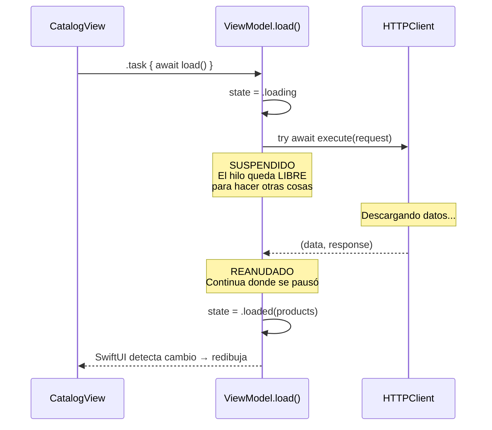
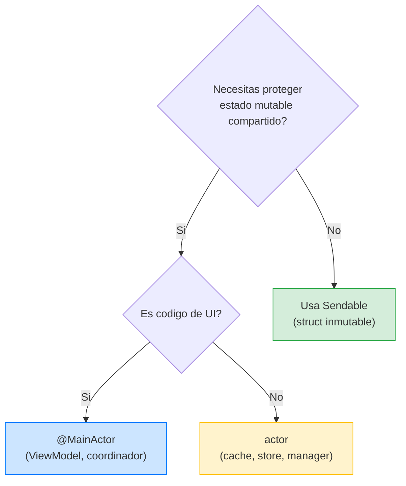
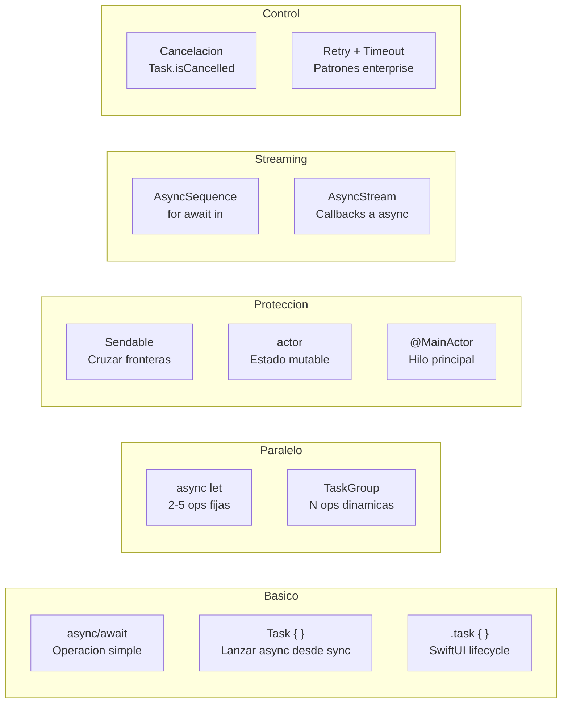

# Swift Concurrency Enterprise: Patrones Imprescindibles

## Por que esta leccion

En las lecciones anteriores usamos `async/await`, `Sendable` y `@MainActor` sin profundizar en como funciona la concurrencia por debajo. Un junior que entre en enterprise va a encontrar `Task`, `TaskGroup`, `async let`, `actor`, cancelacion, `AsyncSequence`, y errores de Swift 6 como "Sending value of non-Sendable type risks causing data races". Esta leccion te prepara para todo eso.

---

## 1. async/await — La base de todo

### Que es

`async/await` permite escribir codigo asincrono (que tarda en completarse, como una peticion de red) como si fuera sincrono (lineal, de arriba a abajo). Sin `async/await`, usariamos closures anidados (callback hell).

### Comparacion visual

```swift
// SIN async/await (callback hell)
func loadProducts(completion: @escaping ([Product]) -> Void) {
    networkClient.fetch("/products") { data, error in
        if let data = data {
            let products = try? JSONDecoder().decode([Product].self, from: data)
            DispatchQueue.main.async {
                completion(products ?? [])
            }
        }
    }
}

// CON async/await (lineal y claro)
func loadProducts() async throws -> [Product] {
    let (data, _) = try await httpClient.execute(request)
    return try JSONDecoder().decode([Product].self, from: data)
}
```

**Explicacion:**

`async` — Marca una funcion como asincrona. Dice: "esta funcion puede pausarse mientras espera algo". No significa que se ejecute en otro hilo — significa que **puede suspenderse**.

`await` — Marca un **punto de suspension**. Cuando Swift llega a un `await`, la funcion se pausa. El hilo queda libre para hacer otras cosas. Cuando la operacion termina, la funcion se reanuda donde se quedo.

`throws` — La funcion puede fallar. `try` acompana a `await` porque la llamada puede tanto suspenderse como fallar.

### El punto de suspension explicado



**Clave:** Mientras `ViewModel.load()` espera la respuesta de red, el hilo **no esta bloqueado**. Puede ejecutar otras tareas. Esto es radicalmente diferente a `DispatchQueue.sync` que bloquea el hilo hasta que termina.

---

## 2. Task — La unidad de trabajo concurrente

### Que es

Un `Task` es un **contexto de ejecucion asincrono**. Piensalo como un trabajador que puedes contratar para hacer un trabajo en paralelo.

### Task no estructurado (lanzar desde codigo sincrono)

```swift
// En un Button action (contexto sincrono):
Button("Cargar") {
    Task {
        await viewModel.load()
    }
}
```

`Task { ... }` — Crea un nuevo contexto async desde codigo sincrono. Lo necesitas porque el action de un `Button` no es `async`. El `Task` "envuelve" el codigo async para que pueda ejecutarse.

**Peligro:** Si la vista desaparece, este `Task` sigue ejecutandose. Por eso en SwiftUI preferimos `.task { }` (que se cancela automaticamente).

### .task vs Task { }

| `.task { }` (structured) | `Task { }` (unstructured) |
|---|---|
| Se cancela automaticamente cuando la vista desaparece | Vive independientemente — puede causar memory leaks |
| No necesitas guardarlo ni cancelarlo manualmente | Necesitas guardar la referencia para cancelar |
| Preferido en SwiftUI | Solo cuando no hay alternativa |

```swift
// PREFERIDO: structured
.task {
    await viewModel.load()
}

// SOLO CUANDO NECESARIO: unstructured
Task {
    await viewModel.load()
}
```

### Cancelacion manual de Task

Si usas `Task { }` no estructurado, puedes cancelarlo manualmente:

```swift
@Observable @MainActor
final class SearchViewModel {
    var results: [Product] = []
    private var searchTask: Task<Void, Never>?

    func search(_ query: String) {
        // Cancelar busqueda anterior
        searchTask?.cancel()

        // Lanzar nueva busqueda
        searchTask = Task {
            // Esperar un poco (debounce) antes de buscar
            try? await Task.sleep(for: .milliseconds(300))

            // Verificar que no nos han cancelado
            guard !Task.isCancelled else { return }

            let results = try? await repository.search(query)
            self.results = results ?? []
        }
    }
}
```

**Explicacion:**

`searchTask?.cancel()` — Cancela la busqueda anterior si aun esta en progreso. Si el usuario escribe rapido "i", "ip", "iph", "ipho", "iphon", "iphone", cancelamos las busquedas intermedias y solo ejecutamos la ultima.

`Task.sleep(for: .milliseconds(300))` — Pausa el Task 300ms (debounce). Si el usuario sigue escribiendo, el Task se cancela antes de que pase ese tiempo.

`Task.isCancelled` — Propiedad booleana que indica si el Task fue cancelado. La cancelacion en Swift es **cooperativa**: el sistema NO mata el Task — solo lo marca como cancelado. Tu codigo debe verificar periodicamente `Task.isCancelled` y salir limpiamente.

---

## 3. async let — Operaciones en paralelo (numero fijo)

### Que es

`async let` lanza multiples operaciones en paralelo cuando sabes cuantas son en tiempo de compilacion.

### Ejemplo: cargar datos de perfil

```swift
func loadProfile() async throws -> ProfileData {
    // Sin async let: SECUENCIAL (uno tras otro) — lento
    // let user = try await fetchUser()      // 2 segundos
    // let posts = try await fetchPosts()     // 1 segundo
    // let photos = try await fetchPhotos()   // 1 segundo
    // Total: 4 segundos

    // Con async let: PARALELO (todos a la vez) — rapido
    async let user = fetchUser()      // Empieza inmediatamente
    async let posts = fetchPosts()     // Empieza inmediatamente
    async let photos = fetchPhotos()   // Empieza inmediatamente

    // Esperar a que todos terminen
    return try await ProfileData(
        user: user,
        posts: posts,
        photos: photos
    )
    // Total: ~2 segundos (el mas lento)
}
```

**Explicacion:**

`async let user = fetchUser()` — Lanza `fetchUser()` inmediatamente en background, pero NO espera el resultado. Es como pedir tres pizzas a la vez en vez de pedir una, esperar, pedir otra, esperar, pedir otra.

`try await ProfileData(user: user, posts: posts, photos: photos)` — Aqui es donde esperas los tres resultados. Si alguno falla, los demas se **cancelan automaticamente** (structured concurrency).

```mermaid
gantt
    title Carga secuencial vs paralela
    dateFormat X
    axisFormat %s

    section Secuencial
    fetchUser     :0, 2
    fetchPosts    :2, 3
    fetchPhotos   :3, 4

    section Paralelo (async let)
    fetchUser     :0, 2
    fetchPosts    :0, 1
    fetchPhotos   :0, 1
```



### Cuando usar async let

- Sabes **cuantas** operaciones son en compilacion (2, 3, 5...).
- Las operaciones son **independientes** (no dependen del resultado de otra).
- Quieres que si una falla, las demas se **cancelen automaticamente**.

---

## 4. TaskGroup — Operaciones en paralelo (numero dinamico)

### Que es

Cuando el numero de operaciones no se conoce en compilacion (ej: descargar N imagenes), usas `TaskGroup`.

### Ejemplo: descargar imagenes de productos

```swift
func loadProductImages(urls: [URL]) async -> [URL: Data] {
    await withTaskGroup(of: (URL, Data?).self) { group in
        // Lanzar una descarga por cada URL
        for url in urls {
            group.addTask {
                let data = try? await httpClient.download(url)
                return (url, data)
            }
        }

        // Recoger resultados a medida que terminan
        var results: [URL: Data] = [:]
        for await (url, data) in group {
            if let data {
                results[url] = data
            }
        }
        return results
    }
}
```

**Explicacion:**

`withTaskGroup(of: (URL, Data?).self)` — Crea un grupo de tareas. El parametro `of:` dice que tipo devuelve cada tarea hija.

`group.addTask { ... }` — Anade una tarea al grupo. Cada tarea se ejecuta en paralelo. Si tienes 50 URLs, se lanzan 50 descargas en paralelo (el sistema gestiona cuantas se ejecutan realmente a la vez).

`for await (url, data) in group` — **AsyncSequence**: itera sobre los resultados a medida que van llegando. No espera a que terminen TODAS — procesa cada resultado tan pronto como esta listo. `for await` es como `for in` pero para datos asincronos.

### async let vs TaskGroup

| `async let` | `TaskGroup` |
|---|---|
| Numero fijo de operaciones | Numero dinamico (array) |
| Conocido en compilacion | Conocido en runtime |
| Mas simple de escribir | Mas flexible |
| Ej: fetchUser + fetchPosts | Ej: descargar N imagenes |

---

## 5. Actor — Proteger estado compartido

### Que es

Un `actor` es como una `class` con un **candado automatico**. Solo una operacion puede ejecutarse dentro del actor a la vez. Esto previene **data races** (dos hilos accediendo al mismo dato simultaneamente).

### El problema sin actor

```swift
// PELIGROSO: class normal accedida desde multiples hilos
class ImageCache {
    private var cache: [URL: Data] = [:]

    func get(_ url: URL) -> Data? {
        cache[url]  // Hilo 1 lee...
    }

    func set(_ url: URL, data: Data) {
        cache[url] = data  // Hilo 2 escribe AL MISMO TIEMPO → CRASH
    }
}
```

### La solucion con actor

```swift
actor ImageCache {
    private var cache: [URL: Data] = [:]

    func get(_ url: URL) -> Data? {
        cache[url]  // Solo un hilo a la vez puede entrar aqui
    }

    func set(_ url: URL, data: Data) {
        cache[url] = data  // Seguro: nadie mas esta accediendo
    }
}

// Uso: requiere await porque el actor puede estar ocupado
let data = await imageCache.get(url)
await imageCache.set(url, data: imageData)
```

**Explicacion:**

`actor ImageCache` — Igual que `class`, pero con serializacion automatica. Cuando el Hilo 1 esta ejecutando `get()`, el Hilo 2 que quiere ejecutar `set()` espera automaticamente hasta que el Hilo 1 termine. No necesitas `DispatchQueue`, `NSLock`, ni `@synchronized`. El compilador lo garantiza.

`await imageCache.get(url)` — **Todo** acceso a un actor desde fuera requiere `await`, porque puede que el actor este ocupado atendiendo otra peticion y tengas que esperar.

### @MainActor — Un actor especial

`@MainActor` es un **actor global** que ejecuta todo en el hilo principal. Ya lo usamos en los ViewModels:

```swift
@Observable @MainActor
final class CatalogViewModel { ... }
```

**Por que:** Las propiedades del ViewModel son leidas por SwiftUI para renderizar. SwiftUI solo renderiza en el hilo principal. Si cambiaras `state` desde un hilo de background, la app crashearia. `@MainActor` previene eso.

**Regla del skill:** No uses `@MainActor` como solucion generica para todo. Solo para codigo que genuinamente necesita el hilo principal (UI, ViewModels). Infraestructura y Domain NO necesitan `@MainActor`.

### Cuando usar cada herramienta



---

## 6. Sendable — Seguridad al cruzar fronteras

### Que es

`Sendable` es un protocolo que dice: "este tipo es seguro para enviarse entre hilos". Ya lo usamos en todos los modelos de dominio. Aqui profundizamos en POR QUE y CUANDO.

### Que tipos son Sendable automaticamente

| Tipo | Sendable? | Por que |
|---|---|---|
| `struct` con todas las propiedades `Sendable` | Si (automatico) | Los structs se copian, no se comparten |
| `enum` con valores asociados `Sendable` | Si (automatico) | Los enums se copian |
| `actor` | Si (siempre) | Los actors serializan acceso |
| `class` normal | **No** | Las clases se comparten por referencia → data race |
| `final class` con propiedades `let` `Sendable` | Si (automatico) | Inmutable → seguro |
| `@Sendable` closure | Si (marcado) | El closure no captura estado mutable |

### Donde se necesita Sendable

Cada vez que un valor cruza una **frontera de aislamiento** (isolation boundary), necesita ser `Sendable`:

```swift
// Frontera 1: de un actor a otro
await mainActorViewModel.state = .loaded(products)  // products debe ser Sendable

// Frontera 2: de sincrono a Task
Task {
    await process(data)  // data debe ser Sendable
}

// Frontera 3: entre TaskGroup y su padre
group.addTask {
    return processedItem  // processedItem debe ser Sendable
}
```

### @unchecked Sendable — Deuda tecnica

A veces necesitas marcar un tipo como Sendable cuando el compilador no puede verificarlo:

```swift
// Solo en test doubles y casos excepcionales
final class HTTPClientStub: HTTPClient, @unchecked Sendable {
    var result: Result<(Data, HTTPURLResponse), Error>
    // ...
}
```

`@unchecked Sendable` — Le dices al compilador: "confio en que esto es thread-safe". Pero si te equivocas, habra data races que el compilador no detectara.

**Reglas del skill:**
1. **Nunca** en codigo de produccion sin justificacion documentada.
2. Si lo usas, crea un ticket/tarea para eliminarlo en el futuro.
3. En tests es aceptable porque los tests son single-threaded en la practica.

---

## 7. Cancelacion cooperativa — Ser buen ciudadano

### Que es

Cuando un Task se cancela (porque la vista desaparecio, el usuario navego atras, o se lanzo una busqueda nueva), Swift NO lo mata inmediatamente. Lo **marca** como cancelado. Tu codigo debe verificarlo y salir limpiamente.

### Como verificar cancelacion

```swift
func processLargeDataset(_ items: [Item]) async throws -> [ProcessedItem] {
    var results: [ProcessedItem] = []

    for item in items {
        // Verificar cancelacion periodicamente
        try Task.checkCancellation()

        let processed = await process(item)
        results.append(processed)
    }

    return results
}
```

**Explicacion:**

`Task.checkCancellation()` — Si el Task fue cancelado, lanza `CancellationError`. El `try` la propaga hacia arriba y la funcion termina limpiamente.

Alternativa manual:

```swift
guard !Task.isCancelled else {
    return results  // Devolver lo que tengamos hasta ahora
}
```

### Por que es importante

Sin verificacion de cancelacion, un Task cancelado sigue ejecutandose hasta el final, desperdiciando CPU, memoria, y bateria. En enterprise, esto es inaceptable: si el usuario navega atras, las operaciones de la pantalla anterior deben detenerse.

`.task` de SwiftUI ya maneja esto por ti — cuando la vista desaparece, cancela el Task. Pero tu codigo **dentro** del Task debe ser cooperativo y verificar `Task.isCancelled` en bucles largos.

---

## 8. AsyncSequence y AsyncStream — Datos que llegan con el tiempo

### Que es

`AsyncSequence` es como un array, pero los elementos llegan **con el tiempo**, no todos de golpe. Piensa en notificaciones push, actualizaciones en tiempo real, o progreso de descarga.

### AsyncSequence nativo (for await)

```swift
// Leer lineas de un archivo una por una (sin cargar todo en memoria)
let url = URL(fileURLWithPath: "/path/to/large-file.txt")
for try await line in url.lines {
    process(line)
}
```

`for try await line in url.lines` — Igual que `for line in array`, pero cada linea llega de forma asincrona. El bucle se pausa esperando la siguiente linea, sin bloquear el hilo.

### AsyncStream — Crear tu propio stream

Cuando necesitas convertir callbacks o delegados en async:

```swift
func observeLocationUpdates() -> AsyncStream<CLLocation> {
    AsyncStream { continuation in
        let delegate = LocationDelegate { location in
            continuation.yield(location)  // Emitir un valor
        }

        continuation.onTermination = { _ in
            delegate.stop()  // Limpiar cuando el consumidor deja de escuchar
        }

        delegate.start()
    }
}

// Uso:
for await location in observeLocationUpdates() {
    updateMap(with: location)
}
```

**Explicacion:**

`AsyncStream { continuation in ... }` — Crea un stream asincrono. La `continuation` es el control remoto: llamas a `.yield(valor)` para emitir valores y `.finish()` para terminar el stream.

`continuation.onTermination` — Se ejecuta cuando el consumidor deja de escuchar (cancelacion, scope terminado). Aqui limpias recursos.

### Cuando usar AsyncSequence

| Patron | Herramienta |
|---|---|
| Una peticion, una respuesta | `async/await` |
| N peticiones en paralelo | `async let` / `TaskGroup` |
| Datos que llegan con el tiempo | `AsyncSequence` / `AsyncStream` |

---

## 9. Patrones enterprise comunes

### Patron: Red + UI update

```swift
@Observable @MainActor
final class ProductListViewModel {
    var products: [Product] = []
    var isLoading = false

    private let repository: any ProductRepository

    func load() async {
        isLoading = true
        defer { isLoading = false }

        do {
            products = try await repository.loadAll()
        } catch {
            products = []
        }
    }
}
```

`defer { isLoading = false }` — Se ejecuta **siempre** al salir de la funcion, sea por exito o por error. Garantiza que `isLoading` se pone en `false` sin importar que pase. Es como un "al salir, apaga la luz".

### Patron: Retry con backoff exponencial

```swift
func withRetry<T>(
    maxAttempts: Int = 3,
    operation: () async throws -> T
) async throws -> T {
    for attempt in 1...maxAttempts {
        do {
            return try await operation()
        } catch where attempt < maxAttempts {
            // Esperar mas tiempo en cada reintento: 1s, 2s, 4s...
            let delay = UInt64(pow(2.0, Double(attempt - 1))) * 1_000_000_000
            try await Task.sleep(nanoseconds: delay)
        }
    }
    return try await operation()  // Ultimo intento
}

// Uso:
let products = try await withRetry {
    try await repository.loadAll()
}
```

### Patron: Timeout

```swift
func withTimeout<T>(
    seconds: TimeInterval,
    operation: @Sendable () async throws -> T
) async throws -> T {
    try await withThrowingTaskGroup(of: T.self) { group in
        group.addTask {
            try await operation()
        }
        group.addTask {
            try await Task.sleep(for: .seconds(seconds))
            throw CancellationError()
        }

        // El primero que termine gana
        let result = try await group.next()!
        group.cancelAll()
        return result
    }
}

// Uso:
let products = try await withTimeout(seconds: 10) {
    try await repository.loadAll()
}
```

**Explicacion:** Lanza dos tareas en paralelo: la operacion real y un timer. Si el timer termina primero (timeout), cancela la operacion. Si la operacion termina primero, cancela el timer.

---

## 10. Swift 6 — Lo que cambia

### Strict concurrency por defecto

En Swift 6, el compilador **rechaza** codigo que podria tener data races. Lo que antes eran warnings se convierten en errores.

### Errores mas comunes en Swift 6

**Error 1: "Sending value of non-Sendable type"**
```swift
// Esto falla en Swift 6
class MyService {  // class NO es Sendable
    func doWork() { }
}

Task {
    let service = MyService()
    await process(service)  // ERROR: MyService no es Sendable
}

// Solucion: hacer Sendable
final class MyService: Sendable {
    func doWork() { }
}
// O mejor: usar struct
struct MyService: Sendable {
    func doWork() { }
}
```

**Error 2: "Main actor-isolated property cannot be accessed from nonisolated context"**
```swift
@MainActor
class ViewModel {
    var name = "Hola"
}

// Esto falla en Swift 6
func process(vm: ViewModel) {
    print(vm.name)  // ERROR: accediendo a @MainActor desde contexto no aislado
}

// Solucion: marcar como async o @MainActor
func process(vm: ViewModel) async {
    print(await vm.name)  // OK: await cruza la frontera
}
```

**Error 3: "Capture of non-Sendable in @Sendable closure"**
```swift
class DataProcessor {
    var data: [String] = []
}

let processor = DataProcessor()
Task {
    processor.data.append("nuevo")  // ERROR: processor no es Sendable
}

// Solucion: usar actor
actor DataProcessor {
    var data: [String] = []
    func add(_ item: String) { data.append(item) }
}

let processor = DataProcessor()
Task {
    await processor.add("nuevo")  // OK: serializado por el actor
}
```

### Como prepararte

1. En Xcode: Build Settings → **Strict Concurrency Checking** = **Complete**
2. Corrige los warnings uno por uno (son los futuros errores de Swift 6)
3. Convierte `class` a `struct` donde sea posible (los structs son Sendable automaticamente)
4. Usa `actor` para estado mutable compartido
5. Marca `@MainActor` solo lo que genuinamente necesita el hilo principal

---

## 11. Anti-patrones — Lo que NUNCA hacer

### Nunca bloquear en async

```swift
// FATAL: bloquear un hilo async con semaforo
func loadData() async -> Data {
    let semaphore = DispatchSemaphore(value: 0)
    var result: Data?

    URLSession(configuration: .default).dataTask(with: url) { data, _, _ in
        result = data
        semaphore.signal()
    }.resume()

    semaphore.wait()  // BLOQUEA el hilo → puede causar deadlock
    return result!
}

// CORRECTO: usar async/await nativo
func loadData() async throws -> Data {
    let session = URLSession(configuration: .default)
    let (data, _) = try await session.data(from: url)
    return data
}
```

`DispatchSemaphore`, `NSLock`, y `pthread_mutex` **nunca** deben usarse en contextos async. Bloquean el hilo del executor, y como el executor tiene un numero limitado de hilos, puedes causar un deadlock donde todas las tareas estan esperando un hilo que esta bloqueado.

### Nunca usar Task.detached sin razon

```swift
// MAL: pierde herencia de contexto (prioridad, actor)
Task.detached {
    await viewModel.load()  // No hereda @MainActor
}

// BIEN: Task normal hereda el contexto
Task {
    await viewModel.load()  // Hereda @MainActor si el padre es @MainActor
}
```

`Task.detached` NO hereda el contexto del padre (prioridad, actor isolation). Solo usalo si necesitas **explicitamente** ejecutar fuera del contexto actual (raro).

### Nunca ignorar la cancelacion

```swift
// MAL: ignora cancelacion, desperdicia recursos
func processItems(_ items: [Item]) async -> [Result] {
    var results: [Result] = []
    for item in items {
        results.append(await process(item))  // Sigue incluso si fue cancelado
    }
    return results
}

// BIEN: cooperativo con cancelacion
func processItems(_ items: [Item]) async throws -> [Result] {
    var results: [Result] = []
    for item in items {
        try Task.checkCancellation()  // Sale si fue cancelado
        results.append(await process(item))
    }
    return results
}
```

---

## Resumen: mapa de concurrencia enterprise



### Checklist de concurrencia para un junior

**Basico (usa a diario):**
- [ ] `async/await` para operaciones asincronas
- [ ] `.task { }` en SwiftUI para carga automatica con cancelacion
- [ ] `Task { }` solo cuando no puedas usar `.task`
- [ ] `try/catch` para manejar errores async

**Paralelo (usa cuando necesites rendimiento):**
- [ ] `async let` para 2-5 operaciones independientes
- [ ] `TaskGroup` para N operaciones dinamicas
- [ ] Entender que `async let` cancela hermanos si uno falla

**Proteccion (usa siempre):**
- [ ] `Sendable` en todos los tipos que cruzan fronteras async
- [ ] `@MainActor` en ViewModels y codigo de UI
- [ ] `actor` para caches, stores, y estado mutable compartido
- [ ] Evitar `@unchecked Sendable` en produccion

**Cancelacion (obligatorio en enterprise):**
- [ ] `Task.checkCancellation()` en bucles largos
- [ ] `Task.isCancelled` para limpiar recursos
- [ ] `defer { }` para garantizar limpieza

**Streaming (cuando los datos llegan con el tiempo):**
- [ ] `for await in` para iterar sobre `AsyncSequence`
- [ ] `AsyncStream` para convertir callbacks a async

**Swift 6 (prepararse ya):**
- [ ] Strict Concurrency = Complete en Build Settings
- [ ] Corregir warnings uno por uno
- [ ] `struct` > `class` donde sea posible
- [ ] `actor` para estado mutable compartido

**Anti-patrones (NUNCA hacer):**
- [ ] No usar `DispatchSemaphore` en contextos async
- [ ] No usar `Task.detached` sin razon documentada
- [ ] No ignorar cancelacion en bucles largos
- [ ] No bloquear hilos con `wait()` o `sleep()` (usar `Task.sleep`)

Si dominas estos puntos, puedes manejar cualquier escenario de concurrencia en enterprise iOS.
